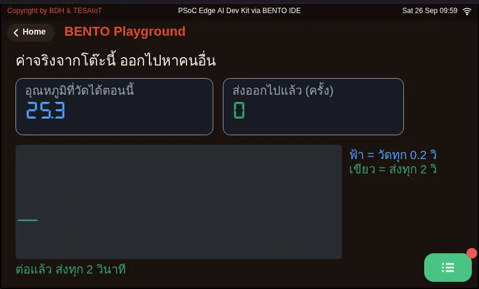

# Lesson 4.6 — Hands-on: two-way telemetry

> Module 4 — IoT Platform Connectivity · Slides: [slides.md](slides.md) · [Module overview](../README.md) · [Course page](../../README.md)

Assemble a two-way MQTT program that publishes real sensor JSON to the team's TESAIoT CE every 5 seconds and takes a toggle command back to switch an LED on the board, in one loop that does not drop commands.

## Objectives

By the end of this lesson you will be able to:

1. Fill the six blanks in s10_mqtt_telemetry.py one move at a time until the board publishes JSON with at least 3 numeric real-sensor fields to device/<device_id>/telemetry every 5 seconds, seen continuously in MQTT Explorer for at least 1 minute
2. Make a {"cmd":"toggle"} command from MQTT Explorer switch the board's LED both on and off, calling get_message() on every 100 ms loop pass instead of sleeping 5 seconds across the loop
3. Explain how client_id, username, device_id and the second topic level must relate, and use the pitfalls table to find the cause of at least three symptoms whose error does not point at the cause
4. Separate the read period from the send period in file 08 (200 ms versus 2000 ms) and explain with numbers why the two should not be equal

## Before you start

This lesson is a lab following on from lessons 4.4–4.5. Before touching code, have everything ready: your own installed TESAIoT CE with port 1883 open for the board on the LAN to reach
(not `127.0.0.1:11883`), a device already registered with a short `device_id` of at most 31 characters, the device's MQTT password,
the IP of the computer running CE, and MQTT Explorer already connected to the same broker, subscribed to `device/#` and waiting.
Review two things from lessons 4.4–4.5: `get_message()` has one receive slot, and `mqtt.publish(topic, payload)` only takes positional arguments.

- **Equipment:** an Eva Kit or TESAIoT Dev Kit board with the BENTO MicroPython firmware installed, or the BENTO Emulator in [BENTO IDE](https://ide.tesaiot.dev/) (code and screens can be rehearsed on the Emulator, but no message reaches TESAIoT CE on your team's LAN — passing the MVP needs a real board)
- **Before this:** [Lesson 4.5 — MQTT with a self-hosted platform: telemetry and commands](../l05-mqtt-platform/README.md)

## Concepts

This lab assembles every piece from lessons 4.4–4.5 into one program. Data travels both ways: outgoing is real-sensor JSON every 5 seconds;
incoming is a command someone else typed to command a light on our board. The LED-toggling item is the heart of the MVP — miss it and all we have is a **device that only sends data**,
not yet **a device that can be commanded**.

The device's identity must match at every point: `client_id`, `username` and `device_id` are the same value, and the second level of the topic must be
`device_id`, exactly matching (`device/<device_id>/telemetry` and `device/<device_id>/commands`). If they do not match, CE's ACL
rejects it, with `publish()` raising not a single error. The payload must be sent flat and as numbers — a string value shows up on the platform but cannot be charted.

The main loop keeps **three clocks**, not one: the send clock (5 seconds, counted with `time.ticks_diff()`), the touch clock
(`ui.poll()` every 200 ms), and `get_message()`, asked every 100 ms loop round, because the receive slot has only one place, and a new message silently overwrites the old.
A team that writes `time.sleep(5)` across the whole loop will find the board never responds to commands. The "stale" lamp on screen is written only when its state changes,
because the screen's command queue has a bottom to it — once full, the firmware drops a text-change command first, leaving a number frozen with no error at all.

Eleven of twelve rows in the slides' pitfalls table **give no error matching the real cause**, so you must read it before hitting the problem. Common examples:
the correct keyword is `keepalive`, not `keep_alive` · `publish()` has no `retain` · an incoming payload is truncated at 255 bytes,
and an incoming topic at 127 bytes · a colliding `client_id` makes two teams alternately kick each other off · `publish()` when the link drops raises `OSError`,
never returning False, so you must check `is_connected()` and wrap it with `try/except OSError`.

File 08 closes the loop with real values: temperature from the SHT40 on the Dev Kit; the Eva Kit has no temperature sensor, so the knob plays that role instead
(0–100% = 15–45 °C), and the console says from the very first round where the value came from. This file measures every 200 ms but sends every 2000 ms; on screen, the green line
(the value really sent) is therefore a staircase under the blue line (the value measured). That is the picture behind the sentence **the screen sees more often than the cloud does**.

## Worked example

Open `08_real_sensor_leaves_the_board.py` after the practice file can already send. Before running, predict what the green line on the chart will look like,
then run it and count from the console how many rounds it measured and how many times it sent. The "your turn" item at the end of the file adds a condition to send only when the value changes by more than 0.3 degrees,
then check how many fewer sends it takes while the destination still sees the same picture. This file sets `TOPIC` to `bento/team03/telemetry`;
to make it chart on your own CE, use the pattern `device/<device_id>/telemetry` per the pitfalls table.

| File | What this file teaches |
|---|---|
| [examples/08_real_sensor_leaves_the_board.py](examples/08_real_sensor_leaves_the_board.py) | A value really measured on this desk, going out to someone else |

**Screens from the BENTO Emulator** for this lesson's examples (click a file name to open the code)

<figure><figcaption><a href="examples/08_real_sensor_leaves_the_board.py"><code>08_real_sensor_leaves_the_board.py</code></a> A value really measured on this desk, going out to someone else</figcaption></figure>

## Practice

Open `practice/s10_mqtt_telemetry.py`. The screen has already been written in full; all six blanks are pure logic. Follow this order, and run every time you finish a blank.

1. Edit the seven lines at the top of the file to your own: `WIFI_SSID`, `WIFI_PASSWORD`, `BROKER` (the IP of the computer running CE, not localhost), `DEVICE_ID`, `MQTT_PASS`, `TOPIC_PUB`, `TOPIC_CMD`
2. Move 1: fill in the `mqtt.connect(...)` line with `username=` and `keepalive=`, then run until the MQTT lamp lights and the console says connected. Never skip ahead to another move first
3. Move 2: fill in the sensor value dict (use `round()` and store numbers) and the line `mqtt.publish(TOPIC_PUB, json.dumps(data))`, then watch MQTT Explorer for messages arriving 5 seconds apart
4. Move 3: fill in `mqtt.subscribe(TOPIC_CMD)` before entering the loop, `msg = mqtt.get_message()` in the loop, and `lamp.value(...)`, then type `{"cmd":"toggle"}` from MQTT Explorer

You know you are done when the WiFi and MQTT lamps light, the "last three" list advances every 5 seconds, and the "remote light" lamp on screen switches together with the real LED.
If move 1 is not yet complete, the MQTT lamp will not light, so the screen can tell you on its own which step it is stuck at.

| Practice file | Topic |
|---|---|
| [practice/s10_mqtt_telemetry.py](practice/s10_mqtt_telemetry.py) | Send telemetry to the broker and take a command back (fill-in version) |

## Solution

Open the solution after trying on your own at least once, and read [how to use the solutions](../../README.md#วิธีใช้เฉลย) first.

| Solution | Goes with |
|---|---|
| [solution/s10_mqtt_telemetry.py](solution/s10_mqtt_telemetry.py) | [practice/s10_mqtt_telemetry.py](practice/s10_mqtt_telemetry.py) |

## Check your understanding

The same questions are in [quiz.yaml](quiz.yaml) for automatic marking.

1. The board publishes with no error, but TESAIoT CE has none of the team's data at all, and MQTT Explorer subscribed to `device/#` sees no message either. What cause does the pitfalls table point to? *(choose one · objective 1)*
   - A) The topic's second level does not match device_id; CE's ACL rejects it, with no error on the board's side at all
   - B) keepalive=60 is set too long
   - C) The payload is too small, so the broker drops it
   - D) retain=True must be added to publish() for the message to stick on the broker

   

Solution

   **A** — CE's ACL rejects a message whose topic's second level does not match device_id, with publish() raising no error. Use device/<device_id>/telemetry, exactly matching. retain does not exist in the real module — passing it raises TypeError.

   

2. A team writes the loop as publish, then time.sleep(5), then get_message() once. During that sleep, someone sends {"cmd":"toggle"} three times in quick succession. What happens? *(choose one · objective 2)*
   - A) The LED toggles three times in order, because the broker queues them for the board
   - B) The board only sees the most recent message; the other two are silently overwritten, because the receive slot has only one place
   - C) The board raises OSError because messages overflowed
   - D) The broker disconnects immediately because the board did not respond

   

Solution

   **B** — get_message() has one receive slot; a new message overwrites the old with no warning. The only fix is to ask often enough, so the loop runs every 100 ms and counts "every five seconds" with ticks_diff instead of stopping to wait.

   

3. For the team's device on TESAIoT CE, which values must equal the registered device_id? Choose every correct one. *(choose all that apply · objective 3)*
   - A) client_id given to mqtt.connect()
   - B) username given to mqtt.connect()
   - C) the topic's second level, such as device/team03/telemetry
   - D) the WIFI_SSID of the network the board joins

   

Solution

   **A, B, C** — CE checks identity with username == client_id == device_id, and its ACL checks the topic's second level, so all three must be the same word. The WiFi network name has nothing to do with it.

   

4. The line `mqtt.connect(BROKER, port=1883, client_id=DEVICE_ID, username=DEVICE_ID, password=MQTT_PASS, keep_alive=60)` raises TypeError immediately. What should you fix? *(choose one · objective 3)*
   - A) Change keep_alive to keepalive
   - B) Change username= to user=
   - C) Remove port=1883
   - D) Pass every argument positionally instead of by keyword

   

Solution

   **A** — The correct keyword is keepalive, per the pitfalls table; keep_alive comes from a document that wrote it wrong. One wrong argument name is enough to raise TypeError immediately. user= is also wrong; the correct one is username=.

   

5. File 08 measures every 200 ms but sends every 2000 ms. If it were changed to send every 200 ms, matching the read period, and fifteen boards sent this way into one broker, what would happen? *(choose one · objective 4)*
   - A) No difference, because the messages are tiny
   - B) About 75 messages a second (5 per second per board); the broker can go down with nobody having written a single line of wrong code
   - C) About 15 messages a second, because one board sends one message
   - D) The broker will merge messages itself down to every 2 seconds

   

Solution

   **B** — Sending every 200 ms is 5 messages a second per board; fifteen boards give 75 messages a second into one broker. Measuring bothers nobody, but sending bothers the broker and everyone else sharing it — which is exactly why these two numbers should not be equal.

   

## Lab

**MVP: two-way.** Do this on a real board with your own CE, and keep evidence in your learning log.

- [ ] MQTT Explorer sees incoming messages on the team's topic 5 seconds apart, continuously for at least 1 minute
- [ ] The payload is valid JSON with at least 3 fields of real sensor data, and the values change when you move the board
- [ ] Typing `{"cmd":"toggle"}` from MQTT Explorer switches the board's LED both on and off
- [ ] Data charts under Device Details → Telemetry on your own installed TESAIoT CE
- [ ] Write an explanation of how `client_id`, `username`, `device_id` and the topic's second level must relate
- [ ] Save screenshots from both the board side and the computer side to your learning log

## Going further

Lesson 4.7 moves from port 1883 to port 8884, which has TLS. Today the board can talk and listen; next is making sure nobody else can eavesdrop.
If there is time, pick one item from the "going further" slides: listen to every device with `device/+/telemetry` and propose a shared schema · extend commands to control
each LED by name from `gpio.board_info()["led_names"]` and publish the state back · measure the 255-byte ceiling by hand yourself · or send only when a value changes, instead of on a timer

Next lesson: [Lesson 4.7 — TLS: certificates, the chain of trust and the handshake](../l07-tls-concepts/README.md)

## Reflect

- If our network dropped for two minutes, should the data from that stretch simply vanish, or should the board keep it to send later?
- Who should decide whether a value is abnormal — the board or the platform?
- If 500 devices sent every 5 seconds, could a single broker keep up, and how would we know before it was too late?
