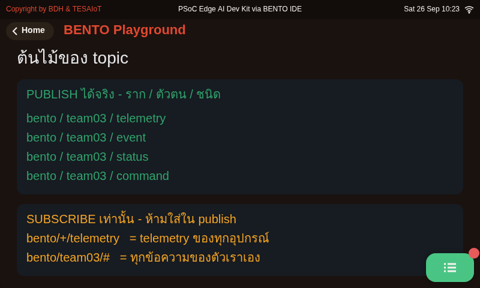
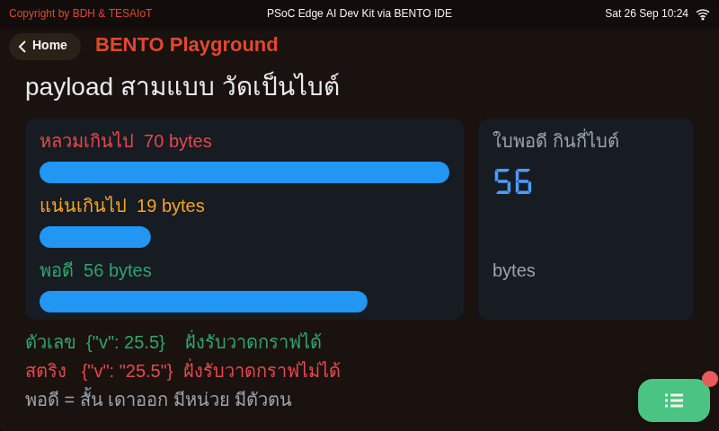
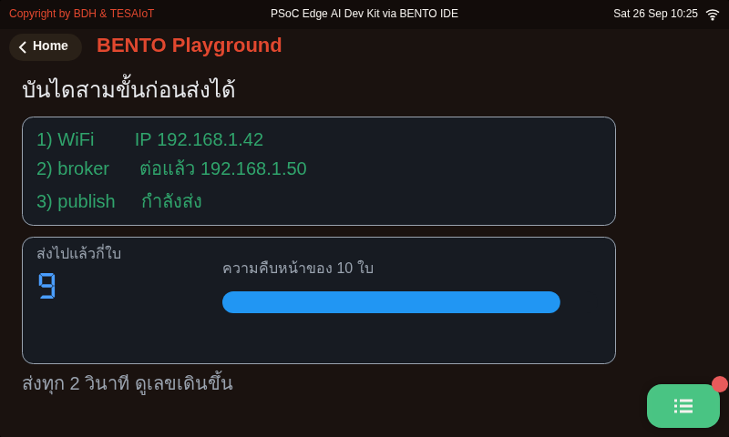
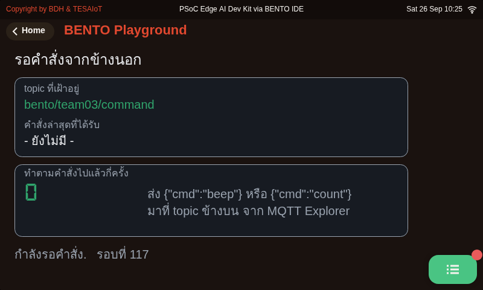
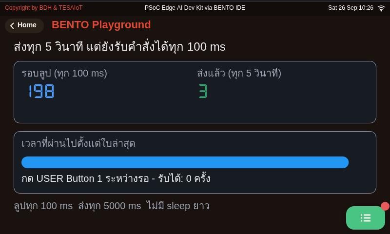
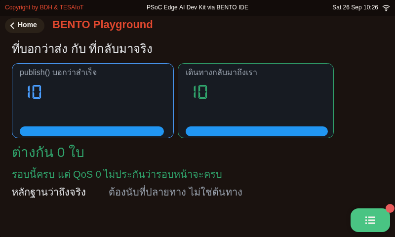
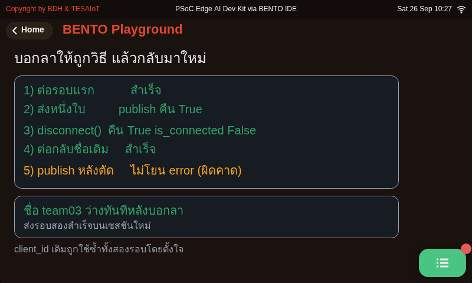
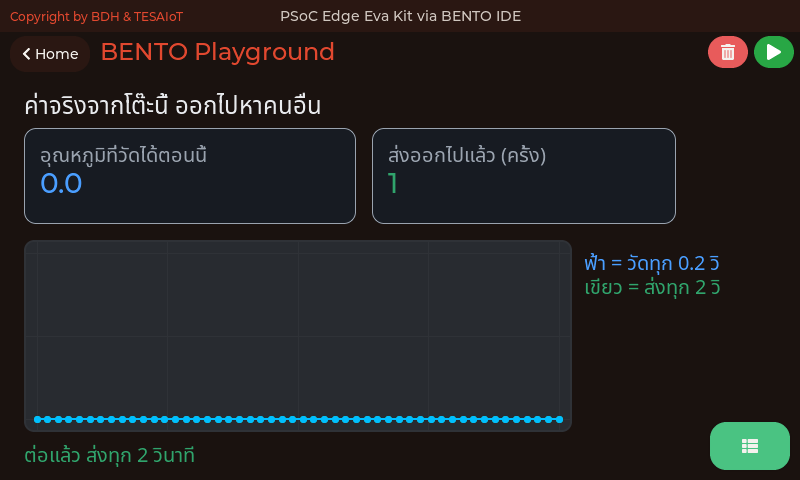

<style>
section { font-size: 24px; padding: 40px 52px; justify-content: flex-start; }
section h1 { font-size: 1.45em; line-height: 1.12; margin: 0 0 .22em; }
section h2 { font-size: 1.12em; margin: .15em 0; }
section h3 { font-size: 1.0em; margin: .12em 0; }
section p, section li { margin: .16em 0; line-height: 1.32; }
section img { max-width: 100%; height: auto; }
section svg { max-height: 330px; width: 100%; }
section table { font-size: .78em; }
section pre { font-size: .70em; line-height: 1.32; background:#0d1117; color:#e6edf3; border:1px solid #30363d; border-radius:8px; padding:12px 16px; box-shadow:0 2px 8px rgba(0,0,0,.25); }
section pre code { white-space: pre-wrap; background:transparent; color:inherit; } section pre .hljs-comment{color:#8b949e;font-style:italic} section pre .hljs-keyword,section pre .hljs-built_in,section pre .hljs-literal{color:#ff7b72} section pre .hljs-string{color:#a5d6ff} section pre .hljs-number{color:#79c0ff} section pre .hljs-title,section pre .hljs-title.function_,section pre .hljs-section{color:#d2a8ff} section pre .hljs-meta{color:#ffa657} section pre .hljs-attr,section pre .hljs-attribute,section pre .hljs-name{color:#7ee787}
section blockquote { margin: .25em 0; font-size: .92em; }
/* two images on a line (parity / 2x2 grids) stay side-by-side and small */
section p > img + img { margin-left: 10px; }
/* scroll-within-slide: dense slides scroll instead of clipping */
section { overflow-y: auto; overflow-x: hidden; }
section::-webkit-scrollbar { width: 11px; }
section::-webkit-scrollbar-thumb { background:#4a90d9; border-radius:6px; }
section::-webkit-scrollbar-track { background:rgba(0,0,0,.06); }
/* image drop-shadow + cover-slide readability (auto) */
section img{filter:drop-shadow(0 3px 12px rgba(0,0,0,.5))}
/* พื้นสำรองของสไลด์ปก: ถ้า img/cover_sNN.svg โหลดไม่ขึ้น ธีมจะคืนพื้นขาว
   แล้วตัวอักษรสีขาวของปกจะหายไปทั้งแผ่น — ปักสีเข้มไว้ให้ภาพเป็นแค่ของประดับ */
section.cover{background-color:#0b1426}
section.cover *{color:#fff !important}
section.cover h1,section.cover h2,section.cover h3,section.cover p,section.cover li,section.cover strong,section.cover em,section.cover blockquote,section.cover div{text-shadow:0 2px 9px rgba(0,0,0,.92),0 0 3px rgba(0,0,0,.8)}
section.cover div[style*="background:#"],section.cover div[style*="background: #"]{background:rgba(10,14,20,.66) !important;border-color:rgba(120,200,255,.45) !important;max-width:62%}
section.cover blockquote{border-left:4px solid rgba(120,200,255,.6) !important;background:rgba(13,17,23,.55) !important;border-radius:6px;padding:.3em .6em}
section.cover h1,section.cover h2,section.cover h3,section.cover p,section.cover blockquote{max-width:60%}
section.cover div:not(:has(img)){max-width:62%}
section.cover img{filter:none}
</style>


<!-- _class: cover -->

# บทเรียน 4.6 — ลงมือทำ: telemetry สองทาง

## MQTT (1883) · Telemetry ขาออก และ Command ขากลับ บน broker ของเราเอง

**โมดูล 4 — เชื่อมต่อแพลตฟอร์ม IoT**

> ต่อจากบทเรียน 4.5 — MQTT กับแพลตฟอร์มที่ติดตั้งเอง: telemetry และ command

---

## MVP checkpoint — ผ่านชุดบทเรียนนี้เมื่อ


**สองทาง — publish JSON เซนเซอร์จริงทุก 5 วินาที + สั่ง toggle LED จาก MQTT Explorer ผ่าน topic ของทีม**

แปลเป็นสิ่งที่ตรวจได้จริง:

- [ ] MQTT Explorer เห็นข้อความเข้ามาที่ topic ของทีม **ห่างกัน 5 วินาที** ต่อเนื่องอย่างน้อย 1 นาที
- [ ] payload เป็น JSON ที่ถูกต้อง มีค่าจากเซนเซอร์จริงอย่างน้อย 3 ฟิลด์ และค่าจะเปลี่ยนเมื่อขยับบอร์ด
- [ ] พิมพ์ `{"cmd":"toggle"}` จาก MQTT Explorer แล้ว **LED บนบอร์ดสลับสถานะ** ได้ทั้งติดและดับ
- [ ] ข้อมูลขึ้นกราฟใน Device Details → Telemetry ของ TESAIoT CE ที่ทีมติดตั้งเอง
- [ ] อธิบายได้ว่า `client_id`, `username`, `device_id` และช่องที่สองของ topic ต้องสัมพันธ์กันอย่างไร
- [ ] บันทึกภาพหน้าจอทั้งสองฝั่งลงบันทึกการเรียน

> ข้อที่สามคือหัวใจ — ถ้าขาดข้อนี้ เราสร้างได้แค่ **เครื่องส่งข้อมูล** ยังไม่ใช่ **อุปกรณ์ที่สั่งได้**

---

## กับดักที่เจอบ่อย

<style scoped>
section table { font-size: .64em; }
section table td, section table th { padding: .16em .5em; }
</style>

| อาการ | สาเหตุที่แท้จริง | วิธีแก้ |
|---|---|---|
| `connect()` คืน False ทุกครั้ง ทั้งที่รหัสถูก | CE เผยแพร่พอร์ตเป็น `127.0.0.1:11883` บอร์ดใน LAN เข้าไม่ถึง | แก้ compose เป็น `0.0.0.0:1883:1883` แล้ว `up -d emqx` |
| ต่อไม่ติด และไม่มีข้อความบอกสาเหตุ | `device_id` เป็น UUID 36 ตัว ถูกตัดเหลือ 31 | ตั้ง `device_id` เองให้สั้น แล้วขึ้นทะเบียนใหม่ |
| `TypeError: unexpected keyword argument` | พิมพ์ `keep_alive` ตามเอกสารใน IDE ซึ่งเขียนผิด | ใช้ `keepalive` |
| publish ไม่ error แต่แพลตฟอร์มไม่มีข้อมูล | ช่องที่สองของ topic ไม่ตรงกับ `device_id` → ACL ปฏิเสธ | ใช้ `device/<device_id>/telemetry` ตรงตัวอักษร |
| ข้อมูลเข้า แต่ไม่มีเส้นกราฟ | ค่าเป็นสตริง — กราฟรับเฉพาะตัวเลข | เปลี่ยนเป็นตัวเลข เช่น `{"ok": 1}` |
| กดคำสั่งรัว ๆ แล้วได้ผลแค่ครั้งสุดท้าย | ช่องรับมีช่องเดียว ข้อความใหม่ทับของเก่า | `poll` ทุก 100 ms และอย่าใช้ `time.sleep(5)` คร่อมทั้งลูป |
| คำสั่งยาว ๆ ทำให้ `json.loads` พัง | payload ขาเข้าเกิน **255 ไบต์** ถูกตัดกลางคัน | คำสั่งต้องสั้น และมี `try/except` |
| สองทีมหลุดสลับกันเป็นจังหวะ | ใช้ `client_id` ซ้ำกัน broker เตะตัวเก่าออก | หนึ่งทีมหนึ่ง `client_id` เสมอ |
| ต่อได้ตอนแรก แล้วหลุดทุก ๆ ราวหนึ่งนาที | เงียบนานเกิน `keepalive` | ส่งถี่กว่าค่า keepalive หรือขยับค่านั้นขึ้น |
| `TypeError` ตอนใส่ `retain=True` | `retain` มีในเอกสารแต่ไม่มีในตัวจริง รับได้แค่ 3 อาร์กิวเมนต์ | ตัด `retain` ออก ถ้าต้องการค่าคงค้างต้องตั้งฝั่ง broker |
| ชื่อ topic ขาเข้ายาว ๆ อ่านแล้วแยกไม่ออกว่ามาจากใคร | topic ขาเข้าถูกตัดที่ **127 ไบต์** เงียบ ๆ | ตั้งชื่อ topic ให้สั้น อย่าซ้อนลึกเกินสี่ชั้น |
| `OSError` ตอนเรียก `publish()` ทั้งที่โค้ดเดิมเคยผ่าน | ลิงก์หลุดไปก่อนแล้ว `publish()` ตอนไม่ได้ต่อโยน error ไม่ได้คืน False | เช็ก `is_connected()` ก่อน และครอบ `publish()` ด้วย `try/except OSError` |

> สิบเอ็ดจากสิบสองแถวนี้ **ไม่ส่ง error ที่ตรงกับสาเหตุ** — จึงต้องอ่านตารางนี้ก่อนเจอปัญหา ไม่ใช่หลังเจอ

---

## ลงมือทำ — เติมช่องว่างในไฟล์ฝึก

<div style="width:66%;margin:0 auto">
<svg viewBox="0 0 940 190" xmlns="http://www.w3.org/2000/svg">
  <rect x="110" y="6" width="720" height="178" rx="6" fill="#0d1117" stroke="#30363d" stroke-width="2"/>
  <text x="132" y="40" font-size="18" font-family="monospace" fill="#8b949e">s10_mqtt_telemetry.py</text>
  <rect x="132" y="54" width="60" height="24" rx="3" fill="#ff7b72" opacity="0.85"/>
  <text x="162" y="72" text-anchor="middle" font-size="17" font-family="monospace" fill="#0d1117">pass</text>
  <text x="208" y="72" font-size="17" font-family="monospace" fill="#8b949e">ท่า 1 — mqtt.connect(...) (1 จุด)</text>
  <rect x="132" y="88" width="60" height="24" rx="3" fill="#ffa657" opacity="0.85"/>
  <text x="162" y="106" text-anchor="middle" font-size="17" font-family="monospace" fill="#0d1117">pass</text>
  <text x="208" y="106" font-size="17" font-family="monospace" fill="#8b949e">ท่า 2 — ประกอบ dict + publish (2 จุด)</text>
  <rect x="152" y="122" width="60" height="24" rx="3" fill="#79c0ff" opacity="0.85"/>
  <text x="182" y="140" text-anchor="middle" font-size="17" font-family="monospace" fill="#0d1117">pass</text>
  <text x="228" y="140" font-size="17" font-family="monospace" fill="#8b949e">ท่า 3 — subscribe + get_message + LED (3 จุด)</text>
  <text x="132" y="170" font-size="17" font-family="monospace" fill="#7ee787">รวม 6 จุด — เติมทีละจุด แล้วรันทุกครั้ง</text>
  <circle cx="790" cy="164" r="9" fill="#7ee787"><animate attributeName="r" values="6;11;6" dur="1.8s" repeatCount="indefinite"/></circle>
</svg>

เปิด [`s10_mqtt_telemetry.py`](https://github.com/tesaiot/tesa-qualification-program/blob/main/courses/aiot-micropython/m04-iot-connectivity/l06-mqtt-telemetry-lab/practice/s10_mqtt_telemetry.py) มีช่องว่างให้เติม **6 จุด**

```python
# เติม: ok = mqtt.connect(BROKER, port=1883, client_id=DEVICE_ID, username=DEVICE_ID, password=MQTT_PASS, keepalive=60)
pass
        # เติม: data = {"ax": round(ax, 2), "ay": round(ay, 2), "az": round(az, 2), "pot": round(sensors.pot.percent(), 1)}
        pass
    # เติม: mqtt.publish(TOPIC_PUB, json.dumps(data))
    pass
# เติม: mqtt.subscribe(TOPIC_CMD)
pass
    # เติม: msg = mqtt.get_message()
    pass
            # เติม: lamp.value(1 if led_on else 0)
            pass
```

**หนึ่ง** แก้ค่าเจ็ดบรรทัดบนหัวไฟล์ **สอง** เติมท่าที่ 1 แล้วรันจนเห็นว่าต่อแล้ว **สาม** เติมท่า 2-3 ทีละจุด

> การเติมครบทั้งหกจุดแล้วค่อยรัน คือวิธีที่ทำให้ไม่มีทางรู้ว่าอะไรพัง — บนเครือข่ายยิ่งจริงกว่าเดิม เพราะจุดที่พังได้มีมากขึ้น

---

## ปิดวงจร — เอาเลขแต่งออก ใส่เซนเซอร์จริงเข้าไป

<style scoped>section p{margin:.12em 0} section table{font-size:.8em}</style>

เจ็ดไฟล์ที่ผ่านมาส่งเลขที่เราแต่งขึ้นเอง **โดยตั้งใจ** — กลไก MQTT มีเรื่องให้ผิดพลาดมากพออยู่แล้ว · ตอนนี้กลไกแน่นแล้ว [`08_real_sensor_leaves_the_board.py`](https://github.com/tesaiot/tesa-qualification-program/blob/main/courses/aiot-micropython/m04-iot-connectivity/l06-mqtt-telemetry-lab/examples/08_real_sensor_leaves_the_board.py) เอาเลขแต่งออก แล้วต่อ **ชิปบนบอร์ด → WiFi → broker** ให้ครบวง

ค่าที่ไฟล์นี้ส่งคือ **อุณหภูมิ** อ่านผ่านฟังก์ชัน `read_temp()` ในไฟล์ — `sensors.snapshot()` ไม่มีช่องอุณหภูมิบนบอร์ดไหนเลย ไฟล์จึงถามก่อนว่าบอร์ดมี `sensors.sht40` ไหม: **บน Dev Kit ได้อุณหภูมิห้องจริงจาก SHT40** ส่วน **บน Eva ไม่มีเซนเซอร์อุณหภูมิ** ลูกบิดจึงเล่นบทแทน (0–100 % = 15–45 °C) และ console บอกไว้ตั้งแต่รอบแรกว่าค่ามาจากไหน — หมุนลูกบิดแล้วเห็นเส้นวิ่งทั่วกราฟช่วง 20–35 °C ได้ในห้องเรียน ไฟล์นี้ยังไม่มีเกณฑ์ตัดสิน (เงื่อนไข 0.3 องศาคือการบ้านท้ายไฟล์)

| ตัวเลขที่ต้องแยกให้ออก | ในไฟล์นี้ | ทำไม |
|---|---|---|
| **รอบวัด** | ทุก 200 ms | การวัดไม่กวนใคร วัดถี่ได้ตามใจ |
| **รอบส่ง** | ทุก 2000 ms | การส่งกวน broker และกวนเพื่อนร่วมห้อง |

**เลขสองตัวนี้ไม่เท่ากัน และไม่ควรเท่ากัน** — ถ้าส่งทุก 200 ms คือ 5 ข้อความต่อวินาทีต่อบอร์ด สิบห้าโต๊ะก็ 75 ข้อความต่อวินาทีเข้า broker ตัวเดียว นั่นคือวิธีทำให้ห้องเรียนล่มโดยไม่มีใครเขียนโค้ดผิดสักบรรทัด

บนจอจะเห็นสองเส้น — **ฟ้าคือค่าที่วัดได้ทุกรอบ เขียวคือค่าที่ส่งออกไปจริง** เส้นเขียวเป็นขั้นบันได นั่นคือภาพของประโยคที่จริงเสมอในงาน IoT: **จอเห็นบ่อยกว่าที่คลาวด์เห็น**

> ตาคุณ — เพิ่มเงื่อนไข "ส่งเฉพาะเมื่อค่าเปลี่ยนเกิน 0.3 องศา" แล้วดูว่าจำนวนครั้งที่ส่งลดลงเท่าไร โดยที่คนดูปลายทางยังเห็นภาพเดิมทุกประการ

---

## เชื่อมโยงรากฐาน + สรุปบทเรียน

<svg viewBox="0 0 940 172" xmlns="http://www.w3.org/2000/svg">
  <rect x="10" y="14" width="298" height="144" rx="8" fill="#e3f2fd" stroke="#1565c0" stroke-width="2"/>
  <text x="159" y="48" text-anchor="middle" font-size="20" font-weight="700" fill="#1565c0">ฝั่งสมองกลฝังตัว</text>
  <text x="159" y="82" text-anchor="middle" font-size="18" fill="#0d47a1">บัฟเฟอร์ขนาดจำกัด · การ poll</text>
  <text x="159" y="112" text-anchor="middle" font-size="18" fill="#0d47a1">งบหน่วยความจำเป็นข้อจำกัดจริง</text>
  <text x="159" y="142" text-anchor="middle" font-size="18" fill="#5472a3">เครือข่ายกับจอคนละคอร์</text>
  <rect x="320" y="14" width="298" height="144" rx="8" fill="#e8f5e9" stroke="#2e7d32" stroke-width="2"/>
  <text x="469" y="48" text-anchor="middle" font-size="20" font-weight="700" fill="#2e7d32">ฝั่ง Python และเครือข่าย</text>
  <text x="469" y="82" text-anchor="middle" font-size="18" fill="#1b5e20">dict → JSON · bytes vs str</text>
  <text x="469" y="112" text-anchor="middle" font-size="18" fill="#1b5e20">pub/sub · topic · QoS</text>
  <text x="469" y="142" text-anchor="middle" font-size="18" fill="#4a7c4e">try/except กับข้อมูลจากภายนอก</text>
  <rect x="630" y="14" width="300" height="144" rx="8" fill="#fff3e0" stroke="#ef6c00" stroke-width="2"/>
  <text x="780" y="48" text-anchor="middle" font-size="20" font-weight="700" fill="#ef6c00">ฝั่งออกแบบระบบ</text>
  <text x="780" y="82" text-anchor="middle" font-size="18" fill="#e65100">สัญญาระหว่างระบบ (topic/schema)</text>
  <text x="780" y="112" text-anchor="middle" font-size="18" fill="#e65100">แลกความถี่กับต้นทุน</text>
  <text x="780" y="142" text-anchor="middle" font-size="18" fill="#a1683a">ความล้มเหลวที่เงียบ ต้องรู้ล่วงหน้า</text>
</svg>

**วันนี้เราได้:** ส่งข้อมูลออกจากบอร์ดไปให้โปรแกรมอื่นใช้ · รับคำสั่งจากภายนอกมาสั่งฮาร์ดแวร์จริง · ติดตั้งแพลตฟอร์ม IoT ด้วยตัวเองและเห็นข้อมูลขึ้นกราฟโดยไม่ต้องสร้างแดชบอร์ด · และรู้ข้อจำกัดจริงสี่ข้อของโมดูล `mqtt` ที่ไม่ส่งเสียงเวลาเกิน

**สิ่งที่ติดตัวไปแม้เปลี่ยนภาษาและเปลี่ยนบอร์ด:** การออกแบบชื่อ topic และรูปร่าง payload ในฐานะ **สัญญา** ที่แก้ทีหลังแล้วพังทั้งระบบ · การเลือกความถี่การส่งจากคำถามว่าใครใช้ค่านี้ทำอะไร · และนิสัยตรวจค่าที่รับมาจากภายนอกก่อนใช้เสมอ

**งานทำเอง 30%:** เลือกทำ 1 ข้อจากสี่ข้อในสไลด์ต่อยอด จดลงบันทึกการเรียน

**ชุดบทเรียนถัดไป:** เปลี่ยนจากพอร์ต 1883 ไปเป็น **8884 พร้อม TLS** แล้วดักจับสัญญาณเทียบกันให้เห็นด้วยตาว่าสิ่งที่คนดักได้ต่างกันอย่างไร

> วันนี้บอร์ดพูดได้และฟังเป็นแล้ว ชุดบทเรียนถัดไปเราจะทำให้ **คนอื่นแอบฟังไม่ได้**

---

## เฉลย [`s10_mqtt_telemetry.py`](https://github.com/tesaiot/tesa-qualification-program/blob/main/courses/aiot-micropython/m04-iot-connectivity/l06-mqtt-telemetry-lab/solution/s10_mqtt_telemetry.py) — ส่วนที่หนึ่ง

<style scoped>section pre{font-size:.58em;line-height:1.25} section svg{max-height:135px} section p{margin:.1em 0}</style>

```python
WIFI_SSID = "AIoT-Class"
WIFI_PASSWORD = "<รหัสผ่าน WiFi ของคุณ>"
BROKER = "192.168.1.50"                # IP ของเครื่องที่รัน TESAIoT CE ในแลน (ไม่ใช่ localhost)
DEVICE_ID = "team03"                   # ต้องตรงกับ device_id ที่ขึ้นทะเบียน · <= 31 ตัวอักษร
MQTT_PASS = "<รหัสผ่าน MQTT ของคุณ>"   # ได้จากตอนลงทะเบียนอุปกรณ์บนแพลตฟอร์ม (ในห้องเรียน ผู้สอนแจก)
TOPIC_PUB = "device/team03/telemetry"
TOPIC_CMD = "device/team03/commands"
...
try:
    sensors.bmi270.motion()            # อุ่นเครื่องหนึ่งครั้ง ให้การรอไปเกิดก่อนต่อเน็ต
except OSError:
    print("อ่านเซนเซอร์รอบแรกยังไม่ได้ - ลองใหม่ตอนส่ง")
...
wifi.connect(WIFI_SSID, WIFI_PASSWORD)
lcd.print("WiFi:", wifi.ip())
```

<svg viewBox="0 0 940 168" xmlns="http://www.w3.org/2000/svg">
  <rect x="14" y="12" width="300" height="142" rx="7" fill="#e8f5e9" stroke="#2e7d32" stroke-width="2"/>
  <text x="164" y="48" text-anchor="middle" font-size="20" font-weight="700" fill="#2e7d32">ค่าที่ต้องแก้ทั้งหมด</text>
  <text x="164" y="82" text-anchor="middle" font-size="18" fill="#1b5e20">อยู่บนหัวไฟล์ 7 บรรทัด</text>
  <text x="164" y="112" text-anchor="middle" font-size="18" fill="#1b5e20">ไม่ต้องแก้อะไรข้างล่างอีก</text>
  <text x="164" y="142" text-anchor="middle" font-size="18" fill="#4a7c4e">คนมาแก้ทีหลังหาเจอทันที</text>
  <rect x="326" y="12" width="300" height="142" rx="7" fill="#e3f2fd" stroke="#1565c0" stroke-width="2"/>
  <text x="476" y="48" text-anchor="middle" font-size="20" font-weight="700" fill="#1565c0">DEVICE_ID โผล่ 3 ที่</text>
  <text x="476" y="82" text-anchor="middle" font-size="18" fill="#0d47a1">client_id · username · topic</text>
  <text x="476" y="112" text-anchor="middle" font-size="18" fill="#0d47a1">จึงประกาศเป็นตัวแปรตัวเดียว</text>
  <text x="476" y="142" text-anchor="middle" font-size="18" fill="#5472a3">ทำให้ไม่มีทางไม่ตรงกัน</text>
  <rect x="638" y="12" width="288" height="142" rx="7" fill="#fff3e0" stroke="#ef6c00" stroke-width="2"/>
  <text x="782" y="48" text-anchor="middle" font-size="20" font-weight="700" fill="#ef6c00">ไม่ต้องเรียก sensors.init()</text>
  <text x="782" y="82" text-anchor="middle" font-size="18" fill="#e65100">Eva: เรียกแล้วได้ OSError</text>
  <text x="782" y="112" text-anchor="middle" font-size="18" fill="#e65100">Dev Kit: ปลุกไว้ตั้งแต่บูตแล้ว</text>
  <text x="782" y="142" text-anchor="middle" font-size="18" fill="#a1683a">Eva: อ่านครั้งแรกอาจรอถึง 16 วิ</text>
</svg>

บน Eva Kit คอร์จอ (CM55) เป็นเจ้าของบัสเซนเซอร์ `sensors.init()` และ `sensors.scan()` จึงถูกปฏิเสธด้วย `OSError` ส่วน `sensors.bmi270.*` `capsense.*` `pot.*` เรียกได้ทันทีผ่าน snapshot ที่คอร์จอเก็บไว้ให้ · บน Dev Kit `init()` ทำงานได้จริง แต่ก็**ไม่ต้องเรียก** เพราะเฟิร์มแวร์ปลุกเซนเซอร์ไว้ตั้งแต่บูต — โค้ดเดียวกันจึงรันได้ทั้งสองบอร์ด · `sensors.snapshot()` คืน dict รูปเดียวกันทั้งสองบอร์ด (คีย์ `bmi270` `capsense` `pot`) และ**ไม่มี**คีย์อุณหภูมิ

> เขียนค่าที่ต้องตรงกันไว้ที่เดียว แล้วบั๊กประเภท "ลืมแก้ที่หนึ่ง" จะหายไปทั้งตระกูล

---

## เฉลย — แผงเฝ้าลิงก์ สร้าง **ก่อน** ต่อเน็ต

<style scoped>section pre{font-size:.54em;line-height:1.22} section p{margin:.1em 0}</style>

```python
ui.screen()
time.sleep_ms(200)
ui.Label("MQTT Telemetry - ชุด 10", x=24, y=36, color=COL_TEXT, value=20)
led_wifi = ui.Led(x=328, y=16, w=48, h=48, color=COL_OK, value=0)
...
led_mqtt = ui.Led(x=440, y=16, w=48, h=48, color=COL_OK, value=0)
...
led_stale = ui.Led(x=552, y=16, w=48, h=48, color=COL_WARN, value=0)
...
led_remote = ui.Led(x=664, y=16, w=48, h=48, color=COL_RUN, value=0)
...
ui.Panel(x=24, y=112, w=232, h=280, color=COL_CARD, min=COL_DIM, max=12, value=1)
...
lbl_pot = ui.Label("- %", x=40, y=160, color=COL_TEXT, value=24)
bar_pot = ui.Bar(x=40, y=204, w=200, h=12, color=0x4A9EFF, min=0, max=100, value=0)
sc_pot = ui.Scale(x=40, y=224, w=200, h=44, color=COL_TEXT, min=0, max=100)
sc_pot.ticks(11, 5)
...
seg_sent = ui.Seg7("0", x=40, y=324, w=200, h=48, color=COL_TEXT)
...
lst_sent = ui.List(x=288, y=160, w=208, h=168)
...
btn_go = ui.Button("เริ่มส่ง", x=544, y=240, w=88, h=88, color=0x30A46C, value=20)
btn_hold = ui.Button("หยุดส่ง", x=664, y=240, w=88, h=88, color=0x3A4150, value=20)
ui.poll()

wifi.connect(WIFI_SSID, WIFI_PASSWORD)
lcd.print("WiFi:", wifi.ip())
led_wifi.value(1 if wifi.is_connected() else 0)
```

จอถูกสร้าง **ก่อน** `wifi.connect()` โดยตั้งใจ — การต่อเน็ตคือช่วงที่น่าดูที่สุดของโปรแกรมนี้ ถ้าสร้างจอทีหลัง ช่วงนั้นผ่านไปโดยไม่มีใครเห็น · ไฟสี่ดวงไล่ตาม **เส้นทางจริงของข้อมูล**: WiFi → MQTT → "ค่าค้าง" → หลอดจริงที่คนอีกห้องสั่งได้ · `ui.Scale` ใต้ `ui.Bar` ทำให้ค่า pot มีพิสัยกำกับ — ตัวเลข 14.6 ที่มีไม้บรรทัด 0–100 อยู่ใต้มันบอกทันทีว่าสูงไหม · การ์ดสร้าง**ก่อน**ของที่วางบนมัน (LVGL วาดตามลำดับสร้าง) · ปุ่มสองปุ่มสูง 88 = เป้าสัมผัสตามเกณฑ์ และจบที่ y=328 เพราะมุมขวาล่างเป็นของปุ่ม Console

> `ui.List` ไม่ใช่ `ui.Label` เรียงกัน เพราะรายการนี้ถูกล้างแล้วเขียนใหม่ทุกห้าวินาที ถ้าทำด้วย Label ต้องนับพิกเซลใหม่ทุกครั้งที่ข้อความยาวไม่เท่าเดิม

---

## เฉลย — ส่วนที่สอง: ลูปหลัก และทำไมเรียงสามท่าแบบนี้

<style scoped>section pre{font-size:.60em;line-height:1.25} section p{margin:.1em 0}</style>

```python
mqtt.subscribe(TOPIC_CMD)                  # ต่อจากท่าที่ 1 ที่ connect แล้ว
...
while True:
    if sending and time.ticks_diff(time.ticks_ms(), t_last) >= SEND_MS:
        d = publish_telemetry()            # ท่าที่ 2 ทั้งท่าอยู่ในฟังก์ชันนี้
        if d is not None:
            sent += 1
            t_good = time.ticks_ms()
            ...
            lbl_pot.text(str(pot) + " %")  # จอขยับทุก 5 วินาที ไม่ใช่ทุกรอบลูป
            bar_pot.value(int(pot))
            seg_sent.text(str(sent))
            ...
        t_last = time.ticks_ms()
    ...
```

<div style="width:70%;margin:0 auto">

<svg viewBox="0 0 940 160" xmlns="http://www.w3.org/2000/svg">
  <rect x="20" y="106" width="300" height="38" rx="5" fill="#c8e6c9" stroke="#2e7d32" stroke-width="2"/>
  <text x="170" y="131" text-anchor="middle" font-size="19" fill="#1b5e20">ท่า 1 — ต่อได้จริง</text>
  <rect x="330" y="62" width="300" height="38" rx="5" fill="#bbdefb" stroke="#1565c0" stroke-width="2"/>
  <text x="480" y="87" text-anchor="middle" font-size="19" fill="#0d47a1">ท่า 2 — ข้อมูลออกได้</text>
  <rect x="640" y="24" width="280" height="38" rx="5" fill="#ffe0b2" stroke="#ef6c00" stroke-width="2"/>
  <text x="780" y="49" text-anchor="middle" font-size="19" fill="#e65100">ท่า 3 — คำสั่งเข้าได้ ครบสองทาง</text>
  <path d="M324,120 L334,102 M634,78 L644,62" stroke="#90a4ae" stroke-width="2.5"/>
  <text x="180" y="30" text-anchor="middle" font-size="19" font-weight="700" fill="#455a64">แต่ละท่ายืนยันท่าก่อนหน้า</text>
</svg>

</div>

**ท่า 2 ส่งออกก่อนรับเข้า** เพราะขาส่งตรวจง่ายกว่า — ถ้าถึงท่า 3 แล้วไม่ทำงาน รู้แน่ว่าปัญหาอยู่ที่ topic ของคำสั่ง

---

## เฉลย — ส่วนที่สอง (ต่อ): ครึ่งหลังของลูป — สามนาฬิกาในลูปเดียว

<style scoped>section pre{font-size:.60em;line-height:1.25} section p{margin:.1em 0}</style>

```python
    ...
    stale = time.ticks_diff(time.ticks_ms(), t_good) >= STALE_MS
    if stale != stale_shown:               # เขียนเฉพาะตอนเปลี่ยน
        stale_shown = stale
        led_stale.value(1 if stale else 0)

    msg = mqtt.get_message()               # ถามทุกรอบลูป
    if msg is not None:
        ...                                # แปลง JSON แล้วสั่งไฟ - เหมือนท่าที่ 3
    if time.ticks_diff(time.ticks_ms(), t_ui) >= 200:
        t_ui = time.ticks_ms()
        for ev in ui.poll():
            ...                            # ปุ่มเริ่มส่ง / หยุดส่ง
    time.sleep_ms(100)
```

สังเกตว่าลูปนี้มีนาฬิกา **สามเรือน** ไม่ใช่เรือนเดียว: เรือนของการส่ง (5 วินาที) เรือนของนิ้ว (200 ms) และเรือนของ `get_message()` ซึ่งถามทุกรอบ ถ้ายุบทั้งสามให้เดินจังหวะเดียวกัน จะได้โปรแกรมที่ไม่ตอบคำสั่งหรือไม่ก็ยิงจอทิ้งเปล่า

`if stale != stale_shown:` ไม่ได้เขียนไว้ให้สวย — **คิวคำสั่งของจอมีก้นถัง** พอมันเต็ม เฟิร์มแวร์ทิ้งคำสั่งเปลี่ยนข้อความก่อนเป็นอย่างแรก (`ipc_ui.c` ระบุ `SET_TEXT` ว่าเป็นคำสั่งที่ทิ้งได้) โปรแกรมที่ยิงคำสั่งจอสิบครั้งต่อวินาที จึงเห็นตัวเลขค้างเป็นบางครั้งโดยไม่มี error สักบรรทัด แก้ที่ยิงให้น้อยลง ไม่ใช่ยิงซ้ำให้มากขึ้น

> `try/except` มีไว้เพราะคำสั่งมาจากคนพิมพ์ — **โปรแกรมต้องไม่ตายเพราะคนอื่นพิมพ์ผิด**

---

## เชื่อมจุดให้เห็นภาพ — วันนี้อยู่ตรงไหนของเส้นทาง

<svg viewBox="0 0 940 210" xmlns="http://www.w3.org/2000/svg">
  <line x1="40" y1="120" x2="900" y2="120" stroke="#b0bec5" stroke-width="4"/>
  <circle cx="150" cy="120" r="16" fill="#22d3ee"/>
  <circle cx="390" cy="120" r="16" fill="#a3c93a"/>
  <circle cx="630" cy="120" r="18" fill="#ffb066"><animate attributeName="r" values="14;19;14" dur="2.2s" repeatCount="indefinite"/></circle>
  <circle cx="850" cy="120" r="16" fill="#6cb2f5"/>
  <text x="150" y="88" text-anchor="middle" font-size="18" font-weight="700" fill="#0e7490">บทเรียน 1.1–2.9</text>
  <text x="150" y="160" text-anchor="middle" font-size="19" fill="#455a64">สั่งฮาร์ดแวร์</text>
  <text x="150" y="182" text-anchor="middle" font-size="19" fill="#455a64">ในบอร์ดของเราเอง</text>
  <text x="390" y="88" text-anchor="middle" font-size="18" font-weight="700" fill="#5b7c14">บทเรียน 3.1–4.3</text>
  <text x="390" y="160" text-anchor="middle" font-size="19" fill="#455a64">อ่านเซนเซอร์ วาดกราฟ</text>
  <text x="390" y="182" text-anchor="middle" font-size="19" fill="#455a64">แล้วต่อเน็ตได้</text>
  <text x="630" y="88" text-anchor="middle" font-size="18" font-weight="700" fill="#b45309">วันนี้ · บทเรียน 4.4–4.6</text>
  <text x="630" y="160" text-anchor="middle" font-size="19" fill="#455a64">ข้อมูลออกไปนอกบอร์ด</text>
  <text x="630" y="182" text-anchor="middle" font-size="19" fill="#455a64">และคำสั่งเดินกลับเข้ามา</text>
  <text x="850" y="88" text-anchor="middle" font-size="18" font-weight="700" fill="#1565c0">บทเรียน 4.7–5.3</text>
  <text x="850" y="160" text-anchor="middle" font-size="19" fill="#455a64">ทำให้ปลอดภัย</text>
  <text x="850" y="182" text-anchor="middle" font-size="19" fill="#455a64">ประกอบเป็นสินค้า</text>
  <text x="470" y="36" text-anchor="middle" font-size="21" font-weight="700" fill="#37474f">วันนี้คือจุดที่ "โครงงานบนโต๊ะ" กลายเป็น "ระบบที่มีหลายเครื่อง"</text>
</svg>

**คำถามคิดต่อ:** ถ้าเน็ตห้องเราหลุดไปสองนาที ข้อมูลช่วงนั้นควรหายไปเลย หรือบอร์ดควรเก็บไว้ส่งทีหลัง · ใครควรเป็นคนตัดสินใจว่าค่าไหนผิดปกติ ระหว่างบอร์ดกับแพลตฟอร์ม · ถ้ามีอุปกรณ์ 500 ตัวส่งทุก 5 วินาที broker ตัวเดียวรับไหวไหม และเราจะรู้ได้อย่างไรก่อนจะสาย

---

## ใช้จริงที่ไหน — สี่มุมที่ MQTT ทำงานอยู่ตอนนี้

<svg viewBox="0 0 940 300" xmlns="http://www.w3.org/2000/svg">
  <rect x="14" y="16" width="452" height="128" rx="10" fill="#e3f2fd" stroke="#1565c0" stroke-width="2"/>
  <text x="36" y="48" font-size="22" font-weight="700" fill="#1565c0">โรงงาน · สายการผลิตหลายร้อยจุด</text>
  <text x="36" y="78" font-size="18" fill="#0d47a1">เซนเซอร์แต่ละตัว publish ขึ้น topic ของสายผลิตตัวเอง</text>
  <text x="36" y="102" font-size="18" fill="#0d47a1">ระบบซ่อมบำรุง subscribe ด้วย wildcard ครั้งเดียว</text>
  <text x="36" y="128" font-size="17" fill="#5472a3">เพิ่มเครื่องจักรใหม่ ไม่ต้องแก้โปรแกรมฝั่งใดเลย</text>
  <rect x="480" y="16" width="446" height="128" rx="10" fill="#e8f5e9" stroke="#2e7d32" stroke-width="2"/>
  <text x="502" y="48" font-size="22" font-weight="700" fill="#2e7d32">อาคาร · ระบบควบคุมส่วนกลาง</text>
  <text x="502" y="78" font-size="18" fill="#1b5e20">แอร์ ไฟ ม่าน รับคำสั่งผ่าน topic ของห้องตัวเอง</text>
  <text x="502" y="102" font-size="18" fill="#1b5e20">สั่งทั้งชั้นพร้อมกันได้ด้วยการ publish ครั้งเดียว</text>
  <text x="502" y="128" font-size="17" fill="#4a7c4e">นี่คือขากลับแบบเดียวกับ toggle LED ของเราวันนี้</text>
  <rect x="14" y="158" width="452" height="128" rx="10" fill="#fff3e0" stroke="#ef6c00" stroke-width="2"/>
  <text x="36" y="190" font-size="22" font-weight="700" fill="#ef6c00">เกษตร · แปลงที่สัญญาณไม่ดี</text>
  <text x="36" y="220" font-size="18" fill="#e65100">ส่วนหัวสองไบต์ทำให้ส่งผ่านลิงก์แคบ ๆ ได้</text>
  <text x="36" y="244" font-size="18" fill="#e65100">ส่งวันละไม่กี่ครั้ง แบตอยู่ได้เป็นฤดูกาล</text>
  <text x="36" y="270" font-size="17" fill="#a1683a">เลือกความถี่จากธรรมชาติของค่าที่วัด</text>
  <rect x="480" y="158" width="446" height="128" rx="10" fill="#f3e5f5" stroke="#6a1b9a" stroke-width="2"/>
  <text x="502" y="190" font-size="22" font-weight="700" fill="#6a1b9a">ขนส่ง · รถที่วิ่งอยู่ตลอดเวลา</text>
  <text x="502" y="220" font-size="18" fill="#4a148c">สัญญาณหลุดเป็นเรื่องปกติ ไม่ใช่ข้อยกเว้น</text>
  <text x="502" y="244" font-size="18" fill="#4a148c">QoS 1 สำหรับสิ่งที่หายไม่ได้ · QoS 0 สำหรับพิกัด</text>
  <text x="502" y="270" font-size="17" fill="#7e5a94">การเลือก QoS คือการเลือกว่าอะไร "หายได้"</text>
</svg>

> ทั้งสี่มุมนี้ใช้คำสั่งชุดเดียวกับที่เราเพิ่งเขียนวันนี้ ต่างกันแค่จำนวนอุปกรณ์และความสำคัญของข้อมูล

---

## ดูเพิ่มเติมนอกเวลา — วิดีโอที่ตรวจแล้วว่าเปิดได้

**เรียนรู้ MQTT และควบคุมอุปกรณ์ IoTs จากทุกมุมโลกด้วย MQTT เข้าใจง่าย** — IT around U · 21 นาที 26 วินาที · ไทย — ตัวเลือกภาษาไทยที่ครบที่สุด: ตั้ง broker เอง สาธิต pub/sub และคุมอุปกรณ์จริง (ข้ามส่วนติดตั้งได้ที่นาทีที่ 10)

**MQTT Essentials Part 1 — What is MQTT** — HiveMQ · 6 นาที 26 วินาที · อังกฤษ — อธิบายว่าทำไม IoT ไม่เลือก HTTP ตั้งแต่ต้น เป็นตอนแรกของซีรีส์ที่เราหยิบตอน 6 และ 7 มาใช้แล้ว

<div style="display:flex;gap:18px;align-items:flex-start;margin:.3em 0">
<iframe width="330" height="186" src="https://www.youtube.com/embed/Gu9txMng_nQ" title="เรียนรู้ MQTT และควบคุมอุปกรณ์ IoTs จากทุกมุมโลก" loading="lazy" frameborder="0" allowfullscreen></iframe>
<iframe width="330" height="186" src="https://www.youtube.com/embed/jTeJxQFD8Ak" title="MQTT Essentials Part 1 - What is MQTT" loading="lazy" frameborder="0" allowfullscreen></iframe>
</div>

**อ่านต่อสำหรับคนอยากรู้ลึก**

- MQTT Core Concepts — EMQX (topic, wildcard, QoS, retained, will ครบในหน้าเดียว): <https://docs.emqx.com/en/emqx/latest/messaging/mqtt-concepts.html>
- MQTT Topics and Wildcards: A Beginner's Guide — EMQX (มีตัวอย่างที่แมตช์และไม่แมตช์ให้ฝึก): <https://www.emqx.com/en/blog/advanced-features-of-mqtt-topics>
- MQTT และการใช้งานสำหรับ Linux (ตอนที่ 1) — IoT Engineering Education, KMUTNB: <https://iot-kmutnb.github.io/blogs/training/mqtt_linux_part-1/>

> คลิปเหล่านี้ไม่อยู่ในเกณฑ์ผ่าน แต่คนที่ดูจะเข้าใจบทเรียน 4.7–4.9 เรื่อง TLS ได้เร็วกว่าเพื่อน

---

## ต่อยอด — คิดต่อเอง (เลือกทำ 1 ข้อ)

<svg viewBox="0 0 940 164" xmlns="http://www.w3.org/2000/svg">
  <rect x="14" y="14" width="216" height="136" rx="7" fill="#e3f2fd" stroke="#1565c0" stroke-width="2"/>
  <text x="122" y="52" text-anchor="middle" font-size="20" font-weight="700" fill="#1565c0">1 · ฟังทั้งห้อง</text>
  <text x="122" y="88" text-anchor="middle" font-size="18" fill="#0d47a1">device/+/telemetry</text>
  <text x="122" y="122" text-anchor="middle" font-size="18" fill="#5472a3">แล้วเทียบ schema ทุกทีม</text>
  <rect x="248" y="14" width="216" height="136" rx="7" fill="#e8f5e9" stroke="#2e7d32" stroke-width="2"/>
  <text x="356" y="52" text-anchor="middle" font-size="20" font-weight="700" fill="#2e7d32">2 · คำสั่งชุดใหญ่</text>
  <text x="356" y="88" text-anchor="middle" font-size="18" fill="#1b5e20">คุม LED ทุกดวงของบอร์ด</text>
  <text x="356" y="122" text-anchor="middle" font-size="18" fill="#4a7c4e">แล้วส่งสถานะกลับ</text>
  <rect x="482" y="14" width="216" height="136" rx="7" fill="#fff3e0" stroke="#ef6c00" stroke-width="2"/>
  <text x="590" y="52" text-anchor="middle" font-size="20" font-weight="700" fill="#ef6c00">3 · วัดเพดาน 255 ไบต์</text>
  <text x="590" y="88" text-anchor="middle" font-size="18" fill="#e65100">ยาวขึ้นทีละ 10 ไบต์</text>
  <text x="590" y="122" text-anchor="middle" font-size="18" fill="#a1683a">จนหาจุดที่มันเริ่มพัง</text>
  <rect x="716" y="14" width="210" height="136" rx="7" fill="#f3e5f5" stroke="#6a1b9a" stroke-width="2"/>
  <text x="821" y="52" text-anchor="middle" font-size="20" font-weight="700" fill="#6a1b9a">4 · ส่งเมื่อเปลี่ยน</text>
  <text x="821" y="88" text-anchor="middle" font-size="18" fill="#4a148c">แทนการส่งตามเวลา</text>
  <text x="821" y="122" text-anchor="middle" font-size="18" fill="#7e5a94">วัดว่าลดไปกี่เปอร์เซ็นต์</text>
</svg>

**ข้อ 1 · ฟังทั้งห้องด้วย wildcard** — subscribe `device/+/telemetry` แล้วบันทึกว่าแต่ละทีมส่งฟิลด์อะไร ทำตารางเทียบ แล้วเสนอว่า **ถ้าทั้งห้องต้องใช้ schema เดียวกัน ควรมีฟิลด์ใดบ้างและชื่อว่าอะไร** พร้อมเหตุผล

**ข้อ 2 · คำสั่งชุดใหญ่ขึ้น** — ขยายคำสั่งเป็น `{"cmd":"set","led":"RGB_GREEN","on":1}` ให้คุม LED ได้ทุกดวงของบอร์ดแยกกัน (`gpio.num_leds()` ดวง — 3 บน Eva, 5 บน Dev Kit — ระบุดวงด้วย**ชื่อ**จาก `board_info()["led_names"]` ไม่ใช่เลข เพราะเลขเดียวกันคือคนละหลอดบนคนละบอร์ด) และให้บอร์ด **publish สถานะกลับ** ไปที่ `.../status` ทุกครั้งที่เปลี่ยน เพื่อให้ฝั่งคอมไม่ต้องเดา

**ข้อ 3 · วัดเพดาน 255 ไบต์ด้วยมือตัวเอง** — ส่งคำสั่งที่ยาวขึ้นทีละ 10 ไบต์จนโปรแกรมเริ่มพัง บันทึกว่าพังที่ความยาวเท่าไรและอาการเป็นอย่างไร แล้วเขียนวิธีป้องกันที่ดีกว่าการเดา

**ข้อ 4 · ส่งเมื่อค่าเปลี่ยน แทนการส่งตามเวลา** — เปลี่ยนเงื่อนไขเป็น "ค่าเปลี่ยนเกินเกณฑ์ **หรือ** ครบ 60 วินาทีแล้วยังไม่ได้ส่ง" แล้ววัดว่าจำนวนข้อความต่อนาทีลดลงกี่เปอร์เซ็นต์ พร้อมอธิบายว่าทำไมยังต้องมีเงื่อนไขข้อหลัง

> เขียนคำตอบลงบันทึกการเรียน แล้วเอามาเล่าให้เพื่อนฟังต้นชุดบทเรียนถัดไป

---

## หน้าจอของทุกไฟล์ในชุดบทเรียนนี้ (1/3)

<style scoped>
section img { margin: 0 .3em; }
section p { margin: .2em 0; }
</style>

  

<div style="font-size:.56em;color:#90a4ae"><b>01</b> ออกแบบชื่อ topic ก่อนเขียนโค้ดส่ง · <b>02</b> รูปร่างของ payload ตัดสินว่าฝั่งรับทำงานง่ายหรือยาก · <b>03</b> ต่อ broker แล้วส่งค่าขึ้นไปหนึ่งชุด</div>

<div style="font-size:.52em;color:#78909c;margin-top:.4em">ภาพจากตัวจำลอง bento_sim ซึ่งเรนเดอร์ด้วยโค้ด CM55 ชุดเดียวกับที่รันบนบอร์ด ที่ 800x480 เท่าจอของทั้งสองบอร์ด — แสดง<b>หน้าจอที่ตัวอย่างสร้าง</b> ค่าจากเซนเซอร์ WiFi และไมค์เป็นค่าแทนบนเครื่องโฮสต์ ไม่ใช่ผลการวัดของบอร์ด</div>

---

## หน้าจอของทุกไฟล์ในชุดบทเรียนนี้ (2/3)

<style scoped>
section img { margin: 0 .3em; }
section p { margin: .2em 0; }
</style>

  

<div style="font-size:.56em;color:#90a4ae"><b>04</b> รับคำสั่งจากข้างนอก แล้วทำตาม · <b>05</b> ส่งทุก 5 วินาที แต่ยังรับคำสั่งได้ทุก 100 ms · <b>06</b> publish คืน True แปลว่าอะไร และไม่แปลว่าอะไร</div>

<div style="font-size:.52em;color:#78909c;margin-top:.4em">ภาพจากตัวจำลอง bento_sim ซึ่งเรนเดอร์ด้วยโค้ด CM55 ชุดเดียวกับที่รันบนบอร์ด ที่ 800x480 เท่าจอของทั้งสองบอร์ด — แสดง<b>หน้าจอที่ตัวอย่างสร้าง</b> ค่าจากเซนเซอร์ WiFi และไมค์เป็นค่าแทนบนเครื่องโฮสต์ ไม่ใช่ผลการวัดของบอร์ด</div>

---

## หน้าจอของทุกไฟล์ในชุดบทเรียนนี้ (3/3)

<style scoped>
section img { margin: 0 .3em; }
section p { margin: .2em 0; }
</style>

 

<div style="font-size:.56em;color:#90a4ae"><b>07</b> บอกลา broker ให้ถูกวิธี แล้วต่อใหม่ด้วยชื่อเดิมได้ทันที · <b>08</b> ค่าที่วัดได้จริงบนโต๊ะนี้ ออกไปหาคนอื่น</div>

<div style="font-size:.52em;color:#78909c;margin-top:.4em">ภาพจากตัวจำลอง bento_sim ซึ่งเรนเดอร์ด้วยโค้ด CM55 ชุดเดียวกับที่รันบนบอร์ด ที่ 800x480 เท่าจอของทั้งสองบอร์ด — แสดง<b>หน้าจอที่ตัวอย่างสร้าง</b> ค่าจากเซนเซอร์ WiFi และไมค์เป็นค่าแทนบนเครื่องโฮสต์ ไม่ใช่ผลการวัดของบอร์ด</div>

---

## อ้างอิงและเครดิต

<style scoped>section{font-size:15px} section li{margin:.02em 0} section p{margin:.1em 0}</style>

**มาตรฐานและเอกสารโพรโทคอล**

- MQTT Version 3.1.1, OASIS Standard (อนุมัติ 2014-10-29) — <https://docs.oasis-open.org/mqtt/mqtt/v3.1.1/os/mqtt-v3.1.1-os.html>
- MQTT Version 5.0, OASIS Standard (อนุมัติ 2019-03-07) — <https://docs.oasis-open.org/mqtt/mqtt/v5.0/os/mqtt-v5.0-os.html>
- MQTT Core Concepts — EMQX Documentation — <https://docs.emqx.com/en/emqx/latest/messaging/mqtt-concepts.html>
- MQTT Topics and Wildcards: A Beginner's Guide — EMQX — <https://www.emqx.com/en/blog/advanced-features-of-mqtt-topics>
- MQTT Essentials — HiveMQ — <https://www.hivemq.com/blog/mqtt-essentials-part-1-introducing-mqtt/>
- Eclipse Mosquitto test broker — <https://test.mosquitto.org/>

**วิดีโอ**

- อะไรคือ MQTT ? — code maow maow | โค้ดแมวแมว — <https://www.youtube.com/watch?v=qVLOZYzBU-g>
- MQTT Essentials Part 6 — Topic Best Practices — HiveMQ — <https://www.youtube.com/watch?v=juq_l70Vg1w>
- MQTT Essentials Part 7 — Quality of Service — HiveMQ — <https://www.youtube.com/watch?v=hvhtJORsE5Y>
- MQTT Essentials Part 1 — What is MQTT — HiveMQ — <https://www.youtube.com/watch?v=jTeJxQFD8Ak>
- เรียนรู้ MQTT และควบคุมอุปกรณ์ IoTs จากทุกมุมโลกด้วย MQTT เข้าใจง่าย — IT around U — <https://www.youtube.com/watch?v=Gu9txMng_nQ>
- MQTT และการใช้งานสำหรับ Linux (ตอนที่ 1) — IoT Engineering Education, KMUTNB — <https://iot-kmutnb.github.io/blogs/training/mqtt_linux_part-1/>

**ภาพ** (ทุกไฟล์เก็บไว้ในโฟลเดอร์ `img/` ของบทเรียน 4.4–4.6 ไม่ได้ลิงก์ข้ามเว็บ) — จาก Wikimedia Commons:

- `s10_mqtt_publish_flow.png` (Brivadeneira, CC BY-SA 4.0) · `s10_mqtt_topic_wildcards.svg` (Ademant, CC BY-SA 4.0) · `s10_mqtt_session_flow.svg` (Simon A. Eugster, CC BY-SA 4.0)
- `s10_mqtt_publish_packet.svg` (Blacktron, CC BY-SA 4.0) · `s10_clientserver_sequence.png` (Michel Bakni, CC BY-SA 4.0) · `s10_pubsub_topic_decoupling.svg` (Mathieu.clabaut, CC BY-SA 4.0) · `s10_mitm_attack.svg` (Miraceti, CC BY-SA 3.0)
- `s10_ce_devices.png`, `s10_ce_dashboard.png` — ภาพหน้าจอ TESAIoT Community Edition v1.1.8, `docs/images/screenshots/` (Apache-2.0)

**ข้อเท็จจริงของเฟิร์มแวร์และแพลตฟอร์ม**

ข้อจำกัดของโมดูล `mqtt` (ช่องรับ 1 ข้อความ, payload ขาเข้า 255 ไบต์, `client_id`/`username` 31 ตัวอักษร, ไม่มี `retain`, คีย์เวิร์ด `keepalive`) ตรวจจากซอร์ส `modmqtt.c` ใน `BENTO-TESAIoT-libraries` ซึ่งเป็นโค้ดร่วมของทั้ง Eva Kit และ TESAIoT Dev Kit (เพดานทุกตัวจึงเท่ากันสองบอร์ด) · การที่ `sensors.init()` ถูกปฏิเสธบน Eva Kit และค่าทั้งหมดมาจาก `sensors.snapshot()` ของคอร์จอ ตรวจจาก `modsensors.c` (`sensors_init()` บรรทัด 549 และ `sensors_snapshot()` บรรทัด 825) · บน Dev Kit `snapshot()` คืน dict รูปเดียวกัน (IMU อ่านตรงจาก CM33, CapSense/pot จากคอร์จอ) และไม่มีคีย์อุณหภูมิบนบอร์ดไหน — ห้าไฟล์ของบทเรียน 4.1–5.3 จึงอ่านอุณหภูมิผ่าน `read_temp()` (SHT40 บน Dev Kit / ลูกบิดแทนบน Eva) · ข้อเท็จจริงของ TESAIoT CE (พอร์ต `127.0.0.1:11883`, listener `0.0.0.0:1883`, `reset-mqtt-password`, `username == client_id == device_id`, ACL, การเติม `device_id`/`timestamp` และการแบนค่าซ้อนเป็น `accel_x`) ตรวจจาก repo `tesaiot/tesaiot-community-edition` v1.3.1 เมื่อ 2026-08-12

> ทุกตัวเลขบนสไลด์นี้สืบกลับไปที่ซอร์สโค้ดหรือเอกสารต้นทางได้ ถ้าเจอที่ไม่ตรง บอกผู้สอนได้เลย
