

<!-- _class: cover -->

# บทเรียน 4.7 — TLS: ใบรับรอง ห่วงโซ่ความเชื่อถือ และการจับมือ

## จากพอร์ต 1883 ที่ใครก็อ่านได้ ไปพอร์ต 8884 ที่รู้ว่ากำลังคุยกับใคร

**โมดูล 4 — เชื่อมต่อแพลตฟอร์ม IoT**

> คาถาประจำบทเรียน: **เราไม่ได้เข้ารหัสเพราะมันดูเป็นมืออาชีพ — เราเข้ารหัสเพราะถ้าไม่เข้ารหัส ทุกคนในเครือข่ายเดียวกันคืออุปกรณ์ของเรา**

---

## ดูของจริงก่อน — รหัสผ่านของทีมเราบนหน้าจอคนอื่น

<svg viewBox="0 0 940 268" xmlns="http://www.w3.org/2000/svg">
  <rect x="14" y="30" width="452" height="212" rx="10" fill="#ffebee" stroke="#c62828" stroke-width="2.5"/>
  <text x="240" y="58" text-anchor="middle" font-size="21" font-weight="700" fill="#c62828">บทเรียน 4.4–4.6 · พอร์ต 1883 — สิ่งที่คนดักฟังเห็น</text>
  <rect x="36" y="72" width="408" height="140" rx="7" fill="#0d1117" stroke="#30363d" stroke-width="2"/>
  <text x="54" y="98" font-size="18" font-family="monospace" fill="#8b949e">MQTT CONNECT</text>
  <text x="54" y="124" font-size="18" font-family="monospace" fill="#ff7b72">username: team03</text>
  <text x="54" y="150" font-size="18" font-family="monospace" fill="#ff7b72">password: Kx7pQm2wLz9vRt4B</text>
  <text x="54" y="176" font-size="18" font-family="monospace" fill="#a5d6ff">{"accel_x":0.12,"pot":48.2}</text>
  <text x="54" y="202" font-size="17" font-family="monospace" fill="#8b949e">อ่านได้ทุกไบต์ ไม่ต้องถอดรหัสอะไรเลย</text>
  <rect x="480" y="30" width="446" height="212" rx="10" fill="#e8f5e9" stroke="#2e7d32" stroke-width="2.5"/>
  <text x="703" y="58" text-anchor="middle" font-size="21" font-weight="700" fill="#2e7d32">วันนี้ · พอร์ต 8884 — สิ่งที่คนดักฟังเห็น</text>
  <rect x="502" y="72" width="404" height="140" rx="7" fill="#0d1117" stroke="#30363d" stroke-width="2"/>
  <text x="520" y="98" font-size="18" font-family="monospace" fill="#8b949e">TLS Application Data</text>
  <text x="520" y="124" font-size="18" font-family="monospace" fill="#7ee787">17 03 03 00 4a 9c e1 b0 ...</text>
  <text x="520" y="150" font-size="18" font-family="monospace" fill="#7ee787">3f a7 20 dd 61 8e 4c 05 ...</text>
  <text x="520" y="176" font-size="18" font-family="monospace" fill="#8b949e">ยาวเท่าเดิม เวลาเดิม แต่เนื้อในหายไป</text>
  <text x="520" y="202" font-size="17" font-family="monospace" fill="#ffa657">เห็นชื่อโฮสต์ปลายทางได้อย่างเดียว</text>
  <circle r="9" fill="#c62828" cx="240" cy="227"><animateMotion path="M0,0 L-180,0" dur="2.6s" repeatCount="indefinite"/><animate attributeName="r" values="6;11;6" dur="2.6s" repeatCount="indefinite"/></circle>
  <text x="240" y="262" text-anchor="middle" font-size="18" font-weight="700" fill="#c62828">ความลับรั่วออกไปเรื่อย ๆ</text>
  <text x="703" y="262" text-anchor="middle" font-size="18" font-weight="700" fill="#2e7d32">รั่วได้แค่ "มีคนคุยกัน" ไม่ใช่ "คุยว่าอะไร"</text>
</svg>

บอร์ดตัวเดียวกัน เครือข่ายเดียวกัน โค้ดเกือบเหมือนเดิมทุกบรรทัด — สิ่งที่เปลี่ยนคือเราเรียกโมดูลไหน และผลของมันเห็นได้ด้วยตาบนเครื่องมือดักจับ

> ชุดบทเรียนก่อนหน้าเราทำให้ **ส่งได้** วันนี้เราจะทำให้ **คนอื่นแอบฟังไม่ได้ และรู้ด้วยว่ากำลังส่งให้ใคร**

---

## ทำไม · คืออะไร · ทำยังไง — แผนที่ของชุดบทเรียนนี้

| | คำถาม | คำตอบของชุดบทเรียนนี้ | อยู่ช่วงไหน |
|---|---|---|---|
| **Why** | บทเรียน 4.4–4.6 ส่งขึ้น broker ได้แล้ว ทำไมต้องย้ายพอร์ตอีก | เพราะพอร์ต 1883 **ไม่ได้ "ปลอดภัยน้อยกว่า" — มันไม่มีความปลอดภัยเลย** รหัสผ่านของทีมเดินเป็นข้อความเปล่าให้ทุกคนในเครือข่ายเดียวกันอ่านได้ · และชุดบทเรียนนี้เป็นบทเรียนแรกที่คำตอบที่ถูกที่สุดคือ "ได้ แต่แค่ระดับนี้" | ครึ่งแรก · ใบรับรอง · ห่วงโซ่ความเชื่อถือ · SNI |
| **What** | มีอะไรให้ใช้บ้าง | `import tesaiot` ได้มา **28 ชื่อ** — ใช้ได้จริง **เก้าตัว** เหมือนกันทั้ง Eva Kit และ Dev Kit · สิบหกตัวข้ามคอร์ไปหาชิปที่เฟิร์มแวร์ของคอร์จอไม่ได้เปิดไว้ จึงได้ `OSError` (เวลาที่เสียไปยังไม่ได้วัดจริง) · อีกสามตัวเป็นคนละเรื่องกัน และหนึ่งในนั้น (`protected_update`) **ห้ามเรียก** เพราะบน Dev Kit มันเขียนลงชิปจริง | สไลด์ 28 ชื่อ + ตารางเต็มของเก้าตัวที่ใช้ได้ |
| **How** | ประกอบยังไงให้ใช้งานได้จริง | ตั้งตัวตนด้วย `config_set()` → สั่ง `connect()` แล้ว **วนรอจน `is_connected()` เป็นจริง** เพราะฟังก์ชันคืนค่าไม่ได้แปลว่างานเสร็จ → `publish()` → เอาหลักฐานขึ้นจอ | เจ็ดไฟล์ตัวอย่าง (01–06 ในบทเรียน 4.8 · 07 ในบทเรียน 4.9) + ไฟล์ฝึก |

**ปลายทางที่จับต้องได้** — ข้อความชุดเดิมของบทเรียน 4.4–4.6 แต่เดินในท่อที่เข้ารหัส กราฟของ `device_id` ทีมเราขยับอยู่บน dashboard ของแพลตฟอร์ม และ Console ยืนยันว่าโหมดคือ `server_tls -> 8884`

> บทเรียน 4.4–4.6 เราทำให้ **ส่งได้** · ชุดบทเรียนนี้เราทำให้คนอื่นแอบฟังไม่ได้ และรู้ด้วยว่ากำลังส่งให้ใคร

---

## เป้าหมายของชุดบทเรียนนี้

1. อธิบายได้ว่า **serverTLS ปกป้องอะไร** (ช่องทาง + ตัวตนของเซิร์ฟเวอร์) และ **ไม่ปกป้องอะไร** (ตัวตนของอุปกรณ์)
2. อ่านลำดับการจับมือ TLS ได้ระดับวิศวกรทำงาน — ใบรับรอง, CA, ห่วงโซ่ความเชื่อถือ, SNI
3. ใช้ `tesaiot.config_set() / connect() / is_connected() / publish()` ได้ถูกต้องตามข้อจำกัดจริงของเฟิร์มแวร์
4. เทียบสิ่งที่คนดักจับสัญญาณเห็นระหว่างพอร์ต 1883 กับ 8884 แล้วสรุปเป็นตารางของทีมเอง

ปลายทางของวันนี้: กราฟของ `device_id` ทีมเราขยับอยู่บน dashboard ของแพลตฟอร์ม โดยข้อมูลเดินผ่านช่องที่เข้ารหัสตลอดทาง

> ชุดบทเรียนนี้โค้ดสั้นที่สุดในตอนที่ 4 แต่เป็นบทเรียนที่ **ความเข้าใจผิดแพงที่สุด**

---

## ปลายทางของชุดบทเรียนนี้ — ข้อความเดิม แต่เดินในท่อที่เข้ารหัสแล้ว

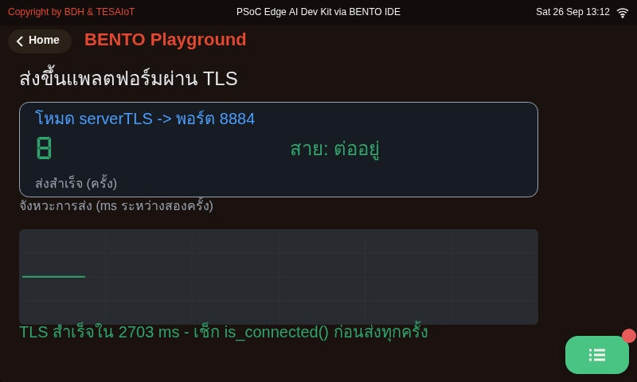

หน้าจอจากการรัน <a href="https://github.com/tesaiot/tesa-qualification-program/blob/main/courses/aiot-micropython/m04-iot-connectivity/l08-tesaiot-module/examples/06_secure_publish_loop.py"><code>06_secure_publish_loop.py</code></a> บน BENTO Emulator ที่ 800x480 เท่าจอของทั้งสองบอร์ด — ไม่ใช่ภาพวาด ไม่ใช่ mock-up และไม่ใช่ภาพถ่ายจากบอร์ด · หน้าจอของไฟล์เฉลย (ตารางตัวตน · ไฟสามดวงของการจับมือ · ปุ่มต่อใหม่/ตัดสาย · มาตรวัดเวลาจับมือ) ยังไม่ได้ถ่าย

- การ์ดบนบอกโหมดกับพอร์ตที่ใช้จริง **serverTLS -> 8884** · เลขใหญ่นับใบที่ส่งสำเร็จ · "สาย: ต่ออยู่" จะเปลี่ยนเป็นแดงทันทีที่หลุด
- กราฟล่างคือจังหวะการส่ง (ms ระหว่างสองครั้ง) — เส้นราบแปลว่าลูปเดินสม่ำเสมอ ไม่มีรอบไหนค้าง
- บรรทัดล่างสุดคือหลักฐานของชุดบทเรียน: **TLS สำเร็จใน 2738 ms** — การจับมือนับเป็นวินาที และต้องเช็ก `is_connected()` ก่อนส่งทุกครั้ง

> หน้าตาแทบไม่ต่างจากบทเรียน 4.4–4.6 — สิ่งที่เปลี่ยนคือเลขพอร์ต กับบรรทัด "TLS สำเร็จ" ที่ต้องรอเป็นวินาทีกว่าจะขึ้น

---

## ทบทวนบทเรียน 4.4–4.6 — เราหยุดไว้ตรงไหน

<svg viewBox="0 0 940 208" xmlns="http://www.w3.org/2000/svg">
  <rect x="16" y="56" width="176" height="78" rx="8" fill="#e8f5e9" stroke="#2e7d32" stroke-width="2"/>
  <text x="104" y="86" text-anchor="middle" font-size="20" font-weight="700" fill="#2e7d32">mqtt.connect()</text>
  <text x="104" y="112" text-anchor="middle" font-size="17" fill="#1b5e20">ต่อ broker ได้</text>
  <rect x="212" y="56" width="176" height="78" rx="8" fill="#e8f5e9" stroke="#2e7d32" stroke-width="2"/>
  <text x="300" y="86" text-anchor="middle" font-size="20" font-weight="700" fill="#2e7d32">publish()</text>
  <text x="300" y="112" text-anchor="middle" font-size="17" fill="#1b5e20">ส่ง JSON ทุก 5 วิ</text>
  <rect x="408" y="56" width="176" height="78" rx="8" fill="#e8f5e9" stroke="#2e7d32" stroke-width="2"/>
  <text x="496" y="86" text-anchor="middle" font-size="20" font-weight="700" fill="#2e7d32">subscribe()</text>
  <text x="496" y="112" text-anchor="middle" font-size="17" fill="#1b5e20">รับคำสั่งกลับมา</text>
  <rect x="604" y="56" width="176" height="78" rx="8" fill="#e8f5e9" stroke="#2e7d32" stroke-width="2"/>
  <text x="692" y="86" text-anchor="middle" font-size="20" font-weight="700" fill="#2e7d32">TESAIoT CE</text>
  <text x="692" y="112" text-anchor="middle" font-size="17" fill="#1b5e20">ของทีมเราเอง</text>
  <rect x="796" y="48" width="130" height="94" rx="8" fill="#fff3e0" stroke="#ef6c00" stroke-width="3"/>
  <text x="861" y="80" text-anchor="middle" font-size="20" font-weight="700" fill="#ef6c00">วันนี้</text>
  <text x="861" y="106" text-anchor="middle" font-size="17" fill="#e65100">tesaiot.*</text>
  <text x="861" y="128" text-anchor="middle" font-size="17" fill="#e65100">พอร์ต 8884</text>
  <line x1="194" y1="94" x2="208" y2="94" stroke="#90a4ae" stroke-width="2"/>
  <line x1="390" y1="94" x2="404" y2="94" stroke="#90a4ae" stroke-width="2"/>
  <line x1="586" y1="94" x2="600" y2="94" stroke="#90a4ae" stroke-width="2"/>
  <line x1="782" y1="94" x2="792" y2="94" stroke="#ef6c00" stroke-width="3"/>
  <circle r="7" fill="#ef6c00" cx="200" cy="94"><animateMotion path="M0,0 L100,0 L296,0 L492,0 L661,0" dur="2.6s" repeatCount="indefinite"/><animate attributeName="r" values="6;11;6" dur="2.6s" repeatCount="indefinite"/></circle>
  <text x="470" y="30" text-anchor="middle" font-size="20" font-weight="700" fill="#455a64">บทเรียน 4.4–4.6 ข้อมูลไหลครบสองทางแล้ว — แต่ไหลแบบเปลือย</text>
  <text x="470" y="176" text-anchor="middle" font-size="18" fill="#78909c">ต้องหยิบมาใช้ต่อวันนี้: JSON ส่งแบน ไม่ต้องห่อ · device_id ไม่เกิน 31 ตัวอักษร · ค่าต้องเป็นตัวเลขถึงขึ้นกราฟ</text>
  <text x="470" y="200" text-anchor="middle" font-size="18" font-weight="700" fill="#c62828">สิ่งที่ยังไม่ได้ทำ: พิสูจน์ว่าปลายทางเป็นตัวจริง และปิดไม่ให้คนกลางอ่าน</text>
</svg>

โมดูลก็เปลี่ยนด้วย — บทเรียน 4.4–4.6 ใช้ `mqtt.*` ที่เราเลือกโฮสต์และพอร์ตเองได้ ส่วนวันนี้ใช้ `tesaiot.*` ซึ่งเป็นโมดูลคนละตัว ตั้งค่าคนละแบบ และ **เลือกพอร์ตเองไม่ได้**

> ทุกข้อจำกัดของ `mqtt` ในชุดบทเรียนก่อนหน้ายังอยู่ครบ วันนี้แค่เพิ่มชั้นความปลอดภัยทับลงไป ไม่ได้ลบข้อจำกัดเดิม

---

## ก่อนเริ่มบทเรียน — ทุกทีมต้องมีตัวตนของตัวเอง

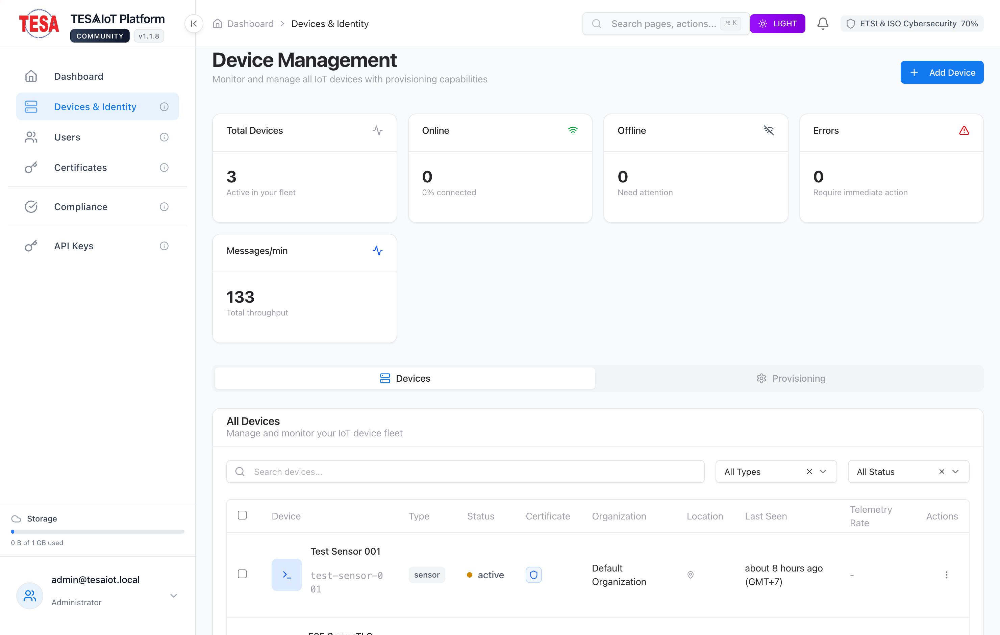 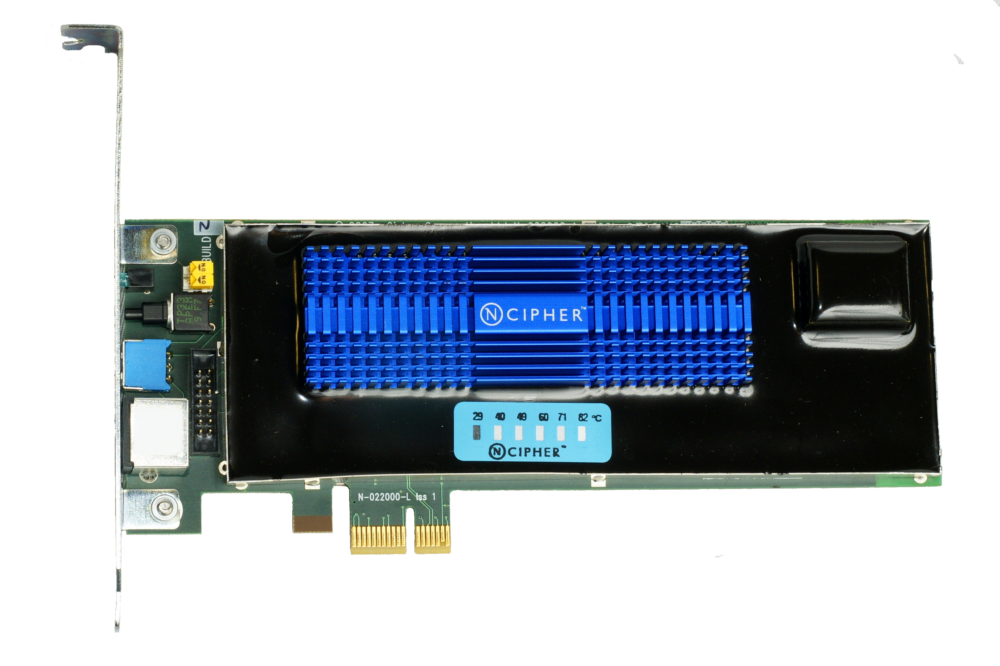

ซ้าย — ภาพหน้าจอ: TESAIoT Community Edition v1.1.8 — เอกสารของ repo (Apache-2.0) · ขวา — ภาพ: Alexander Klink / Wikimedia Commons — CC BY 3.0 — การ์ด HSM (nCipher nShield) ตัวจริงที่เสียบอยู่ในเครื่องของ CA: ตัวตนที่ทีมกำลังจะได้รับ ถูกเซ็นด้วยกุญแจที่อยู่ในของแบบนี้ ไม่ใช่ไฟล์บนโน้ตบุ๊กของใคร

**บอร์ดทุกตัวออกจากโรงงานมาพร้อม `device_id` ค่าเริ่มต้นตัวเดียวกันหมด** และ MQTT บังคับว่า client id ต้องไม่ซ้ำกันบน broker เดียวกัน

พอบอร์ดตัวที่สองต่อเข้ามาด้วย id เดิม broker จะ **เตะตัวแรกออก** ตัวแรกต่อใหม่แล้วเตะตัวที่สองออก วนแบบนี้ไปทั้งห้อง โดยที่โค้ดของทุกทีม **ถูกต้องหมด**

ผู้สอน provision ตัวตนรายทีมให้ก่อนบทเรียน ทีมต้องได้ครบสี่ค่า: **`device_id` · `api_key` · `mqtt_pass` · ชื่อโฮสต์ของ broker** — ลงบันทึกการเรียนก่อนแตะโค้ด

<svg viewBox="0 0 300 190" xmlns="http://www.w3.org/2000/svg">
  <rect x="8" y="10" width="284" height="172" rx="9" fill="#ffebee" stroke="#c62828" stroke-width="2"/>
  <text x="150" y="36" text-anchor="middle" font-size="19" font-weight="700" fill="#c62828">id ซ้ำ = ลูปเตะกันเอง</text>
  <rect x="26" y="52" width="104" height="46" rx="6" fill="#fff" stroke="#c62828" stroke-width="2"/>
  <text x="78" y="80" text-anchor="middle" font-size="18" fill="#b71c1c">ทีม A</text>
  <rect x="170" y="52" width="104" height="46" rx="6" fill="#fff" stroke="#c62828" stroke-width="2"/>
  <text x="222" y="80" text-anchor="middle" font-size="18" fill="#b71c1c">ทีม B</text>
  <rect x="98" y="118" width="104" height="46" rx="6" fill="#fff3e0" stroke="#ef6c00" stroke-width="2"/>
  <text x="150" y="146" text-anchor="middle" font-size="18" fill="#e65100">broker</text>
  <line x1="78" y1="100" x2="130" y2="116" stroke="#c62828" stroke-width="2.5"/>
  <line x1="222" y1="100" x2="170" y2="116" stroke="#c62828" stroke-width="2.5"/>
  <circle r="8" fill="#c62828" cx="78" cy="102"><animateMotion path="M0,0 L72,38 L144,0 L72,38 L0,0" dur="3.4s" repeatCount="indefinite"/><animate attributeName="r" values="5;10;5" dur="1.7s" repeatCount="indefinite"/></circle>
</svg>

> ทีมที่ยังไม่ได้ค่าครบสี่ตัว **ห้ามเริ่มท่าที่ 2** — ไม่ใช่กฎห้องเรียน แต่เป็นเพราะมันจะทำให้ทั้งห้องต่อไม่ติดพร้อมกัน

---

## กุญแจ ลายเซ็น และแฮช — สามชิ้นที่ TLS ประกอบขึ้นมา

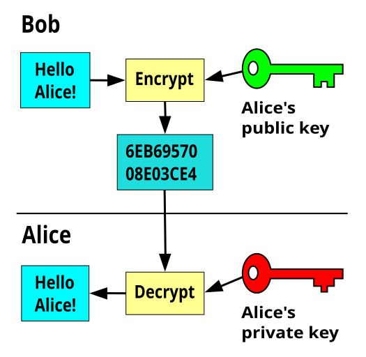 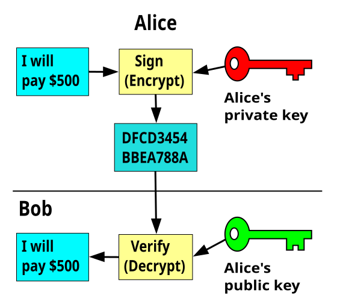 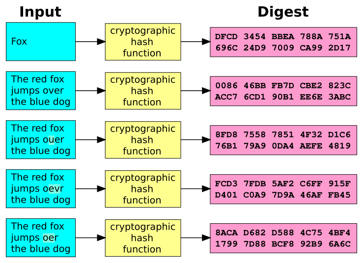

ซ้าย/กลาง — ภาพ: Davidgothberg / Wikimedia Commons — สาธารณสมบัติ · ขวา — ภาพ: Jorge Stolfi (ต่อยอดจากงานของ Helix84) / Wikimedia Commons — สาธารณสมบัติ

**ซ้าย — กุญแจคู่** ล็อกด้วยกุญแจสาธารณะของ Alice แล้ว **มีแต่กุญแจส่วนตัวของ Alice ที่เปิดได้** จึงส่งความลับให้คนที่ไม่เคยเจอกันได้ โดยไม่ต้องนัดรหัสกันก่อน

**กลาง — ลายเซ็น คือการกลับทิศ** เซ็นด้วยกุญแจส่วนตัว ใครก็ตรวจได้ด้วยกุญแจสาธารณะ — พิสูจน์ว่า "คนที่ถือกุญแจส่วนตัวใบนี้เป็นผู้เขียน" นี่คือกลไกที่ CA ใช้รับรองใบรับรอง

**ขวา — แฮช** ข้อความเปลี่ยนแค่ตัวอักษรเดียว ค่าที่ได้เปลี่ยนทั้งก้อน จึงใช้ย่อเอกสารยาว ๆ ให้เหลือค่าเดียวก่อนเซ็น และใช้ตรวจว่าข้อมูลระหว่างทางถูกแก้หรือไม่

> จำสามคำนี้ให้แม่น: **เข้ารหัส = ปิดไม่ให้อ่าน · เซ็น = พิสูจน์ว่าใครเขียน · แฮช = จับได้ว่าถูกแก้** TLS ใช้ทั้งสามพร้อมกันเสมอ

---

## ใบรับรองคืออะไรกันแน่ — เปิดดูข้างในทีละช่อง

<svg viewBox="0 0 940 300" xmlns="http://www.w3.org/2000/svg">
  <rect x="16" y="16" width="430" height="268" rx="10" fill="#f5f7fa" stroke="#455a64" stroke-width="2.5"/>
  <text x="231" y="46" text-anchor="middle" font-size="21" font-weight="700" fill="#37474f">ใบรับรอง X.509 ของเซิร์ฟเวอร์</text>
  <rect x="38" y="60" width="386" height="42" rx="6" fill="#e3f2fd" stroke="#1565c0" stroke-width="2"/>
  <text x="52" y="78" font-size="18" font-weight="700" fill="#1565c0">Subject — ชื่อที่ใบนี้พูดถึง</text>
  <text x="52" y="96" font-size="17" font-family="monospace" fill="#0d47a1">CN = broker.tesaiot.dev</text>
  <rect x="38" y="110" width="386" height="42" rx="6" fill="#e8f5e9" stroke="#2e7d32" stroke-width="2"/>
  <text x="52" y="128" font-size="18" font-weight="700" fill="#2e7d32">Public Key — กุญแจสาธารณะของเซิร์ฟเวอร์</text>
  <text x="52" y="146" font-size="17" font-family="monospace" fill="#1b5e20">RSA 2048 หรือ EC P-256</text>
  <rect x="38" y="160" width="386" height="42" rx="6" fill="#fff3e0" stroke="#ef6c00" stroke-width="2"/>
  <text x="52" y="178" font-size="18" font-weight="700" fill="#ef6c00">Validity — ช่วงเวลาที่ใช้ได้</text>
  <text x="52" y="196" font-size="17" font-family="monospace" fill="#e65100">notBefore / notAfter</text>
  <rect x="38" y="210" width="386" height="60" rx="6" fill="#f3e5f5" stroke="#6a1b9a" stroke-width="2"/>
  <text x="52" y="230" font-size="18" font-weight="700" fill="#6a1b9a">Issuer + Signature — ใครรับรอง และลายเซ็น</text>
  <text x="52" y="250" font-size="17" font-family="monospace" fill="#4a148c">CN = TESAIoT Intermediate CA</text>
  <text x="52" y="266" font-size="17" fill="#7e5a94">ลายเซ็นนี้คือทั้งหมดที่ทำให้เชื่อได้</text>
  <rect x="482" y="16" width="444" height="128" rx="10" fill="#e8f5e9" stroke="#2e7d32" stroke-width="2.5"/>
  <text x="704" y="44" text-anchor="middle" font-size="20" font-weight="700" fill="#2e7d32">ใบรับรองรับรองอะไร</text>
  <text x="502" y="72" font-size="18" fill="#1b5e20">"กุญแจสาธารณะใบนี้ เป็นของชื่อโฮสต์นี้จริง"</text>
  <text x="502" y="98" font-size="18" fill="#1b5e20">และมี CA ที่เรารู้จักเซ็นรับรองข้อความนั้นไว้</text>
  <text x="502" y="126" font-size="17" fill="#4a7c4e">ใบรับรองเป็นข้อมูลสาธารณะ ไม่ใช่ความลับ ก๊อปได้</text>
  <rect x="482" y="156" width="444" height="128" rx="10" fill="#ffebee" stroke="#c62828" stroke-width="2.5"/>
  <text x="704" y="184" text-anchor="middle" font-size="20" font-weight="700" fill="#c62828">ใบรับรอง ไม่ ได้รับรองอะไร</text>
  <text x="502" y="212" font-size="18" fill="#b71c1c">ไม่ได้บอกว่าเจ้าของเป็นคนดีหรือปลอดภัย</text>
  <text x="502" y="238" font-size="18" fill="#b71c1c">ไม่ได้บอกว่าข้อมูลที่ส่งไปจะถูกเก็บอย่างดี</text>
  <text x="502" y="266" font-size="17" fill="#8d6e63">พิสูจน์แค่ "ชื่อคู่กับกุญแจ" — เท่านั้นจริง ๆ</text>
</svg>

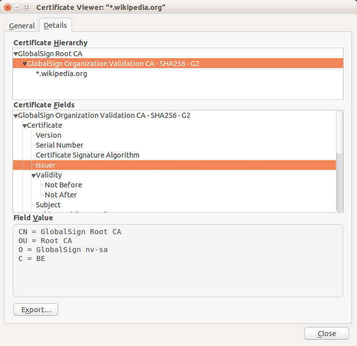

ภาพ: Winstonlee / Wikimedia Commons — CC BY-SA 4.0 — ใบรับรองจริงที่เปิดดูจากเบราว์เซอร์บนเครื่องผู้ใช้: ช่อง Issuer, Validity และ Subject ที่กล่องซ้ายมือกำลังไล่อธิบาย อยู่ครบในหน้าต่างนี้ และกรอบบนสุดคือห่วงโซ่ root → intermediate → leaf ของสไลด์ถัดไป

สิ่งที่ทำให้ใบรับรองมีค่าไม่ใช่เนื้อหาข้างใน (ใครก็พิมพ์ได้) แต่คือ **ลายเซ็นของ CA ที่อยู่ท้ายใบ** — และเราตรวจลายเซ็นนั้นได้ก็ต่อเมื่อ **มีกุญแจสาธารณะของ CA อยู่ในมือแล้วตั้งแต่ต้น**

> ประโยคที่ควรจำไปใช้ทำงาน: ใบรับรองแปลว่า **"มีคนที่คุณเชื่ออยู่แล้ว ยืนยันว่ากุญแจนี้เป็นของชื่อนี้"** ไม่มากกว่านั้นแม้แต่นิดเดียว

---

## ห่วงโซ่ความเชื่อถือ — root → intermediate → leaf

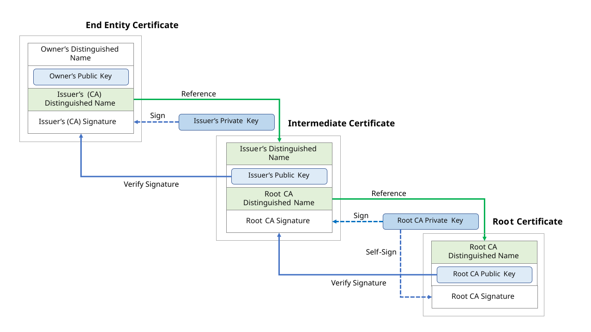

ภาพ: Yuhkih / Wikimedia Commons — CC BY-SA 4.0

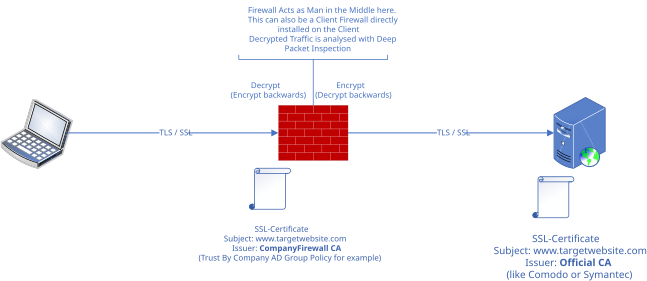

ภาพ: Rudolf.Achter / Wikimedia Commons — CC BY-SA 4.0

<iframe width="270" height="152" src="https://www.youtube.com/embed/lLw0dICMA_Y" title="PKI Bootcamp - Basics of Certificate Chain Validation" loading="lazy" frameborder="0" allowfullscreen></iframe>

**ซ้าย** — ใบของเซิร์ฟเวอร์ (leaf) ถูกเซ็นโดย intermediate, intermediate ถูกเซ็นโดย root และ root **เซ็นตัวเอง** ห่วงโซ่จบตรงนั้นเสมอ เพราะ root คือสิ่งที่เรา "ตัดสินใจเชื่อ" ไว้ล่วงหน้า ไม่ใช่สิ่งที่พิสูจน์ได้ · **ขวา** — ถ้ามีกล่องกลางทางที่เรา (หรือผู้ดูแลเครือข่าย) ใส่ CA ของมันไว้ในเครื่อง มันจะออกใบรับรองชื่อเดียวกันได้ และเราจะเชื่อโดยไม่รู้ตัว — นั่นคือเหตุผลว่าทำไม **รายชื่อ CA ที่เชื่อ ถึงสำคัญพอ ๆ กับตัวการเข้ารหัส**

**PKI Bootcamp — Basics of Certificate Chain Validation** — Paul Turner · 3 นาที 42 วินาที · อังกฤษ — ตอบคำถาม "ทำไมบอร์ดต้องมี root CA ติดตัว" ได้ครบใน 4 นาที

> ความเชื่อไม่ได้เกิดจากการพิสูจน์ทั้งเส้น มันเกิดจาก **จุดเริ่มต้นที่เราเลือกเชื่อไว้ก่อน** แล้วพิสูจน์ต่อจากจุดนั้นลงมา

---

## การจับมือ TLS ทีละขั้น — ในภาษาที่เราใช้กันจริง

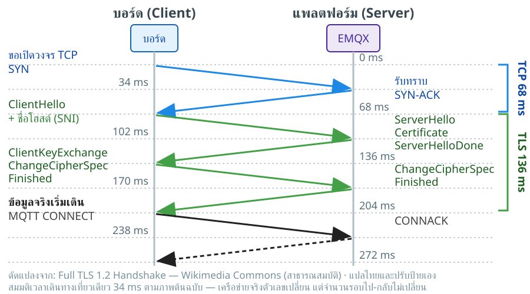

<iframe width="290" height="163" src="https://www.youtube.com/embed/yRWFOP66OE0" title="พื้นฐาน SSL TLS HTTPS CSR Certificate คืออะไร ทำงานอย่างไร" loading="lazy" frameborder="0" allowfullscreen></iframe>

**พื้นฐาน SSL TLS HTTPS CSR Certificate** — SaKKo sama · 11 นาที 56 วินาที · **ไทย** — คลิปภาษาไทยที่ครอบคลุมทั้ง TLS, HTTPS, CSR และใบรับรอง

สี่จังหวะที่ต้องจำ: **หนึ่ง** TCP ต่อวงจรก่อน (ยังไม่มีอะไรเข้ารหัส) · **สอง** `ClientHello` บอกว่าเรารองรับอะไรบ้าง และ **แนบชื่อโฮสต์ปลายทางไปด้วย** · **สาม** เซิร์ฟเวอร์ยื่นใบรับรอง เราตรวจลายเซ็นย้อนขึ้นไปถึง root ที่เรามี แล้วแลกกุญแจลับของรอบนี้ · **สี่** ตั้งแต่ `Finished` เป็นต้นไปทุกไบต์ถูกเข้ารหัส แล้ว MQTT CONNECT ค่อยเดินเข้าไปข้างใน

ตัวเลขในภาพสมมติเวลาเดินทางเที่ยวเดียว 34 ms ตามภาพต้นฉบับ — บนเครือข่ายจริงตัวเลขเปลี่ยน แต่ **จำนวนรอบไป-กลับไม่เปลี่ยน** และนั่นคือเหตุผลที่ TLS ใช้เวลาเป็น "วินาที" ไม่ใช่ "มิลลิวินาที" บนอุปกรณ์เล็ก

> MQTT ไม่ได้รู้เรื่อง TLS เลย — มันแค่ถูกวางไว้ **ข้างใน** ท่อที่ TLS สร้างเสร็จแล้ว นี่คือความหมายของตัว s ใน MQTTs

---

## เกร็ด: TLS 1.3 ตัดรอบไป-กลับออกไปหนึ่งรอบ

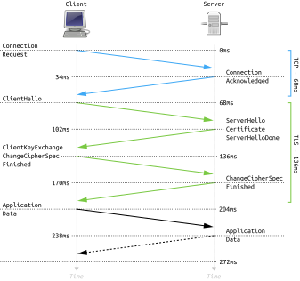 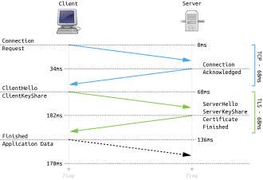

ภาพทั้งสอง: Fleshgrinder และ The Tango! Desktop Project / Wikimedia Commons — สาธารณสมบัติ · ซ้าย TLS 1.2 · ขวา TLS 1.3

TLS 1.2 (RFC 5246, ปี 2008) ใช้ **สองรอบไป-กลับ** กว่าจะเริ่มส่งข้อมูลจริง ส่วน TLS 1.3 (RFC 8446, ปี 2018) ย้ายการเสนอกุญแจไปไว้ใน `ClientHello` เลย จึงเหลือ **รอบเดียว** — ในภาพคือ 136 ms เทียบกับ 68 ms และตัดชุดวิธีเข้ารหัสรุ่นเก่าที่มีปัญหาออกไปทั้งหมด

**เชื่อมกับวันนี้:** เฟิร์มแวร์ของเราเจรจา **TLS 1.2** ไม่ใช่ 1.3 นั่นแปลว่าเวลารอเชื่อมต่อของเราอยู่ในกลุ่มบนของภาพซ้าย — ทั้ง TCP, การจับมือ, การตรวจใบรับรอง แล้วค่อยถึง MQTT CONNECT บวกกันแล้วกินเวลาหลายวินาทีบนบอร์ดที่ CPU ช้า จึงเป็นเหตุผลตรง ๆ ที่โค้ดวันนี้ **ต้องมีลูปรอ** ไม่ใช่เขียน publish ต่อท้าย connect ทันที

---

## SNI — ชื่อที่เดินไปก่อนการเข้ารหัส

<svg viewBox="0 0 940 286" xmlns="http://www.w3.org/2000/svg">
  <rect x="14" y="70" width="184" height="120" rx="10" fill="#132033" stroke="#3d5a80" stroke-width="2"/>
  <text x="106" y="104" text-anchor="middle" font-size="20" font-weight="700" fill="#8fb8e0">บอร์ดของเรา</text>
  <text x="106" y="132" text-anchor="middle" font-size="18" fill="#6b8fb5">ClientHello</text>
  <text x="106" y="158" text-anchor="middle" font-size="17" fill="#6b8fb5">ยังไม่เข้ารหัส</text>
  <rect x="380" y="46" width="188" height="168" rx="10" fill="#eceff1" stroke="#455a64" stroke-width="2.5"/>
  <text x="474" y="76" text-anchor="middle" font-size="20" font-weight="700" fill="#37474f">เครื่องเดียว</text>
  <text x="474" y="100" text-anchor="middle" font-size="18" fill="#546e7a">หนึ่ง IP</text>
  <text x="474" y="126" text-anchor="middle" font-size="18" fill="#546e7a">หลายชื่อโฮสต์</text>
  <rect x="398" y="140" width="152" height="28" rx="5" fill="#e3f2fd" stroke="#1565c0"/>
  <text x="474" y="160" text-anchor="middle" font-size="17" fill="#0d47a1">ใบรับรอง A</text>
  <rect x="398" y="176" width="152" height="28" rx="5" fill="#e8f5e9" stroke="#2e7d32"/>
  <text x="474" y="196" text-anchor="middle" font-size="17" fill="#1b5e20">ใบรับรอง B</text>
  <line x1="202" y1="118" x2="374" y2="118" stroke="#ef6c00" stroke-width="3"/>
  <polygon points="378,118 364,111 364,125" fill="#ef6c00"/>
  <circle r="8" fill="#ef6c00" cx="206" cy="118"><animateMotion path="M0,0 L164,0" dur="2.4s" repeatCount="indefinite"/><animate attributeName="r" values="5;11;5" dur="2.4s" repeatCount="indefinite"/></circle>
  <text x="288" y="100" text-anchor="middle" font-size="18" font-weight="700" fill="#ef6c00">server_name</text>
  <text x="288" y="146" text-anchor="middle" font-size="17" fill="#a1683a">= sni_hostname</text>
  <rect x="600" y="46" width="326" height="76" rx="9" fill="#e8f5e9" stroke="#2e7d32" stroke-width="2"/>
  <text x="763" y="74" text-anchor="middle" font-size="19" font-weight="700" fill="#2e7d32">ตั้งตรงกับ broker</text>
  <text x="763" y="100" text-anchor="middle" font-size="18" fill="#1b5e20">ได้ใบที่ถูก ตรวจผ่าน ต่อติด</text>
  <rect x="600" y="138" width="326" height="76" rx="9" fill="#ffebee" stroke="#c62828" stroke-width="2"/>
  <text x="763" y="166" text-anchor="middle" font-size="19" font-weight="700" fill="#c62828">ตั้งไม่ตรง</text>
  <text x="763" y="192" text-anchor="middle" font-size="18" fill="#b71c1c">ได้ใบผิด ตรวจไม่ผ่าน ล้มเงียบ</text>
  <line x1="572" y1="84" x2="596" y2="84" stroke="#2e7d32" stroke-width="2.5"/>
  <line x1="572" y1="176" x2="596" y2="176" stroke="#c62828" stroke-width="2.5"/>
  <text x="470" y="248" text-anchor="middle" font-size="20" font-weight="700" fill="#455a64">SNI คือชื่อโฮสต์ที่เดินไปแบบเปิดเผย ก่อนการเข้ารหัสจะเริ่ม</text>
  <text x="470" y="274" text-anchor="middle" font-size="18" fill="#78909c">นี่คือสิ่งเดียวที่คนดักฟังยังเห็นได้บนพอร์ต 8884 — เห็นว่าเราคุยกับใคร แต่ไม่เห็นว่าคุยว่าอะไร</text>
</svg>

เซิร์ฟเวอร์ตัวเดียวโฮสต์หลายชื่อได้ จึงต้องรู้ตั้งแต่ประโยคแรกว่าเราจะคุยกับชื่อไหน ถึงจะหยิบใบรับรองใบที่ถูกมายื่นให้ — นี่คือหน้าที่ของ `sni_hostname` ในโค้ดวันนี้ และเป็นเหตุผลที่มันต้อง **เท่ากับชื่อ broker เป๊ะ ๆ**

> ตั้ง `sni_hostname` ผิด อาการที่ได้คือ **"ต่อไม่ติด โดยไม่มีข้อความอะไรเลย"** — ไม่ใช่ error ที่บอกว่าชื่อผิด จำอาการนี้ไว้ตั้งแต่ตอนนี้

---

## เข้าใจฮาร์ดแวร์ · TLS วิ่งอยู่ตรงไหนบนบอร์ด

<svg viewBox="0 0 940 300" xmlns="http://www.w3.org/2000/svg">
  <rect x="14" y="24" width="452" height="200" rx="12" fill="#e3f2fd" stroke="#1565c0" stroke-width="2.5"/>
  <text x="240" y="54" text-anchor="middle" font-size="21" font-weight="700" fill="#1565c0">CM33_NS — คอร์ที่รัน MicroPython</text>
  <rect x="36" y="68" width="190" height="52" rx="7" fill="#fff" stroke="#1565c0" stroke-width="1.5"/>
  <text x="131" y="90" text-anchor="middle" font-size="18" fill="#0d47a1">โค้ด Python ของเรา</text>
  <text x="131" y="110" text-anchor="middle" font-size="17" fill="#5472a3">tesaiot.publish()</text>
  <rect x="250" y="68" width="196" height="52" rx="7" fill="#fff" stroke="#1565c0" stroke-width="1.5"/>
  <text x="348" y="90" text-anchor="middle" font-size="18" fill="#0d47a1">งาน TLS + MQTT</text>
  <text x="348" y="110" text-anchor="middle" font-size="17" fill="#5472a3">เข้ารหัสทุกไบต์ที่ออก</text>
  <rect x="36" y="132" width="410" height="46" rx="7" fill="#fff" stroke="#1565c0" stroke-width="1.5"/>
  <text x="241" y="161" text-anchor="middle" font-size="18" fill="#0d47a1">ไดรเวอร์ WiFi — วิทยุตัวเดียวของทั้งบอร์ด</text>
  <text x="240" y="204" text-anchor="middle" font-size="18" fill="#5472a3">root CA ถูกฝังไว้ในเฟิร์มแวร์ตั้งแต่ตอน build</text>
  <rect x="482" y="24" width="444" height="200" rx="12" fill="#e8f5e9" stroke="#2e7d32" stroke-width="2.5"/>
  <text x="704" y="54" text-anchor="middle" font-size="21" font-weight="700" fill="#2e7d32">CM55 — คอร์ที่วาดจอและอ่านเซนเซอร์</text>
  <text x="704" y="86" text-anchor="middle" font-size="18" fill="#1b5e20">อ่าน CapSense / pot ให้เรา · IMU ด้วยบน Eva</text>
  <text x="704" y="112" text-anchor="middle" font-size="18" fill="#1b5e20">วาดผลบนจอผ่าน LVGL</text>
  <text x="704" y="138" text-anchor="middle" font-size="18" fill="#1b5e20">ไม่แตะเครือข่ายและไม่แตะการเข้ารหัสเลย</text>
  <text x="704" y="172" text-anchor="middle" font-size="18" font-weight="700" fill="#2e7d32">ค่าเซนเซอร์เดินข้ามมาทาง IPC ก่อนถูกเข้ารหัส</text>
  <text x="704" y="204" text-anchor="middle" font-size="17" fill="#4a7c4e">จอค้างไม่ได้แปลว่า TLS หลุด และในทางกลับกันด้วย</text>
  <line x1="470" y1="124" x2="478" y2="124" stroke="#455a64" stroke-width="3"/>
  <circle r="7" fill="#455a64" cx="466" cy="124"><animateMotion path="M0,0 L16,0 L0,0" dur="2s" repeatCount="indefinite"/><animate attributeName="r" values="5;10;5" dur="2s" repeatCount="indefinite"/></circle>
  <text x="470" y="256" text-anchor="middle" font-size="20" font-weight="700" fill="#c62828">TLS ต้องการหน่วยความจำก้อนใหญ่ที่สุดตอนจับมือ — ไม่ใช่ตอนส่งข้อมูล</text>
  <text x="470" y="282" text-anchor="middle" font-size="18" fill="#8d6e63">นี่คือเหตุผลที่เฟิร์มแวร์จัดสรรหน่วยความจำให้เส้นทาง tesaiot ไว้ล่วงหน้า และเป็นเหตุผลที่ MPY heap มีแค่ 64 KB</text>
</svg>

การเข้ารหัสทั้งหมดเกิดบน **CM33_NS คอร์เดียวกับที่รันโค้ด Python** ทุกไบต์ที่ `tesaiot.publish()` ส่งออกไปจะถูกเข้ารหัสก่อนลงสายอากาศ ส่วน CM55 ที่วาดจอไม่รู้เรื่องด้วยเลย — ภาพนี้จริงทั้งสองบอร์ด เพราะโค้ด Wi-Fi/MQTT/TLS เป็นชุดเดียวกัน ต่างกันแค่ว่าใครอ่าน IMU: บน Eva คอร์จออ่านให้ บน Dev Kit CM33 อ่านเองจาก I2C (CapSense กับลูกบิดยังมาจากคอร์จอทั้งคู่)

ข้อที่ต้องจำ: **ช่วงจับมือคือช่วงที่กินหน่วยความจำและเวลามากที่สุด** ถ้าสคริปต์ของเราสร้าง widget เพียบหรือเก็บลิสต์ใหญ่ ๆ ไว้ก่อนเรียก `connect()` โอกาสล้มจะสูงขึ้นทันที — ต่อให้เน็ตดีทุกอย่าง

> เรียก `tesaiot.connect()` **ตอนต้นสคริปต์ ตอนหน่วยความจำยังโล่ง** แล้วค่อยไปทำอย่างอื่น อย่าเรียกกลางลูปที่ของเต็มมือ

---

## กลไกหลักของชุดบทเรียน — พอร์ตมาจาก `tls_mode` ไม่ใช่คีย์ `port`

<svg viewBox="0 0 940 300" xmlns="http://www.w3.org/2000/svg">
  <text x="20" y="30" font-size="20" font-weight="700" fill="#c62828">กับดักข้อแรกของชุดบทเรียน: มีคีย์ชื่อ port อยู่จริง แต่มันไม่ได้เลือกพอร์ต</text>
  <rect x="18" y="46" width="300" height="110" rx="9" fill="#0d1117" stroke="#30363d" stroke-width="2"/>
  <text x="36" y="76" font-size="17" font-family="monospace" fill="#7ee787">config_set("tls_mode",</text>
  <text x="36" y="100" font-size="17" font-family="monospace" fill="#a5d6ff">           "server_tls")</text>
  <text x="36" y="130" font-size="17" font-family="monospace" fill="#8b949e">ค่าเริ่มต้นของบอร์ดอยู่แล้ว</text>
  <rect x="18" y="172" width="300" height="110" rx="9" fill="#0d1117" stroke="#c62828" stroke-width="2"/>
  <text x="36" y="202" font-size="17" font-family="monospace" fill="#ff7b72">config_set("port", 1883)</text>
  <text x="36" y="230" font-size="17" font-family="monospace" fill="#8b949e">ตั้งได้ ไม่ error</text>
  <text x="36" y="256" font-size="17" font-family="monospace" fill="#ff7b72">แต่เปลี่ยนแค่ป้ายที่แสดง</text>
  <rect x="392" y="90" width="180" height="120" rx="10" fill="#eceff1" stroke="#455a64" stroke-width="2.5"/>
  <text x="482" y="122" text-anchor="middle" font-size="20" font-weight="700" fill="#37474f">เฟิร์มแวร์</text>
  <text x="482" y="150" text-anchor="middle" font-size="18" fill="#546e7a">อ่าน tls_mode</text>
  <text x="482" y="176" text-anchor="middle" font-size="18" fill="#546e7a">แล้วเลือกพอร์ตเอง</text>
  <line x1="322" y1="100" x2="386" y2="130" stroke="#2e7d32" stroke-width="3"/>
  <polygon points="390,132 375,128 379,120" fill="#2e7d32"/>
  <line x1="322" y1="226" x2="386" y2="170" stroke="#c62828" stroke-width="3" stroke-dasharray="7 5"/>
  <text x="352" y="212" font-size="18" font-weight="700" fill="#c62828">ตัน</text>
  <circle r="8" fill="#2e7d32" cx="322" cy="100"><animateMotion path="M0,0 L64,30 L250,50 L378,20" dur="3s" repeatCount="indefinite"/><animate attributeName="r" values="5;11;5" dur="3s" repeatCount="indefinite"/></circle>
  <rect x="646" y="46" width="278" height="72" rx="9" fill="#e8f5e9" stroke="#2e7d32" stroke-width="2.5"/>
  <text x="785" y="76" text-anchor="middle" font-size="20" font-weight="700" fill="#2e7d32">server_tls → 8884</text>
  <text x="785" y="102" text-anchor="middle" font-size="18" fill="#1b5e20">เส้นทางของชุดบทเรียนนี้</text>
  <rect x="646" y="132" width="278" height="72" rx="9" fill="#e3f2fd" stroke="#1565c0" stroke-width="2"/>
  <text x="785" y="162" text-anchor="middle" font-size="20" font-weight="700" fill="#1565c0">mutual_tls → 8883</text>
  <text x="785" y="188" text-anchor="middle" font-size="18" fill="#0d47a1">เส้นทางที่ต้องมีใบรับรองของอุปกรณ์</text>
  <rect x="646" y="218" width="278" height="64" rx="9" fill="#fff3e0" stroke="#ef6c00" stroke-width="2"/>
  <text x="785" y="246" text-anchor="middle" font-size="19" font-weight="700" fill="#ef6c00">จอ Eva แสดงเลขที่เราตั้ง</text>
  <text x="785" y="270" text-anchor="middle" font-size="17" fill="#a1683a">ค่าที่แสดง ≠ ค่าที่ระบบใช้จริง</text>
  <text x="482" y="240" text-anchor="middle" font-size="18" font-weight="700" fill="#455a64">พอร์ตเป็นผลลัพธ์</text>
  <text x="482" y="264" text-anchor="middle" font-size="17" fill="#78909c">ไม่ใช่ค่าที่รับเข้ามา</text>
</svg>

นี่คือรูปแบบที่จะเจอไปทั้งชีวิตการทำงาน: **ค่าที่ตั้งได้ ไม่ได้แปลว่าค่านั้นมีผล** และ **ค่าที่จอแสดง ไม่ได้แปลว่าระบบใช้ค่านั้น** ในบันทึกการเรียน ผู้เรียนจะได้ลองตั้ง `port` ให้ผิดแล้วดูเองว่าพอร์ตจริงไม่ขยับ · "จอ" ในกล่องล่างขวาคือการ์ด **TESAIoT Connectivity** ซึ่งมีบนหน้า Home ของ Eva Kit เท่านั้น — บน Dev Kit ไม่มีการ์ดนี้ ให้ดูจาก `print(tesaiot.config())` แทน ผลเหมือนกันทุกประการ: คีย์ `port` เปลี่ยน แต่พอร์ตที่ต่อจริงไม่เปลี่ยน

> ถ้าอยากรู้ว่าระบบใช้พอร์ตอะไรจริง ๆ ให้ดู `tls_mode` — และถ้าอยากรู้ว่า API ตัวไหนหลอกเรา ให้ **วัดผลที่ปลายทาง ไม่ใช่อ่านค่าที่ตัวเองเพิ่งตั้ง**

---

## ทำไม MQTTs ยิงเข้า CE ที่ทีมติดตั้งเองไม่ได้

<svg viewBox="0 0 940 292" xmlns="http://www.w3.org/2000/svg">
  <rect x="14" y="40" width="272" height="150" rx="10" fill="#132033" stroke="#3d5a80" stroke-width="2.5"/>
  <text x="150" y="72" text-anchor="middle" font-size="20" font-weight="700" fill="#8fb8e0">บอร์ดของเรา</text>
  <rect x="36" y="86" width="228" height="46" rx="6" fill="#1c2c44" stroke="#5a83b0"/>
  <text x="150" y="106" text-anchor="middle" font-size="18" fill="#8fb8e0">root CA ของแพลตฟอร์ม</text>
  <text x="150" y="126" text-anchor="middle" font-size="17" fill="#6b8fb5">คอมไพล์ติดมากับเฟิร์มแวร์</text>
  <text x="150" y="160" text-anchor="middle" font-size="18" font-weight="700" fill="#ffab91">ไม่มี API ให้เปลี่ยนตอนรัน</text>
  <text x="150" y="182" text-anchor="middle" font-size="17" fill="#6b8fb5">เปลี่ยนได้ทางเดียวคือ build ใหม่</text>
  <rect x="654" y="24" width="272" height="120" rx="10" fill="#e8f5e9" stroke="#2e7d32" stroke-width="2.5"/>
  <text x="790" y="54" text-anchor="middle" font-size="20" font-weight="700" fill="#2e7d32">แพลตฟอร์ม TESAIoT</text>
  <text x="790" y="82" text-anchor="middle" font-size="18" fill="#1b5e20">ใบรับรองห้อยจาก root ใบนั้น</text>
  <text x="790" y="108" text-anchor="middle" font-size="18" fill="#1b5e20">ตรวจผ่าน · ต่อได้จริง</text>
  <text x="790" y="132" text-anchor="middle" font-size="17" fill="#4a7c4e">นี่คือปลายทางของบทเรียน 4.7–4.9</text>
  <rect x="654" y="162" width="272" height="120" rx="10" fill="#ffebee" stroke="#c62828" stroke-width="2.5"/>
  <text x="790" y="192" text-anchor="middle" font-size="20" font-weight="700" fill="#c62828">TESAIoT CE ของทีมเอง</text>
  <text x="790" y="220" text-anchor="middle" font-size="18" fill="#b71c1c">สุ่ม root CA ใหม่ทุกครั้งที่ติดตั้ง</text>
  <text x="790" y="246" text-anchor="middle" font-size="18" fill="#b71c1c">บอร์ดไม่รู้จัก จึงตรวจไม่ผ่าน</text>
  <text x="790" y="270" text-anchor="middle" font-size="17" fill="#8d6e63">ไม่ใช่บั๊ก — เป็นผลของการออกแบบ</text>
  <line x1="290" y1="84" x2="648" y2="84" stroke="#2e7d32" stroke-width="3"/>
  <polygon points="652,84 638,77 638,91" fill="#2e7d32"/>
  <circle r="8" fill="#2e7d32" cx="292" cy="84"><animateMotion path="M0,0 L352,0" dur="2.8s" repeatCount="indefinite"/><animate attributeName="r" values="5;11;5" dur="2.8s" repeatCount="indefinite"/></circle>
  <text x="470" y="70" text-anchor="middle" font-size="18" font-weight="700" fill="#2e7d32">8884 · ผ่าน</text>
  <line x1="290" y1="222" x2="560" y2="222" stroke="#c62828" stroke-width="3" stroke-dasharray="8 6"/>
  <line x1="566" y1="200" x2="606" y2="244" stroke="#c62828" stroke-width="4"/>
  <line x1="606" y1="200" x2="566" y2="244" stroke="#c62828" stroke-width="4"/>
  <text x="424" y="208" text-anchor="middle" font-size="18" font-weight="700" fill="#c62828">8884 · ไม่ผ่าน</text>
  <text x="424" y="248" text-anchor="middle" font-size="17" fill="#8d6e63">บทเรียน 4.4–4.6 ใช้ 1883 กับ CE จึงทำได้</text>
</svg>

**บทเรียน 4.4–4.6 ใช้ MQTT ธรรมดา (1883) ยิงเข้า CE ที่ทีมติดตั้งเอง — ได้จริง · บทเรียน 4.7–4.9 ใช้ MQTTs (8884) ยิงเข้าแพลตฟอร์ม TESAIoT อย่างเป็นทางการ ที่เฟิร์มแวร์ฝัง CA ไว้ตรงกัน — ได้จริง** แต่ **การเอา MQTTs ไปยิง CE ที่ self-host ทำไม่ได้ในวันนี้** เพราะสคริปต์ติดตั้งของ CE สร้าง root CA ใหม่แบบสุ่มทุกครั้ง ใบรับรองของ broker จึงห้อยจาก root ที่บอร์ดไม่มีทางรู้จัก

จะทำให้ได้ต้องเอา CA ของ CE ชุดนั้น **ใส่กลับเข้าไปในซอร์สแล้ว build เฟิร์มแวร์ใหม่ทุกบอร์ด** ต่อการติดตั้งหนึ่งชุด — เป็นงานที่ทำได้ แต่ไม่ใช่งานของชุดบทเรียนนี้

> ถ้ามีทีมไหนลองแล้วต่อไม่ติด **ไม่ต้องดีบักโค้ด** — มันไม่ใช่โค้ดของทีม มันคือกุญแจที่ไม่ตรงรู กลับไปใช้โฮสต์ที่ผู้สอนให้มา

---

## serverTLS พิสูจน์ตัวตนได้ข้างเดียว

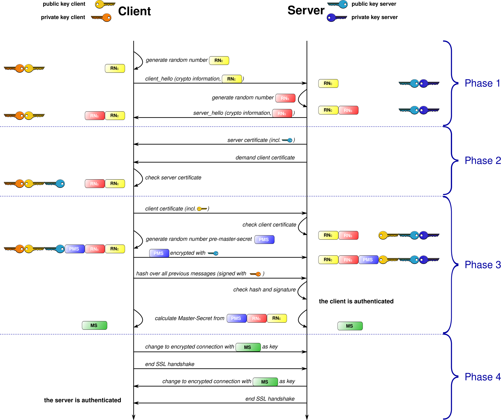

ภาพ: Essich / Wikimedia Commons — CC BY 3.0 — ภาพนี้คือ mTLS ที่ยื่นใบรับรอง <b>ทั้งสองฝั่ง</b> วันนี้เราทำแค่ครึ่งเดียวของมัน

**สิ่งที่วันนี้ทำได้จริง**

- ข้อมูลถูกเข้ารหัสตลอดทาง คนกลางอ่านไม่ได้ และแก้ระหว่างทางไม่ได้โดยเราไม่รู้
- เรารู้ว่า **เซิร์ฟเวอร์เป็นตัวจริง** เพราะมันยื่นใบที่ CA ของเราเซ็น และชื่อในใบตรงกับ SNI ที่เราขอ

**สิ่งที่วันนี้ยัง ไม่ ได้ทำ**

- เซิร์ฟเวอร์ **ไม่รู้ว่าอุปกรณ์ตัวไหนพูด** — มันรู้แค่ว่ามีคนที่รู้ `device_id` กับ `mqtt_pass` ที่ถูกต้อง
- ความลับชนิดนั้น **คัดลอกได้** ใครได้รหัสไปก็ปลอมเป็นบอร์ดเราได้ทันที และเซิร์ฟเวอร์แยกไม่ออก
- ในภาพซ้าย ขั้น "client certificate" คือส่วนที่หายไป — นั่นคือ **mTLS** ที่ต้องมีกุญแจส่วนตัวอยู่ในอุปกรณ์จริง ๆ

> ประโยคที่ต้องตอบได้โดยไม่เปิดสไลด์: **serverTLS พิสูจน์ช่องทางและพิสูจน์เซิร์ฟเวอร์ — ไม่ได้พิสูจน์อุปกรณ์** ตัวตนอุปกรณ์วันนี้มาจากรหัสผ่าน ซึ่งเป็นความลับที่ถูกก๊อปได้

---

## 1883 กับ 8884 — ตารางที่ทีมต้องกรอกให้ได้เอง

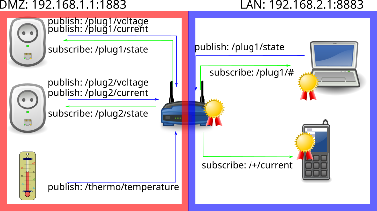

ภาพ: Ademant / Wikimedia Commons — CC BY-SA 4.0 — broker ตัวเดียวเปิดได้ทั้ง listener ธรรมดาและ listener ที่มีใบรับรอง

| | บทเรียน 4.4–4.6 · 1883 | วันนี้ · 8884 |
|---|---|---|
| การเข้ารหัส | ไม่มีเลย | TLS 1.2 |
| ตัวตนของ broker | ไม่มีการพิสูจน์ | ใบรับรองที่ CA เซ็น + ตรวจ SNI |
| ตัวตนของอุปกรณ์ | client_id ที่ใครก็อ้างได้ | credentials ที่ provision รายทีม |
| ปลายทาง | CE ที่ทีมติดตั้งเอง | แพลตฟอร์ม TESAIoT |
| โมดูล | `mqtt` | `tesaiot` |

พอร์ต 1883 **ไม่ได้ "ปลอดภัยน้อยกว่า" — มันไม่มีความปลอดภัยเลย** ทั้งเรื่องเนื้อหาและเรื่องตัวตน สิ่งที่ 8884 เพิ่มเข้ามาคือสองอย่างพร้อมกัน: การเข้ารหัส และการรู้ว่ากำลังคุยกับใคร

> อย่าท่องตารางนี้ — ให้ **ดักจับเอง** แล้วกรอกในบันทึกการเรียนจากสิ่งที่เห็นด้วยตา นั่นคือหลักฐานที่ใช้ได้จริง
