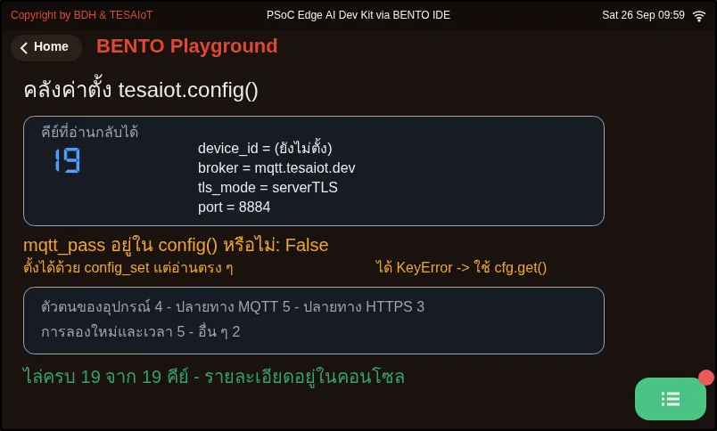
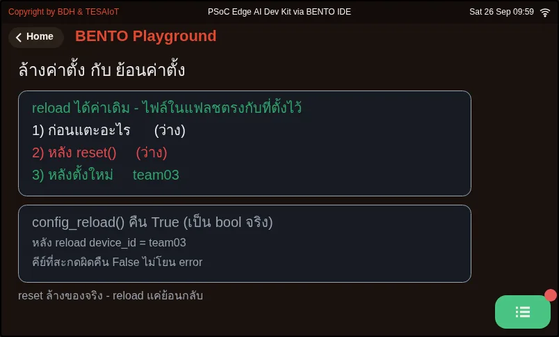
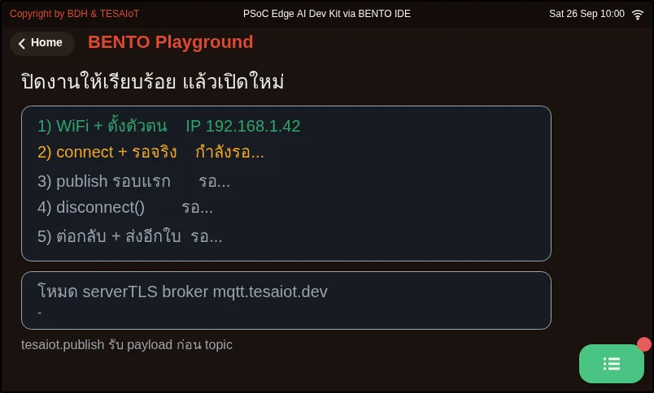
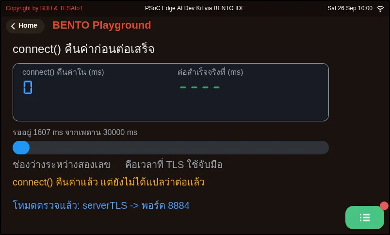
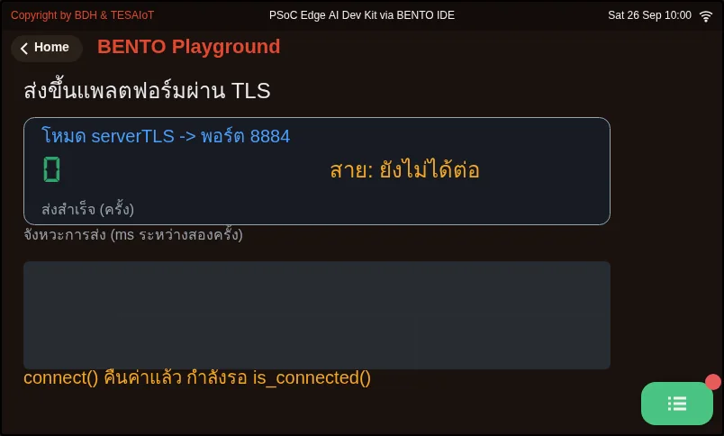

# Lesson 4.8 — The tesaiot module: MQTTs to the platform

> Module 4 — IoT Platform Connectivity · Slides: [slides.md](slides.md) · [Module overview](../README.md) · [Course page](../../README.md)

Move the send loop from the mqtt module on port 1883 to the tesaiot module on port 8884 by setting the device identity correctly, waiting for the async connection to really finish before sending, and knowing that only nine of the module's 28 names are usable.

## Objectives

By the end of this lesson you will be able to:

1. Set the device identity with tesaiot.config_set() for all five keys (device_id, api_key, mqtt_pass, broker, sni_hostname), passing both arguments as strings, checking the True/False it returns, and confirming with print(tesaiot.config()) that every value is in and spelled right before connecting
2. Write a tesaiot.is_connected() wait loop with a 30-second ceiling after tesaiot.connect(), and time on the real board how many ms the connection takes to finish, recording it in the learning log
3. Send JSON with numeric values through tesaiot.publish(payload), checking is_connected() before every send, until the counter on the board moves together with the dashboard graph, and state two differences between tesaiot and mqtt (publish argument order, what disconnect returns)
4. Tell which names in the tesaiot module work on both boards, which raise OSError, and why tesaiot.protected_update() must not be called in these lessons, and choose correctly between config_reset() and config_reload() for a situation

## Before you start

Open your learning log with the four identity values recorded from lesson 4.7: `device_id` (no longer than 31 characters) · `api_key` · `mqtt_pass` · the broker's hostname.
If you do not have these values yet, read through the file's structure first and run it once you get them. Get WiFi fully connected before anything else
(`wifi.connect()` can block for about 85 seconds on a wrong password), and review from lesson 4.5 that `mqtt.publish(topic, payload)` places topic first,
because in this lesson the order is swapped.

- **Equipment:** an Eva Kit or TESAIoT Dev Kit board with the BENTO MicroPython firmware installed, or the BENTO Emulator in [BENTO IDE](https://ide.tesaiot.dev/) (the Emulator simulates the tesaiot module enough to rehearse config, the wait loop and the send loop, but there is no real TLS handshake and data never reaches a dashboard — a real connection needs a real board with a `device_id` already from your TESAIoT Platform account; `03_slots_and_the_dead_half.py` needs a real board only, because `tesaiot.slots()` on the Emulator returns data in a different shape than the firmware, so the file stops with TypeError)
- **Before this:** [Lesson 4.7 — TLS: certificates, the chain of trust and the handshake](../l07-tls-concepts/README.md)

## Concepts

The more a library does for you, the more silent the remaining mistakes become. The `tesaiot` module handles the whole TLS handshake, checking the certificate up to the root baked into the firmware,
choosing the port from `tls_mode`, and assembling the topic from `device_id`. What is left for us: set all four identity values correctly,
**wait for the connection to really finish before sending**, choose which fields to send as numbers, and show evidence on screen that others can check without opening the code.

`import tesaiot` gives you 28 names, but only nine actually work on both the Eva Kit and Dev Kit: `config`, `config_set`, `config_reset`, `config_reload`,
`connect`, `disconnect`, `is_connected`, `publish`, and `slots`. The other sixteen send a command across to the display core, and both boards are built with
`ENABLE_OPTIGA ?= 0`, so the display core answers "not available", and the Python side raises `OSError`. The time cost per call **has not been measured on any board yet**.
What differs between the two boards is `tesaiot.protected_update()`: on the Eva it raises `OSError`, but on the Dev Kit it really runs, writing a certificate into slot E0E1
of the OPTIGA chip, and `csr=True` generates a new key pair over the old one. **Never call this in these lessons**, whether from a file or the REPL, because it cannot be undone.
`slots()` answers instantly without touching the chip, because it reads a name table in the firmware, giving a dict of 13 pairs (slot 4 is reserved).

**Move 1, set the identity.** `config_set(key, value)` takes strings for both arguments; even a number must be sent as a string. It returns True/False,
and a misspelled key returns False silently — it only **stores the value**, nothing is connected yet — which is why you must always `print(tesaiot.config())` once after configuring.
`config()` returns a dict of 19 keys. Set `"tls_mode", "server_tls"` and reading it back gives `"serverTLS"`. `mqtt_pass` can be set but is not in `config()`;
writing `config()["mqtt_pass"]` raises `KeyError`. `device_id` must be shorter than 31 characters, and `sni_hostname` must be the same name as `broker`, because the server
uses it to pick the certificate — set it wrong and the handshake fails with no message at all.

**Move 2, command connect, then wait.** `tesaiot.connect()` is an asynchronous API; returning True means **the work has started**, not that it finished.
Only `is_connected()` can answer that, so you must loop waiting every 500 ms with a 30-second ceiling, because a wait loop with no time exit hangs forever
on the day the platform goes down. Remove this loop and a publish fired too early **raises no error and never reaches the platform**. "The function returned" and "the work is done"
are always two different things, and the gap is measured in seconds. When data does not show up, the first box to check is `is_connected()`.

**Moves 3 and 4, send, then show evidence.** `tesaiot.publish(payload, topic=None)` puts **payload first**, with no topic, and the firmware assembles it from `device_id`.
Swap it to `tesaiot.publish(topic, payload)` and it will not error, because both slots take strings the same way, but the data silently ends up in the wrong place. Values must be real numbers,
or the dashboard shows the value but cannot chart it. In the send loop, `is_connected()` must be checked before every send, because the link can drop along the way, and the board's screen must answer the MVP's questions
on its own: **which team · what mode · how many sends so far**. Two more pairs never to mix up: `tesaiot.disconnect()` returns True/False, unlike
`mqtt.disconnect()`, which returns `None`; and `config_reset()` wipes all 19 keys back to factory values (returns `None`), while `config_reload()`
reads the config file from flash back over any edited values (returns bool). Confused after setting values every which way — reset and set everything again from scratch;
want to discard an edit you're not happy with yet — reload.

## Worked example

Three files must be done in this lesson, opened in this order, about 29 minutes total. All three can run once the board already has its own `device_id` (from your TESAIoT Platform account — see lesson 4.7).

1. `01_config_store.py` (6 minutes) — read all 19 keys the board has stored, then fill the identity-value box in your learning log from the board's actual answer,
   not from what you wrote down before. Notice the orange line saying `mqtt_pass` can be set but cannot be read back
2. `05_wait_for_connected.py` (8 minutes) — before running, predict how many ms `connect()` takes to return, and how many ms until `is_connected()` becomes True,
   then run and watch the left and right numbers on screen. Record the real numbers in your learning log
3. `06_secure_publish_loop.py` (15 minutes) — this is the MVP for this set of lessons; the counter on screen moves together with the dashboard graph. Open it side by side with
   `03_connect_and_publish.py` from lesson 4.5 and compare line by line what changed — you'll see the loop's shape barely changes at all

Open the remaining files whenever you have that specific question: `02_config_reset_reload.py` wipes the real board's settings then sets them back at the end — if you press Ctrl-C partway through, you must set
`device_id`, `api_key`, `mqtt_pass` again yourself · `03_slots_and_the_dead_half.py` times the half that needs a real chip you can see with your own eyes (real board only)
· `04_disconnect_and_republish.py` closes and reopens in five moves. If it fails to connect and you cannot tell whether it broke at WiFi or the platform,
open `04_ping_two_targets.py` from lesson 4.3 and fully prove the internet works before blaming TLS

| File | What this file teaches |
|---|---|
| [examples/01_config_store.py](examples/01_config_store.py) | The platform's config store; read it in full before connecting anything |
| [examples/02_config_reset_reload.py](examples/02_config_reset_reload.py) | Wiping settings and reverting settings are two different things |
| [examples/03_slots_and_the_dead_half.py](examples/03_slots_and_the_dead_half.py) | The half that answers instantly, and the half that needs the OPTIGA chip |
| [examples/04_disconnect_and_republish.py](examples/04_disconnect_and_republish.py) | Close the job properly, then reopen |
| [examples/05_wait_for_connected.py](examples/05_wait_for_connected.py) | connect() returns before the connection finishes; you must wait with is_connected() |
| [examples/06_secure_publish_loop.py](examples/06_secure_publish_loop.py) | Send to the platform over TLS and show the evidence on screen |

The slides for this lesson also refer to files that live in other lessons:

- [m04-iot-connectivity/l03-network-status-lab/examples/04_ping_two_targets.py](../l03-network-status-lab/examples/04_ping_two_targets.py) — the gateway answers but the internet does not — what does that mean
- [m04-iot-connectivity/l05-mqtt-platform/examples/03_connect_and_publish.py](../l05-mqtt-platform/examples/03_connect_and_publish.py) — connect to the broker and send one set of values up
- [m04-iot-connectivity/l05-mqtt-platform/examples/06_sent_is_not_delivered.py](../l05-mqtt-platform/examples/06_sent_is_not_delivered.py) — what publish() returning True means, and what it does not mean
- [m04-iot-connectivity/l09-secure-telemetry-lab/practice/s11_secure_telemetry.py](../l09-secure-telemetry-lab/practice/s11_secure_telemetry.py) — send telemetry to the platform over TLS (fill-in version)

**Screens from the BENTO Emulator** for this lesson's examples (click a file name to open the code)

<figure><figcaption><a href="examples/01_config_store.py"><code>01_config_store.py</code></a> The platform&#x27;s config store; read it in full before connecting anything</figcaption></figure>
<figure><figcaption><a href="examples/02_config_reset_reload.py"><code>02_config_reset_reload.py</code></a> Wiping settings and reverting settings are two different things</figcaption></figure>
<figure><figcaption><a href="examples/04_disconnect_and_republish.py"><code>04_disconnect_and_republish.py</code></a> Close the job properly, then reopen</figcaption></figure>
<figure><figcaption><a href="examples/05_wait_for_connected.py"><code>05_wait_for_connected.py</code></a> connect() returns before the connection finishes; you must wait with is_connected()</figcaption></figure>
<figure><figcaption><a href="examples/06_secure_publish_loop.py"><code>06_secure_publish_loop.py</code></a> Send to the platform over TLS and show the evidence on screen</figcaption></figure>

## Check your understanding

The same questions are in [quiz.yaml](quiz.yaml) for automatic marking.

1. Which statements about `tesaiot.config_set()` and `tesaiot.config()` are correct? Choose every correct one. *(choose all that apply · objective 1)*
   - A) Both key and value must be sent as strings, even if the value is a number
   - B) A misspelled key returns False without raising an error, so you must check the returned value
   - C) Once config_set() calls are all done, the board connects to the platform right away
   - D) config()["mqtt_pass"] reads back the password that was set

   

Solution

   **A, B** — config_set() takes strings for both slots and only stores the value; nothing is connected yet. A wrong key returns False silently. mqtt_pass can be set but is not in config()'s 19-key dict; reading it with square brackets raises KeyError.

   

2. A team writes `tesaiot.connect()` followed immediately by `tesaiot.publish(...)` on the next line, with no error at all, but the dashboard shows no data. What is the cause? *(choose one · objective 2)*
   - A) connect() is an async API that returns while the work has only just started; you must loop waiting for is_connected() with a time ceiling before sending
   - B) publish() must always be given a topic yourself, or the data goes nowhere
   - C) connect() returned False because the password is wrong
   - D) connect() must be called twice in a row

   

Solution

   **A** — True from connect() means the work has started, not that the connection finished. The TLS handshake takes seconds. A publish fired before the connection finishes raises no error and never reaches the platform. The one that can actually answer is is_connected().

   

3. Which line correctly sends telemetry to the platform via `tesaiot`, following this set of lessons' pattern? *(choose one · objective 3)*
   - A) `tesaiot.publish(json.dumps({"pot": sensors.pot.percent()}))`
   - B) `tesaiot.publish("device/team03/telemetry", json.dumps(data))`
   - C) `tesaiot.publish(json.dumps({"pot": str(sensors.pot.percent())}))`
   - D) `mqtt.publish(json.dumps(data))`

   

Solution

   **A** — tesaiot.publish() puts payload first and needs no topic, because the firmware assembles it from device_id. Swapping the order does not error, but the data ends up in the wrong place, and a string value shows on the dashboard but cannot be charted.

   

4. A team has tried setting so many keys they no longer know what values the board currently holds. What does the slide recommend? *(choose one · objective 4)*
   - A) Call config_reset(), then set every value fresh from scratch, without putting its return value in an if
   - B) Call config_reload() and the identity values will always come back complete
   - C) Call tesaiot.protected_update() to rewrite the identity onto the chip fresh
   - D) Fix one key at a time until it connects

   

Solution

   **A** — config_reset() wipes all 19 keys back to factory values, so every value must be set fresh, and it returns None, which is never truthy in an if. config_reload() only pulls back what was saved in flash. protected_update() must never be called at all.

   

5. Which statements about the 28 names in the `tesaiot` module on this course's boards are correct? Choose every correct one. *(choose all that apply · objective 4)*
   - A) Sixteen names that send a command across to the display core raise OSError on both boards, because the display core is built without OPTIGA enabled
   - B) On the Dev Kit, protected_update() writes a certificate onto the real chip and cannot be undone, so it must never be called in these lessons
   - C) slots() answers instantly without touching the chip, because it reads a name table in the firmware
   - D) All 28 names work on the Eva Kit

   

Solution

   **A, B, C** — Only nine names actually work on both boards. The sixteen that cross cores get "not available" and raise OSError. protected_update() raises OSError on the Eva but really writes to the chip on the Dev Kit. slots() is one of the nine that answers instantly.

   

## Lab

**Prepare before lesson 4.9's lab** (about 15 minutes). Do this on a real board that already has an identity, and record every item in your learning log.

- [ ] The identity-value box in your learning log is filled from the result of `01_config_store.py`, in full (`device_id`, `broker`, `tls_mode`, `port`)
- [ ] Record two numbers from `05_wait_for_connected.py`: the ms `connect()` takes to return, and the ms until `is_connected()` becomes True
- [ ] Run `06_secure_publish_loop.py` until the counter on screen moves together with the device's graph on the dashboard, and photograph both screens
- [ ] In a copy of the file, remove the `is_connected()` wait loop and run one round; record whether you see an error and whether the data reaches the platform
- [ ] Write a three-row comparison table of `mqtt` versus `tesaiot`: publish's argument order · what disconnect returns · who assembles the topic

## Going further

Lesson 4.9 fills in the blanks in `s11_secure_telemetry.py` one move at a time (never fill in every blank and run only once, because on a TLS path there are more places that can break,
and none of them makes a sound), then builds a comparison table of 1883 versus 8884 in your learning log. Optional further reading: lesson 4.5's `06_sent_is_not_delivered.py`
teaches counting messages that arrive at the destination, not messages we commanded to send — this applies to both modules.

Next lesson: [Lesson 4.9 — Hands-on: real readings over an encrypted channel](../l09-secure-telemetry-lab/README.md)

## Reflect

- connect() returns True, but is not yet connected. Have you met another API where "returned" does not mean "done", and how did you know it was really finished?
- If a module has 28 names but only nine work, how would you check that before trusting documentation or an IDE's autocomplete?
- Why should writing to a chip that cannot be undone have a rule against touching it decided before you even start, even though the code can be called normally?
