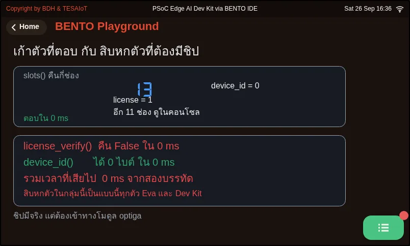

# บทเรียน 4.8 — โมดูล tesaiot: MQTTs สู่แพลตฟอร์ม

> โมดูล 4 — เชื่อมต่อแพลตฟอร์ม IoT · สไลด์: [slides.md](slides.md) · [ภาพรวมโมดูล](../README.md) · [หน้าหลักสูตร](../../README.md)

ย้ายลูปส่งข้อมูลจากโมดูล mqtt บนพอร์ต 1883 มาเป็นโมดูล tesaiot บนพอร์ต 8884 โดยตั้งตัวตนของอุปกรณ์ให้ถูก รอให้การต่อแบบ async เสร็จจริงก่อนส่ง และรู้ว่าเก้าจาก 28 ชื่อในโมดูลเท่านั้นที่ใช้ได้

## เป้าหมาย

เมื่อจบบทเรียนนี้ คุณจะ:

1. ตั้งตัวตนของอุปกรณ์ด้วย `tesaiot.config_set()` ครบห้าคีย์ (`device_id` `api_key` `mqtt_pass` `broker` `sni_hostname`) โดยส่งค่าเป็นสตริงทั้งสองช่อง รับค่า True/False กลับมาดู และ `print(tesaiot.config())` ยืนยันว่าค่าเข้าครบและสะกดถูกก่อนสั่งต่อ
2. เขียนลูปรอ `tesaiot.is_connected()` ที่มีเพดานเวลา 30 วินาทีหลัง `tesaiot.connect()` แล้วจับเวลาจริงบนบอร์ดว่ากี่ ms จึงต่อเสร็จ จดลงบันทึกการเรียน
3. ส่ง JSON ที่ค่าเป็นตัวเลขด้วย `tesaiot.publish(payload)` โดยเช็ก `is_connected()` ก่อนส่งทุกครั้ง จนตัวนับบนจอบอร์ดเดินพร้อมกราฟบน dashboard และบอกความต่างของ `tesaiot` กับ `mqtt` ได้สองข้อ (ลำดับอาร์กิวเมนต์ของ publish · ค่าที่ disconnect คืน)
4. แยกได้ว่าชื่อไหนในโมดูล `tesaiot` ใช้ได้จริงบนทั้งสองบอร์ด ชื่อไหนโยน OSError และทำไมห้ามเรียก `tesaiot.protected_update()` ในชุดบทเรียนนี้ รวมถึงเลือกระหว่าง `config_reset()` กับ `config_reload()` ได้ถูกสถานการณ์

## ก่อนเริ่ม

เปิดบันทึกการเรียนที่จดค่าประจำตัวสี่ค่าจากบทเรียน 4.7 ไว้: `device_id` (ไม่เกิน 31 ตัวอักษร) · `api_key` · `mqtt_pass` · ชื่อโฮสต์ของ broker
ถ้ายังไม่ได้ค่าเหล่านี้ อ่านโครงของไฟล์ไปก่อนแล้วรันเมื่อได้ค่ามา ต่อ WiFi ให้เรียบร้อยก่อนทุกอย่าง (`wifi.connect()` บล็อกได้ราว 85 วินาทีถ้ารหัสผิด)
และทวนจากบทเรียน 4.5 ว่า `mqtt.publish(topic, payload)` วาง topic ก่อน เพราะในบทเรียนนี้ลำดับจะสลับกัน

- **อุปกรณ์:** บอร์ด Eva Kit หรือ TESAIoT Dev Kit ที่ลงเฟิร์มแวร์ MicroPython ของ BENTO แล้ว หรือ BENTO Emulator ใน [BENTO IDE](https://ide.tesaiot.dev/) (Emulator จำลองโมดูล tesaiot ให้ซ้อมตั้งค่า ลูปรอ และลูปส่งได้ แต่ไม่มีการจับมือ TLS จริงและข้อมูลไม่ขึ้น dashboard การต่อจริงต้องใช้บอร์ดจริงที่มี `device_id` จากบัญชี TESAIoT Platform ของคุณแล้ว ส่วน `03_slots_and_the_dead_half.py` ต้องใช้บอร์ดจริงเท่านั้น เพราะ `tesaiot.slots()` บน Emulator คืนข้อมูลคนละรูปกับเฟิร์มแวร์ ไฟล์จึงหยุดด้วย TypeError)
- **เรียนมาก่อน:** [บทเรียน 4.7 — TLS: ใบรับรอง ห่วงโซ่ความเชื่อถือ และการจับมือ](../l07-tls-concepts/README.md)

## แนวคิด

ยิ่งไลบรารีทำให้เยอะ ความผิดพลาดที่เหลือยิ่ง **เงียบ** โมดูล `tesaiot` ทำให้ทั้งการจับมือ TLS การตรวจใบรับรองถึง root ที่ฝังมากับเฟิร์มแวร์
การเลือกพอร์ตจาก `tls_mode` และการประกอบ topic จาก `device_id` งานที่เหลือเป็นของเรา: ตั้งตัวตนให้ถูกทั้งสี่ค่า
**รอให้การเชื่อมต่อเสร็จจริงก่อนส่ง** เลือกฟิลด์ที่ส่งเป็นตัวเลข และแสดงหลักฐานบนจอให้คนอื่นตรวจได้โดยไม่ต้องเปิดโค้ด

`import tesaiot` ได้มา 28 ชื่อ แต่ใช้ได้จริงบนทั้ง Eva Kit และ Dev Kit แค่เก้าตัว: `config` `config_set` `config_reset` `config_reload`
`connect` `disconnect` `is_connected` `publish` และ `slots` อีกสิบหกตัวส่งคำสั่งข้ามไปคอร์จอ ซึ่งทั้งสองบอร์ดประกอบมาด้วย
`ENABLE_OPTIGA ?= 0` คอร์จอจึงตอบว่า "ไม่มีให้" แล้วฝั่ง Python โยน `OSError` เวลาที่เสียไปต่อครั้ง **ยังไม่ได้วัดจริงบนบอร์ดไหน**
ตัวที่ต่างกันระหว่างสองบอร์ดคือ `tesaiot.protected_update()` บน Eva โยน `OSError` แต่บน Dev Kit มันทำงานจริง เขียนใบรับรองลงช่อง E0E1
ของชิป OPTIGA และ `csr=True` สร้างคู่กุญแจใหม่ทับของเดิม **ห้ามเรียกในชุดบทเรียนนี้** ทั้งจากไฟล์และ REPL เพราะย้อนกลับไม่ได้
ส่วน `slots()` ตอบทันทีโดยไม่แตะชิป เพราะอ่านตารางชื่อในเฟิร์มแวร์ ได้ dict 13 คู่ (ช่อง 4 ถูกกันไว้)

**ท่าที่ 1 ตั้งตัวตน** `config_set(key, value)` รับสตริงทั้งสองช่อง ตัวเลขก็ต้องส่งเป็นสตริง คืน True/False และคีย์ที่สะกดผิดคืน False
เงียบ ๆ มันแค่ **เก็บค่าไว้** ยังไม่ได้ต่ออะไร จึงต้อง `print(tesaiot.config())` หนึ่งครั้งหลังตั้งค่าเสมอ `config()` คืน dict 19 คีย์
ตั้ง `"tls_mode", "server_tls"` แล้วอ่านกลับได้ `"serverTLS"` ส่วน `mqtt_pass` ตั้งได้แต่ไม่อยู่ใน `config()` เขียน `config()["mqtt_pass"]`
จะได้ `KeyError` `device_id` ต้องสั้นกว่า 31 ตัวอักษร และ `sni_hostname` ต้องเป็นชื่อเดียวกับ `broker` เพราะเซิร์ฟเวอร์ใช้มันหยิบใบรับรอง
ตั้งไม่ตรงแล้วการจับมือล้มโดยไม่มีข้อความบอก

**ท่าที่ 2 สั่งต่อแล้วรอ** `tesaiot.connect()` เป็น API แบบ asynchronous คืน True แปลว่า **งานเริ่มแล้ว** ไม่ใช่ต่อเสร็จแล้ว
ตัวที่ตอบได้คือ `is_connected()` เท่านั้น จึงต้องวนรอทุก 500 ms และมีเพดาน 30 วินาที เพราะลูปรอที่ไม่มีทางออกด้วยเวลาจะค้างตลอดกาล
ในวันที่แพลตฟอร์มล่ม ถ้าลบลูปนี้ทิ้ง publish ที่ยิงเร็วเกินไป **ไม่ error และไม่ถึงแพลตฟอร์ม** "ฟังก์ชันคืนค่าแล้ว" กับ "งานเสร็จแล้ว"
เป็นคนละเรื่องเสมอ และความต่างวัดได้เป็นวินาที เวลาข้อมูลไม่ขึ้น กล่องแรกที่ต้องตรวจคือ `is_connected()`

**ท่าที่ 3 และ 4 ส่งแล้วโชว์หลักฐาน** `tesaiot.publish(payload, topic=None)` วาง **payload ก่อน** ไม่ใส่ topic แล้วเฟิร์มแวร์ประกอบให้จาก `device_id`
สลับเป็น `tesaiot.publish(topic, payload)` จะไม่ error เพราะสองช่องรับสตริงเหมือนกัน แต่ข้อมูลไปโผล่ผิดที่เงียบ ๆ ค่าต้องเป็นตัวเลขจริง
ไม่งั้น dashboard ขึ้นค่าแต่วาดกราฟไม่ได้ ในลูปส่งต้องเช็ก `is_connected()` ก่อนทุกครั้ง เพราะสายหลุดได้ระหว่างทาง และจอบอร์ดต้องตอบคำถาม MVP
ได้เอง: **ทีมไหน · โหมดอะไร · ส่งไปกี่ครั้งแล้ว** อีกสองคู่ที่ต้องไม่จำรวมกัน: `tesaiot.disconnect()` คืน True/False ต่างจาก
`mqtt.disconnect()` ที่คืน `None` และ `config_reset()` ล้างทั้ง 19 คีย์กลับเป็นค่าโรงงาน (คืน `None`) ส่วน `config_reload()`
อ่านไฟล์ตั้งค่าจากแฟลชขึ้นมาทับค่าที่แก้ไว้ (คืน bool) ตั้งค่ามั่วจนงงให้ reset แล้วตั้งใหม่ทุกค่า อยากทิ้งการแก้ที่ยังไม่พอใจให้ reload

## ตัวอย่างสมบูรณ์

สามไฟล์ที่ต้องทำในบทเรียน เปิดตามลำดับนี้ ทั้งชุดราว 29 นาที ทั้งสามรันได้เมื่อบอร์ดมี `device_id` ของตัวเองแล้ว (จากบัญชี TESAIoT Platform ของคุณ ดูบทเรียน 4.7)

1. `01_config_store.py` (6 นาที) อ่านค่าที่บอร์ดเก็บไว้ทั้ง 19 คีย์ แล้วกรอกกล่องค่าประจำตัวในบันทึกการเรียนจากค่าที่บอร์ดตอบจริง
   ไม่ใช่จากค่าที่จดมา สังเกตบรรทัดสีส้มที่บอกว่า `mqtt_pass` ตั้งได้แต่อ่านกลับไม่ได้
2. `05_wait_for_connected.py` (8 นาที) ก่อนรันให้ทายว่า `connect()` ใช้กี่ ms ในการคืนค่า และกี่ ms จน `is_connected()` เป็น True
   แล้วรันดูเลขซ้ายกับเลขขวาบนจอ จดตัวเลขจริงลงบันทึกการเรียน
3. `06_secure_publish_loop.py` (15 นาที) คือ MVP ของชุดบทเรียนนี้ ตัวนับบนจอเดินขึ้นพร้อมกราฟบน dashboard เปิดคู่กับ
   `03_connect_and_publish.py` ของบทเรียน 4.5 แล้วเทียบทีละบรรทัดว่าอะไรเปลี่ยน จะเห็นว่ารูปร่างของลูปแทบไม่เปลี่ยน

ไฟล์ที่เหลือเปิดเมื่อสงสัยเรื่องนั้น: `02_config_reset_reload.py` ล้างค่าตั้งของบอร์ดจริงแล้วตั้งกลับให้ตอนจบ ถ้ากด Ctrl-C กลางทาง ต้องตั้ง
`device_id` `api_key` `mqtt_pass` ใหม่เอง · `03_slots_and_the_dead_half.py` จับเวลาครึ่งที่ต้องมีชิปให้ดูกับตา (รันบนบอร์ดจริงเท่านั้น)
· `04_disconnect_and_republish.py` ปิดแล้วเปิดใหม่ในห้าขั้น ถ้าต่อไม่ติดและแยกไม่ออกว่าติดที่ WiFi หรือที่แพลตฟอร์ม
เปิด `04_ping_two_targets.py` ของบทเรียน 4.3 พิสูจน์ให้จบก่อนว่าออกอินเทอร์เน็ตได้ แล้วค่อยโทษ TLS

| ไฟล์ | ไฟล์นี้สอน |
|---|---|
| [examples/01_config_store.py](examples/01_config_store.py) | คลังค่าตั้งของแพลตฟอร์ม อ่านให้ครบก่อนจะต่ออะไร |
| [examples/02_config_reset_reload.py](examples/02_config_reset_reload.py) | ล้างค่าตั้ง กับ ย้อนค่าตั้ง เป็นคนละเรื่องกัน |
| [examples/03_slots_and_the_dead_half.py](examples/03_slots_and_the_dead_half.py) | ครึ่งที่ตอบทันที กับ ครึ่งที่ต้องมีชิป OPTIGA |
| [examples/04_disconnect_and_republish.py](examples/04_disconnect_and_republish.py) | ปิดงานให้เรียบร้อย แล้วเปิดใหม่ |
| [examples/05_wait_for_connected.py](examples/05_wait_for_connected.py) | connect() คืนค่าก่อนต่อเสร็จ ต้องรอด้วย is_connected() |
| [examples/06_secure_publish_loop.py](examples/06_secure_publish_loop.py) | ส่งขึ้นแพลตฟอร์มผ่าน TLS แล้วโชว์หลักฐานบนจอ |

สไลด์ของบทเรียนนี้อ้างถึงไฟล์ที่อยู่ในบทเรียนอื่นด้วย:

- [m04-iot-connectivity/l03-network-status-lab/examples/04_ping_two_targets.py](../l03-network-status-lab/examples/04_ping_two_targets.py) — เกตเวย์ตอบ แต่อินเทอร์เน็ตไม่ตอบ แปลว่าอะไร
- [m04-iot-connectivity/l05-mqtt-platform/examples/03_connect_and_publish.py](../l05-mqtt-platform/examples/03_connect_and_publish.py) — ต่อ broker แล้วส่งค่าขึ้นไปหนึ่งชุด
- [m04-iot-connectivity/l05-mqtt-platform/examples/06_sent_is_not_delivered.py](../l05-mqtt-platform/examples/06_sent_is_not_delivered.py) — publish คืน True แปลว่าอะไร และไม่แปลว่าอะไร
- [m04-iot-connectivity/l09-secure-telemetry-lab/practice/s11_secure_telemetry.py](../l09-secure-telemetry-lab/practice/s11_secure_telemetry.py) — ส่ง telemetry ขึ้นแพลตฟอร์มผ่าน TLS (ฉบับฝึกเติมโค้ด)

**ภาพจอจาก BENTO Emulator** ของตัวอย่างในบทนี้ (คลิกชื่อไฟล์เพื่อเปิดโค้ด)

<figure><figcaption><a href="examples/01_config_store.py"><code>01_config_store.py</code></a> คลังค่าตั้งของแพลตฟอร์ม อ่านให้ครบก่อนจะต่ออะไร</figcaption></figure>
<figure><figcaption><a href="examples/02_config_reset_reload.py"><code>02_config_reset_reload.py</code></a> ล้างค่าตั้ง กับ ย้อนค่าตั้ง เป็นคนละเรื่องกัน</figcaption></figure>
<figure><figcaption><a href="examples/03_slots_and_the_dead_half.py"><code>03_slots_and_the_dead_half.py</code></a> ครึ่งที่ตอบทันที กับ ครึ่งที่ต้องมีชิป OPTIGA</figcaption></figure>
<figure><figcaption><a href="examples/04_disconnect_and_republish.py"><code>04_disconnect_and_republish.py</code></a> ปิดงานให้เรียบร้อย แล้วเปิดใหม่</figcaption></figure>
<figure><figcaption><a href="examples/05_wait_for_connected.py"><code>05_wait_for_connected.py</code></a> connect() คืนค่าก่อนต่อเสร็จ ต้องรอด้วย is_connected()</figcaption></figure>
<figure><figcaption><a href="examples/06_secure_publish_loop.py"><code>06_secure_publish_loop.py</code></a> ส่งขึ้นแพลตฟอร์มผ่าน TLS แล้วโชว์หลักฐานบนจอ</figcaption></figure>

## เช็กความเข้าใจ

คำถามชุดเดียวกันอยู่ใน [quiz.yaml](quiz.yaml) สำหรับระบบที่ตรวจอัตโนมัติ

1. ข้อใดถูกเกี่ยวกับ `tesaiot.config_set()` และ `tesaiot.config()` เลือกทุกข้อที่ถูก *(เลือกได้หลายข้อ · เป้าหมายข้อ 1)*
   - ก) ต้องส่งทั้ง key และ value เป็นสตริง แม้ค่านั้นเป็นตัวเลข
   - ข) คีย์ที่สะกดผิดคืน False โดยไม่โยน error จึงต้องรับค่ากลับมาดู
   - ค) เรียก `config_set()` ครบแล้วบอร์ดต่อแพลตฟอร์มให้ทันที
   - ง) `config()["mqtt_pass"]` อ่านรหัสผ่านที่ตั้งไว้กลับมาได้

   

เฉลย

   **ก, ข** — config_set() รับสตริงทั้งสองช่องและแค่เก็บค่าไว้ ยังไม่ได้ต่ออะไร คีย์ผิดคืน False เงียบ ๆ ส่วน mqtt_pass ตั้งได้แต่ไม่อยู่ใน dict 19 คีย์ของ config() อ่านด้วยวงเล็บเหลี่ยมจะได้ KeyError

   

2. ทีมเขียน `tesaiot.connect()` แล้ว `tesaiot.publish(...)` บรรทัดถัดไปทันที ไม่มี error เลย แต่ dashboard ไม่เห็นข้อมูล สาเหตุคืออะไร *(เลือกหนึ่งข้อ · เป้าหมายข้อ 2)*
   - ก) connect() เป็น API แบบ async คืนค่าตอนงานเพิ่งเริ่ม ต้องวนรอ is_connected() พร้อมเพดานเวลาก่อนส่ง
   - ข) publish() ต้องใส่ topic เองเสมอ ไม่งั้นข้อมูลไม่ไปไหน
   - ค) connect() คืน False เพราะรหัสผ่านผิด
   - ง) ต้องเรียก connect() สองครั้งติดกัน

   

เฉลย

   **ก** — True จาก connect() แปลว่างานเริ่มแล้ว ไม่ใช่ต่อเสร็จแล้ว การจับมือ TLS ใช้เวลาเป็นวินาที publish ที่ยิงก่อนต่อเสร็จไม่ error และไม่ถึงแพลตฟอร์ม ตัวที่ตอบได้จริงคือ is_connected()

   

3. บรรทัดใดส่ง telemetry ขึ้นแพลตฟอร์มผ่าน `tesaiot` ได้ถูกต้องตามแบบของชุดบทเรียนนี้ *(เลือกหนึ่งข้อ · เป้าหมายข้อ 3)*
   - ก) `tesaiot.publish(json.dumps({"pot": sensors.pot.percent()}))`
   - ข) `tesaiot.publish("device/team03/telemetry", json.dumps(data))`
   - ค) `tesaiot.publish(json.dumps({"pot": str(sensors.pot.percent())}))`
   - ง) `mqtt.publish(json.dumps(data))`

   

เฉลย

   **ก** — tesaiot.publish() วาง payload ก่อนและไม่ต้องใส่ topic เพราะเฟิร์มแวร์ประกอบจาก device_id ให้ ถ้าสลับลำดับจะไม่ error แต่ข้อมูลไปผิดที่ และค่าที่เป็นสตริงขึ้นบน dashboard ได้แต่วาดกราฟไม่ได้

   

4. ทีมลองตั้งค่าไปหลายคีย์จนไม่รู้ว่าตอนนี้บอร์ดเหลือค่าอะไรอยู่ ทางที่สไลด์แนะนำคืออะไร *(เลือกหนึ่งข้อ · เป้าหมายข้อ 4)*
   - ก) เรียก `config_reset()` แล้วตั้งทุกค่าใหม่จากศูนย์ โดยไม่เอาค่าที่คืนมาใส่ใน `if`
   - ข) เรียก `config_reload()` แล้วค่าตัวตนจะกลับมาครบเสมอ
   - ค) เรียก `tesaiot.protected_update()` เพื่อเขียนตัวตนลงชิปใหม่
   - ง) ไล่แก้ทีละคีย์ไปเรื่อย ๆ จนต่อติด

   

เฉลย

   **ก** — config_reset() ล้างทั้ง 19 คีย์กลับเป็นค่าโรงงาน จึงต้องตั้งใหม่ทุกค่า และมันคืน None ใส่ใน if จะไม่มีวันจริง config_reload() แค่ดึงของที่เซฟไว้ในแฟลชกลับมา ส่วน protected_update() ห้ามเรียกเด็ดขาด

   

5. ข้อใดถูกเกี่ยวกับ 28 ชื่อในโมดูล `tesaiot` บนบอร์ดของหลักสูตรนี้ เลือกทุกข้อที่ถูก *(เลือกได้หลายข้อ · เป้าหมายข้อ 4)*
   - ก) สิบหกตัวที่ส่งคำสั่งข้ามไปคอร์จอโยน OSError บนทั้งสองบอร์ด เพราะคอร์จอประกอบมาโดยไม่เปิด OPTIGA
   - ข) บน Dev Kit `protected_update()` เขียนใบรับรองลงชิปจริงและย้อนกลับไม่ได้ จึงห้ามเรียกในชุดบทเรียนนี้
   - ค) `slots()` ตอบทันทีโดยไม่แตะชิป เพราะอ่านตารางชื่อในเฟิร์มแวร์
   - ง) บน Eva Kit ใช้ได้ครบทั้ง 28 ชื่อ

   

เฉลย

   **ก, ข, ค** — ใช้ได้จริงบนทั้งสองบอร์ดแค่เก้าตัว สิบหกตัวที่ข้ามคอร์ได้คำตอบว่าไม่มีให้แล้วโยน OSError protected_update() บน Eva โยน OSError แต่บน Dev Kit ทำงานจริงกับชิป ส่วน slots() เป็นหนึ่งในเก้าตัวที่ตอบทันที

   

## แล็บ

**เตรียมตัวก่อนแล็บบทเรียน 4.9** (ราว 15 นาที) ทำบนบอร์ดจริงที่ได้ตัวตนแล้ว และจดทุกข้อลงบันทึกการเรียน

- [ ] กล่องค่าประจำตัวในบันทึกการเรียนกรอกจากผลของ `01_config_store.py` ครบ (`device_id` `broker` `tls_mode` `port`)
- [ ] จดสองตัวเลขจาก `05_wait_for_connected.py`: ms ที่ `connect()` ใช้คืนค่า และ ms จน `is_connected()` เป็น True
- [ ] รัน `06_secure_publish_loop.py` จนตัวนับบนจอเดินพร้อมกราฟของอุปกรณ์บน dashboard แล้วถ่ายภาพทั้งสองจอ
- [ ] ในสำเนาของไฟล์ ลบลูปรอ `is_connected()` ออกแล้วรันหนึ่งรอบ จดว่าเห็น error หรือไม่ และข้อมูลถึงแพลตฟอร์มหรือไม่
- [ ] เขียนตารางเทียบ `mqtt` กับ `tesaiot` สามแถว: ลำดับอาร์กิวเมนต์ของ publish · ค่าที่ disconnect คืน · ใครเป็นคนประกอบ topic

## ไปต่อ

บทเรียน 4.9 เติมช่องว่างใน `s11_secure_telemetry.py` ทีละท่า (อย่าเติมครบทุกจุดแล้วค่อยรัน เพราะบนเส้นทางที่มี TLS จุดที่พังได้มีมากกว่าเดิม
และไม่มีจุดไหนส่งเสียง) แล้วทำตารางเทียบ 1883 กับ 8884 ในบันทึกการเรียน อ่านเสริม: `06_sent_is_not_delivered.py` ของบทเรียน 4.5
สอนให้นับใบที่ถึงปลายทาง ไม่ใช่ใบที่เราสั่งส่ง ใช้ได้กับทั้งสองโมดูล

บทเรียนถัดไป: [บทเรียน 4.9 — ลงมือทำ: ส่งค่าจริงผ่านช่องทางเข้ารหัส](../l09-secure-telemetry-lab/README.md)

## สะท้อนคิด

- `connect()` คืน True แต่ยังไม่ได้ต่อ คุณเคยเจอ API อื่นที่ "คืนค่าแล้ว" ไม่ได้แปลว่า "เสร็จแล้ว" ไหม แล้วรู้ได้อย่างไรว่าเสร็จจริง
- ถ้าโมดูลมี 28 ชื่อแต่ใช้ได้เก้า คุณจะเช็กอย่างไรก่อนเชื่อเอกสารหรือ autocomplete ของ IDE
- ทำไมการเขียนลงชิปที่ย้อนกลับไม่ได้ ถึงควรตั้งกติกาห้ามแตะไว้ตั้งแต่ก่อนลงมือ แม้โค้ดจะเรียกได้ปกติ
