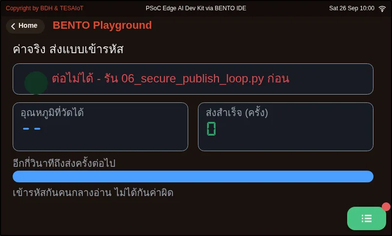

# บทเรียน 4.9 — ลงมือทำ: ส่งค่าจริงผ่านช่องทางเข้ารหัส

> โมดูล 4 — เชื่อมต่อแพลตฟอร์ม IoT · สไลด์: [slides.md](slides.md) · [ภาพรวมโมดูล](../README.md) · [หน้าหลักสูตร](../../README.md)

เติมช่องว่างห้าจุดใน s11_secure_telemetry.py ทีละท่าจนค่าเซนเซอร์จริงขึ้นกราฟบน dashboard ของแพลตฟอร์มผ่าน TLS แล้วตอบได้ด้วยคำของตัวเองว่า serverTLS ปกป้องอะไรและไม่ปกป้องอะไร

## เป้าหมาย

เมื่อจบบทเรียนนี้ คุณจะ:

1. เติมช่องว่างห้าจุดใน `s11_secure_telemetry.py` โดยรันหลังเติมเสร็จแต่ละท่า จนจอบอร์ดแสดง `device_id` โหมด `tls_mode` และตัวนับที่เดินขึ้นต่อเนื่อง และกราฟของ `device_id` ทีมบน dashboard ขยับตามเมื่อเอียงบอร์ด
2. ใช้ตารางกับดักสองหน้าหาสาเหตุของอาการที่ไม่มี error ชี้สาเหตุได้อย่างน้อยสามอาการ เช่น ต่อไม่ติดเงียบ ๆ ข้อมูลขึ้นแต่ไม่มีเส้นกราฟ และหลายบอร์ดหลุดสลับกัน
3. กรอกตารางเทียบ 1883 กับ 8884 ในบันทึกการเรียนจากสิ่งที่เห็นเอง และตอบได้โดยไม่เปิดสไลด์ว่า serverTLS ปกป้องอะไร ไม่ปกป้องอะไร และพอร์ต 8884 มาจาก `tls_mode` ไม่ใช่คีย์ `port`
4. อธิบายขีดจำกัดสองข้อของงานนี้ได้ คือการเข้ารหัสไม่ได้ทำให้ค่าที่วัดถูกต้องขึ้น และ `mqtt_pass` เป็นความลับที่คัดลอกได้ ต่างจากกุญแจส่วนตัวในชิป OPTIGA ที่ออกจากชิปไม่ได้

## ก่อนเริ่ม

บทเรียนนี้คือแล็บที่ต่อจากบทเรียน 4.7–4.8 ก่อนแตะโค้ดให้มีค่าประจำตัวสี่ค่าในบันทึกการเรียน (`device_id` · `api_key` · `mqtt_pass` · ชื่อโฮสต์ broker)
จากหน้าจัดการอุปกรณ์ในบัญชี TESAIoT Platform ของคุณ (ดูบทเรียน 4.7 · ถ้าเรียนเป็นกลุ่ม ผู้จัดอาจเตรียมไว้ให้)
บอร์ดต่อ WiFi ได้แล้ว และเปิด dashboard ของแพลตฟอร์มเลือกอุปกรณ์ของคุณรอไว้ ทวนสองเรื่องจากบทเรียน 4.8: `connect()` คืนค่าก่อนต่อเสร็จ
ตัวที่ตอบได้จริงคือ `is_connected()` และ `tesaiot.publish(payload)` วาง payload ก่อน ไม่ต้องใส่ topic

- **อุปกรณ์:** บอร์ด Eva Kit หรือ TESAIoT Dev Kit ที่ลงเฟิร์มแวร์ MicroPython ของ BENTO แล้ว หรือ BENTO Emulator ใน [BENTO IDE](https://ide.tesaiot.dev/) (ซ้อมเติมช่องว่างและดูหน้าจอบน Emulator ได้เพราะโมดูล tesaiot ถูกจำลองไว้ แต่ไม่มีการจับมือ TLS จริงและกราฟไม่ขึ้น dashboard การผ่าน MVP จึงต้องใช้บอร์ดจริงที่มี `device_id` จากบัญชี TESAIoT Platform ของคุณแล้ว และโบนัสเรื่องชิป OPTIGA ต้องใช้บอร์ดจริง)
- **เรียนมาก่อน:** [บทเรียน 4.8 — โมดูล tesaiot: MQTTs สู่แพลตฟอร์ม](../l08-tesaiot-module/README.md)

## แนวคิด

MVP ของชุดบทเรียนนี้มีสองครึ่ง: telemetry ของอุปกรณ์คุณขึ้น dashboard ผ่าน TLS **และ** ตอบได้ว่าต่างจากบทเรียน 4.4–4.6 ตรงไหน
ข้อที่เป็นหัวใจคือการตอบได้ว่า serverTLS ปกป้องอะไรและไม่ปกป้องอะไร ถ้าตอบไม่ได้ แปลว่าเราติดตั้งความปลอดภัยเป็น
แต่ยังไม่รู้ว่าซื้ออะไรมาด้วยราคาเท่าไร

ไฟล์ฝึกวาดหน้าจอมาให้ครบแล้ว ช่องว่างห้าจุดอยู่ที่ตรรกะทั้งหมด และ `tesaiot.connect()` **มีให้แล้ว ไม่ใช่ช่องว่าง** สิ่งที่เราเขียนคือลูปที่รอมัน
ลำดับการเติมเรียงจากตรวจง่ายไปตรวจยาก: ตั้งตัวตนก่อนเพราะตรวจได้โดยไม่ต้องใช้เน็ต (`print(tesaiot.config())` และตารางบนจอ)
ลูปรอแยกเป็นท่าของตัวเองเพราะ "ต่อเสร็จ" เกิดทีหลังคำสั่ง ไม่ใช่ผลของคำสั่ง ส่งข้อมูลจริงเมื่อสองท่าแรกยืนยันแล้ว
ถ้ากราฟยังว่างก็รู้แน่ว่าปัญหาอยู่ที่รูปร่าง JSON และท่าสุดท้ายคือหลักฐานบนจอที่ให้คนอื่นตรวจงานได้โดยไม่ต้องเปิดโค้ด
เรียงแบบนี้แล้วความล้มเหลวจะบอกที่อยู่ของตัวเองเสมอ ส่วนหน้าจอเขียน `mqtt_pass` ว่า "ตั้งแล้ว แต่อ่านกลับไม่ได้" แทนการปล่อยช่องว่าง
เพราะช่องว่างทำให้คนดูสรุปว่ายังไม่ได้ตั้ง และปุ่มตัดสายมีกล่องยืนยันที่บอกสิ่งที่จะเกิด ส่วนปุ่มต่อใหม่ไม่มี
**ระดับของการยืนยันมาจากราคาของความผิดพลาด** ไม่ได้มาจากความสำคัญของปุ่ม

ตารางกับดักสองหน้ามีสิบสามแถว สิบแถวไม่ใช่บั๊กในโค้ด แต่เป็นความเข้าใจผิดเรื่องขอบเขตของ API และแทบไม่มีอาการไหนมี error ชี้สาเหตุ
จึงต้องอ่านก่อนเจอปัญหา แถวที่เจอบ่อย: `sni_hostname` ไม่ตรง `broker` ต่อไม่ติดเงียบ ๆ · publish ก่อน `is_connected()` เป็น True
ไม่ error แต่ไม่มีข้อมูล · ลูปรอที่ไม่มี timeout ค้างตลอดกาล · หลายบอร์ดใช้ `device_id` ค่าเริ่มต้นตัวเดียวกัน หลุดสลับกันเป็นจังหวะ ·
ส่งค่าเป็นสตริง ข้อมูลขึ้นแต่ไม่มีเส้นกราฟ · ห่อ payload เองด้วย `{"data": ...}` ได้ชื่อวัดขึ้นต้น `data_` · สลับเป็น
`tesaiot.publish(topic, payload)` ข้อมูลไปโผล่ผิด topic ส่วนแถว `protected_update()` บน Dev Kit คือแถวเดียวที่ "ไม่มี error"
แปลว่าเสียหายไปแล้ว จึงห้ามเรียกทั้งสองบอร์ด

ขีดจำกัดสองข้อที่ต้องพูดให้ชัด ข้อแรก **การเข้ารหัสไม่ได้ทำให้ข้อมูลถูกต้องขึ้น** มันแค่ทำให้คนกลางอ่านไม่ได้ ถ้าค่าที่วัดผิดตั้งแต่ต้น
มันจะผิดอย่างปลอดภัยไปถึงปลายทาง ความน่าเชื่อถือของระบบจึงเริ่มที่เซนเซอร์ ไม่ได้เริ่มที่ใบรับรอง ข้อสอง `mqtt_pass` ของวันนี้เป็นความลับ
ที่ **คัดลอกได้** ส่วนกุญแจส่วนตัวในชิป OPTIGA Trust M **ออกจากชิปไม่ได้เลย** ชิปยอมเซ็นให้เท่านั้น และในชิปมีใบรับรองจากโรงงานซึ่งเป็น
ชิ้นส่วนที่ mTLS ต้องการ ตัวตนของอุปกรณ์ที่ก๊อปไม่ได้ต้องมาจากฮาร์ดแวร์ ไม่ใช่จากสตริงในไฟล์ Python

## ตัวอย่างสมบูรณ์

เปิด `07_real_reading_over_tls.py` หลังจากไฟล์ฝึกส่งขึ้นแพลตฟอร์มได้แล้ว ไฟล์นี้ปิดวงด้วยค่าที่วัดได้จริงแทนค่าที่แต่งขึ้น: วัดทุก 200 ms
แต่ส่งทุก 5 วินาที ค่าที่ส่งคืออุณหภูมิจาก `read_temp()` บน Dev Kit มาจาก SHT40 ส่วน Eva Kit ไม่มีเซนเซอร์อุณหภูมิ ลูกบิดจึงเล่นบทแทน
(0–100 % = 15–45 °C) และ console บอกว่าค่ามาจากไหน ก่อนรันให้ทายว่าบอร์ดของทีมจะได้ค่าจากแหล่งไหน แล้วเปิดปลายทางเทียบว่าเลขที่เห็น
ตรงกับเลขบนจอบอร์ดไหม ถ้าใช้ Eva Kit ลองหมุนลูกบิดแล้วถามตัวเองว่าปลายทางรู้ได้ไหมว่าค่านี้ไม่ใช่อุณหภูมิห้องจริง

| ไฟล์ | ไฟล์นี้สอน |
|---|---|
| [examples/07_real_reading_over_tls.py](examples/07_real_reading_over_tls.py) | ค่าที่วัดได้จริง ออกไปแบบที่คนกลางอ่านไม่ได้ |

**ภาพจอจาก BENTO Emulator** ของตัวอย่างในบทนี้ (คลิกชื่อไฟล์เพื่อเปิดโค้ด)

<figure><figcaption><a href="examples/07_real_reading_over_tls.py"><code>07_real_reading_over_tls.py</code></a> ค่าที่วัดได้จริง ออกไปแบบที่คนกลางอ่านไม่ได้</figcaption></figure>

## ฝึกเติม

เปิด `practice/s11_secure_telemetry.py` แก้ห้าบรรทัดบนหัวไฟล์ให้เป็นของคุณ (`TEAM_NAME` `DEVICE_ID` `API_KEY` `MQTT_PASS` `BROKER`)
แล้วเติมทีละจุด **อย่าเติมครบทั้งห้าจุดแล้วค่อยรัน** บนเส้นทางที่มี TLS อยู่ตรงกลาง จุดที่พังได้มีมากกว่าเดิมและไม่มีจุดไหนส่งเสียง

1. จุดที่ 1–2: `config_set()` ของ `device_id` `api_key` `mqtt_pass` แล้วของ `broker` กับ `sni_hostname` (ชื่อเดียวกับ `broker`)
   รันแล้วดูว่า `print(tesaiot.config())` ขึ้นค่าครบและสะกดถูก และตารางซ้ายบนจอไม่มีช่องเปล่า
2. จุดที่ 3: ลูป `while not tesaiot.is_connected():` ที่เกิน 30000 ms แล้วพิมพ์เตือนและ `break` ไม่งั้น `time.sleep_ms(500)`
   รันแล้วจับเวลาว่ากี่วินาทีไฟ "สำเร็จ" จึงติด จดลงบันทึกการเรียน
3. จุดที่ 4: dict แบนที่เป็นตัวเลขจริง `accel_x` `heading` `pot` ตามคอมเมนต์ในไฟล์ ห้ามห่อใต้ `{"data": ...}`
4. จุดที่ 5: `lcd.print("ส่งครั้งที่", sent, "| โหมด", cfg["tls_mode"], "-> 8884")` แล้วเปิด dashboard ดูกราฟขยับพร้อมตัวนับบนจอ

รู้ว่าเสร็จเมื่อตัวนับ "ส่งแล้ว ... ใบ" เดินขึ้นทุก 5 วินาที console บอกโหมด `serverTLS` และกราฟของอุปกรณ์ทีมขยับตามเมื่อเอียงบอร์ด
ถ้าตารางซ้ายยังขึ้นค่าเปล่า แปลว่าจุดที่ 1–2 ยังไม่ครบ

| ไฟล์ฝึก | เรื่อง |
|---|---|
| [practice/s11_secure_telemetry.py](practice/s11_secure_telemetry.py) | ส่ง telemetry ขึ้นแพลตฟอร์มผ่าน TLS (ฉบับฝึกเติมโค้ด) |

## เฉลย

เปิดเฉลยหลังจากลองเองแล้วอย่างน้อยหนึ่งรอบ แล้วอ่าน [วิธีใช้เฉลย](../../README.md#วิธีใช้เฉลย) ก่อน

| เฉลย | คู่กับ |
|---|---|
| [solution/s11_secure_telemetry.py](solution/s11_secure_telemetry.py) | [practice/s11_secure_telemetry.py](practice/s11_secure_telemetry.py) |

## เช็กความเข้าใจ

คำถามชุดเดียวกันอยู่ใน [quiz.yaml](quiz.yaml) สำหรับระบบที่ตรวจอัตโนมัติ

1. เรียงขั้นการทำไฟล์ฝึก `s11_secure_telemetry.py` ให้ความล้มเหลวบอกที่อยู่ของตัวเองได้ *(เรียงลำดับ · เป้าหมายข้อ 1)*
   - ก) เติมลูปรอ `is_connected()` ที่มีเพดาน 30 วินาที แล้วจับเวลาการจับมือ
   - ข) แก้ห้าบรรทัดบนหัวไฟล์ให้เป็นค่าของอุปกรณ์คุณ
   - ค) เติม payload กับบรรทัดหลักฐานบนจอ แล้วเปิด dashboard ดูกราฟ
   - ง) เติม `config_set()` ของตัวตน แล้วรันดู `print(tesaiot.config())`

   

เฉลย

   **ข → ง → ก → ค** — ค่าบนหัวไฟล์ต้องมาก่อน ตัวตนตรวจได้โดยไม่ต้องใช้เน็ต ลูปรอแยกเป็นท่าของตัวเองเพราะต่อเสร็จเกิดทีหลังคำสั่ง และส่งข้อมูลเมื่อสองท่าแรกยืนยันแล้ว ถ้ากราฟยังว่างจึงรู้แน่ว่าปัญหาอยู่ที่รูปร่าง JSON

   

2. บอร์ดสองตัวรันโค้ดที่ถูกทั้งคู่ แต่หลุดสลับกันเป็นจังหวะ สาเหตุที่แท้จริงตามตารางกับดักคืออะไร *(เลือกหนึ่งข้อ · เป้าหมายข้อ 2)*
   - ก) หลายบอร์ดใช้ `device_id` ค่าเริ่มต้นตัวเดียวกัน broker จึงเตะตัวเก่าออกทุกครั้งที่ตัวใหม่เข้ามา
   - ข) `sni_hostname` ของทุกบอร์ดไม่ตรงกับ `broker`
   - ค) WiFi ช้าเกินไปสำหรับ TLS
   - ง) ลืมใส่ `time.sleep_ms(5000)` ในลูปส่ง

   

เฉลย

   **ก** — บอร์ดออกจากโรงงานด้วยค่าเริ่มต้นเดียวกันหมด ถ้าใช้ซ้ำ broker จะเตะตัวเก่าออกวนไปเรื่อย ๆ ทางแก้คือหนึ่งบอร์ดหนึ่ง device_id ที่ provision มา ส่วน sni_hostname ผิดให้อาการต่อไม่ติดเลย ไม่ใช่หลุดสลับกัน

   

3. ข้อมูลขึ้นแพลตฟอร์มแล้ว แต่ไม่มีเส้นกราฟ และบางชื่อวัดขึ้นต้นด้วย `data_` สาเหตุใดเป็นไปได้ เลือกทุกข้อที่ถูก *(เลือกได้หลายข้อ · เป้าหมายข้อ 2)*
   - ก) ส่งค่าเป็นสตริง เช่น "25.5" แทนตัวเลขจริง
   - ข) ห่อ payload เองด้วย `{"data": ...}` ทั้งที่ bridge ห่อให้อยู่แล้ว
   - ค) `sni_hostname` ไม่ตรงกับชื่อ broker
   - ง) ไม่มีลูปรอ `is_connected()`

   

เฉลย

   **ก, ข** — ข้อมูลที่ขึ้นแพลตฟอร์มได้แปลว่าช่องทางและการต่อทำงานแล้ว ปัญหาจึงอยู่ที่รูปร่างข้อมูล สตริงขึ้นค่าได้แต่วาดกราฟไม่ได้ และการห่อซ้ำทำให้ชื่อวัดขึ้นต้น data_ จนตารางหน่วยหาไม่เจอ ส่วน SNI ผิดหรือไม่มีลูปรอจะทำให้ข้อมูลไม่ขึ้นเลย

   

4. ทีมหนึ่งสั่ง `tesaiot.config_set("port", "1883")` ด้วยหวังว่าจะเทียบกับพอร์ตเปลือย แล้วรันไฟล์ฝึกตามปกติ บอร์ดต่อพอร์ตไหน *(เลือกหนึ่งข้อ · เป้าหมายข้อ 3)*
   - ก) 8884 เพราะพอร์ตมาจาก `tls_mode` ที่เป็น serverTLS คีย์ `port` เปลี่ยนแค่ป้ายที่แสดง
   - ข) 1883 แบบไม่เข้ารหัส ตามค่าที่ตั้ง
   - ค) 8883 เพราะบอร์ดสลับไปใช้ mTLS เอง
   - ง) ต่อไม่ได้และขึ้น error ว่าพอร์ตผิด

   

เฉลย

   **ก** — บนเส้นทาง tesaiot พอร์ตเป็นผลลัพธ์ของ tls_mode server_tls ได้ 8884 และ mutual_tls ได้ 8883 ตั้งคีย์ port ได้โดยไม่ error แต่มันไม่ได้เปลี่ยนพอร์ตที่ต่อจริง

   

5. ข้อใดถูกเกี่ยวกับขีดจำกัดของงานในชุดบทเรียนนี้ เลือกทุกข้อที่ถูก *(เลือกได้หลายข้อ · เป้าหมายข้อ 4)*
   - ก) ถ้าค่าที่วัดผิดตั้งแต่ต้น TLS จะส่งค่าผิดนั้นไปถึงปลายทางอย่างปลอดภัย
   - ข) `mqtt_pass` เป็นความลับที่คัดลอกได้ ใครได้ไปก็ใช้แทนอุปกรณ์ของเราได้
   - ค) กุญแจส่วนตัวในชิป OPTIGA ออกจากชิปไม่ได้ ชิปยอมเซ็นให้เท่านั้น
   - ง) TLS ตรวจให้ด้วยว่าค่าเซนเซอร์ที่ส่งถูกต้อง

   

เฉลย

   **ก, ข, ค** — การเข้ารหัสแค่ทำให้คนกลางอ่านไม่ได้ ไม่ได้ทำให้ข้อมูลถูกต้องขึ้น ความน่าเชื่อถือจึงเริ่มที่เซนเซอร์ ส่วนตัวตนที่ก๊อปไม่ได้ต้องมาจากกุญแจในฮาร์ดแวร์ ไม่ใช่รหัสผ่านที่เป็นสตริงในไฟล์ Python

   

## แล็บ

**MVP: telemetry ผ่าน TLS** ทำบนบอร์ดจริงที่ได้ตัวตนแล้ว เก็บหลักฐานลงบันทึกการเรียน

- [ ] กราฟของ `device_id` ทีมขยับบน dashboard ของแพลตฟอร์มจริง และขยับตามเมื่อเอียงบอร์ด
- [ ] จอบอร์ดแสดง `device_id` โหมด `tls_mode` และตัวนับที่เดินขึ้นต่อเนื่อง
- [ ] กล่องค่าประจำตัวในบันทึกการเรียนครบสี่ค่า และ `device_id` ไม่ซ้ำทีมอื่น
- [ ] ตารางเทียบ 1883 กับ 8884 ในบันทึกการเรียนกรอกครบทั้งเจ็ดแถวจากสิ่งที่เห็นเอง ไม่ใช่ลอกสไลด์
- [ ] ตอบได้โดยไม่เปิดสไลด์ว่า serverTLS ปกป้องอะไร และไม่ปกป้องอะไร
- [ ] ตอบได้ว่าพอร์ต 8884 ถูกเลือกมาจากอะไร และทำไมไม่ใช่จากคีย์ `port`
- [ ] เลือกทำหนึ่งข้อจากงานต่อยอด: จับเวลาการจับมือสามรอบเทียบกับ `mqtt.connect()` · ทำให้พังทีละค่า (`device_id` / `mqtt_pass` / `sni_hostname`) แล้วทำตารางอาการของทีมเอง · สาธิต `optiga.uid()` `optiga.random(16)` `optiga.sha256()` (ห้ามแตะ `tesaiot.protected_update()`) · ออกแบบ schema ของเครื่องจักรจริงพร้อมปริมาณข้อมูลต่อวัน

## ไปต่อ

โมดูล 5 คือ capstone: ทีมเลือกโจทย์อุตสาหกรรมของตัวเอง แล้วประกอบ เซนเซอร์ → หน้าจอ → MQTT/MQTTs → แพลตฟอร์ม ให้ครบวงจรเป็นระบบเดียว
เล่าคำตอบของงานต่อยอดให้เพื่อนฟังตอนเริ่มบทเรียน 5.1 คนที่อยากลึกกว่านี้ดูคลิป TLS ของ Computerphile และ Practical Networking ท้ายสไลด์

บทเรียนถัดไป: [บทเรียน 5.1 — จากโจทย์จริงสู่แบบ: canvas schema และการออกแบบตอนพัง](../../m05-capstone/l01-problem-to-design/README.md)

## สะท้อนคิด

- ถ้า `mqtt_pass` ของอุปกรณ์เราหลุดออกไป เราจะรู้ตัวได้อย่างไร และควรทำอะไรเป็นอย่างแรก
- ใครควรเป็นคนตัดสินใจถอนสิทธิ์อุปกรณ์ตัวหนึ่ง ระหว่างคนดูแลแพลตฟอร์มกับคนเขียนเฟิร์มแวร์
- ถ้ามีอุปกรณ์ 10,000 ตัวที่ต้องมีตัวตนไม่ซ้ำกัน ขั้นตอน provision ที่โรงงานควรหน้าตาเป็นอย่างไร
