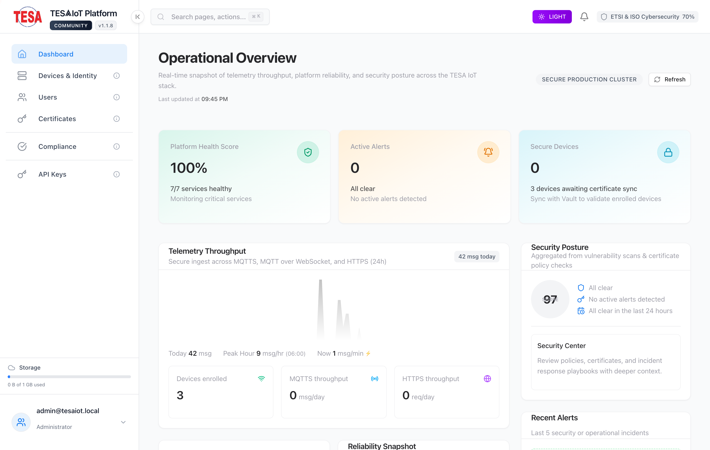
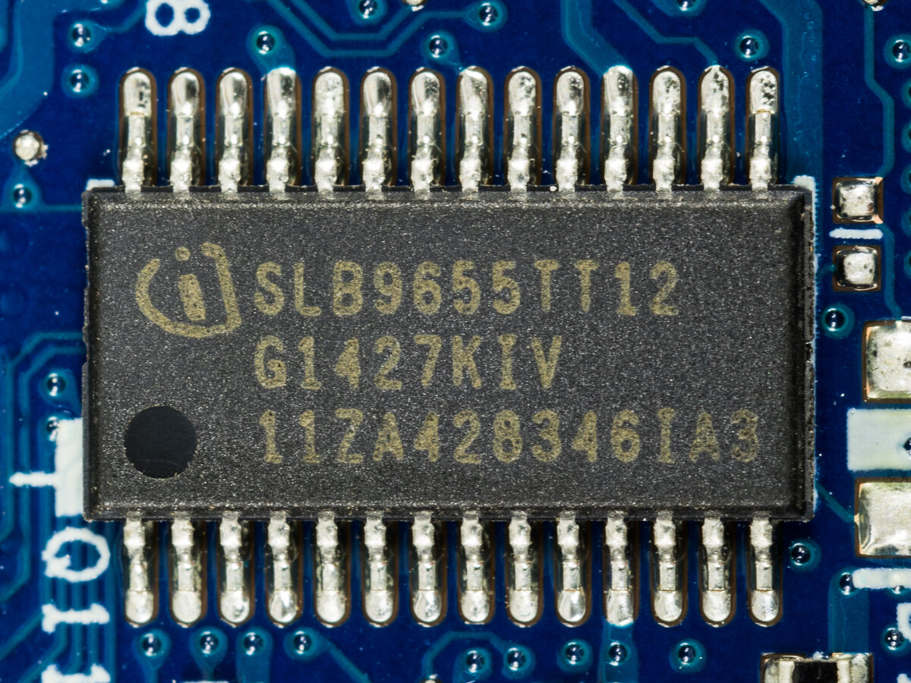
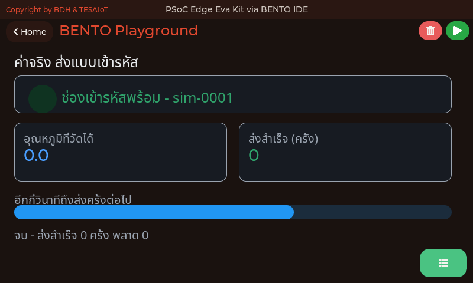
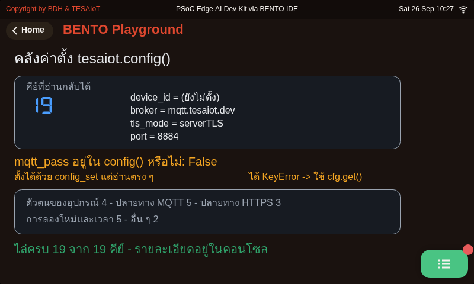
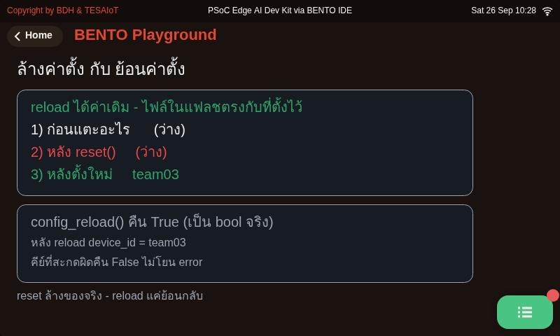
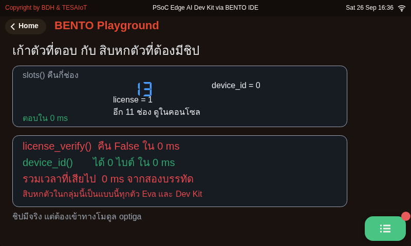
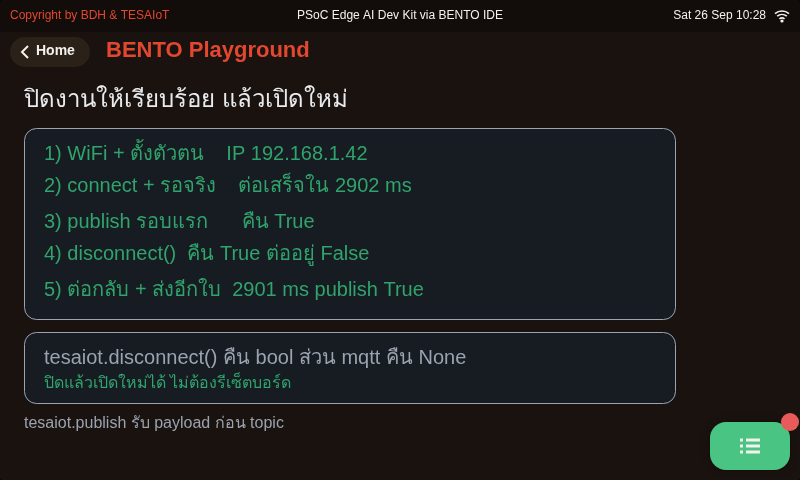
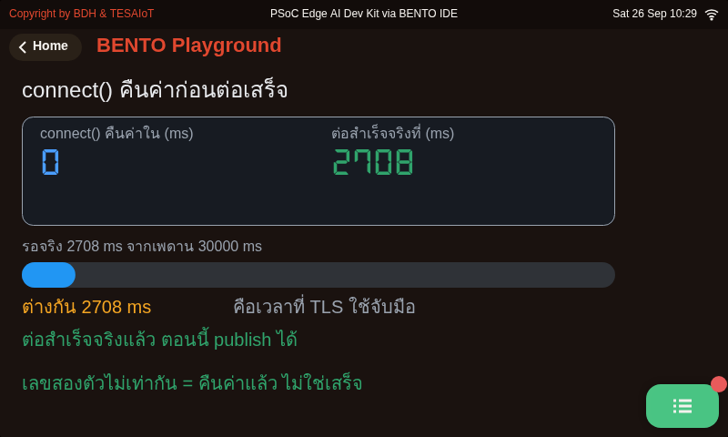
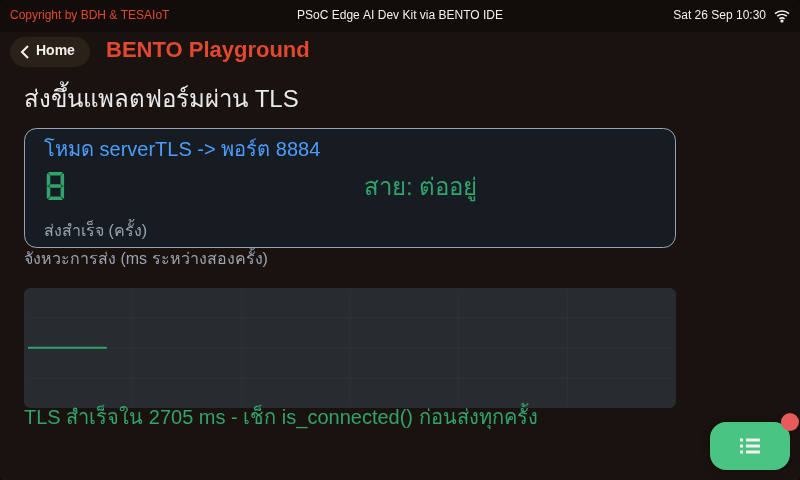

<style>
section { font-size: 24px; padding: 40px 52px; justify-content: flex-start; }
section h1 { font-size: 1.45em; line-height: 1.12; margin: 0 0 .22em; }
section h2 { font-size: 1.12em; margin: .15em 0; }
section h3 { font-size: 1.0em; margin: .12em 0; }
section p, section li { margin: .16em 0; line-height: 1.32; }
section img { max-width: 100%; height: auto; }
section svg { max-height: 330px; width: 100%; }
section table { font-size: .78em; }
section pre { font-size: .70em; line-height: 1.32; background:#0d1117; color:#e6edf3; border:1px solid #30363d; border-radius:8px; padding:12px 16px; box-shadow:0 2px 8px rgba(0,0,0,.25); }
section pre code { white-space: pre-wrap; background:transparent; color:inherit; } section pre .hljs-comment{color:#8b949e;font-style:italic} section pre .hljs-keyword,section pre .hljs-built_in,section pre .hljs-literal{color:#ff7b72} section pre .hljs-string{color:#a5d6ff} section pre .hljs-number{color:#79c0ff} section pre .hljs-title,section pre .hljs-title.function_,section pre .hljs-section{color:#d2a8ff} section pre .hljs-meta{color:#ffa657} section pre .hljs-attr,section pre .hljs-attribute,section pre .hljs-name{color:#7ee787}
section blockquote { margin: .25em 0; font-size: .92em; }
/* two images on a line (parity / 2x2 grids) stay side-by-side and small */
section p > img + img { margin-left: 10px; }
/* scroll-within-slide: dense slides scroll instead of clipping */
section { overflow-y: auto; overflow-x: hidden; }
section::-webkit-scrollbar { width: 11px; }
section::-webkit-scrollbar-thumb { background:#4a90d9; border-radius:6px; }
section::-webkit-scrollbar-track { background:rgba(0,0,0,.06); }
/* image drop-shadow + cover-slide readability (auto) */
section img{filter:drop-shadow(0 3px 12px rgba(0,0,0,.5))}
/* พื้นสำรองของสไลด์ปก: ถ้า img/cover_sNN.svg โหลดไม่ขึ้น ธีมจะคืนพื้นขาว
   แล้วตัวอักษรสีขาวของปกจะหายไปทั้งแผ่น — ปักสีเข้มไว้ให้ภาพเป็นแค่ของประดับ */
section.cover{background-color:#0b1426}
section.cover *{color:#fff !important}
section.cover h1,section.cover h2,section.cover h3,section.cover p,section.cover li,section.cover strong,section.cover em,section.cover blockquote,section.cover div{text-shadow:0 2px 9px rgba(0,0,0,.92),0 0 3px rgba(0,0,0,.8)}
section.cover div[style*="background:#"],section.cover div[style*="background: #"]{background:rgba(10,14,20,.66) !important;border-color:rgba(120,200,255,.45) !important;max-width:62%}
section.cover blockquote{border-left:4px solid rgba(120,200,255,.6) !important;background:rgba(13,17,23,.55) !important;border-radius:6px;padding:.3em .6em}
section.cover h1,section.cover h2,section.cover h3,section.cover p,section.cover blockquote{max-width:60%}
section.cover div:not(:has(img)){max-width:62%}
section.cover img{filter:none}
</style>


<!-- _class: cover -->

# บทเรียน 4.9 — ลงมือทำ: ส่งค่าจริงผ่านช่องทางเข้ารหัส

## MQTTs (serverTLS) · จากพอร์ต 1883 ที่ใครก็อ่านได้ ไปพอร์ต 8884 ที่รู้ว่ากำลังคุยกับใคร

**โมดูล 4 — เชื่อมต่อแพลตฟอร์ม IoT**

> ต่อจากบทเรียน 4.8 — โมดูล tesaiot: MQTTs สู่แพลตฟอร์ม

---

## MVP checkpoint — ผ่านชุดบทเรียนนี้เมื่อ




<div style="font-size:.58em;color:#78909c;margin-top:-.35em">ภาพหน้าจอ: TESAIoT Community Edition v1.1.8 — เอกสารของ repo (Apache-2.0) — หน้าตาของ dashboard ที่จะไปดูกราฟของทีม</div>

**telemetry ของทีมขึ้น dashboard แพลตฟอร์มผ่าน TLS + ตอบได้ว่าต่างจากบทเรียน 4.4–4.6 ตรงไหน**

- [ ] กราฟของ `device_id` ทีมนั้น **ขยับ** บน dashboard ของแพลตฟอร์มจริง และขยับตามเมื่อเอียงบอร์ด
- [ ] จอบอร์ดแสดง `device_id` + โหมด `tls_mode` + **ตัวนับที่เดินขึ้นต่อเนื่อง**
- [ ] กล่องค่าประจำตัวในบันทึกการเรียน ครบสี่ค่า และ `device_id` ไม่ซ้ำทีมอื่น
- [ ] ตารางเทียบ 1883 กับ 8884 ในบันทึกการเรียน กรอกครบทั้งเจ็ดแถว จากสิ่งที่เห็นเอง ไม่ใช่ลอกสไลด์
- [ ] ตอบได้โดยไม่เปิดสไลด์ว่า **serverTLS ปกป้องอะไร และไม่ปกป้องอะไร**
- [ ] ตอบได้ว่าพอร์ต 8884 ถูกเลือกมาจากอะไร (และทำไมไม่ใช่จากคีย์ `port`)

> ข้อที่ห้าคือหัวใจ — ถ้าตอบไม่ได้ เราติดตั้งความปลอดภัยเป็น แต่ยังไม่รู้ว่าเราซื้ออะไรมาด้วยราคาเท่าไร

---

## กับดักที่เจอบ่อย

| อาการ | สาเหตุที่แท้จริง | วิธีแก้ |
|---|---|---|
| ต่อไม่ติด ไม่มีข้อความอะไรเลย | `sni_hostname` ไม่ตรงกับ `broker` เซิร์ฟเวอร์ยื่นใบผิดใบ | ตั้งสองค่านี้เป็นสตริงเดียวกันเสมอ |
| ต่อไม่ติดกับ CE ที่ติดตั้งเอง | CE สุ่ม root CA ใหม่ทุกการติดตั้ง บอร์ดฝัง CA ของแพลตฟอร์มไว้ | ใช้โฮสต์ของแพลตฟอร์ม TESAIoT ที่ได้มาพร้อมตัวตนของอุปกรณ์ — MQTTs เข้า CE ต้อง build เฟิร์มแวร์ใหม่ |
| ตั้ง `port` แล้วพอร์ตไม่เปลี่ยน | พอร์ตมาจาก `tls_mode` คีย์ `port` เปลี่ยนแค่ป้ายที่แสดง | ดู `tls_mode` เป็นคำตอบ อย่าดูคีย์ `port` |
| `publish()` ไม่ error แต่ไม่มีข้อมูลบนแพลตฟอร์ม | ยิงก่อน `is_connected()` เป็น True เพราะ `connect()` เป็น async | วนรอด้วย `while not tesaiot.is_connected()` พร้อม timeout |
| โปรแกรมค้างตรงลูปรอ ไม่ไปไหนเลย | ลูปรอไม่มี timeout วันที่เน็ตล่มจึงวนตลอดกาล | `time.ticks_diff()` เกิน 30000 ms แล้ว `break` |
| หลายบอร์ดหลุดสลับกันเป็นจังหวะ | หลายบอร์ดใช้ `device_id` ค่าเริ่มต้นตัวเดียวกัน broker เตะตัวเก่าออก | หนึ่งบอร์ดหนึ่ง `device_id` ที่ provision มา |
| ข้อมูลขึ้นแต่ไม่มีเส้นกราฟ | ส่งค่าเป็นสตริง | ส่งตัวเลขจริง ไม่ใช่ `"25.5"` |
| ชื่อวัดขึ้นต้นด้วย `data_` และไม่มีหน่วย | ห่อ payload เองด้วย `{"data": ...}` | ส่งแบน bridge ห่อให้เองอยู่แล้ว |

> แปดแถวนี้เป็นเรื่องสาย ใบรับรอง และรูปร่างข้อมูล — หน้าถัดไปคือกับดักที่อยู่ในตัวโมดูล `tesaiot` เอง

---

## กับดักที่เจอบ่อย (ต่อ) — ขอบเขตของโมดูล `tesaiot`

<style scoped>section table{font-size:.68em} section p{margin:.1em 0}</style>

| อาการ | สาเหตุที่แท้จริง | วิธีแก้ |
|---|---|---|
| เรียก `device_id()` `health()` `random()` แล้วได้ `OSError` "... failed" | ตัวในกลุ่มสิบหกส่ง IPC ไปคอร์จอ ซึ่งทั้ง Eva และ Dev Kit ประกอบมาโดยไม่มี OPTIGA — คอร์จอตอบ "ไม่มีให้" กลับมา (เวลาที่เสียไปยังไม่ได้วัดจริง) | อย่าเรียกกลุ่มนั้นบนบอร์ดไหนเลย · อยากคุยกับชิปจริงให้ใช้โมดูล `optiga` แทน |
| บน Dev Kit เรียก `tesaiot.protected_update()` แล้วคืน `True` ไม่มี error | ฟังก์ชันนี้ทำงานจริงบน Dev Kit (`ENABLE_OPTIGA_CLM=1`) — มันขอชุด Protected Update จากแพลตฟอร์มแล้วเขียนใบรับรองลงชิป OPTIGA | **ห้ามเรียกในชุดบทเรียนนี้** ทั้งสองบอร์ด — บน Eva ได้ `OSError` แต่บน Dev Kit สิ่งที่เขียนลงชิปย้อนกลับเองไม่ได้ |
| `publish()` คืน True แต่ข้อมูลไปโผล่ผิด topic | สลับลำดับเป็น `tesaiot.publish(topic, payload)` ตามความเคยชินจากบทเรียน 4.4–4.6 | ตัวนี้ **payload มาก่อน** เขียน `tesaiot.publish(json.dumps(payload))` |
| ตั้ง `tls_mode` เป็น `"server_tls"` แล้วอ่านกลับได้คนละคำ | เฟิร์มแวร์แปลงชื่อโหมดให้เป็น `"serverTLS"` | ปกติ ไม่ใช่บั๊ก เทียบค่าด้วยคำที่อ่านกลับมา อย่าเทียบกับคำที่เราส่งไป |
| `if tesaiot.disconnect():` ทำงาน แต่ `if mqtt.disconnect():` ไม่เคยจริง | สองโมดูลคืนคนละชนิด ตัวแรกคืน bool ตัวหลังคืน `None` | อย่าจำรวมกัน เปิดตารางดูทุกครั้งที่สลับโมดูล |

สิบในสิบสามแถวของสองหน้านี้ **ไม่ใช่บั๊กในโค้ด** แต่เป็นความเข้าใจผิดเรื่องขอบเขตของ API — โค้ดถูกทุกตัวอักษร แต่สมมติฐานผิดหนึ่งข้อ

> อ่านตารางนี้ **ก่อน** เจอปัญหา — แทบไม่มีอาการไหนมีข้อความ error ที่ชี้ไปหาสาเหตุ และแถว `protected_update()` คือแถวเดียวที่ "ไม่มี error" แปลว่าเสียหายไปแล้ว

---

## ลงมือทำ — เติมช่องว่างในไฟล์ฝึก

<div style="width:70%;margin:0 auto">
<svg viewBox="0 0 940 200" xmlns="http://www.w3.org/2000/svg">
  <rect x="90" y="6" width="760" height="188" rx="6" fill="#0d1117" stroke="#30363d" stroke-width="2"/>
  <text x="112" y="38" font-size="18" font-family="monospace" fill="#8b949e">s11_secure_telemetry.py</text>
  <rect x="112" y="52" width="58" height="24" rx="3" fill="#ff7b72"/>
  <text x="141" y="70" text-anchor="middle" font-size="17" font-family="monospace" fill="#0d1117">pass</text>
  <text x="186" y="70" font-size="17" font-family="monospace" fill="#8b949e">ท่า 1 — config_set สามบรรทัด (ตัวตน)</text>
  <rect x="112" y="82" width="58" height="24" rx="3" fill="#ffa657"/>
  <text x="141" y="100" text-anchor="middle" font-size="17" font-family="monospace" fill="#0d1117">pass</text>
  <text x="186" y="100" font-size="17" font-family="monospace" fill="#8b949e">ท่า 1 — broker + sni_hostname</text>
  <rect x="112" y="112" width="58" height="24" rx="3" fill="#79c0ff"/>
  <text x="141" y="130" text-anchor="middle" font-size="17" font-family="monospace" fill="#0d1117">pass</text>
  <text x="186" y="130" font-size="17" font-family="monospace" fill="#8b949e">ท่า 2 — ลูปรอ is_connected() + timeout</text>
  <rect x="132" y="142" width="58" height="24" rx="3" fill="#d2a8ff"/>
  <text x="161" y="160" text-anchor="middle" font-size="17" font-family="monospace" fill="#0d1117">pass</text>
  <text x="206" y="160" font-size="17" font-family="monospace" fill="#8b949e">ท่า 3 — payload ตัวเลขจริง</text>
  <rect x="132" y="168" width="58" height="24" rx="3" fill="#7ee787"/>
  <text x="161" y="186" text-anchor="middle" font-size="17" font-family="monospace" fill="#0d1117">pass</text>
  <text x="206" y="186" font-size="17" font-family="monospace" fill="#8b949e">ท่า 4 — lcd.print หลักฐานบนจอ</text>
  <circle cx="820" cy="176" r="9" fill="#7ee787"><animate attributeName="r" values="6;12;6" dur="1.8s" repeatCount="indefinite"/></circle>
</svg>

เปิด [`s11_secure_telemetry.py`](https://github.com/tesaiot/tesa-qualification-program/blob/main/courses/aiot-micropython/m04-iot-connectivity/l09-secure-telemetry-lab/practice/s11_secure_telemetry.py) มีช่องว่างให้เติม **5 จุด**

```python
# เติม: tesaiot.config_set("device_id", DEVICE_ID) แล้วอีกสองบรรทัด api_key และ mqtt_pass
pass
# เติม: tesaiot.config_set("broker", BROKER) แล้วบรรทัดถัดไป sni_hostname เป็นชื่อเดียวกัน
pass
# เติม: while not tesaiot.is_connected(): เกิน 30000 ms ให้ break ไม่งั้น time.sleep_ms(500)
pass
    # เติม: payload = {"accel_x": round(m[0], 2), "heading": ..., "pot": ...}   # แบน ไม่ห่อ
    pass
    # เติม: lcd.print("ส่งครั้งที่", sent, "| โหมด", cfg["tls_mode"], "-> 8884")
    pass
```

</div>

**หนึ่ง** แก้ห้าบรรทัดบนหัวไฟล์ **สอง** เติมท่า 1 แล้วรันดู `print(tesaiot.config())` **สาม** เติมท่า 2 แล้วจับเวลา **สี่** เติมท่า 3-4 แล้วเปิด dashboard

> `tesaiot.connect()` **มีให้แล้วในไฟล์ ไม่ใช่ช่องว่าง** — สิ่งที่เราต้องเขียนคือลูปที่รอมัน นั่นคือประเด็นของท่าที่ 2 ทั้งท่า

---

## โบนัส · ตัวตนที่ฝังอยู่ในซิลิคอน (สาธิต ไม่บังคับ)

<div style="display:flex;gap:18px;align-items:flex-start">
<div style="width:330px">



<div style="font-size:.55em;color:#78909c;margin-top:-.35em">ภาพ: Raimond Spekking / Wikimedia Commons — CC BY-SA 4.0 — ชิปความปลอดภัยของ Infineon (SLB9655 บนเมนบอร์ดโน้ตบุ๊ก) เป็นคนละรุ่นกับ OPTIGA Trust M บนบอร์ดเรา แต่หน้าตาและหน้าที่เป็นตระกูลเดียวกัน</div>

</div>
<div style="flex:1">

บน Eva Kit มีชิป **OPTIGA Trust M** อยู่จริง และเรียกจาก REPL ได้แล้ววันนี้ — ยืนยันด้วยการทดสอบบนบอร์ดจริง · บน Dev Kit ชิปตัวเดียวกันต่ออยู่บนบัสจอของ CM55 ทุกครั้งที่เรียก จอจะหยุดรับสัมผัสชั่วครู่ และ**ยังไม่ได้ตรวจว่าทุกบอร์ดติดตั้งชิปมาครบ** — ก่อนสาธิตให้ลอง `optiga.uid()` บนบอร์ดตัวนั้นก่อน

```python
optiga.uid()          # เลขประจำตัวที่โรงงานเขียนไว้ อ่านได้ ลบไม่ได้
optiga.random(16)     # เลขสุ่มจากวงจรจริง ไม่ใช่จากสูตรในซอฟต์แวร์
optiga.sha256(b"...") # แฮชด้วยฮาร์ดแวร์
optiga.sign(...)      # เซ็นด้วยกุญแจที่ออกจากชิปไม่ได้
```

ความต่างที่สำคัญ: `mqtt_pass` ของวันนี้เป็นความลับที่ **คัดลอกได้** ส่วนกุญแจส่วนตัวในชิปนี้ **ออกจากชิปไม่ได้เลย** ชิปยอมเซ็นให้เท่านั้น ใครขโมยบอร์ดไปได้ต้องขนบอร์ดไปทั้งตัว จะก๊อปตัวตนไปเฉย ๆ ไม่ได้

และในชิปยังมี **ใบรับรองจากโรงงาน** อ่านออกมาดูได้ — นั่นคือชิ้นส่วนที่ mTLS ต้องการ

</div>
</div>

> นี่คือคำตอบของคำถามที่ค้างไว้เมื่อสองสไลด์ก่อน: **ตัวตนของอุปกรณ์ที่ก๊อปไม่ได้ ต้องมาจากฮาร์ดแวร์** ไม่ใช่จากสตริงในไฟล์ Python

---

## เชื่อมโยงรากฐาน + สรุปบทเรียน

<svg viewBox="0 0 940 178" xmlns="http://www.w3.org/2000/svg">
  <rect x="10" y="14" width="298" height="150" rx="8" fill="#e3f2fd" stroke="#1565c0" stroke-width="2"/>
  <text x="159" y="48" text-anchor="middle" font-size="20" font-weight="700" fill="#1565c0">ฝั่งสมองกลฝังตัว</text>
  <text x="159" y="82" text-anchor="middle" font-size="18" fill="#0d47a1">งบหน่วยความจำตอนจับมือ</text>
  <text x="159" y="112" text-anchor="middle" font-size="18" fill="#0d47a1">ค่าคงที่ที่คอมไพล์ติดมา</text>
  <text x="159" y="142" text-anchor="middle" font-size="18" fill="#5472a3">ตัวตนที่มาจากซิลิคอน</text>
  <rect x="320" y="14" width="298" height="150" rx="8" fill="#e8f5e9" stroke="#2e7d32" stroke-width="2"/>
  <text x="469" y="48" text-anchor="middle" font-size="20" font-weight="700" fill="#2e7d32">ฝั่งเครือข่ายและ Python</text>
  <text x="469" y="82" text-anchor="middle" font-size="18" fill="#1b5e20">กุญแจคู่ · ลายเซ็น · แฮช</text>
  <text x="469" y="112" text-anchor="middle" font-size="18" fill="#1b5e20">ใบรับรอง · ห่วงโซ่ · SNI</text>
  <text x="469" y="142" text-anchor="middle" font-size="18" fill="#4a7c4e">API แบบ async ต้องรอเป็น</text>
  <rect x="630" y="14" width="300" height="150" rx="8" fill="#fff3e0" stroke="#ef6c00" stroke-width="2"/>
  <text x="780" y="48" text-anchor="middle" font-size="20" font-weight="700" fill="#ef6c00">ฝั่งออกแบบระบบ</text>
  <text x="780" y="82" text-anchor="middle" font-size="18" fill="#e65100">ขอบเขตของกลไกความปลอดภัย</text>
  <text x="780" y="112" text-anchor="middle" font-size="18" fill="#e65100">ตัวตนรายอุปกรณ์ ไม่ใช่รายรุ่น</text>
  <text x="780" y="142" text-anchor="middle" font-size="18" fill="#a1683a">ค่าที่แสดง ≠ ค่าที่ใช้จริง</text>
</svg>

**วันนี้เราได้:** ส่ง telemetry ขึ้นแพลตฟอร์มผ่านช่องที่เข้ารหัส · อ่านการจับมือ TLS ได้ทีละขั้นและรู้ว่าใบรับรองพิสูจน์อะไร · รู้ว่าพอร์ตมาจาก `tls_mode` ไม่ใช่คีย์ `port` · และรอ API แบบ async เป็น แทนที่จะเชื่อค่าที่ฟังก์ชันคืนมา

**สิ่งที่ติดตัวไปแม้เปลี่ยนภาษาและเปลี่ยนบอร์ด:** นิสัยถามว่า **"กลไกนี้พิสูจน์อะไร และไม่ได้พิสูจน์อะไร"** ก่อนจะเชื่อมัน · การแยก "ฟังก์ชันคืนค่า" ออกจาก "งานเสร็จ" · และการไม่เชื่อค่าที่ตัวเองเพิ่งตั้งจนกว่าจะวัดที่ปลายทาง

**งานทำเอง 30%:** เลือกทำ 1 ข้อจากสี่ข้อในสไลด์ต่อยอด จดลงบันทึกการเรียน

**ชุดบทเรียนถัดไป:** capstone — ทีมเลือกโจทย์อุตสาหกรรมของตัวเอง แล้วประกอบ เซนเซอร์ → หน้าจอ → MQTT/MQTTs → แพลตฟอร์ม ให้ครบวงจรเป็นระบบเดียว

> ชุดบทเรียนนี้เป็นบทเรียนแรกที่คำตอบที่ถูกที่สุดคือ **"ได้ แต่แค่ระดับนี้"** — และนั่นคือวิธีที่วิศวกรพูดถึงความปลอดภัยเสมอ

---

## เฉลย [`s11_secure_telemetry.py`](https://github.com/tesaiot/tesa-qualification-program/blob/main/courses/aiot-micropython/m04-iot-connectivity/l09-secure-telemetry-lab/solution/s11_secure_telemetry.py) — ส่วนที่หนึ่ง

```python
TEAM_NAME = "BentoBuilders"
DEVICE_ID = "team03"              # ต้องตรงกับที่ขึ้นทะเบียน และสั้นกว่า 31 ตัวอักษร
API_KEY   = "<api key ของอุปกรณ์>"
MQTT_PASS = "<รหัสผ่าน MQTT 16 ตัว>"
BROKER    = "<โฮสต์แพลตฟอร์ม>"

tesaiot.config_set("device_id", DEVICE_ID)
tesaiot.config_set("api_key", API_KEY)
tesaiot.config_set("mqtt_pass", MQTT_PASS)
tesaiot.config_set("broker", BROKER)
tesaiot.config_set("sni_hostname", BROKER)      # ชื่อเดียวกับ broker เสมอ
print("config ปัจจุบัน:", tesaiot.config())
```

<svg viewBox="0 0 940 160" xmlns="http://www.w3.org/2000/svg">
  <rect x="14" y="12" width="300" height="136" rx="7" fill="#e8f5e9" stroke="#2e7d32" stroke-width="2"/>
  <text x="164" y="46" text-anchor="middle" font-size="20" font-weight="700" fill="#2e7d32">ค่าที่ต้องแก้อยู่ห้าบรรทัด</text>
  <text x="164" y="80" text-anchor="middle" font-size="18" fill="#1b5e20">รวมไว้บนหัวไฟล์ที่เดียว</text>
  <text x="164" y="110" text-anchor="middle" font-size="18" fill="#1b5e20">ข้างล่างไม่ต้องแตะเลย</text>
  <text x="164" y="138" text-anchor="middle" font-size="17" fill="#4a7c4e">คนมาแก้ทีหลังหาเจอทันที</text>
  <rect x="326" y="12" width="300" height="136" rx="7" fill="#e3f2fd" stroke="#1565c0" stroke-width="2"/>
  <text x="476" y="46" text-anchor="middle" font-size="20" font-weight="700" fill="#1565c0">BROKER โผล่สองที่</text>
  <text x="476" y="80" text-anchor="middle" font-size="18" fill="#0d47a1">broker และ sni_hostname</text>
  <text x="476" y="110" text-anchor="middle" font-size="18" fill="#0d47a1">จึงใช้ตัวแปรตัวเดียว</text>
  <text x="476" y="138" text-anchor="middle" font-size="17" fill="#5472a3">ทำให้ไม่มีทางไม่ตรงกัน</text>
  <rect x="638" y="12" width="288" height="136" rx="7" fill="#fff3e0" stroke="#ef6c00" stroke-width="2"/>
  <text x="782" y="46" text-anchor="middle" font-size="20" font-weight="700" fill="#ef6c00">print(config()) ก่อนต่อ</text>
  <text x="782" y="80" text-anchor="middle" font-size="18" fill="#e65100">เห็นค่าที่เฟิร์มแวร์เก็บจริง</text>
  <text x="782" y="110" text-anchor="middle" font-size="18" fill="#e65100">จับคีย์ที่สะกดผิดได้ตรงนี้</text>
  <text x="782" y="138" text-anchor="middle" font-size="17" fill="#a1683a">ถูกกว่าการไปเดาตอนต่อไม่ติด</text>
</svg>

> เขียนค่าที่ต้องตรงกันไว้ที่เดียว แล้วบั๊กตระกูล "ลืมแก้ที่หนึ่ง" จะหายไปทั้งตระกูล — ชุดบทเรียนนี้ค่านั้นคือ `BROKER`

---

## เฉลย — ตัวตนที่ตั้งไว้ ต้องมองเห็นได้ ไม่ใช่เชื่อเอา

<style scoped>section pre{font-size:.55em}</style>

```python
cfg0 = tesaiot.config()
tbl_id = ui.Table(x=30, y=62, w=412, h=286, cols=2)
tbl_id.col_width(0, 140)
tbl_id.col_width(1, 260)
tbl_id.add_row("คีย์", "ค่าที่ตั้งไว้")
tbl_id.add_row("device_id", DEVICE_ID)
tbl_id.add_row("broker", BROKER)
tbl_id.add_row("tls_mode", str(cfg0["tls_mode"]))
ui.Label("mqtt_pass ตั้งแล้ว แต่อ่านกลับไม่ได้", x=30, y=356, color=COL_DIM, value=14)

led_wait = ui.Led(x=488, y=64, w=28, h=28, color=COL_RUN, value=1)
led_ok = ui.Led(x=588, y=64, w=28, h=28, color=COL_OK, value=0)
led_fail = ui.Led(x=688, y=64, w=28, h=28, color=COL_BAD, value=0)

bar_hs = ui.Bar(x=484, y=236, w=200, h=12, color=COL_RUN,
                min=0, max=WAIT_CEILING_S, value=0)
sc_hs = ui.Scale(x=484, y=250, w=200, h=44, color=COL_TEXT,
                 min=0, max=WAIT_CEILING_S)
```

`config_set()` **เงียบสนิท** ค่าที่ตั้งไปจึงไม่มีใครเห็น จนกว่าจะเอาขึ้นจอ `print()` ตอบได้เฉพาะคนที่นั่งอยู่หน้าคอม ส่วนตารางนี้ตอบคนที่เดินมาดูบอร์ด

แถวสุดท้ายที่ **ไม่มี** ในตารางคือ `mqtt_pass` เพราะอ่านกลับไม่ได้ — และมันไปอยู่เป็นบรรทัดใต้ตารางที่เขียนว่า "ตั้งแล้ว แต่อ่านกลับไม่ได้" ช่องว่างบนหน้าจอแปลว่า "ยังไม่ได้ตั้ง" ซึ่งเป็นคนละเรื่องกับ "ตั้งแล้วแต่ดูไม่ได้" **หน้าจอที่ปล่อยช่องว่างไว้ กำลังบอกอะไรบางอย่างที่ไม่จริง**

ไฟสามดวงติดทีละดวง ไล่ตามจังหวะจริงของการจับมือ และ `bar_hs` เดินขึ้นเทียบกับ `WAIT_CEILING_S` ซึ่งเป็น **ตัวเลขเดียวกับที่ลูป `while` ใช้ตัดสิน** ไม่ใช่เลขที่วาดไว้ให้ดูสวย

> คนที่ยืนรออยู่หน้าจอ 30 วินาที ต้องเห็นว่าโปรแกรมยังทำงาน จอที่นิ่งสนิทกับบอร์ดที่แฮงก์ หน้าตาเหมือนกันทุกประการ

---

## เฉลย — ส่วนที่สอง: ลูปหลัก

<style scoped>section pre{font-size:.52em;line-height:1.2} section p{margin:.1em 0} section blockquote{margin:.2em 0}</style>

```python
tesaiot.connect()
t0 = time.ticks_ms()
last_s = -1
while not tesaiot.is_connected():
    waited = time.ticks_diff(time.ticks_ms(), t0)
    if waited > WAIT_CEILING_S * 1000:
        print("ต่อแพลตฟอร์มไม่สำเร็จใน 30 วินาที")
        break
    if waited // 1000 != last_s:          # ตัวเลขเปลี่ยนวินาทีละครั้ง ไม่ถี่กว่านั้น
        last_s = waited // 1000
        bar_hs.value(last_s)
        lbl_hs.text(str(last_s) + " วิ")
    ui.poll()
    time.sleep_ms(500)
...
while tesaiot.is_connected():
    try:
        m = sensors.bmi270.motion()             # (ax, ay, az, gx, gy, gz)
        payload = {"accel_x": round(m[0], 2),
                   "heading": round(sensors.bmm350.heading(), 1),
                   "pot": sensors.pot.percent()}
    except OSError:
        time.sleep_ms(1000)
        continue
    tesaiot.publish(json.dumps(payload))
    sent += 1
    cfg = tesaiot.config()
    lcd.print("ส่งครั้งที่", sent, "| โหมด", cfg["tls_mode"], "-> 8884")
    lbl_sent.text("ส่งแล้ว " + str(sent) + " ใบ")
    for ev in ui.poll():
        ...        # ปุ่มต่อใหม่ / ตัดสาย พร้อมกล่องยืนยัน - อยู่ในไฟล์เฉลยเต็ม
    time.sleep_ms(5000)
```

> เงื่อนไขของ `while` คือการเช็กสาย**ก่อนทุกรอบส่ง** ไม่ใช่เช็กครั้งเดียวตอนเริ่ม · สามค่าในลูปส่งอยู่ใน `try` เดียวกัน — อ่านพลาดหนึ่งรอบต้องไม่ทำให้หลุดการเชื่อมต่อ

<!-- ระหว่างรอ แถบเดินขึ้นทุกครึ่งวินาที ตัวเลขเขียนใหม่แค่ตอนวินาทีเปลี่ยน — คนที่ยืนรอต้องเห็นว่าโปรแกรมยังทำงาน -->

---

## เฉลย — ทำไมเรียงสี่ท่าแบบนี้

<div style="width:84%;margin:0 auto">

<svg viewBox="0 0 940 150" xmlns="http://www.w3.org/2000/svg">
  <rect x="14" y="102" width="222" height="36" rx="5" fill="#c8e6c9" stroke="#2e7d32" stroke-width="2"/>
  <text x="125" y="126" text-anchor="middle" font-size="18" fill="#1b5e20">ท่า 1 — ตัวตนถูกต้อง</text>
  <rect x="246" y="72" width="222" height="36" rx="5" fill="#bbdefb" stroke="#1565c0" stroke-width="2"/>
  <text x="357" y="96" text-anchor="middle" font-size="18" fill="#0d47a1">ท่า 2 — ต่อเสร็จจริง</text>
  <rect x="478" y="42" width="222" height="36" rx="5" fill="#ffe0b2" stroke="#ef6c00" stroke-width="2"/>
  <text x="589" y="66" text-anchor="middle" font-size="18" fill="#e65100">ท่า 3 — ข้อมูลขึ้นกราฟ</text>
  <rect x="710" y="12" width="216" height="36" rx="5" fill="#e1bee7" stroke="#6a1b9a" stroke-width="2"/>
  <text x="818" y="36" text-anchor="middle" font-size="18" fill="#4a148c">ท่า 4 — พิสูจน์ได้บนจอ</text>
  <path d="M240,116 L250,104 M472,86 L482,76 M704,56 L714,46" stroke="#90a4ae" stroke-width="2.5"/>
  <circle r="8" fill="#e91e63" cx="245" cy="110"><animateMotion path="M0,0 L112,-20 L344,-50 L573,-80" dur="3.2s" repeatCount="indefinite"/><animate attributeName="r" values="5;11;5" dur="3.2s" repeatCount="indefinite"/></circle>
</svg>

</div>

**ท่า 1 มาก่อนเพราะตรวจได้โดยไม่ต้องใช้เน็ต** — `print(config())` บอกทันทีว่าค่าเข้าครบไหม · **ท่า 2 แยกเป็นท่าของตัวเอง** เพราะ "ต่อเสร็จ" เกิดทีหลังคำสั่ง ไม่ใช่ผลของคำสั่ง · **ท่า 3 ส่งข้อมูลจริง** เมื่อสองท่าแรกยืนยันแล้ว ถ้ากราฟยังว่าง รู้แน่ว่าปัญหาอยู่ที่รูปร่าง JSON · **ท่า 4 คือหลักฐาน** ที่ให้คนอื่นตรวจงานได้โดยไม่ต้องเปิดโค้ด

**ท่า 5 คือปุ่มบนจอ** — `ตัดสาย` เป็นคำสั่งที่ถอยกลับไม่ได้ทันที เพราะต้องจับมือ TLS ใหม่ทั้งชุด มันจึงมีกล่องยืนยันที่บอก **สิ่งที่จะเกิด** ไม่ใช่ถามลอย ๆ ว่า "แน่ใจไหม" ส่วน `ต่อใหม่` ไม่ต้องยืนยัน เพราะถ้ากดพลาดก็แค่ต่อซ้ำ — **ระดับของการยืนยัน มาจากราคาของความผิดพลาด ไม่ได้มาจากความสำคัญของปุ่ม**

> เรียงจาก "ตรวจง่ายที่สุด" ไป "ตรวจยากที่สุด" แล้วความล้มเหลวจะบอกที่อยู่ของตัวเองเสมอ

---

## เชื่อมจุดให้เห็นภาพ — วันนี้อยู่ตรงไหนของเส้นทาง

<svg viewBox="0 0 940 212" xmlns="http://www.w3.org/2000/svg">
  <line x1="40" y1="120" x2="900" y2="120" stroke="#b0bec5" stroke-width="4"/>
  <circle cx="150" cy="120" r="16" fill="#22d3ee"/>
  <circle cx="390" cy="120" r="16" fill="#a3c93a"/>
  <circle cx="630" cy="120" r="18" fill="#ffb066"><animate attributeName="r" values="14;20;14" dur="2.2s" repeatCount="indefinite"/></circle>
  <circle cx="850" cy="120" r="16" fill="#6cb2f5"/>
  <text x="150" y="88" text-anchor="middle" font-size="18" font-weight="700" fill="#0e7490">บทเรียน 1.1–3.9</text>
  <text x="150" y="160" text-anchor="middle" font-size="19" fill="#455a64">อ่านเซนเซอร์ วาดจอ</text>
  <text x="150" y="182" text-anchor="middle" font-size="19" fill="#455a64">ในบอร์ดของเราเอง</text>
  <text x="390" y="88" text-anchor="middle" font-size="18" font-weight="700" fill="#5b7c14">บทเรียน 4.1–4.6</text>
  <text x="390" y="160" text-anchor="middle" font-size="19" fill="#455a64">ต่อเน็ต แล้วส่งข้อมูล</text>
  <text x="390" y="182" text-anchor="middle" font-size="19" fill="#455a64">ออกไปให้เครื่องอื่นใช้</text>
  <text x="630" y="88" text-anchor="middle" font-size="18" font-weight="700" fill="#b45309">วันนี้ · บทเรียน 4.7–4.9</text>
  <text x="630" y="160" text-anchor="middle" font-size="19" fill="#455a64">ช่องทางเข้ารหัส</text>
  <text x="630" y="182" text-anchor="middle" font-size="19" fill="#455a64">และรู้ว่าปลายทางเป็นตัวจริง</text>
  <text x="850" y="88" text-anchor="middle" font-size="18" font-weight="700" fill="#1565c0">บทเรียน 5.1–5.3</text>
  <text x="850" y="160" text-anchor="middle" font-size="19" fill="#455a64">ประกอบทั้งหมด</text>
  <text x="850" y="182" text-anchor="middle" font-size="19" fill="#455a64">เป็นสินค้าหนึ่งชิ้น</text>
  <text x="470" y="36" text-anchor="middle" font-size="21" font-weight="700" fill="#37474f">วันนี้คือจุดที่ "ระบบที่ใช้งานได้" กลายเป็น "ระบบที่ปล่อยออกนอกห้องได้"</text>
  <circle r="8" fill="#e91e63" cx="150" cy="120"><animateMotion path="M0,0 L240,0 L480,0" dur="3s" repeatCount="indefinite"/><animate attributeName="r" values="5;11;5" dur="3s" repeatCount="indefinite"/></circle>
</svg>

**คำถามคิดต่อ:** ถ้ารหัส `mqtt_pass` ของอุปกรณ์เราหลุดออกไป จะรู้ตัวได้อย่างไร และควรทำอะไรเป็นอย่างแรก · ใครควรเป็นคนตัดสินใจว่าอุปกรณ์ตัวไหนถูกถอนสิทธิ์ ระหว่างคนดูแลแพลตฟอร์มกับคนเขียนเฟิร์มแวร์ · ถ้ามีอุปกรณ์ 10,000 ตัวและแต่ละตัวต้องมีตัวตนไม่ซ้ำกัน ขั้นตอนการ provision ที่โรงงานควรหน้าตาเป็นอย่างไร

---

## ใช้จริงที่ไหน — สี่มุมที่ TLS ทำงานอยู่ตอนนี้

<svg viewBox="0 0 940 300" xmlns="http://www.w3.org/2000/svg">
  <rect x="14" y="16" width="452" height="128" rx="10" fill="#e3f2fd" stroke="#1565c0" stroke-width="2"/>
  <text x="36" y="48" font-size="22" font-weight="700" fill="#1565c0">โรงพยาบาล · ข้อมูลที่กฎหมายคุ้มครอง</text>
  <text x="36" y="78" font-size="18" fill="#0d47a1">เครื่องวัดสัญญาณชีพส่งค่าผ่านช่องที่เข้ารหัสเท่านั้น</text>
  <text x="36" y="102" font-size="18" fill="#0d47a1">และต้องพิสูจน์ได้ว่าค่ามาจากเครื่องไหน เตียงไหน</text>
  <text x="36" y="128" font-size="17" fill="#5472a3">ระดับนี้ใช้ mTLS ไม่ใช่ serverTLS อย่างที่เราทำวันนี้</text>
  <rect x="480" y="16" width="446" height="128" rx="10" fill="#e8f5e9" stroke="#2e7d32" stroke-width="2"/>
  <text x="502" y="48" font-size="22" font-weight="700" fill="#2e7d32">โรงงาน · เครื่องจักรที่สั่งงานได้จากไกล</text>
  <text x="502" y="78" font-size="18" fill="#1b5e20">คำสั่งหยุดเครื่องต้องมาจากคนที่มีสิทธิ์เท่านั้น</text>
  <text x="502" y="102" font-size="18" fill="#1b5e20">ปลอมคำสั่งได้ = อันตรายต่อความปลอดภัยของคน</text>
  <text x="502" y="128" font-size="17" fill="#4a7c4e">การเข้ารหัสอย่างเดียวไม่พอ ต้องพิสูจน์ตัวตนด้วย</text>
  <rect x="14" y="158" width="452" height="128" rx="10" fill="#fff3e0" stroke="#ef6c00" stroke-width="2"/>
  <text x="36" y="190" font-size="22" font-weight="700" fill="#ef6c00">พลังงาน · มิเตอร์ที่ติดตั้งนอกบ้านคน</text>
  <text x="36" y="220" font-size="18" fill="#e65100">อุปกรณ์อยู่ในมือคนอื่น จับต้องได้ แกะได้</text>
  <text x="36" y="244" font-size="18" fill="#e65100">รหัสในไฟล์จึงไม่พอ ต้องเป็นกุญแจในชิปที่ดึงออกไม่ได้</text>
  <text x="36" y="270" font-size="17" fill="#a1683a">นี่คือเหตุผลที่ secure element มีอยู่บนโลก</text>
  <rect x="480" y="158" width="446" height="128" rx="10" fill="#f3e5f5" stroke="#6a1b9a" stroke-width="2"/>
  <text x="502" y="190" font-size="22" font-weight="700" fill="#6a1b9a">สินค้าผู้บริโภค · อัปเดตเฟิร์มแวร์ผ่านเน็ต</text>
  <text x="502" y="220" font-size="18" fill="#4a148c">ไฟล์อัปเดตต้องมีลายเซ็นที่อุปกรณ์ตรวจเองได้</text>
  <text x="502" y="244" font-size="18" fill="#4a148c">ใช้กลไกเดียวกับใบรับรองที่เราเพิ่งเรียนวันนี้</text>
  <text x="502" y="270" font-size="17" fill="#7e5a94">TLS ปกป้องระหว่างทาง ลายเซ็นปกป้องตัวไฟล์เอง</text>
</svg>

> สี่มุมนี้ใช้ชิ้นส่วนชุดเดียวกับที่เราเพิ่งเรียน ต่างกันที่ **ตัวตนของอุปกรณ์มาจากไหน** — ไฟล์ข้อความ หรือชิปที่ก๊อปไม่ได้

---

## ดูเพิ่มเติมนอกเวลา — วิดีโอที่ตรวจแล้วว่าเปิดได้

**Transport Layer Security (TLS)** — Computerphile (Dr Mike Pound) · 15 นาที 33 วินาที · อังกฤษ — กรอบความคิดว่า TLS มีไว้ทำไม อธิบายสิ่งที่ต้องการปกป้องก่อนจะพูดถึงกลไก เหมาะดูก่อนคลิปถัดไป

**TLS Handshake — EVERYTHING that happens when you visit an HTTPS website** — Practical Networking · 27 นาที 58 วินาที · อังกฤษ — ทุกข้อความในการจับมือ พร้อม packet capture จริง **ยาว** ดูเป็นการบ้านหรือเลือกดูเฉพาะช่วง

<div style="display:flex;gap:18px;align-items:flex-start;margin:.3em 0">
<iframe width="330" height="186" src="https://www.youtube.com/embed/0TLDTodL7Lc" title="Transport Layer Security (TLS) - Computerphile" loading="lazy" frameborder="0" allowfullscreen></iframe>
<iframe width="330" height="186" src="https://www.youtube.com/embed/ZkL10eoG1PY" title="TLS Handshake - EVERYTHING that happens when you visit an HTTPS website" loading="lazy" frameborder="0" allowfullscreen></iframe>
</div>

**อ่านและเล่นต่อสำหรับคนอยากรู้ลึก**

- SSL/TLS Handshake Demonstration — Interactive Animated Guide (8gwifi.org) คลิกไล่ทีละขั้น มีทั้ง RSA, ECDHE, TLS 1.3 และ mutual TLS: <https://8gwifi.org/ssl-tls-handshake-demo.jsp>
- The Illustrated TLS 1.2 Connection — เห็นใบรับรอง X.509 จริงทีละไบต์: <https://tls12.xargs.org/>
- What Happens in a TLS Handshake? — Cloudflare Learning Center: <https://www.cloudflare.com/learning/ssl/what-happens-in-a-tls-handshake/>

> คลิปเหล่านี้ไม่อยู่ในเกณฑ์ผ่าน แต่คนที่ดูจะออกแบบส่วนความปลอดภัยของ capstone ชุดบทเรียนถัดไปได้ลึกกว่าเพื่อน

---

## ต่อยอด — คิดต่อเอง (เลือกทำ 1 ข้อ)

<svg viewBox="0 0 940 168" xmlns="http://www.w3.org/2000/svg">
  <rect x="14" y="14" width="216" height="140" rx="7" fill="#e3f2fd" stroke="#1565c0" stroke-width="2"/>
  <text x="122" y="52" text-anchor="middle" font-size="20" font-weight="700" fill="#1565c0">1 · จับเวลาสองท่อ</text>
  <text x="122" y="88" text-anchor="middle" font-size="18" fill="#0d47a1">1883 เทียบ 8884</text>
  <text x="122" y="124" text-anchor="middle" font-size="18" fill="#5472a3">ส่วนต่างหายไปกับอะไร</text>
  <rect x="248" y="14" width="216" height="140" rx="7" fill="#e8f5e9" stroke="#2e7d32" stroke-width="2"/>
  <text x="356" y="52" text-anchor="middle" font-size="20" font-weight="700" fill="#2e7d32">2 · ทำให้พังอย่างมีระบบ</text>
  <text x="356" y="88" text-anchor="middle" font-size="18" fill="#1b5e20">แก้ผิดทีละหนึ่งค่า</text>
  <text x="356" y="124" text-anchor="middle" font-size="18" fill="#4a7c4e">ทำตารางอาการของทีมเอง</text>
  <rect x="482" y="14" width="216" height="140" rx="7" fill="#fff3e0" stroke="#ef6c00" stroke-width="2"/>
  <text x="590" y="52" text-anchor="middle" font-size="20" font-weight="700" fill="#ef6c00">3 · ตัวตนที่มาจากชิป</text>
  <text x="590" y="88" text-anchor="middle" font-size="18" fill="#e65100">optiga.uid() · random()</text>
  <text x="590" y="124" text-anchor="middle" font-size="18" fill="#a1683a">ทำไม uid ยังไม่พอ</text>
  <rect x="716" y="14" width="210" height="140" rx="7" fill="#f3e5f5" stroke="#6a1b9a" stroke-width="2"/>
  <text x="821" y="52" text-anchor="middle" font-size="20" font-weight="700" fill="#6a1b9a">4 · schema ของงานจริง</text>
  <text x="821" y="88" text-anchor="middle" font-size="18" fill="#4a148c">ส่งอะไร ถี่แค่ไหน</text>
  <text x="821" y="124" text-anchor="middle" font-size="18" fill="#7e5a94">คำนวณข้อมูลต่อวัน</text>
</svg>

**ข้อ 1 · จับเวลาสองท่อ** — วัดด้วย `time.ticks_ms()` ว่าจากสั่ง `connect()` จนถึง `is_connected()` เป็น True ใช้เวลากี่มิลลิวินาที ทำสามรอบแล้วหาค่ากลาง เทียบกับเวลาที่ `mqtt.connect()` ของบทเรียน 4.4–4.6 ใช้ แล้วอธิบายว่าส่วนต่างนั้นหายไปกับอะไรบ้าง

**ข้อ 2 · ทดลองทำให้พังอย่างมีระบบ** — แก้ค่าให้ผิด **ทีละหนึ่งตัว**: `device_id` ผิดหนึ่งตัวอักษร / `mqtt_pass` ผิด / `sni_hostname` ผิด — จดว่าแต่ละแบบให้อาการต่างกันอย่างไร แล้วทำตารางอาการ → สาเหตุของทีมเอง

**ข้อ 3 · ตัวตนที่มาจากชิป** — เปิด REPL เรียก `optiga.uid()`, `optiga.random(16)` สามครั้ง และ `optiga.sha256(b"...")` จดผลไว้ แล้วตอบว่าทำไมเลขสุ่มจากชิปถึงเชื่อถือได้มากกว่าเลขสุ่มจากสูตรในซอฟต์แวร์ และทำไม `uid()` ถึงยังไม่พอที่จะเป็นตัวตนสำหรับ mTLS (บน Dev Kit ให้เรียก `uid()` ก่อนเป็นข้อแรก — ถ้าบอร์ดนั้นไม่มีชิป ข้อนี้ทำไม่ได้ และห้ามแตะ `tesaiot.protected_update()` ในข้อนี้เด็ดขาด)

**ข้อ 4 · ออกแบบ schema ของงานจริง** — สมมติทีมต้องส่ง telemetry ของเครื่องจักรจริงหนึ่งเครื่อง ออกแบบว่าจะส่งฟิลด์อะไรบ้าง ถี่แค่ไหน ฟิลด์ไหนควรส่งเฉพาะตอนผิดปกติ พร้อมคำนวณปริมาณข้อมูลต่อวัน

> เขียนคำตอบลงบันทึกการเรียน แล้วเอามาเล่าให้เพื่อนฟังต้นชุดบทเรียนถัดไป

---

## ปิดวงจร — ค่าที่วัดได้จริง ออกไปแบบที่คนกลางอ่านไม่ได้

หกไฟล์ที่ผ่านมาสอนกลไก TLS ด้วยค่าที่แต่งขึ้น เพื่อให้เห็นการจับมือชัด ๆ [`07_real_reading_over_tls.py`](https://github.com/tesaiot/tesa-qualification-program/blob/main/courses/aiot-micropython/m04-iot-connectivity/l09-secure-telemetry-lab/examples/07_real_reading_over_tls.py) ปิดวง — ค่าที่ออกไปคือค่าที่ชิปบนบอร์ดวัดได้จริง · ค่านั้นคืออุณหภูมิ อ่านผ่าน `read_temp()` ในไฟล์: **บน Dev Kit มาจาก SHT40 จริง** ส่วน **บน Eva ไม่มีเซนเซอร์อุณหภูมิ** ไฟล์จึงให้ลูกบิดเล่นบทแทน (0–100 % = 15–45 °C) และบอกไว้บน console ทั้งสองกรณีว่าค่ามาจากไหน — `sensors.snapshot()` ไม่มีช่องอุณหภูมิบนบอร์ดไหนเลย

**และประโยคที่ต้องพูดให้ผู้เรียนได้ยินในชุดบทเรียนนี้** — การเข้ารหัส**ไม่ได้ทำให้ข้อมูลถูกต้องขึ้น** มันแค่ทำให้คนกลางอ่านไม่ได้ ถ้าค่าที่วัดผิดตั้งแต่ต้น มันจะผิด**อย่างปลอดภัย**ไปถึงปลายทาง

นี่คือเหตุผลที่บทเรียน 2.7–2.9 กับ 3.1–3.3 ต้องมาก่อนชุดบทเรียนนี้ ไม่ใช่มาทีหลัง — ความน่าเชื่อถือของระบบเริ่มที่เซนเซอร์ ไม่ได้เริ่มที่ใบรับรอง



<div style="font-size:.56em;color:#78909c;margin-top:-.3em">ภาพจากตัวจำลอง bento_sim — โค้ด CM55 ชุดเดียวกับที่รันบนบอร์ด ที่ 800x480 เท่าจอของทั้งสองบอร์ด · ค่าอุณหภูมิและสถานะลิงก์เป็นค่าแทนบนเครื่องโฮสต์ ไม่ใช่ผลการวัดของบอร์ด</div>

> ลองบนโต๊ะ: เปิด MQTT Explorer ที่ปลายทาง เทียบว่าเลขที่เห็นตรงกับเลขบนจอบอร์ดไหม

---

## หน้าจอของทุกไฟล์ในชุดบทเรียนนี้ (1/2)

<style scoped>
section img { margin: 0 .3em; }
section p { margin: .2em 0; }
</style>

  

<div style="font-size:.56em;color:#90a4ae"><b>01</b> คลังค่าตั้งของแพลตฟอร์ม อ่านให้ครบก่อนจะต่ออะไร · <b>02</b> ล้างค่าตั้ง กับ ย้อนค่าตั้ง เป็นคนละเรื่องกัน · <b>03</b> ครึ่งที่ตอบได้ กับ ครึ่งที่ข้ามคอร์ไปหาชิปที่ไม่ได้เปิด — จับเวลาให้ดู</div>

<div style="font-size:.52em;color:#78909c;margin-top:.4em">ภาพจากตัวจำลอง bento_sim ซึ่งเรนเดอร์ด้วยโค้ด CM55 ชุดเดียวกับที่รันบนบอร์ด ที่ 800x480 เท่าจอของทั้งสองบอร์ด — แสดง<b>หน้าจอที่ตัวอย่างสร้าง</b> ค่าจากเซนเซอร์ WiFi และไมค์เป็นค่าแทนบนเครื่องโฮสต์ ไม่ใช่ผลการวัดของบอร์ด</div>

---

## หน้าจอของทุกไฟล์ในชุดบทเรียนนี้ (2/2)

<style scoped>
section img { margin: 0 .3em; }
section p { margin: .2em 0; }
</style>

  

<div style="font-size:.56em;color:#90a4ae"><b>04</b> ปิดงานให้เรียบร้อย แล้วเปิดใหม่ · <b>05</b> connect() คืนค่าก่อนต่อเสร็จ ต้องรอด้วย is_connected() · <b>06</b> ส่งขึ้นแพลตฟอร์มผ่าน TLS แล้วโชว์หลักฐานบนจอ</div>

<div style="font-size:.52em;color:#78909c;margin-top:.4em">ภาพจากตัวจำลอง bento_sim ซึ่งเรนเดอร์ด้วยโค้ด CM55 ชุดเดียวกับที่รันบนบอร์ด ที่ 800x480 เท่าจอของทั้งสองบอร์ด — แสดง<b>หน้าจอที่ตัวอย่างสร้าง</b> ค่าจากเซนเซอร์ WiFi และไมค์เป็นค่าแทนบนเครื่องโฮสต์ ไม่ใช่ผลการวัดของบอร์ด</div>

---

## อ้างอิงและเครดิต

<style scoped>section{font-size:15px} section li{margin:.02em 0} section p{margin:.1em 0}</style>

**มาตรฐานและเอกสารโพรโทคอล**

- The Transport Layer Security (TLS) Protocol Version 1.2 — RFC 5246 — <https://www.rfc-editor.org/rfc/rfc5246>
- The Transport Layer Security (TLS) Protocol Version 1.3 — RFC 8446 — <https://www.rfc-editor.org/rfc/rfc8446>
- What Happens in a TLS Handshake? — Cloudflare Learning Center — <https://www.cloudflare.com/learning/ssl/what-happens-in-a-tls-handshake/>
- What is an SSL certificate? — Cloudflare — <https://www.cloudflare.com/learning/ssl/what-is-an-ssl-certificate/>
- What Is SNI? How TLS Server Name Indication Works — Cloudflare — <https://www.cloudflare.com/learning/ssl/what-is-sni/>
- What is mutual TLS (mTLS)? — Cloudflare — <https://www.cloudflare.com/learning/access-management/what-is-mutual-tls/>
- The Illustrated TLS 1.2 Connection — <https://tls12.xargs.org/> · SSL/TLS Handshake Demo (โต้ตอบได้) — <https://8gwifi.org/ssl-tls-handshake-demo.jsp>
- TESAIoT Community Edition (Apache-2.0) — <https://github.com/tesaiot/tesaiot-community-edition>

**วิดีโอ**

- PKI Bootcamp — Basics of Certificate Chain Validation — Paul Turner — <https://www.youtube.com/watch?v=lLw0dICMA_Y>
- พื้นฐาน SSL TLS HTTPS CSR Certificate คืออะไร ทำงานอย่างไร — SaKKo sama — <https://www.youtube.com/watch?v=yRWFOP66OE0>
- Transport Layer Security (TLS) — Computerphile — <https://www.youtube.com/watch?v=0TLDTodL7Lc>
- TLS Handshake — EVERYTHING that happens when you visit an HTTPS website — Practical Networking — <https://www.youtube.com/watch?v=ZkL10eoG1PY>

**ภาพ** (ทุกไฟล์เก็บไว้ในโฟลเดอร์ `img/` ของบทเรียน 4.7–4.9 ไม่ได้ลิงก์ข้ามเว็บ)

- Wikimedia Commons — สาธารณสมบัติ: `s11_keypair_encrypt.svg`, `s11_signature_verify.svg` (Davidgothberg) · `s11_hash_function.svg` (Jorge Stolfi ต่อยอดจาก Helix84) · `s11_tls12_handshake.svg`, `s11_tls13_handshake.svg` (Fleshgrinder และ The Tango! Desktop Project)
- Wikimedia Commons — CC BY-SA 4.0: `s11_chain_of_trust.svg` (Yuhkih) · `s11_mitm_tls_inspection.svg` (Rudolf.Achter) · `s11_mqtt_broker_tls.svg` (Ademant) · `s11_secure_element.jpg` (Raimond Spekking) — CC BY 3.0: `s11_mutual_auth.svg` (Essich)
- `s11_tls12_handshake_th.svg` — วาดเองสำหรับหลักสูตรนี้ ดัดแปลงลำดับเวลาจาก Full TLS 1.2 Handshake (สาธารณสมบัติ) แปลป้ายเป็นไทยและเปลี่ยนปลายทางเป็น EMQX
- `s11_ce_dashboard.png`, `s11_ce_devices.png` — ภาพหน้าจอ TESAIoT Community Edition v1.1.8, `docs/images/screenshots/` (Apache-2.0)

**ข้อเท็จจริงของเฟิร์มแวร์และแพลตฟอร์ม**

พอร์ต 8884 ถูกเลือกจาก `tls_mode` ไม่ใช่จากคีย์ `port` · root CA ถูกคอมไพล์เข้าเฟิร์มแวร์และเปลี่ยนตอนรันไม่ได้ · `tesaiot.connect()` เป็น API แบบ asynchronous ต้องรอด้วย `is_connected()` · `device_id` ยาวได้ 31 ตัวอักษรฝั่งบอร์ด — ตรวจจาก `modtesaiot.c` ใน `BENTO-TESAIoT-libraries` ซึ่งเป็นโค้ดร่วมของทั้ง Eva Kit และ TESAIoT Dev Kit (นับชื่อได้ 28 จากตาราง globals) · `protected_update()` ทำงานจริงเฉพาะบิลด์ที่ `ENABLE_OPTIGA_CLM=1` — Dev Kit ตั้งค่านี้ไว้ ส่วน Eva ตั้ง 0 (`proj_cm33_ns/Makefile` ของแต่ละโปรเจกต์) · สิบหกชื่อที่ข้ามคอร์ตายทั้งสองบอร์ดเพราะ `proj_cm55/Makefile` ของทั้งคู่ตั้ง `ENABLE_OPTIGA ?= 0` · ข้อเท็จจริงที่ว่า TESAIoT CE สร้าง root CA ใหม่แบบสุ่มทุกการติดตั้ง (`scripts/init-vault-pki.sh`) จึงใช้ MQTTs กับ CE ที่ self-host ไม่ได้จนกว่าจะ build เฟิร์มแวร์ใหม่ — ตรวจจาก repo `tesaiot/tesaiot-community-edition` เมื่อ 2026-08-12

> ทุกตัวเลขและทุกข้อจำกัดบนสไลด์นี้สืบกลับไปที่ซอร์สโค้ดหรือเอกสารต้นทางได้ ถ้าเจอที่ไม่ตรง [แจ้ง erratum](https://github.com/tesaiot/tesa-qualification-program/issues/new?template=erratum.yml) ได้เลย
