<style>
section { font-size: 23px; padding: 14px 44px; justify-content: flex-start; }
section h1 { font-size: 1.45em; line-height: 1.10; margin: 0 0 .14em; }
section h2 { font-size: 1.10em; margin: .06em 0; }
section h3 { font-size: 1.0em; margin: .12em 0; }
section p, section li { margin: .05em 0; line-height: 1.16; }
section img { max-width: 100%; height: auto; }
section svg { max-height: 205px; width: 100%; }
section table { font-size: .70em; }
section pre { font-size: .55em; line-height: 1.12; background:#0d1117; color:#e6edf3; border:1px solid #30363d; border-radius:8px; padding:12px 16px; box-shadow:0 2px 8px rgba(0,0,0,.25); }
section pre code { white-space: pre-wrap; background:transparent; color:inherit; } section pre .hljs-comment{color:#8b949e;font-style:italic} section pre .hljs-keyword,section pre .hljs-built_in,section pre .hljs-literal{color:#ff7b72} section pre .hljs-string{color:#a5d6ff} section pre .hljs-number{color:#79c0ff} section pre .hljs-title,section pre .hljs-title.function_,section pre .hljs-section{color:#d2a8ff} section pre .hljs-meta{color:#ffa657} section pre .hljs-attr,section pre .hljs-attribute,section pre .hljs-name{color:#7ee787}
section blockquote { margin: .12em 0; font-size: .88em; }
/* two images on a line (parity / 2x2 grids) stay side-by-side and small */
section p > img + img { margin-left: 10px; }
/* scroll-within-slide: dense slides scroll instead of clipping */
section { overflow-y: auto; overflow-x: hidden; }
section::-webkit-scrollbar { width: 11px; }
section::-webkit-scrollbar-thumb { background:#4a90d9; border-radius:6px; }
section::-webkit-scrollbar-track { background:rgba(0,0,0,.06); }
/* image drop-shadow + cover-slide readability (auto) */
section img{filter:drop-shadow(0 3px 12px rgba(0,0,0,.5))}
/* พื้นสำรองของสไลด์ปก: ถ้า img/cover_sNN.svg โหลดไม่ขึ้น ธีมจะคืนพื้นขาว
   แล้วตัวอักษรสีขาวของปกจะหายไปทั้งแผ่น — ปักสีเข้มไว้ให้ภาพเป็นแค่ของประดับ */
section.cover{background-color:#0b1426}
section.cover *{color:#fff !important}
section.cover h1,section.cover h2,section.cover h3,section.cover p,section.cover li,section.cover strong,section.cover em,section.cover blockquote,section.cover div{text-shadow:0 2px 9px rgba(0,0,0,.92),0 0 3px rgba(0,0,0,.8)}
section.cover div[style*="background:#"],section.cover div[style*="background: #"]{background:rgba(10,14,20,.66) !important;border-color:rgba(120,200,255,.45) !important;max-width:62%}
section.cover blockquote{border-left:4px solid rgba(120,200,255,.6) !important;background:rgba(13,17,23,.55) !important;border-radius:6px;padding:.3em .6em}
section.cover h1,section.cover h2,section.cover h3,section.cover p,section.cover blockquote{max-width:60%}
section.cover div:not(:has(img)){max-width:62%}
section.cover img{filter:none}
</style>

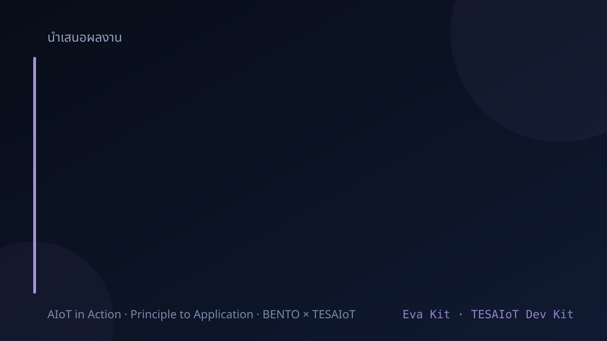

<!-- _class: cover -->

# บทเรียน 5.1 — จากโจทย์จริงสู่แบบ: canvas schema และการออกแบบตอนพัง

## AIoT Mini-Product ของทีมเรา: จากโจทย์จริง สู่ของที่ใช้งานได้

**โมดูล 5 — Capstone: AIoT Mini-Product**

> คาถาประจำบทเรียน: **ของที่ใช้งานได้ ไม่ใช่ของที่ทำงานได้ตอนสาธิต**

---

## ดูของจริงก่อน — ผลงานของทีมเราเอง

<svg viewBox="0 0 940 240" xmlns="http://www.w3.org/2000/svg">
  <defs><marker id="h1" markerWidth="10" markerHeight="8" refX="9" refY="4" orient="auto">
    <path d="M0,0 L10,4 L0,8 z" fill="#455a64"/></marker></defs>
  <rect x="14" y="20" width="300" height="160" rx="10" fill="#0b1224" stroke="#7aa7d9" stroke-width="2"/>
  <text x="164" y="48" text-anchor="middle" font-size="19" fill="#00E676">dashboard บทเรียน 3.7–3.9</text>
  <rect x="30" y="60" width="130" height="50" rx="6" fill="#142240" stroke="#4CAF50" stroke-width="2"/>
  <text x="95" y="90" text-anchor="middle" font-size="17" fill="#4CAF50">IMU</text>
  <rect x="170" y="60" width="130" height="50" rx="6" fill="#142240" stroke="#E040FB" stroke-width="2"/>
  <text x="235" y="90" text-anchor="middle" font-size="17" fill="#E040FB">Compass</text>
  <rect x="30" y="120" width="130" height="50" rx="6" fill="#142240" stroke="#00BCD4" stroke-width="2"/>
  <text x="95" y="150" text-anchor="middle" font-size="17" fill="#00BCD4">CapSense</text>
  <rect x="170" y="120" width="130" height="50" rx="6" fill="#142240" stroke="#8BC34A" stroke-width="2"/>
  <text x="235" y="150" text-anchor="middle" font-size="17" fill="#8BC34A">Pot</text>
  <rect x="340" y="20" width="300" height="160" rx="10" fill="#f5f7fa" stroke="#546e7a" stroke-width="2"/>
  <text x="490" y="48" text-anchor="middle" font-size="19" font-weight="700" fill="#455a64">telemetry บทเรียน 4.4–4.9</text>
  <text x="356" y="82" font-size="18" font-family="monospace" fill="#37474f">bento/team01/telemetry</text>
  <text x="356" y="112" font-size="18" font-family="monospace" fill="#2e7d32">{"v": 17.4} </text>
  <text x="356" y="142" font-size="18" font-family="monospace" fill="#2e7d32">{"v": 17.6}</text>
  <circle cx="616" cy="106" r="7" fill="#2e7d32">
    <animate attributeName="r" values="5;11;5" dur="1.4s" repeatCount="indefinite"/></circle>
  <text x="356" y="170" font-size="18" fill="#78909c">ข้อความไหลเข้าทุก 5 วินาที</text>
  <rect x="666" y="20" width="260" height="160" rx="10" fill="#ffebee" stroke="#c62828" stroke-width="2"/>
  <text x="796" y="48" text-anchor="middle" font-size="19" font-weight="700" fill="#c62828">ถอด WiFi ออกเงียบ ๆ</text>
  <text x="686" y="84" font-size="18" fill="#b71c1c">แล้วจอบอร์ดเป็นยังไง</text>
  <text x="686" y="114" font-size="18" fill="#b71c1c">ค้าง · error กลางจอ</text>
  <text x="686" y="144" font-size="18" fill="#b71c1c">หรือทำงานต่อแล้วบอกสถานะ</text>
  <line x1="640" y1="100" x2="662" y2="100" stroke="#455a64" stroke-width="3" marker-end="url(#h1)"/>
  <text x="470" y="220" text-anchor="middle" font-size="20" font-weight="700" fill="#37474f">ทั้งสองอย่างทำงานได้ทั้งคู่ และทั้งสองอย่างยังไม่ใช่ผลิตภัณฑ์</text>
</svg>


เปิดสองอย่างขึ้นมาพร้อมกัน: dashboard ที่ทีมสร้างในบทเรียน 3.7–3.9 กับ telemetry ที่ทีมส่งขึ้น broker ในบทเรียน 4.4–4.6 และ 4.7–4.9

ทั้งสองอย่างทำงานได้ทั้งคู่ และทั้งสองอย่างยังไม่ใช่ผลิตภัณฑ์

ลองอย่างนี้: ระหว่างที่มันรันอยู่ ให้เพื่อนถอด WiFi ออกเงียบ ๆ แล้วดูว่าเกิดอะไรขึ้นบนจอ

> ชุดบทเรียนนี้เราจะเปลี่ยนงานสองชิ้นนั้นให้เป็นชิ้นเดียวที่ส่งมอบได้

---

## demo กับ product ต่างกันตรงไหน

<svg viewBox="0 0 940 236" xmlns="http://www.w3.org/2000/svg">
  <defs><marker id="d1" markerWidth="10" markerHeight="8" refX="9" refY="4" orient="auto">
    <path d="M0,0 L10,4 L0,8 z" fill="#c62828"/></marker>
    <marker id="d2" markerWidth="10" markerHeight="8" refX="9" refY="4" orient="auto">
    <path d="M0,0 L10,4 L0,8 z" fill="#2e7d32"/></marker></defs>
  <text x="20" y="36" font-size="20" font-weight="700" fill="#c62828">demo — ทางเดินเดียวที่ทุกอย่างต้องดี</text>
  <rect x="20" y="48" width="170" height="56" rx="8" fill="#ffebee" stroke="#c62828" stroke-width="2"/>
  <text x="105" y="82" text-anchor="middle" font-size="18" fill="#b71c1c">เซนเซอร์</text>
  <rect x="216" y="48" width="170" height="56" rx="8" fill="#ffebee" stroke="#c62828" stroke-width="2"/>
  <text x="301" y="82" text-anchor="middle" font-size="18" fill="#b71c1c">ส่งขึ้นเน็ต</text>
  <rect x="412" y="48" width="170" height="56" rx="8" fill="#ffebee" stroke="#c62828" stroke-width="2"/>
  <text x="497" y="82" text-anchor="middle" font-size="18" fill="#b71c1c">จอแสดงผล</text>
  <line x1="192" y1="76" x2="212" y2="76" stroke="#c62828" stroke-width="3" marker-end="url(#d1)"/>
  <line x1="388" y1="76" x2="408" y2="76" stroke="#c62828" stroke-width="3" marker-end="url(#d1)"/>
  <line x1="288" y1="42" x2="314" y2="42" stroke="#c62828" stroke-width="4">
    <animate attributeName="stroke-width" values="4;10;4" dur="2.6s" repeatCount="indefinite"/></line>
  <text x="612" y="72" font-size="19" font-weight="700" fill="#c62828">เน็ตหลุดตรงกลาง</text>
  <text x="612" y="98" font-size="18" fill="#8d3b3b">จอค้างทั้งหน้า ทั้งที่เซนเซอร์ยังดี</text>
  <text x="20" y="152" font-size="20" font-weight="700" fill="#2e7d32">product — เส้นที่สำคัญไม่พึ่งเน็ต</text>
  <rect x="20" y="164" width="170" height="56" rx="8" fill="#e8f5e9" stroke="#2e7d32" stroke-width="2"/>
  <text x="105" y="198" text-anchor="middle" font-size="18" fill="#1b5e20">เซนเซอร์</text>
  <rect x="216" y="164" width="170" height="56" rx="8" fill="#e8f5e9" stroke="#2e7d32" stroke-width="2"/>
  <text x="301" y="198" text-anchor="middle" font-size="18" fill="#1b5e20">ตัดสินบนบอร์ด</text>
  <rect x="412" y="164" width="170" height="56" rx="8" fill="#e8f5e9" stroke="#2e7d32" stroke-width="2"/>
  <text x="497" y="198" text-anchor="middle" font-size="18" fill="#1b5e20">จอแสดงผล</text>
  <rect x="608" y="164" width="170" height="56" rx="8" fill="#f3e5f5" stroke="#6a1b9a" stroke-width="2" stroke-dasharray="6 5"/>
  <text x="693" y="198" text-anchor="middle" font-size="18" fill="#4a148c">ส่งขึ้นเน็ต</text>
  <line x1="192" y1="192" x2="212" y2="192" stroke="#2e7d32" stroke-width="3" marker-end="url(#d2)"/>
  <line x1="388" y1="192" x2="408" y2="192" stroke="#2e7d32" stroke-width="3" marker-end="url(#d2)"/>
  <line x1="584" y1="192" x2="604" y2="192" stroke="#6a1b9a" stroke-width="3" stroke-dasharray="5 4"/>
  <text x="794" y="186" font-size="19" font-weight="700" fill="#2e7d32">เน็ตหลุด</text>
  <text x="794" y="210" font-size="18" fill="#4a7c4e">จอยังทำงาน</text>
</svg>

| คำถาม | demo ตอบว่า | product ต้องตอบว่า |
|---|---|---|
| ทำไมต้องมีของชิ้นนี้ | เพราะมันเท่ | เพราะมีคนเสียเงินหรือเสียเวลากับปัญหานี้อยู่ |
| ค่าที่เห็นบนจอคืออะไร | ตัวเลขจากเซนเซอร์ | ปริมาณที่มีหน่วย และมีคนตัดสินใจจากมันได้ |
| ส่งอะไรขึ้นไป | ทุกอย่างที่วัดได้ | เฉพาะสิ่งที่ปลายทางใช้จริง |
| เน็ตหลุดแล้วยังไง | ค้าง หรือ error กลางจอ | จอทำงานต่อ บอกสถานะ แล้วต่อเองเมื่อเน็ตกลับมา |
| ใครดูแลมันต่อ | ไม่มีใคร | มี device id แยกตัว มีสถานะให้ตรวจ |

ช่องขวาทั้งห้าข้อ ไม่มีข้อไหนต้องใช้ API ใหม่ที่เรายังไม่เคยเรียนเลยสักตัว

> ระยะทางจาก demo ถึง product สั้นกว่าที่คิด แต่ต้องตั้งใจเดิน ไม่ใช่บังเอิญไปถึง

---

## demo กับ product ต่างกันตรงไหน (ต่อ) — ชิ้นส่วนเดียวกับบทเรียน 2.7–2.9

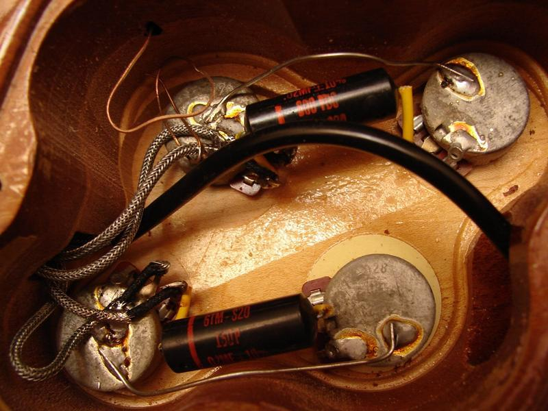 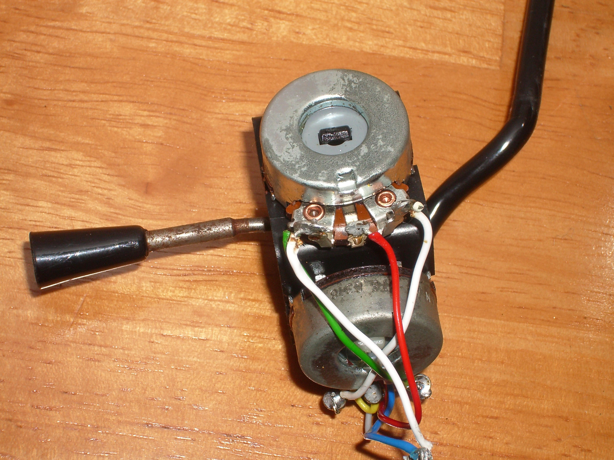

<div style="font-size:.58em;color:#78909c;margin-top:-.3em">ซ้าย — ภาพ: TT Zop / Wikimedia Commons — CC BY-SA 2.0 · ขวา — ภาพ: Daniel Beardsmore / Wikimedia Commons — สาธารณสมบัติ · ซ้ายคือช่องเก็บลูกบิดของกีตาร์ที่เดินสายเรียบร้อยอยู่ในตัวเครื่อง ขวาคือจอยสติกที่สร้างจาก pot สองตัวแล้วขายเป็นสินค้าจริง — ทั้งสองชิ้นใช้ชิ้นส่วนที่เราเรียนมาแล้วในบทเรียน 2.7–2.9 ความต่างจาก demo อยู่ที่สิ่งที่มองไม่เห็นในภาพ ไม่ใช่ที่ชิ้นส่วน</div>

---

## ทำไม · คืออะไร · ทำยังไง — แผนที่ของชุดบทเรียนนี้

<style scoped>
section table { font-size: .62em; }
section table td, section table th { padding: .16em .55em; }
</style>

| | คำถาม | คำตอบของชุดบทเรียนนี้ | อยู่ช่วงไหน |
|---|---|---|---|
| **Why** | ในเมื่อไม่มี API ใหม่สักตัว ทำไมยังต้องมีชุดบทเรียนนี้ | เพราะระยะทางจาก demo ถึง product ไม่ได้วัดด้วยจำนวนบรรทัด มันวัดด้วย **การตัดสินใจ** — เลือกโจทย์จากความเจ็บปวดจริง ออกแบบข้อมูลให้ฝั่งรับใช้ต่อได้ และตัดสินไว้ล่วงหน้าว่าตอนพังจะให้เกิดอะไร · ของที่ไม่เคยถูกทดสอบตอนเน็ตหลุด ยังไม่ใช่ของที่ส่งมอบได้ | ครึ่งแรก · demo กับ product · canvas · ออกแบบตอนพัง |
| **What** | มีอะไรให้ใช้บ้าง | ทุกโมดูลที่คอร์สนี้เปิดไปแล้ว — **เก้าโมดูล** ตั้งแต่ `lcd` ถึง `tesaiot` และวันนี้ **ไม่มีชื่อใหม่เพิ่มแม้แต่ชื่อเดียว** | สไลด์บัญชีรวมเก้าโมดูล |
| **How** | ประกอบยังไงให้ใช้งานได้จริง | กรอก canvas ห้าช่อง Sense → Decide → Show → Send → Act ให้ครบก่อนแตะโค้ด แล้วเติมโครง [`s12_capstone_starter.py`](https://github.com/tesaiot/tesa-qualification-program/blob/main/courses/aiot-micropython/m05-capstone/l03-build-and-present/practice/s12_capstone_starter.py) ที่จุด "ทีมเขียนเอง" ห้าจุด | เก้าไฟล์ตัวอย่าง (01–05 ในบทเรียน 5.2 · 06–09 ในบทเรียน 5.3) + โครงตั้งต้น + นำเสนอ 10 นาที |

**ปลายทางที่จับต้องได้** — ของหนึ่งชิ้นที่วางบนโต๊ะแล้วเดินครบวงเอง ตั้งแต่วัด ตัดสิน แสดง ถึงรายงานขึ้น broker และทีมอธิบายได้ว่ามันแก้ปัญหาอะไรให้ใคร รวมทั้งบอกได้ว่ามันยังทำอะไรไม่ได้

> บทเรียน 4.7–4.9 เราทำให้ส่งอย่างปลอดภัยได้ · ชุดบทเรียนนี้เราตอบคำถามที่มาก่อนหน้านั้น — จะส่งอะไร ให้ใคร และเขาจะเอาไปทำอะไรต่อ

---

## เป้าหมายของชุดบทเรียนนี้

1. เลือกโจทย์จาก **ความเจ็บปวดจริงในงาน** ไม่ใช่จากรายการเซนเซอร์ที่บอร์ดมี
2. ออกแบบระบบด้วย canvas ห้าช่อง: Sense → Decide → Show → Send → Act
3. ออกแบบ schema ข้อมูลที่เล็ก คงที่ มีหน่วย และมีตัวตนอุปกรณ์
4. ออกแบบพฤติกรรมตอนพัง — เน็ตหลุด broker ไม่ตอบ ค่าเซนเซอร์แปลก
5. ต่อโครง [`s12_capstone_starter.py`](https://github.com/tesaiot/tesa-qualification-program/blob/main/courses/aiot-micropython/m05-capstone/l03-build-and-present/practice/s12_capstone_starter.py) จนรัน end-to-end แล้ว **นำเสนอ 10 นาที**

ปลายทางของวันนี้: บอร์ดวางอยู่บนโต๊ะ จอบอกสถานะ ข้อความไหลขึ้น broker และทีมอธิบายได้ว่ามันแก้ปัญหาอะไรให้ใคร

> วันนี้เราไม่ได้เรียน API ใหม่ เราเรียน **วิธีตัดสินใจ** ว่าจะเอา API ที่มีอยู่ไปทำอะไร

---

## ปลายทางของชุดบทเรียนนี้ — โครงตั้งต้นที่ทีมจะต่อยอด

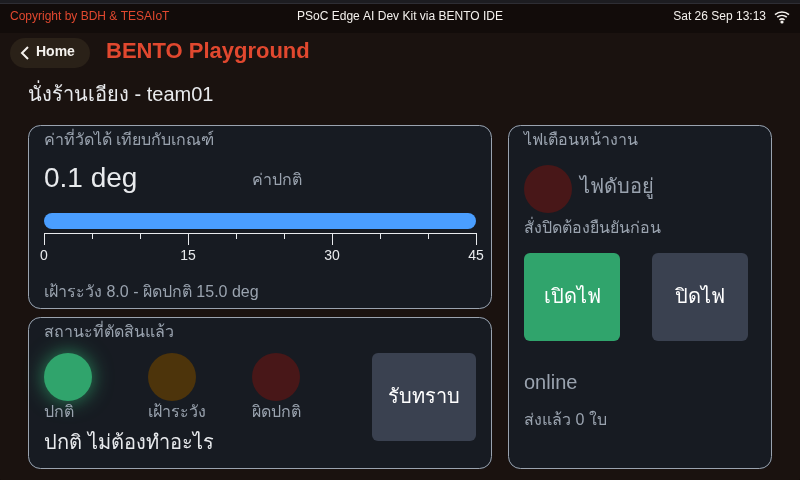

<div style="font-size:.58em;color:#78909c;margin-top:-.3em">หน้าจอจากการรันโค้ดเฉลย <b>รุ่นก่อนปรับหน้าจอ</b> บน BENTO Emulator ที่ 800x480 เท่าจอของทั้งสองบอร์ด — ไม่ใช่ภาพวาดและไม่ใช่ mock-up แต่รุ่นปัจจุบันเพิ่มไม้บรรทัด ไฟสถานะสามดวง ปุ่มเปิด/ปิดไฟเตือน และกล่องยืนยันเข้าไปแล้ว ภาพชุดใหม่ยังไม่ได้ถ่าย · ชื่อ <code>team01-eva</code> ในภาพคือ device_id รุ่นก่อนเปลี่ยนชื่อ ปัจจุบันไฟล์ใช้ <code>team01</code></div>

โครงของหน้าจอรุ่นปัจจุบัน แบ่งเป็นสามการ์ด

- **ซ้ายบน** ค่าที่วัดได้ตัวใหญ่ พร้อม `ui.Bar` วางทับ `ui.Scale` — ค่ากับพิสัยอยู่ด้วยกัน และมีป้ายบอกคุณภาพของค่าเองว่าสดหรือค้าง
- **ซ้ายล่าง** ไฟสถานะสามดวง (ปกติ · เฝ้าระวัง · ผิดปกติ) ติดทีละดวง กับปุ่มรับทราบ
- **ขวา** ของจริงที่สั่งได้ — ไฟเตือนหน้างาน มีปุ่มเปิดกับปุ่มปิดแยกกันคนละปุ่ม และปุ่มปิดต้องผ่านกล่องยืนยันที่บอกว่าจะเกิดอะไร

> นี่คือ starter ไม่ใช่เฉลย — สิ่งที่ให้มาคือ **มาตรฐานของหน้าจอ** ที่ทีมต้องรักษาไว้ ส่วนเนื้อในเปลี่ยนเป็นโจทย์ของทีมได้ทั้งหมด

---

## สิบเอ็ดชุดบทเรียนที่ผ่านมา เราสะสมอะไรไว้บ้าง

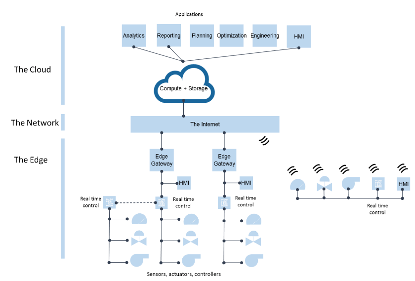

<div style="font-size:.62em;color:#78909c">ภาพ: Paul McLaughlin, Rohan McAdam / Wikimedia Commons — CC BY-SA 4.0 · The Edge คือบอร์ดของเรา · HMI คือจอบทเรียน 3.7–3.9 · เส้นขึ้น cloud คือ MQTT บทเรียน 4.4–4.9</div>

| บทเรียน | สิ่งที่ได้ | วันนี้เอามาใช้ตรงไหน |
|---|---|---|
| 1 | ทัวร์เมนู · `lcd.print()` · แนวคิด "ส่งเฉพาะสิ่งที่มีความหมาย" | ช่อง Show และ Send ของ canvas |
| 2 | `wifi.connect()` · เลข IP ของบอร์ด · กฎว่าลิงก์แบบไหนเรียกว่าใช้ได้ | ช่อง Send — ต้องรู้ว่าสายดีจริงก่อนจะเชื่อว่าส่งถึง |
| 3 | `gpio` · ลูป polling · จังหวะเวลา | โครงลูปหลักของโปรแกรม |
| 4 | `ui.Button/Switch/Label` · `ui.poll()` · กฎเหล็ก 5 ข้อ | ปุ่มรับทราบและหน้าจอสถานะ |
| 5 | `sensors.pot` · `capsense` · `dsp.EMA` | การกรองสัญญาณก่อนตัดสิน |
| 6 | `bmi270.motion()` · `dsp.tilt()` | ค่าตัวอย่างในโครงเริ่มต้น |
| 7 | `ui.Chart` หลาย series · cadence 200 ms | กราฟย้อนหลังบนหน้าจอผลงาน |
| 8 | Panel การ์ด · งบ 32 widget (เพดาน 64) · เกณฑ์สองระดับกันป้ายกระพริบ · รันยาว 10 นาที | โครงหน้าจอของผลิตภัณฑ์ และช่อง Decide ที่ป้ายไม่สั่น |
| 9 | `wifi.connect/is_connected/ip/ping` | การตรวจสายก่อนส่ง |
| 10 | `mqtt.connect/publish/subscribe` · topic · JSON | ช่อง Send |
| 11 | `tesaiot.*` · serverTLS 8884 · ตัวตนอุปกรณ์ | ทางยกระดับความปลอดภัยของผลงาน |

> ไม่มีอะไรในตารางนี้ที่ทีมยังไม่เคยรันเอง วันนี้แค่เอามาต่อกัน

---

## ทั้งคอร์สเปิดไปเก้าโมดูล — บัญชีรวมก่อนลงมือทำงานจบ

<style scoped>
section table { font-size: .56em; }
section table td, section table th { padding: .12em .45em; }
section p { margin: .05em 0; font-size: .86em; }
section blockquote { font-size: .86em; }
</style>

<!-- ตารางที่แล้วเรียงตาม "บทเรียน" ตารางนี้เรียงตาม "โมดูล" — เพราะตอนออกแบบงานจบ คำถามไม่ใช่ "บทเรียนไหนสอนอะไร" แต่คือ "ของที่มีอยู่ในมือทั้งหมดมีอะไรบ้าง" -->

| โมดูล | มีกี่ชื่อ | เปิดที่บทเรียนไหน | งานจบใช้ตรงช่องไหนของ canvas |
|---|---|---|---|
| `lcd` | **4** — `print` `console` `clear` `theme` (เฟิร์มแวร์ 2026-09-06 ขึ้นไปเพิ่ม `backlight()` เป็นห้า) | บทเรียน 1.1–1.3 | Show — ทางที่ง่ายที่สุดตอนยังไม่มีหน้า HMI |
| `gpio` | **18** — ระดับโมดูล 7 · เมธอดของ `LED` 8 · ของ `Button` 3 | บทเรียน 2.1–2.3 | **Act** — ทางเดียวในคอร์สนี้ที่สั่งของจริงให้ขยับ |
| `ui` | **132** ชื่อบนโมดูล (นับบน Eva Kit ในบทเรียน 2.4) · บวกเมธอดของ `Widget` อีก **38** — สิบสี่ตัวที่บทเรียน 3.4–3.6 กางไว้คือส่วนที่กราฟกับการจัดหน้าใช้ | บทเรียน 2.4–2.6 · 7 · 8 | Show — และเป็นทางที่คนสั่งงานเข้ามาด้วย |
| `sensors` | **10** ชื่อระดับโมดูล (Eva: ห้าตอบ ห้าปฏิเสธ · Dev Kit: `init()` `scan()` ทำงานได้ แต่กติกาของคอร์สคือไม่ต้องเรียก) · บวกกลุ่มเซนเซอร์ที่บอร์ดมี — Eva สี่กลุ่ม (`bmi270` `bmm350` `capsense` `pot`) · Dev Kit เพิ่ม `sht40` `dps368` เรดาร์ | บทเรียน 2.7–2.9 · 6 · 8 | **Sense** |
| `dsp` | **16** — 8 คลาส 8 ฟังก์ชัน (สเปกตรัมสองตัวเพิ่ม 2026-08-20) | บทเรียน 2.7–2.9 · 6 · 7 | ระหว่าง Sense กับ Decide — กรองก่อนตัดสิน |
| `mic` | **8** — โมดูล Python ที่ฝังมากับเฟิร์มแวร์ | บทเรียน 3.7–3.9 | Sense ทางเลือก สำหรับโจทย์ที่วัดด้วยเสียง |
| `wifi` | **8** | บทเรียน 4.1–4.3 | ตรวจสายให้แน่ก่อนจะเชื่อว่าส่งถึง |
| `mqtt` | **6** | บทเรียน 4.4–4.6 | **Send** |
| `tesaiot` | **28** — ใช้ได้จริง 9 ทั้งสองบอร์ด · สิบหกตัวข้ามคอร์ไปหาชิปที่ไม่ได้เปิด (ได้ `OSError` · เวลาที่เสียยังไม่ได้วัด) · `protected_update()` ห้ามเรียก (บน Dev Kit เขียนลงชิปจริง) | บทเรียน 4.7–4.9 | Send แบบยกระดับ ผ่านพอร์ต 8884 |

**อย่านับซ้ำ** — "ตระกูล IMU สิบสี่ชื่อ" ของบทเรียน 3.1–3.3 ไม่ใช่โมดูลที่สิบ มันคือ `sensors.bmi270` ห้า + `sensors.bmm350` ห้า + `dsp` อีกสี่ ที่ซ้อนอยู่ในตารางแล้ว

**ของที่คอร์สนี้ไม่เคยมีให้** — ไม่มี `machine.PWM` `.ADC` `.SPI` `.Timer` · `dsp` มี `fft_mag` (ตั้งแต่ 2026-08-20) แต่ไม่มี `ulab` · **Eva Kit ไม่มี DPS368 SHT40 เรดาร์** ส่วน **Dev Kit มีทั้งสาม** (`sensors.sht40` อุณหภูมิ/ความชื้น · `sensors.dps368` ความกดอากาศ · `sensors.radar()`) แต่คอร์สไม่ได้เปิดสอน — ทีมบน Dev Kit ใช้ได้ถ้าอ่านซอร์สเอง และต้องมีแผนสำรองบน Eva เสมอ · `optiga` เป็นการสาธิตท้ายบทเรียน 4.7–4.9 ไม่อยู่ในเกณฑ์ อย่าวางแผนงานจบทับมัน

> ถ้าโจทย์ที่ทีมเลือกต้องการชื่อที่ไม่มีในตารางนี้ ให้รู้ตั้งแต่วันนี้ ไม่ใช่รู้ตอนเหลือเวลาชั่วโมงเดียว — ทางออกคือหา **ตัวแทนที่ประกาศตัวว่าเป็นตัวแทน** ตามสไลด์ "เมื่อบอร์ดวัดสิ่งที่เราอยากรู้ไม่ได้"

---

## เริ่มจากปัญหา ไม่ใช่จากรายการเซนเซอร์

<svg viewBox="0 0 940 240" xmlns="http://www.w3.org/2000/svg">
  <defs><marker id="p1" markerWidth="10" markerHeight="8" refX="9" refY="4" orient="auto">
    <path d="M0,0 L10,4 L0,8 z" fill="#2e7d32"/></marker></defs>
  <rect x="14" y="16" width="430" height="88" rx="9" fill="#fdf1f1" stroke="#c62828" stroke-width="2"/>
  <text x="34" y="46" font-size="19" font-weight="700" fill="#c62828">เดินย้อนศร — จบไม่สวย</text>
  <text x="34" y="76" font-size="19" fill="#8d3b3b">"บอร์ดมี IMU กับเข็มทิศ</text>
  <text x="34" y="98" font-size="19" fill="#8d3b3b">เราจะทำอะไรกับมันดี"</text>
  <rect x="14" y="120" width="430" height="104" rx="9" fill="#eceff1" stroke="#607d8b" stroke-width="2"/>
  <text x="34" y="150" font-size="19" font-weight="700" fill="#455a64">ผลที่ได้</text>
  <text x="34" y="180" font-size="18" fill="#37474f">ของสวยที่ไม่มีใครอยากได้</text>
  <text x="34" y="208" font-size="18" fill="#37474f">เล่าให้คนนอกฟังแล้วเขาถามว่า "แล้วไง"</text>
  <rect x="480" y="16" width="446" height="60" rx="9" fill="#e3f2fd" stroke="#1565c0" stroke-width="2"/>
  <text x="500" y="42" font-size="19" font-weight="700" fill="#1565c0">1 · ใครเสียอะไรอยู่ทุกวัน</text>
  <text x="500" y="66" font-size="18" fill="#0d47a1">เวลา เงิน ความปลอดภัย ความมั่นใจ</text>
  <rect x="480" y="92" width="446" height="60" rx="9" fill="#e8f5e9" stroke="#2e7d32" stroke-width="2"/>
  <text x="500" y="118" font-size="19" font-weight="700" fill="#2e7d32">2 · ตอนนี้เขารู้ได้ยังไงว่ามีปัญหา</text>
  <text x="500" y="142" font-size="18" fill="#1b5e20">เดินไปดูเอง รอลูกค้าโทรบ่น หรือรู้ตอนพังแล้ว</text>
  <rect x="480" y="168" width="446" height="60" rx="9" fill="#fff8e1" stroke="#f9a825" stroke-width="2">
    <animate attributeName="stroke-width" values="2;5;2" dur="2.6s" repeatCount="indefinite"/></rect>
  <text x="500" y="194" font-size="19" font-weight="700" fill="#f57f17">3 · ถ้ารู้เร็วขึ้น 30 นาที เปลี่ยนอะไรได้</text>
  <text x="500" y="218" font-size="18" fill="#8d6e00">ตอบไม่ได้ = โจทย์นี้ยังไม่คุ้มที่จะทำ</text>
  <line x1="452" y1="46" x2="474" y2="46" stroke="#2e7d32" stroke-width="3" marker-end="url(#p1)"/>
  <line x1="452" y1="122" x2="474" y2="122" stroke="#2e7d32" stroke-width="3" marker-end="url(#p1)"/>
  <line x1="452" y1="198" x2="474" y2="198" stroke="#2e7d32" stroke-width="3" marker-end="url(#p1)"/>
</svg>

วิธีที่คนส่วนใหญ่เริ่ม แล้วจบไม่สวย: "บอร์ดมี IMU กับเข็มทิศ เราจะทำอะไรกับมันดี"

วิธีที่ได้ของที่มีคนใช้: เริ่มจากสามคำถามนี้ตามลำดับ

1. **ใครเสียอะไรอยู่ทุกวัน** — เวลา เงิน ความปลอดภัย หรือความมั่นใจ
2. **ตอนนี้เขารู้ได้ยังไงว่ามีปัญหา** — เดินไปดูเอง รอให้ลูกค้าโทรมาบ่น หรือรู้ตอนของพังไปแล้ว
3. **ถ้ารู้เร็วขึ้นสามสิบนาที จะเปลี่ยนอะไรได้บ้าง** — ถ้าตอบไม่ได้ แปลว่าโจทย์นี้ยังไม่คุ้มที่จะทำ

พอตอบครบสามข้อ ค่อยถามว่า "บอร์ดของเราวัดอะไรที่พอจะบอกเรื่องนั้นได้บ้าง"

ทีมที่เดินลำดับนี้จะได้โจทย์ที่เล่าให้คนนอกฟังได้ใน 30 วินาที ทีมที่เดินย้อนกลับมักจบด้วยของสวยที่ไม่มีใครอยากได้

> โจทย์ที่ดีเล่าจบก่อนที่คนฟังจะทันถามว่า "แล้วไง"

---

## เริ่มจากปัญหา ไม่ใช่จากรายการเซนเซอร์ (ต่อ) — โจทย์ของจริงสองแบบ

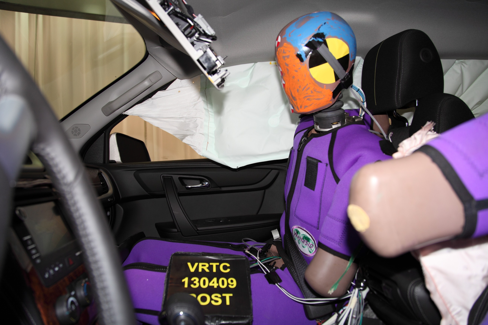 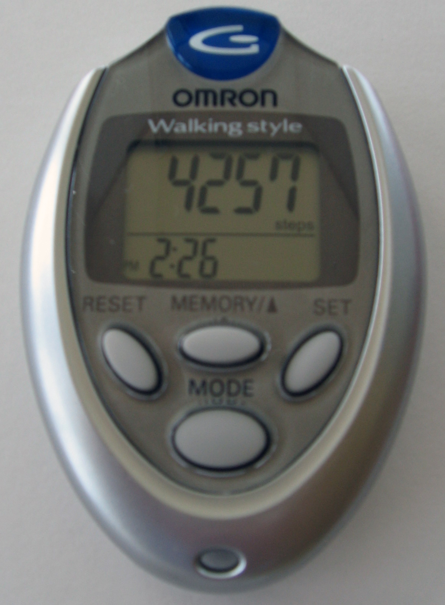

<div style="font-size:.58em;color:#78909c;margin-top:-.3em">ซ้าย — ภาพ: NHTSA / Wikimedia Commons — สาธารณสมบัติ · ขวา — ภาพ: Arthbkins / Wikimedia Commons — สาธารณสมบัติ · ซ้ายคือถุงลมที่กางจริงในการทดสอบชน โจทย์ที่บังคับเวลาตัดสินใจไว้ที่หลักมิลลิวินาทีและทำผิดแล้วแก้ไม่ได้ · ขวาคือเครื่องนับก้าวที่วางขายจริง โจทย์เดียว จบในกล่องเดียว ไม่มีเมนู ไม่มีการตั้งค่า — ใช้สองภาพนี้ถามทีมว่าโจทย์ของตัวเองเข้มงวดแค่ไหน และเสร็จแล้วหน้าตาควรเป็นอย่างไร</div>

---

## AIoT design canvas — ห้าช่องที่ต้องเติมให้ครบก่อนเขียนโค้ด

<svg viewBox="0 0 950 268" xmlns="http://www.w3.org/2000/svg">
  <defs><marker id="c1" markerWidth="10" markerHeight="8" refX="9" refY="4" orient="auto">
    <path d="M0,0 L10,4 L0,8 z" fill="#37474f"/></marker></defs>
  <text x="475" y="32" text-anchor="middle" font-size="19" font-weight="700" fill="#37474f">เติมจากขวาไปซ้ายก็ได้ — เริ่มที่ Act แล้วถอยกลับ มักได้ระบบที่เล็กลงและตรงกว่า</text>
  <rect x="5" y="50" width="168" height="152" rx="10" fill="#e3f2fd" stroke="#1565c0" stroke-width="2"/>
  <text x="89" y="82" text-anchor="middle" font-size="21" font-weight="700" fill="#1565c0">Sense</text>
  <text x="89" y="114" text-anchor="middle" font-size="17" fill="#0d47a1">วัดอะไร</text>
  <text x="89" y="140" text-anchor="middle" font-size="17" fill="#0d47a1">ด้วยอะไร</text>
  <text x="89" y="166" text-anchor="middle" font-size="17" fill="#0d47a1">ถี่แค่ไหน</text>
  <text x="89" y="192" text-anchor="middle" font-size="17" fill="#5472a3">กรองยังไง</text>
  <rect x="193" y="50" width="168" height="152" rx="10" fill="#e8f5e9" stroke="#2e7d32" stroke-width="2"/>
  <text x="277" y="82" text-anchor="middle" font-size="21" font-weight="700" fill="#2e7d32">Decide</text>
  <text x="277" y="114" text-anchor="middle" font-size="17" fill="#1b5e20">เกณฑ์อะไร</text>
  <text x="277" y="140" text-anchor="middle" font-size="17" fill="#1b5e20">ตัดสินบนบอร์ด</text>
  <text x="277" y="166" text-anchor="middle" font-size="17" fill="#1b5e20">ยืนยันกี่รอบ</text>
  <text x="277" y="192" text-anchor="middle" font-size="17" fill="#4a7c4e">ก่อนจึงเชื่อ</text>
  <rect x="381" y="50" width="168" height="152" rx="10" fill="#fff3e0" stroke="#ef6c00" stroke-width="2"/>
  <text x="465" y="82" text-anchor="middle" font-size="21" font-weight="700" fill="#ef6c00">Show</text>
  <text x="465" y="114" text-anchor="middle" font-size="17" fill="#e65100">เห็นอะไรบนจอ</text>
  <text x="465" y="140" text-anchor="middle" font-size="17" fill="#e65100">รู้ใน 2 วินาที</text>
  <text x="465" y="166" text-anchor="middle" font-size="17" fill="#e65100">สถานะเน็ต</text>
  <text x="465" y="192" text-anchor="middle" font-size="17" fill="#a1683a">ปุ่มรับทราบ</text>
  <rect x="569" y="50" width="168" height="152" rx="10" fill="#f3e5f5" stroke="#6a1b9a" stroke-width="2"/>
  <text x="653" y="82" text-anchor="middle" font-size="21" font-weight="700" fill="#6a1b9a">Send</text>
  <text x="653" y="114" text-anchor="middle" font-size="17" fill="#4a148c">ส่งอะไร ไปไหน</text>
  <text x="653" y="140" text-anchor="middle" font-size="17" fill="#4a148c">ถี่แค่ไหน</text>
  <text x="653" y="166" text-anchor="middle" font-size="17" fill="#4a148c">schema อะไร</text>
  <text x="653" y="192" text-anchor="middle" font-size="17" fill="#7e5a94">ส่ง event</text>
  <rect x="757" y="50" width="188" height="152" rx="10" fill="#eceff1" stroke="#455a64" stroke-width="2"/>
  <text x="851" y="82" text-anchor="middle" font-size="21" font-weight="700" fill="#455a64">Act</text>
  <text x="851" y="114" text-anchor="middle" font-size="17" fill="#37474f">ใครทำอะไรต่อ</text>
  <text x="851" y="140" text-anchor="middle" font-size="17" fill="#37474f">ภายในกี่นาที</text>
  <text x="851" y="166" text-anchor="middle" font-size="17" fill="#37474f">ถ้าไม่มีใครทำ</text>
  <text x="851" y="192" text-anchor="middle" font-size="17" fill="#78909c">ก็ไม่ต้องส่ง</text>
  <line x1="176" y1="126" x2="188" y2="126" stroke="#37474f" stroke-width="3" marker-end="url(#c1)"/>
  <line x1="364" y1="126" x2="376" y2="126" stroke="#37474f" stroke-width="3" marker-end="url(#c1)"/>
  <line x1="552" y1="126" x2="564" y2="126" stroke="#37474f" stroke-width="3" marker-end="url(#c1)"/>
  <line x1="740" y1="126" x2="752" y2="126" stroke="#37474f" stroke-width="3" marker-end="url(#c1)"/>
  <circle r="7" fill="#c62828" cx="182" cy="126"><animateMotion path="M0,0 L95,0 L283,0 L471,0 L669,0" dur="4.4s" repeatCount="indefinite"/></circle>
  <text x="475" y="240" text-anchor="middle" font-size="18" fill="#455a64">ช่องไหนเติมไม่ได้ แปลว่ายังไม่รู้จักโจทย์ดีพอ ไม่ใช่ยังเขียนโค้ดไม่เป็น</text>
</svg>

> canvas นี้อยู่ในบันทึกการเรียน กรอกให้ครบก่อนแตะคีย์บอร์ด

---

## canvas ที่กรอกแล้วหน้าตาเป็นแบบนี้

<svg viewBox="0 0 940 232" xmlns="http://www.w3.org/2000/svg">
  <text x="20" y="34" font-size="20" font-weight="700" fill="#37474f">โจทย์ตัวอย่าง · นั่งร้านชั้นสามเอียงผิดปกติแล้วไม่มีใครรู้จนเช้า</text>
  <rect x="20" y="52" width="240" height="150" rx="9" fill="#eceff1" stroke="#607d8b" stroke-width="2"/>
  <text x="140" y="80" text-anchor="middle" font-size="18" fill="#455a64">ท่าตั้งต้นตอนติดตั้ง</text>
  <line x1="50" y1="170" x2="230" y2="170" stroke="#90a4ae" stroke-width="3"/>
  <line x1="70" y1="170" x2="98" y2="100" stroke="#90a4ae" stroke-width="7" stroke-dasharray="7 5"/>
  <line x1="70" y1="170" x2="98" y2="100" stroke="#2e7d32" stroke-width="7">
    <animate attributeName="x2" values="98;98;122;140;98" dur="4s" repeatCount="indefinite"/>
    <animate attributeName="y2" values="100;100;108;118;100" dur="4s" repeatCount="indefinite"/>
    <animate attributeName="stroke" values="#2e7d32;#2e7d32;#f9a825;#c62828;#2e7d32" dur="4s" repeatCount="indefinite"/></line>
  <text x="140" y="194" text-anchor="middle" font-size="18" fill="#455a64">เอียงขึ้นเรื่อย ๆ</text>
  <rect x="276" y="52" width="200" height="46" rx="8" fill="#e3f2fd" stroke="#1565c0" stroke-width="2"/>
  <text x="292" y="80" font-size="19" font-weight="700" fill="#1565c0">Sense · ทุก 200 ms</text>
  <rect x="276" y="104" width="200" height="46" rx="8" fill="#e8f5e9" stroke="#2e7d32" stroke-width="2"/>
  <text x="292" y="132" font-size="19" font-weight="700" fill="#2e7d32">Decide · 8 / 15 องศา</text>
  <rect x="276" y="156" width="200" height="46" rx="8" fill="#fff3e0" stroke="#ef6c00" stroke-width="2"/>
  <text x="292" y="184" font-size="19" font-weight="700" fill="#ef6c00">Show · สามระดับ</text>
  <rect x="492" y="52" width="200" height="46" rx="8" fill="#f3e5f5" stroke="#6a1b9a" stroke-width="2"/>
  <text x="508" y="80" font-size="19" font-weight="700" fill="#6a1b9a">Send · JSON 6 ฟิลด์</text>
  <rect x="492" y="104" width="200" height="98" rx="8" fill="#eceff1" stroke="#455a64" stroke-width="2"/>
  <text x="508" y="132" font-size="19" font-weight="700" fill="#455a64">Act</text>
  <text x="508" y="158" font-size="18" fill="#37474f">หัวหน้าไซต์เดินไปดู</text>
  <text x="508" y="184" font-size="18" fill="#37474f">ภายใน 15 นาที</text>
  <rect x="708" y="52" width="218" height="150" rx="9" fill="#0b1224" stroke="#7aa7d9" stroke-width="2"/>
  <text x="817" y="80" text-anchor="middle" font-size="18" fill="#78909c">จอที่หน้างานเห็น</text>
  <text x="817" y="122" text-anchor="middle" font-size="30" font-weight="700" fill="#eef2fb">17.4</text>
  <text x="742" y="156" text-anchor="middle" font-size="19" font-weight="700" fill="#00E676">OK
    <animate attributeName="fill" values="#00E676;#00E676;#2b3b52;#2b3b52;#00E676" dur="4s" repeatCount="indefinite"/></text>
  <text x="812" y="156" text-anchor="middle" font-size="19" font-weight="700" fill="#2b3b52">WARN
    <animate attributeName="fill" values="#2b3b52;#2b3b52;#f9a825;#2b3b52;#2b3b52" dur="4s" repeatCount="indefinite"/></text>
  <text x="888" y="156" text-anchor="middle" font-size="19" font-weight="700" fill="#2b3b52">ALERT
    <animate attributeName="fill" values="#2b3b52;#2b3b52;#2b3b52;#FF5252;#2b3b52" dur="4s" repeatCount="indefinite"/></text>
  <text x="817" y="188" text-anchor="middle" font-size="18" fill="#A0B4CC">net: online</text>
</svg>

โจทย์ตัวอย่าง: **นั่งร้านชั้นสามของไซต์ก่อสร้าง เอียงผิดปกติแล้วไม่มีใครรู้จนเช้า**

| ช่อง | คำตอบของทีมตัวอย่าง |
|---|---|
| Sense | `sensors.bmi270.motion()` → `dsp.tilt()` ทุก 200 ms กรองด้วย `dsp.EMA(alpha=0.2)` วัดเทียบท่าตั้งต้นตอนติดตั้ง |
| Decide | เกิน 8° = เฝ้าดู, เกิน 15° = ผิดปกติ ต้องเกินติดกัน 3 รอบจึงเชื่อ ตัดสินบนบอร์ดทั้งหมด |
| Show | ตัวเลของศาตัวใหญ่ + แท่งระดับ + คำว่า OK/WARN/ALERT + สถานะเน็ต + ปุ่มรับทราบ |
| Send | JSON 6 ฟิลด์ ไป `bento/team01/telemetry` — ส่งตอนสถานะเปลี่ยน + heartbeat ทุก 30 วินาที |
| Act | หัวหน้าไซต์ได้แจ้งเตือน เดินไปดูภายใน 15 นาที ถ้าเป็นของจริงต่อเข้าไลน์กลุ่มหรือ SMS |

สังเกตว่าช่อง Act เขียนเป็น "คนทำอะไร ภายในกี่นาที" ไม่ใช่ "ส่งขึ้นคลาวด์" — ถ้าปลายทางไม่มีใครทำอะไร ข้อมูลนั้นไม่ต้องส่งตั้งแต่แรก

> ตัวอย่างนี้คือโจทย์ที่เฉลย [`s12_capstone_starter.py`](https://github.com/tesaiot/tesa-qualification-program/blob/main/courses/aiot-micropython/m05-capstone/l03-build-and-present/solution/s12_capstone_starter.py) ทำจนจบ

---

## หกโจทย์จากหน้างานจริง — เลือกไปใช้ได้เลย

<style scoped>
section { font-size: .90em; }
</style>

<svg viewBox="0 0 940 234" xmlns="http://www.w3.org/2000/svg">
  <rect x="14" y="14" width="296" height="100" rx="9" fill="#e3f2fd" stroke="#1565c0" stroke-width="2"/>
  <text x="34" y="42" font-size="19" font-weight="700" fill="#1565c0">1 · ความสั่นมอเตอร์ปั๊ม</text>
  <polyline points="34,80 54,66 74,88 94,62 114,90 134,68 154,84" fill="none" stroke="#1565c0" stroke-width="3">
    <animate attributeName="points" dur="1.4s" repeatCount="indefinite" values="34,80 54,66 74,88 94,62 114,90 134,68 154,84;34,80 54,88 74,64 94,90 114,62 134,86 154,70;34,80 54,66 74,88 94,62 114,90 134,68 154,84"/></polyline>
  <text x="164" y="80" font-size="17" fill="#0d47a1">ขนาดความเร่งรวม</text>
  <text x="34" y="104" font-size="17" fill="#5472a3">เกินค่าปกติ 2 เท่า ติดกัน 5 รอบ</text>
  <rect x="322" y="14" width="296" height="100" rx="9" fill="#e0f7fa" stroke="#00838f" stroke-width="2"/>
  <text x="342" y="42" font-size="19" font-weight="700" fill="#00838f">2 · ห้องเย็นประตูเปิดค้าง</text>
  <rect x="342" y="52" width="42" height="38" fill="none" stroke="#00838f" stroke-width="3"/>
  <line x1="384" y1="52" x2="412" y2="44" stroke="#00838f" stroke-width="3">
    <animate attributeName="x2" values="388;418;388" dur="2.4s" repeatCount="indefinite"/></line>
  <text x="430" y="64" font-size="14" fill="#00838f">Eva: ใช้ตัวแทน (ประตู)</text>
  <text x="430" y="84" font-size="14" fill="#00838f">Dev Kit: SHT40 อ่านตรง</text>
  <text x="342" y="108" font-size="17" fill="#00838f">ขยับแล้วไม่กลับที่เดิมใน 60 วิ</text>
  <rect x="630" y="14" width="296" height="100" rx="9" fill="#f3e5f5" stroke="#6a1b9a" stroke-width="2"/>
  <text x="650" y="42" font-size="18" font-weight="700" fill="#6a1b9a">3 · การเคลื่อนย้ายทรัพย์สิน</text>
  <circle cx="672" cy="80" r="20" fill="none" stroke="#6a1b9a" stroke-width="3"/>
  <line x1="672" y1="80" x2="672" y2="62" stroke="#6a1b9a" stroke-width="3">
    <animate attributeName="x2" values="672;690;672" dur="2s" repeatCount="indefinite"/>
    <animate attributeName="y2" values="62;90;62" dur="2s" repeatCount="indefinite"/></line>
  <text x="706" y="80" font-size="18" fill="#4a148c">ทิศเปลี่ยนเกิน 30 องศา</text>
  <text x="650" y="106" font-size="17" fill="#7e5a94">บอกว่า "ขยับ" ไม่บอกว่าไปไหน</text>
  <rect x="14" y="124" width="296" height="100" rx="9" fill="#fff8e1" stroke="#f9a825" stroke-width="2"/>
  <text x="34" y="152" font-size="19" font-weight="700" fill="#f57f17">4 · เครื่องจักรเดินเบา</text>
  <line x1="44" y1="178" x2="264" y2="178" stroke="#ffe082" stroke-width="20" stroke-linecap="round"/>
  <line x1="44" y1="178" x2="264" y2="178" stroke="#f57f17" stroke-width="20" stroke-linecap="round" stroke-dasharray="220" stroke-dashoffset="140">
    <animate attributeName="stroke-dashoffset" values="170;60;150;80;170" dur="4s" repeatCount="indefinite"/></line>
  <text x="34" y="214" font-size="18" fill="#8d6e00">สรุปนาที idle ทุก 15 นาที</text>
  <rect x="322" y="124" width="296" height="100" rx="9" fill="#e8f5e9" stroke="#2e7d32" stroke-width="2"/>
  <text x="342" y="152" font-size="19" font-weight="700" fill="#2e7d32">5 · การใช้งานห้องประชุม</text>
  <circle cx="348" cy="182" r="12" fill="#2e7d32"/>
  <circle cx="376" cy="182" r="12" fill="#2e7d32">
    <animate attributeName="r" values="4;12;4" dur="2.4s" repeatCount="indefinite"/></circle>
  <circle cx="404" cy="182" r="12" fill="#2e7d32">
    <animate attributeName="r" values="4;12;4" dur="2.4s" begin="0.8s" repeatCount="indefinite"/></circle>
  <text x="426" y="188" font-size="17" fill="#1b5e20">capsense = เช็กอิน</text>
  <text x="342" y="214" font-size="18" fill="#4a7c4e">ไม่ขยับ 10 นาที = ห้องว่าง</text>
  <rect x="630" y="124" width="296" height="100" rx="9" fill="#ffebee" stroke="#c62828" stroke-width="2"/>
  <text x="650" y="152" font-size="19" font-weight="700" fill="#c62828">6 · การเอียงของนั่งร้าน</text>
  <line x1="654" y1="206" x2="734" y2="206" stroke="#ef9a9a" stroke-width="3"/>
  <line x1="668" y1="206" x2="682" y2="166" stroke="#c62828" stroke-width="6">
    <animate attributeName="x2" values="682;712;682" dur="2.6s" repeatCount="indefinite"/>
    <animate attributeName="y2" values="166;178;166" dur="2.6s" repeatCount="indefinite"/></line>
  <text x="748" y="186" font-size="18" fill="#b71c1c">เกิน 15 องศา</text>
  <text x="748" y="210" font-size="18" fill="#b71c1c">ติดกัน 3 รอบ</text>
</svg>

| โจทย์ | วัดด้วยอะไรบนบอร์ดนี้ | เกณฑ์ที่ใช้ได้จริง | ข้อจำกัดที่ต้องพูดตรง ๆ |
|---|---|---|---|
| 1 · เฝ้าความสั่นมอเตอร์ปั๊ม | `bmi270.motion()` แล้วคิดขนาดความเร่งรวม | ค่าเฉลี่ยเคลื่อนที่สูงกว่าค่าปกติ 2 เท่า ติดกัน 5 รอบ | บอร์ดวัดความสั่นระดับหยาบ ไม่ใช่ระดับ FFT ของเครื่องมือวัดจริง |
| 2 · ห้องเย็นอุณหภูมิหลุดเกณฑ์ | **บน Eva Kit ไม่มีเซนเซอร์อุณหภูมิห้อง** → ใช้ตัวแทน: ประตูถูกเปิดค้าง (การเอียงของบานประตู) · **บน Dev Kit อ่านตรงได้** จาก `sensors.sht40.temperature()` | ประตูขยับแล้วไม่กลับที่เดิมใน 60 วินาที (Eva) · อุณหภูมิเกินเกณฑ์ติดกัน N รอบ (Dev Kit) | ตัวแทนบอกได้แค่ "สาเหตุ" ไม่ได้บอก "อุณหภูมิ" ต้องเขียนไว้ในข้อจำกัด · ทีมที่ใช้ SHT40 ต้องบอกว่างานนี้ย้ายไป Eva ไม่ได้โดยไม่เปลี่ยน Sense |
| 3 · ติดตามการเคลื่อนย้ายทรัพย์สิน | `bmi270.motion()` + `bmm350.heading()` | ทิศเปลี่ยนเกิน 30° หรือมีความเร่งเกินเกณฑ์ = ของถูกยก | จับได้ว่า "ขยับ" แต่บอกไม่ได้ว่า "ไปอยู่ที่ไหน" (ไม่มี GPS) |
| 4 · นับเวลาเครื่องจักรเดินเบา | ความสั่นต่ำกว่าเกณฑ์ต่อเนื่อง = idle | สะสมนาที idle ต่อกะ ส่งสรุปทุก 15 นาที | ต้องปรับเกณฑ์กับเครื่องจริงก่อน ค่าจากการทดลองบนโต๊ะใช้ไม่ได้ตรง ๆ |
| 5 · เฝ้าการใช้งานห้องประชุม | การเคลื่อนไหวจาก IMU + `capsense` เป็นปุ่มเช็กอิน | มีคนแตะเช็กอิน = ใช้งานอยู่, ไม่มีการขยับ 10 นาที = ห้องว่าง | ตัวแทนที่หยาบ ของจริงใช้ PIR หรือกล้องนับคน |
| 6 · เตือนการเอียงของชั้นวาง/นั่งร้าน | `dsp.tilt()` เทียบท่าตั้งต้น | เกิน 15° ติดกัน 3 รอบ | ต้องยึดบอร์ดให้แน่นจริง ไม่งั้นวัดการเอียงของเทปกาว |

> เลือกโจทย์ที่ทีมมีคนเคยเจอปัญหานั้นจริง จะเถียงกันเรื่องเกณฑ์ได้สนุกกว่ามาก

---

## หกโจทย์ (ต่อ) — ตัวแทนของโจทย์ที่ 2 และโจทย์ที่ต้องฟังเสียง

<style scoped>section p { margin: .15em 0; }</style>

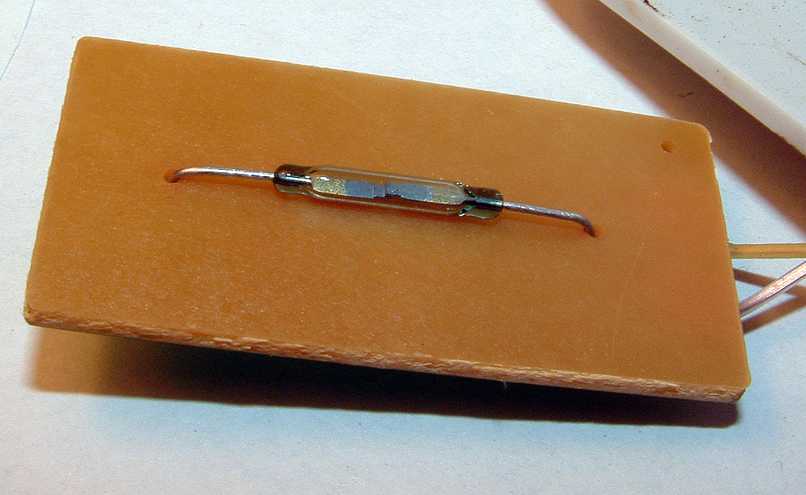 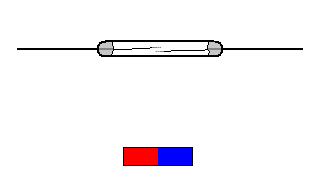

<div style="font-size:.58em;color:#78909c;margin-top:-.3em">ซ้าย — ภาพ: Bidgee / Wikimedia Commons — CC BY 3.0 · ขวา — ภาพ: Stefan Riepl (Quark48) / Wikimedia Commons — สาธารณสมบัติ · ซ้ายคือรีดสวิตช์ตัวจริงในหลอดแก้ว มีแค่แผ่นโลหะสองแผ่น ขวาคือแอนิเมชันของหน้าสัมผัสคู่นั้นตอนแม่เหล็กเข้าใกล้ (ต้นทางระบุเองว่าเป็นภาพอุดมคติ ไม่ใช่ภาพถ่ายจากของจริง) — ตัวแทน "ประตูถูกเปิดค้าง" ของโจทย์ที่ 2 ทำงานแบบนี้ อุปกรณ์ทั้งชิ้นตอบได้แค่ 1 บิต และจังหวะที่มันปิดคือเหตุผลที่สัญญาณเด้งจนต้องกรอง</div>

หมายเหตุเรื่องเสียง: **ไมโครโฟนใช้จาก Python ได้แล้ว** โมดูล `mic` ฝังมากับเฟิร์มแวร์ทั้งสองบอร์ด (`boards/KIT_PSE84_EVAL_EPC2/manifest.py` และ `boards/KIT_PSE84_AI/manifest.py` freeze ไฟล์เดียวกัน) และในอีมูเลเตอร์ — `mic.start()` แล้ว `mic.level()` คืนความดัง 0-100 ส่วน `mic.rms()` กับ `mic.peak()` คืนค่าดิบ 0-32768 · วัดจริงบน Eva Kit 14 ส.ค. 2026 (**ตัวเลขบน Dev Kit ยังไม่ได้วัด**) ห้องเงียบได้ rms 30 (ระดับ 7) เปิดโทนใส่ไมค์ได้ 19335 (ระดับ 92) ต่างกัน 645 เท่า ซึ่งห่างพอจะตั้งเกณฑ์ตัดสินได้จริง · `level()` นับเป็นอ็อกเทฟแบบที่หูได้ยิน ไม่ใช่สัดส่วนตรงของสเกลเต็ม จึงขยับตั้งแต่เสียงพูดปกติ

**โจทย์ที่ต้องฟังเสียงเริ่มได้เลยวันนี้** — เกณฑ์พลังงานจาก `peak()` พอสำหรับโจทย์ระดับชุดบทเรียนนี้แล้ว แล้วครอบด้วยกฎ confirm-N เหมือนค่าจากเซนเซอร์ตัวอื่นทุกประการ

> ตัวแทนที่ตอบได้ 1 บิต ก็ยังต้องผ่านกฎ confirm-N — สัญญาณเด้งของหน้าสัมผัสคือ "ค่าสั่นวูบเดียว" ในอีกหน้าตาหนึ่ง

---

## เข้าใจฮาร์ดแวร์ · เมื่อบอร์ดวัดสิ่งที่เราอยากรู้ไม่ได้

<style scoped>section p { margin: .15em 0; }</style>

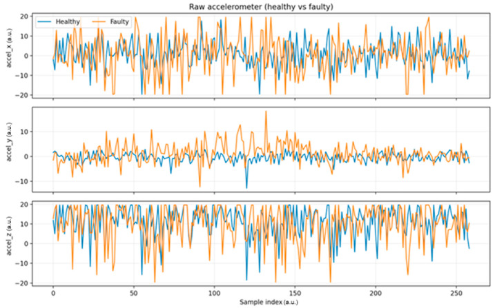 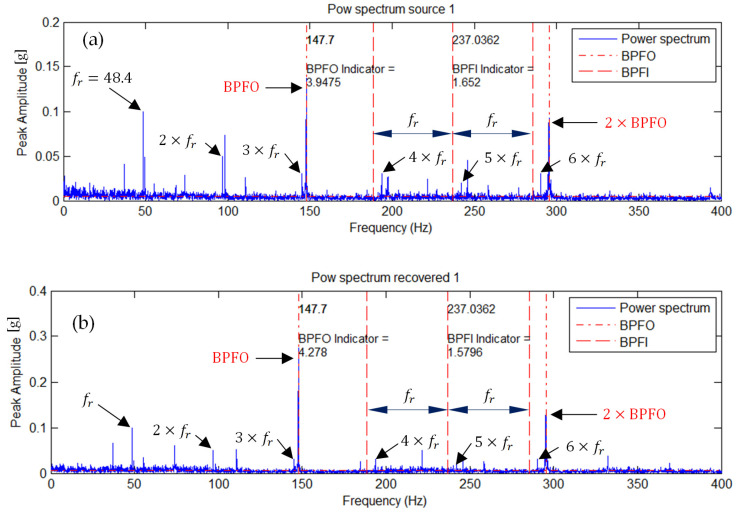

<div style="font-size:.58em;color:#78909c;margin-top:-.3em">ภาพซ้าย: Kolok P. et al., Sensors 25(21):6610 (2025) — CC BY 4.0 · ภาพขวา: Mika D. et al., Sensors 25(23):7371 (2025) — CC BY 4.0 · ซ้าย = สัญญาณดิบของลูกปืนปกติเทียบกับลูกปืนเสีย ซึ่งเป็นระดับที่บอร์ดเราพอจับได้ · ขวา = envelope spectrum ที่ชี้ความถี่ความผิดปกติได้ตรงตัว ซึ่งต้องใช้เครื่องมือวัดจริง ไม่ใช่ `bmi270.motion()` ที่ 5 Hz</div>

Eva Kit มี IMU เข็มทิศ ปุ่มสัมผัส ลูกบิด และจอ — ไม่มีเซนเซอร์อุณหภูมิห้อง ความชื้น ก๊าซ หรือกระแสไฟ · TESAIoT Dev Kit มีชุดเดียวกัน และเพิ่ม SHT40 (อุณหภูมิ/ความชื้น) DPS368 (ความกดอากาศ) กับเรดาร์ — แต่ก็ยังไม่มีก๊าซ ไม่มีกระแสไฟ เรื่อง proxy จึงเป็นเรื่องของทั้งสองบอร์ด ต่างกันแค่ว่าอะไรบ้างที่ต้องใช้ตัวแทน

`sensors.bmi270.temperature()` มีชื่ออยู่ในโมดูลก็จริง แต่บน Eva Kit มัน **โยน `OSError` ทุกครั้ง** เพราะค่านี้ไม่ได้อยู่ใน snapshot ของคอร์จอ และถึงอ่านได้ (บน Dev Kit อ่านได้) มันคืออุณหภูมิของชิป IMU ซึ่งอุ่นตามการทำงานของบอร์ด ไม่ใช่ของห้อง — อุณหภูมิห้องบน Dev Kit ต้องมาจาก `sensors.sht40`

ทางออกที่วิศวกรใช้จริงคือ **proxy** — วัดสิ่งที่วัดได้ ซึ่งสัมพันธ์กับสิ่งที่อยากรู้: ห้องเย็นอุ่นขึ้นไหม → ประตูเปิดค้างหรือเปล่า · เครื่องทำงานอยู่ไหม → ความสั่นของโครง · มีคนอยู่ในห้องไหม → การเคลื่อนไหวกับการแตะปุ่ม

กติกาข้อเดียวของการใช้ proxy: **บอกให้ชัดว่ามันคือตัวแทน** ทั้งบนสไลด์นำเสนอและในชื่อฟิลด์ของ schema — ตั้งชื่อ `door_open_s` ไม่ใช่ `temp_c`

> proxy ที่ประกาศตัวว่าเป็น proxy คืองานวิศวกรรม · proxy ที่แอบอ้างเป็นของจริงคือการหลอกลูกค้า

---

## ส่งอะไรขึ้นไป — schema ที่อยู่ได้นาน

<style scoped>section table { font-size: .66em; }</style>

<svg viewBox="0 0 940 248" style="max-height:150px" xmlns="http://www.w3.org/2000/svg">
  <rect x="14" y="10" width="912" height="70" rx="8" fill="#0d1117" stroke="#30363d" stroke-width="2"/>
  <text x="30" y="40" font-size="18" font-family="monospace" fill="#a5d6ff">{"id": "team01", "v": 17.4, "unit": "deg",</text>
  <text x="30" y="66" font-size="18" font-family="monospace" fill="#a5d6ff"> "state": "ALERT", "kind": "event", "t": 812340}</text>
  <rect x="14" y="112" width="176" height="120" rx="8" fill="#e3f2fd" stroke="#1565c0" stroke-width="2"/>
  <text x="102" y="140" text-anchor="middle" font-size="19" font-weight="700" fill="#1565c0">id</text>
  <text x="102" y="168" text-anchor="middle" font-size="17" fill="#0d47a1">มาจากบอร์ดไหน</text>
  <text x="102" y="194" text-anchor="middle" font-size="17" fill="#0d47a1">บน broker สาธารณะ</text>
  <text x="102" y="220" text-anchor="middle" font-size="17" fill="#5472a3">ยิ่งจำเป็น</text>
  <rect x="198" y="112" width="176" height="120" rx="8" fill="#e8f5e9" stroke="#2e7d32" stroke-width="2"/>
  <text x="286" y="140" text-anchor="middle" font-size="19" font-weight="700" fill="#2e7d32">v + unit</text>
  <text x="286" y="168" text-anchor="middle" font-size="17" fill="#1b5e20">ค่าที่ตัดสินแล้ว</text>
  <text x="286" y="194" text-anchor="middle" font-size="17" fill="#1b5e20">ไม่ใช่ค่าดิบ</text>
  <text x="286" y="220" text-anchor="middle" font-size="17" fill="#4a7c4e">หน่วยกันตีความผิด</text>
  <rect x="382" y="112" width="176" height="120" rx="8" fill="#fff3e0" stroke="#ef6c00" stroke-width="2"/>
  <text x="470" y="140" text-anchor="middle" font-size="19" font-weight="700" fill="#ef6c00">state</text>
  <text x="470" y="168" text-anchor="middle" font-size="17" fill="#e65100">คำตัดสินของบอร์ด</text>
  <text x="470" y="194" text-anchor="middle" font-size="17" fill="#e65100">ปลายทางไม่คิดซ้ำ</text>
  <text x="470" y="220" text-anchor="middle" font-size="17" fill="#a1683a">จะได้ไม่ขัดกัน</text>
  <rect x="566" y="112" width="176" height="120" rx="8" fill="#f3e5f5" stroke="#6a1b9a" stroke-width="2"/>
  <text x="654" y="140" text-anchor="middle" font-size="19" font-weight="700" fill="#6a1b9a">kind</text>
  <text x="654" y="168" text-anchor="middle" font-size="17" fill="#4a148c">event · heartbeat</text>
  <text x="654" y="194" text-anchor="middle" font-size="17" fill="#4a148c">ack · back</text>
  <text x="654" y="220" text-anchor="middle" font-size="17" fill="#7e5a94">คนละการกระทำ</text>
  <rect x="750" y="112" width="176" height="120" rx="8" fill="#eceff1" stroke="#455a64" stroke-width="2"/>
  <text x="838" y="140" text-anchor="middle" font-size="19" font-weight="700" fill="#455a64">t</text>
  <text x="838" y="168" text-anchor="middle" font-size="17" fill="#37474f">เวลาบนบอร์ด</text>
  <text x="838" y="194" text-anchor="middle" font-size="17" fill="#37474f">ใช้เรียงลำดับ</text>
  <text x="838" y="220" text-anchor="middle" font-size="17" fill="#78909c">ดูว่ามาช้าไหม</text>
  <line x1="102" y1="84" x2="102" y2="108" stroke="#1565c0" stroke-width="2"/>
  <line x1="286" y1="84" x2="286" y2="108" stroke="#2e7d32" stroke-width="2"/>
  <line x1="470" y1="84" x2="470" y2="108" stroke="#ef6c00" stroke-width="2"/>
  <line x1="654" y1="84" x2="654" y2="108" stroke="#6a1b9a" stroke-width="2"/>
  <line x1="838" y1="84" x2="838" y2="108" stroke="#455a64" stroke-width="2"/>
  <circle r="6" fill="#00E676" cx="102" cy="96"><animateMotion path="M0,0 L184,0 L368,0 L552,0 L736,0" dur="3.4s" repeatCount="indefinite"/></circle>
</svg>

payload ของเราในโครงเริ่มต้นหน้าตาแบบนี้

```json
{"id": "team01", "v": 17.4, "unit": "deg", "state": "ALERT", "kind": "event", "t": 812340}
```

หกฟิลด์ และทุกฟิลด์มีเหตุผล

| ฟิลด์ | ทำไมต้องมี |
|---|---|
| `id` | ปลายทางต้องแยกออกว่าข้อความนี้มาจากบอร์ดตัวไหน — บน broker สาธารณะยิ่งจำเป็น |
| `v` | ค่าที่ตัดสินใจแล้ว ไม่ใช่ค่าดิบสามแกน ปัดทศนิยมให้พอใช้ ไม่ต้องส่ง 6 ตำแหน่ง |
| `unit` | ตัวเลขที่ไม่มีหน่วยคือตัวเลขที่ตีความผิดได้ ยานอวกาศเคยตกเพราะเรื่องนี้ |
| `state` | คำตัดสินของบอร์ด ปลายทางไม่ต้องมาคำนวณซ้ำและได้คำตอบไม่ตรงกัน |
| `kind` | บอกว่านี่คือ event, heartbeat หรือการรับทราบ — คนละความหมาย คนละการกระทำ |
| `t` | เวลาบนบอร์ด ใช้เรียงลำดับและดูว่าข้อความมาช้าไปแค่ไหน |

**กติกาที่ทำให้ schema อยู่ได้นาน:** ชื่อฟิลด์คงที่ตลอดโครงการ · เพิ่มฟิลด์ใหม่ได้ แต่ห้ามเปลี่ยนความหมายของฟิลด์เดิม · payload ขาออกกระชับ ต่ำกว่า 1000 ไบต์เสมอ

> ฝั่งรับเขียนโค้ดแกะข้อมูลครั้งเดียว ถ้าเราเปลี่ยนชื่อฟิลด์ทีหลัง เขาต้องแก้ทั้งระบบ

---

## ส่งเหตุการณ์ ไม่ใช่สตรีมดิบ

<style scoped>
section { font-size: .90em; }
</style>

<svg viewBox="0 0 940 232" xmlns="http://www.w3.org/2000/svg">
  <rect x="14" y="14" width="912" height="96" rx="9" fill="#fdf1f1" stroke="#c62828" stroke-width="2"/>
  <text x="34" y="44" font-size="19" font-weight="700" fill="#c62828">ส่งทุกค่า ทุก 200 ms</text>
  <line x1="34" y1="80" x2="470" y2="80" stroke="#ef9a9a" stroke-width="2"/>
  <circle cx="46" cy="80" r="5" fill="#c62828"/>
  <circle cx="64" cy="80" r="5" fill="#c62828"/>
  <circle cx="82" cy="80" r="5" fill="#c62828"/>
  <circle cx="100" cy="80" r="5" fill="#c62828"/>
  <circle cx="118" cy="80" r="5" fill="#c62828"/>
  <circle cx="136" cy="80" r="5" fill="#c62828"/>
  <circle cx="154" cy="80" r="5" fill="#c62828"/>
  <circle cx="172" cy="80" r="5" fill="#c62828"/>
  <circle cx="190" cy="80" r="5" fill="#c62828"/>
  <circle cx="208" cy="80" r="5" fill="#c62828"/>
  <circle cx="226" cy="80" r="5" fill="#c62828"/>
  <circle cx="244" cy="80" r="5" fill="#c62828"/>
  <circle cx="262" cy="80" r="5" fill="#c62828"/>
  <circle cx="280" cy="80" r="5" fill="#c62828"/>
  <circle cx="298" cy="80" r="5" fill="#c62828"/>
  <circle cx="316" cy="80" r="5" fill="#c62828"/>
  <circle cx="334" cy="80" r="5" fill="#c62828"/>
  <circle cx="352" cy="80" r="5" fill="#c62828"/>
  <circle cx="370" cy="80" r="5" fill="#c62828"/>
  <circle cx="388" cy="80" r="5" fill="#c62828"/>
  <circle cx="406" cy="80" r="5" fill="#c62828"/>
  <circle cx="424" cy="80" r="5" fill="#c62828"/>
  <circle cx="442" cy="80" r="5" fill="#c62828"/>
  <circle cx="460" cy="80" r="5" fill="#c62828"/>
  <rect x="34" y="66" width="26" height="28" rx="4" fill="#c62828" opacity="0.25">
    <animate attributeName="x" values="34;444;34" dur="3s" repeatCount="indefinite"/></rect>
  <text x="500" y="72" font-size="20" font-weight="700" fill="#b71c1c">432,000 ข้อความต่อวัน</text>
  <text x="500" y="98" font-size="18" fill="#8d3b3b">39 MB ต่อบอร์ด · 100 บอร์ด = 3.9 GB ต่อวัน</text>
  <rect x="14" y="122" width="912" height="96" rx="9" fill="#f1f8f2" stroke="#2e7d32" stroke-width="2"/>
  <text x="34" y="152" font-size="19" font-weight="700" fill="#2e7d32">ส่งตอนสถานะเปลี่ยน + heartbeat ทุก 30 วินาที</text>
  <line x1="34" y1="188" x2="470" y2="188" stroke="#a5d6a7" stroke-width="2"/>
  <circle cx="46" cy="188" r="6" fill="#2e7d32"/>
  <circle cx="152" cy="188" r="6" fill="#2e7d32"/>
  <circle cx="364" cy="188" r="6" fill="#2e7d32"/>
  <circle cx="458" cy="188" r="6" fill="#2e7d32"/>
  <circle cx="258" cy="188" r="10" fill="#c62828">
    <animate attributeName="r" values="7;14;7" dur="1.8s" repeatCount="indefinite"/></circle>
  <text x="258" y="214" text-anchor="middle" font-size="18" fill="#c62828">event จริง</text>
  <text x="500" y="180" font-size="20" font-weight="700" fill="#1b5e20">2,883 ข้อความต่อวัน</text>
  <text x="500" y="206" font-size="18" fill="#4a7c4e">ลดลงร้อยกว่าเท่า ปลายทางอ่านง่ายกว่าเดิม</text>
</svg>

บทเรียน 1.1–1.3 เราพูดไว้ว่าหัวใจของ AIoT คือ **ตัดสินใจใกล้จุดเกิดเหตุ แล้วส่งขึ้นไปเฉพาะสิ่งที่มีความหมาย** วันนี้ถึงเวลาทำจริง

ลองคิดเลขให้เห็นภาพ อ่านค่าทุก 200 ms แล้วส่งทุกค่า

- 5 ครั้งต่อวินาที × 86,400 วินาที = **432,000 ข้อความต่อวัน ต่อหนึ่งบอร์ด**
- ข้อความละ ~90 ไบต์ = ราว 39 MB ต่อวัน ต่อบอร์ด · มี 100 บอร์ดคือ 3.9 GB ต่อวัน
- ในจำนวนนั้น เหตุการณ์ที่มีคนต้องทำอะไรจริง ๆ อาจมีวันละ 3 ครั้ง

แบบส่งเหตุการณ์: ส่งตอนสถานะเปลี่ยน + heartbeat ทุก 30 วินาที = **2,883 ข้อความต่อวัน** ลดลงร้อยกว่าเท่า และปลายทางอ่านง่ายกว่าเดิม

ทำไมยังต้องมี heartbeat: ถ้าเงียบอย่างเดียว ปลายทางแยกไม่ออกระหว่าง "ทุกอย่างปกติ" กับ "บอร์ดตายไปแล้วเมื่อวาน"

**ดูเพิ่ม (6 นาที):** *MQTT Essentials Part 6 — MQTT Topic Best Practices* — HiveMQ — 5:50 — การออกแบบลำดับชั้น topic และ wildcard `+` `#` ที่ฝั่งรับใช้ query

<iframe width="240" height="135" src="https://www.youtube.com/embed/juq_l70Vg1w" title="MQTT Essentials Part 6: MQTT Topic Best Practices" loading="lazy" frameborder="0" allowfullscreen></iframe>

> ความเงียบไม่ใช่ข่าวดี จนกว่าเราจะออกแบบให้ความเงียบมีความหมาย

---

## เกร็ด: MQTT เกิดมาเพื่อสัญญาณที่แย่

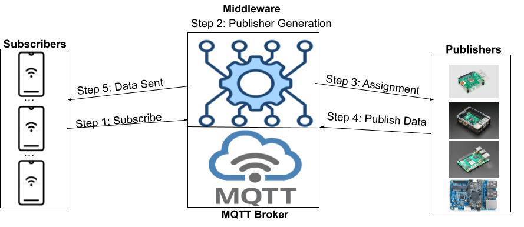

<div style="font-size:.62em;color:#78909c">ภาพ: Chine3me / Wikimedia Commons — CC0 1.0 · ผู้ส่งกับผู้รับไม่เคยรู้จักกัน broker เป็นคนกลาง — โครงสร้างนี้เองที่ทำให้อุปกรณ์หลุดแล้วระบบไม่ล้มทั้งเส้น</div>

**ดูเพิ่ม (5 นาที):** *MQTT Essentials Part 10 — Last Will and Testament* — HiveMQ — 5:27 — broker ประกาศแทนเราเมื่อเราหายไปแบบไม่บอกกล่าว ซึ่งคือกลไกที่ตอบคำถาม "บอร์ดเงียบไป แปลว่าปกติหรือตาย"

<iframe width="240" height="135" src="https://www.youtube.com/embed/dNy9GEXngoE" title="MQTT Essentials Part 10: Last Will and Testament" loading="lazy" frameborder="0" allowfullscreen></iframe>

MQTT ถูกออกแบบตั้งแต่ปี 1999 โดยวิศวกรสองคน (Andy Stanford-Clark จาก IBM และ Arlen Nipper) สำหรับงานที่ฟังดูไม่น่าเกี่ยวกับเราเลย: ตรวจวัดท่อส่งน้ำมันกลางทะเลทราย ที่เชื่อมโลกด้วยสัญญาณดาวเทียมซึ่งทั้งช้า ทั้งแพง ทั้งหลุดบ่อย

ข้อจำกัดนั้นเองที่ทำให้โพรโทคอลนี้หน้าตาแบบที่เป็น — ส่วนหัวเล็กมาก มีระดับการรับประกันการส่งให้เลือก และมีแนวคิด "last will" คือข้อความที่ broker จะประกาศแทนเราเมื่อเราหายไปแบบไม่บอกกล่าว

**เชื่อมกับวันนี้:** ทีมที่ออกแบบ payload ให้เล็กและส่งเป็นเหตุการณ์ กำลังใช้โพรโทคอลตรงตามเจตนาของคนออกแบบเมื่อยี่สิบกว่าปีก่อน ส่วนทีมที่ยิงค่าดิบทุก 200 ms กำลังใช้มันผิดวิธี และจะเจอปัญหาเดียวกับที่ท่อน้ำมันเจอ

---

## ออกแบบตอนพัง — สิ่งที่แยก product ออกจาก demo

<svg viewBox="0 0 940 240" xmlns="http://www.w3.org/2000/svg">
  <defs><marker id="s1" markerWidth="10" markerHeight="8" refX="9" refY="4" orient="auto">
    <path d="M0,0 L10,4 L0,8 z" fill="#455a64"/></marker></defs>
  <rect x="20" y="58" width="230" height="96" rx="12" fill="#e8f5e9" stroke="#2e7d32" stroke-width="3"/>
  <text x="135" y="94" text-anchor="middle" font-size="21" font-weight="700" fill="#2e7d32">connected</text>
  <text x="135" y="122" text-anchor="middle" font-size="18" fill="#1b5e20">ส่ง event + heartbeat</text>
  <text x="135" y="144" text-anchor="middle" font-size="18" fill="#4a7c4e">จอขึ้น net: online</text>
  <rect x="356" y="58" width="230" height="96" rx="12" fill="#fff8e1" stroke="#f9a825" stroke-width="3"/>
  <text x="471" y="94" text-anchor="middle" font-size="21" font-weight="700" fill="#f57f17">retrying</text>
  <text x="471" y="122" text-anchor="middle" font-size="18" fill="#8d6e00">นัดต่อใหม่ทุก 10 วินาที</text>
  <text x="471" y="144" text-anchor="middle" font-size="18" fill="#a1683a">ไม่ต่อรัว ๆ ในลูป</text>
  <rect x="692" y="58" width="230" height="96" rx="12" fill="#ffebee" stroke="#c62828" stroke-width="3"/>
  <text x="807" y="94" text-anchor="middle" font-size="21" font-weight="700" fill="#c62828">offline</text>
  <text x="807" y="122" text-anchor="middle" font-size="18" fill="#b71c1c">นับที่ส่งไม่สำเร็จไว้</text>
  <text x="807" y="144" text-anchor="middle" font-size="18" fill="#8d3b3b">ทิ้ง หรือ เก็บไว้ส่งทีหลัง</text>
  <line x1="254" y1="88" x2="350" y2="88" stroke="#455a64" stroke-width="3" marker-end="url(#s1)"/>
  <text x="302" y="76" text-anchor="middle" font-size="18" fill="#c62828">เน็ตหลุด</text>
  <line x1="590" y1="88" x2="686" y2="88" stroke="#455a64" stroke-width="3" marker-end="url(#s1)"/>
  <text x="638" y="76" text-anchor="middle" font-size="18" fill="#c62828">ต่อไม่ติด</text>
  <path d="M692 132 L640 132 L640 176 L200 176 L200 156" fill="none" stroke="#2e7d32" stroke-width="3" stroke-dasharray="7 5" marker-end="url(#s1)"/>
  <text x="420" y="198" text-anchor="middle" font-size="18" font-weight="700" fill="#2e7d32">เน็ตกลับมา ต่อเอง แล้วส่ง kind: back บอกฝั่งรับทันที</text>
  <circle r="9" fill="#455a64" cx="256" cy="88">
    <animateMotion path="M0,0 L215,0 L551,0 L384,44 L384,88 L-56,88 L-56,32 L-121,0 L0,0" dur="6s" repeatCount="indefinite"/></circle>
  <text x="470" y="34" text-anchor="middle" font-size="20" font-weight="700" fill="#37474f">ไม่ว่าอยู่สถานะไหน ลูปยังเดินครบทุกรอบ จอจึงไม่มีวันค้าง</text>
  <text x="470" y="228" text-anchor="middle" font-size="18" fill="#455a64">ทั้งสองคำตอบเรื่อง "ทิ้ง หรือ เก็บ" ถูกได้ ที่ผิดคือไม่เคยตัดสินใจ</text>
</svg>

เน็ตหลุดกลางงานไม่ใช่กรณีพิเศษ มันคือสภาพปกติของอุปกรณ์ที่ติดตั้งจริง

| สถานการณ์ | demo ทำ | product ต้องทำ |
|---|---|---|
| WiFi หลุด | โปรแกรมตาย หรือค้างรอ | จอวาดต่อ ขึ้นคำว่า offline แล้วนัดลองใหม่ทุก 10 วินาที |
| broker ไม่ตอบ | `publish` เงียบ ไม่มีใครรู้ | นับจำนวนครั้งที่ส่งไม่สำเร็จ แล้วโชว์บนจอ |
| เน็ตกลับมา | ต้องรีเซ็ตบอร์ดเอง | ต่อเอง แล้วส่งข้อความบอกว่ากลับมาแล้ว |
| ค่าเซนเซอร์กระโดดวูบเดียว | เตือนทันที คนวิ่งมาดูแล้วไม่เจออะไร | ต้องเกินเกณฑ์ติดกันหลายรอบจึงเปลี่ยนสถานะ |
| เตือนแล้วไม่มีใครอยู่หน้าจอ | ข้อความแวบเดียวแล้วหาย | ค้างสถานะไว้จนมีคนกดรับทราบ |

**การตัดสินใจที่ต้องเลือกให้ชัดตั้งแต่วันนี้:** ตอนออฟไลน์ ทีมจะ **ทิ้ง** ข้อมูลหรือ **เก็บไว้ส่งทีหลัง**

โครงเริ่มต้นเลือกทิ้งแล้วนับไว้ เพราะค่าความเอียงเมื่อสิบนาทีที่แล้วไม่มีประโยชน์กับคนที่กำลังยืนอยู่ใต้ที่นั่งร้าน ถ้าทีมทำเครื่องนับจำนวนชิ้นงาน คำตอบอาจกลับกัน — เก็บไว้ให้ครบสำคัญกว่าความสด

> ทั้งสองคำตอบถูกได้ ที่ผิดคือไม่เคยตัดสินใจ แล้วปล่อยให้พฤติกรรมเป็นไปตามบังเอิญ

---

## ออกแบบตอนพัง (ต่อ) — เครื่องยังมีชีวิตไหม คนเดินผ่านรู้ได้จากอะไร

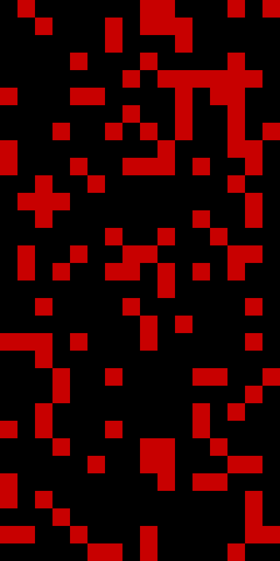

<div style="font-size:.58em;color:#78909c;margin-top:-.3em">ภาพ: Morn / Wikimedia Commons — CC0 1.0 — แผง LED ของซูเปอร์คอมพิวเตอร์ Thinking Machines CM-5 ที่วิ่งตามภาระงานจริง ไม่ใช่ลูปตกแต่ง: จังหวะไฟคือหลักฐานว่าเครื่องยังมีชีวิตและยังทำงานอยู่ ของที่ product มีแล้วแต่ demo มักไม่มี · ถามทีมตรง ๆ ว่า ถ้าเครื่องของเราค้าง คนที่เดินผ่านจะรู้ได้จากอะไร</div>
