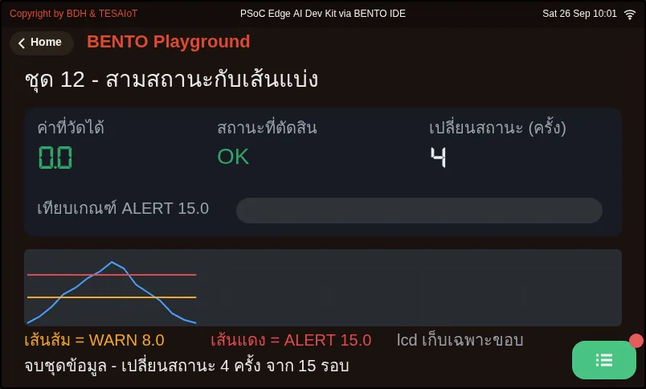
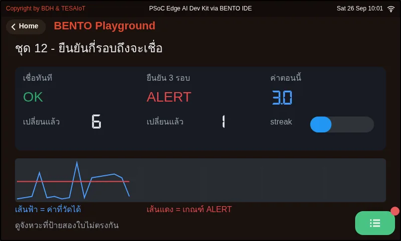
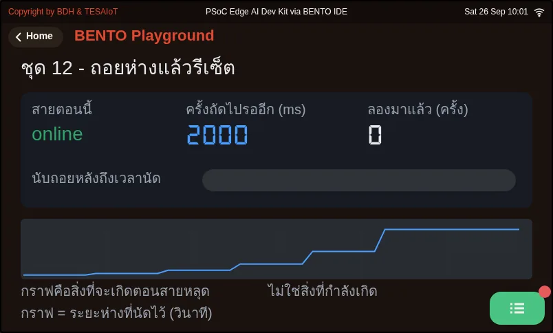
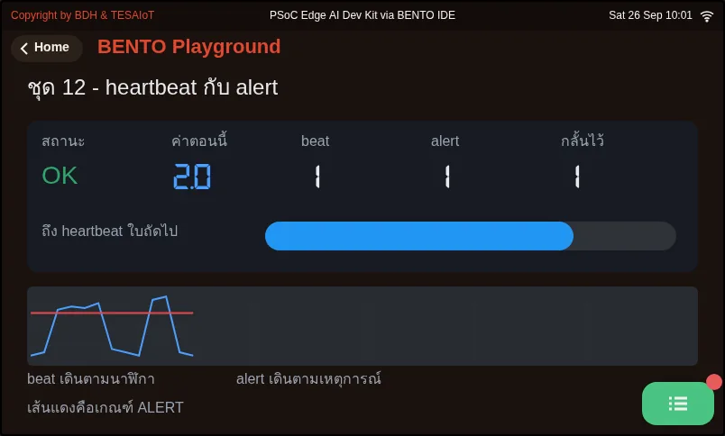
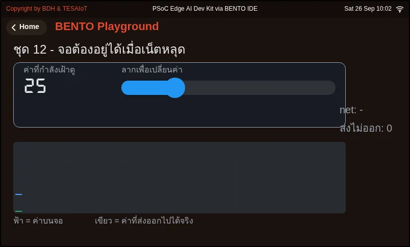

# บทเรียน 5.2 — โครงตั้งต้น: Sense Decide Show Send

> โมดูล 5 — Capstone: AIoT Mini-Product · สไลด์: [slides.md](slides.md) · [ภาพรวมโมดูล](../README.md) · [หน้าหลักสูตร](../../README.md)

แกะโครง s12_capstone_starter.py ทีละท่า ทั้ง Sense Decide Show Send และการกันเน็ตหลุด ฝึกสามไฟล์ตัวอย่างที่ทำให้ demo ไม่ล้ม แล้วรันโครงบนบอร์ดให้ผ่านก่อนแก้อะไร

## เป้าหมาย

เมื่อจบบทเรียนนี้ คุณจะ:

1. ชี้ในโครงตั้งต้นได้ว่าห้าท่าอยู่ตรงไหน อธิบายว่า read_value() คืนค่าเดียวพร้อมธง stale อย่างไร และบอกได้ว่าส่วนไหนของวงจรต้องทำงานต่อได้แม้ไม่มีเน็ต
2. แยกค่าที่วัดได้ออกจากสถานะด้วยฟังก์ชันตัดสินที่ไล่จากเกณฑ์เข้มที่สุดลงมา และบอกราคาของการยืนยัน N รอบเป็นวินาทีได้ (N คูณคาบลูป) จาก 01_state_machine.py และ 02_confirm_n.py
3. ตรวจหน้าจอของโครงด้วยเกณฑ์สี่ข้อ (ค่ามาพร้อมพิสัย · สถานะเป็นไฟ · ปุ่มเปิดกับปิดแยกกัน · คำสั่งที่ทำให้ของจริงขยับมีกล่องยืนยันที่บอกสิ่งที่จะเกิด) และหลบกับดักของ ui.MsgBox ได้ทั้งสองข้อ
4. รันโครงบนบอร์ดโดยยังไม่แก้ตรรกะ เห็นข้อความ kind event ใน MQTT Explorer เมื่อเอียงบอร์ดเกิน 15 องศา เห็นจอขึ้น offline แต่ยังวาดต่อเมื่อปิด WiFi และอธิบายได้ว่าทำไมการต่อใหม่ต้องนัดเวลา ไม่ต่อรัวทุกรอบลูป

## ก่อนเริ่ม

ถือ canvas ห้าช่องกับตาราง schema จากบทเรียน 5.1 ไว้ในบันทึกการเรียน ถ้ายังตอบไม่ได้ว่า "ค่าเดียว" ของโจทย์ทีมคืออะไร
แปลว่าช่อง Sense ยังกรอกไม่เสร็จ เตรียม MQTT Explorer บนคอมพิวเตอร์ (ใช้มาแล้วในบทเรียน 4.4–4.6) ชื่อและรหัส WiFi
หรือ Hotspot ที่บอร์ดจะต่อ และรหัสที่ไม่ซ้ำใครสำหรับ `DEVICE_ID` และ topic `bento/<รหัส>/...`
(เช่นชื่อเล่นภาษาอังกฤษตัวเล็กต่อด้วยเลขสุ่ม 4 หลัก `nok4821` เพราะ broker ของโครงเป็นของสาธารณะ) ไฟล์โครงอยู่ใน `practice/` ของบทเรียน 5.3

- **อุปกรณ์:** บอร์ด Eva Kit หรือ TESAIoT Dev Kit ที่ลงเฟิร์มแวร์ MicroPython ของ BENTO แล้ว หรือ BENTO Emulator ใน [BENTO IDE](https://ide.tesaiot.dev/)
- **เรียนมาก่อน:** [บทเรียน 5.1 — จากโจทย์จริงสู่แบบ: canvas schema และการออกแบบตอนพัง](../l01-problem-to-design/README.md)

## แนวคิด

**70 ต่อ 30** สิ่งที่มีให้แล้วคือเฟิร์มแวร์ที่อ่านเซนเซอร์และวาดจอ โมดูล `sensors` `dsp` `ui` `wifi` `mqtt`
และโครง `s12_capstone_starter.py` ที่รันครบวงได้ตั้งแต่ยังไม่แก้อะไร งานของทีมอีก 30% คือการตัดสินใจ
ตั้งแต่เลือกว่าวัดอะไร ตั้งเกณฑ์ ออกแบบจอ ออกแบบ schema ไปจนถึงเรื่องออฟไลน์ โครงมีห้าท่า
และทุกบรรทัดที่เขียนว่า "ทีมเขียนเอง" คือที่ที่ผลงานของทีมจะไปอยู่

- **ท่าที่ 1 Sense** `read_value()` อ่าน `sensors.bmi270.motion()` ส่งเข้า `dsp.tilt()` (คืน roll ก่อน pitch เสมอ)
  แล้วกรองด้วย `dsp.EMA(alpha=0.2)` หกแกนเข้า ค่าเดียวออก ถ้าอ่านไม่ได้ (`OSError`) จะคืนค่าล่าสุดและยกธง `stale`
  เพื่อให้จอขึ้นว่า "ค่าค้าง อ่านไม่ได้" แทนการโชว์เลขเดิมเหมือนค่าสด ไม่ต้องเรียก `sensors.init()` บน Eva
  (เรียกแล้วได้ `OSError`) และบน Dev Kit ก็ไม่ต้องเรียก ไฟเตือนหน้างานเลือก **ตามชื่อ** จาก
  `gpio.board_info()["led_names"]` เพราะดัชนีต่างกันตามบอร์ด และ `RGB_RED` บน Eva เป็นดวงสีน้ำเงิน
- **ท่าที่ 2 Decide** `decide()` ไล่จากเกณฑ์เข้มที่สุดลงมา ตัดสินบนบอร์ดเพื่อให้เน็ตหลุดแล้วยังตัดสินได้
  `on_state_change()` แยกไว้ให้ทีมเขียนเองว่าตอนสถานะเปลี่ยนให้เกิดอะไร โครงตั้งต้นเชื่อทันทีที่ค่าเกินครั้งเดียว
  ส่วนเฉลยเพิ่มการยืนยันติดกัน 3 รอบ (`CONFIRM_N`)
- **ท่าที่ 3 Show** หน้าจอทำตามสี่ข้อ: `ui.Bar` วางทับ `ui.Scale` (Scale ไม่รับ `.value()` มันคือไม้บรรทัด) ·
  `ui.Led` สามดวงติดทีละดวง (`.value(0)` แล้วหรี่ ไม่ใช่หาย) · ปุ่มเปิดกับปุ่มปิดแยกกัน · ปุ่มปิดต้องผ่านกล่องยืนยัน
  แถบกับไฟขยับทุกรอบ ป้ายสถานะเขียนตอนสถานะเปลี่ยน ตัวเลขเขียนไม่เกินวินาทีละครั้ง และ `lbl_net` บอกความจริงเรื่องเน็ต
- **ท่าที่ 4 Send และท่าที่ 5 กันเน็ตหลุด** `send()` เช็ก `mqtt.is_connected()` ก่อนส่งและคืน `True` หรือ `False`
  ให้ผู้เรียกรู้ผล การต่อใหม่ถูกนัดทุก `RETRY_MS` (10 วินาที) ลูปจึงเดินครบทุกรอบไม่ว่าเน็ตเป็นอย่างไร
  `client_id=DEVICE_ID` ต้องไม่ซ้ำกับบอร์ดอื่น ไม่งั้นสองบอร์ดจะเตะกันหลุดสลับไปมาบน broker สาธารณะ

เส้นทาง "เซนเซอร์ → ตัดสิน → จอ" ไม่พึ่งเน็ต ส่วนเส้น "ส่งขึ้น broker" พึ่ง ออกแบบให้ของสำคัญอยู่บนเส้นแรก
และถ้าเส้นหนึ่งล้ม อีกเส้นต้องไม่ล้มตาม

**กับดักของ `ui.MsgBox` สองข้อ** ปุ่มในตัว MsgBox เองยังไม่ส่งเหตุการณ์กลับมาให้ Python เห็น
โครงจึงใช้ `ui.Button` จริงสองปุ่มที่สร้างพร้อมหน้าจอแล้ว `.hide()` ไว้ และข้อความของ MsgBox พาได้ 95 ไบต์
(ภาษาไทยราว 31 ตัวอักษร) ยาวกว่านั้นถูกตัดเงียบ ๆ คำยืนยันต้องบอกสิ่งที่จะเกิด เช่น "ไฟหน้างานจะดับทันที"
ไม่ใช่ถามว่า "ยืนยันหรือไม่"

## ตัวอย่างสมบูรณ์

**ต้องทำ** เปิดตามลำดับนี้ ทั้งชุดราว 28 นาที ก่อนรันแต่ละไฟล์ อ่านหัวไฟล์ส่วน "ดูที่จอ" แล้วทายก่อนว่าจะเห็นอะไร

1. `01_state_machine.py` (10 นาที) ดูป้ายสถานะเปลี่ยนสีเมื่อกราฟตัดเส้นส้มและเส้นแดง แล้วลองสลับลำดับ `if` ใน `level_of()`
   ให้เช็ก WARN ก่อน ALERT แล้วดูว่า ALERT หายไปทั้งที่ไม่มี error
2. `02_confirm_n.py` (10 นาที) ป้ายซ้าย "เชื่อทันที" แดงตอนค่ากระโดดวูบเดียว ป้ายขวา "ยืนยัน 3 รอบ" ยังเขียว
   ลองเปลี่ยน `CONFIRM_N` แล้วอ่านบรรทัด "ราคาที่จ่าย" ใน Console
3. `03_reconnect_backoff.py` (8 นาที) แก้ `WIFI_SSID` `WIFI_PASS` `BROKER` ที่หัวไฟล์ให้ตรงกับเครือข่ายของคุณก่อน
   แล้วถอดเราเตอร์ ดูระยะรอเดิน 2000 4000 8000 ms จนชนเพดาน และรีเซ็ตกลับทันทีที่ต่อได้

**ติดตรงไหน เปิดอันนี้** ถอดเราเตอร์แล้วจอค้างไปทั้งเครื่อง ให้เปิด `05_hmi_survives_offline.py` (ต้องแก้ WiFi
และ broker ที่หัวไฟล์เช่นกัน) · alert ยิงถี่จนคนเลิกอ่าน ให้เปิด `04_heartbeat_and_alert.py` ที่แยก heartbeat
กับ alert เป็นคนละจังหวะและนับใบที่ถูกกลั้นไว้ ส่วนทีมที่อยากใช้เสียงเป็นแหล่งค่า หรืออยากให้เห็นว่าลูปยังไม่ค้าง
มีไฟล์จากบทเรียนอื่นที่สไลด์อ้างถึงอยู่ข้างล่าง

| ไฟล์ | ไฟล์นี้สอน |
|---|---|
| [examples/01_state_machine.py](examples/01_state_machine.py) | สามสถานะ และเส้นแบ่งที่ต้องตัดสินใจไว้ล่วงหน้า |
| [examples/02_confirm_n.py](examples/02_confirm_n.py) | ต้องเห็นติดกันกี่รอบถึงจะเชื่อ |
| [examples/03_reconnect_backoff.py](examples/03_reconnect_backoff.py) | ต่อใหม่แบบถอยห่างขึ้นเรื่อย ๆ ไม่ใช่รัวติดกัน |
| [examples/04_heartbeat_and_alert.py](examples/04_heartbeat_and_alert.py) | ข้อความสองชนิด สองจังหวะ คนละหน้าที่ |
| [examples/05_hmi_survives_offline.py](examples/05_hmi_survives_offline.py) | เน็ตหลุดแล้วจอต้องยังทำงาน |

สไลด์ของบทเรียนนี้อ้างถึงไฟล์ที่อยู่ในบทเรียนอื่นด้วย:

- [m03-sensor-hmi/l06-accel-chart-lab/examples/01_imu_vibration_monitor.py](../../m03-sensor-hmi/l06-accel-chart-lab/examples/01_imu_vibration_monitor.py) — เฝ้าการสั่นของเครื่องจักร
- [m03-sensor-hmi/l08-dashboard-build/examples/02_mic_sound_level_meter.py](../../m03-sensor-hmi/l08-dashboard-build/examples/02_mic_sound_level_meter.py) — เครื่องวัดระดับเสียงในห้อง
- [m05-capstone/l03-build-and-present/practice/s12_capstone_starter.py](../l03-build-and-present/practice/s12_capstone_starter.py) — โครงเริ่มต้นของ mini-product: Sense -> Decide -> Show -> Send
- [shared/usecase/02_heartbeat_liveness.py](../../shared/usecase/02_heartbeat_liveness.py) — ไฟหัวใจเต้น บอกว่าลูปยังไม่ตาย

**ภาพจอจาก BENTO Emulator** ของตัวอย่างในบทนี้ (คลิกชื่อไฟล์เพื่อเปิดโค้ด)

<figure><figcaption><a href="examples/01_state_machine.py"><code>01_state_machine.py</code></a> สามสถานะ และเส้นแบ่งที่ต้องตัดสินใจไว้ล่วงหน้า</figcaption></figure>
<figure><figcaption><a href="examples/02_confirm_n.py"><code>02_confirm_n.py</code></a> ต้องเห็นติดกันกี่รอบถึงจะเชื่อ</figcaption></figure>
<figure><figcaption><a href="examples/03_reconnect_backoff.py"><code>03_reconnect_backoff.py</code></a> ต่อใหม่แบบถอยห่างขึ้นเรื่อย ๆ ไม่ใช่รัวติดกัน</figcaption></figure>
<figure><figcaption><a href="examples/04_heartbeat_and_alert.py"><code>04_heartbeat_and_alert.py</code></a> ข้อความสองชนิด สองจังหวะ คนละหน้าที่</figcaption></figure>
<figure><figcaption><a href="examples/05_hmi_survives_offline.py"><code>05_hmi_survives_offline.py</code></a> เน็ตหลุดแล้วจอต้องยังทำงาน</figcaption></figure>

## เช็กความเข้าใจ

คำถามชุดเดียวกันอยู่ใน [quiz.yaml](quiz.yaml) สำหรับระบบที่ตรวจอัตโนมัติ

1. รอบหนึ่งบอร์ดอ่าน IMU ไม่ได้ (sensors.bmi270.motion() โยน OSError) read_value() ในโครงตั้งต้นทำอะไร *(เลือกหนึ่งข้อ · เป้าหมายข้อ 1)*
   - ก) หยุดโปรแกรม เพื่อไม่ให้ส่งค่าผิดขึ้น broker
   - ข) คืนค่าล่าสุดที่อ่านได้ และยกธง stale ให้จอขึ้นว่า "ค่าค้าง อ่านไม่ได้"
   - ค) คืนค่า 0 ซึ่งจะทำให้สถานะกลับเป็น OK
   - ง) คืนค่าล่าสุดและแสดงบนจอเหมือนค่าที่เพิ่งวัดได้ตามปกติ

   

เฉลย

   **ข** — อุปกรณ์ที่ต้องอยู่เป็นเดือนต้องทนการอ่านพลาดหนึ่งรอบได้ ค่าค้างยังมีประโยชน์ แต่ต้องไม่ถูกโชว์เหมือนค่าสด อุปกรณ์ที่อ่านเซนเซอร์ไม่ได้แล้วโชว์เลขเดิมค้างไว้คือเครื่องที่โกหกคนหน้างาน

   

2. ทีมหนึ่งเขียน decide() โดยเช็ก if value > WARN_LIMIT ก่อน แล้วจึงเช็ก if value > LIMIT (เกณฑ์ ALERT) ผลจะเป็นอย่างไร *(เลือกหนึ่งข้อ · เป้าหมายข้อ 2)*
   - ก) ทำงานเหมือนเดิม เพราะลำดับของ if ไม่มีผล
   - ข) ขึ้น error ตอนรัน เพราะเงื่อนไขทับกัน
   - ค) ไม่มีทางเข้า ALERT เลย เพราะเงื่อนไขที่หลวมกว่าดักไว้ก่อนทุกครั้ง และไม่มี error ให้เห็น
   - ง) เข้า ALERT เร็วขึ้น เพราะเช็กเกณฑ์ที่ต่ำกว่าก่อน

   

เฉลย

   **ค** — ค่าที่เกิน LIMIT ย่อมเกิน WARN_LIMIT ด้วย จึงถูกคืน WARN ไปก่อนทุกครั้ง ลำดับการตรวจต้องไล่จากเข้มที่สุดลงมาเสมอ ซึ่งเป็นกับดักที่ 01_state_machine.py ชี้ไว้

   

3. ถ้าตั้ง CONFIRM_N = 3 และลูปเดินทุก 200 ms ระบบจะเตือนช้าลงเท่าไรเมื่อเทียบกับการเชื่อทันที *(เลือกหนึ่งข้อ · เป้าหมายข้อ 2)*
   - ก) 0.2 วินาที
   - ข) 0.6 วินาที
   - ค) 3 วินาที
   - ง) ไม่ช้าลงเลย

   

เฉลย

   **ข** — ราคาของการยืนยันคือ N คูณคาบลูป 3 × 200 ms เท่ากับหกในสิบวินาที ทีมต้องตอบเลขนี้ได้เป็นวินาที ไม่ใช่ตั้ง N ให้ใหญ่ไว้ก่อน แลกกับการที่ค่ากระโดดวูบเดียวไม่ยิงเตือนผิด

   

4. ทีมหนึ่งใช้ปุ่มที่อยู่ในตัว ui.MsgBox เป็นปุ่มยืนยันการปิดไฟเตือน แล้วรอให้คนกด จะเกิดอะไรขึ้น *(เลือกหนึ่งข้อ · เป้าหมายข้อ 3)*
   - ก) ทำงานได้ปกติ เพราะ MsgBox ส่งเหตุการณ์ clicked เหมือนปุ่มทั่วไป
   - ข) ได้ปุ่มตายบนจอ เพราะปุ่มในตัว MsgBox ยังไม่ส่งเหตุการณ์กลับมาให้ Python ต้องใช้ ui.Button จริงสองปุ่มแทน
   - ค) ไฟเตือนดับทันทีโดยไม่ต้องรอคนกด
   - ง) บอร์ดรีเซ็ต เพราะแฮนเดิลไม่พอ

   

เฉลย

   **ข** — เฟิร์มแวร์ผูก callback ไว้กับ ui.Button เท่านั้น ปุ่มในตัว MsgBox จึงกดแล้วไม่มีอะไรเกิด คนกดจะสรุปว่าเครื่องแฮงก์ โครงจึงสร้างปุ่ม "ยืนยัน" กับ "ยกเลิก" พร้อมหน้าจอแล้วซ่อนไว้ และ show() ตอนถาม

   

5. ข้อใดถูกเกี่ยวกับท่าที่ 4 และ 5 ของโครงตั้งต้น เลือกทุกข้อที่ถูก *(เลือกได้หลายข้อ · เป้าหมายข้อ 4)*
   - ก) send() คืน False เมื่อยังไม่ได้ต่อ broker ผู้เรียกจึงรู้ผลและนับข้อความที่ส่งไม่ออกได้
   - ข) การต่อใหม่ถูกนัดทุก RETRY_MS ลูปและจอจึงเดินครบทุกรอบแม้เน็ตหลุด
   - ค) สองบอร์ดใช้ client_id เดียวกันได้ ถ้าส่งคนละ topic
   - ง) ถ้าต่อไม่ติด ควรเรียก go_online() ทุกรอบลูป จะได้กลับมาเร็วที่สุด

   

เฉลย

   **ก, ข** — send() ไม่เงียบหาย และการต่อใหม่ถูกนัดเวลาไว้ ต่อรัว ๆ ทุกรอบทำให้ลูปหน่วงและจอกระตุก ส่วน client_id ซ้ำทำให้สองบอร์ดเตะกันหลุดสลับไปมาเป็นลูป ไม่ว่าจะส่ง topic ไหน

   

## แล็บ

**รันโครงให้ผ่านตั้งแต่ยังไม่แก้อะไร** (ราว 15 นาที) จดสิ่งที่เห็นแต่ละข้อลงบันทึกการเรียน

- [ ] บนจอบอร์ด แตะการ์ด BENTO Playground แล้วค้างหน้านี้ไว้
- [ ] เปิด `s12_capstone_starter.py` ใน BENTO IDE แก้บล็อก CONFIG ให้เป็นของคุณ: `DEVICE_ID` `WIFI_SSID` `WIFI_PASS` `TOPIC` (ใช้รหัสที่ไม่ซ้ำใครทั้งใน `DEVICE_ID` และ topic `bento/<รหัส>/...` เช่น `nok4821` เพราะ broker ของโครงเป็นของสาธารณะ)
- [ ] กด Program to Device โดยยังไม่แก้ตรรกะ จอต้องขึ้นสามการ์ดและรันได้ทันที (บน Eva การอ่านเซนเซอร์ครั้งแรกหลังรีเซ็ตอาจรอได้ถึงราว 16 วินาที และ `wifi.connect()` บล็อกได้นาน อย่าเพิ่งกดรันซ้ำ)
- [ ] เปิด MQTT Explorer แล้ว subscribe `bento/<รหัส>/#`
- [ ] เอียงบอร์ดเกิน 15 องศาค้างไว้ ไฟ "ผิดปกติ" ติด ป้าย "รอคนรับทราบ" ขึ้น และมีข้อความ `kind` เป็น `event` ขึ้น broker
- [ ] ทดสอบการพัง: ปิด WiFi ที่บอร์ดต่อ (หรือถอดเราเตอร์) จอยังวาดต่อและบรรทัดสถานะเน็ตขึ้น offline พร้อมจำนวนที่ส่งไม่ออก
- [ ] เขียนรายการจุด "ทีมเขียนเอง" ในไฟล์ แล้วจับคู่แต่ละจุดกับช่องของ canvas ที่ตอบมัน

## ไปต่อ

บทเรียน 5.3 เริ่มแทนที่จุด "ทีมเขียนเอง" ทีละจุดจนเป็นงานของทีม แล้วเตรียมนำเสนอ ถ้ามีเวลา ดูวิดีโอเสริมในสไลด์
เรื่อง QoS ของ MQTT ซึ่งเป็นคำตอบระดับโพรโทคอลของคำถามเรื่องส่งไม่ถึง ทางยกระดับคือ `tesaiot.connect()`
ผ่าน TLS พอร์ต 8884 จากบทเรียน 4.7–4.9 แต่ต้อง provision ตัวตนอุปกรณ์รายทีมก่อน จึงไม่อยู่ในโครงตั้งต้น

บทเรียนถัดไป: [บทเรียน 5.3 — สร้างและนำเสนอ AIoT mini-product](../l03-build-and-present/README.md)

## สะท้อนคิด

- "ค่าเดียว" ของโจทย์ทีมคืออะไร และมันมาจากกี่แกนของข้อมูลดิบ
- ถ้าจอนี้ติดอยู่หน้าเครื่องจักรจริง คนเดินผ่านจะเข้าใจในสองวินาทีไหมว่าตอนนี้ปกติหรือไม่ปกติ
- คำสั่งไหนบนจอของทีมที่กดผิดแล้วย้อนกลับไม่ได้ และกล่องยืนยันของมันควรบอกว่าจะเกิดอะไร
