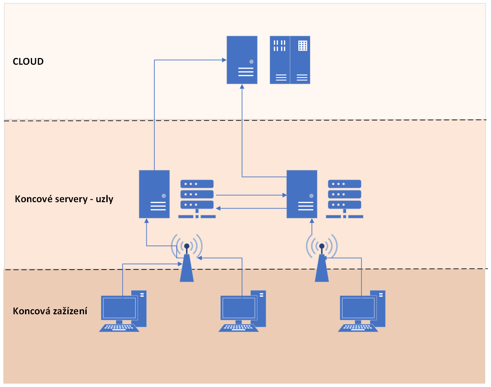
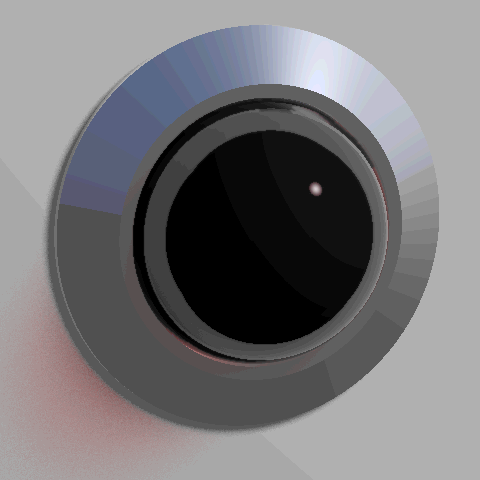

<style>
section { font-size: 23px; padding: 14px 44px; justify-content: flex-start; }
section h1 { font-size: 1.45em; line-height: 1.10; margin: 0 0 .14em; }
section h2 { font-size: 1.10em; margin: .06em 0; }
section h3 { font-size: 1.0em; margin: .12em 0; }
section p, section li { margin: .05em 0; line-height: 1.16; }
section img { max-width: 100%; height: auto; }
section svg { max-height: 205px; width: 100%; }
section table { font-size: .70em; }
section pre { font-size: .55em; line-height: 1.12; background:#0d1117; color:#e6edf3; border:1px solid #30363d; border-radius:8px; padding:12px 16px; box-shadow:0 2px 8px rgba(0,0,0,.25); }
section pre code { white-space: pre-wrap; background:transparent; color:inherit; } section pre .hljs-comment{color:#8b949e;font-style:italic} section pre .hljs-keyword,section pre .hljs-built_in,section pre .hljs-literal{color:#ff7b72} section pre .hljs-string{color:#a5d6ff} section pre .hljs-number{color:#79c0ff} section pre .hljs-title,section pre .hljs-title.function_,section pre .hljs-section{color:#d2a8ff} section pre .hljs-meta{color:#ffa657} section pre .hljs-attr,section pre .hljs-attribute,section pre .hljs-name{color:#7ee787}
section blockquote { margin: .12em 0; font-size: .88em; }
/* two images on a line (parity / 2x2 grids) stay side-by-side and small */
section p > img + img { margin-left: 10px; }
/* scroll-within-slide: dense slides scroll instead of clipping */
section { overflow-y: auto; overflow-x: hidden; }
section::-webkit-scrollbar { width: 11px; }
section::-webkit-scrollbar-thumb { background:#4a90d9; border-radius:6px; }
section::-webkit-scrollbar-track { background:rgba(0,0,0,.06); }
/* image drop-shadow + cover-slide readability (auto) */
section img{filter:drop-shadow(0 3px 12px rgba(0,0,0,.5))}
/* พื้นสำรองของสไลด์ปก: ถ้า img/cover_sNN.svg โหลดไม่ขึ้น ธีมจะคืนพื้นขาว
   แล้วตัวอักษรสีขาวของปกจะหายไปทั้งแผ่น — ปักสีเข้มไว้ให้ภาพเป็นแค่ของประดับ */
section.cover{background-color:#0b1426}
section.cover *{color:#fff !important}
section.cover h1,section.cover h2,section.cover h3,section.cover p,section.cover li,section.cover strong,section.cover em,section.cover blockquote,section.cover div{text-shadow:0 2px 9px rgba(0,0,0,.92),0 0 3px rgba(0,0,0,.8)}
section.cover div[style*="background:#"],section.cover div[style*="background: #"]{background:rgba(10,14,20,.66) !important;border-color:rgba(120,200,255,.45) !important;max-width:62%}
section.cover blockquote{border-left:4px solid rgba(120,200,255,.6) !important;background:rgba(13,17,23,.55) !important;border-radius:6px;padding:.3em .6em}
section.cover h1,section.cover h2,section.cover h3,section.cover p,section.cover blockquote{max-width:60%}
section.cover div:not(:has(img)){max-width:62%}
section.cover img{filter:none}
</style>


<!-- _class: cover -->

# บทเรียน 5.2 — โครงตั้งต้น: Sense Decide Show Send

## Capstone · AIoT Mini-Product ของทีมเรา: จากโจทย์จริง สู่ของที่ใช้งานได้

**โมดูล 5 — Capstone: AIoT Mini-Product**

> ต่อจากบทเรียน 5.1 — จากโจทย์จริงสู่แบบ: canvas schema และการออกแบบตอนพัง

---

## เรื่องที่เราให้ 70% ผู้เรียนเขียน 30%

<svg viewBox="0 0 940 180" xmlns="http://www.w3.org/2000/svg">
  <rect x="20" y="26" width="620" height="130" rx="10" fill="#e3f2fd" stroke="#1565c0" stroke-width="2"/>
  <text x="330" y="62" text-anchor="middle" font-size="23" font-weight="700" fill="#1565c0">70% — มีให้แล้ว</text>
  <text x="330" y="96" text-anchor="middle" font-size="18" fill="#0d47a1">เฟิร์มแวร์อ่านเซนเซอร์และวาดจอ · โมดูล sensors dsp ui wifi mqtt</text>
  <text x="330" y="126" text-anchor="middle" font-size="18" fill="#0d47a1">โครง s12_capstone_starter.py ที่รันครบวงจรตั้งแต่ยังไม่แก้อะไร</text>
  <rect x="656" y="26" width="264" height="130" rx="10" fill="#fff3e0" stroke="#ef6c00" stroke-width="2">
    <animate attributeName="stroke-width" values="2;5;2" dur="2.6s" repeatCount="indefinite"/></rect>
  <text x="788" y="62" text-anchor="middle" font-size="23" font-weight="700" fill="#ef6c00">30% — งานของทีม</text>
  <text x="788" y="96" text-anchor="middle" font-size="18" fill="#e65100">เลือกโจทย์ · ตั้งเกณฑ์ · ออกแบบจอ</text>
  <text x="788" y="126" text-anchor="middle" font-size="18" fill="#e65100">schema · ออฟไลน์ · เล่าให้เข้าใจ</text>
</svg>

**สิ่งที่มีให้แล้ว (70%)** — เฟิร์มแวร์อ่านเซนเซอร์และวาดจอ, โมดูล `sensors/dsp/ui/wifi/mqtt`, และโครง [`s12_capstone_starter.py`](https://github.com/tesaiot/tesa-qualification-program/blob/main/courses/aiot-micropython/m05-capstone/l03-build-and-present/practice/s12_capstone_starter.py) ที่รันครบวงจรได้ตั้งแต่ยังไม่แก้อะไร

**งานของทีม (30%)** — เลือกโจทย์ · เลือกว่าวัดอะไร · ตั้งเกณฑ์ · ออกแบบสิ่งที่คนหน้างานเห็น · ออกแบบ schema · ตัดสินใจเรื่องออฟไลน์ · เล่าให้คนอื่นเข้าใจใน 10 นาที

30% ของวันนี้ไม่ได้วัดกันที่จำนวนบรรทัด มันวัดกันที่ **คุณภาพของการตัดสินใจ** ทุกอย่างข้างบนคือการตัดสินใจ ไม่ใช่การพิมพ์

> ชุดบทเรียนก่อน ๆ เราวัดกันว่า "ทำให้มันทำงานได้ไหม" วันนี้เราวัดว่า "ทำไมถึงทำแบบนี้"

---

## แกะโครงเริ่มต้น — ท่าที่ 1 Sense

<style scoped>section pre{font-size:.58em;line-height:1.22} section svg{max-height:128px} section p{margin:.1em 0}</style>

<svg viewBox="0 0 940 216" xmlns="http://www.w3.org/2000/svg">
  <defs><marker id="e1" markerWidth="10" markerHeight="8" refX="9" refY="4" orient="auto">
    <path d="M0,0 L10,4 L0,8 z" fill="#1565c0"/></marker></defs>
  <rect x="14" y="52" width="204" height="96" rx="10" fill="#e3f2fd" stroke="#1565c0" stroke-width="2"/>
  <text x="116" y="82" text-anchor="middle" font-size="19" font-weight="700" fill="#1565c0">motion()</text>
  <text x="116" y="110" text-anchor="middle" font-size="18" fill="#0d47a1">ax ay az</text>
  <text x="116" y="136" text-anchor="middle" font-size="18" fill="#0d47a1">gx gy gz</text>
  <rect x="252" y="52" width="204" height="96" rx="10" fill="#e8f5e9" stroke="#2e7d32" stroke-width="2"/>
  <text x="354" y="82" text-anchor="middle" font-size="19" font-weight="700" fill="#2e7d32">dsp.tilt()</text>
  <text x="354" y="110" text-anchor="middle" font-size="18" fill="#1b5e20">roll, pitch</text>
  <text x="354" y="136" text-anchor="middle" font-size="18" fill="#4a7c4e">roll มาก่อนเสมอ</text>
  <rect x="490" y="52" width="204" height="96" rx="10" fill="#fff8e1" stroke="#f9a825" stroke-width="2"/>
  <text x="592" y="82" text-anchor="middle" font-size="19" font-weight="700" fill="#f57f17">dsp.EMA(0.2)</text>
  <text x="592" y="110" text-anchor="middle" font-size="18" fill="#8d6e00">กันค่ากระโดด</text>
  <text x="592" y="136" text-anchor="middle" font-size="18" fill="#a1683a">ครั้งเดียวจนเตือนผิด</text>
  <rect x="728" y="52" width="198" height="96" rx="10" fill="#f3e5f5" stroke="#6a1b9a" stroke-width="3">
    <animate attributeName="stroke-width" values="3;6;3" dur="2.4s" repeatCount="indefinite"/></rect>
  <text x="827" y="88" text-anchor="middle" font-size="19" font-weight="700" fill="#6a1b9a">ค่าเดียว</text>
  <text x="827" y="122" text-anchor="middle" font-size="26" font-weight="700" fill="#4a148c">17.4</text>
  <line x1="222" y1="100" x2="246" y2="100" stroke="#1565c0" stroke-width="3" marker-end="url(#e1)"/>
  <line x1="460" y1="100" x2="484" y2="100" stroke="#1565c0" stroke-width="3" marker-end="url(#e1)"/>
  <line x1="698" y1="100" x2="722" y2="100" stroke="#1565c0" stroke-width="3" marker-end="url(#e1)"/>
  <circle r="6" fill="#1565c0" cx="228" cy="100"><animateMotion path="M0,0 L126,0 L364,0 L599,0" dur="3.4s" repeatCount="indefinite"/></circle>
  <text x="470" y="32" text-anchor="middle" font-size="20" font-weight="700" fill="#37474f">หกแกนเข้า ค่าเดียวออก — สามช่องที่เหลือของ canvas ทำงานกับค่าเดียวนั้นทั้งหมด</text>
  <text x="470" y="192" text-anchor="middle" font-size="18" fill="#455a64">ทีมความสั่นเปลี่ยนเป็นขนาดความเร่งรวม · ทีมการเคลื่อนย้ายใช้ bmm350.heading() — โครงที่เหลือไม่ต้องแตะ</text>
</svg>

```python
# บน Eva ไม่มี sensors.init() ให้เรียก - คอร์จอถือบัส IMU เรียกแล้วได้ OSError ทันที
# บน Dev Kit CM33 อ่าน IMU ตรงจาก I2C เอง และเฟิร์มแวร์ปลุกมันไว้ตั้งแต่บูต จึงไม่ต้อง init เช่นกัน
smooth = dsp.EMA(alpha=0.2)       # กันค่ากระโดดครั้งเดียวจนเตือนผิด
last_value = 0.0
stale = False                     # รอบนี้อ่านไม่ได้ใช่ไหม - จอต้องบอกความจริงข้อนี้

def read_value():
    global last_value, stale
    try:
        ax, ay, az, gx, gy, gz = sensors.bmi270.motion()
    except OSError:
        stale = True              # ค่าค้างยังมีประโยชน์ แต่ต้องไม่ถูกโชว์เหมือนค่าสด
        return last_value
    stale = False
    roll, pitch = dsp.tilt(ax, ay, az)   # dsp.tilt คืน (roll, pitch) - roll มาก่อน
    # ทีมเขียนเอง: เปลี่ยนบรรทัดล่างเป็นปริมาณที่โจทย์ของทีมสนใจจริง ๆ
    last_value = smooth.update(abs(roll))
    return last_value
```

`read_value()` คืน **ค่าเดียว** ไม่ใช่หกแกน — สามช่องที่เหลือของ canvas ตัดสินจากมัน แสดงมัน และส่งมัน · ธง `stale` มีไว้เพื่อข้อเดียว: **ค่าที่แสดงต้องบอกคุณภาพของตัวเองได้** อุปกรณ์ที่อ่านเซนเซอร์ไม่ได้แล้วโชว์เลขเดิมค้างไว้คือเครื่องที่โกหกคนหน้างาน — ท่าที่ 3 จะเอาธงนี้ขึ้นจอว่า "ค่าค้าง อ่านไม่ได้" · ทีมความสั่นเปลี่ยนสองบรรทัดสุดท้ายเป็นขนาดความเร่งรวม ทีมการเคลื่อนย้ายใช้ `sensors.bmm350.heading()` โครงที่เหลือไม่ต้องแตะ

> ถ้าทีมยังตอบไม่ได้ว่า "ค่าเดียว" ของทีมคืออะไร แปลว่าช่อง Sense ในบันทึกการเรียนยังกรอกไม่เสร็จ

---

## ท่าที่ 1 ต่อ — โครงเดียว รันได้ทั้งสองบอร์ดโดยไม่ต้องแก้

<style scoped>section pre{font-size:.6em;line-height:1.25} section p{margin:.15em 0}</style>

```python
LED_NAMES = gpio.board_info()["led_names"]

def led_named(*names, fallback=0):
    for n in names:
        if n in LED_NAMES:
            return gpio.led(LED_NAMES.index(n))
    return gpio.led(fallback)

beacon_lamp = led_named(BEACON_LED if "RGB_GREEN" in LED_NAMES else "LED1")   # แดงทั้งสองบอร์ด
```

**เซนเซอร์** — บน Eva Kit ไม่ต้องเรียก `sensors.init()` และเรียกแล้วจะได้ `OSError` เพราะคอร์จอเป็นเจ้าของบัสเซนเซอร์ `bmi270` `capsense` `pot` อ่านได้ทันทีผ่าน snapshot ที่คอร์จอเก็บไว้ให้ (การอ่านครั้งแรกหลังรีเซ็ตบน Eva อาจรอได้ถึงราว 16 วินาที) · บน Dev Kit `init()` ทำงานได้จริงแต่ก็ไม่ต้องเรียก เพราะเฟิร์มแวร์ปลุกเซนเซอร์ไว้ตั้งแต่บูต และ CM33 อ่าน IMU เองโดยตรง · `sensors.snapshot()` คืน dict รูปเดียวกันทั้งสองบอร์ด

**หลอดไฟเตือนหน้างาน** (`beacon_lamp`) ถูกเลือก**ตามชื่อ** จาก `gpio.board_info()["led_names"]` ไม่ใช่ตามเลข เพราะดัชนี LED ต่างกันตามบอร์ด: `RGB_RED` บน Dev Kit เป็นดวงสีแดง ส่วนบน Eva ดวงที่ชื่อ `RGB_RED` เป็นสีน้ำเงิน (ชื่อกับสีไม่ตรงกัน — เป็นของจริงในเฟิร์มแวร์ อย่าไป "แก้") โครงจึงถามก่อนว่ามี `RGB_GREEN` ไหม: มี = Dev Kit ใช้ `RGB_RED` · ไม่มี = Eva ใช้ `LED1` ซึ่งเป็นดวงแดง

> โค้ดที่รันได้ทั้งสองบอร์ดไม่ได้เกิดจากการ "ไม่พูดถึงบอร์ด" แต่เกิดจากการถามบอร์ดว่ามันมีอะไร แล้วเลือกด้วยชื่อ

---

## แกะโครงเริ่มต้น — ท่าที่ 2 Decide

<style scoped>
section { font-size: .90em; }
</style>

<svg viewBox="0 0 940 214" xmlns="http://www.w3.org/2000/svg">
  <text x="20" y="34" font-size="20" font-weight="700" fill="#37474f">ยืนยันติดกัน 3 รอบก่อนเปลี่ยนสถานะ — 3 x 200 ms = หกในสิบวินาที</text>
  <line x1="40" y1="150" x2="900" y2="150" stroke="#b0bec5" stroke-width="2"/>
  <line x1="40" y1="88" x2="838" y2="88" stroke="#c62828" stroke-width="2" stroke-dasharray="7 5"/>
  <text x="852" y="94" font-size="18" font-weight="700" fill="#c62828">LIMIT</text>
  <polyline points="48,140 108,134 168,142 228,70 288,138 348,136 408,142 468,80 528,74 588,68 648,72 708,66 768,70 828,64 888,68" fill="none" stroke="#1565c0" stroke-width="3"/>
  <circle cx="228" cy="70" r="10" fill="none" stroke="#f9a825" stroke-width="3"/>
  <text x="228" y="46" text-anchor="middle" font-size="18" fill="#f57f17">วูบเดียว</text>
  <text x="228" y="186" text-anchor="middle" font-size="18" font-weight="700" fill="#2e7d32">ไม่เปลี่ยนสถานะ</text>
  <rect x="440" y="56" width="180" height="106" rx="8" fill="#c62828" opacity="0.12"/>
  <text x="530" y="186" text-anchor="middle" font-size="18" font-weight="700" fill="#c62828">เกินติดกัน 3 รอบ = ALERT</text>
  <circle r="8" fill="#c62828" cx="468" cy="80">
    <animateMotion path="M0,0 L60,-6 L120,-12" dur="2.4s" repeatCount="indefinite"/></circle>
</svg>



<div style="font-size:.62em;color:#78909c">ภาพ: Psenda38 / Wikimedia Commons — CC0 1.0 · การตัดสินอยู่บนบอร์ด ไม่ได้อยู่ที่ปลายทาง — เน็ตหลุดแล้วต้องยังตัดสินได้ และไม่ต้องจ่ายค่าเน็ตเพื่อรอคำตอบที่ช้ากว่า</div>

```python
def decide(value):
    if value > LIMIT:        # ไล่จากเข้มที่สุดลงมาเสมอ สลับเมื่อไรจะไม่เข้า ALERT เลย
        return "ALERT"
    if value > WARN_LIMIT:
        return "WARN"
    return "OK"

def on_state_change(old, new, value):
    pass  # ทีมเขียนเอง: ตอนสถานะเปลี่ยนให้เกิดอะไร (นับจำนวนครั้ง จดเวลา สั่งของอย่างอื่น)
```

การตัดสินอยู่บนบอร์ด ไม่ใช่ที่ปลายทาง เหตุผลเดียวกับบทเรียน 1.4–1.6: เน็ตหลุดแล้วต้องยังตัดสินได้ และการส่งค่าดิบให้คลาวด์คิดแทนคือจ่ายค่าเน็ตเพื่อรอคำตอบที่ช้ากว่า

`on_state_change()` แยกเป็นฟังก์ชันต่างหาก เพราะ "สิ่งที่เกิดตอนสถานะเปลี่ยน" เป็นของทีมแต่ละทีม ไม่ใช่ของโครง — ทีมหนึ่งนับจำนวนครั้ง อีกทีมจดเวลาเพื่อคิดระยะเวลารวม

**ระดับถัดไปที่เฉลยทำ:** บังคับให้ค่าต้องเกินเกณฑ์ **ติดกัน 3 รอบ** ก่อนจึงเปลี่ยนสถานะจริง (`CONFIRM_N`) โครงเริ่มต้นเชื่อทันทีที่เห็นค่าเกินครั้งเดียว ซึ่งพอสำหรับให้ไฟล์รันได้ แต่จะโทรตามช่างเพราะรถบรรทุกวิ่งผ่าน

> สองระดับใช้สอนได้ แต่ของที่ติดตั้งจริงเกือบทุกตัวมีการยืนยันซ้ำก่อนเชื่อด้วย

---

## แกะโครงเริ่มต้น — ท่าที่ 3 Show

<style scoped>section svg{max-height:176px} section table{font-size:.66em}</style>

<svg viewBox="0 0 940 262" xmlns="http://www.w3.org/2000/svg">
  <rect x="150" y="10" width="640" height="212" rx="10" fill="#060c18" stroke="#7aa7d9" stroke-width="2"/>
  <rect x="160" y="34" width="378" height="94" rx="7" fill="#142240" stroke="#a0b4cc"/>
  <text x="172" y="52" font-size="13" fill="#a0b4cc">ค่าที่วัดได้ เทียบกับเกณฑ์</text>
  <text x="172" y="80" font-size="26" font-weight="700" fill="#ffffff">17.9 deg</text>
  <text x="330" y="78" font-size="14" fill="#a0b4cc">ค่าปกติ</text>
  <rect x="172" y="92" width="352" height="9" rx="4" fill="#263550"/>
  <rect x="172" y="92" width="140" height="9" rx="4" fill="#4fc3f7"/>
  <line x1="172" y1="110" x2="524" y2="110" stroke="#ffffff" stroke-width="2"/>
  <text x="172" y="124" font-size="12" fill="#a0b4cc">0</text>
  <text x="285" y="124" font-size="12" fill="#a0b4cc">15</text>
  <text x="400" y="124" font-size="12" fill="#a0b4cc">30</text>
  <text x="512" y="124" font-size="12" fill="#a0b4cc">45</text>
  <rect x="160" y="136" width="378" height="76" rx="7" fill="#142240" stroke="#a0b4cc"/>
  <text x="172" y="154" font-size="13" fill="#a0b4cc">สถานะที่ตัดสินแล้ว</text>
  <circle cx="182" cy="174" r="9" fill="#0d3d22"/><text x="198" y="179" font-size="13" fill="#a0b4cc">ปกติ</text>
  <circle cx="262" cy="174" r="9" fill="#4a3c10"/><text x="278" y="179" font-size="13" fill="#a0b4cc">เฝ้าระวัง</text>
  <circle cx="372" cy="174" r="9" fill="#ff5252"/><text x="388" y="179" font-size="13" fill="#a0b4cc">ผิดปกติ</text>
  <text x="172" y="203" font-size="14" fill="#ffffff">ผิดปกติ ต้องมีคนไปดู</text>
  <rect x="416" y="186" width="110" height="22" rx="5" fill="#37474f"/>
  <text x="471" y="201" text-anchor="middle" font-size="13" fill="#ffffff">รับทราบ</text>
  <rect x="548" y="34" width="230" height="178" rx="7" fill="#142240" stroke="#a0b4cc"/>
  <text x="560" y="52" font-size="13" fill="#a0b4cc">ไฟเตือนหน้างาน</text>
  <circle cx="572" cy="74" r="10" fill="#ff5252"/>
  <text x="590" y="79" font-size="13" fill="#a0b4cc">ไฟติดอยู่</text>
  <rect x="560" y="94" width="200" height="30" rx="6" fill="#1b5e20"/>
  <text x="660" y="114" text-anchor="middle" font-size="14" fill="#ffffff">เปิดไฟเตือน</text>
  <rect x="560" y="130" width="200" height="30" rx="6" fill="#37474f"/>
  <text x="660" y="150" text-anchor="middle" font-size="14" fill="#ffffff">ปิดไฟเตือน</text>
  <text x="560" y="180" font-size="12" fill="#a0b4cc">สั่งปิดต้องยืนยันก่อน</text>
  <text x="560" y="200" font-size="12" fill="#a0b4cc">online · ส่งแล้ว 12 ใบ</text>
  <text x="14" y="60" font-size="17" font-weight="700" fill="#c62828">ค่า + พิสัย</text>
  <text x="14" y="82" font-size="16" fill="#8d3b3b">Bar ทับ Scale</text>
  <text x="14" y="150" font-size="17" font-weight="700" fill="#ef6c00">สถานะเป็นไฟ</text>
  <text x="14" y="172" font-size="16" fill="#a1683a">ไม่ใช่ตัวอักษรสี</text>
  <text x="806" y="110" font-size="17" font-weight="700" fill="#2e7d32">เปิด/ปิด</text>
  <text x="806" y="132" font-size="16" fill="#4a7c4e">คนละปุ่ม</text>
  <text x="806" y="180" font-size="17" font-weight="700" fill="#6a1b9a">31 จาก 64</text>
  <text x="806" y="202" font-size="16" fill="#7e5a94">ยังเหลือให้ทีม</text>
  <text x="470" y="252" text-anchor="middle" font-size="19" font-weight="700" fill="#37474f">ถ้าจอนี้ติดอยู่หน้าเครื่องจักรจริง คนเดินผ่านจะเข้าใจใน 2 วินาทีไหม</text>
</svg>

```python
lbl_value = ui.Label("--", x=22, y=76, color=COL_TEXT, value=30)   # ค่าหลัก
lbl_quality = ui.Label("รอค่าแรก", x=250, y=86, color=COL_DIM, value=16)
bar_value = ui.Bar(x=22, y=134, w=440, h=14, color=COL_RUN,
                   min=0, max=SCALE_MAX, value=0)
sc_value = ui.Scale(x=22, y=150, w=440, h=48, color=COL_TEXT, min=0, max=SCALE_MAX)
sc_value.ticks(10, 3)                       # 0 · 15 · 30 · 45 ไม่ทับกัน
led_ok = ui.Led(x=26, y=274, w=34, h=34, color=COL_OK, value=1)
led_warn = ui.Led(x=160, y=274, w=34, h=34, color=COL_WARN, value=0)
led_bad = ui.Led(x=320, y=274, w=34, h=34, color=COL_BAD, value=0)
btn_on = ui.Button("เปิดไฟเตือน", x=498, y=124, w=184, h=46, color=0x1B5E20, value=18)
btn_off = ui.Button("ปิดไฟเตือน", x=498, y=178, w=184, h=46, color=0x37474F, value=18)
```

**สี่ข้อที่หน้าจอนี้ทำ และเป็นเกณฑ์ตรวจหน้าจอของทีมด้วย**

| ข้อ | ทำอย่างไรในโค้ดนี้ |
|---|---|
| ค่าที่วัดได้ต้องมาพร้อมพิสัย | `ui.Bar` วางทับ `ui.Scale` — ตัวเลข 17.9 ลอย ๆ ไม่บอกว่าสูงไหม แต่แท่งที่อยู่บนไม้บรรทัด 0-45 บอกทันที |
| สถานะต้องเป็นไฟ ไม่ใช่ตัวอักษรสี | `ui.Led` สามดวง ติดทีละดวง — แปลงภาพเป็นขาวดำแล้วสีตัวอักษรหายหมด ไฟที่ติดกับไฟที่หรี่ยังแยกออก |
| ปุ่มเปิดกับปุ่มปิดต้องแยกกัน | `btn_on` กับ `btn_off` คนละตัว — ปุ่มเดียวสลับไปมาบอกไม่ได้ว่าตอนนี้อยู่สถานะไหน คนกดต้องเดา |
| ค่าที่แสดงต้องบอกคุณภาพตัวเอง | `lbl_quality` ขึ้นว่า "ค่าค้าง อ่านไม่ได้" เมื่อธง `stale` ถูกยก ไม่ใช่ค้างเลขเดิมไว้เฉย ๆ |

---

## ท่าที่ 3 ต่อ — ไม้บรรทัดไม่ขยับ ไฟหรี่ไม่หาย และจอต้องบอกความจริงเรื่องเน็ต

`ui.Scale` **ไม่รับ `.value()`** มันคือไม้บรรทัด ตัวที่ขยับคือ `ui.Bar` ที่วางทับ (แบบวงกลมมีเข็มจริง — บทเรียน 3.1–3.3) · `ui.Led` สั่ง `.value(0)` แล้ว **หรี่ ไม่ใช่หาย** ซึ่งตั้งใจ เพราะไฟที่หายไปตอนดับ ทำให้คนดูแยกไม่ออกว่าดับหรือจอเสีย

หน้าจอที่ดีตอบได้ใน 2 วินาทีว่า **ตอนนี้ปกติหรือไม่ปกติ** ตัวเลขละเอียดเป็นเรื่องรอง — คนหน้างานมองผ่านหน้ากากเชื่อมและถือของอยู่สองมือ

บรรทัด `lbl_net` มีอยู่เพราะจอต้องบอกความจริงเรื่องการเชื่อมต่อด้วย ไม่ใช่โชว์แต่ตัวเลขสวย ๆ ราวกับทุกอย่างปกติทั้งที่ส่งอะไรไม่ออกมาสิบนาทีแล้ว



<div style="font-size:.58em;color:#78909c;margin-top:-.3em">ภาพ: smial / Wikimedia Commons — CC0 1.0 — จังหวะกะพริบแบบหัวใจเต้น คือช่อง Show ที่ถูกที่สุดเท่าที่มี ใช้ยืนยันว่าลูปยังเดินอยู่แม้จอจะยังไม่มีข้อมูลอะไรใหม่ให้แสดง · ทีมที่ยังไม่มีอะไรจะโชว์ ให้เริ่มจากอันนี้ก่อน</div>

> ถามตัวเองว่า "ถ้าจอนี้ติดอยู่หน้าเครื่องจักรจริง คนเดินผ่านจะเข้าใจใน 2 วินาทีไหม"

---

## ท่าที่ 3 ต่อ — คำสั่งที่ทำให้ของจริงขยับ ต้องยืนยันก่อน

<style scoped>section pre{font-size:.6em;line-height:1.25} section p, section li{margin:.1em 0}</style>

```python
# สร้างพร้อมหน้าจอแล้วซ่อนไว้ ไม่ใช่สร้างตอนกด - แฮนเดิลมีจำกัด และการสร้างของ
# ตอนคนกำลังรอคำตอบ คือการเพิ่มความหน่วงในจังหวะที่แย่ที่สุด · กล่องวางกลางจอ
box = ui.MsgBox("ปิดไฟเตือน\nไฟหน้างานจะดับทันที", x=112, y=96, w=568, h=136,
                color=COL_CARD)
box.hide()
btn_yes = ui.Button("ยืนยัน", x=144, y=248, w=200, h=88, color=0x3A4150, value=20)
btn_no = ui.Button("ยกเลิก", x=376, y=248, w=200, h=88, color=0x3A4150, value=20)
btn_yes.hide()
btn_no.hide()
...
        elif ev["handle"] == btn_off.id() and not asking:
            asking = True                     # เปิดไม่ต้องถาม เพราะย้อนกลับได้ทันที
            box.show()
            btn_yes.show()
            btn_no.show()
        elif ev["handle"] == btn_yes.id() and asking:
            asking = False
            beacon(False)                     # ของจริงกับจอขยับพร้อมกันในฟังก์ชันเดียว
            box.hide()
            btn_yes.hide()
            btn_no.hide()
```

**สองเรื่องที่ต้องรู้ก่อนใช้ `ui.MsgBox`**

1. **ปุ่มในตัว MsgBox เองยังไม่ส่งเหตุการณ์กลับมาให้ Python เห็น** เฟิร์มแวร์ผูก callback ไว้กับ `ui.Button` เท่านั้น ถ้าวางปุ่มของกล่องไว้แล้วรอให้คนกด จะได้ปุ่มตายบนจอ และคนกดจะสรุปว่าเครื่องแฮงก์ — ใช้ `ui.Button` จริงสองตัวเป็นคำตอบแทน
2. **ข้อความของ MsgBox เดินทางไปกับ CREATE ซึ่งพาได้ 95 ไบต์** ภาษาไทยตัวละ 3 ไบต์ แปลว่าหัวเรื่องบวกเนื้อความรวมกันได้ราว **31 ตัวอักษร** ยาวกว่านั้นถูกตัดเงียบ ๆ ไม่มี error ให้จับ มีแต่ประโยคที่ขาดครึ่งบนจอ (ตามซอร์ส `modui.c` เฟิร์มแวร์ 2026-08-20 ขึ้นไปส่งส่วนที่เกินซ้ำทาง `.text()` ได้ถึง 126 ไบต์ ยังต้องยืนยันบนบอร์ด · เขียนให้สั้นไว้ก่อนจึงปลอดภัยทุกรุ่น)

> คำยืนยันต้องบอก **สิ่งที่จะเกิด** ไม่ใช่ถามว่า "ยืนยันไหม" — เทียบสองประโยคนี้ตอนตีสามที่หน้างาน: "ยืนยันหรือไม่" กับ "ไฟหน้างานจะดับทันที" · ทีมที่ทำหน้าจอสั่งงานได้ ต้องตอบให้ได้ว่า "ถ้ากดผิดจะเกิดอะไร และย้อนกลับได้ไหม"

---

## ท่าที่ 3 ต่อ — ตัวเลขที่คนต้องอ่าน เขียนใหม่ไม่เกินวินาทีละครั้ง

```python
    sec = now // 1000              # ประตูเดียว: วินาทีเปลี่ยนหรือยัง
    if sec == last_sec:
        return                     # แถบกับไฟขยับไปแล้วข้างบน ส่วนตัวเลขรอรอบหน้า
    last_sec = sec
    lbl_value.text("{:.1f} {}".format(value, UNIT))
```

ลูปเดินทุก 200 ms แต่ตัวเลขที่กระพริบห้าครั้งต่อวินาทีอ่านไม่ทัน — **แถบกับไฟขยับได้ทุกรอบ** เพราะตาอ่านรูปทรงได้เร็วกว่าตัวเลข ส่วนป้ายสถานะเขียนตอน **เปลี่ยน** ไม่ใช่ตอนถึงรอบวินาที ไม่งั้นป้ายกับไฟจะไม่ตรงกันได้นานถึงหนึ่งวินาที ซึ่งคนดูจะอ่านว่าจอเพี้ยน

สามจังหวะในฟังก์ชัน `show()` เดียวกัน: **ทุกรอบ** — แถบค่าและไฟสามดวง · **ตอนเปลี่ยน** — ป้ายสถานะและป้าย "ค้างอยู่" · **วินาทีละครั้ง** — ตัวเลขค่า ป้ายคุณภาพ สถานะเน็ต และตัวนับใบที่ส่ง

> ตัวเลขที่กระพริบเร็วกว่าคนอ่านทัน ไม่มีใครได้ประโยชน์จากมัน — และตำแหน่งของมันต้องคงที่เสมอ

---

## แกะโครงเริ่มต้น — ท่าที่ 4 Send และท่าที่ 5 กันเน็ตหลุด

<style scoped>
section { font-size: .90em; }
</style>

<svg viewBox="0 0 940 226" xmlns="http://www.w3.org/2000/svg">
  <text x="20" y="34" font-size="20" font-weight="700" fill="#37474f">นัดเวลาลองใหม่ ไม่ใช่พยายามทุกรอบลูป</text>
  <rect x="14" y="48" width="912" height="66" rx="9" fill="#fdf1f1" stroke="#c62828" stroke-width="2"/>
  <text x="34" y="74" font-size="19" font-weight="700" fill="#c62828">ต่อรัว ๆ ทุกรอบลูป</text>
  <line x1="34" y1="98" x2="470" y2="98" stroke="#ef9a9a" stroke-width="2"/>
  <circle cx="46" cy="98" r="5" fill="#c62828"/>
  <circle cx="64" cy="98" r="5" fill="#c62828"/>
  <circle cx="82" cy="98" r="5" fill="#c62828"/>
  <circle cx="100" cy="98" r="5" fill="#c62828"/>
  <circle cx="118" cy="98" r="5" fill="#c62828"/>
  <circle cx="136" cy="98" r="5" fill="#c62828"/>
  <circle cx="154" cy="98" r="5" fill="#c62828"/>
  <circle cx="172" cy="98" r="5" fill="#c62828"/>
  <circle cx="190" cy="98" r="5" fill="#c62828"/>
  <circle cx="208" cy="98" r="5" fill="#c62828"/>
  <circle cx="226" cy="98" r="5" fill="#c62828"/>
  <circle cx="244" cy="98" r="5" fill="#c62828"/>
  <circle cx="262" cy="98" r="5" fill="#c62828"/>
  <circle cx="280" cy="98" r="5" fill="#c62828"/>
  <circle cx="298" cy="98" r="5" fill="#c62828"/>
  <circle cx="316" cy="98" r="5" fill="#c62828"/>
  <circle cx="334" cy="98" r="5" fill="#c62828"/>
  <circle cx="352" cy="98" r="5" fill="#c62828"/>
  <circle cx="370" cy="98" r="5" fill="#c62828"/>
  <circle cx="388" cy="98" r="5" fill="#c62828"/>
  <circle cx="406" cy="98" r="5" fill="#c62828"/>
  <circle cx="424" cy="98" r="5" fill="#c62828"/>
  <circle cx="442" cy="98" r="5" fill="#c62828"/>
  <circle cx="460" cy="98" r="5" fill="#c62828"/>
  <text x="500" y="78" font-size="19" fill="#b71c1c">ลูปหน่วง จอกระตุก</text>
  <text x="500" y="102" font-size="19" fill="#b71c1c">และก็ยังไม่ติดอยู่ดี</text>
  <rect x="14" y="126" width="912" height="66" rx="9" fill="#f1f8f2" stroke="#2e7d32" stroke-width="2"/>
  <text x="34" y="152" font-size="19" font-weight="700" fill="#2e7d32">RETRY_MS = 10 วินาที</text>
  <line x1="34" y1="176" x2="470" y2="176" stroke="#a5d6a7" stroke-width="2"/>
  <circle cx="46" cy="176" r="7" fill="#2e7d32"/>
  <circle cx="150" cy="176" r="7" fill="#2e7d32"/>
  <circle cx="254" cy="176" r="7" fill="#2e7d32"/>
  <circle cx="358" cy="176" r="7" fill="#2e7d32"/>
  <circle cx="458" cy="176" r="10" fill="#1565c0">
    <animate attributeName="r" values="7;14;7" dur="1.6s" repeatCount="indefinite"/></circle>
  <text x="500" y="156" font-size="19" fill="#1b5e20">ลูปเดินครบทุกรอบ จอไม่ค้าง</text>
  <text x="500" y="180" font-size="19" fill="#1565c0">ต่อติดแล้วส่ง kind: back ทันที</text>
  <text x="20" y="216" font-size="18" font-weight="700" fill="#455a64">client_id = DEVICE_ID ต้องไม่ซ้ำ — สองบอร์ดใช้ id เดียวกันจะเตะกันหลุดสลับไปมาเป็นลูป</text>
</svg>

```python
def send(value, state, kind):
    if not mqtt.is_connected():          # เช็กสายก่อนส่งเสมอ
        return False
    mqtt.publish(TOPIC, payload(value, state, kind))
    return True

def go_online():
    if not wifi.is_connected():
        if not wifi.connect(WIFI_SSID, WIFI_PASS):
            return False
    return mqtt.connect(BROKER, port=1883, client_id=DEVICE_ID)
```

```python
    if online and not mqtt.is_connected():
        online = False
        t_retry = now
    if (not online) and time.ticks_diff(now, t_retry) >= RETRY_MS:
        online = go_online()             # นัดเวลาลองใหม่ ไม่ต่อรัว ๆ ในลูป
        t_retry = now
```

สามอย่างที่ต้องสังเกต: `send()` คืน `True/False` ให้ผู้เรียกรู้ผล ไม่ใช่เงียบหาย · การต่อใหม่ถูกนัดเวลาไว้ ไม่ใช่พยายามทุกรอบลูป · และไม่ว่าเน็ตเป็นอย่างไร ลูปยังเดินครบทุกรอบ

`client_id=DEVICE_ID` สำคัญกว่าที่คิด — บน broker สาธารณะ ถ้าสองบอร์ดใช้ client id เดียวกัน จะเตะกันหลุดสลับไปมาเป็นลูป

> ยกระดับได้ด้วย `tesaiot.connect()` ของบทเรียน 4.7–4.9 (TLS 8884) แต่ต้อง provision ตัวตนอุปกรณ์รายทีมก่อน จึงไม่อยู่ในโครงเริ่มต้น

---

## ข้อมูลไหลไปทางไหน — ทั้งวงจรในภาพเดียว

<svg viewBox="0 -22 950 288" xmlns="http://www.w3.org/2000/svg">
  <defs><marker id="f1" markerWidth="10" markerHeight="8" refX="9" refY="4" orient="auto">
    <path d="M0,0 L10,4 L0,8 z" fill="#1565c0"/></marker>
    <marker id="f2" markerWidth="10" markerHeight="8" refX="9" refY="4" orient="auto">
    <path d="M0,0 L10,4 L0,8 z" fill="#c62828"/></marker></defs>
  <rect x="10" y="70" width="150" height="76" rx="10" fill="#e3f2fd" stroke="#1565c0" stroke-width="2"/>
  <text x="85" y="100" text-anchor="middle" font-size="16" font-weight="700" fill="#1565c0">BMI270</text>
  <text x="85" y="126" text-anchor="middle" font-size="17" fill="#0d47a1">ทุก 200 ms</text>
  <rect x="185" y="70" width="150" height="76" rx="10" fill="#e8f5e9" stroke="#2e7d32" stroke-width="2"/>
  <text x="260" y="100" text-anchor="middle" font-size="16" font-weight="700" fill="#2e7d32">EMA + tilt</text>
  <text x="260" y="126" text-anchor="middle" font-size="17" fill="#1b5e20">เหลือค่าเดียว</text>
  <rect x="360" y="70" width="150" height="76" rx="10" fill="#fff8e1" stroke="#f9a825" stroke-width="2"/>
  <text x="435" y="100" text-anchor="middle" font-size="16" font-weight="700" fill="#f57f17">decide()</text>
  <text x="435" y="126" text-anchor="middle" font-size="17" fill="#8d6e00">OK / ALERT</text>
  <rect x="535" y="14" width="150" height="66" rx="10" fill="#fff3e0" stroke="#ef6c00" stroke-width="2"/>
  <text x="610" y="42" text-anchor="middle" font-size="16" font-weight="700" fill="#ef6c00">จอ HMI</text>
  <text x="610" y="66" text-anchor="middle" font-size="17" fill="#e65100">เห็นทันที เสมอ</text>
  <rect x="535" y="136" width="150" height="66" rx="10" fill="#f3e5f5" stroke="#6a1b9a" stroke-width="2"/>
  <text x="610" y="164" text-anchor="middle" font-size="16" font-weight="700" fill="#6a1b9a">MQTT 1883</text>
  <text x="610" y="188" text-anchor="middle" font-size="17" fill="#4a148c">เฉพาะเหตุการณ์</text>
  <rect x="720" y="136" width="150" height="66" rx="10" fill="#eceff1" stroke="#455a64" stroke-width="2"/>
  <text x="795" y="164" text-anchor="middle" font-size="16" font-weight="700" fill="#455a64">คนที่รับผิดชอบ</text>
  <text x="795" y="188" text-anchor="middle" font-size="17" fill="#37474f">ไปทำอะไรต่อ</text>
  <line x1="162" y1="108" x2="181" y2="108" stroke="#1565c0" stroke-width="3" marker-end="url(#f1)"/>
  <line x1="337" y1="108" x2="356" y2="108" stroke="#1565c0" stroke-width="3" marker-end="url(#f1)"/>
  <line x1="512" y1="98" x2="531" y2="60" stroke="#1565c0" stroke-width="3" marker-end="url(#f1)"/>
  <line x1="512" y1="120" x2="531" y2="158" stroke="#1565c0" stroke-width="3" marker-end="url(#f1)"/>
  <line x1="687" y1="169" x2="716" y2="169" stroke="#1565c0" stroke-width="3" marker-end="url(#f1)"/>
  <circle r="7" fill="#1565c0" cx="170" cy="108"><animateMotion path="M0,0 L90,0 L265,0 L440,-66" dur="3s" repeatCount="indefinite"/></circle>
  <circle r="7" fill="#6a1b9a" cx="516" cy="124"><animateMotion path="M0,0 L94,40 L279,40" dur="3s" begin="1s" repeatCount="indefinite"/></circle>
  <path d="M610 205 L610 228 L300 228 L300 150" fill="none" stroke="#c62828" stroke-width="2.5" stroke-dasharray="7 5" marker-end="url(#f2)"/>
  <text x="455" y="250" text-anchor="middle" font-size="17" fill="#c62828">เน็ตหลุด: นับที่พลาดไว้ นัดต่อใหม่ทุก 10 วินาที แต่เส้นทางไปจอไม่ขาดตอน</text>
  <text x="475" y="-6" text-anchor="middle" font-size="17" font-weight="700" fill="#37474f">เส้นบนไม่พึ่งเน็ต เส้นล่างพึ่ง — ออกแบบให้ของสำคัญอยู่บนเส้นบน</text>
</svg>

**ดูเพิ่ม (6 นาที):** *MQTT Essentials Part 7 — Quality of Service* — HiveMQ — 5:41 — QoS 0/1/2 คือคำตอบระดับโพรโทคอลของคำถามเดียวกันนี้ และราคาที่ต้องจ่ายของแต่ละระดับ

<iframe width="240" height="135" src="https://www.youtube.com/embed/hvhtJORsE5Y" title="MQTT Essentials Part 7: Quality of Service" loading="lazy" frameborder="0" allowfullscreen></iframe>

> จอกับ broker ต้องเป็นเส้นทางที่แยกกันได้ ถ้าฝั่งหนึ่งล้ม อีกฝั่งต้องไม่ล้มตาม

---

## วิธีรันบนบอร์ด

<svg viewBox="0 0 940 224" xmlns="http://www.w3.org/2000/svg">
  <rect x="14" y="14" width="222" height="94" rx="9" fill="#ede7f6" stroke="#4527a0" stroke-width="2"/>
  <text x="32" y="42" font-size="19" font-weight="700" fill="#4527a0">1-2 · เตรียม</text>
  <text x="32" y="70" font-size="16" fill="#4527a0">เปิด Playground ค้างไว้</text>
  <text x="32" y="96" font-size="16" fill="#4527a0">เปิดไฟล์ starter ใน IDE</text>
  <rect x="248" y="14" width="222" height="94" rx="9" fill="#e3f2fd" stroke="#1565c0" stroke-width="2"/>
  <text x="266" y="42" font-size="19" font-weight="700" fill="#1565c0">3-4 · รันโครงเปล่า</text>
  <text x="266" y="70" font-size="16" fill="#0d47a1">แก้ CONFIG ให้เป็นของทีม</text>
  <text x="266" y="96" font-size="16" fill="#0d47a1">ยังไม่ต้องแก้ตรรกะอะไร</text>
  <rect x="482" y="14" width="222" height="94" rx="9" fill="#e8f5e9" stroke="#2e7d32" stroke-width="2"/>
  <text x="500" y="42" font-size="19" font-weight="700" fill="#2e7d32">5-6 · ดูปลายทาง</text>
  <text x="500" y="70" font-size="16" fill="#1b5e20">MQTT Explorer subscribe</text>
  <text x="500" y="96" font-size="16" fill="#1b5e20">เอียงเกิน 15 องศาค้างไว้</text>
  <rect x="716" y="14" width="210" height="94" rx="9" fill="#ffebee" stroke="#c62828" stroke-width="2">
    <animate attributeName="stroke-width" values="2;5;2" dur="2.4s" repeatCount="indefinite"/></rect>
  <text x="734" y="42" font-size="19" font-weight="700" fill="#c62828">7 · ทดสอบการพัง</text>
  <text x="734" y="70" font-size="16" fill="#8d3b3b">ปิด WiFi หรือถอด router</text>
  <text x="734" y="96" font-size="16" fill="#8d3b3b">จอวาดต่อ ขึ้น offline</text>
  <rect x="14" y="124" width="912" height="52" rx="9" fill="#fff8e1" stroke="#f9a825" stroke-width="2"/>
  <text x="470" y="156" text-anchor="middle" font-size="20" font-weight="700" fill="#f57f17">8 · ค่อยแทนที่ส่วนที่เขียนว่า "ทีมเขียนเอง" ทีละจุด แล้วรันดูทุกครั้ง</text>
  <text x="470" y="204" text-anchor="middle" font-size="18" fill="#455a64">wifi.connect() บล็อกได้นาน อย่าเพิ่งรีบกดรันซ้ำ รอให้มันตอบก่อน</text>
</svg>

1. **บนจอบอร์ด** แตะการ์ด **BENTO Playground** แล้วค้างหน้านี้ไว้
2. เปิด [`s12_capstone_starter.py`](https://github.com/tesaiot/tesa-qualification-program/blob/main/courses/aiot-micropython/m05-capstone/l03-build-and-present/practice/s12_capstone_starter.py) ใน BENTO IDE
3. แก้บล็อก **CONFIG** ให้เป็นของทีม: `DEVICE_ID`, `WIFI_SSID`, `WIFI_PASS`, `TOPIC` (ใช้ `bento/teamNN/...` ของทีมเท่านั้น กันชนกับทีมอื่นบน broker สาธารณะ)
4. กด **Program to Device** แล้วดูจอบอร์ด — ยังไม่ต้องแก้ตรรกะอะไร มันต้องรันได้แล้วตั้งแต่ตอนนี้
5. เปิด MQTT Explorer บนคอม แล้ว subscribe `bento/teamNN/#` เพื่อดูข้อความของทีม
6. เอียงบอร์ดเกิน 15 องศาค้างไว้ ดูว่าจอเปลี่ยนสถานะและมีข้อความ `kind: event` ขึ้น broker
7. **ทดสอบการพัง**: ปิด WiFi ที่เราต่อ (หรือถอด router) แล้วสังเกตว่าจอยังวาดต่อและขึ้น offline
8. ค่อยเริ่มแทนที่ส่วนที่เขียนว่า "ทีมเขียนเอง" ทีละจุด แล้วรันดูทุกครั้ง

ถ้าเชื่อมต่อไม่ผ่าน `wifi.connect()` อาจบล็อกอยู่นาน อย่าเพิ่งรีบกดรันซ้ำ รอให้มันตอบก่อน

> รันโครงให้ผ่านตั้งแต่ยังไม่แก้อะไร คือการพิสูจน์ว่าพื้นดีก่อนขึ้นบ้าน

---

## ตัวอย่างของบทเรียน 5.1–5.3 — สามไฟล์แรกคือชุดที่ทำให้ demo วันนำเสนอไม่ล้ม

<style scoped>section table{font-size:.66em}</style>

**ต้องทำในบทเรียน** · เปิดตามลำดับนี้ ทั้งชุดราว 28 นาที

| ลำดับ · เรื่อง · เวลา | ไฟล์ | ลงมือทำอะไร แล้วจะเข้าใจอะไร |
|---|---|---|
| **1 · แยกค่าที่วัดได้ออกจากสถานะ** · 10 นาที | [`01_state_machine.py`](https://github.com/tesaiot/tesa-qualification-program/blob/main/courses/aiot-micropython/m05-capstone/l02-capstone-starter/examples/01_state_machine.py) | วางช่อง Decide ของ canvas ทีมได้เป็นโครงจริง ไม่ใช่ `if` กระจายทั้งไฟล์ · จะเข้าใจว่าค่าที่วัดได้กับสถานะที่ตัดสินแล้วเป็นคนละของ ต้องแยกกันอยู่ |
| **2 · ยืนพื้นครบ N รอบก่อนจึงเชื่อ** · 10 นาที | [`02_confirm_n.py`](https://github.com/tesaiot/tesa-qualification-program/blob/main/courses/aiot-micropython/m05-capstone/l02-capstone-starter/examples/02_confirm_n.py) | กันไม่ให้ค่ากระตุกวูบเดียวยิง alert ตอนตีสอง ซึ่งเป็นข้อที่กรรมการถามแน่ · จะเข้าใจว่าระดับใหม่ต้องยืนพื้นครบ N รอบก่อน จึงจะเชื่อได้ว่ามันเปลี่ยนจริง |
| **3 · ต่อใหม่แบบถอยห่างขึ้นเรื่อย ๆ** · 8 นาที | [`03_reconnect_backoff.py`](https://github.com/tesaiot/tesa-qualification-program/blob/main/courses/aiot-micropython/m05-capstone/l02-capstone-starter/examples/03_reconnect_backoff.py) | ทำให้ demo รอดตอนเน็ตห้องสะดุด และตอบได้ว่าทำไมไม่ต่อใหม่ทุกวินาที · จะเข้าใจว่าการต่อใหม่ต้องถอยห่างขึ้นเรื่อย ๆ ไม่ใช่รัวเท่าเดิมทุกครั้ง |

**ติดตรงไหน เปิดอันนี้**

| อาการที่เจอ | ไฟล์ที่ตอบอาการนั้น |
|---|---|
| ถอดเราเตอร์แล้วจอค้างไปด้วยทั้งเครื่อง | [`05_hmi_survives_offline.py`](https://github.com/tesaiot/tesa-qualification-program/blob/main/courses/aiot-micropython/m05-capstone/l02-capstone-starter/examples/05_hmi_survives_offline.py) — แยกลูปจอออกจากลูปเครือข่าย จอต้องเดินต่อได้ |
| alert ยิงถี่จน broker เต็มและคนเลิกอ่าน | [`04_heartbeat_and_alert.py`](https://github.com/tesaiot/tesa-qualification-program/blob/main/courses/aiot-micropython/m05-capstone/l02-capstone-starter/examples/04_heartbeat_and_alert.py) — heartbeat กับ alert คนละจังหวะ พร้อมช่วงเว้นที่นับได้ |
| อยากให้แหล่งค่าเป็นเสียง ไม่ใช่ค่าจากเซนเซอร์ตรง ๆ | [`02_mic_sound_level_meter.py`](https://github.com/tesaiot/tesa-qualification-program/blob/main/courses/aiot-micropython/m03-sensor-hmi/l08-dashboard-build/examples/02_mic_sound_level_meter.py) — `mic.level()` ยุบคลื่นเสียงทั้งชุดเหลือตัวเลขเดียว แล้วครอบด้วย confirm-N ได้เหมือนกัน |
| ตอน demo จอนิ่งอยู่เฉย ๆ แล้วตอบกรรมการไม่ได้ว่าโปรแกรมยังวิ่งอยู่หรือค้างไปแล้ว | [`02_heartbeat_liveness.py`](https://github.com/tesaiot/tesa-qualification-program/blob/main/courses/aiot-micropython/shared/usecase/02_heartbeat_liveness.py) — ไฟที่กะพริบเป็นจังหวะพิสูจน์ว่าลูปยังหมุน ส่วนไฟที่ติดค้างพิสูจน์ได้แค่ว่ามีไฟเลี้ยง · จังหวะนับจากนาฬิกา ไม่ใช่จาก `sleep` ยาว ๆ ที่ยึดลูปไว้ |

---

## ตัวอย่างของบทเรียน 5.1–5.3 (ต่อ) — อ่านเสริม และโจทย์ที่แหล่งค่าเป็นเสียง

**อ่านเสริมนอกเวลา** — เรื่องนี้เป็นไฟล์ของบทเรียน 3.4–3.6 ไม่ใช่ชิ้นส่วนของโครงวันนี้ และไม่อยู่ในเกณฑ์ผ่านของบทเรียน 5.1–5.3: [`01_imu_vibration_monitor.py`](https://github.com/tesaiot/tesa-qualification-program/blob/main/courses/aiot-micropython/m03-sensor-hmi/l06-accel-chart-lab/examples/01_imu_vibration_monitor.py) เป็นโจทย์ capstone ที่ทำจบได้จริงในหนึ่งบทเรียน — เฝ้าการสั่นเทียบเส้นฐานที่วัดเอง แล้วรายงานเป็นกี่เท่าของเส้นฐาน · เปิดตอนเลือกโจทย์ยังไม่ลงตัว

โจทย์ที่ต้องฟังเสียงทำได้แล้ว โมดูล `mic` เปิดไมโครโฟนจาก Python ได้ทั้งบนบอร์ดและในอีมูเลเตอร์ ทีมที่อยากให้แหล่งค่าเป็นเสียงจึงเอา `mic.level()` หรือ `mic.peak()` ไปเสียบช่อง Sense ของ canvas ได้ตรง ๆ · กฎ confirm-N ในไฟล์ที่ 2 ข้างบนใช้ครอบค่าจากไมค์ได้เหมือนกับค่าจากเซนเซอร์ตัวอื่นทุกประการ ตัวอย่างไมค์สามไฟล์ (02 03 07) อยู่ที่บทเรียน 3.7–3.9
