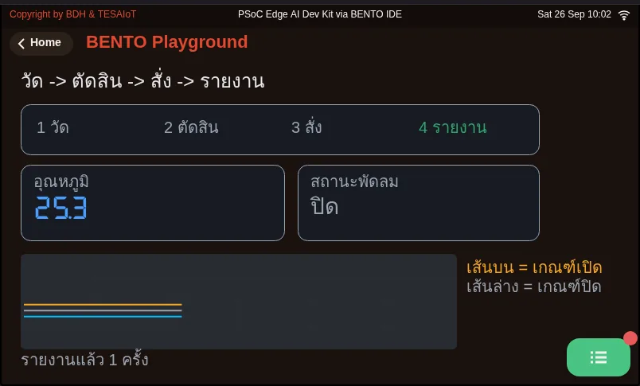
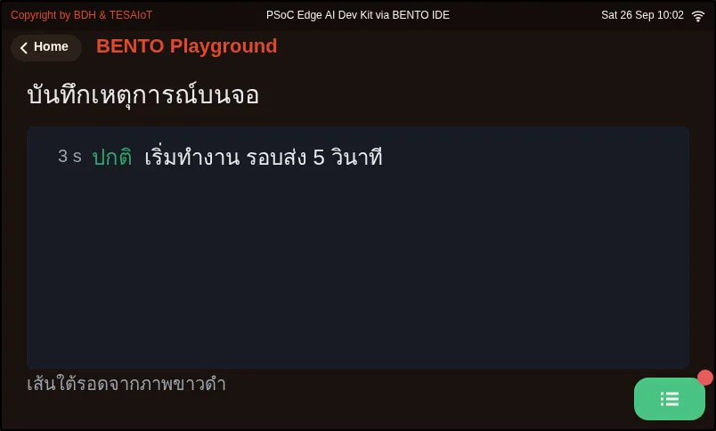
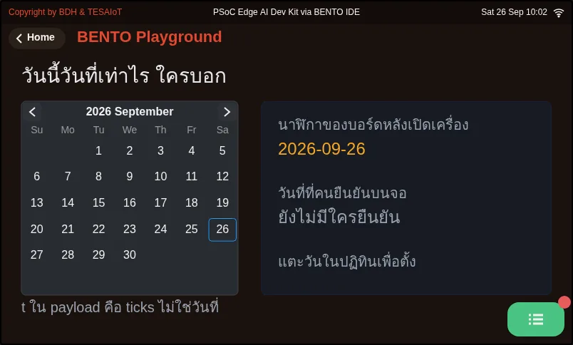
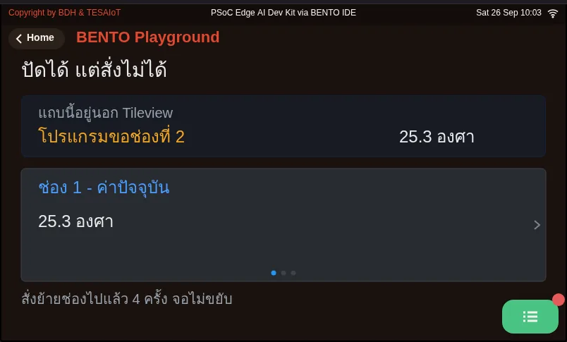

# Lesson 5.3 — Build and present your AIoT mini-product

> Module 5 — Capstone: AIoT Mini-Product · Slides: [slides.md](slides.md) · [Module overview](../README.md) · [Course page](../../README.md)

Fill the five "team writes this" spots of the starter with your own problem, test the threshold by hand and with the network cut, then present your mini-product in 10 minutes against a pass / not-yet checklist.

## Objectives

By the end of this lesson you will be able to:

1. Replace the five "team writes this" spots in s12_capstone_starter.py with your team's problem (read_value, on_state_change, your widgets, the schema and the offline behaviour) while the file still runs the full Sense → Decide → Show → Send loop for at least 10 minutes
2. Test the alert threshold by hand and with the network cut, and explain how confirming several rounds, latching the state and a minimum gap between alerts each solve a different problem
3. Present the work in 10 minutes in four parts (problem → architecture → live demo → limitations) and check yourself beforehand with the seven pass / not-yet criteria

## Before you start

You must have your team's five-box canvas and schema table from lesson 5.1, and know the starter's five moves from lesson 5.2.
Have ready a WiFi network or hotspot the board can connect to, and a program to watch messages on the broker (such as MQTT Explorer).
Edit the practice file's CONFIG block to your own first: a unique `DEVICE_ID` (such as `nok4821`, because the broker is public), WiFi, broker and a topic using the same code.

- **Equipment:** an Eva Kit or TESAIoT Dev Kit board with the BENTO MicroPython firmware installed, or the BENTO Emulator in [BENTO IDE](https://ide.tesaiot.dev/) (the structure and screen can run on the Emulator, but testing thresholds by hand with a real sensor and showing a network cut needs a real board, because sensor values on the Emulator are simulated)
- **Before this:** [Lesson 5.2 — The starter: Sense, Decide, Show, Send](../l02-capstone-starter/README.md)

## Concepts

The starter is not a fill-in-the-blank puzzle — it is a complete, already-running loop. The logic inside it is just an example (measuring tilt angle).
The team's job is to replace it with your own problem at the five spots marked "the team writes this", and the given screen is a checklist of what
a control screen must have in full: a measured value with its range, state shown as lamps rather than coloured text, separate on and off buttons,
and a confirmation box on any command that moves something real.

The finished example in the solution carries the scaffold-tilt-alarm problem all the way through. **Sense** remembers ten readings of the "starting pose" at startup,
then measures against that pose, and combines roll and pitch with the Pythagorean formula so a tilt in any direction is counted. **Decide** layers three mechanisms:
confirming 3 rounds (`CONFIRM_N`) to guard against a single jolt, latching the state (`latched`) until someone presses acknowledge, and a minimum gap
(`ALERT_GAP_MS`) to guard against rapid-fire alerts while the value oscillates around the threshold. The line `beacon(True)` lights the real LED and the on-screen lamp together,
so the screen can never say the lamp is on while the LED is actually off.

On the network side, `send()` returns `False` when the link drops, so the counter only counts messages that really went out. Once back online, it sends `back`,
and pressing acknowledge sends `ack`, so the receiving side never has to guess. All five buttons read from the same `ui.poll()`, and no widget
is created inside the loop — the confirmation box and its answer buttons are all created at the start and hidden.

The five-move order runs from most trustworthy to least: sensor → logic → screen → network, and surviving a dropped network is placed last,
because you must first know what can break. The file `06_sense_decide_act_report.py` connects a full measure → decide → command something real → report loop
you can see with your own eyes, using two thresholds (open at 27.5, close at 26.5) to keep the on/off command from flip-flopping while the value sits right around the threshold.

## Worked example

Start with `06_sense_decide_act_report.py` to see the full four-stage loop run on screen, then try changing stage 1 to a different value without touching stages 2 to 4
(the challenge at the end of the file). Files `07` through `09` are extras for your team's screen: an event log readable even photocopied in black and white with `ui.SpanGroup`,
setting the board's date with `ui.Calendar`, and a multi-page screen a finger can swipe with Tileview.

| File | What this file teaches |
|---|---|
| [examples/06_sense_decide_act_report.py](examples/06_sense_decide_act_report.py) | The full four-stage loop in one file |
| [examples/07_spangroup_event_log.py](examples/07_spangroup_event_log.py) | An event log on screen, still readable when photocopied in black and white |
| [examples/08_calendar_sets_the_clock.py](examples/08_calendar_sets_the_clock.py) | The board does not know what today's date is — so who tells it |
| [examples/09_tileview_swipe_only.py](examples/09_tileview_swipe_only.py) | A screen a finger can navigate, but the program cannot |

**Screens from the BENTO Emulator** for this lesson's examples (click a file name to open the code)

<figure><figcaption><a href="examples/06_sense_decide_act_report.py"><code>06_sense_decide_act_report.py</code></a> The full four-stage loop in one file</figcaption></figure>
<figure><figcaption><a href="examples/07_spangroup_event_log.py"><code>07_spangroup_event_log.py</code></a> An event log on screen, still readable when photocopied in black and white</figcaption></figure>
<figure><figcaption><a href="examples/08_calendar_sets_the_clock.py"><code>08_calendar_sets_the_clock.py</code></a> The board does not know what today&#x27;s date is — so who tells it</figcaption></figure>
<figure><figcaption><a href="examples/09_tileview_swipe_only.py"><code>09_tileview_swipe_only.py</code></a> A screen a finger can navigate, but the program cannot</figcaption></figure>

## Practice

The practice file runs even before anything is changed. Recommended order: **one**, run the bare starter successfully first. **Two**, change `read_value()` to your team's own.
**Three**, set the threshold in CONFIG and test by hand that it alerts when it should. **Four**, dress up the screen. **Five**, adjust the schema.
**Six**, test with the network cut. Never skip step three — a threshold never tested by hand is a hope, not a threshold.

| Practice file | Topic |
|---|---|
| [practice/s12_capstone_starter.py](practice/s12_capstone_starter.py) | A mini-product starter structure: Sense -> Decide -> Show -> Send |

## Solution

Open the solution after trying on your own at least once, and read [how to use the solutions](../../README.md#วิธีใช้เฉลย) first.

| Solution | Goes with |
|---|---|
| [solution/s12_capstone_starter.py](solution/s12_capstone_starter.py) | [practice/s12_capstone_starter.py](practice/s12_capstone_starter.py) |

## Check your understanding

The same questions are in [quiz.yaml](quiz.yaml) for automatic marking.

1. Order the recommended steps for working with the practice file. *(order · objective 1)*
   - A) Set the threshold in CONFIG and test by hand that it alerts when it should
   - B) Run the bare starter successfully first
   - C) Test with the network cut
   - D) Change read_value() to the team's own quantity
   - E) Dress up the screen, then adjust the schema

   

Solution

   **B → D → A → E → C** — Start from a structure that already runs, then change the measured value, set and hand-test the threshold, dress up the screen and schema, and test the network drop as the last step. Testing the threshold by hand must never be skipped, or you will find out during the presentation that it does not alert.

   

2. A team put its confirmation question inside a ui.MsgBox button, but pressing it does nothing. What should they do? *(choose one · objective 1)*
   - A) Create a new ui.MsgBox every time in the loop, so the button responds
   - B) Use two real ui.Buttons as the answer, created at the start and .hide()den, then .show()n when asking
   - C) Add time.sleep_ms(2000) after ui.poll() to give the button time to send its event
   - D) Make the text in the box longer so the button becomes pressable

   

Solution

   **B** — A button built into MsgBox does not send an event Python can see. Use a real ui.Button as the answer instead, and create everything before entering the loop, because creating a widget while someone is waiting for an answer adds delay at the worst possible moment.

   

3. In the solution, why must a value stay over the threshold for 3 rounds in a row (CONFIRM_N) before the state changes to ALERT? *(choose one · objective 2)*
   - A) To guard against a single jolt, such as someone bumping into it, while still responding within about six-tenths of a second at a 200 ms loop
   - B) Because the broker only accepts a message every 3 rounds
   - C) To average the value with the gyro across all three axes
   - D) To cut ui.poll()'s workload down to a third

   

Solution

   **A** — 3 rounds × 200 ms is about 0.6 seconds, long enough that a real event is still ongoing, but short enough not to feel slow. The minimum gap and the latched state solve different problems.

   

4. Which pairs correctly match a mechanism in the solution with the problem it solves? Choose every correct one. *(choose all that apply · objective 2)*
   - A) ALERT_GAP_MS — guards against rapid-fire alerts while the value oscillates around the threshold
   - B) latched — holds the state until someone presses acknowledge, because an event nobody sees is the same as one that never happened
   - C) beacon(True) — lights the real LED and the on-screen lamp from one line, so the screen can never say the lamp is on while the LED is off
   - D) counting sent on every call to send(), because send() always succeeds

   

Solution

   **A, B, C** — send() returns False when the link drops, so the solution only counts messages that really went out — the number on screen must never lie. The first three are each mechanism's reason, exactly as the slides explain.

   

5. In the 10-minute presentation, which of these passes the "knows its own limitations" criterion? *(choose one · objective 3)*
   - A) Say the system works in every case, with no limitations at all
   - B) State at least 2 limitations with a technical reason for each, and say what would be done with two more weeks
   - C) Play a pre-recorded video instead of a live demo, so the limitations never show
   - D) Skip part 4 to finish on time

   

Solution

   **B** — Part 4 is where the audience checks whether the team really understands its own work — it must never be skipped. Answering "no limitations" or dodging with a pre-recorded video both count as not-yet.

   

## Lab

**The capstone's passing criteria** (check yourself first; if learning in a group, have a classmate or your organiser check too)

- [ ] All five canvas boxes in your learning log are filled, and you can tell the problem in 30 seconds
- [ ] The board reads a sensor → decides → shows on screen in a full loop, running continuously for at least 10 minutes
- [ ] A message reaches the broker on the team's topic, and can be shown to someone else in MQTT Explorer
- [ ] The payload is JSON following your team's designed schema, with a unit and a device id
- [ ] Cutting the network still leaves the screen working, showing an offline status, and it reconnects itself once the network returns
- [ ] The screen passes the four control-panel rules: value with its range · state as lamps · separate on and off buttons · a confirmation box on any command that moves something real
- [ ] A 10-minute presentation covering all four parts, answering at least 2 questions about your own system's limitations

**Check the presentation against seven headings** (pass or not-yet): a clear problem · a readable architecture · a sensible schema · a successful live demo ·
failure tested · knows its own limitations · on time. Rehearse it once for another team, then have them tell back what they understood your team did.

## Going further

After finishing the course, pick one path and record it in your learning log: move the work to send over encrypted TLS with `tesaiot.connect()` (lessons 4.7–4.9);
let a field technician set up WiFi themselves through `wifi.softap()` and `tesaiot.config_set()`; make the device last for months; or design a topic
for fifty devices. More applied examples live in [shared/usecase](../../shared/usecase/README.md).

This is the final lesson of the course. Go back to the [course page](../../README.md) to see where to go next.

## Reflect

- If your team had two more weeks, which limitation would you fix first, and why?
- When the network drops, did your team choose "drop" or "keep for later", and what does the person using the data at the destination gain or lose from that choice?
- Which part of the code could the team swap in a different problem without touching anything else, and which part is still tied together?
