<style>
section { font-size: 23px; padding: 14px 44px; justify-content: flex-start; }
section h1 { font-size: 1.45em; line-height: 1.10; margin: 0 0 .14em; }
section h2 { font-size: 1.10em; margin: .06em 0; }
section h3 { font-size: 1.0em; margin: .12em 0; }
section p, section li { margin: .05em 0; line-height: 1.16; }
section img { max-width: 100%; height: auto; }
section svg { max-height: 205px; width: 100%; }
section table { font-size: .70em; }
section pre { font-size: .55em; line-height: 1.12; background:#0d1117; color:#e6edf3; border:1px solid #30363d; border-radius:8px; padding:12px 16px; box-shadow:0 2px 8px rgba(0,0,0,.25); }
section pre code { white-space: pre-wrap; background:transparent; color:inherit; } section pre .hljs-comment{color:#8b949e;font-style:italic} section pre .hljs-keyword,section pre .hljs-built_in,section pre .hljs-literal{color:#ff7b72} section pre .hljs-string{color:#a5d6ff} section pre .hljs-number{color:#79c0ff} section pre .hljs-title,section pre .hljs-title.function_,section pre .hljs-section{color:#d2a8ff} section pre .hljs-meta{color:#ffa657} section pre .hljs-attr,section pre .hljs-attribute,section pre .hljs-name{color:#7ee787}
section blockquote { margin: .12em 0; font-size: .88em; }
/* two images on a line (parity / 2x2 grids) stay side-by-side and small */
section p > img + img { margin-left: 10px; }
/* scroll-within-slide: dense slides scroll instead of clipping */
section { overflow-y: auto; overflow-x: hidden; }
section::-webkit-scrollbar { width: 11px; }
section::-webkit-scrollbar-thumb { background:#4a90d9; border-radius:6px; }
section::-webkit-scrollbar-track { background:rgba(0,0,0,.06); }
/* image drop-shadow + cover-slide readability (auto) */
section img{filter:drop-shadow(0 3px 12px rgba(0,0,0,.5))}
/* พื้นสำรองของสไลด์ปก: ถ้า img/cover_sNN.svg โหลดไม่ขึ้น ธีมจะคืนพื้นขาว
   แล้วตัวอักษรสีขาวของปกจะหายไปทั้งแผ่น — ปักสีเข้มไว้ให้ภาพเป็นแค่ของประดับ */
section.cover{background-color:#0b1426}
section.cover *{color:#fff !important}
section.cover h1,section.cover h2,section.cover h3,section.cover p,section.cover li,section.cover strong,section.cover em,section.cover blockquote,section.cover div{text-shadow:0 2px 9px rgba(0,0,0,.92),0 0 3px rgba(0,0,0,.8)}
section.cover div[style*="background:#"],section.cover div[style*="background: #"]{background:rgba(10,14,20,.66) !important;border-color:rgba(120,200,255,.45) !important;max-width:62%}
section.cover blockquote{border-left:4px solid rgba(120,200,255,.6) !important;background:rgba(13,17,23,.55) !important;border-radius:6px;padding:.3em .6em}
section.cover h1,section.cover h2,section.cover h3,section.cover p,section.cover blockquote{max-width:60%}
section.cover div:not(:has(img)){max-width:62%}
section.cover img{filter:none}
</style>


<!-- _class: cover -->

# บทเรียน 5.3 — สร้างและนำเสนอ AIoT mini-product

## Capstone · AIoT Mini-Product ของทีมเรา: จากโจทย์จริง สู่ของที่ใช้งานได้

**โมดูล 5 — Capstone: AIoT Mini-Product**

> ต่อจากบทเรียน 5.2 — โครงตั้งต้น: Sense Decide Show Send

---

## MVP checkpoint — ผ่านชุดบทเรียนนี้เมื่อ


**demo end-to-end + นำเสนอ 10 นาที (ปัญหา→สถาปัตยกรรม→demo→ข้อจำกัด)**

แปลเป็นสิ่งที่ตรวจได้จริง:

- [ ] canvas ห้าช่องในบันทึกการเรียนกรอกครบ และเล่าโจทย์ได้ใน 30 วินาที
- [ ] บอร์ดอ่านเซนเซอร์ → ตัดสิน → แสดงบนจอ ครบวงจร รันต่อเนื่องได้อย่างน้อย 10 นาที
- [ ] มีข้อความขึ้น broker ที่ topic ของทีม และเปิดให้ผู้สอนดูใน MQTT Explorer ได้
- [ ] payload เป็น JSON ตาม schema ที่ทีมเขียนไว้ในบันทึกการเรียน มีหน่วยและ device id
- [ ] ตัดเน็ตแล้วจอยังทำงาน ขึ้นสถานะ offline และต่อกลับเองเมื่อเน็ตกลับมา
- [ ] **หน้าจอผ่านสี่ข้อของแผงควบคุม** — ค่ามาพร้อมพิสัย · สถานะเป็นไฟไม่ใช่ตัวอักษรสี · ปุ่มเปิดกับปุ่มปิดแยกกัน · คำสั่งที่ทำให้ของจริงขยับมีกล่องยืนยันที่บอกว่าจะเกิดอะไร
- [ ] นำเสนอ 10 นาทีครบสี่ช่วง และตอบคำถามข้อจำกัดของระบบตัวเองได้อย่างน้อย 2 ข้อ

> ข้อที่ห้าถึงเจ็ดคือข้อที่แยกทีมที่ทำ product ออกจากทีมที่ทำ demo

---

## กับดักที่เจอบ่อย

| อาการ | สาเหตุที่แท้จริง | วิธีแก้ |
|---|---|---|
| จอค้าง widget หายไปพักหนึ่ง | ลืม `ui.poll()` ในลูป | เรียก `ui.poll()` ทุกรอบก่อน `sleep_ms` |
| ค่าบนจอวิ่งกระตุก เฟรมหาย | ลูปเร็วเกินไป | `time.sleep_ms(200)` สำหรับหน้าจอหนัก |
| ตัวอักษรเล็กใหญ่ผิดคาด | เข้าใจว่า `value=` ของ Label คือค่าที่แสดง | `value=` คือขนาดฟอนต์ (14/16/20/24/28) ใช้ `.text()` แสดงค่า |
| เตือนถี่จนไม่มีใครสนใจ | ส่งทุกครั้งที่ค่าเกินเกณฑ์ | ส่งตอนสถานะ *เปลี่ยน* + เว้นระยะขั้นต่ำ + ยืนยันหลายรอบ |
| ข้อความของทีมอื่นโผล่มาปนกัน | ใช้ topic ซ้ำกัน หรือ `client_id` ซ้ำ | ใช้ `bento/teamNN/...` และ `client_id` ของทีมเสมอ |
| บอร์ดหลุดจาก broker สลับไปมา | สองบอร์ดใช้ `client_id` เดียวกัน | ตั้ง `DEVICE_ID` ให้ไม่ซ้ำ |
| โปรแกรมค้างนานตอนเริ่ม | `wifi.connect()` บล็อกอยู่ (รหัสผิดจะนานมาก) | ตรวจรหัสก่อน แล้วรอให้มันตอบ อย่ารันซ้ำทับ |
| `sensors` อ่านค่าไม่ขยับหลังใช้ ui | การใช้ `ui.*` ครั้งแรกหยุด sensor auto-task | อ่านเซนเซอร์แบบ sync ในลูปเอง (โครงทำให้แล้ว) |
| ค่ากระโดดเป็นศูนย์ทุกครั้งที่จอวาด | เผลอเรียก `sensors.scan()` | ห้ามใช้ `sensors.scan()` เด็ดขาดในคอร์สนี้ |
| กดปุ่มในกล่อง `ui.MsgBox` แล้วไม่มีอะไรเกิดขึ้น | ปุ่มในตัว MsgBox ยังไม่ส่งเหตุการณ์กลับมาให้ Python เห็น | ใช้ `ui.Button` จริงสองตัวเป็นคำตอบ สร้างแล้ว `.hide()` ไว้ แล้ว `.show()` ตอนถาม |
| ข้อความในกล่องยืนยันขาดครึ่ง | ข้อความของ MsgBox เดินทางกับ CREATE ซึ่งพาได้ 95 ไบต์ ไทยตัวละ 3 ไบต์ (เฟิร์มแวร์ 2026-08-20 ขึ้นไปส่งส่วนเกินซ้ำได้ถึง 126 ไบต์ตามซอร์ส ยังต้องยืนยันบนบอร์ด) | เขียนให้สั้นกว่า 31 ตัวอักษร แล้วเปิดภาพดูจริงว่าไม่ถูกตัด |
| เปลี่ยนสีแท่ง `ui.Bar` แล้วดูเหมือนแท่งเต็มทั้งราง | `.color()` ของ Bar ไปลงที่รางไม่ใช่แถบที่เต็ม | อย่าเปลี่ยนสีแท่งตอนรัน ให้ `ui.Led` หรือสีตัวเลขเป็นคนบอกสถานะ |
| ป้ายสถานะกับไฟบนจอไม่ตรงกันชั่วครู่ | ป้ายถูกกั้นด้วยประตูวินาที แต่ไฟขยับทุกรอบ | เขียนป้ายสถานะตอน "เปลี่ยน" ส่วนประตูวินาทีใช้กับตัวเลขเท่านั้น |

> กับดักครึ่งหนึ่งในตารางนี้เป็นเรื่องการออกแบบจังหวะเวลา ไม่ใช่เรื่องไวยากรณ์ภาษา — และสี่ข้อล่างสุด **ไม่มี error ให้จับสักตัว** มีแต่จอที่ผิด

---

## ลงมือทำ — ห้าจุดที่เขียนว่า "ทีมเขียนเอง"

<svg viewBox="0 0 940 220" xmlns="http://www.w3.org/2000/svg">
  <defs><marker id="w1" markerWidth="10" markerHeight="8" refX="9" refY="4" orient="auto">
    <path d="M0,0 L10,4 L0,8 z" fill="#607d8b"/></marker></defs>
  <rect x="14" y="52" width="172" height="88" rx="9" fill="#e3f2fd" stroke="#1565c0" stroke-width="2"/>
  <text x="100" y="82" text-anchor="middle" font-size="18" font-weight="700" fill="#1565c0">read_value()</text>
  <text x="100" y="110" text-anchor="middle" font-size="17" fill="#0d47a1">ปริมาณของทีม</text>
  <rect x="196" y="52" width="172" height="88" rx="9" fill="#e8f5e9" stroke="#2e7d32" stroke-width="2"/>
  <text x="282" y="82" text-anchor="middle" font-size="18" font-weight="700" fill="#2e7d32">เกณฑ์ใน CONFIG</text>
  <text x="282" y="110" text-anchor="middle" font-size="17" fill="#1b5e20">ทดสอบด้วยมือจริง</text>
  <rect x="378" y="52" width="172" height="88" rx="9" fill="#fff3e0" stroke="#ef6c00" stroke-width="2"/>
  <text x="464" y="82" text-anchor="middle" font-size="18" font-weight="700" fill="#ef6c00">on_state_change</text>
  <text x="464" y="106" text-anchor="middle" font-size="16" fill="#e65100">นับ จดเวลา</text>
  <text x="464" y="128" text-anchor="middle" font-size="16" fill="#e65100">เปลี่ยนจอ</text>
  <rect x="560" y="52" width="172" height="88" rx="9" fill="#f3e5f5" stroke="#6a1b9a" stroke-width="2"/>
  <text x="646" y="82" text-anchor="middle" font-size="18" font-weight="700" fill="#6a1b9a">widget + schema</text>
  <text x="646" y="110" text-anchor="middle" font-size="17" fill="#4a148c">งบรวมไม่เกิน 64</text>
  <rect x="742" y="52" width="184" height="88" rx="9" fill="#ffebee" stroke="#c62828" stroke-width="2">
    <animate attributeName="stroke-width" values="2;5;2" dur="2.4s" repeatCount="indefinite"/></rect>
  <text x="834" y="82" text-anchor="middle" font-size="18" font-weight="700" fill="#c62828">ออฟไลน์: ทิ้งหรือเก็บ</text>
  <text x="834" y="110" text-anchor="middle" font-size="17" fill="#8d3b3b">ทดสอบตอนเน็ตหลุด</text>
  <line x1="186" y1="96" x2="194" y2="96" stroke="#607d8b" stroke-width="3" marker-end="url(#w1)"/>
  <line x1="368" y1="96" x2="376" y2="96" stroke="#607d8b" stroke-width="3" marker-end="url(#w1)"/>
  <line x1="550" y1="96" x2="558" y2="96" stroke="#607d8b" stroke-width="3" marker-end="url(#w1)"/>
  <line x1="732" y1="96" x2="740" y2="96" stroke="#607d8b" stroke-width="3" marker-end="url(#w1)"/>
  <text x="470" y="34" text-anchor="middle" font-size="20" font-weight="700" fill="#37474f">ลำดับที่แนะนำ — รันโครงเปล่าให้ผ่านก่อนเสมอ</text>
  <text x="470" y="176" text-anchor="middle" font-size="19" font-weight="700" fill="#c62828">ห้ามข้ามขั้นตั้งเกณฑ์ — ทีมที่ตั้งจากการเดาแล้วไม่เคยทดสอบ จะไปเจอตอนนำเสนอหน้าห้องว่ามันไม่เตือน</text>
  <text x="470" y="204" text-anchor="middle" font-size="18" fill="#455a64">เกณฑ์ที่ยังไม่เคยถูกทดสอบด้วยมือ ไม่ใช่เกณฑ์ มันคือความหวัง</text>
</svg>

```python
    # ทีมเขียนเอง: เปลี่ยนบรรทัดล่างเป็นปริมาณที่โจทย์ของทีมสนใจจริง ๆ
    return smooth.update(abs(roll))

def on_state_change(old, new, value):
    pass  # ทีมเขียนเอง: ตอนสถานะเปลี่ยนให้เกิดอะไร

    # ทีมเขียนเอง: เพิ่ม widget ของทีม (งบรวมทั้งจอไม่เกิน 64 ตัว ตอนนี้ใช้ไป 31)

    # ทีมเขียนเอง: เพิ่มหรือตัดฟิลด์ให้ตรงกับตาราง schema ที่ทีมออกแบบไว้ในบันทึกการเรียน

                pass  # ทีมเขียนเอง: ออฟไลน์แล้วจะ "ทิ้ง" หรือ "เก็บไว้ส่งทีหลัง"
```

ลำดับที่แนะนำ: **หนึ่ง** รันโครงเปล่าให้ผ่านก่อน **สอง** เปลี่ยน `read_value()` เป็นของทีม **สาม** ตั้งเกณฑ์ใน CONFIG แล้วทดสอบด้วยมือจริงว่ามันเตือนตอนที่ควรเตือน **สี่** แต่งหน้าจอ **ห้า** ปรับ schema **หก** ทดสอบตอนเน็ตหลุด

ห้ามข้ามข้อสาม: ทีมที่ตั้งเกณฑ์จากการเดาแล้วไม่เคยทดสอบ จะไปเจอตอนนำเสนอหน้าห้องว่ามันไม่เตือน

> เกณฑ์ที่ยังไม่เคยถูกทดสอบด้วยมือ ไม่ใช่เกณฑ์ มันคือความหวัง

---

## นำเสนอ 10 นาที — เรียงแบบนี้แล้วคนฟังเข้าใจ

<svg viewBox="0 0 940 226" xmlns="http://www.w3.org/2000/svg">
  <text x="20" y="34" font-size="20" font-weight="700" fill="#37474f">run-sheet สิบนาที — ซ้อมจับเวลาอย่างน้อยหนึ่งรอบ</text>
  <rect x="20" y="52" width="176" height="70" rx="8" fill="#e3f2fd" stroke="#1565c0" stroke-width="2"/>
  <text x="108" y="80" text-anchor="middle" font-size="19" font-weight="700" fill="#1565c0">1 · ปัญหา</text>
  <text x="108" y="106" text-anchor="middle" font-size="18" fill="#0d47a1">2 นาที</text>
  <rect x="204" y="52" width="176" height="70" rx="8" fill="#e8f5e9" stroke="#2e7d32" stroke-width="2"/>
  <text x="292" y="80" text-anchor="middle" font-size="19" font-weight="700" fill="#2e7d32">2 · สถาปัตยกรรม</text>
  <text x="292" y="106" text-anchor="middle" font-size="18" fill="#1b5e20">2 นาที</text>
  <rect x="388" y="52" width="352" height="70" rx="8" fill="#fff3e0" stroke="#ef6c00" stroke-width="3"/>
  <text x="564" y="80" text-anchor="middle" font-size="19" font-weight="700" fill="#ef6c00">3 · demo สด + ตัดเน็ตให้ดู</text>
  <text x="564" y="106" text-anchor="middle" font-size="18" fill="#e65100">4 นาที — ช่วงที่ยาวที่สุด</text>
  <rect x="748" y="52" width="176" height="70" rx="8" fill="#f3e5f5" stroke="#6a1b9a" stroke-width="2"/>
  <text x="836" y="80" text-anchor="middle" font-size="19" font-weight="700" fill="#6a1b9a">4 · ข้อจำกัด</text>
  <text x="836" y="106" text-anchor="middle" font-size="18" fill="#4a148c">2 นาที</text>
  <line x1="20" y1="140" x2="924" y2="140" stroke="#b0bec5" stroke-width="4"/>
  <circle r="9" fill="#c62828" cx="22" cy="140"><animateMotion path="M0,0 L900,0" dur="8s" repeatCount="indefinite"/></circle>
  <text x="146" y="176" text-anchor="middle" font-size="18" fill="#8d3b3b">พลาดบ่อย: อวดบอร์ดก่อนเล่าปัญหา</text>
  <text x="292" y="200" text-anchor="middle" font-size="18" fill="#8d3b3b">พลาดบ่อย: ไล่อธิบายโค้ดทีละบรรทัด</text>
  <text x="564" y="176" text-anchor="middle" font-size="18" fill="#8d3b3b">พลาดบ่อย: ฉายวิดีโอที่อัดไว้แทนของจริง</text>
  <text x="808" y="200" text-anchor="middle" font-size="18" fill="#8d3b3b">พลาดบ่อย: บอกว่าไม่มีข้อจำกัด</text>
</svg>

| ช่วง | เวลา | สิ่งที่ต้องพูด | ที่คนมักพลาด |
|---|---|---|---|
| 1 · ปัญหา | 2 นาที | ใครเดือดร้อน เดือดร้อนยังไง วันนี้เขาแก้ยังไงอยู่ | เริ่มด้วยการอวดบอร์ดแทนการเล่าปัญหา |
| 2 · สถาปัตยกรรม | 2 นาที | canvas ห้าช่อง + schema ที่ส่งจริง | ไล่อธิบายโค้ดทีละบรรทัด |
| 3 · demo สด | 4 นาที | ทำให้มันเตือนต่อหน้าคนดู + โชว์ข้อความบน broker + **ตัดเน็ตให้ดู** | ฉายวิดีโอที่อัดไว้แทนของจริง |
| 4 · ข้อจำกัดและก้าวต่อไป | 2 นาที | สิ่งที่ระบบนี้ยังทำไม่ได้ และถ้ามีเวลาอีกสองสัปดาห์จะทำอะไร | บอกว่า "ไม่มีข้อจำกัด" |

เตรียม **แผนสำรอง** ไว้เสมอ: WiFi ห้องเรียนล่มตอนนำเสนอเป็นเรื่องที่เกิดขึ้นจริง ทีมที่ออกแบบ offline mode ไว้ดี จะเปลี่ยนอุบัติเหตุนั้นให้กลายเป็นจุดขายของตัวเองได้ทันที

ซ้อมจับเวลาอย่างน้อยหนึ่งรอบ สิบนาทีสั้นกว่าที่ทุกทีมคิดเสมอ

> ช่วงที่ 4 คือช่วงที่กรรมการดูว่าทีมเข้าใจงานตัวเองจริงไหม ห้ามข้าม

---

## เกณฑ์การนำเสนอ — ใช้ตรวจตัวเองก่อนขึ้นพูด

<svg viewBox="0 0 940 232" xmlns="http://www.w3.org/2000/svg">
  <text x="20" y="32" font-size="20" font-weight="700" fill="#37474f">เจ็ดหัวข้อ — ติ๊กให้ครบก่อนขึ้นพูดจริง</text>
  <rect x="20" y="46" width="24" height="24" rx="4" fill="#ffffff" stroke="#2e7d32" stroke-width="2"/>
  <text x="56" y="65" font-size="19" fill="#37474f">ปัญหาชัด — วัดความเดือดร้อนเป็นเวลาหรือเงิน</text>
  <rect x="20" y="80" width="24" height="24" rx="4" fill="#ffffff" stroke="#2e7d32" stroke-width="2"/>
  <text x="56" y="99" font-size="19" fill="#37474f">สถาปัตยกรรมอ่านออก — คนฟังวาด canvas ตาม</text>
  <rect x="20" y="114" width="24" height="24" rx="4" fill="#ffffff" stroke="#2e7d32" stroke-width="2"/>
  <text x="56" y="133" font-size="19" fill="#37474f">schema สมเหตุผล — ทุกฟิลด์อธิบายได้ มีหน่วย</text>
  <rect x="20" y="148" width="24" height="24" rx="4" fill="#ffffff" stroke="#2e7d32" stroke-width="2"/>
  <text x="56" y="167" font-size="19" fill="#37474f">demo สดผ่าน — เตือนได้จริงต่อหน้าคนดู</text>
  <rect x="490" y="46" width="24" height="24" rx="4" fill="#ffffff" stroke="#c62828" stroke-width="3">
    <animate attributeName="stroke-width" values="3;6;3" dur="2.4s" repeatCount="indefinite"/></rect>
  <text x="526" y="65" font-size="19" font-weight="700" fill="#c62828">ทดสอบการพัง — ตัดเน็ตให้ดู</text>
  <rect x="490" y="80" width="24" height="24" rx="4" fill="#ffffff" stroke="#c62828" stroke-width="3">
    <animate attributeName="stroke-width" values="3;6;3" dur="2.4s" begin="0.5s" repeatCount="indefinite"/></rect>
  <text x="526" y="99" font-size="19" font-weight="700" fill="#c62828">รู้ข้อจำกัดตัวเอง — อย่างน้อย 2 ข้อ</text>
  <rect x="490" y="114" width="24" height="24" rx="4" fill="#ffffff" stroke="#2e7d32" stroke-width="2"/>
  <text x="526" y="133" font-size="19" fill="#37474f">ตรงเวลา — จบใน 10 นาที ครบสี่ช่วง</text>
  <rect x="490" y="152" width="430" height="66" rx="9" fill="#e8f5e9" stroke="#2e7d32" stroke-width="2"/>
  <text x="705" y="180" text-anchor="middle" font-size="19" font-weight="700" fill="#2e7d32">การซ้อมที่ได้ผลที่สุด</text>
  <text x="705" y="206" text-anchor="middle" font-size="18" fill="#1b5e20">ให้เพื่อนอีกทีมฟัง แล้วให้เขาเล่ากลับมา</text>
  <text x="20" y="200" font-size="19" font-weight="700" fill="#c62828">สองข้อขวาบนคือข้อที่แยกทีมที่ทำ product</text>
  <text x="20" y="224" font-size="19" font-weight="700" fill="#c62828">ออกจากทีมที่ทำ demo</text>
</svg>

| หัวข้อ | ผ่าน | ยังไม่ผ่าน |
|---|---|---|
| ปัญหาชัด | บอกได้ว่าใครเดือดร้อน วัดความเดือดร้อนเป็นเวลาหรือเงินได้ | เล่าแต่ว่าทำอะไร ไม่บอกว่าเพื่อใคร |
| สถาปัตยกรรมอ่านออก | คนฟังวาด canvas ห้าช่องตามได้ | กระโดดเข้าโค้ดทันที |
| schema สมเหตุผล | ทุกฟิลด์อธิบายได้ว่าปลายทางใช้ทำอะไร มีหน่วยครบ | ส่งค่าดิบทุกอย่างเพราะ "เผื่อไว้" |
| demo สดผ่าน | ระบบเตือนได้จริงต่อหน้าคนดู และเห็นข้อความขึ้น broker | เปิดวิดีโอที่อัดไว้ |
| ทดสอบการพัง | ตัดเน็ตให้ดู แล้วอธิบายพฤติกรรมที่ออกแบบไว้ | ไม่เคยลอง |
| รู้ข้อจำกัดตัวเอง | บอกได้อย่างน้อย 2 ข้อ พร้อมเหตุผลเชิงเทคนิค | ตอบว่าใช้งานได้ทุกกรณี |
| ตรงเวลา | จบใน 10 นาที ครบทั้งสี่ช่วง | เกินเวลา หรือรีบข้ามช่วงที่ 4 |

**การซ้อมที่ได้ผลที่สุด:** ให้เพื่อนอีกทีมฟังก่อนหนึ่งรอบ แล้วให้เขาเล่ากลับมาว่าเข้าใจว่าทีมเราทำอะไร ถ้าเขาเล่าผิด แปลว่าเรายังเล่าไม่ชัด ไม่ใช่เขาฟังไม่เป็น

> ตารางนี้อยู่ในบันทึกการเรียนด้วย ติ๊กให้ครบก่อนขึ้นพูดจริง

---

## ตัวอย่างที่ทำเสร็จ — ส่วนที่หนึ่ง: Sense ที่เชื่อถือได้

<svg viewBox="0 0 940 224" xmlns="http://www.w3.org/2000/svg">
  <rect x="14" y="30" width="440" height="176" rx="9" fill="#fdf1f1" stroke="#c62828" stroke-width="2"/>
  <text x="234" y="58" text-anchor="middle" font-size="19" font-weight="700" fill="#c62828">ไม่หักค่าตั้งต้น</text>
  <line x1="44" y1="170" x2="424" y2="170" stroke="#ef9a9a" stroke-width="2"/>
  <line x1="44" y1="120" x2="424" y2="120" stroke="#c62828" stroke-width="2" stroke-dasharray="7 5"/>
  <text x="430" y="140" text-anchor="end" font-size="17" fill="#c62828">เกณฑ์ 15</text>
  <line x1="60" y1="170" x2="90" y2="104" stroke="#c62828" stroke-width="7"/>
  <text x="120" y="84" font-size="18" fill="#b71c1c">ติดเอียง 6 องศาตั้งแต่วันแรก</text>
  <text x="120" y="110" font-size="18" font-weight="700" fill="#b71c1c">เตือนตลอดไปโดยไม่มีอะไรผิด</text>
  <text x="234" y="196" text-anchor="middle" font-size="18" fill="#8d3b3b">ไม่มีใครติดตั้งอะไรได้ระนาบ 0 องศาเป๊ะ</text>
  <rect x="486" y="30" width="440" height="176" rx="9" fill="#f1f8f2" stroke="#2e7d32" stroke-width="2"/>
  <text x="706" y="58" text-anchor="middle" font-size="19" font-weight="700" fill="#2e7d32">จำท่าตั้งต้นสองวินาทีแรก</text>
  <line x1="516" y1="170" x2="896" y2="170" stroke="#a5d6a7" stroke-width="2"/>
  <line x1="532" y1="170" x2="562" y2="104" stroke="#90a4ae" stroke-width="7" stroke-dasharray="6 4"/>
  <text x="592" y="96" font-size="18" fill="#455a64">base_roll · base_pitch</text>
  <line x1="532" y1="170" x2="562" y2="104" stroke="#2e7d32" stroke-width="7">
    <animate attributeName="x2" values="562;586;562" dur="3s" repeatCount="indefinite"/>
    <animate attributeName="y2" values="104;118;104" dur="3s" repeatCount="indefinite"/></line>
  <text x="592" y="126" font-size="18" font-weight="700" fill="#1b5e20">วัดส่วนต่างจากท่าติดตั้ง</text>
  <text x="592" y="152" font-size="18" fill="#1b5e20">รวม roll กับ pitch แบบพีทาโกรัส</text>
  <text x="706" y="196" text-anchor="middle" font-size="18" fill="#4a7c4e">เอียงไปทางไหนก็นับ ไม่รอดสายตา</text>
</svg>

[`s12_capstone_starter.py`](https://github.com/tesaiot/tesa-qualification-program/blob/main/courses/aiot-micropython/m05-capstone/l03-build-and-present/solution/s12_capstone_starter.py) ทำโจทย์ที่ 6 (เตือนการเอียงของนั่งร้าน) จนจบ นี่คือ **คำตอบหนึ่งที่เป็นไปได้** ไม่ใช่คำตอบเดียว

```python
base_roll = 0.0
base_pitch = 0.0
for _ in range(10):
    r, p = raw_tilt()
    base_roll += r / 10.0
    base_pitch += p / 10.0
    time.sleep_ms(100)

def read_value():
    roll, pitch = raw_tilt()
    dr = roll - base_roll
    dp = pitch - base_pitch
    return smooth.update((dr * dr + dp * dp) ** 0.5)   # เอียงไปทางไหนก็นับเป็นการเอียง
```

สองวินาทีแรกของโปรแกรมใช้จำ "ท่าตั้งต้น" ของอุปกรณ์ เพราะไม่มีใครติดตั้งอะไรได้ระนาบ 0 องศาเป๊ะ ถ้าไม่หักค่าตั้งต้น อุปกรณ์ที่ติดเอียง 6 องศาตั้งแต่วันแรกจะเตือนตลอดไปโดยไม่มีอะไรผิด

การรวม roll กับ pitch ด้วยระยะทางแบบพีทาโกรัส ทำให้ "เอียงไปทางไหนก็นับ" — ถ้าใช้แค่ roll ตัวเดียว นั่งร้านที่เอียงไปข้างหน้าจะรอดสายตาไปเฉย ๆ

> ค่าที่วัดเทียบกับตัวเองตอนติดตั้ง มีความหมายกว่าค่าที่วัดเทียบกับแรงโน้มถ่วงเสมอ

---

## ตัวอย่างที่ทำเสร็จ — ส่วนที่สอง: Decide ที่ไม่หลอน

<style scoped>
section { font-size: .90em; }
</style>

<svg viewBox="0 0 940 224" xmlns="http://www.w3.org/2000/svg">
  <rect x="14" y="16" width="296" height="190" rx="9" fill="#e3f2fd" stroke="#1565c0" stroke-width="2"/>
  <text x="162" y="46" text-anchor="middle" font-size="20" font-weight="700" fill="#1565c0">CONFIRM_N = 3</text>
  <line x1="40" y1="120" x2="286" y2="120" stroke="#90caf9" stroke-width="2"/>
  <circle cx="70" cy="120" r="7" fill="#90caf9"/>
  <circle cx="120" cy="120" r="7" fill="#1565c0"/>
  <circle cx="170" cy="120" r="7" fill="#1565c0"/>
  <circle cx="220" cy="120" r="7" fill="#1565c0">
    <animate attributeName="r" values="7;13;7" dur="1.8s" repeatCount="indefinite"/></circle>
  <text x="162" y="158" text-anchor="middle" font-size="18" fill="#0d47a1">กันการสั่นวูบเดียวตอนมีคนเดินชน</text>
  <text x="162" y="186" text-anchor="middle" font-size="18" fill="#5472a3">3 x 200 ms = หกในสิบวินาที</text>
  <rect x="322" y="16" width="296" height="190" rx="9" fill="#fff3e0" stroke="#ef6c00" stroke-width="2"/>
  <text x="470" y="46" text-anchor="middle" font-size="20" font-weight="700" fill="#ef6c00">latched</text>
  <rect x="352" y="70" width="236" height="42" rx="7" fill="#ffe0b2" stroke="#ef6c00" stroke-width="2"/>
  <text x="470" y="98" text-anchor="middle" font-size="20" font-weight="700" fill="#e65100">ALERT ค้างอยู่</text>
  <rect x="392" y="122" width="156" height="34" rx="17" fill="#ef6c00">
    <animate attributeName="fill" values="#ef6c00;#ffcc80;#ef6c00" dur="1.6s" repeatCount="indefinite"/></rect>
  <text x="470" y="146" text-anchor="middle" font-size="18" font-weight="700" fill="#ffffff">รับทราบ</text>
  <text x="470" y="186" text-anchor="middle" font-size="17" fill="#a1683a">เหตุการณ์ที่ไม่มีใครเห็น = ไม่เคยเกิด</text>
  <rect x="630" y="16" width="296" height="190" rx="9" fill="#f1f8f2" stroke="#2e7d32" stroke-width="2"/>
  <text x="778" y="46" text-anchor="middle" font-size="20" font-weight="700" fill="#2e7d32">ALERT_GAP_MS</text>
  <line x1="656" y1="120" x2="902" y2="120" stroke="#a5d6a7" stroke-width="2"/>
  <circle cx="676" cy="120" r="8" fill="#2e7d32"/>
  <circle cx="778" cy="120" r="8" fill="#2e7d32"/>
  <circle cx="880" cy="120" r="8" fill="#2e7d32"/>
  <text x="778" y="158" text-anchor="middle" font-size="18" fill="#1b5e20">กันการเตือนรัวตอนค่าแกว่งรอบเกณฑ์</text>
  <text x="778" y="186" text-anchor="middle" font-size="18" fill="#4a7c4e">เตือน 30 ครั้ง/นาที = ถูกปิดเสียง</text>
</svg>

```python
    if level == pending:
        streak += 1
    else:
        pending = level
        streak = 1

    if streak >= CONFIRM_N and pending != state:
        state = pending
        if state == "ALERT":
            latched = True
            beacon(True)          # ของจริงขยับเอง ไม่ต้องรอคนกด
            ready = last_alert is None or time.ticks_diff(now, last_alert) >= ALERT_GAP_MS
            if ready:
                if send(value, state, "event"):
                    last_alert = now
                else:
                    missed += 1
```

สามกลไกซ้อนกันอยู่ตรงนี้ และแต่ละอันแก้ปัญหาคนละเรื่อง

**ยืนยัน 3 รอบ** (`CONFIRM_N`) กันการสั่นวูบเดียวตอนมีคนเดินชน — 3 รอบ × 200 ms คือหกในสิบวินาที นานพอให้ของจริงยังเกินอยู่ แต่สั้นพอที่จะไม่ช้า

**ค้างสถานะ** (`latched`) เพราะเหตุการณ์ที่ไม่มีใครเห็นเท่ากับไม่เคยเกิด สถานะจะค้างจนมีคนกดปุ่มรับทราบบนจอ · บรรทัด `beacon(True)` ทำสองอย่างพร้อมกันในฟังก์ชันเดียว คือ **จุดหลอดจริงบนบอร์ดและจุดไฟบนจอ** — จอที่บอกว่าไฟติดทั้งที่หลอดดับ คือจอที่โกหก และวิธีเดียวที่กันได้คือให้ทั้งสองอย่างออกจากบรรทัดเดียวกันเสมอ

**เว้นระยะขั้นต่ำ** (`ALERT_GAP_MS`) กันการเตือนรัวตอนค่าแกว่งรอบเกณฑ์ ระบบที่เตือนสามสิบครั้งใน 1 นาที จะถูกคนหน้างานปิดเสียงในสัปดาห์แรก

> ระบบเตือนภัยที่คนเลือกจะไม่ฟัง แย่กว่าไม่มีระบบเตือนภัย เพราะมันสร้างความมั่นใจปลอม ๆ

---

## ตัวอย่างที่ทำเสร็จ — ส่วนที่สาม: กลับมาออนไลน์ และปุ่มทั้งห้าในลูปเดียว

<style scoped>section pre{font-size:.6em;line-height:1.25} section p{margin:.15em 0}</style>

```python
    if (not online) and time.ticks_diff(now, t_retry) >= RETRY_MS:
        online = go_online()
        t_retry = now
        if online:
            if send(value, state, "back"):     # กลับมาแล้วบอกฝั่งรับทันที อย่าให้เขาเดา
                sent += 1
    ...
    for ev in ui.poll():           # ต้องเรียกทุกลูป ไม่งั้นจอจะซ่อน widget ราวสองวินาที
        if ev["type"] != "clicked":
            continue
        if ev["handle"] == btn_on.id():
            beacon(True)           # เปิดไม่ต้องถาม ย้อนกลับได้ด้วยปุ่มข้าง ๆ
        elif ev["handle"] == btn_off.id() and not asking:
            asking = True          # ปิดต้องถาม เพราะมันลบการเตือนของจริงทิ้ง
            box.show()
            ...
        elif ev["handle"] == btn_yes.id() and asking:
            asking = False
            beacon(False)
            ...
        elif ev["handle"] == btn_ack.id() and latched:
            latched = False
            if send(value, state, "ack"):
                sent += 1
```

**ปุ่มทั้งห้าตัวอ่านจาก `ui.poll()` เดียวกัน** และไม่มี widget ตัวไหนถูกสร้างในลูปเลย — กล่องยืนยันกับปุ่มคำตอบถูกสร้างพร้อมหน้าจอแล้วซ่อนไว้ตั้งแต่ต้น (สไลด์ "ท่าที่ 3 ต่อ") การสร้างของตอนคนกำลังรอคำตอบ คือการเพิ่มความหน่วงในจังหวะที่แย่ที่สุด · `send()` คืน `False` เมื่อสายหลุด จึงนับ `sent` เฉพาะใบที่ออกไปจริง — ตัวเลขบนจอต้องไม่โกหก

> กดรับทราบแล้วส่ง `ack` · กลับมาออนไลน์แล้วส่ง `back` — ฝั่งรับต้องไม่ต้องเดาว่าบอร์ดหายไปไหน

---

## ทำไมเรียงห้าท่าแบบนี้

<svg viewBox="0 0 940 216" xmlns="http://www.w3.org/2000/svg">
  <text x="20" y="34" font-size="20" font-weight="700" fill="#37474f">เรียงตามความน่าเชื่อถือจากมากไปน้อย</text>
  <rect x="20" y="52" width="172" height="82" rx="9" fill="#e8f5e9" stroke="#2e7d32" stroke-width="3"/>
  <text x="106" y="82" text-anchor="middle" font-size="19" font-weight="700" fill="#2e7d32">1 · Sense</text>
  <text x="106" y="110" text-anchor="middle" font-size="18" fill="#1b5e20">เชื่อค่าได้ก่อน</text>
  <rect x="206" y="52" width="172" height="82" rx="9" fill="#e3f2fd" stroke="#1565c0" stroke-width="3"/>
  <text x="292" y="82" text-anchor="middle" font-size="19" font-weight="700" fill="#1565c0">2 · Decide</text>
  <text x="292" y="110" text-anchor="middle" font-size="18" fill="#0d47a1">ตัดสินจบที่เดียว</text>
  <rect x="392" y="52" width="172" height="82" rx="9" fill="#fff3e0" stroke="#ef6c00" stroke-width="3"/>
  <text x="478" y="82" text-anchor="middle" font-size="19" font-weight="700" fill="#ef6c00">3 · Show</text>
  <text x="478" y="110" text-anchor="middle" font-size="18" fill="#e65100">จอไม่พึ่งเน็ต</text>
  <rect x="578" y="52" width="172" height="82" rx="9" fill="#f3e5f5" stroke="#6a1b9a" stroke-width="2" stroke-dasharray="6 5"/>
  <text x="664" y="82" text-anchor="middle" font-size="19" font-weight="700" fill="#6a1b9a">4 · Send</text>
  <text x="664" y="110" text-anchor="middle" font-size="18" fill="#4a148c">พึ่งสิ่งที่คุมไม่ได้</text>
  <rect x="764" y="52" width="162" height="82" rx="9" fill="#ffebee" stroke="#c62828" stroke-width="2" stroke-dasharray="6 5">
    <animate attributeName="stroke-width" values="2;5;2" dur="2.4s" repeatCount="indefinite"/></rect>
  <text x="845" y="82" text-anchor="middle" font-size="19" font-weight="700" fill="#c62828">5 · กันเน็ตหลุด</text>
  <text x="845" y="110" text-anchor="middle" font-size="18" fill="#8d3b3b">ทีมส่วนใหญ่ไม่มีเวลา</text>
  <rect x="20" y="146" width="544" height="14" rx="7" fill="#2e7d32" opacity="0.28"/>
  <text x="292" y="188" text-anchor="middle" font-size="19" font-weight="700" fill="#2e7d32">เส้นที่ยังทำงานเมื่อเน็ตหาย</text>
  <rect x="578" y="146" width="348" height="14" rx="7" fill="#c62828" opacity="0.28"/>
  <text x="752" y="188" text-anchor="middle" font-size="19" font-weight="700" fill="#c62828">เส้นที่พึ่งเน็ต — ล้มแล้วไม่ลากคนอื่นล้ม</text>
  <text x="470" y="212" text-anchor="middle" font-size="18" fill="#455a64">เขียน Show ก่อน Send เสมอ ไม่งั้นจะเผลอเขียนโค้ดที่จออัปเดตก็ต่อเมื่อส่งสำเร็จ</text>
</svg>

**ท่า 1 Sense มาก่อน** เพราะถ้าค่าที่อ่านยังเชื่อไม่ได้ ทุกอย่างที่สร้างทับบนมันคือการตกแต่งความผิดพลาด

**ท่า 2 Decide มาที่สอง** เพราะสถานะเป็นสิ่งที่ทั้งจอและ broker ใช้ร่วมกัน ตัดสินให้จบที่เดียวก่อน แล้วอีกสองฝั่งค่อยไปหยิบใช้ — ไม่ใช่ต่างคนต่างคิดแล้วได้คำตอบไม่ตรงกัน

**ท่า 3 Show มาก่อน Send** เพราะจอไม่พึ่งเน็ต ถ้าเรียงกลับกัน ทีมมักเผลอเขียนโค้ดที่จอจะอัปเดตก็ต่อเมื่อส่งสำเร็จ ซึ่งเป็นบั๊กที่หาเจอยากมากตอนสาย WiFi ดี

**ท่า 4 Send มาที่สี่** เพราะมันคือส่วนที่พึ่งพาสิ่งที่เราควบคุมไม่ได้มากที่สุด

**ท่า 5 กันเน็ตหลุด มาสุดท้าย** เพราะจะเขียนได้ ต้องรู้ก่อนว่ามีอะไรจะพังบ้าง — และมันคือส่วนที่ทีมส่วนใหญ่ไม่มีเวลาเขียน ถ้าไม่วางไว้ในลำดับตั้งแต่ต้น

> เรียงตามความน่าเชื่อถือจากมากไปน้อย: เซนเซอร์ → ตรรกะ → จอ → เน็ต

---

## โครงของงานจบ — สี่ขั้นที่ทุกผลิตภัณฑ์ AIoT มีเหมือนกัน

[`06_sense_decide_act_report.py`](https://github.com/tesaiot/tesa-qualification-program/blob/main/courses/aiot-micropython/m05-capstone/l03-build-and-present/examples/06_sense_decide_act_report.py) ต่อห้าท่าที่ฝึกมาให้เป็นวงเดียว และรันได้แม้ไม่มีเน็ต

**วัด → ตัดสิน → สั่งของจริง → รายงาน** แล้ววนกลับ · บนจอมีแถบสี่ช่องที่สว่างทีละช่องตามขั้นที่กำลังทำ ผู้เรียนจึงเห็นวงจรเดินด้วยตา ไม่ต้องจินตนาการ

**ขั้นที่ 1 วัดอุณหภูมิ** ผ่าน `read_temp()` ในไฟล์ — `sensors.snapshot()` ไม่มีช่องอุณหภูมิบนบอร์ดไหนเลย ไฟล์จึงถามก่อนว่ามี `sensors.sht40` ไหม: **บน Dev Kit ได้อุณหภูมิห้องจริง** ส่วน **บน Eva ลูกบิดเล่นบทแทน** (0–100 % = 15–45 °C) และ console บอกไว้ว่าค่ามาจากไหน — หมุนข้ามเกณฑ์ได้ในห้องเรียน · **ขั้นที่ 3 สั่งของจริง** คือหลอดที่เลือกตามชื่อด้วย `led_named("RGB_GREEN", "LED2")` — เขียวทั้งสองบอร์ด ตรงกับป้าย "เปิด" บนจอ

**ขั้นที่ 2 คือขั้นที่ทีมส่วนใหญ่ทำพลาด** — ถ้าใช้เกณฑ์ค่าเดียว ค่าที่แกว่งรอบเกณฑ์พอดีจะสั่งเปิดปิดสลับกันหลายครั้งต่อวินาที รีเลย์จริงพังด้วยวิธีนี้ และ**ไม่มี error ให้จับสักตัว** ไฟล์นี้จึงใช้สองเกณฑ์ เปิดที่ 27.5 ปิดที่ 26.5 ช่องว่างหนึ่งองศาระหว่างสองค่าคือสิ่งที่กันไว้

**ข้อสอบของโครงนี้อยู่ที่ท้ายไฟล์** — เปลี่ยนขั้นที่ 1 จากอ่านอุณหภูมิไปอ่านเสียง `mic.level()` โดยไม่แตะขั้น 2 ถึง 4 เลย ถ้าแก้ที่เดียวจบ แปลว่าทีมแยกส่วนถูกต้องแล้ว และเปลี่ยนโจทย์ได้โดยไม่ต้องเขียนใหม่ทั้งไฟล์

> โครงนี้ใช้กับงานจบของทุกทีมได้ — เปลี่ยนแค่ว่า **วัดอะไร · ตัดสินด้วยกฎอะไร · สั่งอะไร**

---

## เชื่อมจุดให้เห็นภาพ — สิบสองชุดบทเรียนมาจบตรงนี้

<svg viewBox="0 0 940 215" xmlns="http://www.w3.org/2000/svg">
  <line x1="40" y1="120" x2="900" y2="120" stroke="#b0bec5" stroke-width="4"/>
  <circle cx="150" cy="120" r="16" fill="#22d3ee"/>
  <circle cx="390" cy="120" r="16" fill="#a3c93a"/>
  <circle cx="630" cy="120" r="16" fill="#6cb2f5"/>
  <circle cx="850" cy="120" r="18" fill="#ffb066" stroke="#b45309" stroke-width="3">
    <animate attributeName="r" values="14;22;14" dur="2.4s" repeatCount="indefinite"/></circle>
  <text x="150" y="88" text-anchor="middle" font-size="18" font-weight="700" fill="#0e7490">บทเรียน 1.1–1.6</text>
  <text x="150" y="160" text-anchor="middle" font-size="15" fill="#455a64">เล่นของที่มีอยู่</text>
  <text x="150" y="182" text-anchor="middle" font-size="15" fill="#455a64">รู้ว่าปลายทางหน้าตายังไง</text>
  <text x="390" y="88" text-anchor="middle" font-size="18" font-weight="700" fill="#5b7c14">บทเรียน 2.1–2.9</text>
  <text x="390" y="160" text-anchor="middle" font-size="15" fill="#455a64">สั่งฮาร์ดแวร์เอง</text>
  <text x="390" y="182" text-anchor="middle" font-size="15" fill="#455a64">ไฟ ปุ่ม จอสัมผัส อนาล็อก</text>
  <text x="630" y="88" text-anchor="middle" font-size="18" font-weight="700" fill="#1565c0">บทเรียน 3.1–4.9</text>
  <text x="630" y="160" text-anchor="middle" font-size="15" fill="#455a64">อ่านเซนเซอร์ วาดแดชบอร์ด</text>
  <text x="630" y="182" text-anchor="middle" font-size="15" fill="#455a64">ต่อเน็ต ส่งขึ้นแพลตฟอร์ม</text>
  <text x="850" y="84" text-anchor="middle" font-size="19" font-weight="700" fill="#b45309">วันนี้ · บทเรียน 5.1–5.3</text>
  <text x="850" y="160" text-anchor="middle" font-size="15" fill="#455a64">ตัดสินใจว่าจะทำอะไร</text>
  <text x="850" y="182" text-anchor="middle" font-size="15" fill="#455a64">แล้วส่งมอบให้มีคนใช้</text>
  <text x="470" y="34" text-anchor="middle" font-size="17" font-weight="700" fill="#37474f">สิบเอ็ดชุดบทเรียนสอนวิธีทำ วันนี้สอนวิธีเลือกว่าจะทำอะไร และวิธีบอกคนอื่นว่าทำไม</text>
</svg>

**สิ่งที่ติดตัวไปแม้เปลี่ยนบอร์ดเปลี่ยนภาษา:** การเริ่มจากปัญหาไม่ใช่จากเทคโนโลยี · การแยกการตัดสินใจออกจากการแสดงผลและการส่งข้อมูล · การออกแบบพฤติกรรมตอนพังตั้งแต่ต้น ไม่ใช่ตอนเจอปัญหา · การสื่อสารคุณค่าให้คนที่ไม่ได้เขียนโค้ดเข้าใจ

**ดูเพิ่ม (25 นาที · ดูเป็นการบ้าน):** *Build Real-Time IoT Dashboard: Node-RED + InfluxDB + Grafana + MQTT* — IoT Frontier — 24:54 — ปลายทางของเส้นทางที่ 4 หน้าตาเป็นอย่างไรเมื่อมีอุปกรณ์หลายตัวและต้องเก็บย้อนหลัง

<iframe width="240" height="135" src="https://www.youtube.com/embed/0mluq0oJk7o" title="Build Real-Time IoT Dashboard: Node-RED + InfluxDB + Grafana + MQTT" loading="lazy" frameborder="0" allowfullscreen></iframe>

> เครื่องมือจะเปลี่ยนทุกสามปี วิธีคิดสี่ข้อข้างบนอยู่กับเราได้ทั้งอาชีพ

---

## ใช้จริงที่ไหน — สี่มุมที่ของแบบนี้ทำงานอยู่

<svg viewBox="0 0 900 300" xmlns="http://www.w3.org/2000/svg">
  <rect x="20" y="20" width="420" height="125" rx="10" fill="#e3f2fd" stroke="#1565c0" stroke-width="2"/>
  <text x="40" y="52" font-size="19" font-weight="700" fill="#1565c0">โรงงาน · เฝ้าความสั่นเครื่องจักร</text>
  <text x="40" y="82" font-size="15" fill="#0d47a1">เกณฑ์บนบอร์ด แจ้งเฉพาะตอนผิดปกติ</text>
  <text x="40" y="106" font-size="15" fill="#0d47a1">ค่าติดตั้งจริงมาจากการวัดเครื่องนั้น ๆ ก่อนหนึ่งสัปดาห์</text>
  <text x="40" y="130" font-size="17" fill="#5472a3">โครงเดียวกับ starter เปลี่ยนแค่ read_value()</text>
  <rect x="460" y="20" width="420" height="125" rx="10" fill="#e8f5e9" stroke="#2e7d32" stroke-width="2"/>
  <text x="480" y="52" font-size="19" font-weight="700" fill="#2e7d32">ก่อสร้าง · เตือนการเอียงของโครงสร้าง</text>
  <text x="480" y="82" font-size="15" fill="#1b5e20">นั่งร้าน แบบหล่อ ชั้นวางสูง ตู้คอนเทนเนอร์</text>
  <text x="480" y="106" font-size="15" fill="#1b5e20">ต้องหักค่าตั้งต้นตอนติดตั้ง และค้างสถานะรอรับทราบ</text>
  <text x="480" y="130" font-size="17" fill="#4a7c4e">คือโจทย์ที่เฉลยของชุดบทเรียนนี้ทำจนจบ</text>
  <rect x="20" y="160" width="420" height="125" rx="10" fill="#fff3e0" stroke="#ef6c00" stroke-width="2"/>
  <text x="40" y="192" font-size="19" font-weight="700" fill="#ef6c00">คลังสินค้า · ติดตามทรัพย์สิน</text>
  <text x="40" y="222" font-size="15" fill="#e65100">ของถูกยก ถูกเปิด หรือถูกย้ายนอกเวลางาน</text>
  <text x="40" y="246" font-size="15" fill="#e65100">IMU + เข็มทิศ บอกได้ว่า "ขยับ" แต่ไม่บอกว่าไปไหน</text>
  <text x="40" y="270" font-size="17" fill="#a1683a">ข้อจำกัดนี้ต้องพูดตอนนำเสนอ ไม่ใช่ซ่อน</text>
  <rect x="460" y="160" width="420" height="125" rx="10" fill="#f3e5f5" stroke="#6a1b9a" stroke-width="2"/>
  <text x="480" y="192" font-size="19" font-weight="700" fill="#6a1b9a">อาคาร · การใช้งานพื้นที่</text>
  <text x="480" y="222" font-size="15" fill="#4a148c">ห้องประชุมถูกจองแต่ไม่มีคนใช้จริง</text>
  <text x="480" y="246" font-size="15" fill="#4a148c">นับเวลาใช้งานจริงต่อสัปดาห์ ใช้ต่อรองเรื่องพื้นที่ได้</text>
  <text x="480" y="270" font-size="17" fill="#7e5a94">ข้อมูลจริงหนึ่งเดือน ชนะการเดาสิบปี</text>
</svg>

> ทั้งสี่มุมใช้โครงโปรแกรมเดียวกับที่ทีมกำลังจะเขียนวันนี้ ต่างกันที่โจทย์และเกณฑ์เท่านั้น

---

## ต่อยอด — หลังจบคอร์สนี้เดินต่อทางไหนได้บ้าง

<svg viewBox="0 0 940 216" xmlns="http://www.w3.org/2000/svg">
  <rect x="14" y="16" width="450" height="86" rx="9" fill="#f3e5f5" stroke="#6a1b9a" stroke-width="2"/>
  <text x="34" y="46" font-size="19" font-weight="700" fill="#6a1b9a">เส้นทาง 1 · ยกระดับความปลอดภัย</text>
  <text x="34" y="74" font-size="17" fill="#4a148c">mqtt 1883 ไปเป็น tesaiot.connect() TLS 8884</text>
  <text x="34" y="96" font-size="17" fill="#7e5a94">อธิบายได้ว่า serverTLS ปกป้องอะไร ไม่ปกป้องอะไร</text>
  <rect x="486" y="16" width="440" height="86" rx="9" fill="#fff3e0" stroke="#ef6c00" stroke-width="2"/>
  <text x="506" y="46" font-size="19" font-weight="700" fill="#ef6c00">เส้นทาง 2 · ให้ช่างตั้งค่าเองได้หน้างาน</text>
  <text x="506" y="74" font-size="17" fill="#e65100">wifi.softap() เปิดวงของบอร์ดเอง ไม่ต้องแก้โค้ด</text>
  <text x="506" y="96" font-size="17" fill="#a1683a">ชื่อวงกับรหัสไม่ควรถูกพิมพ์ค้างไว้ในไฟล์</text>
  <rect x="14" y="116" width="450" height="86" rx="9" fill="#e8f5e9" stroke="#2e7d32" stroke-width="2"/>
  <text x="34" y="146" font-size="19" font-weight="700" fill="#2e7d32">เส้นทาง 3 · ทำให้มันอยู่ได้เป็นเดือน</text>
  <text x="34" y="174" font-size="17" fill="#1b5e20">ไฟ · การกู้คืนตัวเองเมื่อค้าง · อัปเดตจากระยะไกล</text>
  <text x="34" y="196" font-size="17" fill="#4a7c4e">ดูแลอุปกรณ์เป็นร้อยตัวพร้อมกัน</text>
  <rect x="486" y="116" width="440" height="86" rx="9" fill="#e3f2fd" stroke="#1565c0" stroke-width="2">
    <animate attributeName="stroke-width" values="2;5;2" dur="2.6s" repeatCount="indefinite"/></rect>
  <text x="506" y="146" font-size="19" font-weight="700" fill="#1565c0">เส้นทาง 4 · จากหนึ่งตัวเป็นฝูง</text>
  <text x="506" y="174" font-size="17" fill="#0d47a1">topic ที่ query ได้ · dashboard รวม · ใครเงียบเมื่อไร</text>
  <text x="506" y="196" font-size="17" fill="#5472a3">ลองออกแบบโครงสร้าง topic สำหรับ 50 อุปกรณ์</text>
</svg>

**เส้นทาง 1 · ยกระดับความปลอดภัยของผลงานตัวเอง**
เปลี่ยนจาก `mqtt` พอร์ต 1883 เป็น `tesaiot.connect()` พอร์ต 8884 ที่เข้ารหัส TLS (ต้อง provision ตัวตนอุปกรณ์รายทีมก่อน) แล้วอธิบายให้ได้ว่า serverTLS ปกป้องอะไร และไม่ปกป้องอะไร

**เส้นทาง 2 · ให้คนหน้างานตั้งค่าเองได้ โดยไม่ต้องแก้โค้ด**
ทุกไฟล์ในคอร์สนี้พิมพ์ `WIFI_SSID` กับรหัสผ่านค้างไว้บนหัวไฟล์ ซึ่งใช้ได้ในห้องเรียนแต่ใช้ไม่ได้กับของที่ส่งมอบจริง — ช่างที่ไปติดตั้งไม่มีทั้งคอมพิวเตอร์และรหัสผ่าน Wi-Fi ของลูกค้าอยู่ในมือตั้งแต่แรก เส้นทางนี้ใช้ของที่เรียนไปแล้วทั้งหมด: `wifi.scan()` ไล่ดูว่ามีวงอะไรอยู่แถวนั้น `wifi.softap()` เปิดวงของบอร์ดเองให้ช่างต่อเข้ามาด้วยมือถือ แล้ว `tesaiot.config_set()` เก็บสิ่งที่ช่างกรอกลงแฟลช ครั้งต่อไปบอร์ดต่อเองได้เลย นี่คือขั้นตอนที่เครื่องมือช่างและกล้องติดรถทุกยี่ห้อทำกัน และไม่ต้องใช้ API ตัวใหม่แม้แต่ตัวเดียว

**เส้นทาง 3 · ทำให้มันอยู่ได้เป็นเดือน**
ของที่ติดตั้งจริงต้องคิดเรื่องไฟ การกู้คืนตัวเองเมื่อค้าง การอัปเดตเฟิร์มแวร์จากระยะไกล และการดูแลอุปกรณ์เป็นร้อยตัวพร้อมกัน — นี่คือวิศวกรรมคนละครึ่งของงานที่เราเพิ่งทำ

**เส้นทาง 4 · ขยายจากหนึ่งตัวเป็นฝูง**
สิบบอร์ดในโรงงานเดียวกันต้องมี topic ที่ออกแบบมาให้ query ได้ มี dashboard รวม และมีวิธีบอกว่าตัวไหนเงียบไปตั้งแต่เมื่อไร ลองออกแบบโครงสร้าง topic สำหรับ 50 อุปกรณ์ดู แล้วจะเห็นว่าทำไมชื่อ topic ถึงสำคัญ

> เลือกหนึ่งเส้นทาง เขียนลงบันทึกการเรียน แล้วลงมือสัปดาห์นี้ — ความตั้งใจที่ไม่มีวันเริ่ม จะไม่เคยเริ่ม

---

## บันทึกเหตุการณ์ที่ยังอ่านออกตอนถ่ายเอกสารขาวดำ — `ui.SpanGroup`

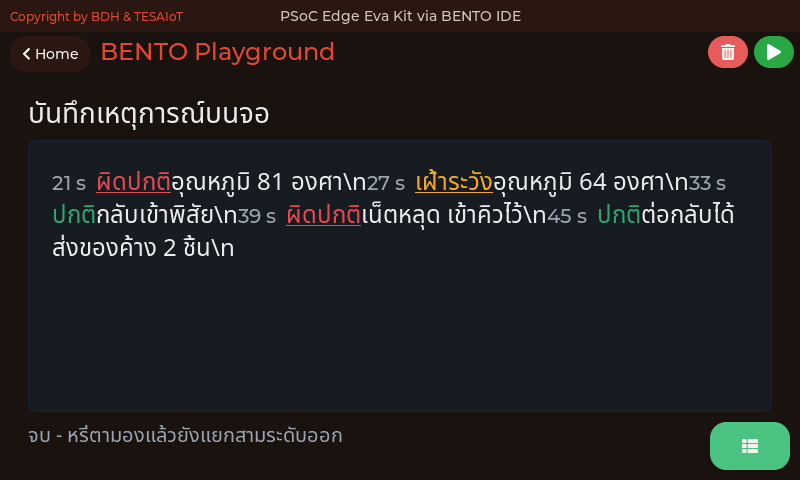

<div style="font-size:.54em;color:#78909c;margin-top:-.3em">ภาพจากตัวจำลอง bento_sim ซึ่งเรนเดอร์ด้วยโค้ด CM55 ชุดเดียวกับที่รันบนบอร์ด ที่ 800x480 เท่าจอของทั้งสองบอร์ด — แสดง<b>หน้าจอที่ <a href="https://github.com/tesaiot/tesa-qualification-program/blob/main/courses/aiot-micropython/m05-capstone/l03-build-and-present/examples/07_spangroup_event_log.py"><code>07_spangroup_event_log.py</code></a> สร้าง</b> เหตุการณ์ในภาพเป็นชุดที่ไฟล์นั้นกำหนดไว้เอง ไม่ใช่เหตุการณ์ที่บอร์ดเจอจริง</div>

**สไลด์ "ส่งเหตุการณ์ ไม่ใช่สตรีมดิบ" ของชุดบทเรียนนี้บอกว่าอะไรควรส่งขึ้นไป — และของชุดเดียวกันนั้นควรอยู่บนจอด้วย** แต่พอเขียนจริง ทุกทีมทำเหมือนกันหมด คือ `Label` หลายบรรทัดแล้วเปลี่ยน**สีข้อความ**ตามความรุนแรง ซึ่งตกเกณฑ์หน้าจอของหลักสูตร ทันที

| วิธีบอกความรุนแรง | ผ่านการทดสอบขาวดำไหม |
|---|---|
| สีข้อความอย่างเดียว | **ไม่ผ่าน** — แปลงเป็นเกรย์สเกลแล้วสามสถานะกลายเป็นเทาเหมือนกันหมด |
| ขนาดตัวอักษร | ผ่าน |
| เส้นใต้ / เส้นขีดกลาง | ผ่าน |
| สี **บวก** อย่างใดอย่างหนึ่งข้างบน | ผ่าน และคนตาบอดสีอ่านได้ด้วย |

> ลองเอง 30 วินาที — ถ่ายจอด้วยมือถือแล้วเปิดโหมดขาวดำ ถ้ายังแยกสามระดับออก หน้าจอนั้นผ่าน เกณฑ์หน้าจอของหลักสูตร

---

## `ui.SpanGroup` — ท่อน ปากกา และแฮนเดิลที่ไม่มี

<style scoped>section pre{font-size:.62em;line-height:1.25} section p{margin:.15em 0}</style>

`ui.SpanGroup` คือย่อหน้า**เดียว**ที่ประกอบจาก "ท่อน" หลายท่อน แต่ละท่อนมีขนาด สี และเส้นใต้ของตัวเองได้ จึงใส่ทั้งสองช่องทางลงในบรรทัดเดียวได้โดยไม่ต้องเปลือง widget — สามท่อนต่อหนึ่งเหตุการณ์ใน [`07_spangroup_event_log.py`](https://github.com/tesaiot/tesa-qualification-program/blob/main/courses/aiot-micropython/m05-capstone/l03-build-and-present/examples/07_spangroup_event_log.py):

```python
        color, decor = LEVEL[level]        # decor ของสองระดับบนคือ ui.SPAN_UNDERLINE
        log.pen(COL_DIM)
        log.add_span("%3d s  " % at, 20)   # เวลา ตัวเล็ก สีจาง
        log.pen(color)
        log.add_span(level, 24, decor)     # ระดับ สี + เส้นใต้
        log.pen(COL_TEXT)
        log.add_span("  " + text + "\n", 24)
```

**`.pen()` เป็นปากกา ไม่ใช่คำสั่งทาสีของที่มีอยู่แล้ว** — มีผลกับท่อนที่เติม**หลังจากนั้น**เท่านั้น ลืม `pen` ท่อนที่สามแล้วทั้งบรรทัดจะเป็นสีของระดับ

**ท่อนไม่มีแฮนเดิล** จึงแก้ทีละท่อนไม่ได้ ต้อง `.clear_items()` แล้วเขียนใหม่ทั้งย่อหน้า ซึ่งบังคับให้ "ความจริง" อยู่ในตัวแปรฝั่ง MicroPython — หลักเดียวกับที่ใช้มาทั้งคอร์ส คือมีที่เดียวที่มีสิทธิ์เปลี่ยนสถานะ

> เวลาตัวเล็กสีจาง · ระดับสีตามความรุนแรงพร้อมเส้นใต้ · เนื้อความสีปกติ — สองช่องทางในบรรทัดเดียว คือสิ่งที่ `Label` หลายบรรทัดทำไม่ได้

---

## บอร์ดไม่รู้ว่าวันนี้วันที่เท่าไร แล้วใครบอกมัน — `ui.Calendar`

<style scoped>section p{margin:.12em 0} section table{font-size:.8em}</style>

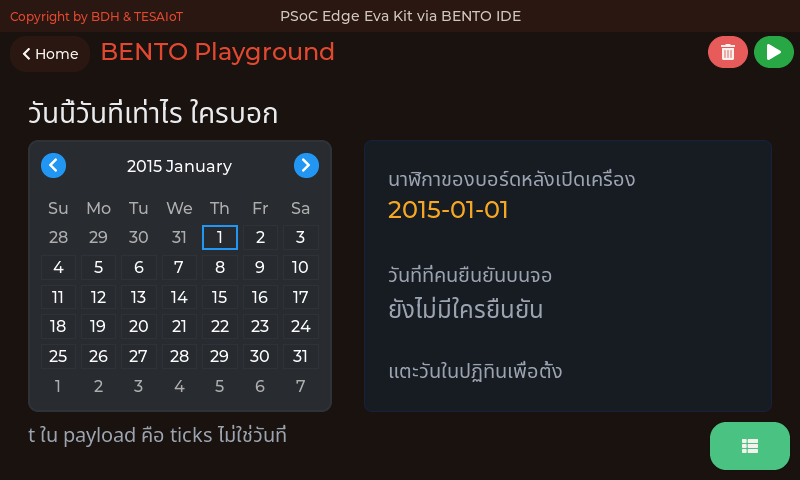

<div style="font-size:.54em;color:#78909c;margin-top:-.3em">ภาพจากตัวจำลอง bento_sim ซึ่งเรนเดอร์ด้วยโค้ด CM55 ชุดเดียวกับที่รันบนบอร์ด — แสดง<b>หน้าจอที่ <a href="https://github.com/tesaiot/tesa-qualification-program/blob/main/courses/aiot-micropython/m05-capstone/l03-build-and-present/examples/08_calendar_sets_the_clock.py"><code>08_calendar_sets_the_clock.py</code></a> สร้าง</b> วันที่ 2015-01-01 บนจอคือค่าที่นาฬิกาของบอร์ดตอบจริงหลังเปิดเครื่อง ไม่ได้พิมพ์ไว้ในสไลด์</div>

**ย้อนกลับไปที่ฟิลด์ `t` ใน schema ของโครงเริ่มต้น** — สไลด์เขียนไว้ว่า "เวลาบนบอร์ด ใช้เรียงลำดับ" ไม่ได้เขียนว่าวันที่ เพราะมันไม่ใช่ `t` คือ `ticks_ms` ซึ่งนับจากตอนเปิดเครื่อง

เหตุผลอยู่ในเฟิร์มแวร์: `machine_rtc.c` ตั้ง `RTC_INIT_YEAR` เป็น 15 บนฐานปี 2000 และคอมเมนต์ของ reset เขียนว่า *"Resets RTC to 1st Jan' 2015"* — **ทุกครั้งที่ตัดไฟ นาฬิกาของบอร์ดกลับไปที่ 1 ม.ค. 2015 เสมอ** ทีมที่ส่งวันที่ขึ้น platform โดยไม่ได้ตั้งนาฬิกา จะได้ข้อมูลปี 2015 ทั้งชุด และไม่มีใครสังเกตจนกว่าจะเอาไปทำกราฟย้อนหลัง

| ที่มาของวันที่ | มีบนโต๊ะทดลองนี้ไหม |
|---|---|
| NTP ผ่านอินเทอร์เน็ต | ต้องมีเน็ต และตั้งเองไม่ได้จาก MicroPython ในพอร์ตนี้ |
| เวลาที่ platform แนบมากับข้อความ | ได้ แต่เป็นเวลาของปลายทาง ไม่ใช่ของบอร์ด |
| **คนบอกบอร์ดผ่านหน้าจอ** | **ได้ทันที และเป็นทางเดียวที่ไม่ต้องพึ่งใคร** |

> **`ปี 2015` ในข้อมูลของทีมไหน คือลายเซ็นของนาฬิกาที่ไม่เคยถูกตั้ง** — จำหน้าตาของมันไว้

---

## `ui.Calendar` — สองอย่างที่ผิดคาดและต้องรู้

`ui.Calendar` คือ widget ของงาน "คนบอกบอร์ดผ่านหน้าจอ" — และมันสร้างวันที่ผิดปฏิทินไม่ได้ ต่างจากการวาง `Spinbox` สามช่องซึ่งยอมให้ป้อน 31 กุมภาพันธ์

- **`min` `max` `value` ที่นี่ไม่ใช่ช่วงค่า** อย่าง `Slider` หรือ `Bar` แต่คือ **ปี · เดือน · วัน** (`ui_widget_mgr.c` บรรทัด 2117 ใน `BENTO-TESAIoT-libraries/claw`) ใส่ค่านอกพิสัยแล้วมันเงียบ ๆ ถอยไปใช้ 2026-01-01 ไม่มี error
- **ลูกศรเปลี่ยนเดือนที่หัวปฏิทินไม่ส่ง event** เฟิร์มแวร์กรองทิ้งด้วย `lv_calendar_get_pressed_date()` ที่ตอบไม่ผ่านเมื่อไม่ได้แตะวัน — รู้ได้เฉพาะตอนคนแตะ**วัน** ไม่ใช่ตอนคนพลิกดูเดือน · ค่าที่ส่งมาคือเลขแปดหลัก `YYYYMMDD` ก้อนเดียว ต้องแกะเอง

> `machine.RTC` มีอยู่จริงทั้ง Eva Kit และ Dev Kit (ตาราง `modmachine.c` ของพอร์ตร่วมใส่ไว้โดยไม่มีเงื่อนไข) ต่างจาก `machine.PWM` และ `machine.ADC` ที่ไม่มี — เรียกได้เลยโดยไม่ต้อง `try/except`

---

## หน้าจอของทุกไฟล์ในชุดบทเรียนนี้ (1/2)

<style scoped>
section img { margin: 0 .3em; }
section p { margin: .2em 0; }
</style>

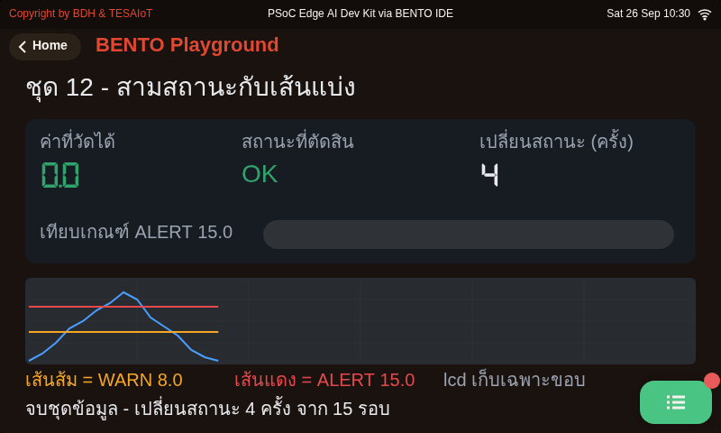 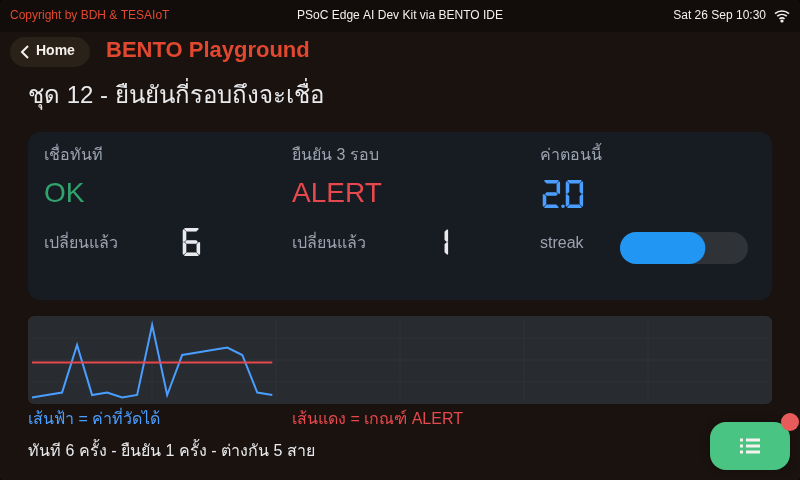 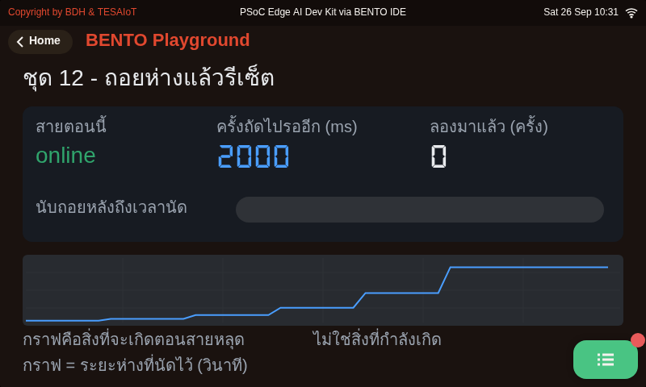

<div style="font-size:.56em;color:#90a4ae"><b>01</b> สามสถานะ และเส้นแบ่งที่ต้องตัดสินใจไว้ล่วงหน้า · <b>02</b> ต้องเห็นติดกันกี่รอบถึงจะเชื่อ · <b>03</b> ต่อใหม่แบบถอยห่างขึ้นเรื่อย ๆ ไม่ใช่รัวติดกัน</div>

<div style="font-size:.52em;color:#78909c;margin-top:.4em">ภาพจากตัวจำลอง bento_sim ซึ่งเรนเดอร์ด้วยโค้ด CM55 ชุดเดียวกับที่รันบนบอร์ด ที่ 800x480 เท่าจอของทั้งสองบอร์ด — แสดง<b>หน้าจอที่ตัวอย่างสร้าง</b> ค่าจากเซนเซอร์ WiFi และไมค์เป็นค่าแทนบนเครื่องโฮสต์ ไม่ใช่ผลการวัดของบอร์ด</div>

---

## หน้าจอของทุกไฟล์ในชุดบทเรียนนี้ (2/2)

<style scoped>
section img { margin: 0 .3em; }
section p { margin: .2em 0; }
</style>

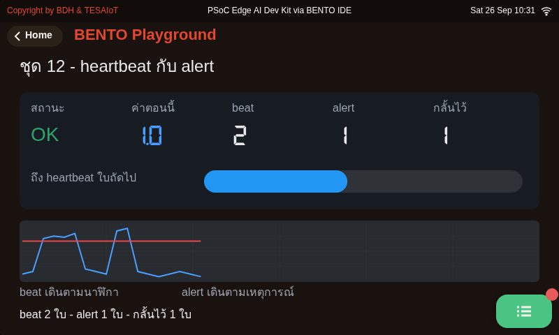 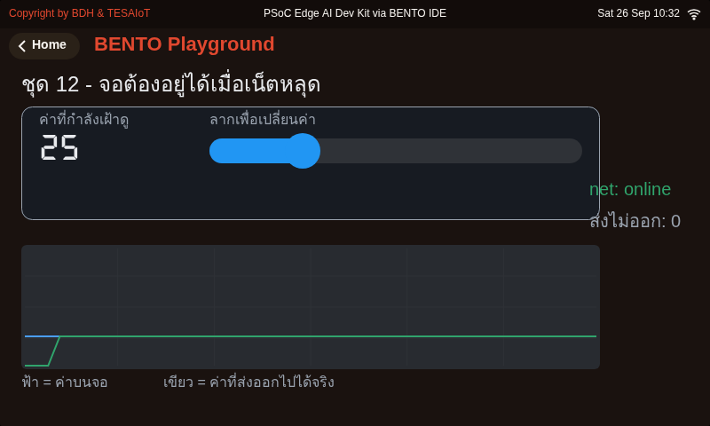 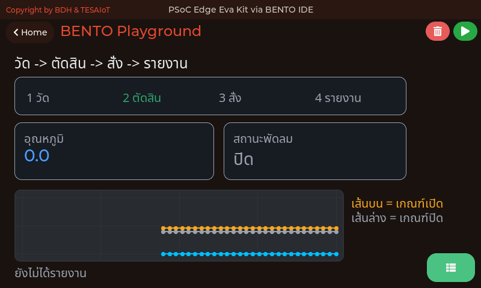

<div style="font-size:.56em;color:#90a4ae"><b>04</b> ข้อความสองชนิด สองจังหวะ คนละหน้าที่ · <b>05</b> เน็ตหลุดแล้วจอต้องยังทำงาน · <b>06</b> วงจรเต็มสี่ขั้นในไฟล์เดียว</div>

<div style="font-size:.52em;color:#78909c;margin-top:.4em">ภาพจากตัวจำลอง bento_sim ซึ่งเรนเดอร์ด้วยโค้ด CM55 ชุดเดียวกับที่รันบนบอร์ด ที่ 800x480 เท่าจอของทั้งสองบอร์ด — แสดง<b>หน้าจอที่ตัวอย่างสร้าง</b> ค่าจากเซนเซอร์ WiFi และไมค์เป็นค่าแทนบนเครื่องโฮสต์ ไม่ใช่ผลการวัดของบอร์ด</div>

---

## คลังตัวอย่างประยุกต์ — เอาไปต่อยอดเองได้ (1/2)

<style scoped>
section img { margin: 0 .3em; }
section p { margin: .2em 0; }
</style>

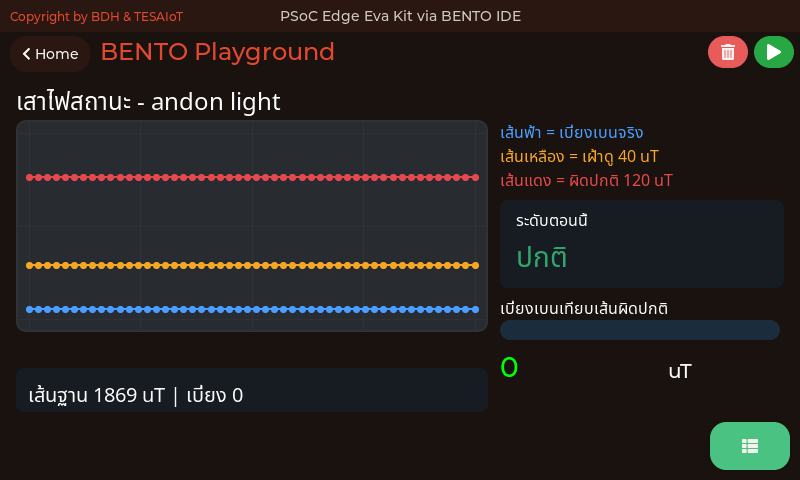 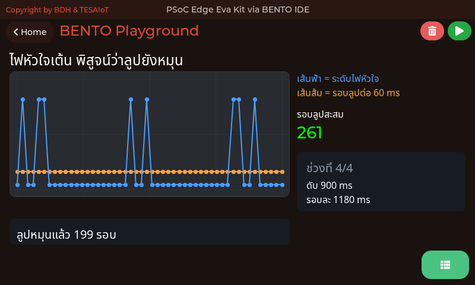 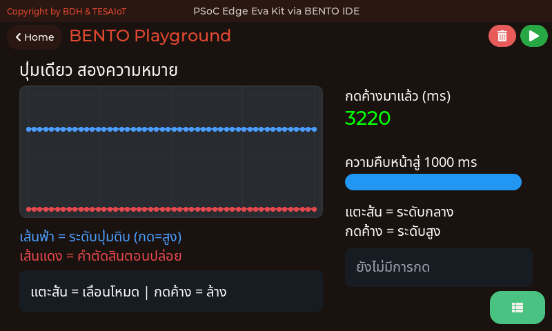

<div style="font-size:.56em;color:#90a4ae"><b>01</b> เสาไฟสถานะแบบโรงงาน (andon light) · <b>02</b> ไฟหัวใจเต้น บอกว่าลูปยังไม่ตาย · <b>05</b> ปุ่มเดียว สองความหมาย</div>

<div style="font-size:.52em;color:#78909c;margin-top:.4em">ไฟล์อยู่ที่ <code>examples/usecase/</code> — ไม่ได้อยู่ในบทเรียนไหนโดยเฉพาะ หยิบไปใช้กับงานจบได้เลย</div>

---

## คลังตัวอย่างประยุกต์ — เอาไปต่อยอดเองได้ (2/2)

<style scoped>
section img { margin: 0 .3em; }
section p { margin: .2em 0; }
</style>

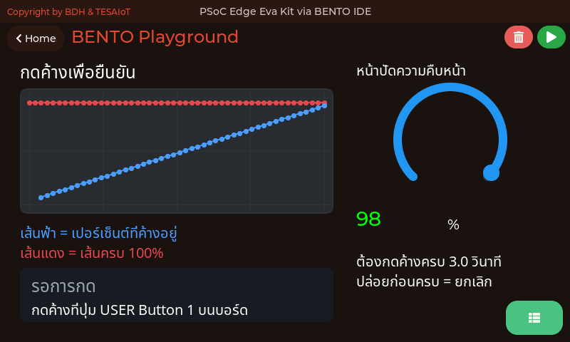 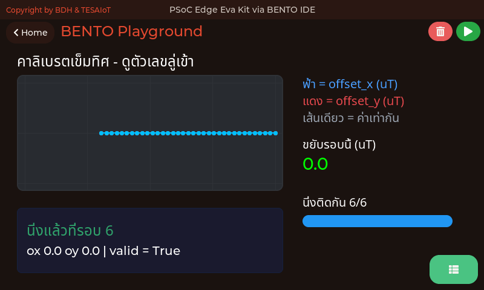

<div style="font-size:.56em;color:#90a4ae"><b>07</b> กดค้างเพื่อยืนยันคำสั่งที่ย้อนกลับไม่ได้ · <b>14</b> การคาลิเบรตเข็มทิศ เป็นสิ่งที่วัดได้</div>

<div style="font-size:.52em;color:#78909c;margin-top:.4em">ไฟล์อยู่ที่ <code>examples/usecase/</code> — ไม่ได้อยู่ในบทเรียนไหนโดยเฉพาะ หยิบไปใช้กับงานจบได้เลย</div>

---

## อ้างอิงและเครดิต

<style scoped>
section { font-size: .80em; }
</style>

**สถาปัตยกรรมและโพรโทคอล**
- MQTT Version 3.1.1, OASIS Standard — https://docs.oasis-open.org/mqtt/mqtt/v3.1.1/os/mqtt-v3.1.1-os.html
- MQTT Essentials (ชุด 10 ตอน) — HiveMQ — https://www.hivemq.com/mqtt-essentials/
- An IoT Telemetry Solution with NodeMCU and HiveMQ — HiveMQ — https://www.hivemq.com/blog/an-iot-telemetry-solution-with-nodemcu-esp8226-hivemq/
- Azure IoT Central solution architecture — Microsoft Learn — https://learn.microsoft.com/en-us/azure/iot-central/core/concepts-architecture
- TESAIoT Community Edition — https://github.com/tesaiot/tesaiot-community-edition

**บอร์ดและซอฟต์แวร์**
- KIT_PSE84_EVAL PSOC&trade; Edge E84 Evaluation Kit guide, Infineon 002-39007 Rev.*B
- TESAIoT Dev Kit — SoM ของ KIT_PSE84_AI บนฐาน QWA309 (`TESAIoT_KIT_PSE84_AI-Micropython-BentoClaw`, `bsps/TARGET_KIT_PSE84_AI/bsp_features.mk`: เพิ่ม DPS368 · SHT40 · เรดาร์) — ภาพบอร์ดจริงยังไม่ได้ถ่าย
- BMI270 datasheet — Bosch Sensortec — https://www.bosch-sensortec.com/products/motion-sensors/imus/bmi270/
- MicroPython documentation — https://docs.micropython.org/

**ภาพประกอบ**
- IoT-Enabled Smart City Framework: National Institute of Standards and Technology / Wikimedia Commons — สาธารณสมบัติ
- สัญญาณความสั่นลูกปืนปกติเทียบกับลูกปืนเสีย: Kolok P. et al., *Sensors* 25(21):6610 (2025) — CC BY 4.0 — https://pmc.ncbi.nlm.nih.gov/articles/PMC12609400/
- Envelope spectrum ของลูกปืน: Mika D., Józwik J., Ruggiero A., *Sensors* 25(23):7371 (2025) — CC BY 4.0 — https://pmc.ncbi.nlm.nih.gov/articles/PMC12694681/
- สถาปัตยกรรม MQTT pub/sub: Chine3me / Wikimedia Commons — CC0 1.0
- Edge computing: Psenda38 / Wikimedia Commons — CC0 1.0
- ไดอะแกรมอื่นทุกภาพในเด็คนี้วาดขึ้นใหม่สำหรับหลักสูตรนี้
- ภาพผังสถาปัตยกรรม IIoT ใช้สัญญาอนุญาต **CC BY-SA 4.0** ของเจ้าของภาพ (ดูเครดิตบนสไลด์และใน credits.yaml) ภาพนี้ใช้ทั้งภาพโดยไม่ดัดแปลง เนื้อหาสไลด์ชุดนี้จึงยังเผยแพร่ภายใต้ CC BY 4.0

**วิดีโอที่ตรวจแล้วว่าเปิดได้**
- MQTT Essentials Part 6: MQTT Topic Best Practices — HiveMQ — https://www.youtube.com/watch?v=juq_l70Vg1w
- MQTT Essentials Part 7: Quality of Service — HiveMQ — https://www.youtube.com/watch?v=hvhtJORsE5Y
- MQTT Essentials Part 10: Last Will and Testament — HiveMQ — https://www.youtube.com/watch?v=dNy9GEXngoE
- Build Real-Time IoT Dashboard — IoT Frontier — https://www.youtube.com/watch?v=0mluq0oJk7o

---

## อ้างอิง (ต่อ) — ข้อเท็จจริงของเฟิร์มแวร์ในเด็คนี้ ตรวจจากซอร์สโดยตรง

<style scoped>
section { font-size: 1em; }
section li { margin: .25em 0; }
</style>

- ไมโครโฟนใช้จาก Python ได้: โมดูล `mic` อยู่ที่ `ports/psoc-edge/freeze/mic.py` และถูกฝังเข้าเฟิร์มแวร์ผ่าน `boards/KIT_PSE84_EVAL_EPC2/manifest.py:9` (Eva) และ `boards/KIT_PSE84_AI/manifest.py:11` (Dev Kit) จึง `import mic` ได้เลยโดยไม่ต้องคัดลอกไฟล์ขึ้นบอร์ด · มันหุ้ม `machine.PDM_PCM` ไว้ให้ทั้งชื่อขา ช่อง MONO_RIGHT อัตราขยาย และการหัก DC ออกจากค่าดิบ · วัดจริงบนบอร์ด 14 ส.ค. 2026 ห้องเงียบ rms 30 เปิดโทนใส่ไมค์ 19335 · การคำนวณความดังอยู่ใน `PDM_PCM.stats()` ซึ่งเป็นภาษา C และทิ้งเสียงที่ค้างในคิวก่อนอ่าน จึงไม่ช้ากว่าความจริง (วัดได้ 0-48 ms เทียบกับ 496-624 ms ตอนไม่ทิ้ง)
- `sensors.init()` และ `sensors.scan()` ถูกปฏิเสธบน Eva Kit เพราะ CM55 เป็นเจ้าของ SCB0 — `modsensors.c:542` (มาโคร `EVA_SCB0_REFUSE`) และ `:549` · ค่าทั้งหมดมาจาก `sensors.snapshot()` ที่ `:825` ซึ่งคืนคีย์ `bmi270` / `capsense` / `pot` · บน Dev Kit `snapshot()` คืนคีย์ชุดเดียวกัน (IMU จาก CM33 ตรง, CapSense/pot จากคอร์จอ) และ `init()` ทำงานได้ — แต่ไม่มีคีย์อุณหภูมิบนบอร์ดไหน
- `sensors.bmi270.temperature()` โยน `OSError` บน Eva Kit — `modsensors.c:231` · บน Dev Kit อ่านได้ แต่เป็นอุณหภูมิของชิป IMU ไม่ใช่ของห้อง
- Eva Kit ไม่มีเซนเซอร์อุณหภูมิห้องหรือความชื้น · Dev Kit มี `sensors.sht40` (`modsensors_sht40.c`: `temperature()` `humidity()` `temperature_humidity()`) และ `sensors.dps368` (`modsensors_dps368.c`: `pressure()` `temperature()` `altitude()`) — `bsps/TARGET_KIT_PSE84_AI/bsp_features.mk` ตั้ง `BSP_HAS_SHT40=1` `BSP_HAS_DPS368=1` `BSP_HAS_RADAR=1` · `mqtt` เปิดได้เฉพาะพอร์ต 1883 ทั้งสองบอร์ด (โมดูลร่วมใน `BENTO-TESAIoT-libraries`)
- ห้าไฟล์ของบทเรียน 4.1–5.3 ที่ส่งอุณหภูมิ (`s09/09` `s10/08` `s11/07` `s12/06` `s12/09`) อ่านผ่าน `read_temp()`: `sensors.sht40` เมื่อบอร์ดมี ไม่งั้นลูกบิดแทน (0–100 % = 15–45 °C) และบอกบน console — **ยังไม่ได้รันบนบอร์ดจริงทั้งสองทาง** (ยังรอรอบทดสอบ)

> ทุกข้อจำกัดข้างบนมี path และเลขบรรทัดกำกับ ไม่ได้มาจากเอกสารฉบับใด ถ้าเจอที่ไม่ตรงกับบอร์ด บอกผู้สอนได้เลย

---

## Tileview — นิ้วสั่งได้ โปรแกรมสั่งไม่ได้

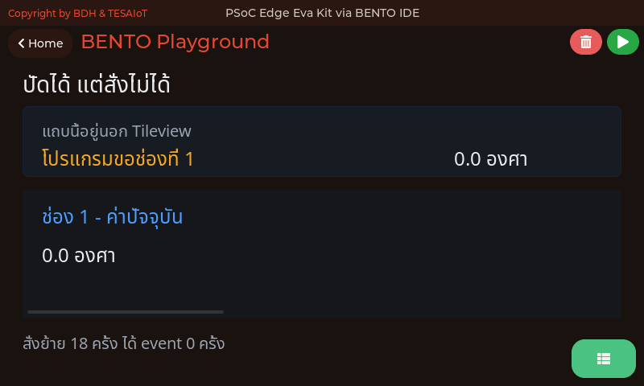

<div style="font-size:.54em;color:#78909c;margin-top:-.3em">ภาพจากตัวจำลอง Eva Kit (<code>KIT_PSE84_EVAL_EPC2-MicroPython-BentoClaw/sim</code>) ซึ่งรัน <code>ipc_ui.c</code> กับ <code>ui_widget_mgr.c</code> ตัวจริงเดียวกับบอร์ด บนพื้นที่วาด 792×398 (ขนาดเดียวกันบน Dev Kit) · แสดง<b>หน้าจอที่ตัวอย่างสร้าง</b> — หน้าจอของ <a href="https://github.com/tesaiot/tesa-qualification-program/blob/main/courses/aiot-micropython/m05-capstone/l03-build-and-present/examples/09_tileview_swipe_only.py"><code>09_tileview_swipe_only.py</code></a> · ค่าที่เห็นในภาพมาจากเซนเซอร์จำลองบนเครื่องโฮสต์ ไม่ใช่ผลการวัดของบอร์ด</div>

หลายหน้าจอที่ปัดสลับกันได้ เหมาะกับแดชบอร์ดที่มีมากกว่าที่จอเดียวรับไหว

**ราคา: สามช่องกิน 4 แฮนเดิล** ตั้งแต่ยังไม่มีอะไรอยู่ในนั้น — ตัว Tileview หนึ่ง บวกช่องละหนึ่ง

**ข้อจำกัดที่ต้องออกแบบเผื่อ**

- โปรแกรม**สั่งเลื่อนไปช่องที่ต้องการเองไม่ได้** — ไม่มี property สำหรับเลือกช่อง
- ถามว่า "ตอนนี้อยู่ช่องไหน" ตรง ๆ ไม่ได้ ต้องอนุมานจาก `scroll_end`

**ของที่ต้องเห็นตลอดเวลา ห้ามอยู่ในช่องใดช่องหนึ่ง** — สัญญาณเตือนที่อยู่ในช่องที่ผู้ใช้ไม่ได้เปิดอยู่ คือสัญญาณเตือนที่ไม่มีใครเห็น วางไว้นอก Tileview เสมอ
