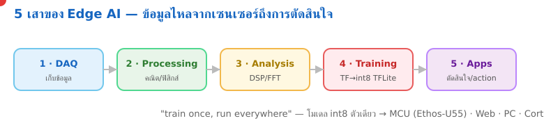

<!-- _class: cover -->
<!-- _backgroundColor: #0d1117 -->

# บทเรียน 1.1 — Edge AI คืออะไร: วงจรชีวิตของข้อมูลห้าขั้นและเป้าหมายที่โมเดลไปรันได้
## รันโมเดลตัวแรกของเรา

**โมดูล 1 — เริ่มต้น: รันของจริงแล้วแกะดูข้างใน**

**เปิดคอร์ส Edge AI Developer**

> คาถาประจำบทเรียน: **"AI ที่รันบนอุปกรณ์ตรงหน้า ไม่ต้องพึ่งเน็ต ไม่ต้องพึ่งคลาวด์ — คุณสั่งได้ด้วยโค้ดไม่กี่บรรทัด"**

MicroPython บนบอร์ด BENTO (PSoC Edge · Cortex-M55 + Ethos-U55 NPU)

---

# เปิดบทเรียนด้วยของจริงก่อน

วันนี้เราเริ่มแบบ **กลับด้าน** — ไม่เริ่มจากทฤษฎีทีละก้าว แต่รันของที่ทำงานได้จริงก่อน แล้วค่อยแกะว่ามันทำงานยังไง

<svg width="820" height="150" viewBox="0 0 820 150" font-family="DejaVu Sans, sans-serif">
  <defs>
    <marker id="arOpen" markerUnits="userSpaceOnUse" markerWidth="12" markerHeight="10" refX="10" refY="4" orient="auto"><path d="M0,0 L10,4 L0,8 Z" fill="#607d8b"/></marker>
  </defs>
  <rect x="14" y="40" width="180" height="70" rx="12" fill="#e8f5e9" stroke="#2e7d32" stroke-width="2"/>
  <text x="104" y="72" font-size="15" font-weight="700" fill="#2e7d32" text-anchor="middle">รันของเจ๋งก่อน</text>
  <text x="104" y="94" font-size="12" fill="#555" text-anchor="middle">เมนู 6 โมเดล</text>
  <rect x="234" y="40" width="180" height="70" rx="12" fill="#e3f2fd" stroke="#1565c0" stroke-width="2"/>
  <text x="324" y="72" font-size="15" font-weight="700" fill="#1565c0" text-anchor="middle">แกะดูข้างใน</text>
  <text x="324" y="94" font-size="12" fill="#555" text-anchor="middle">edge_ai ทำงานยังไง</text>
  <rect x="454" y="40" width="180" height="70" rx="12" fill="#fff3e0" stroke="#ef6c00" stroke-width="2"/>
  <text x="544" y="72" font-size="15" font-weight="700" fill="#e65100" text-anchor="middle">เติม/แก้เอง</text>
  <text x="544" y="94" font-size="12" fill="#555" text-anchor="middle">4 คำสั่งหลัก</text>
  <rect x="674" y="40" width="132" height="70" rx="12" fill="#f3e5f5" stroke="#6a1b9a" stroke-width="2"/>
  <text x="740" y="72" font-size="15" font-weight="700" fill="#6a1b9a" text-anchor="middle">อยากสร้างต่อ</text>
  <text x="740" y="94" font-size="12" fill="#555" text-anchor="middle">ทั้งคอร์ส</text>
  <line x1="194" y1="75" x2="230" y2="75" stroke="#607d8b" stroke-width="2.4" marker-end="url(#arOpen)"/>
  <line x1="414" y1="75" x2="450" y2="75" stroke="#607d8b" stroke-width="2.4" marker-end="url(#arOpen)"/>
  <line x1="634" y1="75" x2="670" y2="75" stroke="#607d8b" stroke-width="2.4" marker-end="url(#arOpen)"/>
</svg>

วิธีนี้มีชื่อเรียกในวงการสอนเขียนโปรแกรมว่า **PRIMM** (Predict–Run–Investigate–Modify–Make) เราจะใช้แนวนี้ตลอดคอร์ส เพราะแรงจูงใจที่ดีที่สุดคือ "ของมันทำงานได้แล้ว ฉันอยากรู้ว่าทำไม" ไม่ใช่กองไวยากรณ์ที่ต้องท่องก่อน

> ชุดบทเรียนแรกไม่ต้องเข้าใจทุกบรรทัด ขอแค่ได้เห็นโมเดลรู้จำท่าทาง/เสียงของคุณบนจอ แล้วเริ่มสงสัยว่ามันรู้ได้ยังไง เท่านั้นพอ

---

# เป้าหมายของชุดบทเรียนนี้

จบชุดบทเรียนนี้เราจะเดินครบ 4 เรื่อง แล้วปิดท้ายด้วยการรันโมเดลจริง:

1. **Edge AI คืออะไร** และต่างจาก AI บนคลาวด์ตรงไหน
2. **วงจรชีวิตของข้อมูล** 5 ขั้น (DAQ → Processing → Analysis → Training → Apps) — โครงของทั้งคอร์ส
3. **สเปกตรัมของเป้าหมาย** ที่โมเดลตัวเดียวรันได้ (MCU / PC / Web / Cortex-A)
4. **สามพื้นผิวการเรียน** (Emulator / บอร์ด / Docker) — โค้ดชุดเดียว รันได้ทั้งสาม
5. ลงมือ: รันเมนู **6 โมเดล** ด้วย `edge_ai.models()` / `select()` / `result()` อ่านผลสดๆ

ปลายทางของวันนี้: เลือกโมเดลใน dropdown กด Load แล้วทำท่า/ส่งเสียง — จอโชว์คลาสที่ชนะ พร้อมแถบความมั่นใจ

> วันนี้เราเน้น "รันได้ + อ่านผลเป็น" ส่วนโมเดลถูกฝึกมายังไง เก็บไว้เป็นเป้าหมายของ โมดูล 5 (Training)

---

# Edge AI คืออะไร

**Edge AI** คือการรันโมเดล AI (การอนุมาน / inference) บน **อุปกรณ์ตรงปลายทาง** ที่ข้อมูลเกิดขึ้น ไม่ต้องส่งข้อมูลขึ้นไปให้เซิร์ฟเวอร์คิดแทน

- โมเดลถูกฝึกมาแล้วบนเครื่องแรง จากนั้น **บีบให้เล็กพอ** จะไปวางไว้บนไมโครคอนโทรลเลอร์
- ตอนใช้งานจริง เซนเซอร์ป้อนข้อมูลเข้าโมเดลบนชิป โมเดลตอบ "คลาส" กลับมาในเสี้ยววินาที
- ทั้งหมดเกิดขึ้นในกล่องเล็กๆ ตรงหน้า — ไม่มีอินเทอร์เน็ต ก็ยังทำงาน

<svg width="760" height="140" viewBox="0 0 760 140" font-family="DejaVu Sans, sans-serif">
  <defs>
    <marker id="arEA" markerUnits="userSpaceOnUse" markerWidth="12" markerHeight="10" refX="10" refY="4" orient="auto"><path d="M0,0 L10,4 L0,8 Z" fill="#607d8b"/></marker>
  </defs>
  <rect x="20" y="44" width="150" height="56" rx="10" fill="#e3f2fd" stroke="#1565c0" stroke-width="2"/>
  <text x="95" y="68" font-size="13" font-weight="700" fill="#1565c0" text-anchor="middle">เซนเซอร์</text>
  <text x="95" y="88" font-size="11" fill="#666" text-anchor="middle">IMU · เรดาร์ · ไมค์</text>
  <rect x="240" y="44" width="180" height="56" rx="10" fill="#f3e5f5" stroke="#6a1b9a" stroke-width="2"/>
  <text x="330" y="68" font-size="13" font-weight="700" fill="#6a1b9a" text-anchor="middle">โมเดลบนชิป</text>
  <text x="330" y="88" font-size="11" fill="#666" text-anchor="middle">อนุมานตรงนี้ (NPU)</text>
  <rect x="490" y="44" width="150" height="56" rx="10" fill="#e8f5e9" stroke="#2e7d32" stroke-width="2"/>
  <text x="565" y="68" font-size="13" font-weight="700" fill="#2e7d32" text-anchor="middle">คำตอบ</text>
  <text x="565" y="88" font-size="11" fill="#666" text-anchor="middle">"shaking" 92%</text>
  <line x1="170" y1="72" x2="236" y2="72" stroke="#607d8b" stroke-width="2.4" marker-end="url(#arEA)"/>
  <line x1="420" y1="72" x2="486" y2="72" stroke="#607d8b" stroke-width="2.4" marker-end="url(#arEA)"/>
  <text x="700" y="76" font-size="12" fill="#999">ไม่มีคลาวด์</text>
</svg>

> "Edge" แปลตรงตัวว่า "ขอบ" — ขอบนอกสุดของเครือข่าย ที่ซึ่งข้อมูลเกิดจริง ตรงข้ามกับ "คลาวด์" ที่อยู่ศูนย์กลาง

---

# ทำไมต้องรันบนอุปกรณ์ ไม่ส่งขึ้นคลาวด์

การเอาโมเดลไปไว้ตรงปลายทางไม่ใช่แค่เท่ มันแก้ปัญหาจริง 4 ข้อที่คลาวด์ทำได้ไม่ดี:

- **หน่วงเวลา (latency)** — ตัดสินใจในเสี้ยววินาที ไม่ต้องรอ round-trip ไปเซิร์ฟเวอร์ เหมาะกับงานที่ต้องตอบทันที เช่น ตรวจการล้ม ตรวจเสียงเตือน
- **ความเป็นส่วนตัว (privacy)** — เสียงในบ้าน ท่าทางร่างกาย ไม่ต้องออกจากอุปกรณ์เลย ข้อมูลดิบไม่ถูกอัปโหลด
- **ค่าใช้จ่าย (cost)** — ไม่มีค่า bandwidth ไม่มีค่าเซิร์ฟเวอร์ต่อครั้งที่อนุมาน จ่ายครั้งเดียวที่ตัวชิป
- **ทำงานออฟไลน์ (offline)** — เน็ตหลุด ไฟดับสัญญาณ อุปกรณ์ก็ยังตัดสินใจได้เอง

> ลองนึกถึงนาฬิกาที่ตรวจจับว่าคุณล้ม ถ้ามันต้องอัปโหลดคลิปขึ้นคลาวด์ก่อนถึงจะรู้ว่าคุณล้ม — สายเกินไป และคุณคงไม่อยากให้กล้องในบ้านส่งภาพออกไปตลอดเวลาด้วย นี่คือเหตุผลที่ Edge AI มีอยู่

---

# Cloud AI กับ Edge AI ต่างกันตรงไหน

ทั้งคู่ใช้โมเดลแบบเดียวกันได้ ต่างกันที่ **การอนุมานเกิดขึ้นที่ไหน** และตามมาด้วยข้อดี-ข้อแลกเปลี่ยนคนละชุด

<svg width="820" height="210" viewBox="0 0 820 210" font-family="DejaVu Sans, sans-serif">
  <!-- Cloud lane -->
  <rect x="12" y="10" width="392" height="190" rx="12" fill="#eceff1" stroke="#607d8b" stroke-width="2"/>
  <text x="208" y="36" font-size="15" font-weight="700" fill="#455a64" text-anchor="middle">Cloud AI</text>
  <rect x="34" y="56" width="90" height="44" rx="8" fill="#fff" stroke="#607d8b"/>
  <text x="79" y="82" font-size="11" fill="#455a64" text-anchor="middle">อุปกรณ์</text>
  <rect x="286" y="56" width="96" height="44" rx="8" fill="#cfd8dc" stroke="#607d8b"/>
  <text x="334" y="76" font-size="11" fill="#455a64" text-anchor="middle">เซิร์ฟเวอร์</text>
  <text x="334" y="90" font-size="10" fill="#666" text-anchor="middle">โมเดลอยู่นี่</text>
  <line x1="124" y1="70" x2="284" y2="70" stroke="#ef6c00" stroke-width="2"/>
  <line x1="284" y1="86" x2="124" y2="86" stroke="#ef6c00" stroke-width="2"/>
  <text x="204" y="66" font-size="10" fill="#ef6c00" text-anchor="middle">อัปโหลดข้อมูลดิบ</text>
  <text x="204" y="100" font-size="10" fill="#ef6c00" text-anchor="middle">รอคำตอบกลับ</text>
  <text x="208" y="130" font-size="12" fill="#607d8b" text-anchor="middle">แรงมาก โมเดลใหญ่ได้</text>
  <text x="208" y="150" font-size="12" fill="#c62828" text-anchor="middle">แต่ช้า · ต้องมีเน็ต · ข้อมูลออกนอกเครื่อง</text>
  <text x="208" y="170" font-size="12" fill="#c62828" text-anchor="middle">มีค่าเซิร์ฟเวอร์ต่อครั้ง</text>
  <!-- Edge lane -->
  <rect x="416" y="10" width="392" height="190" rx="12" fill="#e8f5e9" stroke="#2e7d32" stroke-width="2"/>
  <text x="612" y="36" font-size="15" font-weight="700" fill="#2e7d32" text-anchor="middle">Edge AI</text>
  <rect x="540" y="56" width="140" height="52" rx="8" fill="#fff" stroke="#2e7d32"/>
  <text x="610" y="78" font-size="11" fill="#2e7d32" text-anchor="middle">อุปกรณ์</text>
  <text x="610" y="94" font-size="10" fill="#666" text-anchor="middle">โมเดลอยู่ในนี้เลย</text>
  <text x="612" y="130" font-size="12" fill="#2e7d32" text-anchor="middle">เร็ว · ออฟไลน์ได้ · ข้อมูลไม่ออกจากเครื่อง</text>
  <text x="612" y="150" font-size="12" fill="#2e7d32" text-anchor="middle">จ่ายครั้งเดียวที่ตัวชิป</text>
  <text x="612" y="170" font-size="12" fill="#ef6c00" text-anchor="middle">แต่ต้องบีบโมเดลให้เล็กพอ (นี่คือวิชาของเรา)</text>
</svg>

> ข้อแลกเปลี่ยนของ Edge คือ "โมเดลต้องเล็กและเร็วพอจะรันบนชิปเล็กๆ" — การทำให้มันเล็กโดยไม่เสียความแม่น คือหัวใจที่คอร์สนี้จะสอน (โดยเฉพาะ โมดูล 4 (Analysis) กับโมดูล 5 (Training))

---

# ภาพเคลื่อนไหว — 5 เสา: ข้อมูลไหลจากเซนเซอร์ถึงการตัดสินใจ

โมเดล int8 ตัวเดียวไหลผ่านทุกเสา แล้วรันได้ทั้ง MCU · Web · PC · Cortex-A — *train once, run everywhere*

---

# วงจรชีวิตของข้อมูล — โครงของทั้งคอร์ส

คอร์สนี้ไม่ได้สอนแค่ "เรียกโมเดลที่ฝึกมาแล้ว" แต่พาเดินครบวงจรที่วิศวกรทำจริง ตั้งแต่ข้อมูลดิบจนถึงโมเดลบนชิป — 5 ขั้น:

<svg width="920" height="200" viewBox="0 0 920 200" font-family="DejaVu Sans, sans-serif">
  <defs>
    <marker id="arLC" markerUnits="userSpaceOnUse" markerWidth="12" markerHeight="10" refX="10" refY="4" orient="auto"><path d="M0,0 L10,4 L0,8 Z" fill="#607d8b"/></marker>
  </defs>
  <g text-anchor="middle">
    <rect x="10" y="60" width="160" height="72" rx="12" fill="#e3f2fd" stroke="#1565c0" stroke-width="2"/>
    <text x="90" y="88" font-size="14" font-weight="700" fill="#1565c0">1 · DAQ</text>
    <text x="90" y="108" font-size="11" fill="#555">เก็บข้อมูลดิบ</text>
    <text x="90" y="122" font-size="10" fill="#888">จากเซนเซอร์</text>
    <rect x="196" y="60" width="160" height="72" rx="12" fill="#e8f5e9" stroke="#2e7d32" stroke-width="2"/>
    <text x="276" y="88" font-size="14" font-weight="700" fill="#2e7d32">2 · Processing</text>
    <text x="276" y="108" font-size="11" fill="#555">คณิต+ฟิสิกส์</text>
    <text x="276" y="122" font-size="10" fill="#888">tilt · พลังงาน · dBFS</text>
    <rect x="382" y="60" width="160" height="72" rx="12" fill="#fff3e0" stroke="#ef6c00" stroke-width="2"/>
    <text x="462" y="88" font-size="14" font-weight="700" fill="#e65100">3 · Analysis</text>
    <text x="462" y="108" font-size="11" fill="#555">DSP · FFT · feature</text>
    <text x="462" y="122" font-size="10" fill="#888">สิ่งที่โมเดลเห็นจริง</text>
    <rect x="568" y="60" width="160" height="72" rx="12" fill="#f3e5f5" stroke="#6a1b9a" stroke-width="2"/>
    <text x="648" y="88" font-size="14" font-weight="700" fill="#6a1b9a">4 · Training</text>
    <text x="648" y="108" font-size="11" fill="#555">ฝึกโมเดล (Docker)</text>
    <text x="648" y="122" font-size="10" fill="#888">TensorFlow → .tflite</text>
    <rect x="754" y="60" width="160" height="72" rx="12" fill="#e0f7fa" stroke="#00838f" stroke-width="2"/>
    <text x="834" y="88" font-size="14" font-weight="700" fill="#00838f">5 · Apps</text>
    <text x="834" y="108" font-size="11" fill="#555">อนุมาน + action</text>
    <text x="834" y="122" font-size="10" fill="#888">edge_ai · on_result</text>
  </g>
  <line x1="170" y1="96" x2="194" y2="96" stroke="#607d8b" stroke-width="2.4" marker-end="url(#arLC)"/>
  <line x1="356" y1="96" x2="380" y2="96" stroke="#607d8b" stroke-width="2.4" marker-end="url(#arLC)"/>
  <line x1="542" y1="96" x2="566" y2="96" stroke="#607d8b" stroke-width="2.4" marker-end="url(#arLC)"/>
  <line x1="728" y1="96" x2="752" y2="96" stroke="#607d8b" stroke-width="2.4" marker-end="url(#arLC)"/>
  <text x="462" y="24" font-size="13" font-weight="700" fill="#455a64" text-anchor="middle">ข้อมูลดิบ  ───────────────────▶  โมเดลบนชิปที่ใช้งานได้</text>
  <text x="462" y="176" font-size="12" fill="#888" text-anchor="middle">คอร์สนี้เดินครบทั้ง 5 ขั้น ไม่ใช่แค่ขั้นสุดท้าย</text>
</svg>

> เกือบทุกคอร์ส Edge AI สอนแค่ขั้น 5 (เรียกโมเดลสำเร็จรูป) แต่เราจะเข้าใจว่า **โมเดลเห็นอะไร** และ **ทำไมต้องบีบให้เล็ก** เพราะเราเดินมาตั้งแต่ขั้น 1

---

# ชุดบทเรียนนี้อยู่ตรงไหนของวงจร

น่าสนใจตรงที่วันนี้เราเริ่มจาก **ขั้น 5 (Apps)** ก่อน ทั้งๆ ที่มันเป็นขั้นสุดท้าย — นี่คือความตั้งใจ

- เราเอา "ผลลัพธ์ที่น่าตื่นเต้น" มาให้เห็นก่อน (โมเดลรู้จำท่าทาง/เสียงได้) เพื่อจุดแรงอยากรู้
- ชุดบทเรียนถัด ๆ ไปเราจะ **ถอยกลับ** ไปไล่ทีละขั้น: เก็บข้อมูลเอง (DAQ) แปลงสัญญาณเอง (Analysis) จนฝึกโมเดลของตัวเองได้ (Training)
- พอถึงตอนนั้น คุณจะกลับมามองเมนู 6 โมเดลวันนี้แล้วเข้าใจมันทั้งกระบวนการ

<svg width="760" height="96" viewBox="0 0 760 96" font-family="DejaVu Sans, sans-serif">
  <line x1="40" y1="48" x2="720" y2="48" stroke="#cfd8dc" stroke-width="3"/>
  <circle cx="120" cy="48" r="9" fill="#00838f"/>
  <text x="120" y="30" font-size="12" font-weight="700" fill="#00838f" text-anchor="middle">บทเรียน 1.1–1.3 (วันนี้)</text>
  <text x="120" y="74" font-size="11" fill="#777" text-anchor="middle">รันของสำเร็จ (ขั้น 5)</text>
  <circle cx="620" cy="48" r="9" fill="#6a1b9a"/>
  <text x="620" y="30" font-size="12" font-weight="700" fill="#6a1b9a" text-anchor="middle">ชุดบทเรียนถัด ๆ ไป</text>
  <text x="620" y="74" font-size="11" fill="#777" text-anchor="middle">ถอยไปสร้างเองตั้งแต่ขั้น 1</text>
  <path d="M600,44 C520,20 260,20 138,42" fill="none" stroke="#9e9e9e" stroke-width="2" stroke-dasharray="6 5"/>
  <text x="370" y="20" font-size="11" fill="#9e9e9e" text-anchor="middle">"กลับด้าน" — เห็นปลายทางก่อน แล้วค่อยเข้าใจต้นทาง</text>
</svg>

> เราอยากให้คุณรู้สึกว่า "ของนี้เป็นของเราตั้งแต่ชุดบทเรียนแรก" ก่อนจะลงลึกเรื่องยากๆ — ความเป็นเจ้าของมาก่อนไวยากรณ์เสมอ

---

# สเปกตรัมของเป้าหมาย — โมเดลตัวเดียว รันได้หลายที่

หัวใจที่ทำให้ Edge AI น่าตื่นเต้น: โมเดลที่ฝึก **ครั้งเดียว** เอาไปรันได้ทั่วสเปกตรัมของฮาร์ดแวร์ แต่ละที่มีข้อแลกเปลี่ยนต่างกัน

<svg width="900" height="220" viewBox="0 0 900 220" font-family="DejaVu Sans, sans-serif">
  <line x1="40" y1="150" x2="860" y2="150" stroke="#b0bec5" stroke-width="3"/>
  <text x="46" y="182" font-size="12" fill="#607d8b">เล็ก · ประหยัด · ช้ากว่า</text>
  <text x="854" y="182" font-size="12" fill="#607d8b" text-anchor="end">ใหญ่ · แรง · กินไฟกว่า</text>
  <!-- MCU -->
  <circle cx="130" cy="150" r="11" fill="#1565c0"/>
  <rect x="60" y="44" width="150" height="86" rx="10" fill="#e3f2fd" stroke="#1565c0" stroke-width="2"/>
  <text x="135" y="66" font-size="13" font-weight="700" fill="#1565c0" text-anchor="middle">MCU + NPU</text>
  <text x="135" y="86" font-size="11" fill="#555" text-anchor="middle">Cortex-M55 + U55</text>
  <text x="135" y="104" font-size="10" fill="#888" text-anchor="middle">บอร์ด BENTO</text>
  <text x="135" y="120" font-size="10" fill="#888" text-anchor="middle">int8 · Vela</text>
  <!-- Web -->
  <circle cx="370" cy="150" r="11" fill="#2e7d32"/>
  <rect x="300" y="44" width="150" height="86" rx="10" fill="#e8f5e9" stroke="#2e7d32" stroke-width="2"/>
  <text x="375" y="66" font-size="13" font-weight="700" fill="#2e7d32" text-anchor="middle">Web</text>
  <text x="375" y="86" font-size="11" fill="#555" text-anchor="middle">เบราว์เซอร์</text>
  <text x="375" y="104" font-size="10" fill="#888" text-anchor="middle">LiteRT.js</text>
  <text x="375" y="120" font-size="10" fill="#888" text-anchor="middle">BENTO Emulator</text>
  <!-- Cortex-A -->
  <circle cx="610" cy="150" r="11" fill="#ef6c00"/>
  <rect x="540" y="44" width="150" height="86" rx="10" fill="#fff3e0" stroke="#ef6c00" stroke-width="2"/>
  <text x="615" y="66" font-size="13" font-weight="700" fill="#e65100" text-anchor="middle">Cortex-A</text>
  <text x="615" y="86" font-size="11" fill="#555" text-anchor="middle">Linux SBC</text>
  <text x="615" y="104" font-size="10" fill="#888" text-anchor="middle">RPi · Jetson · NUC</text>
  <text x="615" y="120" font-size="10" fill="#888" text-anchor="middle">ai-edge-litert</text>
  <!-- PC -->
  <circle cx="800" cy="150" r="11" fill="#6a1b9a"/>
  <rect x="726" y="44" width="150" height="86" rx="10" fill="#f3e5f5" stroke="#6a1b9a" stroke-width="2"/>
  <text x="801" y="66" font-size="13" font-weight="700" fill="#6a1b9a" text-anchor="middle">PC</text>
  <text x="801" y="86" font-size="11" fill="#555" text-anchor="middle">Docker</text>
  <text x="801" y="104" font-size="10" fill="#888" text-anchor="middle">TensorFlow</text>
  <text x="801" y="120" font-size="10" fill="#888" text-anchor="middle">โต๊ะฝึกโมเดล</text>
</svg>

> คำถามวิศวกรที่คอร์สนี้ฝึกให้ตอบ: **"โมเดลตัวนี้ควรอยู่ที่ไหน?"** — บนชิป $3 หรือบน Jetson? แต่ละที่แลกอะไรกับอะไร นี่คือการตัดสินใจเชิงวิศวกรรมจริง

---

# Train once, run everywhere

โมเดลหนึ่งไฟล์ (`.tflite` แบบ int8) คือ **แหล่งความจริงเดียว** จากนั้นแต่ละเป้าหมายหยิบไปใช้ต่อได้เอง

| เป้าหมาย | ทำอะไรกับไฟล์ `.tflite` | รันด้วย |
|---|---|---|
| **MCU + Ethos-U55** | คอมไพล์ผ่าน `vela` เพิ่มหนึ่งครั้ง | TFLite-Micro บนบอร์ด |
| **Web** | ใช้ไฟล์เดิม ไม่แก้ | LiteRT.js (ในเบราว์เซอร์) |
| **Cortex-A (Linux)** | ใช้ไฟล์เดิม ไม่แก้ | ai-edge-litert (Python) |
| **PC / Docker** | ใช้ไฟล์เดิม | TensorFlow / LiteRT |

- มีแค่ MCU ที่ต้องคอมไพล์เพิ่ม (Vela) เพราะต้องแปลงให้ NPU อ่านออก ส่วน Web กับ Cortex-A ใช้ไฟล์เดียวกันเป๊ะ
- ตัวหารร่วมคือ **int8** — MCU บังคับต้องใช้ ที่เหลือรับได้หมด

> นี่คือบทเรียน "train once, run everywhere" ที่จับต้องได้ ไม่ใช่แค่สโลแกน — คุณจะได้ลงมือทำจริงใน โมดูล 5 (Training)

---

# สามพื้นผิวการเรียน — โค้ดชุดเดียว

คอร์สนี้ให้คุณเรียนได้จากสามที่ โดย **โค้ด MicroPython ชุดเดียวกัน** รันได้ทั้งสาม เริ่มจากที่ไหนก็ได้ ไม่มีบอร์ดก็เริ่มได้

<svg width="900" height="200" viewBox="0 0 900 200" font-family="DejaVu Sans, sans-serif">
  <defs>
    <marker id="ar3S" markerUnits="userSpaceOnUse" markerWidth="12" markerHeight="10" refX="10" refY="4" orient="auto"><path d="M0,0 L10,4 L0,8 Z" fill="#607d8b"/></marker>
  </defs>
  <rect x="20" y="40" width="250" height="120" rx="12" fill="#e8f5e9" stroke="#2e7d32" stroke-width="2"/>
  <text x="145" y="68" font-size="15" font-weight="700" fill="#2e7d32" text-anchor="middle">BENTO Emulator</text>
  <text x="145" y="92" font-size="12" fill="#555" text-anchor="middle">เบราว์เซอร์ · ไม่ต้องมีบอร์ด</text>
  <text x="145" y="112" font-size="11" fill="#888" text-anchor="middle">เซนเซอร์และผลโมเดลจำลอง</text>
  <text x="145" y="132" font-size="11" fill="#888" text-anchor="middle">ide.tesaiot.dev</text>
  <text x="145" y="150" font-size="11" fill="#00838f" text-anchor="middle">เริ่มได้ทุกที่</text>
  <rect x="325" y="40" width="250" height="120" rx="12" fill="#e3f2fd" stroke="#1565c0" stroke-width="2"/>
  <text x="450" y="68" font-size="15" font-weight="700" fill="#1565c0" text-anchor="middle">บอร์ด BENTO</text>
  <text x="450" y="92" font-size="12" fill="#555" text-anchor="middle">ของจริง Cortex-M55 + U55</text>
  <text x="450" y="112" font-size="11" fill="#888" text-anchor="middle">IMU · เรดาร์ · ไมค์ จริง</text>
  <text x="450" y="132" font-size="11" fill="#888" text-anchor="middle">หน้า Edge AI บนจอ</text>
  <text x="450" y="150" font-size="11" fill="#1565c0" text-anchor="middle">ของจริง</text>
  <rect x="630" y="40" width="250" height="120" rx="12" fill="#f3e5f5" stroke="#6a1b9a" stroke-width="2"/>
  <text x="755" y="68" font-size="15" font-weight="700" fill="#6a1b9a" text-anchor="middle">Python + Docker</text>
  <text x="755" y="92" font-size="12" fill="#555" text-anchor="middle">ฝึกโมเดลของตัวเอง</text>
  <text x="755" y="112" font-size="11" fill="#888" text-anchor="middle">TensorFlow → .tflite</text>
  <text x="755" y="132" font-size="11" fill="#888" text-anchor="middle">รันได้ทุก OS</text>
  <text x="755" y="150" font-size="11" fill="#6a1b9a" text-anchor="middle">โต๊ะฝึกโมเดล</text>
  <line x1="270" y1="100" x2="322" y2="100" stroke="#607d8b" stroke-width="2.4" marker-end="url(#ar3S)"/>
  <line x1="575" y1="100" x2="627" y2="100" stroke="#607d8b" stroke-width="2.4" marker-end="url(#ar3S)"/>
</svg>

> ชุดบทเรียนนี้ใช้ **สองอันแรก**: Emulator (กลับบ้านเปิดเล่นต่อได้ ไม่ต้องมีบอร์ด) และบอร์ดจริง — โค้ดบรรทัดต่อบรรทัดเหมือนกัน

---

# รู้จักบอร์ด BENTO ของเรา

ก่อนสั่งโค้ด มารู้จักของจริงก่อน นี่คือบอร์ดที่เราจะใช้ทั้งคอร์ส หัวใจคือชิป **PSoC Edge E84** ที่มีทั้ง CPU และ **NPU** (หน่วยเร่งงาน AI) อยู่ในตัว

- **Cortex-M55** (400 MHz) — คอร์แรง คู่กับ **Ethos-U55 NPU** ที่เร่งการอนุมานโมเดล → โมเดล AI รันตรงนี้
- **Cortex-M33** (200 MHz) — คอร์ควบคุม จัดการปุ่ม/WiFi/ความปลอดภัย → **โค้ด MicroPython รันที่นี่**
- เซนเซอร์ที่ป้อนโมเดล: **BMI270** (IMU 6 แกน), **เรดาร์ 60 GHz**, **ไมโครโฟน PDM**, ยังมี baro/humidity อีก

> "NPU" ย่อจาก Neural Processing Unit — วงจรที่ออกแบบมาคูณเมทริกซ์ของ neural network โดยเฉพาะ เร็วและประหยัดไฟกว่าให้ CPU ทำเอง นี่คือเหตุผลที่ชิปเล็กๆ รันโมเดลได้

---

# ทำไมโมเดลรันบน M55 แต่โค้ดเรารันบน M33

บอร์ดมี "สองสมอง" แบ่งงานกัน คล้ายกับที่คอร์สเกมเล่าเรื่องสองคอร์วาดจอ — แต่รอบนี้คู่หูคือ **คอร์ควบคุมกับคอร์ AI**

<svg width="860" height="180" viewBox="0 0 860 180" font-family="DejaVu Sans, sans-serif">
  <defs>
    <marker id="arIPC" markerUnits="userSpaceOnUse" markerWidth="12" markerHeight="10" refX="10" refY="4" orient="auto"><path d="M0,0 L10,4 L0,8 Z" fill="#607d8b"/></marker>
  </defs>
  <rect x="30" y="40" width="330" height="100" rx="12" fill="#e3f2fd" stroke="#1565c0" stroke-width="2"/>
  <text x="195" y="66" font-size="14" font-weight="700" fill="#1565c0" text-anchor="middle">Cortex-M33 (คอร์ควบคุม)</text>
  <text x="195" y="90" font-size="12" fill="#555" text-anchor="middle">โค้ด MicroPython ของเรารันที่นี่</text>
  <text x="195" y="112" font-size="12" fill="#555" text-anchor="middle">edge_ai.select() / result()</text>
  <rect x="500" y="40" width="330" height="100" rx="12" fill="#f3e5f5" stroke="#6a1b9a" stroke-width="2"/>
  <text x="665" y="66" font-size="14" font-weight="700" fill="#6a1b9a" text-anchor="middle">Cortex-M55 + Ethos-U55 (คอร์ AI)</text>
  <text x="665" y="90" font-size="12" fill="#555" text-anchor="middle">โมเดลอนุมานจริงตรงนี้</text>
  <text x="665" y="112" font-size="12" fill="#555" text-anchor="middle">อ่านเซนเซอร์ + รัน NPU</text>
  <line x1="360" y1="78" x2="498" y2="78" stroke="#607d8b" stroke-width="2.4" marker-end="url(#arIPC)"/>
  <line x1="498" y1="104" x2="360" y2="104" stroke="#607d8b" stroke-width="2.4" marker-end="url(#arIPC)"/>
  <text x="430" y="72" font-size="11" fill="#607d8b" text-anchor="middle">สั่ง (select/stop)</text>
  <text x="430" y="122" font-size="11" fill="#607d8b" text-anchor="middle">ผลกลับ (result)</text>
  <text x="430" y="160" font-size="11" fill="#999" text-anchor="middle">คุยกันผ่าน "กล่องจดหมาย" ในชิป (IPC)</text>
</svg>

> เวลาเราเรียก `edge_ai.result()` โค้ด Python บน M33 จะ **ดึง (pull)** ผลจาก M55 มาให้ — ออกแบบให้ปลอดภัย ไม่ค้าง เราแค่เรียกใช้ ไม่ต้องรู้รายละเอียด IPC ในชุดบทเรียนนี้

---

# 6 โมเดลที่ติดมากับเฟิร์มแวร์

บอร์ด TESAIoT Dev Kit มีโมเดล DEEPCRAFT **6 ตัว** คอมไพล์รวมมาในเฟิร์มแวร์เดียว พร้อมใช้ ไม่ต้องต่อเน็ต แต่ละตัวใช้เซนเซอร์ต่างกันและมีคลาสของตัวเอง

| # | ชื่อโมเดล | เซนเซอร์ | คลาส (labels) |
|---|---|---|---|
| 0 | Motion Detection | IMU | idle, circle, shaking |
| 1 | Baby Cry Detection | MIC | unlabelled, baby_cry |
| 2 | Push Detection | RADAR | unlabelled, Push |
| 3 | Cough Detection | MIC | unlabelled, cough |
| 4 | Alarm Detection | MIC | unlabelled, alarm |
| 5 | Siren Detection | MIC | unlabelled, sirens |

- โมเดลไหนใช้ **IMU** ให้ลองขยับ/เขย่าบอร์ด · ใช้ **MIC** ให้ลองส่งเสียง · ใช้ **RADAR** ให้ลองยื่นมือเข้า-ออก
- BENTO Emulator มี **5 ตัว** ไม่มี Push Detection เพราะจำลองบอร์ดที่ไม่มีเรดาร์ Cough, Alarm และ Siren จึงเลื่อนขึ้นมาเป็นเลข 2–4 — หาโมเดลจากชื่อเสมอ อย่าจำเลข
- ค่าพวกนี้ไม่ได้เดาเอง — เดี๋ยวเราจะถามเฟิร์มแวร์ตรงๆ ด้วย `edge_ai.models()` แล้วมันจะตอบตารางนี้กลับมา

> สังเกตว่า 4 ใน 6 ตัวใช้ไมโครโฟน — งานเสียงเป็นสนามใหญ่ของ Edge AI (ตรวจเสียงไอ เสียงเตือน เสียงเด็กร้อง โดยไม่อัดเสียงส่งออกไปไหน)
