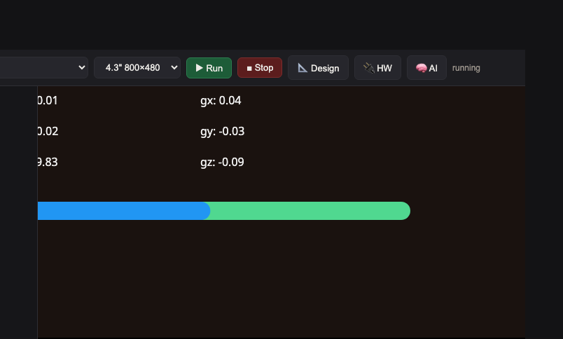

<style>
section { font-size: 24px; padding: 40px 52px; justify-content: flex-start; }
section h1 { font-size: 1.45em; line-height: 1.12; margin: 0 0 .22em; }
section h2 { font-size: 1.12em; margin: .15em 0; }
section h3 { font-size: 1.0em; margin: .12em 0; }
section p, section li { margin: .16em 0; line-height: 1.32; }
section img { max-width: 100%; height: auto; }
section svg { max-height: 250px; }
section table { font-size: .78em; }
section pre { font-size: .70em; line-height: 1.32; background:#0d1117; color:#e6edf3; border:1px solid #30363d; border-radius:8px; padding:12px 16px; box-shadow:0 2px 8px rgba(0,0,0,.25); }
section pre code { white-space: pre-wrap; background:transparent; color:inherit; } section pre .hljs-comment{color:#8b949e;font-style:italic} section pre .hljs-keyword,section pre .hljs-built_in,section pre .hljs-literal{color:#ff7b72} section pre .hljs-string{color:#a5d6ff} section pre .hljs-number{color:#79c0ff} section pre .hljs-title,section pre .hljs-title.function_,section pre .hljs-section{color:#d2a8ff} section pre .hljs-meta{color:#ffa657} section pre .hljs-attr,section pre .hljs-attribute,section pre .hljs-name{color:#7ee787}
section blockquote { margin: .25em 0; font-size: .92em; }
/* two images on a line (parity / 2x2 grids) stay side-by-side and small */
section p > img + img { margin-left: 10px; }
/* scroll-within-slide: dense slides scroll instead of clipping */
section { overflow-y: auto; overflow-x: hidden; }
section::-webkit-scrollbar { width: 11px; }
section::-webkit-scrollbar-thumb { background:#4a90d9; border-radius:6px; }
section::-webkit-scrollbar-track { background:rgba(0,0,0,.06); }
/* image drop-shadow + cover-slide readability (auto) */
section img{filter:drop-shadow(0 3px 12px rgba(0,0,0,.5))}
section.cover *{color:#fff !important}
section.cover h1,section.cover h2,section.cover h3,section.cover p,section.cover li,section.cover strong,section.cover em,section.cover blockquote,section.cover div{text-shadow:0 2px 9px rgba(0,0,0,.92),0 0 3px rgba(0,0,0,.8)}
section.cover div[style*="background:#"],section.cover div[style*="background: #"]{background:rgba(10,14,20,.66) !important;border-color:rgba(120,200,255,.45) !important;max-width:62%}
section.cover blockquote{border-left:4px solid rgba(120,200,255,.6) !important;background:rgba(13,17,23,.55) !important;border-radius:6px;padding:.3em .6em}
section.cover h1,section.cover h2,section.cover h3,section.cover p,section.cover blockquote{max-width:60%}
section.cover div:not(:has(img)){max-width:62%}
section.cover img{filter:none}
</style>

<!-- _class: cover -->
<!-- _backgroundColor: #0d1117 -->

# บทเรียน 2.2 — ลงมือทำ: DAQ logger เก็บ dataset ลง CSV

## DAQ: เก็บ dataset ลง CSV · สุ่มสัญญาณเซนเซอร์แล้วเก็บเป็นไฟล์ของเราเอง

**โมดูล 2 — เก็บข้อมูลจากเซนเซอร์ (DAQ)**

> ต่อจากบทเรียน 2.1 — สุ่มสัญญาณให้ตรงกับโมเดล: อัตราสุ่ม Nyquist หน้าต่าง และ schema ของ CSV

---

# โครงร่วมของโปรแกรม — DAQ ก็เดินสี่จังหวะเดิม

จากบทเรียน 1.4–1.5 เราจับ "โครงร่วม" ได้แล้ว: import → สร้างครั้งเดียว → ลูป → `ui.poll` วันนี้โครงเดิมเป๊ะ แต่ในลูปเราทำ **สี่จังหวะของ DAQ**

<div style="text-align:center;margin:6px 0">
<svg width="880" height="150" viewBox="0 0 880 150" font-family="DejaVu Sans, sans-serif">
  <defs>
    <marker id="arSk" markerUnits="userSpaceOnUse" markerWidth="12" markerHeight="10" refX="10" refY="4" orient="auto"><path d="M0,0 L10,4 L0,8 Z" fill="#607d8b"/></marker>
  </defs>
  <rect x="20" y="50" width="190" height="56" rx="10" fill="#cfd8dc" stroke="#607d8b" stroke-width="2"/>
  <text x="115" y="74" font-size="13" font-weight="700" fill="#455a64" text-anchor="middle">1 · schema</text>
  <text x="115" y="94" font-size="11" fill="#666" text-anchor="middle">เขียนหัวตารางครั้งเดียว</text>
  <rect x="238" y="50" width="190" height="56" rx="10" fill="#e3f2fd" stroke="#1565c0" stroke-width="2"/>
  <text x="333" y="74" font-size="13" font-weight="700" fill="#1565c0" text-anchor="middle">2 · sample</text>
  <text x="333" y="94" font-size="11" fill="#666" text-anchor="middle">motion() 6 แกน</text>
  <rect x="456" y="50" width="190" height="56" rx="10" fill="#e8f5e9" stroke="#2e7d32" stroke-width="2"/>
  <text x="551" y="74" font-size="13" font-weight="700" fill="#2e7d32" text-anchor="middle">3 · record</text>
  <text x="551" y="94" font-size="11" fill="#666" text-anchor="middle">write หนึ่งบรรทัด</text>
  <rect x="674" y="50" width="186" height="56" rx="10" fill="#fff3e0" stroke="#ef6c00" stroke-width="2"/>
  <text x="767" y="74" font-size="13" font-weight="700" fill="#e65100" text-anchor="middle">4 · rate</text>
  <text x="767" y="94" font-size="11" fill="#666" text-anchor="middle">sleep_ms(20)</text>
  <line x1="210" y1="78" x2="236" y2="78" stroke="#607d8b" stroke-width="2.4" marker-end="url(#arSk)"/>
  <line x1="428" y1="78" x2="454" y2="78" stroke="#607d8b" stroke-width="2.4" marker-end="url(#arSk)"/>
  <line x1="646" y1="78" x2="672" y2="78" stroke="#607d8b" stroke-width="2.4" marker-end="url(#arSk)"/>
  <path d="M767,106 C767,128 551,128 551,108" fill="none" stroke="#9e9e9e" stroke-width="2" stroke-dasharray="6 5" marker-end="url(#arSk)"/>
  <text x="659" y="132" font-size="11" fill="#9e9e9e" text-anchor="middle">วน BURST ครั้ง (2->3->4)</text>
  <text x="115" y="34" font-size="12" fill="#888" text-anchor="middle">ครั้งเดียวตอนเริ่ม</text>
  <text x="551" y="34" font-size="12" fill="#888" text-anchor="middle">วนซ้ำต่อหนึ่งครั้งที่กดปุ่ม</text>
</svg>
</div>

> จำสี่คำนี้ให้ขึ้นใจ: **schema → sample → record → rate** ทุก DAQ ในโลก ไม่ว่าเซนเซอร์อะไร ก็เดินสี่จังหวะนี้ ต่างแค่รายละเอียด

---

# โครงของไฟล์ s04_daq_logger.py

ทั้งไฟล์อ่านเป็นประโยคเดียว: **"เตรียมหัวตาราง → รอกดปุ่ม label → อัด 200 sample ที่ 50 Hz ลงไฟล์ → นับ → ออกให้เรียบร้อย"**

<div style="text-align:center;margin:6px 0">
<svg width="900" height="210" viewBox="0 0 900 210" font-family="DejaVu Sans, sans-serif">
  <defs>
    <marker id="arS4" markerUnits="userSpaceOnUse" markerWidth="12" markerHeight="10" refX="10" refY="4" orient="auto"><path d="M0,0 L10,4 L0,8 Z" fill="#607d8b"/></marker>
  </defs>
  <g font-size="14" text-anchor="middle">
    <rect x="14" y="24" width="180" height="54" rx="10" fill="#cfd8dc" stroke="#607d8b" stroke-width="2"/>
    <text x="104" y="47" font-weight="700" fill="#455a64">เขียน schema</text>
    <text x="104" y="66" font-size="11" fill="#999">try/except :49</text>
    <rect x="234" y="24" width="180" height="54" rx="10" fill="#e3f2fd" stroke="#1565c0" stroke-width="2"/>
    <text x="324" y="47" font-weight="700" fill="#1565c0">สร้างปุ่ม label</text>
    <text x="324" y="66" font-size="11" fill="#999">btns[] :41</text>
    <polygon points="524,51 574,23 624,51 574,79" fill="#fff3e0" stroke="#ef6c00" stroke-width="2"/>
    <text x="574" y="47" font-weight="700" fill="#e65100" font-size="12">กดปุ่ม?</text>
    <rect x="704" y="24" width="180" height="54" rx="10" fill="#eceff1" stroke="#607d8b" stroke-width="2"/>
    <text x="794" y="47" font-weight="700" fill="#455a64">ออก -> สรุป</text>
    <text x="794" y="66" font-size="11" fill="#999">finally :95</text>
    <!-- row B: record() -->
    <rect x="180" y="140" width="170" height="58" rx="10" fill="#e3f2fd" stroke="#1565c0" stroke-width="2"/>
    <text x="265" y="162" font-weight="700" fill="#1565c0">sample</text>
    <text x="265" y="180" font-size="11" fill="#999">motion() :69</text>
    <rect x="370" y="140" width="170" height="58" rx="10" fill="#e8f5e9" stroke="#2e7d32" stroke-width="2"/>
    <text x="455" y="162" font-weight="700" fill="#2e7d32">record</text>
    <text x="455" y="180" font-size="11" fill="#999">f.write :73</text>
    <rect x="560" y="140" width="170" height="58" rx="10" fill="#fff3e0" stroke="#ef6c00" stroke-width="2"/>
    <text x="645" y="162" font-weight="700" fill="#e65100">rate</text>
    <text x="645" y="180" font-size="11" fill="#999">sleep_ms :76</text>
  </g>
  <line x1="194" y1="51" x2="232" y2="51" stroke="#607d8b" stroke-width="2.4" marker-end="url(#arS4)"/>
  <line x1="414" y1="51" x2="522" y2="51" stroke="#607d8b" stroke-width="2.4" marker-end="url(#arS4)"/>
  <line x1="624" y1="51" x2="702" y2="51" stroke="#607d8b" stroke-width="2.4" marker-end="url(#arS4)"/>
  <text x="663" y="43" font-size="11" fill="#607d8b">no</text>
  <path d="M574,79 C574,118 265,108 265,138" fill="none" stroke="#2e7d32" stroke-width="2" stroke-dasharray="6 5" marker-end="url(#arS4)"/>
  <text x="430" y="112" font-size="12" fill="#2e7d32">yes -> record() วน BURST ครั้ง</text>
  <line x1="350" y1="169" x2="368" y2="169" stroke="#607d8b" stroke-width="2.4" marker-end="url(#arS4)"/>
  <line x1="540" y1="169" x2="558" y2="169" stroke="#607d8b" stroke-width="2.4" marker-end="url(#arS4)"/>
  <path d="M645,198 C645,206 265,206 265,200" fill="none" stroke="#9e9e9e" stroke-width="2" stroke-dasharray="6 5" marker-end="url(#arS4)"/>
</svg>
</div>

> ตัวเลขบรรทัด (`:55`, `:69`, `:73`, `:76`) ชี้ไปที่ 4 จุดที่คุณต้องเติมโค้ดในไฟล์ฝึก — ตรงกับสี่จังหวะ DAQ เป๊ะ

---

# ไล่โค้ด (1) — เขียน schema ครั้งเดียว

**ช่องเติมที่ 1**: บรรทัดแรกของ CSV คือหัวตาราง เขียนครั้งเดียวถ้าไฟล์ยังไม่มี

```python
try:
    open(PATH, "r").close()       # เปิดอ่านได้ = ไฟล์มีอยู่แล้ว ข้ามไป
except OSError:
    with open(PATH, "w") as f:    # ยังไม่มีไฟล์ -> สร้างพร้อมหัวตาราง
        # เติม: เขียนหัวตาราง (schema)
        #       f.write("label,ax,ay,az,gx,gy,gz\n")
        pass
```

- แทน `pass` ด้วย `f.write("label,ax,ay,az,gx,gy,gz\n")` — สังเกต `\n` ปิดท้ายบรรทัด
- ทำไมต้อง try/except? เพื่อ **เขียนหัวครั้งเดียว** ถ้าไฟล์มีแล้ว (เคยเก็บมาก่อน) จะได้ไม่เขียนหัวซ้ำกลางไฟล์
- ถ้าลืมเติม: ไฟล์จะไม่มีหัว เครื่อง train อาจอ่านคอลัมน์ผิด หรือเข้าใจบรรทัดแรกเป็นข้อมูล

> โหมด `"w"` ใช้ตรงนี้ได้เพราะเรารู้แน่ว่าไฟล์ยังไม่มี (อยู่ใน `except OSError`) — ที่อื่นเราใช้ `"a"` เสมอ เพื่อไม่ทับของเก่า

---

# ไล่โค้ด (2) — sample: อ่านเซนเซอร์

**ช่องเติมที่ 2**: ในลูป `record()` อ่าน IMU หนึ่ง snapshot ครบ 6 แกน

```python
with open(PATH, "a") as f:
    for _ in range(BURST):
        # เติม: อ่าน IMU หนึ่ง snapshot ครบ 6 แกน
        #       ax, ay, az, gx, gy, gz = sensors.bmi270.motion()
        ax = ay = az = gx = gy = gz = 0.0
        pass
```

- แทน `pass` ด้วย `ax, ay, az, gx, gy, gz = sensors.bmi270.motion()` (บรรทัด `= 0.0` มีไว้กัน error ตอนยังไม่เติม ลบทิ้งได้หรือปล่อยไว้ก็ได้เพราะจะถูกทับ)
- `motion()` คืน tuple 6 ค่า เรารับด้วยการ unpack เข้า 6 ตัวแปรพร้อมกัน
- ถ้าลืมเติม: ทุกบรรทัดจะเป็น `0.0` หมด — dataset มีแต่ศูนย์ โมเดลเรียนอะไรไม่ได้

> ลองเดาก่อน: ถ้าเราวางบอร์ดนิ่งแล้วอ่าน `az` จะได้ประมาณเท่าไร? (ใบ้: แรงโน้มถ่วง ~9.8) — ทดสอบใน REPL ได้เลย `sensors.bmi270.motion()`

---

# ไล่โค้ด (3) — record + rate

**ช่องเติมที่ 3 และ 4**: เขียน sample เป็นหนึ่งบรรทัด แล้วเว้นจังหวะให้อัตราคงที่

```python
        # เติม: เขียน sample นี้เป็นหนึ่งบรรทัด (เรียงคอลัมน์ให้ตรง schema)
        #       f.write("%s,%.4f,%.4f,%.4f,%.4f,%.4f,%.4f\n"
        #               % (label, ax, ay, az, gx, gy, gz))
        pass
        # เติม: เว้นจังหวะให้คงที่ คุมอัตราสุ่มให้ ~50 Hz
        #       time.sleep_ms(RATE_MS)
        pass
```

- ช่อง 3: แทนด้วย `f.write("%s,%.4f,...\n" % (label, ax, ay, az, gx, gy, gz))` — `%s` สำหรับ label, `%.4f` เก็บทศนิยม 4 ตำแหน่ง, ปิดด้วย `\n`
- ช่อง 4: แทนด้วย `time.sleep_ms(RATE_MS)` — นี่คือหัวใจที่ทำให้ได้ **50 Hz** ถ้าลบทิ้งจะสุ่มเร็วสุดกำลัง อัตราจะไม่ตรงกับที่โมเดลกิน
- ลำดับสำคัญ: อ่าน → เขียน → หน่วง แล้ววนใหม่ ครบ `BURST` รอบ

> เรียงคอลัมน์ต้องตรง schema เป๊ะ: `label` ก่อน แล้ว `ax,ay,az,gx,gy,gz` — ถ้าสลับ ตอน train ข้อมูลจะเข้าคอลัมน์ผิดโดยไม่มี error เตือน (บั๊กเงียบที่อันตรายสุด)

---

# ไล่โค้ด (4) — นับ + จบให้เรียบร้อย

หลังอัดครบหนึ่ง burst เราอัปเดตตัวนับบนจอ แล้วตอนออกก็สรุปให้เรียบร้อย (สองส่วนนี้ให้ไว้แล้ว)

```python
    total += BURST
    count_lbl.text("บันทึกแล้ว: %d samples" % total)
    ...
finally:
    lcd.console(" DAQ done: %d samples total in %s" % (total, PATH))
```

- `total` นับ sample สะสมทั้งหมด โชว์บนจอเพื่อให้เห็น dataset โตขึ้นทุกครั้งที่กด
- บล็อก `finally` ให้ไว้แล้ว: ไม่ว่าจะออกด้วยปุ่ม back หรือ error ก็สรุปยอดเสมอ (ไฟล์ถูกปิด+flush ไปแล้วในแต่ละ `with`)
- ต่างจากชุดบทเรียน edge_ai ตรงที่ **ไม่มีเครื่องยนต์ต้อง stop** — แต่นิสัย "จบให้เรียบร้อย" เหมือนกัน

> ข้อดีของ `with open(...)`: แต่ละ burst ปิดไฟล์เอง ข้อมูล flush ลง flash ทันที ถ้าถอดสายกลางคัน อย่างน้อย burst ที่เขียนจบแล้วก็ปลอดภัย

---

# อัตราจริง ไม่เท่าอัตราที่ตั้ง — เรื่องต้องรู้

`time.sleep_ms(20)` ไม่ได้แปลว่าได้ 50 Hz เป๊ะ เพราะแต่ละรอบยังมีเวลา **อ่านเซนเซอร์ + เขียนไฟล์** บวกเพิ่ม

<div style="text-align:center;margin:6px 0">
<svg width="820" height="130" viewBox="0 0 820 130" font-family="DejaVu Sans, sans-serif">
  <rect x="30" y="40" width="140" height="34" fill="#bbdefb" stroke="#1565c0"/>
  <text x="100" y="62" font-size="12" fill="#1565c0" text-anchor="middle">sleep 20 ms</text>
  <rect x="170" y="40" width="60" height="34" fill="#ffe0b2" stroke="#ef6c00"/>
  <text x="200" y="62" font-size="10" fill="#e65100" text-anchor="middle">อ่าน</text>
  <rect x="230" y="40" width="60" height="34" fill="#c8e6c9" stroke="#2e7d32"/>
  <text x="260" y="62" font-size="10" fill="#2e7d32" text-anchor="middle">เขียน</text>
  <text x="330" y="62" font-size="13" fill="#333">= หนึ่งรอบจริง ~23-25 ms  ->  อัตราจริง ~40-45 Hz</text>
  <text x="30" y="100" font-size="12" fill="#888">ฉบับเต็ม (full_apps) วัดค่านี้ให้ดู: นับ sample หารด้วยเวลาจริงด้วย time.ticks_diff</text>
</svg>
</div>

- นี่ไม่ใช่บั๊ก แต่เป็น **ความจริงของ embedded** — งานอื่นในรอบกินเวลาด้วย อัตราจริงจึงต่ำกว่าที่ตั้งเล็กน้อย
- ตราบใดที่มันต่ำกว่าแบบ **สม่ำเสมอ** ก็ยังใช้ได้ ที่แย่คืออัตรา **แกว่งไปมา** (เดี๋ยวเร็วเดี๋ยวช้า)
- ฉบับเต็มโชว์ "อัตราจริง Hz" บนจอ ลองรันแล้วเทียบกับ 50 ที่เราตั้ง จะเห็นช่องว่างเอง

> บทเรียน: **อย่าเชื่อค่าที่ตั้ง จงวัดค่าที่ได้จริง** — วิศวกร Edge AI วัดอัตราสุ่มจริงเสมอ เพราะมันกระทบว่า dataset จะตรงกับตอน deploy ไหม

---

# label ให้ตรงกับโมเดล + class balance

เราตั้ง `LABELS = ("idle", "circle", "shaking")` ให้ **ตรงกับคลาสของโมเดล Motion เป๊ะ** — จะได้เทียบ dataset ของเรากับโมเดลสำเร็จรูปได้

```python
LABELS = ("idle", "circle", "shaking")   # ตรงกับคลาสโมเดล Motion จากบทเรียน 1.1–1.3
```

- เก็บให้ **สมดุล**: ถ้าเก็บ `idle` 3 burst แต่ `shaking` แค่ 1 burst โมเดลที่ train จากนี้จะเอนไปทาย idle
- แนะนำ: เก็บทุก label ให้เท่าๆ กัน เช่นคนละ 2-3 burst แล้วสลับคนทำท่า จะได้ความหลากหลาย
- ในฉบับเต็มมีตัวนับแยกต่อ label ให้เห็นชัดว่าท่าไหนเก็บไปกี่ sample แล้ว (ดู class balance สดๆ)

> นี่คือจุดที่ DAQ กลายเป็น "งานฝีมือ" — ไม่ใช่แค่กดปุ่มมั่ว แต่วางแผนว่าจะเก็บอะไร กี่ครั้ง ให้ครบและสมดุล เดี๋ยวบทเรียน 5.1–5.2 (Dataset engineering) เราจะจริงจังกับเรื่องนี้

---

# จาก CSV วันนี้ ไปเป็นโมเดลข้างหน้า

ไฟล์ `/gestures.csv` ที่เราเก็บวันนี้ ไม่ได้จบในตัว มันคือ **วัตถุดิบ** ของโมดูล 5 (Training) ข้างหน้า

<div style="text-align:center;margin:8px 0">
<svg width="880" height="120" viewBox="0 0 880 120" font-family="DejaVu Sans, sans-serif">
  <defs>
    <marker id="arNext" markerUnits="userSpaceOnUse" markerWidth="12" markerHeight="10" refX="10" refY="4" orient="auto"><path d="M0,0 L10,4 L0,8 Z" fill="#607d8b"/></marker>
  </defs>
  <rect x="20" y="40" width="160" height="52" rx="10" fill="#e3f2fd" stroke="#1565c0" stroke-width="2"/>
  <text x="100" y="62" font-size="12" font-weight="700" fill="#1565c0" text-anchor="middle">2.1–2.2 · วันนี้</text>
  <text x="100" y="80" font-size="10" fill="#666" text-anchor="middle">gestures.csv</text>
  <rect x="230" y="40" width="160" height="52" rx="10" fill="#e8f5e9" stroke="#2e7d32" stroke-width="2"/>
  <text x="310" y="62" font-size="12" font-weight="700" fill="#2e7d32" text-anchor="middle">5.1–5.2 · จัด dataset</text>
  <text x="310" y="80" font-size="10" fill="#666" text-anchor="middle">split/balance</text>
  <rect x="440" y="40" width="160" height="52" rx="10" fill="#f3e5f5" stroke="#6a1b9a" stroke-width="2"/>
  <text x="520" y="62" font-size="12" font-weight="700" fill="#6a1b9a" text-anchor="middle">5.3–5.5 · train</text>
  <text x="520" y="80" font-size="10" fill="#666" text-anchor="middle">TensorFlow</text>
  <rect x="650" y="40" width="160" height="52" rx="10" fill="#e0f7fa" stroke="#00838f" stroke-width="2"/>
  <text x="730" y="62" font-size="12" font-weight="700" fill="#00838f" text-anchor="middle">5.8–5.9 · บนบอร์ด</text>
  <text x="730" y="80" font-size="10" fill="#666" text-anchor="middle">edge_ai</text>
  <line x1="180" y1="66" x2="226" y2="66" stroke="#607d8b" stroke-width="2.4" marker-end="url(#arNext)"/>
  <line x1="390" y1="66" x2="436" y2="66" stroke="#607d8b" stroke-width="2.4" marker-end="url(#arNext)"/>
  <line x1="600" y1="66" x2="646" y2="66" stroke="#607d8b" stroke-width="2.4" marker-end="url(#arNext)"/>
</svg>
</div>

- วันนี้เราแค่ "เก็บ" — การจัด split (train/val/test), การ train, การ quantize เป็นเรื่องของโมดูล 5
- แต่ทุกอย่างเริ่มจากไฟล์นี้ **ถ้า dataset วันนี้ดี โมเดลข้างหน้าก็มีโอกาสดี**
- นี่คือเหตุผลที่หลักสูตรวาง DAQ เป็น Pillar 1 — ต้นน้ำสะอาด ปลายน้ำถึงจะสะอาด

> เก็บ dataset วันนี้ให้ดีๆ นะ เดี๋ยวโมดูล 5 (Training) คุณจะได้เอาไฟล์ของตัวเองไป train เป็นโมเดลของตัวเอง แล้วรันบน NPU จริง — เต็มวงจร

---

# ตรวจ dataset — เปิดไฟล์ดูว่าได้อะไรจริง

เก็บเสร็จอย่าเพิ่งเชื่อ ตรวจก่อนเสมอ ว่าไฟล์มีข้อมูลจริง หัวถูก จำนวนบรรทัดสมเหตุผล

```python
# ที่ REPL บนบอร์ด: นับบรรทัด + ดู 3 บรรทัดแรก
f = open("/gestures.csv")
lines = f.readlines(); f.close()
print("จำนวนบรรทัด:", len(lines))     # ควร = 1 หัว + (จำนวน burst x 200)
for ln in lines[:3]:
    print(ln.strip())
```

- **นับบรรทัด** — เก็บ 3 burst ควรได้ `1 + 3*200 = 601` บรรทัด ถ้าน้อยกว่านี้แปลว่าบางอย่างพลาด
- **ดูหัว** — บรรทัดแรกต้องเป็น `label,ax,ay,az,gx,gy,gz` เป๊ะ
- **ดูค่า** — ค่าเป็นตัวเลขจริงไหม (ไม่ใช่ 0.0 หมด) label ตรงกับท่าที่ทำไหม

> "ตรวจก่อนเชื่อ" เป็นนิสัยวิศวกรข้อมูล — dataset ที่ดูเผินๆ เหมือนโอเค แต่มี label ผิดปนอยู่ จะทำให้ train เสียเวลาเป็นวันโดยไม่รู้ตัว

---

# สลับเซนเซอร์ก็ได้ dataset คนละแบบ

โครง logger นี้ไม่ผูกกับ IMU มันคือ **แม่แบบ** เปลี่ยนแค่บรรทัด `sample` กับ schema ก็เก็บเซนเซอร์อื่นได้

| อยากเก็บ | เปลี่ยนบรรทัด sample เป็น | schema (หัวตาราง) |
|---|---|---|
| IMU (วันนี้) | `sensors.bmi270.motion()` | `label,ax,ay,az,gx,gy,gz` |
| ความดัน/อุณหภูมิ | `sensors.dps368.pressure_temperature()` | `label,hpa,tempC` |
| ความชื้น | `sensors.sht40.temperature_humidity()` | `label,tempC,rh` |
| เรดาร์ (บอร์ดเท่านั้น) | `sensors.radar()` | `label,presence,energy` |

- เปลี่ยนแค่สองที่: **บรรทัดที่อ่านเซนเซอร์** กับ **หัวตาราง/รูปแบบบรรทัด** ที่เหลือเหมือนเดิมทั้งหมด
- เซนเซอร์ที่เปลี่ยนช้า (ความดัน/ความชื้น) ตั้ง `RATE_MS` สูงขึ้นได้ เช่น 500 (2 Hz) ก็พอ ไม่ต้อง 50 Hz
- นี่คือพลังของการจับ "โครงร่วม" ได้ — เขียนแม่แบบครั้งเดียว ใช้ได้กับทุกเซนเซอร์

> ลองเป็นการบ้าน: fork ไฟล์เป็น `s04_baro_logger.py` เก็บความดันทุก 1 วินาที แล้วยกบอร์ดขึ้น-ลง — คุณจะเห็น dataset ของสัญญาณช้าๆ ที่หน้าตาต่างจาก IMU สิ้นเชิง

---

# ลงมือ (1) — รันบน BENTO Emulator

ไม่มีบอร์ดก็เริ่มได้ Emulator จำลอง IMU ให้:

1. เปิด **ide.tesaiot.dev** (BENTO Emulator) ในเบราว์เซอร์
2. เปิดไฟล์ [`s04_daq_logger.py`](https://github.com/tesaiot/tesa-qualification-program/blob/main/courses/edge-ai-developer/m02-daq/l02-daq-logger-lab/practice/s04_daq_logger.py) (หรือวางโค้ด)
3. เติมช่องว่าง 4 จุดตามคำใบ้ แล้วกด **Run**
4. กดปุ่ม `shaking` แล้วใช้ตัวควบคุมของ Emulator จำลองการเขย่า ดู samples วิ่งขึ้น
5. ทำครบทุก label แล้วเปิดไฟล์ `/gestures.csv` ดูเนื้อใน

> Emulator รองรับ IMU เต็มตัว เหมาะกับซ้อมเก็บ dataset ที่บ้าน — โค้ดชุดเดียวกับบอร์ดจริงเป๊ะ (สำหรับเสียง/เรดาร์ ต้องใช้บอร์ด เดี๋ยวบทเรียน 2.3–2.4 ว่ากัน)

---

# หน้าตา Emulator ตอนเก็บ dataset

<div style="text-align:center;margin:6px 0">



</div>

จอ BENTO Emulator ขณะรันแดชบอร์ด IMU (ตัวอย่าง 01) — ค่าที่เห็นมาจากตัวจำลอง IMU ตัวเดียวกับที่ logger ของเราอ่าน พอรัน logger จอจะมีปุ่ม label และตัวนับ samples เพิ่มขึ้นมา

- ค่า `ax,ay,az,gx,gy,gz` วิ่งตามที่เราขยับ/จำลองการเขย่า — เห็นข้อมูลก่อนมันลงไฟล์
- กดปุ่ม label แล้วดูตัวนับ samples เพิ่มทีละ burst — นี่คือ dataset กำลังก่อตัวตรงหน้า
- หน้านี้คือ **สนามซ้อม**: โค้ดชุดเดียวกับบอร์ดจริง เก็บ `/gestures.csv` ได้เหมือนกันเป๊ะ

> เปิด ide.tesaiot.dev แล้วลองเขย่าดู ค่าบนจอต้องแกว่งตาม ถ้านิ่งสนิท แปลว่ายังไม่ได้เชื่อมตัวจำลอง IMU

---

# ลงมือ (2) — รันบนบอร์ด BENTO จริง

บนบอร์ดจริงเราเก็บด้วยเซนเซอร์จริง ท่าจริง มือเราเอง:

1. เสียบบอร์ดเข้าคอมด้วยสาย USB
2. เปิด [`s04_daq_logger.py`](https://github.com/tesaiot/tesa-qualification-program/blob/main/courses/edge-ai-developer/m02-daq/l02-daq-logger-lab/practice/s04_daq_logger.py) ใน **BENTO IDE** กด **Program to Device**
3. กดปุ่ม `idle` วางบอร์ดนิ่งๆ จนบันทึกครบ · กด `circle` วาดวงกลมในอากาศ · กด `shaking` เขย่า
4. ดูตัวนับ samples เพิ่มทีละ 200 ทุกครั้งที่กด
5. กด **< ออก** แล้วตรวจไฟล์ `/gestures.csv` (ใช้ REPL ตามสไลด์ก่อนหน้า)

> ข้อดีของบอร์ดจริง: ค่าที่ได้คือความเร่ง/ไจโรจริงจากการเคลื่อนไหวของคุณ — dataset นี้เอาไป train แล้วรันกลับบนบอร์ดเดิมได้เลย (บทเรียน 5.8–5.9) ครบวงจรของจริง

---

# ลงมือทำ — เติมช่องว่างทั้ง 4 จุด

เปิด [`s04_daq_logger.py`](https://github.com/tesaiot/tesa-qualification-program/blob/main/courses/edge-ai-developer/m02-daq/l02-daq-logger-lab/practice/s04_daq_logger.py) มี `pass` วางไว้ **4 จุด** ตรงสี่จังหวะ DAQ เป๊ะ:

| # | จังหวะ | เติมด้วย | ถ้าลืม |
|---|---|---|---|
| 1 | schema | `f.write("label,ax,ay,az,gx,gy,gz\n")` | ไฟล์ไม่มีหัว train อ่านผิด |
| 2 | sample | `ax, ay, az, gx, gy, gz = sensors.bmi270.motion()` | ทุกบรรทัดเป็น 0.0 |
| 3 | record | `f.write("%s,%.4f,...\n" % (label, ax, ...))` | ไม่มีข้อมูลถูกเขียนลงไฟล์ |
| 4 | rate | `time.sleep_ms(RATE_MS)` | สุ่มเร็วเกิน อัตราไม่ตรงโมเดล |

ขั้นตอน:

1. ไล่หา `# เติม:` ทีละจุด แล้วแทน `pass` ด้วยคำสั่งตามคำใบ้
2. กด **Run** (Emulator) หรือ **Program to Device** (บอร์ด)
3. กดปุ่ม label ทำท่า ดู samples เพิ่มขึ้น ถ้าไม่ขึ้น กลับมาเช็ก indent กับชื่อคำสั่ง

> สี่ช่องนี้คือสี่จังหวะของ DAQ เป๊ะ — เติมครบเมื่อไร คุณได้ dataset ไฟล์แรกของตัวเอง

---

# จุดพลาดที่เจอบ่อย

เก็บ dataset มีกับดักเงียบๆ ที่ไม่ขึ้น error แต่ทำ dataset เสีย ระวังสี่อย่างนี้:

- **ใช้ `"w"` แทน `"a"`** — เปิดแบบ `"w"` ทุกครั้งจะ **ทับ** ไฟล์ เก็บ 3 burst เหลือ burst เดียว (ต้องใช้ `"a"` append)
- **กดปุ่มผิด label** — กด `shaking` แต่วางนิ่ง ข้อมูลจะสอนโมเดลผิด (ฉบับเต็มมีปุ่ม Clear ล้างเริ่มใหม่)
- **คอลัมน์สลับ** — เขียน `gx` ก่อน `ax` ไม่ตรง schema เครื่อง train อ่านเข้าคอลัมน์ผิดโดยไม่เตือน
- **ลืม `\n`** — ไม่ปิดบรรทัด ทุก sample จะต่อกันเป็นบรรทัดเดียวยาวเหยียด อ่านไม่ออก

> กับดักพวกนี้ "เงียบ" — โปรแกรมรันผ่าน ไฟล์มีข้อมูล แต่ผิด นี่คือเหตุผลที่สไลด์ก่อนย้ำให้ **เปิดไฟล์ตรวจเสมอ** ก่อนเชื่อว่า dataset ใช้ได้

---

# แหล่งเรียนรู้เพิ่มเติม — sampling & data acquisition

อยากเข้าใจ sampling theorem กับการเก็บข้อมูลให้ลึกกว่านี้ ลองตามลิงก์เหล่านี้:

**วิดีโอ (ช่องการศึกษาที่น่าเชื่อถือ)**

- Fourier / ความถี่ของสัญญาณ — ช่อง 3Blue1Brown: https://www.youtube.com/@3blue1brown
- Digital Audio & Sampling (aliasing แบบเห็นภาพ) — ช่อง Computerphile: https://www.youtube.com/@Computerphile
- Data & Python สำหรับงานเซนเซอร์ — ช่อง sentdex: https://www.youtube.com/@sentdex

**บทความ / ภาพอ้างอิง**

- Nyquist–Shannon sampling theorem — https://en.wikipedia.org/wiki/Nyquist%E2%80%93Shannon_sampling_theorem (ที่มา: Wikipedia, CC BY-SA)
- ภาพประกอบ aliasing — https://commons.wikimedia.org/wiki/Category:Aliasing (ที่มา: Wikimedia Commons, public domain / CC)

> วิดีโอ/ภาพภายนอกเป็นของเจ้าของต้นฉบับ ใช้เพื่อการศึกษา อ้างอิงลิงก์ต้นทาง — สไลด์นี้ให้ลิงก์ไว้เท่านั้น ไม่ได้ฝังตัววิดีโอหรือคัดลอกภาพมา

---

# ชัยชนะที่เห็นได้ + MVP ของชุดบทเรียนนี้

<div style="text-align:center;margin:14px 0">
<div style="display:inline-block;background:#e8f5e9;border:2px solid #2e7d32;border-radius:22px;padding:10px 22px;color:#2e7d32;font-weight:700;font-size:1.05em">
ชัยชนะที่เห็นได้ของชุดบทเรียนนี้ · ไฟล์ /gestures.csv บนบอร์ด เต็มไปด้วย sample ที่ติด label แล้ว พร้อมเอาไป train
</div>
</div>

**MVP ของบทเรียน 2.1–2.2 (เกณฑ์ผ่านของชุดบทเรียน):** คุณเขียน logger ที่เก็บ **N samples ที่ติด label** ลง CSV ได้จริง — เลือก label, สุ่มที่อัตราคงที่, เขียนลงไฟล์บนบอร์ด, ตรวจได้ว่าไฟล์มีจำนวนบรรทัดถูกต้อง

- ทำบน **Emulator** (IMU) หรือ **บอร์ดจริง** ก็ได้ (โค้ดชุดเดียวกัน)
- อธิบายได้ว่าโค้ดทำสี่จังหวะ `schema` / `sample` / `record` / `rate` ตรงไหน และทำไม 50 Hz

> "เก็บ dataset ได้" ไม่ใช่แค่ "เห็นตัวเลขวิ่ง" — คุณต้องเปิดไฟล์แล้วบอกได้ว่ากี่บรรทัด หัวถูกไหม แต่ละ label เก็บไปเท่าไร สมดุลหรือยัง

---

# บันไดช่วยเหลือ — ใบ้ → เริ่มจากโครง → เฉลย → ฉบับเต็ม

ถ้าติด ให้ไต่บันไดนี้ทีละขั้น อย่าเพิ่งกระโดดไปดูเฉลย เพราะของจะเข้าหัวตอนที่คุณพยายามเองก่อน:

- **ใบ้** — คำใบ้อยู่ในคอมเมนต์ `# เติม:` ทั้ง 4 จุดในไฟล์ฝึก + ตารางสี่จังหวะหน้าที่แล้ว บอกว่าแต่ละช่องเติมอะไร
- **เริ่มจากโครง** — [`s04_daq_logger.py`](https://github.com/tesaiot/tesa-qualification-program/blob/main/courses/edge-ai-developer/m02-daq/l02-daq-logger-lab/practice/s04_daq_logger.py) มีโครงครบทั้งไฟล์แล้ว เหลือแค่ 4 บรรทัดให้เติม
- **เฉลย** — [`s04_daq_logger.py`](https://github.com/tesaiot/tesa-qualification-program/blob/main/courses/edge-ai-developer/m02-daq/l02-daq-logger-lab/solution/s04_daq_logger.py) เติมครบพร้อมคอมเมนต์อธิบายทุกช่อง (อ่านให้เข้าใจ ปิดไฟล์ แล้วพิมพ์เอง)
- **ฉบับเต็ม** — [`s04_daq_logger_full.py`](https://github.com/tesaiot/tesa-qualification-program/blob/main/courses/edge-ai-developer/m02-daq/l02-daq-logger-lab/examples/s04_daq_logger_full.py) ฉบับขัดเรียบร้อย เพิ่มตัวนับแยก label (class balance) + วัดอัตราจริง Hz + ปุ่ม Clear

> อยากท้าทายเพิ่ม? ในไฟล์ example [`s04_daq_logger.py`](https://github.com/tesaiot/tesa-qualification-program/blob/main/courses/edge-ai-developer/m02-daq/l02-daq-logger-lab/examples/s04_daq_logger.py) คือฉบับอ้างอิงที่ชุดบทเรียนนี้สร้างขึ้นรอบๆ — เปิดเทียบดูได้ว่าโครงเดียวกับที่คุณเติม

---

# เชื่อมโยงรากฐาน — วันนี้เราแตะอะไรไปบ้าง

การเก็บ dataset ไฟล์แรกซ่อนแนวคิด DAQ หลายชั้นที่จะใช้ไปตลอดคอร์ส:

**ฝั่ง DAQ / ข้อมูล**
- **Sampling rate** — สุ่มที่อัตราคงที่ และต้องตรงกับที่โมเดลกิน (50 Hz)
- **Schema / CSV** — หนึ่งบรรทัดต่อ sample, หัวตารางคือสัญญาของคอลัมน์
- **Labelling + balance** — ทุก sample มี label, เก็บให้สมดุลทุกคลาส
- **อัตราจริง vs อัตราตั้ง** — วัดค่าที่ได้จริง อย่าเชื่อค่าที่ตั้ง

**ฝั่ง MicroPython / โครงโปรแกรม**
- **โครงร่วมสี่จังหวะ** — import → สร้างครั้งเดียว → ลูป → `ui.poll` (เหมือน โมดูล 1)
- **File I/O บนบอร์ด** — `open`/`write`/`with`, โหมด `"a"` vs `"w"`
- **อ่านเซนเซอร์ snapshot** — `sensors.bmi270.motion()` 6 แกนใต้ lock เดียว

> ทั้งหมดนี้คือ Pillar 1 ของวงจร — จากนี้เราจะไล่ขึ้น Processing (บทเรียน 3.1–3.2) → Analysis (บทเรียน 4.1–4.2) จนถึง Training (บทเรียน 5.1–5.2+) แล้วคุณจะได้เอาไฟล์ CSV วันนี้ไปสร้างเป็นโมเดลของตัวเอง

---

# ใช้จริงที่ไหน — data logging ในโลกจริง

การเก็บข้อมูลเซนเซอร์ลงไฟล์ ไม่ใช่แบบฝึกหัด แต่เป็นงานที่ทำจริงในทุกสายที่มีเซนเซอร์:

<div style="text-align:center;margin:6px 0">
<svg width="880" height="210" viewBox="0 0 880 210" font-family="DejaVu Sans, sans-serif">
  <rect x="12" y="10" width="420" height="92" rx="10" fill="#e3f2fd" stroke="#1565c0" stroke-width="2"/>
  <text x="28" y="34" font-size="13" font-weight="700" fill="#1565c0">สุขภาพ/การกีฬา (IMU)</text>
  <text x="28" y="56" font-size="11" fill="#555">อัดท่าออกกำลัง/การเดิน เก็บเป็น dataset</text>
  <text x="28" y="76" font-size="11" fill="#555">แล้ว train โมเดลนับก้าว/ตรวจการล้ม</text>
  <text x="28" y="94" font-size="11" fill="#888">เริ่มจาก logger แบบวันนี้เป๊ะ</text>
  <rect x="448" y="10" width="420" height="92" rx="10" fill="#e8f5e9" stroke="#2e7d32" stroke-width="2"/>
  <text x="464" y="34" font-size="13" font-weight="700" fill="#2e7d32">เครื่องจักร/โรงงาน (สั่นสะเทือน)</text>
  <text x="464" y="56" font-size="11" fill="#555">เก็บสัญญาณสั่นของมอเตอร์ที่อัตราคงที่</text>
  <text x="464" y="76" font-size="11" fill="#555">predictive maintenance - ทายว่าจะเสีย</text>
  <text x="464" y="94" font-size="11" fill="#888">schema + rate เหมือนกันทุกอย่าง</text>
  <rect x="12" y="112" width="420" height="88" rx="10" fill="#fff3e0" stroke="#ef6c00" stroke-width="2"/>
  <text x="28" y="136" font-size="13" font-weight="700" fill="#e65100">สิ่งแวดล้อม (baro/humidity)</text>
  <text x="28" y="158" font-size="11" fill="#555">log ความดัน/ความชื้นทุก N วินาที</text>
  <text x="28" y="178" font-size="11" fill="#555">สลับ sensors.bmi270 เป็น dps368/sht40</text>
  <text x="28" y="196" font-size="11" fill="#888">โครง logger เดิม เปลี่ยนแค่บรรทัดอ่าน</text>
  <rect x="448" y="112" width="420" height="88" rx="10" fill="#f3e5f5" stroke="#6a1b9a" stroke-width="2"/>
  <text x="464" y="136" font-size="13" font-weight="700" fill="#6a1b9a">ร่วมกัน — dataset คือรากของทุกโมเดล</text>
  <text x="464" y="158" font-size="11" fill="#555">ไม่มี dataset ดี = ไม่มีโมเดลดี</text>
  <text x="464" y="178" font-size="11" fill="#555">คนเก็บข้อมูลเก่ง มีค่าไม่แพ้คนเทรน</text>
  <text x="464" y="196" font-size="11" fill="#888">นี่คือทักษะที่ชุดบทเรียนนี้เริ่มปลูก</text>
</svg>
</div>

> logger ที่คุณเขียนวันนี้ เปลี่ยนเซนเซอร์ก็ใช้ได้กับทุกงานข้างบน — โครงสี่จังหวะ `schema/sample/record/rate` เดิม ต่างแค่บรรทัดที่อ่านเซนเซอร์

---

# งานทำเอง + สรุปบทเรียน

**งานทำเอง (ท้ายบทเรียน):**

1. เติม [`s04_daq_logger.py`](https://github.com/tesaiot/tesa-qualification-program/blob/main/courses/edge-ai-developer/m02-daq/l02-daq-logger-lab/practice/s04_daq_logger.py) ให้ครบทั้ง 4 ช่อง เก็บ dataset ได้จริง (Emulator หรือบอร์ด)
2. เก็บครบทั้ง **3 label** (idle / circle / shaking) อย่างน้อยคนละ 2 burst แล้วเปิดไฟล์นับบรรทัดยืนยัน
3. ทดลอง: เปลี่ยน `RATE_MS` เป็น 40 (25 Hz) แล้วเก็บอีกชุด เทียบว่าจำนวนบรรทัดต่อวินาทีต่างกันยังไง อธิบายว่าทำไมอัตราต้องตรงกับโมเดล

ใบ้ข้อ 3 — ที่ 25 Hz หนึ่ง burst (200 sample) จะใช้เวลานานขึ้นเป็นสองเท่า และรูปคลื่นที่ได้จะ "ห่าง" กว่าเดิม ไม่เหมือนที่โมเดล 50 Hz เคยเห็น

**วันนี้เราได้:** เข้าใจว่า DAQ คืออะไรและอยู่ต้นวงจร · รู้จักอัตราสุ่มและทำไมต้องคงที่+ตรงโมเดล · เขียน schema/CSV บนบอร์ด · เก็บ dataset ไฟล์แรกด้วยสี่จังหวะ `schema`/`sample`/`record`/`rate`

> ชุดบทเรียนถัดไป (บทเรียน 2.3–2.4) เราจะเก็บ **เสียง + หลายเซนเซอร์พร้อมกันบนเส้นเวลาเดียว** (audio + synchronized capture) — ต่อยอด dataset ให้รวยขึ้น เจอกันครับ
