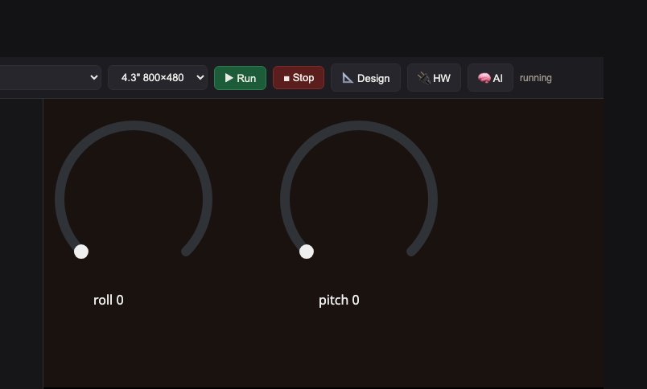

<style>
section { font-size: 24px; padding: 40px 52px; justify-content: flex-start; }
section h1 { font-size: 1.45em; line-height: 1.12; margin: 0 0 .22em; }
section h2 { font-size: 1.12em; margin: .15em 0; }
section h3 { font-size: 1.0em; margin: .12em 0; }
section p, section li { margin: .16em 0; line-height: 1.32; }
section img { max-width: 100%; height: auto; }
section svg { max-height: 250px; }
section table { font-size: .78em; }
section pre { font-size: .70em; line-height: 1.32; background:#0d1117; color:#e6edf3; border:1px solid #30363d; border-radius:8px; padding:12px 16px; box-shadow:0 2px 8px rgba(0,0,0,.25); }
section pre code { white-space: pre-wrap; background:transparent; color:inherit; } section pre .hljs-comment{color:#8b949e;font-style:italic} section pre .hljs-keyword,section pre .hljs-built_in,section pre .hljs-literal{color:#ff7b72} section pre .hljs-string{color:#a5d6ff} section pre .hljs-number{color:#79c0ff} section pre .hljs-title,section pre .hljs-title.function_,section pre .hljs-section{color:#d2a8ff} section pre .hljs-meta{color:#ffa657} section pre .hljs-attr,section pre .hljs-attribute,section pre .hljs-name{color:#7ee787}
section blockquote { margin: .25em 0; font-size: .92em; }
/* two images on a line (parity / 2x2 grids) stay side-by-side and small */
section p > img + img { margin-left: 10px; }
/* scroll-within-slide: dense slides scroll instead of clipping */
section { overflow-y: auto; overflow-x: hidden; }
section::-webkit-scrollbar { width: 11px; }
section::-webkit-scrollbar-thumb { background:#4a90d9; border-radius:6px; }
section::-webkit-scrollbar-track { background:rgba(0,0,0,.06); }
/* image drop-shadow + cover-slide readability (auto) */
section img{filter:drop-shadow(0 3px 12px rgba(0,0,0,.5))}
section.cover *{color:#fff !important}
section.cover h1,section.cover h2,section.cover h3,section.cover p,section.cover li,section.cover strong,section.cover em,section.cover blockquote,section.cover div{text-shadow:0 2px 9px rgba(0,0,0,.92),0 0 3px rgba(0,0,0,.8)}
section.cover div[style*="background:#"],section.cover div[style*="background: #"]{background:rgba(10,14,20,.66) !important;border-color:rgba(120,200,255,.45) !important;max-width:62%}
section.cover blockquote{border-left:4px solid rgba(120,200,255,.6) !important;background:rgba(13,17,23,.55) !important;border-radius:6px;padding:.3em .6em}
section.cover h1,section.cover h2,section.cover h3,section.cover p,section.cover blockquote{max-width:60%}
section.cover div:not(:has(img)){max-width:62%}
section.cover img{filter:none}
</style>

<!-- _class: cover -->
<!-- _backgroundColor: #0d1117 -->

# บทเรียน 3.2 — ลงมือทำ: เกจฟิสิกส์สี่ตัวบนจอ

## Processing I · คณิต & ฟิสิกส์: แปลงตัวเลขดิบให้พูดภาษาคน

**โมดูล 3 — ประมวลผลด้วยคณิตศาสตร์และฟิสิกส์**

> ต่อจากบทเรียน 3.1 — จากตัวเลขดิบสู่ปริมาณทางฟิสิกส์: มุมเอียง พลังงาน ความสูง และ dBFS

---

# โครงของไฟล์ s06_physics_viz.py

ทั้งไฟล์อ่านเป็นประโยคเดียว: **"เลือกปริมาณ → อ่านค่าดิบ → คำนวณเป็นปริมาณจริง → ส่งขึ้น Seg7/Bar/Chart → วนซ้ำ"**

<div style="text-align:center;margin:6px 0">
<svg width="920" height="210" viewBox="0 0 920 210" font-family="DejaVu Sans, sans-serif">
  <defs>
    <marker id="arS6" markerUnits="userSpaceOnUse" markerWidth="12" markerHeight="10" refX="10" refY="4" orient="auto"><path d="M0,0 L10,4 L0,8 Z" fill="#607d8b"/></marker>
  </defs>
  <g font-size="14" text-anchor="middle">
    <rect x="14" y="24" width="170" height="54" rx="10" fill="#cfd8dc" stroke="#607d8b" stroke-width="2"/>
    <text x="99" y="47" font-weight="700" fill="#455a64">สร้าง widget</text>
    <text x="99" y="66" font-size="11" fill="#999">dropdown+เกจ :39</text>
    <rect x="224" y="24" width="180" height="54" rx="10" fill="#e3f2fd" stroke="#1565c0" stroke-width="2"/>
    <text x="314" y="47" font-weight="700" fill="#1565c0">จับ p0 + has_mic</text>
    <text x="314" y="66" font-size="11" fill="#999">ก่อนลูป :62</text>
    <polygon points="504,51 554,23 604,51 554,79" fill="#f3e5f5" stroke="#6a1b9a" stroke-width="2"/>
    <text x="554" y="47" font-weight="700" fill="#6a1b9a" font-size="12">sel ไหน?</text>
    <rect x="660" y="24" width="240" height="54" rx="10" fill="#fff3e0" stroke="#ef6c00" stroke-width="2"/>
    <text x="780" y="45" font-weight="700" fill="#e65100">อ่านดิบ + คำนวณ</text>
    <text x="780" y="64" font-size="11" fill="#999">4 สูตร :94/103/112/125</text>
    <rect x="480" y="140" width="200" height="54" rx="10" fill="#e8f5e9" stroke="#2e7d32" stroke-width="2"/>
    <text x="580" y="162" font-weight="700" fill="#2e7d32">viz</text>
    <text x="580" y="180" font-size="11" fill="#999">Seg7+Bar+Chart</text>
    <rect x="720" y="140" width="180" height="54" rx="10" fill="#eceff1" stroke="#607d8b" stroke-width="2"/>
    <text x="810" y="162" font-size="12" fill="#455a64">ui.poll (dropdown)</text>
    <text x="810" y="180" font-size="11" fill="#999">back → stop</text>
  </g>
  <line x1="184" y1="51" x2="222" y2="51" stroke="#607d8b" stroke-width="2.4" marker-end="url(#arS6)"/>
  <line x1="404" y1="51" x2="502" y2="51" stroke="#607d8b" stroke-width="2.4" marker-end="url(#arS6)"/>
  <line x1="604" y1="51" x2="658" y2="51" stroke="#607d8b" stroke-width="2.4" marker-end="url(#arS6)"/>
  <path d="M780,78 C780,110 620,112 600,138" fill="none" stroke="#2e7d32" stroke-width="2" stroke-dasharray="6 5" marker-end="url(#arS6)"/>
  <path d="M480,167 C300,167 240,110 314,80" fill="none" stroke="#9e9e9e" stroke-width="2" stroke-dasharray="6 5" marker-end="url(#arS6)"/>
  <text x="360" y="130" font-size="11" fill="#9e9e9e">วนกลับทุก 120 ms</text>
</svg>
</div>

> ตัวเลขบรรทัด (`:94`, `:103`, `:112`, `:125`) ชี้จุดที่คุณต้องเติมสูตรในไฟล์ฝึก จำโครงนี้ไว้ เดี๋ยวไล่ดูทีละส่วน

---

# ไล่โค้ด (1) — เตรียมของก่อนลูป

ส่วนบนของไฟล์ สร้าง widget ครั้งเดียว จับความดันอ้างอิง และเช็กไมค์:

```python
dd = ui.Dropdown(text="\n".join(v[0] for v in VIEWS), x=20, y=42, w=280)
seg = ui.Seg7("--", x=44, y=120, color=GREEN)
bar = ui.Bar(x=44, y=250, w=312, h=16, min=0, max=100, value=0, color=AMBER)
chart = ui.Chart(x=420, y=90, w=352, h=210, min=0, max=100)

try:                                    # ไมค์ PDM มีเฉพาะบนบอร์ด
    from machine import PDM_PCM
    pdm = PDM_PCM(0, sck="P8_5", data="P8_6", sample_rate=16000)
    has_mic = True
except Exception:
    has_mic = False

p0, _ = sensors.dps368.pressure_temperature()   # จุด 0 เมตรของ altitude
```

- ทั้งหมดนี้ให้ไว้แล้ว — เป็น "70% ที่เตรียมให้" งานของคุณคือสูตรตรงกลางในลูป
- `p0` จับครั้งเดียวก่อนลูป (นอกลูป) เพราะเป็นจุดอ้างอิงที่ไม่เปลี่ยน

> โครงนี้คือ "สร้างครั้งเดียว" ของบทเรียน 1.4–1.5 เป๊ะ — widget อยู่นอกลูป ในลูปแค่เปลี่ยนค่า ไม่สร้างใหม่ทุกรอบ

---

# ไล่โค้ด (2) — สูตรที่ 1: Tilt

**ช่องเติมที่ 1** (บรรทัด `:94`): แปลง raw ของ IMU เป็นมุมเอียง

```python
if sel == 0:                                   # Tilt
    ax, ay, az, gx, gy, gz = sensors.bmi270.motion()
    # เติม: มุมเอียงจาก accelerometer -> roll, pitch = dsp.tilt(ax, ay, az)
    roll, pitch = 0.0, 0.0
    pass
    dom = pitch if abs(pitch) >= abs(roll) else roll
```

- แทน `pass` (และลบ `roll, pitch = 0.0, 0.0`) ด้วย `roll, pitch = dsp.tilt(ax, ay, az)`
- ถ้าลืมเติม: เกจจะค้างที่ 0 ตลอด เพราะ `roll, pitch` ถูกตั้งเป็น 0 ไว้เป็น placeholder
- ระวังลำดับ: `dsp.tilt` คืน **(roll, pitch)** ไม่ใช่ (pitch, roll)

> เราวาง `roll, pitch = 0.0, 0.0` ไว้ก่อน เพื่อให้ไฟล์ **รันได้** ตั้งแต่ยังไม่เติม (โชว์ 0) พอเติมจริงค่าถึงจะขยับ — เทคนิคเดียวกับ `r = None` ในบทเรียน 1.1–1.3

---

# ไล่โค้ด (3) — สูตรที่ 2: Energy

**ช่องเติมที่ 2** (บรรทัด `:103`): เขียนสูตรขนาดเวกเตอร์เอง

```python
elif sel == 1:                                 # Energy
    ax, ay, az, gx, gy, gz = sensors.bmi270.motion()
    # เติม: energy = ขนาดเวกเตอร์ความเร่ง ลบ 1g
    #       mag = math.sqrt(ax*ax + ay*ay + az*az) / 9.81 ; energy = abs(mag - 1.0)
    energy = 0.0
    pass
    head = "%.2f" % energy
```

- เติมสองบรรทัด: `mag = math.sqrt(ax*ax + ay*ay + az*az) / 9.81` (m/s² เป็น g) แล้ว `energy = abs(mag - 1.0)`
- นี่คือ "คณิตที่คุณเขียนเอง" ไม่มีฟังก์ชันสำเร็จ — พีทาโกรัสสามมิติ + ลบฐาน 1g
- ถ้าลืมลบ `1.0`: ตอนวางนิ่ง energy จะค้างที่ ~1.0 แทนที่จะเป็น 0

> ลองทดลอง: วางนิ่งควรได้ใกล้ 0 เขย่าเบาๆ ได้ ~0.2 เขย่าแรงได้เกิน 1 — ถ้าค่าไม่เป็นแบบนี้ กลับมาเช็กว่าลบ 1g หรือยัง

---

# ไล่โค้ด (4) — สูตรที่ 3: Altitude

**ช่องเติมที่ 3** (บรรทัด `:112`): เรียกฟิสิกส์ความดันสำเร็จรูป

```python
elif sel == 2:                                 # Altitude
    p, t = sensors.dps368.pressure_temperature()
    # เติม: ความสูงจากความดัน เทียบกับ p0 -> alt = dsp.altitude(p, p0)
    alt = 0.0
    pass
    head = "%.1f" % alt
```

- แทน `pass` ด้วย `alt = dsp.altitude(p, p0)` — `p0` จับไว้ก่อนลูปแล้ว
- ยกบอร์ดขึ้น ~1 เมตร ค่าควรขึ้น ~+1.0 วางลงกลับมา ~0
- ความดันไวต่อลม/แอร์ ค่าอาจแกว่งเล็กน้อย — ปกติ เดี๋ยวบทเรียน 4.1–4.2 เราจะกรองให้นิ่ง

> `dsp.altitude` ทำสูตร barometric ให้ทั้งดุ้น เราแค่ป้อนความดันปัจจุบันกับจุดอ้างอิง — นี่คือพลังของ `dsp`: ฟิสิกส์ยากๆ ถูกห่อเป็นฟังก์ชันเดียว

---

# ไล่โค้ด (5) — สูตรที่ 4: dBFS

**ช่องเติมที่ 4** (บรรทัด `:125`): แปลง RMS เป็น decibel (บนบอร์ด)

```python
else:                                          # Sound dBFS
    if has_mic:
        pdm.readinto(mbuf)
        acc = 0
        for s in mbuf:
            acc += s * s
        rms = math.sqrt(acc / len(mbuf))
        # เติม: db = 20 * math.log10(rms / 32768.0)
        db = -96.0
        if rms > 0:
            pass
        head = "%d" % int(db)
```

- ในบล็อก `if rms > 0:` แทน `pass` ด้วย `db = 20 * math.log10(rms / 32768.0)`
- เช็ก `rms > 0` ก่อน เพราะ `log10(0)` คำนวณไม่ได้ (เงียบสนิท = ค่าพื้น -96)
- ช่องนี้ทดสอบด้วยเสียงจริง **บนบอร์ด** (บน Emulator ค่าที่เห็นมาจากเสียงสังเคราะห์)

> สี่ช่องนี้คือสี่สูตรฟิสิกส์ของชุดบทเรียน — เติมครบเมื่อไร ทั้งสี่ปริมาณจะมีชีวิตขึ้นมาพร้อมกัน

---

# ลงมือทำ — เติมสูตรทั้ง 4 จุด

เปิด [`s06_physics_viz.py`](https://github.com/tesaiot/tesa-qualification-program/blob/main/courses/edge-ai-developer/m03-processing/l02-physics-gauges-lab/practice/s06_physics_viz.py) มี `# เติม:` วางไว้ **4 จุด** ตรงสูตรแปลงของแต่ละปริมาณ:

| # | จุด (บรรทัด) | เติมด้วย | ถ้าลืม |
|---|---|---|---|
| 1 | Tilt `:94` | `roll, pitch = dsp.tilt(ax, ay, az)` | เกจมุมค้างที่ 0 |
| 2 | Energy `:103` | `mag = math.sqrt(...) / 9.81` ; `energy = abs(mag - 1.0)` | พลังงานค้างที่ 0 |
| 3 | Altitude `:112` | `alt = dsp.altitude(p, p0)` | ความสูงค้างที่ 0 |
| 4 | dBFS `:125` | `db = 20 * math.log10(rms / 32768.0)` | เสียงค้างที่ -96 |

ขั้นตอน:

1. ไล่หา `# เติม:` ทีละจุด แทน placeholder ด้วยสูตรตามคำใบ้
2. กด **Run** (Emulator) หรือ **Program to Device** (บอร์ด)
3. เลือกปริมาณใน dropdown แล้วขยับ/ยก/ส่งเสียง ดูค่าเปลี่ยน ถ้ายังค้าง กลับมาเช็ก indent กับชื่อฟังก์ชัน

> เติมทีละสูตร ทดสอบทีละปริมาณ — เติม tilt เสร็จลองเอียงก่อน ใช้ได้แล้วค่อยไปสูตรถัดไป จะจับบั๊กง่ายกว่าเติมรวดเดียวสี่อัน

---

# ลงมือ (1) — รันบน BENTO Emulator

ไม่มีบอร์ดก็เริ่มได้ (สามปริมาณแรกเล่นได้เต็มที่บน Emulator):

1. เปิด **ide.tesaiot.dev** (BENTO Emulator) ในเบราว์เซอร์
2. เปิดไฟล์ [`s06_physics_viz.py`](https://github.com/tesaiot/tesa-qualification-program/blob/main/courses/edge-ai-developer/m03-processing/l02-physics-gauges-lab/practice/s06_physics_viz.py) (หรือวางโค้ด)
3. เติมสูตรทั้ง 4 จุด แล้วกด **Run**
4. เลือก **Tilt** ลากแผ่นเอียง → ดูมุมเปลี่ยน · เลือก **Energy** กดปุ่ม Shake → ดูพลังงานพุ่ง · เลือก **Altitude** → ดูความสูงจำลอง
5. เลือก **Sound** จะเห็นระดับเสียงจากเสียงสังเคราะห์ของ Emulator — ไว้ทดสอบกับเสียงจริงบนบอร์ด

> Emulator ใช้เซนเซอร์ **จำลอง** แต่ API เหมือนบอร์ดจริงทุกบรรทัด — เหมาะกับซ้อมสูตร Tilt/Energy/Altitude ที่บ้าน แล้วมายืนยัน + เล่น dBFS กับของจริงบนบอร์ด

---

# หน้าตาจริงบน BENTO Emulator



<div style="text-align:center">จอ emulator ที่รันได้จริง — เลือกปริมาณใน dropdown แล้วลากเอียง/กด Shake เกจ Seg7 + Bar + Chart ขยับตามทันที (นี่คือ BENTO Edge AI Emulator บนเบราว์เซอร์)</div>

> ภาพนี้คือ `s06_physics_viz` ที่เติมสูตรครบแล้วรันบน Emulator ค่าที่เห็นคือผลของสูตร `dsp.tilt` ที่คุณเพิ่งเติม ไม่ใช่ภาพนิ่ง ลองเปิด ide.tesaiot.dev แล้วขยับดูเองได้เลย

---

# ลงมือ (2) — รันบนบอร์ด BENTO จริง

บนบอร์ดจริงใช้ของจริง เซนเซอร์จริง ครบทั้งสี่ปริมาณรวมทั้งไมค์:

1. เสียบบอร์ดเข้าคอมด้วยสาย USB
2. เปิด [`s06_physics_viz.py`](https://github.com/tesaiot/tesa-qualification-program/blob/main/courses/edge-ai-developer/m03-processing/l02-physics-gauges-lab/practice/s06_physics_viz.py) ใน **BENTO IDE** กด **Program to Device**
3. **Tilt** — เอียงบอร์ดช้าๆ ทั้งสองแกน ดูมุมเด่นบน Seg7
4. **Energy** — วางนิ่ง (~0) แล้วเขย่า (พุ่งขึ้น) เทียบกัน
5. **Altitude** — ยกบอร์ดขึ้น-ลง 1 เมตร ดูความสูงเปลี่ยน
6. **Sound** — ปรบมือ/พูดใส่ไมค์ ดู dBFS วิ่งขึ้นตอนมีเสียง

> จุดที่ควรสังเกต: กราฟ `Chart` เก็บประวัติย้อนหลังให้ — เขย่าเป็นจังหวะแล้วดูคลื่นในกราฟ จะเห็น "รูปร่างของการเคลื่อนไหว" ชัดกว่าตัวเลขนิ่งๆ

---

# แหล่งเรียนรู้เพิ่มเติม

อยากเจาะลึกคณิต-ฟิสิกส์ของชุดบทเรียนนี้ เลือกดูตามหัวข้อที่อยากต่อยอด:

**วิดีโอ**

- ตรีโกณ & atan2 ของมุม — ช่อง 3Blue1Brown: https://www.youtube.com/@3blue1brown
- decibels และสเกล log อธิบายเห็นภาพ — ช่อง Computerphile: https://www.youtube.com/@Computerphile
- signal processing เบื้องต้นด้วย Python — ช่อง Sentdex: https://www.youtube.com/@sentdex

**ภาพ / เอกสารอ้างอิง**

- แกน roll / pitch / yaw ของวัตถุบิน (ที่มา: commons.wikimedia.org, CC BY-SA): https://commons.wikimedia.org/wiki/File:Flight_dynamics_with_text.png
- นิยาม atan2 และควอดรันต์ (ที่มา: en.wikipedia.org/wiki/Atan2, CC BY-SA): https://en.wikipedia.org/wiki/Atan2
- นิยาม dBFS เทียบ Full Scale (ที่มา: en.wikipedia.org/wiki/DBFS, CC BY-SA): https://en.wikipedia.org/wiki/DBFS

> วิดีโอ/ภาพภายนอกเป็นของเจ้าของต้นฉบับ ใช้เพื่อการศึกษา อ้างอิงลิงก์ต้นทาง

---

# ชัยชนะที่เห็นได้ + MVP ของชุดบทเรียนนี้

<div style="text-align:center;margin:14px 0">
<div style="display:inline-block;background:#e8f5e9;border:2px solid #2e7d32;border-radius:22px;padding:10px 22px;color:#2e7d32;font-weight:700;font-size:1.05em">
ชัยชนะที่เห็นได้ของชุดบทเรียนนี้ · เกจฟิสิกส์ที่ "คำนวณเอง" ขยับตามการเคลื่อนไหวจริง — มุม/พลังงาน/ความสูง/เสียง
</div>
</div>

**MVP ของบทเรียน 3.1–3.2 (เกณฑ์ผ่านของชุดบทเรียน):** สัญญาณดิบ → ปริมาณที่คำนวณได้ → แสดงเห็นบนจอ ครบวงอย่างน้อย **หนึ่งปริมาณ** (เอียงบอร์ดแล้วมุมเปลี่ยน หรือยกบอร์ดแล้วความสูงเปลี่ยน)

- ทำบน **Emulator** (Tilt/Energy/Altitude) หรือ **บอร์ดจริง** (ครบสี่ รวม dBFS)
- อธิบายได้ว่าสูตรที่เติมแปลง "ตัวเลขดิบ" เป็น "ปริมาณอะไร" และหน่วยคืออะไร

> "แสดงเห็นบนจอ" ไม่ใช่แค่ "ตัวเลขขยับ" — คุณต้องบอกได้ว่า energy 0.8 หมายความว่าอะไร ทำไม tilt ใช้ atan2 ได้โดยไม่ต้องรู้หน่วย accel

---

# บันไดช่วยเหลือ — ใบ้ → เริ่มจากโครง → เฉลย → ฉบับเต็ม

ถ้าติด ให้ไต่บันไดนี้ทีละขั้น อย่าเพิ่งกระโดดไปดูเฉลย เพราะสูตรจะเข้าหัวตอนที่คุณพยายามเองก่อน:

- **ใบ้** — คำใบ้อยู่ในคอมเมนต์ `# เติม:` ทั้ง 4 จุดในไฟล์ฝึก + ตารางสองหน้าที่แล้ว บอกว่าแต่ละช่องเติมสูตรอะไร
- **เริ่มจากโครง** — [`s06_physics_viz.py`](https://github.com/tesaiot/tesa-qualification-program/blob/main/courses/edge-ai-developer/m03-processing/l02-physics-gauges-lab/practice/s06_physics_viz.py) มีโครงครบทั้งไฟล์แล้ว (รันได้ โชว์ 0/board) เหลือแค่ 4 สูตรให้เติม
- **เฉลย** — [`s06_physics_viz.py`](https://github.com/tesaiot/tesa-qualification-program/blob/main/courses/edge-ai-developer/m03-processing/l02-physics-gauges-lab/solution/s06_physics_viz.py) เติมครบพร้อมคอมเมนต์อธิบายทุกสูตร (อ่านให้เข้าใจ ปิดไฟล์ แล้วพิมพ์เอง)
- **ฉบับเต็ม** — [`s06_physics_viz_full.py`](https://github.com/tesaiot/tesa-qualification-program/blob/main/courses/edge-ai-developer/m03-processing/l02-physics-gauges-lab/examples/s06_physics_viz_full.py) ฉบับขัดเรียบร้อย เพิ่ม hi/lo hold, ป้าย STEADY/ACTIVE และปุ่ม Reset

> ลองเขียนเองให้สุดก่อนนะ ถ้าติดจริงๆ ค่อยเปิดเฉลยดูทีละสูตร แล้วกลับมาพิมพ์เอง — เดี๋ยวเราค่อย ๆ แกะฟิสิกส์ไปด้วยกัน

---

# เชื่อมโยงรากฐาน — วันนี้เราแตะอะไรไปบ้าง

การแปลงสัญญาณดิบซ่อนแนวคิด Processing หลายชั้นที่จะใช้ไปตลอดคอร์ส:

**ฝั่ง Processing / คณิต-ฟิสิกส์**
- **raw → derived → viz** — โครงหัวใจของทั้ง Pillar 2 ใช้ซ้ำกับทุกปริมาณ
- **สูตรสำเร็จ vs สูตรที่เขียนเอง** — `dsp.tilt`/`dsp.altitude` (สำเร็จ) เทียบ energy/dBFS (เขียนเอง)
- **normalize** — บีบปริมาณต่างหน่วยเข้าช่วง 0..100 เดียว เพื่อ viz (`clamp100`)
- **log สเกล** — decibel บีบช่วงกว้างให้อ่านออก (จะเจ่ออีกใน FFT บทเรียน 4.3–4.4)

**ฝั่ง MicroPython / โครงโปรแกรม**
- **โครงร่วมของบทเรียน 1.4–1.5** — import → สร้างครั้งเดียว → ลูป → `ui.poll` เดินตามเป๊ะ
- **จับ p0 ก่อนลูป** — ค่าอ้างอิงที่ไม่เปลี่ยน คำนวณครั้งเดียว
- **เก็บกวาดตอนจบ** — `finally: pdm.deinit()` คืนฮาร์ดแวร์ไมค์เสมอ

> สูตรวันนี้คือ "ก้อนแรก" ของ Analysis: พอเราแปลงดิบเป็นปริมาณได้ ชุดบทเรียนถัด ๆ ไป จะเอาปริมาณพวกนี้ไปกรอง (บทเรียน 4.1–4.2) แปลงเป็นสเปกตรัม (บทเรียน 4.3–4.4) จนเป็น feature ที่โมเดลกินได้จริง (บทเรียน 4.5–4.6)

---

# ใช้จริงที่ไหน — Processing ในโลกจริง

สี่สูตรที่เราเขียนวันนี้ ไม่ใช่แบบฝึกหัดลอยๆ ทุกสูตรเป็นหัวใจของอุปกรณ์จริงที่ขายอยู่:

<div style="text-align:center;margin:6px 0">
<svg width="880" height="220" viewBox="0 0 880 220" font-family="DejaVu Sans, sans-serif">
  <rect x="12" y="10" width="420" height="96" rx="10" fill="#e3f2fd" stroke="#1565c0" stroke-width="2"/>
  <text x="28" y="34" font-size="13" font-weight="700" fill="#1565c0">Tilt (มุม) — เครื่องมือช่าง/โดรน</text>
  <text x="28" y="56" font-size="11" fill="#555">ระดับน้ำดิจิทัล · ปรับสมดุลกล้อง (gimbal)</text>
  <text x="28" y="76" font-size="11" fill="#555">รักษาระดับโดรน · ตรวจท่าทางการนอน</text>
  <text x="28" y="96" font-size="11" fill="#888">สูตรเดียวกับ dsp.tilt วันนี้</text>
  <rect x="448" y="10" width="420" height="96" rx="10" fill="#fff3e0" stroke="#ef6c00" stroke-width="2"/>
  <text x="464" y="34" font-size="13" font-weight="700" fill="#e65100">Energy (พลังงาน) — นาฬิกา/แท็ก</text>
  <text x="464" y="56" font-size="11" fill="#555">นับก้าว · ตรวจการล้ม · วัดความเข้มออกกำลัง</text>
  <text x="464" y="76" font-size="11" fill="#555">ปลุกอุปกรณ์เมื่อมีการขยับ (wake-on-motion)</text>
  <text x="464" y="96" font-size="11" fill="#888">สูตรเดียวกับ |accel|-1g วันนี้</text>
  <rect x="12" y="118" width="420" height="92" rx="10" fill="#e8f5e9" stroke="#2e7d32" stroke-width="2"/>
  <text x="28" y="142" font-size="13" font-weight="700" fill="#2e7d32">Altitude (ความสูง) — โดรน/มือถือ</text>
  <text x="28" y="164" font-size="11" fill="#555">รักษาระดับบินโดรน · นับชั้นบันได</text>
  <text x="28" y="184" font-size="11" fill="#555">นำทางในอาคาร (ชั้นไหน) ที่ GPS ไปไม่ถึง</text>
  <text x="28" y="202" font-size="11" fill="#888">สูตรเดียวกับ dsp.altitude วันนี้</text>
  <rect x="448" y="118" width="420" height="92" rx="10" fill="#f3e5f5" stroke="#6a1b9a" stroke-width="2"/>
  <text x="464" y="142" font-size="13" font-weight="700" fill="#6a1b9a">dBFS (เสียง) — ทุกอุปกรณ์อัดเสียง</text>
  <text x="464" y="164" font-size="11" fill="#555">VU meter · ตรวจระดับก่อนบันทึก</text>
  <text x="464" y="184" font-size="11" fill="#555">ประตูตรวจเสียง (gate) ก่อนป้อนโมเดลเสียง</text>
  <text x="464" y="202" font-size="11" fill="#888">สูตรเดียวกับ 20·log10 วันนี้</text>
</svg>
</div>

> เห็นไหมว่าสี่สูตรพื้นฐานนี้อยู่ในของใช้รอบตัวเต็มไปหมด — Processing ที่ดูเรียบง่ายวันนี้ คือชั้นที่ทำให้ "ตัวเลขดิบ" กลายเป็นฟีเจอร์ที่ผลิตภัณฑ์จริงพึ่งพา

---

# งานทำเอง + สรุปบทเรียน

**งานทำเอง (ท้ายบทเรียน):**

1. เติม [`s06_physics_viz.py`](https://github.com/tesaiot/tesa-qualification-program/blob/main/courses/edge-ai-developer/m03-processing/l02-physics-gauges-lab/practice/s06_physics_viz.py) ให้ครบทั้ง 4 สูตร รันได้จริง (Emulator หรือบอร์ด)
2. ทดสอบอย่างน้อย **3 ปริมาณ** (Tilt → Energy → Altitude) จดว่าแต่ละอันต้องทำอะไรถึงจะเห็นค่าเปลี่ยนชัด
3. หา "ค่าอ้างอิงตอนนิ่ง" ของ Energy (วางบอร์ดนิ่งควรใกล้ 0) แล้วอธิบายว่าทำไมต้อง **ลบ 1g** ในสูตร

ใบ้ข้อ 3 — ลองลบ `- 1.0` ออกชั่วคราวแล้วดูว่าค่าตอนนิ่งเปลี่ยนไปเป็นเท่าไร นั่นคือ "ฐานแรงโน้มถ่วง" ที่เราตัดทิ้ง

**วันนี้เราได้:** เข้าใจว่าทำไมต้อง Processing · จับโครง `raw → derived → viz` · เขียน/เรียก 4 สูตรฟิสิกส์ (tilt/energy/altitude/dBFS) · เลือก widget ให้เข้ากับข้อมูล · แสดงเกจสดๆ

> ชุดบทเรียนถัดไป (บทเรียน 3.3–3.4) เราจะต่อยอด Processing ไปอีกขั้น — เอาปริมาณที่แปลงได้มา **ตัดสินด้วยกฎ** (threshold) เช่น "สบาย/ร้อน" จากอุณหภูมิ+ความชื้น นี่คือ classification แบบคลาสสิกก่อนถึง ML เจอกันครับ
