<style>
section { font-size: 24px; padding: 40px 52px; justify-content: flex-start; }
section h1 { font-size: 1.45em; line-height: 1.12; margin: 0 0 .22em; }
section h2 { font-size: 1.12em; margin: .15em 0; }
section h3 { font-size: 1.0em; margin: .12em 0; }
section p, section li { margin: .16em 0; line-height: 1.32; }
section img { max-width: 100%; height: auto; }
section svg { max-height: 250px; }
section table { font-size: .78em; }
section pre { font-size: .70em; line-height: 1.32; background:#0d1117; color:#e6edf3; border:1px solid #30363d; border-radius:8px; padding:12px 16px; box-shadow:0 2px 8px rgba(0,0,0,.25); }
section pre code { white-space: pre-wrap; background:transparent; color:inherit; } section pre .hljs-comment{color:#8b949e;font-style:italic} section pre .hljs-keyword,section pre .hljs-built_in,section pre .hljs-literal{color:#ff7b72} section pre .hljs-string{color:#a5d6ff} section pre .hljs-number{color:#79c0ff} section pre .hljs-title,section pre .hljs-title.function_,section pre .hljs-section{color:#d2a8ff} section pre .hljs-meta{color:#ffa657} section pre .hljs-attr,section pre .hljs-attribute,section pre .hljs-name{color:#7ee787}
section blockquote { margin: .25em 0; font-size: .92em; }
/* two images on a line (parity / 2x2 grids) stay side-by-side and small */
section p > img + img { margin-left: 10px; }
/* scroll-within-slide: dense slides scroll instead of clipping */
section { overflow-y: auto; overflow-x: hidden; }
section::-webkit-scrollbar { width: 11px; }
section::-webkit-scrollbar-thumb { background:#4a90d9; border-radius:6px; }
section::-webkit-scrollbar-track { background:rgba(0,0,0,.06); }
/* image drop-shadow + cover-slide readability (auto) */
section img{filter:drop-shadow(0 3px 12px rgba(0,0,0,.5))}
section.cover *{color:#fff !important}
section.cover h1,section.cover h2,section.cover h3,section.cover p,section.cover li,section.cover strong,section.cover em,section.cover blockquote,section.cover div{text-shadow:0 2px 9px rgba(0,0,0,.92),0 0 3px rgba(0,0,0,.8)}
section.cover div[style*="background:#"],section.cover div[style*="background: #"]{background:rgba(10,14,20,.66) !important;border-color:rgba(120,200,255,.45) !important;max-width:62%}
section.cover blockquote{border-left:4px solid rgba(120,200,255,.6) !important;background:rgba(13,17,23,.55) !important;border-radius:6px;padding:.3em .6em}
section.cover h1,section.cover h2,section.cover h3,section.cover p,section.cover blockquote{max-width:60%}
section.cover div:not(:has(img)){max-width:62%}
section.cover img{filter:none}
</style>

<!-- _class: cover -->
<!-- _backgroundColor: #0d1117 -->

# บทเรียน 4.3 — FFT และโดเมนความถี่: bin, Nyquist, DC, leakage และ Hann window
## อ่านสเปกตรัมของสัญญาณจริง

**โมดูล 4 — วิเคราะห์สัญญาณ**

**Pillar 3 — Analysis (วิเคราะห์สัญญาณ)**

> คาถาประจำบทเรียน: **"สัญญาณเดียวกัน มองได้สองแบบ — คลื่นดิบในโดเมนเวลา กับสเปกตรัมในโดเมนความถี่ และโมเดลเสียงมองแบบหลัง"**

MicroPython บนบอร์ด BENTO (PSoC Edge · Cortex-M55 + Ethos-U55 NPU)

---

# เปิดบทเรียนด้วยของจริงก่อน

เหมือนทุกบทเรียน เราเริ่มแบบ **กลับด้าน** — รันของที่ทำงานได้ก่อน แล้วค่อยแกะว่าทำไม วันนี้ของจริงคือ **สเปกตรัมสด**: เขย่าบอร์ด แล้วดูพลังงานความถี่ขยับบนจอ

<div style="text-align:center;margin:10px 0">
<svg width="820" height="150" viewBox="0 0 820 150" font-family="DejaVu Sans, sans-serif">
  <defs>
    <marker id="arOpen" markerUnits="userSpaceOnUse" markerWidth="12" markerHeight="10" refX="10" refY="4" orient="auto"><path d="M0,0 L10,4 L0,8 Z" fill="#607d8b"/></marker>
  </defs>
  <rect x="14" y="40" width="180" height="70" rx="12" fill="#e8f5e9" stroke="#2e7d32" stroke-width="2"/>
  <text x="104" y="72" font-size="15" font-weight="700" fill="#2e7d32" text-anchor="middle">รันสเปกตรัมก่อน</text>
  <text x="104" y="94" font-size="12" fill="#555" text-anchor="middle">เขย่าแล้วดูแท่งขยับ</text>
  <rect x="234" y="40" width="180" height="70" rx="12" fill="#e3f2fd" stroke="#1565c0" stroke-width="2"/>
  <text x="324" y="72" font-size="15" font-weight="700" fill="#1565c0" text-anchor="middle">แกะดูข้างใน</text>
  <text x="324" y="94" font-size="12" fill="#555" text-anchor="middle">FFT ทำอะไร</text>
  <rect x="454" y="40" width="180" height="70" rx="12" fill="#fff3e0" stroke="#ef6c00" stroke-width="2"/>
  <text x="544" y="72" font-size="15" font-weight="700" fill="#e65100" text-anchor="middle">เติม/แก้เอง</text>
  <text x="544" y="94" font-size="12" fill="#555" text-anchor="middle">pipeline 4 ขั้น</text>
  <rect x="674" y="40" width="132" height="70" rx="12" fill="#f3e5f5" stroke="#6a1b9a" stroke-width="2"/>
  <text x="740" y="72" font-size="15" font-weight="700" fill="#6a1b9a" text-anchor="middle">อยากต่อยอด</text>
  <text x="740" y="94" font-size="12" fill="#555" text-anchor="middle">feature เสียง 4.5–4.6</text>
  <line x1="194" y1="75" x2="230" y2="75" stroke="#607d8b" stroke-width="2.4" marker-end="url(#arOpen)"/>
  <line x1="414" y1="75" x2="450" y2="75" stroke="#607d8b" stroke-width="2.4" marker-end="url(#arOpen)"/>
  <line x1="634" y1="75" x2="670" y2="75" stroke="#607d8b" stroke-width="2.4" marker-end="url(#arOpen)"/>
</svg>
</div>

เราใช้แนว **PRIMM** เหมือนเดิม (Predict–Run–Investigate–Modify–Make) — เห็นสเปกตรัมขยับก่อน แล้วจะสงสัยเองว่า "ตัวเลขพวกนี้มาจากไหน" นั่นแหละคือแรงจูงใจที่ดีที่สุด

> ชุดบทเรียนนี้ไม่ต้องเข้าใจ FFT ทุกบรรทัดในทีเดียว ขอแค่เขย่าบอร์ดแล้วเห็น "พลังงานย้ายความถี่" ตามจังหวะ แล้วเริ่มอยากรู้ว่ามันรู้ได้ยังไง

---

# เป้าหมายของชุดบทเรียนนี้

จบชุดบทเรียนนี้เราจะเดินครบ แล้วปิดท้ายด้วยการรันสเปกตรัมสด:

1. **โดเมนเวลา vs โดเมนความถี่** — สัญญาณเดียวกัน สองมุมมอง มุมไหนบอกอะไร
2. **FFT คืออะไร** — แปลงคลื่นดิบ N จุด เป็นขนาดของแต่ละความถี่ (ไม่ใช่กล่องดำ)
3. **สองศัตรูของสเปกตรัม** — DC/แรงโน้มถ่วง (bin 0) กับ spectral leakage และวิธีจัดการ (ตัดค่าเฉลี่ย + Hann window)
4. **bin ความถี่ + Nyquist** — `FS/N` คุมความละเอียด, `FS/2` คือเพดานความถี่
5. ลงมือ: เติม **pipeline 4 ขั้น** อ่านสเปกตรัมสดจาก IMU ด้วยตาตัวเอง

ปลายทางของวันนี้: เขย่าบอร์ด แล้วแท่งสเปกตรัมขึ้น พร้อมความถี่เด่น (peak) ที่เปลี่ยนตามจังหวะที่เขย่าเร็ว-ช้า

> วันนี้เราเน้น "เห็นสเปกตรัม + อ่าน peak เป็น" — ส่วน mel-spectrogram ที่โมเดลเสียงใช้จริง เก็บไว้ต่อยอดในบทเรียน 4.5–4.6

---

# ชุดบทเรียนนี้อยู่ตรงไหนของวงจร

เราอยู่ **Pillar 3 (Analysis)** — ขั้นที่เปลี่ยนสัญญาณดิบให้กลายเป็น "สิ่งที่โมเดลเห็นจริง" บทเรียน 4.1–4.2 เราทำ filter ในโดเมนเวลา วันนี้เปิดมุมมองใหม่: **โดเมนความถี่**

<div style="text-align:center;margin:6px 0">
<svg width="920" height="150" viewBox="0 0 920 150" font-family="DejaVu Sans, sans-serif">
  <defs>
    <marker id="arLC" markerUnits="userSpaceOnUse" markerWidth="12" markerHeight="10" refX="10" refY="4" orient="auto"><path d="M0,0 L10,4 L0,8 Z" fill="#607d8b"/></marker>
  </defs>
  <g text-anchor="middle">
    <rect x="10" y="46" width="150" height="60" rx="12" fill="#e3f2fd" stroke="#1565c0" stroke-width="2"/>
    <text x="85" y="72" font-size="13" font-weight="700" fill="#1565c0">1 · DAQ</text>
    <text x="85" y="92" font-size="10" fill="#888">โมดูล 2</text>
    <rect x="184" y="46" width="150" height="60" rx="12" fill="#e8f5e9" stroke="#2e7d32" stroke-width="2"/>
    <text x="259" y="72" font-size="13" font-weight="700" fill="#2e7d32">2 · Processing</text>
    <text x="259" y="92" font-size="10" fill="#888">โมดูล 3</text>
    <rect x="358" y="40" width="204" height="72" rx="12" fill="#fff3e0" stroke="#ef6c00" stroke-width="3"/>
    <text x="460" y="66" font-size="13" font-weight="700" fill="#e65100">3 · Analysis (เราอยู่นี่)</text>
    <text x="460" y="86" font-size="10" fill="#888">4.1–4.2 filter · 4.3–4.4 FFT · 4.5–4.6 feature</text>
    <text x="460" y="102" font-size="10" fill="#ef6c00">วันนี้ = 4.3–4.4</text>
    <rect x="586" y="46" width="150" height="60" rx="12" fill="#f3e5f5" stroke="#6a1b9a" stroke-width="2"/>
    <text x="661" y="72" font-size="13" font-weight="700" fill="#6a1b9a">4 · Training</text>
    <text x="661" y="92" font-size="10" fill="#888">โมดูล 5</text>
    <rect x="760" y="46" width="150" height="60" rx="12" fill="#e0f7fa" stroke="#00838f" stroke-width="2"/>
    <text x="835" y="72" font-size="13" font-weight="700" fill="#00838f">5 · Apps</text>
    <text x="835" y="92" font-size="10" fill="#888">โมดูล 6</text>
  </g>
  <line x1="160" y1="76" x2="182" y2="76" stroke="#607d8b" stroke-width="2.4" marker-end="url(#arLC)"/>
  <line x1="334" y1="76" x2="356" y2="76" stroke="#607d8b" stroke-width="2.4" marker-end="url(#arLC)"/>
  <line x1="562" y1="76" x2="584" y2="76" stroke="#607d8b" stroke-width="2.4" marker-end="url(#arLC)"/>
  <line x1="736" y1="76" x2="758" y2="76" stroke="#607d8b" stroke-width="2.4" marker-end="url(#arLC)"/>
</svg>
</div>

> ทำไม Analysis ถึงสำคัญกับ Edge AI: โมเดลไม่ได้ฉลาดกว่าสิ่งที่มันเห็น ถ้า feature ที่ป้อนเข้าไปดี โมเดลเล็ก ๆ ก็แม่นได้ FFT คือหนึ่งในเครื่องมือหลักที่ทำให้ feature เสียง/การสั่นสะเทือน "อ่านง่าย" สำหรับโมเดล

---

# โดเมนเวลา vs โดเมนความถี่

สัญญาณคลื่นเดียวกัน มองได้สองแบบ ทั้งสองถูกต้อง แต่บอกคนละเรื่อง:

<div style="text-align:center;margin:6px 0">
<svg width="900" height="210" viewBox="0 0 900 210" font-family="DejaVu Sans, sans-serif">
  <!-- time lane -->
  <rect x="12" y="10" width="430" height="190" rx="12" fill="#e3f2fd" stroke="#1565c0" stroke-width="2"/>
  <text x="227" y="34" font-size="15" font-weight="700" fill="#1565c0" text-anchor="middle">โดเมนเวลา (time domain)</text>
  <line x1="40" y1="120" x2="410" y2="120" stroke="#90a4ae" stroke-width="1"/>
  <path d="M40,120 Q70,60 100,120 T160,120 T220,120 T280,120 T340,120 T400,120" fill="none" stroke="#1565c0" stroke-width="2.5"/>
  <text x="227" y="165" font-size="12" fill="#555" text-anchor="middle">แกน X = เวลา · แกน Y = ค่าที่วัดได้</text>
  <text x="227" y="185" font-size="12" fill="#555" text-anchor="middle">"ตอนไหนสูงตอนไหนต่ำ" — แต่ดูยากว่าความถี่เท่าไร</text>
  <!-- freq lane -->
  <rect x="458" y="10" width="430" height="190" rx="12" fill="#fff3e0" stroke="#ef6c00" stroke-width="2"/>
  <text x="673" y="34" font-size="15" font-weight="700" fill="#e65100" text-anchor="middle">โดเมนความถี่ (frequency domain)</text>
  <line x1="486" y1="150" x2="856" y2="150" stroke="#90a4ae" stroke-width="1"/>
  <rect x="520" y="70" width="18" height="80" fill="#ef6c00"/>
  <rect x="600" y="120" width="18" height="30" fill="#ffb74d"/>
  <rect x="680" y="132" width="18" height="18" fill="#ffb74d"/>
  <rect x="760" y="140" width="18" height="10" fill="#ffcc80"/>
  <text x="673" y="175" font-size="12" fill="#555" text-anchor="middle">แกน X = ความถี่ · แกน Y = ความแรงของความถี่นั้น</text>
  <text x="673" y="193" font-size="12" fill="#555" text-anchor="middle">"ความถี่ไหนแรง" — เห็นทันทีว่ามี 1 ยอดเด่น</text>
</svg>
</div>

> ลองนึกถึงเสียงเปียโน: โดเมนเวลาคือ "คลื่นความดันอากาศที่สั่น" ส่วนโดเมนความถี่คือ "โน้ตอะไรถูกกด" — หูเราชอบคิดแบบหลัง และโมเดลเสียงก็เช่นกัน

---

# ทำไมโมเดลเสียงดูสเปกตรัม ไม่ดูคลื่นดิบ

คลื่นเสียงดิบเปลี่ยนเร็วมากและ "หน้าตา" ต่างกันทุกครั้งแม้จะเป็นเสียงเดียวกัน แต่ **สเปกตรัม** ของมันคงรูปกว่ามาก

- เสียงไอสองครั้งไม่มีทางเหมือนกันเป๊ะในโดเมนเวลา แต่ **การกระจายพลังงานตามความถี่** คล้ายกัน — โมเดลจับตรงนี้ได้ง่ายกว่า
- สเปกตรัมบีบข้อมูลให้สั้นลง: คลื่นดิบ 16000 จุด/วินาที กลายเป็นสเปกตรัมไม่กี่สิบค่า — โมเดลเล็กลง เร็วขึ้น
- ความถี่มีความหมายทางกายภาพ: เสียงสูง/ต่ำ, การสั่นเร็ว/ช้า — เป็น feature ที่ "อ่านออก" ทั้งกับคนและโมเดล

> นี่คือเหตุผลที่ front-end ของโมเดลเสียงเกือบทุกตัว เริ่มด้วย FFT (แล้วต่อด้วย mel/log ในบทเรียน 4.5–4.6) — เราไม่ได้ส่งคลื่นดิบเข้าโมเดลตรง ๆ เราส่ง "ภาพความถี่" ของมัน

---

# สัญญาณคือผลรวมของไซน์หลายความถี่

หัวใจของ Fourier: **สัญญาณไหน ๆ ก็เขียนเป็นผลบวกของคลื่นไซน์/โคไซน์ที่ความถี่ต่าง ๆ ได้** FFT แค่ถามกลับว่า "ในสัญญาณนี้ มีไซน์ความถี่ไหนบ้าง แต่ละอันแรงแค่ไหน"

<div style="text-align:center;margin:6px 0">
<svg width="900" height="200" viewBox="0 0 900 200" font-family="DejaVu Sans, sans-serif">
  <defs>
    <marker id="arSum" markerUnits="userSpaceOnUse" markerWidth="12" markerHeight="10" refX="10" refY="4" orient="auto"><path d="M0,0 L10,4 L0,8 Z" fill="#607d8b"/></marker>
  </defs>
  <path d="M20,50 Q45,20 70,50 T120,50 T170,50 T220,50" fill="none" stroke="#1565c0" stroke-width="2"/>
  <text x="120" y="80" font-size="12" fill="#1565c0" text-anchor="middle">ไซน์ความถี่ต่ำ</text>
  <text x="250" y="55" font-size="20" fill="#607d8b" text-anchor="middle">+</text>
  <path d="M290,50 Q303,30 316,50 T342,50 T368,50 T394,50 T420,50 T446,50 T472,50" fill="none" stroke="#2e7d32" stroke-width="2"/>
  <text x="380" y="80" font-size="12" fill="#2e7d32" text-anchor="middle">ไซน์ความถี่สูง</text>
  <text x="500" y="55" font-size="20" fill="#607d8b" text-anchor="middle">=</text>
  <path d="M540,50 Q553,10 566,50 Q579,40 592,55 T618,45 T644,55 T670,40 T696,55 T722,45 T748,52 T774,48 T800,50" fill="none" stroke="#e65100" stroke-width="2.5"/>
  <text x="670" y="80" font-size="12" fill="#e65100" text-anchor="middle">สัญญาณจริง (ดูยุ่ง)</text>
  <line x1="140" y1="120" x2="140" y2="150" stroke="#607d8b" stroke-width="2" marker-end="url(#arSum)"/>
  <line x1="670" y1="120" x2="670" y2="150" stroke="#607d8b" stroke-width="2" marker-end="url(#arSum)"/>
  <text x="450" y="140" font-size="13" font-weight="700" fill="#455a64" text-anchor="middle">FFT ทำงานย้อนกลับ: จากสัญญาณจริง แยกกลับเป็นไซน์แต่ละความถี่</text>
  <rect x="120" y="158" width="40" height="30" fill="#1565c0"/>
  <rect x="650" y="158" width="40" height="14" fill="#2e7d32"/>
  <text x="400" y="180" font-size="12" fill="#888" text-anchor="middle">ผลลัพธ์ = สเปกตรัม: แท่งสูง = ความถี่นั้นมีอยู่มาก</text>
</svg>
</div>

> พูดง่าย ๆ: FFT คือ "เครื่องแยกส่วนผสม" ของสัญญาณ ป้อนคลื่นที่ดูยุ่ง ๆ เข้าไป มันบอกกลับว่า "จริง ๆ แล้วเธอประกอบจากไซน์ความถี่พวกนี้ ในสัดส่วนนี้"

---

# ภาพเคลื่อนไหว — FFT: โดเมนเวลา → โดเมนความถี่



▸ **ลองเล่นสด (GeoGebra):** [เปิด Interactive Math Lab](https://github.com/tesaiot/tesa-qualification-program/blob/main/courses/edge-ai-developer/shared/interactive/math_lab.html) — ลากจุด/เลื่อนสไลเดอร์ดูสมการขยับตาม

คลื่นผสมทางซ้ายถูกแยกเป็นแท่งความถี่ทางขวา — แท่งที่เด่นคือความถี่หลักที่ซ่อนอยู่

---

# FFT — จากคลื่นดิบ สู่สเปกตรัม

FFT (Fast Fourier Transform) รับสัญญาณ **N จุดในโดเมนเวลา** แล้วคืน **N ค่าเชิงซ้อนในโดเมนความถี่** — หนึ่งค่าต่อหนึ่ง "bin" ความถี่

<div style="text-align:center;margin:6px 0">
<svg width="860" height="150" viewBox="0 0 860 150" font-family="DejaVu Sans, sans-serif">
  <defs>
    <marker id="arFFT" markerUnits="userSpaceOnUse" markerWidth="12" markerHeight="10" refX="10" refY="4" orient="auto"><path d="M0,0 L10,4 L0,8 Z" fill="#607d8b"/></marker>
  </defs>
  <rect x="20" y="40" width="230" height="70" rx="10" fill="#e3f2fd" stroke="#1565c0" stroke-width="2"/>
  <text x="135" y="66" font-size="13" font-weight="700" fill="#1565c0" text-anchor="middle">input: N จุด (เวลา)</text>
  <text x="135" y="88" font-size="11" fill="#666" text-anchor="middle">accel Z ที่สุ่มมา N ค่า</text>
  <rect x="330" y="40" width="200" height="70" rx="10" fill="#fff3e0" stroke="#ef6c00" stroke-width="2"/>
  <text x="430" y="66" font-size="13" font-weight="700" fill="#e65100" text-anchor="middle">fft(re, im)</text>
  <text x="430" y="88" font-size="11" fill="#666" text-anchor="middle">radix-2 Cooley-Tukey</text>
  <rect x="610" y="40" width="230" height="70" rx="10" fill="#e8f5e9" stroke="#2e7d32" stroke-width="2"/>
  <text x="725" y="62" font-size="13" font-weight="700" fill="#2e7d32" text-anchor="middle">output: N ค่าเชิงซ้อน</text>
  <text x="725" y="82" font-size="11" fill="#666" text-anchor="middle">re[k] + i·im[k] ต่อ bin</text>
  <text x="725" y="100" font-size="10" fill="#888" text-anchor="middle">ใช้จริงแค่ครึ่งแรก (ความถี่บวก)</text>
  <line x1="250" y1="75" x2="326" y2="75" stroke="#607d8b" stroke-width="2.4" marker-end="url(#arFFT)"/>
  <line x1="530" y1="75" x2="606" y2="75" stroke="#607d8b" stroke-width="2.4" marker-end="url(#arFFT)"/>
  <text x="135" y="135" font-size="11" fill="#888" text-anchor="middle">"ดูยาก"</text>
  <text x="725" y="135" font-size="11" fill="#888" text-anchor="middle">"อ่านออก: ความถี่ไหนแรง"</text>
</svg>
</div>

- ทำไมต้อง **N เป็นเลขยกกำลัง 2** (เช่น 32, 64, 128)? เพราะ radix-2 แบ่งครึ่งซ้ำ ๆ ได้ลงตัว ทำให้เร็ว — เวลา `N log N` แทนที่จะเป็น `N²` แบบคำนวณตรง ๆ (นี่คือที่มาของคำว่า "Fast")
- ผลลัพธ์เป็นเลขเชิงซ้อน `re[k] + i·im[k]` เดี๋ยวเราจะแปลงเป็น "ขนาด" ให้อ่านง่าย

> ในไฟล์ฝึก ฟังก์ชัน `fft()` เขียนไว้ให้ครบแล้ว (เหมือน `models()` ในบทเรียน 1.1–1.3 ที่ให้มา) เราไม่ต้องแก้ตัว FFT แต่ควรอ่านให้เห็นว่ามันเป็นแค่การบวก-คูณเป็นระเบียบ ไม่ใช่เวทมนตร์

---

# คณิตเบื้องหลัง FFT — สูตร DFT ในหนึ่งบรรทัด

FFT เป็นแค่วิธีคำนวณ **เร็ว** ของสูตรตั้งต้นที่ชื่อ DFT (Discrete Fourier Transform) หน้าตาแบบนี้:

$$X[k]=\sum_{n=0}^{N-1} x[n]\;e^{-j\,2\pi k n / N}$$

อ่านทีละสัญลักษณ์แบบภาษาคน — ไม่ต้องจำ แค่รู้ว่าตัวไหนคืออะไร:

- $x[n]$ = สัญญาณดิบจุดที่ $n$ (คือ `az` ที่เราเก็บใส่ `buf`)
- $N$ = จำนวนจุดในหน้าต่าง (ชุดบทเรียนนี้ใช้ 32)
- $k$ = หมายเลข bin ความถี่ (0, 1, 2, … , $N-1$)
- $X[k]$ = เลขเชิงซ้อน `re[k] + i·im[k]` บอกว่า "ความถี่ของ bin $k$ มีอยู่แรงแค่ไหน"
- $e^{-j\,2\pi k n / N}$ = คลื่นอ้างอิงความถี่ $k$ ที่เอาไป "เทียบ" กับสัญญาณของเรา

<div style="text-align:center;margin:6px 0">
<svg width="880" height="128" viewBox="0 0 880 128" font-family="DejaVu Sans, sans-serif">
  <defs>
    <marker id="arDft" markerUnits="userSpaceOnUse" markerWidth="12" markerHeight="10" refX="10" refY="4" orient="auto"><path d="M0,0 L10,4 L0,8 Z" fill="#607d8b"/></marker>
  </defs>
  <rect x="14" y="34" width="230" height="60" rx="10" fill="#e3f2fd" stroke="#1565c0" stroke-width="2"/>
  <text x="129" y="58" font-size="12" font-weight="700" fill="#1565c0" text-anchor="middle">สัญญาณ x[n] (N จุด)</text>
  <text x="129" y="78" font-size="10" fill="#666" text-anchor="middle">คลื่นดิบในโดเมนเวลา</text>
  <rect x="322" y="28" width="236" height="72" rx="10" fill="#fff3e0" stroke="#ef6c00" stroke-width="2"/>
  <text x="440" y="52" font-size="12" font-weight="700" fill="#e65100" text-anchor="middle">เทียบกับคลื่นอ้างอิง</text>
  <text x="440" y="72" font-size="11" fill="#666" text-anchor="middle">คูณ + บวก ตามสูตร DFT</text>
  <text x="440" y="90" font-size="10" fill="#888" text-anchor="middle">ทำซ้ำทุกค่า k</text>
  <rect x="636" y="34" width="230" height="60" rx="10" fill="#e8f5e9" stroke="#2e7d32" stroke-width="2"/>
  <text x="751" y="58" font-size="12" font-weight="700" fill="#2e7d32" text-anchor="middle">X[k] ต่อทุก bin</text>
  <text x="751" y="78" font-size="10" fill="#666" text-anchor="middle">"ความถี่ไหนแรง" อ่านออก</text>
  <line x1="244" y1="64" x2="318" y2="64" stroke="#607d8b" stroke-width="2.4" marker-end="url(#arDft)"/>
  <line x1="558" y1="64" x2="632" y2="64" stroke="#607d8b" stroke-width="2.4" marker-end="url(#arDft)"/>
</svg>
</div>

> ทำไมสำคัญกับชุดบทเรียนนี้: สูตรนี้คือสิ่งที่ฟังก์ชัน `fft()` ในไฟล์ฝึกทำให้เราแบบเร็ว ๆ เราไม่ต้องคำนวณเอง แต่พอเห็นว่ามันคือ "คูณคลื่นอ้างอิงแล้วบวก" ก็จะเลิกกลัวว่ามันเป็นกล่องดำ — มันคือเลขคณิตเป็นระเบียบเท่านั้น

---

# แต่ละ bin คือหนึ่งความถี่ — แปลงเป็น Hz

`X[k]` ให้ค่ามาเป็น "หมายเลข bin" ($k$) ยังไม่ใช่ Hz ที่คนอ่านออก สูตรแปลงกลับสั้นนิดเดียว:

$$f_k = \frac{k\,F_S}{N}$$

- $F_S$ = อัตราสุ่ม (ชุดบทเรียนนี้ $F_S = 50$ Hz), $N = 32$ → หนึ่ง bin กว้าง $F_S/N = 1.5625$ Hz
- ลองแทนค่าจริง ให้เห็นภาพ:

| bin $k$ | $f_k = k\,F_S/N$ | หมายความว่า |
|---|---|---|
| 0 | $0$ Hz | DC / แรงโน้มถ่วง (ตัวที่เราตัดทิ้ง) |
| 1 | $1.56$ Hz | เขย่าช้ามาก ~1-2 ครั้ง/วินาที |
| 3 | $4.69$ Hz | เขย่าปานกลาง |
| 4 | $6.25$ Hz | ตรงกับไซน์ทดสอบในสไลด์ตรวจ FFT |
| $N/2 = 16$ | $25$ Hz | เพดาน Nyquist ($F_S/2$) อ่านเกินนี้ไม่ได้ |

> ทำไมสำคัญกับชุดบทเรียนนี้: บรรทัด `peak_hz = kmax * FS / N` ในโค้ดของเรา ก็คือสูตรนี้เป๊ะ ๆ พอเขย่าเร็วขึ้น พลังงานย้ายไป bin ที่ $k$ สูงขึ้น สูตรก็คืน Hz ที่สูงขึ้นตาม — นี่คือเหตุผลที่ "เขย่า 3 ครั้ง/วินาที แล้วได้ peak ~3 Hz"

---

# bin ความถี่ · bin width · Nyquist

output ของ FFT เป็น "ช่อง" (bin) เรียงตามความถี่ แต่ละ bin แทนช่วงความถี่แคบ ๆ สองสูตรที่ต้องจำ:

<div style="text-align:center;margin:6px 0">
<svg width="880" height="160" viewBox="0 0 880 160" font-family="DejaVu Sans, sans-serif">
  <line x1="40" y1="110" x2="820" y2="110" stroke="#b0bec5" stroke-width="2"/>
  <g fill="#607d8b" text-anchor="middle">
    <rect x="60" y="60" width="34" height="50" fill="#455a64"/>
    <text x="77" y="128" font-size="11">bin 0</text>
    <text x="77" y="48" font-size="10" fill="#c62828">DC (0 Hz)</text>
    <rect x="150" y="40" width="34" height="70" fill="#1565c0"/>
    <text x="167" y="128" font-size="11">bin 1</text>
    <rect x="240" y="75" width="34" height="35" fill="#1565c0"/>
    <text x="257" y="128" font-size="11">bin 2</text>
    <rect x="330" y="90" width="34" height="20" fill="#1565c0"/>
    <text x="347" y="128" font-size="11">bin 3</text>
    <text x="430" y="100" font-size="16">· · ·</text>
    <rect x="700" y="98" width="34" height="12" fill="#ef6c00"/>
    <text x="717" y="128" font-size="11">bin N/2−1</text>
    <text x="717" y="86" font-size="10" fill="#ef6c00">~Nyquist</text>
  </g>
  <text x="440" y="150" font-size="12" fill="#455a64" text-anchor="middle">แต่ละ bin ห่างกัน = bin width; bin สุดท้ายที่ใช้ได้ ≈ Nyquist</text>
</svg>
</div>

$$\text{bin width}=\frac{FS}{N}\qquad\qquad \text{Nyquist}=\frac{FS}{2}$$

- **bin width `FS/N`** = ความละเอียดความถี่ ยิ่ง `N` มาก bin ยิ่งแคบ แยกสองความถี่ที่ใกล้กันได้ดีขึ้น (แต่เก็บ N จุดใช้เวลานานขึ้น)
- **Nyquist `FS/2`** = ความถี่สูงสุดที่อ่านได้ถูก ที่ `FS=50 Hz` เราเห็นได้ถึง 25 Hz เท่านั้น
- แปลง bin เป็น Hz: `f = k * FS / N` (เช่น `N=32, FS=50` → bin 4 = 6.25 Hz)

> ถ้าสัญญาณจริงมีความถี่ **เกิน** Nyquist มันจะ "พับ" กลับมาโผล่ผิดที่ (aliasing) — นี่คือเหตุผลที่อัตราสุ่มต้องสูงพอเสมอ เราจะเจอเรื่องนี้อีกตอนทำ feature เสียง

---

# เลือก N ยังไง — ความละเอียด vs ความไว

`N` (จำนวนจุดต่อหน้าต่าง) เป็นปุ่มปรับที่แลกกันสองด้าน ไม่มีค่าที่ "ดีที่สุด" ตายตัว ขึ้นกับงาน:

| N | bin width (`FS/N`) ที่ FS=50 | เก็บ N จุดใช้เวลา | เหมาะกับ |
|---|---|---|---|
| 16 | 3.13 Hz (หยาบ) | ~0.32 s (ไว) | ดูคร่าว ๆ ตอบเร็ว |
| 32 | 1.56 Hz | ~0.64 s | ชุดบทเรียนนี้ (สมดุลดี) |
| 64 | 0.78 Hz (ละเอียด) | ~1.28 s (หน่วง) | แยกความถี่ใกล้กัน |
| 128 | 0.39 Hz (ละเอียดมาก) | ~2.56 s (ช้า) | วิเคราะห์นิ่ง ๆ |

- **N มาก** → bin แคบ แยกสองความถี่ที่ใกล้กันได้ดี **แต่** ต้องเก็บจุดนานขึ้น = สเปกตรัมอัปเดตช้าลง (ไม่ทันเหตุการณ์เร็ว)
- **N น้อย** → อัปเดตไว ตอบสนองทันที **แต่** ความถี่ที่ใกล้กันจะรวมร่างอยู่ bin เดียว แยกไม่ออก
- ต้องเป็นเลขยกกำลัง 2 เสมอ (radix-2): 16, 32, 64, 128, …

> นี่คือ **การตัดสินใจเชิงวิศวกรรม** ที่เจอตลอดในงาน DSP: "ละเอียดในความถี่" กับ "ไวในเวลา" แลกกันเสมอ (หลักความไม่แน่นอนของ time-frequency) เราเลือก N=32 เพราะพอดีกับการเขย่ามือ

---

# ศัตรูที่ 1 — DC / แรงโน้มถ่วง (bin 0)

accel ที่วางนิ่งอ่านได้ ~1g จากแรงโน้มถ่วง เป็นค่า **คงที่** — ในโลกความถี่ ค่าคงที่คือความถี่ 0 Hz พอดี = **bin 0 (DC)**

<div style="text-align:center;margin:6px 0">
<svg width="820" height="160" viewBox="0 0 820 160" font-family="DejaVu Sans, sans-serif">
  <!-- with DC -->
  <text x="200" y="24" font-size="13" font-weight="700" fill="#c62828" text-anchor="middle">ไม่ตัด DC</text>
  <line x1="40" y1="130" x2="360" y2="130" stroke="#b0bec5" stroke-width="1.5"/>
  <rect x="55" y="45" width="24" height="85" fill="#c62828"/>
  <text x="67" y="146" font-size="10" fill="#888" text-anchor="middle">bin 0</text>
  <rect x="120" y="115" width="24" height="15" fill="#90a4ae"/>
  <rect x="180" y="110" width="24" height="20" fill="#90a4ae"/>
  <rect x="240" y="120" width="24" height="10" fill="#90a4ae"/>
  <text x="200" y="90" font-size="11" fill="#c62828" text-anchor="middle">bin 0 พุ่ง กลบทุกอย่าง</text>
  <!-- after removing mean -->
  <text x="620" y="24" font-size="13" font-weight="700" fill="#2e7d32" text-anchor="middle">ตัด DC แล้ว (ลบค่าเฉลี่ย)</text>
  <line x1="460" y1="130" x2="780" y2="130" stroke="#b0bec5" stroke-width="1.5"/>
  <rect x="475" y="122" width="24" height="8" fill="#90a4ae"/>
  <rect x="540" y="60" width="24" height="70" fill="#2e7d32"/>
  <text x="552" y="146" font-size="10" fill="#888" text-anchor="middle">bin เขย่า</text>
  <rect x="600" y="100" width="24" height="30" fill="#66bb6a"/>
  <rect x="660" y="115" width="24" height="15" fill="#66bb6a"/>
  <text x="620" y="52" font-size="11" fill="#2e7d32" text-anchor="middle">เห็นความถี่การเขย่าจริง</text>
</svg>
</div>

- วิธีแก้ง่ายมาก: **ลบค่าเฉลี่ยของหน้าต่างออก** ก่อน FFT → `mean = sum(buf)/N` แล้วใช้ `buf[i] - mean`
- นี่คือ **ช่องเติมที่ 1** ในไฟล์ฝึก ถ้าลืมตัด: วางบอร์ดนิ่ง ๆ ก็เห็น bin 0 พุ่งเด่น กลบสเปกตรัมของการเขย่า

> "ตัด DC" ที่จริงคือการเอา "ระดับพื้น" ที่ไม่สั่นออก เหลือแต่ส่วนที่แกว่ง — เพราะเราสนใจ "การเปลี่ยนแปลง" ไม่ใช่ "ค่าคงที่"

---

# ศัตรูที่ 2 — spectral leakage + Hann window

เราตัดสัญญาณเป็นท่อน ๆ ยาว N จุด ปัญหาคือขอบของท่อนมัก "ไม่พอดีคาบ" ทำให้พลังงานของความถี่หนึ่ง **รั่ว** ไปเปื้อน bin ข้างเคียง เรียก spectral leakage

<div style="text-align:center;margin:6px 0">
<svg width="860" height="170" viewBox="0 0 860 170" font-family="DejaVu Sans, sans-serif">
  <defs>
    <marker id="arW" markerUnits="userSpaceOnUse" markerWidth="12" markerHeight="10" refX="10" refY="4" orient="auto"><path d="M0,0 L10,4 L0,8 Z" fill="#607d8b"/></marker>
  </defs>
  <text x="120" y="24" font-size="12" font-weight="700" fill="#455a64" text-anchor="middle">สัญญาณดิบ (ขอบกระโดด)</text>
  <rect x="40" y="40" width="160" height="70" fill="none" stroke="#b0bec5"/>
  <path d="M40,75 Q60,45 80,75 T120,75 T160,75 T200,60" fill="none" stroke="#1565c0" stroke-width="2"/>
  <line x1="40" y1="40" x2="40" y2="110" stroke="#c62828" stroke-width="2"/>
  <line x1="200" y1="40" x2="200" y2="110" stroke="#c62828" stroke-width="2"/>
  <text x="120" y="128" font-size="10" fill="#c62828" text-anchor="middle">ขอบชน = รั่ว</text>
  <text x="330" y="24" font-size="12" font-weight="700" fill="#2e7d32" text-anchor="middle">× Hann window</text>
  <rect x="270" y="40" width="120" height="70" fill="none" stroke="#b0bec5"/>
  <path d="M270,110 Q330,40 390,110" fill="none" stroke="#2e7d32" stroke-width="2.5"/>
  <text x="330" y="128" font-size="10" fill="#2e7d32" text-anchor="middle">กดขอบให้เป็น 0</text>
  <text x="450" y="78" font-size="18" fill="#607d8b">=</text>
  <text x="620" y="24" font-size="12" font-weight="700" fill="#455a64" text-anchor="middle">ผล: ขอบนุ่ม รั่วน้อยลง</text>
  <rect x="500" y="40" width="240" height="70" fill="none" stroke="#b0bec5"/>
  <path d="M500,75 Q520,70 540,72 Q560,50 580,75 Q600,55 620,73 Q640,60 660,74 Q680,68 700,73 Q720,72 740,75" fill="none" stroke="#e65100" stroke-width="2"/>
  <text x="620" y="128" font-size="10" fill="#888" text-anchor="middle">สเปกตรัมคมขึ้น</text>
</svg>
</div>

$$w[i]=0.5-0.5\cos\!\left(\frac{2\pi i}{N-1}\right)$$

- Hann window คือ "ผ้าคลุม" รูประฆัง คูณเข้ากับสัญญาณ กดค่าที่ขอบให้ค่อย ๆ เป็น 0 → ไม่มีการกระโดดที่ขอบ → รั่วน้อยลง
- นี่คือ **ช่องเติมที่ 2**: `re = [(buf[i]-mean) * (0.5 - 0.5*math.cos(2*math.pi*i/(N-1))) for i in range(N)]`

> ราคาที่จ่าย: ยอด peak จะ "อ้วน" ขึ้นเล็กน้อย แลกกับการรั่วที่น้อยลงมาก ในงาน feature เสียงจริง Hann (หรือญาติ ๆ ของมัน) เป็นมาตรฐาน

---

# ศัตรูที่ 3 (จริง ๆ คือขั้นอ่านผล) — magnitude

output ของ FFT ต่อ bin เป็นเลขเชิงซ้อน `re[k] + i·im[k]` เราไม่สนเฟส สนแค่ **"ความถี่นี้แรงแค่ไหน"** = ขนาด (magnitude) ของเลขเชิงซ้อน

<div style="text-align:center;margin:6px 0">
<svg width="720" height="150" viewBox="0 0 720 150" font-family="DejaVu Sans, sans-serif">
  <line x1="60" y1="120" x2="320" y2="120" stroke="#90a4ae" stroke-width="1.5"/>
  <line x1="90" y1="140" x2="90" y2="30" stroke="#90a4ae" stroke-width="1.5"/>
  <text x="315" y="135" font-size="11" fill="#888">re</text>
  <text x="72" y="40" font-size="11" fill="#888">im</text>
  <line x1="90" y1="120" x2="240" y2="55" stroke="#e65100" stroke-width="2.5"/>
  <line x1="90" y1="120" x2="240" y2="120" stroke="#607d8b" stroke-width="1.5" stroke-dasharray="4 3"/>
  <line x1="240" y1="120" x2="240" y2="55" stroke="#607d8b" stroke-width="1.5" stroke-dasharray="4 3"/>
  <text x="165" y="138" font-size="11" fill="#607d8b">re[k]</text>
  <text x="250" y="92" font-size="11" fill="#607d8b">im[k]</text>
  <text x="150" y="78" font-size="12" font-weight="700" fill="#e65100">mag[k]</text>
  <circle cx="240" cy="55" r="4" fill="#e65100"/>
  <text x="470" y="70" font-size="15" fill="#455a64" text-anchor="middle">mag[k] = √(re[k]² + im[k]²)</text>
  <text x="470" y="100" font-size="12" fill="#888" text-anchor="middle">= ความยาวลูกศร = "ความถี่ k แรงเท่าไร"</text>
</svg>
</div>

- นี่คือ **ช่องเติมที่ 3**: `mag = [math.sqrt(re[k]*re[k] + im[k]*im[k]) for k in range(HALF)]`
- เราเอาแค่ **ครึ่งแรก** (`HALF = N//2`) เพราะครึ่งหลังเป็นภาพสะท้อนของสัญญาณจริง (สมมาตร) ไม่ให้ข้อมูลเพิ่ม

> `sqrt(re² + im²)` คือทฤษฎีบทพีทาโกรัสตรง ๆ — re กับ im เป็นสองด้านของสามเหลี่ยม magnitude คือด้านตรงข้ามมุมฉาก นั่นคือ "ขนาด" ของความถี่นั้น

---

# ขั้นสุดท้าย — หา peak แล้วแปลงเป็น Hz

มีสเปกตรัมแล้ว คำถามที่คนอยากรู้ที่สุดคือ "**ความถี่ไหนเด่นสุด**" = bin ที่ magnitude สูงสุด (ข้าม bin 0 ที่เป็น DC ที่ยังหลงเหลือ)

```python
kmax = max(range(1, HALF), key=lambda k: mag[k])   # bin เด่น (ข้าม bin 0)
peak_hz = kmax * FS / N                              # แปลง bin -> Hz
```

- นี่คือ **ช่องเติมที่ 4**: หา `kmax` ด้วย `max(..., key=lambda k: mag[k])`
- แปลงกลับเป็นความถี่จริงด้วย `f = k * FS / N` — เขย่าเร็ว `kmax` เลื่อนไปทางขวา (Hz สูง), เขย่าช้า `kmax` เลื่อนซ้าย (Hz ต่ำ)

> เริ่มจาก `range(1, HALF)` ไม่ใช่ `range(0, ...)` เพราะ bin 0 คือ DC ถ้ายังตัดไม่หมดเกลี้ยง มันอาจแอบชนะ เราเลยข้ามมันไปเลยเพื่อความชัวร์
