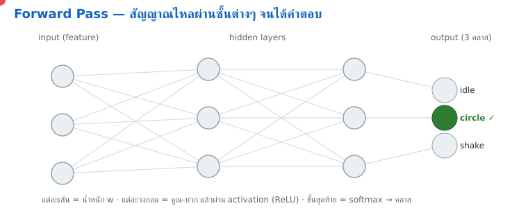
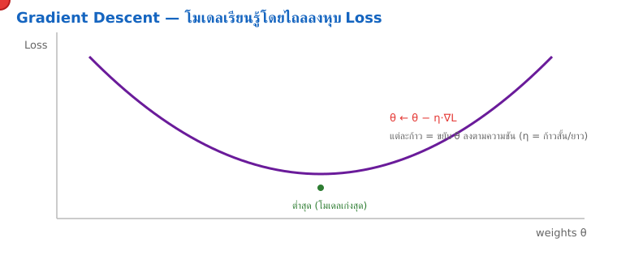

<style>
section { font-size: 24px; padding: 40px 52px; justify-content: flex-start; }
section h1 { font-size: 1.45em; line-height: 1.12; margin: 0 0 .22em; }
section h2 { font-size: 1.12em; margin: .15em 0; }
section h3 { font-size: 1.0em; margin: .12em 0; }
section p, section li { margin: .16em 0; line-height: 1.32; }
section img { max-width: 100%; height: auto; }
section svg { max-height: 250px; }
section table { font-size: .78em; }
section pre { font-size: .70em; line-height: 1.32; background:#0d1117; color:#e6edf3; border:1px solid #30363d; border-radius:8px; padding:12px 16px; box-shadow:0 2px 8px rgba(0,0,0,.25); }
section pre code { white-space: pre-wrap; background:transparent; color:inherit; } section pre .hljs-comment{color:#8b949e;font-style:italic} section pre .hljs-keyword,section pre .hljs-built_in,section pre .hljs-literal{color:#ff7b72} section pre .hljs-string{color:#a5d6ff} section pre .hljs-number{color:#79c0ff} section pre .hljs-title,section pre .hljs-title.function_,section pre .hljs-section{color:#d2a8ff} section pre .hljs-meta{color:#ffa657} section pre .hljs-attr,section pre .hljs-attribute,section pre .hljs-name{color:#7ee787}
section blockquote { margin: .25em 0; font-size: .92em; }
/* two images on a line (parity / 2x2 grids) stay side-by-side and small */
section p > img + img { margin-left: 10px; }
/* scroll-within-slide: dense slides scroll instead of clipping */
section { overflow-y: auto; overflow-x: hidden; }
section::-webkit-scrollbar { width: 11px; }
section::-webkit-scrollbar-thumb { background:#4a90d9; border-radius:6px; }
section::-webkit-scrollbar-track { background:rgba(0,0,0,.06); }
/* image drop-shadow + cover-slide readability (auto) */
section img{filter:drop-shadow(0 3px 12px rgba(0,0,0,.5))}
section.cover *{color:#fff !important}
section.cover h1,section.cover h2,section.cover h3,section.cover p,section.cover li,section.cover strong,section.cover em,section.cover blockquote,section.cover div{text-shadow:0 2px 9px rgba(0,0,0,.92),0 0 3px rgba(0,0,0,.8)}
section.cover div[style*="background:#"],section.cover div[style*="background: #"]{background:rgba(10,14,20,.66) !important;border-color:rgba(120,200,255,.45) !important;max-width:62%}
section.cover blockquote{border-left:4px solid rgba(120,200,255,.6) !important;background:rgba(13,17,23,.55) !important;border-radius:6px;padding:.3em .6em}
section.cover h1,section.cover h2,section.cover h3,section.cover p,section.cover blockquote{max-width:60%}
section.cover div:not(:has(img)){max-width:62%}
section.cover img{filter:none}
</style>

<!-- _class: cover -->
<!-- _backgroundColor: #0d1117 -->

# บทเรียน 5.4 — ข้างในการฝึก: Keras, Conv1D, gradient descent, int8 และ confusion matrix

## Training II · ฝึกโมเดลใน TensorFlow (Docker) แล้วทดสอบบน PC

**โมดูล 5 — ฝึกโมเดลและนำไปใช้หลายเป้าหมาย**

> ต่อจากบทเรียน 5.3 — ฝึกโมเดลใน Docker: หนึ่งชิ้นงาน สี่เป้าหมาย

---

# train / val / test — สามชุด สามหน้าที่

`dataset_tools.split()` ของ บทเรียน 5.1–5.2 แบ่งข้อมูลเป็นสามกอง ไม่ใช่เพราะชอบ แต่เพราะแต่ละกองมีหน้าที่คนละอย่าง — เข้าใจตรงนี้ก่อน ค่อยฝึก

<div style="text-align:center;margin:6px 0">
<svg width="880" height="170" viewBox="0 0 880 170" font-family="DejaVu Sans, sans-serif">
  <rect x="20" y="40" width="270" height="90" rx="10" fill="#e8f5e9" stroke="#2e7d32" stroke-width="2"/>
  <text x="155" y="66" font-size="14" font-weight="700" fill="#2e7d32" text-anchor="middle">train (~70%)</text>
  <text x="155" y="90" font-size="11" fill="#666" text-anchor="middle">โมเดลเรียนรู้จากกองนี้</text>
  <text x="155" y="110" font-size="11" fill="#666" text-anchor="middle">ปรับน้ำหนักตามกองนี้เท่านั้น</text>
  <rect x="305" y="40" width="255" height="90" rx="10" fill="#e3f2fd" stroke="#1565c0" stroke-width="2"/>
  <text x="432" y="66" font-size="14" font-weight="700" fill="#1565c0" text-anchor="middle">val (~15%)</text>
  <text x="432" y="90" font-size="11" fill="#666" text-anchor="middle">เช็กทุก epoch ระหว่างฝึก</text>
  <text x="432" y="110" font-size="11" fill="#666" text-anchor="middle">จับ overfit / เลือกจุดหยุด</text>
  <rect x="575" y="40" width="285" height="90" rx="10" fill="#fff3e0" stroke="#ef6c00" stroke-width="2"/>
  <text x="717" y="66" font-size="14" font-weight="700" fill="#e65100" text-anchor="middle">test (~15%)</text>
  <text x="717" y="90" font-size="11" fill="#666" text-anchor="middle">แตะครั้งเดียวตอนจบ</text>
  <text x="717" y="110" font-size="11" fill="#666" text-anchor="middle">ค่าความแม่นที่เชื่อได้จริง</text>
</svg>
</div>

- **train** — กองที่โมเดลเห็นและเรียนรู้ ปรับน้ำหนักตามกองนี้ (ห้ามเอา val/test มาปน)
- **val** — ระหว่างฝึก เอามาเช็กทุก epoch ว่าโมเดล generalize ได้ไหม ใช้ตัดสินว่าฝึกพอหรือยัง
- **test** — เก็บไว้ให้บริสุทธิ์ที่สุด แตะครั้งเดียวตอนจบเพื่อรายงานความแม่น "จริง" ที่ไม่หลอกตัวเอง
- `split()` แบ่งแบบ **stratified** — แต่ละคลาส (idle/circle/shaking) กระจายครบทั้งสามกอง ไม่ใช่กองใดกองหนึ่งขาดคลาส

> กฎเหล็ก: **test set ต้องไม่เคยมีอิทธิพลต่อการตัดสินใจใดๆ ระหว่างฝึก** ถ้าเราแอบดู test แล้วปรับโมเดล ตัวเลขสุดท้ายจะโกหกเรา — นี่คือวินัยพื้นฐานของ ML ที่ทำจริงทุกที่

---

# ภาพเคลื่อนไหว — สัญญาณไหลผ่านโครงข่าย (forward pass)



input → hidden → output: จุดแดงคือ activation ที่ไหลผ่านน้ำหนักจนได้คลาสที่ชนะ

---

# แกะข้างใน — สี่จังหวะของการฝึก

ทั้งไฟล์ [`train.py`](https://github.com/tesaiot/tesa-qualification-program/blob/main/courses/edge-ai-developer/shared/training/train.py) (และ [`s12_train.py`](https://github.com/tesaiot/tesa-qualification-program/blob/main/courses/edge-ai-developer/m05-training/l05-train-lab/practice/s12_train.py) ของเรา) อ่านเป็นสี่จังหวะ ไล่เรียงกัน — จำโครงนี้ไว้ เดี๋ยวไล่ทีละอัน

<div style="text-align:center;margin:6px 0">
<svg width="900" height="150" viewBox="0 0 900 150" font-family="DejaVu Sans, sans-serif">
  <defs>
    <marker id="ar4" markerUnits="userSpaceOnUse" markerWidth="12" markerHeight="10" refX="10" refY="4" orient="auto"><path d="M0,0 L10,4 L0,8 Z" fill="#607d8b"/></marker>
  </defs>
  <rect x="14" y="46" width="200" height="64" rx="12" fill="#e3f2fd" stroke="#1565c0" stroke-width="2"/>
  <text x="114" y="72" font-size="14" font-weight="700" fill="#1565c0" text-anchor="middle">1 · build</text>
  <text x="114" y="92" font-size="11" fill="#666" text-anchor="middle">สร้างโครงโมเดล Conv1D</text>
  <rect x="240" y="46" width="200" height="64" rx="12" fill="#e8f5e9" stroke="#2e7d32" stroke-width="2"/>
  <text x="340" y="72" font-size="14" font-weight="700" fill="#2e7d32" text-anchor="middle">2 · fit</text>
  <text x="340" y="92" font-size="11" fill="#666" text-anchor="middle">ฝึกด้วยชุด train+val</text>
  <rect x="466" y="46" width="200" height="64" rx="12" fill="#fff3e0" stroke="#ef6c00" stroke-width="2"/>
  <text x="566" y="72" font-size="14" font-weight="700" fill="#e65100" text-anchor="middle">3 · convert int8</text>
  <text x="566" y="92" font-size="11" fill="#666" text-anchor="middle">บีบ + calibrate</text>
  <rect x="692" y="46" width="196" height="64" rx="12" fill="#f3e5f5" stroke="#6a1b9a" stroke-width="2"/>
  <text x="790" y="72" font-size="14" font-weight="700" fill="#6a1b9a" text-anchor="middle">4 · eval PC</text>
  <text x="790" y="92" font-size="11" fill="#666" text-anchor="middle">วัด accuracy + confusion</text>
  <line x1="214" y1="78" x2="238" y2="78" stroke="#607d8b" stroke-width="2.4" marker-end="url(#ar4)"/>
  <line x1="440" y1="78" x2="464" y2="78" stroke="#607d8b" stroke-width="2.4" marker-end="url(#ar4)"/>
  <line x1="666" y1="78" x2="690" y2="78" stroke="#607d8b" stroke-width="2.4" marker-end="url(#ar4)"/>
  <text x="450" y="134" font-size="12" fill="#888" text-anchor="middle">สี่จังหวะนี้คือทั้งเรื่องราวของชุดบทเรียน — และคือ 4 ช่องที่คุณจะเติมใน s12_train.py</text>
</svg>
</div>

> เทียบกับบทเรียน 1.1–1.3: บทเรียน 1.1–1.3 มี 4 คำสั่ง (`models`/`select`/`result`/`stop`) วันนี้ก็ 4 จังหวะ (`build`/`fit`/`convert`/`eval`) — ต่างที่ตอนนี้เราไม่ได้ "เรียกโมเดล" แต่ "สร้างโมเดล"

---

# รู้จัก Keras — เขียนโมเดลเป็นชั้นๆ

ก่อนดูโค้ดสร้างโมเดล มารู้จักเครื่องมือก่อน เราใช้ **TensorFlow/Keras** — วิธีเขียน neural network ที่อ่านเหมือน "ต่อบล็อกเลโก้" ทีละชั้น

<div style="text-align:center;margin:6px 0">
<svg width="820" height="150" viewBox="0 0 820 150" font-family="DejaVu Sans, sans-serif">
  <defs>
    <marker id="arK" markerUnits="userSpaceOnUse" markerWidth="12" markerHeight="10" refX="10" refY="4" orient="auto"><path d="M0,0 L10,4 L0,8 Z" fill="#607d8b"/></marker>
  </defs>
  <rect x="20" y="50" width="150" height="52" rx="9" fill="#e3f2fd" stroke="#1565c0" stroke-width="2"/>
  <text x="95" y="72" font-size="12" font-weight="700" fill="#1565c0" text-anchor="middle">Input</text>
  <text x="95" y="90" font-size="10" fill="#888" text-anchor="middle">(50, 6)</text>
  <rect x="196" y="50" width="150" height="52" rx="9" fill="#e8f5e9" stroke="#2e7d32" stroke-width="2"/>
  <text x="271" y="72" font-size="12" font-weight="700" fill="#2e7d32" text-anchor="middle">Conv1D + Pool</text>
  <text x="271" y="90" font-size="10" fill="#888" text-anchor="middle">จับรูปแบบตามเวลา</text>
  <rect x="372" y="50" width="150" height="52" rx="9" fill="#fff3e0" stroke="#ef6c00" stroke-width="2"/>
  <text x="447" y="72" font-size="12" font-weight="700" fill="#e65100" text-anchor="middle">Pooling</text>
  <text x="447" y="90" font-size="10" fill="#888" text-anchor="middle">ยุบแกนเวลา</text>
  <rect x="548" y="50" width="150" height="52" rx="9" fill="#f3e5f5" stroke="#6a1b9a" stroke-width="2"/>
  <text x="623" y="72" font-size="12" font-weight="700" fill="#6a1b9a" text-anchor="middle">Dense</text>
  <text x="623" y="90" font-size="10" fill="#888" text-anchor="middle">ตัดสินคลาส</text>
  <rect x="724" y="50" width="80" height="52" rx="9" fill="#e0f7fa" stroke="#00838f" stroke-width="2"/>
  <text x="764" y="76" font-size="12" font-weight="700" fill="#00838f" text-anchor="middle">3 คลาส</text>
  <line x1="170" y1="76" x2="194" y2="76" stroke="#607d8b" stroke-width="2.2" marker-end="url(#arK)"/>
  <line x1="346" y1="76" x2="370" y2="76" stroke="#607d8b" stroke-width="2.2" marker-end="url(#arK)"/>
  <line x1="522" y1="76" x2="546" y2="76" stroke="#607d8b" stroke-width="2.2" marker-end="url(#arK)"/>
  <line x1="698" y1="76" x2="722" y2="76" stroke="#607d8b" stroke-width="2.2" marker-end="url(#arK)"/>
</svg>
</div>

- **`tf.keras.Sequential([...])`** — วางชั้น (layer) เรียงจากบนลงล่าง ข้อมูลไหลผ่านทีละชั้น
- แต่ละชั้นแปลงข้อมูล: Conv1D หา pattern, Pooling ย่อขนาด, Dense ตัดสินใจ — ต่อกันเป็นโมเดล
- เราเลือกเฉพาะชั้นที่ **Ethos-U55 เร่งได้** เพราะปลายทางคือลงชิป ไม่ใช่รันบน GPU ตัวใหญ่
- ตอนฝึก Keras จะปรับ "น้ำหนัก" ในแต่ละชั้นให้ทายถูกขึ้นเรื่อยๆ อัตโนมัติ — เราแค่วางโครงกับป้อนข้อมูล

> ไม่ต้องจำ API ของ Keras ทั้งหมดในชุดบทเรียนนี้ ขอแค่เห็นภาพว่า "โมเดล = ชั้นที่ต่อกัน" และข้อมูลไหลจาก input ผ่านชั้นต่างๆ ออกมาเป็นคลาส เดี๋ยวเราดูโค้ดจริงในสไลด์ถัดไป

---

# จังหวะ 1 — สร้างโมเดล (Conv1D เล็กๆ)

โมเดลของเราคือ **1-D CNN** เล็กๆ ตั้งใจให้เล็กพอลงชิป Conv1D กวาดไปตามแกนเวลา จับ "รูปร่างของการเคลื่อนไหว" ในหน้าต่าง 1 วินาที

```python
def build_model(win, chans, n_classes):
    return tf.keras.Sequential([
        tf.keras.layers.Input(shape=(win, chans)),        # (50, 6): 1 วิ, 6 แกน
        tf.keras.layers.Conv1D(16, 5, padding="same", activation="relu"),
        tf.keras.layers.MaxPooling1D(2),
        tf.keras.layers.Conv1D(32, 3, padding="same", activation="relu"),
        tf.keras.layers.GlobalAveragePooling1D(),          # ยุบแกนเวลา
        tf.keras.layers.Dense(32, activation="relu"),
        tf.keras.layers.Dense(n_classes, activation="softmax"),  # 3 คลาส
    ])
```

- **input** `(win=50, chans=6)` — หน้าต่าง 50 ตัวอย่าง (1 วิ ที่ 50 Hz) × 6 แกน IMU (ax..gz)
- **Conv1D → MaxPool → Conv1D** — เรียนรู้รูปแบบตามเวลา ตัวเลข 16/32 คือจำนวน filter
- **GlobalAveragePooling1D** — ยุบมิติเวลาให้เหลือเวกเตอร์เดียว แล้ว dense head ตัดสินคลาส
- ทุก layer ที่เลือกเป็น op ที่ **Ethos-U55 เร่งได้** นี่คือเหตุผลที่โมเดลต้องเล็กและเรียบ

> ในฉบับเต็ม (`examples/`) เราเรียก `model.summary()` + `model.count_params()` เพื่อดูว่าโมเดลเล็กแค่ไหน — โมเดลลงบอร์ดได้ต้องมีพารามิเตอร์ระดับหลักพัน ไม่ใช่หลักล้าน

---

# ภาพเคลื่อนไหว — Conv1D เลื่อน kernel ไปตามสัญญาณ

![ภาพเคลื่อนไหว: kernel ของ Conv1D ไถลไปตามสัญญาณทีละตำแหน่ง แล้วคูณรวมเป็นผลลัพธ์ y[t] w:760](../../assets/img/anim_conv1d.svg)

kernel เดียวไถลทั้งเส้น = เรียน "รูปทรง" ที่เลื่อนไปมาได้ (translation-invariant)

---

# คณิตหลังฉาก (1) — Conv1D ทำอะไรกับสัญญาณ

`Conv1D` ที่เราเพิ่งวางในโมเดลไม่ใช่เวทมนตร์ มันคือสมการเดียวสั้นๆ ที่เลื่อน "หน้าต่างเล็ก" (filter) ไปตามแกนเวลา แล้วคูณ-บวกทีละตำแหน่ง:

$$ y[t] = \sum_{k=0}^{K-1} w[k]\,x[t+k] + b $$

อ่านทีละตัว (ภาษาคน):

- $x$ = สัญญาณเข้า — หน้าต่าง IMU ของเรา (50 ตัวอย่างต่อหนึ่งแกน)
- $w[k]$ = ค่าน้ำหนักใน filter ยาว $K$ ค่า (โมเดลเราใช้ $K=5$ แล้ว $K=3$) — นี่คือ "รูปร่าง" ที่โมเดลเรียนรู้
- $b$ = bias เลื่อนระดับผลลัพธ์
- $y[t]$ = ค่าออกที่ตำแหน่งเวลา $t$ — สูงเมื่อสัญญาณช่วงนั้น "หน้าตาเหมือน" filter

<div style="text-align:center;margin:6px 0">
<svg width="820" height="140" viewBox="0 0 820 140" font-family="DejaVu Sans, sans-serif">
  <text x="20" y="24" font-size="12" fill="#666">filter w (K=3) เลื่อนไปตามแกนเวลา แล้ว dot-product ทีละตำแหน่ง</text>
  <g>
    <rect x="20" y="40" width="34" height="34" fill="#e3f2fd" stroke="#1565c0"/>
    <rect x="54" y="40" width="34" height="34" fill="#e3f2fd" stroke="#1565c0"/>
    <rect x="88" y="40" width="34" height="34" fill="#e3f2fd" stroke="#1565c0"/>
    <rect x="122" y="40" width="34" height="34" fill="#eceff1" stroke="#90a4ae"/>
    <rect x="156" y="40" width="34" height="34" fill="#eceff1" stroke="#90a4ae"/>
    <rect x="190" y="40" width="34" height="34" fill="#eceff1" stroke="#90a4ae"/>
    <rect x="224" y="40" width="34" height="34" fill="#eceff1" stroke="#90a4ae"/>
    <text x="140" y="98" font-size="11" fill="#888">x[t] ... (หน้าต่าง IMU)</text>
  </g>
  <rect x="20" y="40" width="102" height="34" fill="none" stroke="#ef6c00" stroke-width="3"/>
  <text x="71" y="30" font-size="11" fill="#ef6c00" text-anchor="middle">w · x</text>
  <line x1="270" y1="57" x2="330" y2="57" stroke="#607d8b" stroke-width="2.4"/>
  <polygon points="330,52 342,57 330,62" fill="#607d8b"/>
  <rect x="360" y="40" width="34" height="34" fill="#f3e5f5" stroke="#6a1b9a"/>
  <text x="377" y="98" font-size="11" fill="#6a1b9a" text-anchor="middle">y[t]</text>
  <text x="430" y="61" font-size="12" fill="#666">= w[0]·x[t] + w[1]·x[t+1] + w[2]·x[t+2] + b</text>
</svg>
</div>

> ทำไมสำคัญตรงนี้: filter หนึ่งอันเรียน "ลายเซ็น" ของการเคลื่อนไหวหนึ่งแบบ — เช่น จังหวะสั่นถี่ๆ ของ `shaking` การมี 16/32 filter ก็เหมือนมีนักสังเกต 16/32 คนช่วยกันจับลายต่างๆ พร้อมกัน นี่คือเหตุผลที่ Conv1D เหมาะกับสัญญาณตามเวลาแบบ IMU

---

# ภาพเคลื่อนไหว — Gradient Descent: โมเดลไถลลงหุบ Loss



▸ **ลองเล่นสด (GeoGebra):** [เปิด Interactive Math Lab](https://github.com/tesaiot/tesa-qualification-program/blob/main/courses/edge-ai-developer/shared/interactive/math_lab.html) — ลากจุด/เลื่อนสไลเดอร์ดูสมการขยับตาม

แต่ละ epoch = ลูกบอลไถลลงหุบ loss เข้าใกล้จุดต่ำสุด (โมเดลทายแม่นขึ้นเรื่อย ๆ)

---

# จังหวะ 2 — ฝึก (fit) และอ่านผล

เมื่อมีโครงโมเดลแล้ว เรา `compile` (บอกว่าใช้ optimizer/loss อะไร) แล้ว `fit` (ฝึกจริง):

```python
model.compile(optimizer="adam",
              loss="sparse_categorical_crossentropy", metrics=["accuracy"])
model.fit(Xtr, ytr, validation_data=(Xva, yva),
          epochs=a.epochs, batch_size=32, verbose=2)
```

- **epoch** = รอบที่โมเดลได้เห็นข้อมูลฝึกครบทั้งชุดหนึ่งครั้ง (เราตั้ง 25 รอบ)
- **batch_size=32** = อัปเดตน้ำหนักทุกๆ 32 หน้าต่าง ไม่ใช่ทีละอัน (เร็วและนิ่งกว่า)
- **validation_data** = ทุก epoch เอา `Xva` (ชุดที่ไม่ได้ฝึก) มาทดสอบ ดูว่าโมเดลเก่งจริงหรือแค่จำ

อ่านตัวเลขระหว่างฝึก:

| เห็นแบบนี้ | แปลว่า |
|---|---|
| `accuracy` และ `val_accuracy` ขึ้นด้วยกัน | ดี — โมเดลเข้าใจ generalize ได้ |
| `accuracy` สูง แต่ `val_accuracy` ต่ำ/ตก | overfit — จำข้อสอบ ไม่เข้าใจ |
| ทั้งคู่ต่ำค้าง | underfit — โมเดลเล็กไป/ข้อมูลน้อยไป/ฝึกสั้นไป |

> `fit` คือช่องเติมที่ 1 ของคุณ — มันคือ "จังหวะที่โมเดลเรียนรู้จริง" ก่อนหน้านี้เราแค่วางโครง ยังไม่มีอะไรเกิดขึ้น

---

# ภาพเคลื่อนไหว — Softmax เปลี่ยนคะแนนเป็นความน่าจะเป็น



▸ **ลองเล่นสด (GeoGebra):** [เปิด Interactive Math Lab](https://github.com/tesaiot/tesa-qualification-program/blob/main/courses/edge-ai-developer/shared/interactive/math_lab.html) — ลากจุด/เลื่อนสไลเดอร์ดูสมการขยับตาม

คะแนนดิบกลายเป็นความน่าจะเป็นที่รวมกันได้ 1 — ตัวสูงสุดคือคำตอบของโมเดล

---

# คณิตหลังฉาก (2) — โมเดลเรียนรู้ยังไง (3 สมการ)

ตอน `model.fit(...)` ทำงาน มีสามสมการหมุนวนอยู่ข้างใน ไม่ต้องท่อง แค่เห็นภาพว่าแต่ละตัวทำอะไร:

**1. softmax** — ชั้นสุดท้าย (`Dense(..., activation="softmax")`) แปลงคะแนนดิบ $z_i$ เป็นความน่าจะเป็นของ 3 คลาส ที่รวมกันได้ 1:

$$ \hat{y}_i = \frac{e^{z_i}}{\sum_{j=1}^{C} e^{z_j}} $$

**2. cross-entropy loss** — คือ `sparse_categorical_crossentropy` ที่เราใส่ตอน `compile` วัดว่าคำทาย $\hat{y}$ ห่างจากเฉลย $y$ แค่ไหน (ยิ่งทายถูกมั่นใจ ยิ่งเข้าใกล้ 0):

$$ L = -\sum_{i=1}^{C} y_i \log(\hat{y}_i) $$

**3. gradient descent** — คือหัวใจของ optimizer `adam` ค่อยๆ ขยับน้ำหนัก $\theta$ ลง "เนินของ loss" ทีละก้าว:

$$ \theta \leftarrow \theta - \eta\,\nabla_\theta L $$

อ่านสัญลักษณ์แบบภาษาคน:

- $z_i$ = คะแนนดิบของคลาส $i$, $C=3$ (idle/circle/shaking), $\hat{y}_i$ = ความน่าจะเป็นที่โมเดลให้คลาส $i$
- $y_i$ = เฉลยจริง (คลาสถูก = 1 ที่เหลือ = 0) → $L$ ยิ่งต่ำ ยิ่งทายเก่ง
- $\theta$ = น้ำหนักทั้งหมดในโมเดล, $\nabla_\theta L$ = ทิศที่ loss ชันขึ้น, $\eta$ = learning rate (ก้าวสั้น/ยาว)

<div style="text-align:center;margin:4px 0">
<svg width="760" height="120" viewBox="0 0 760 120" font-family="DejaVu Sans, sans-serif">
  <defs><marker id="arM2" markerWidth="12" markerHeight="10" refX="10" refY="4" orient="auto"><path d="M0,0 L10,4 L0,8 Z" fill="#607d8b"/></marker></defs>
  <rect x="14" y="36" width="160" height="50" rx="9" fill="#e3f2fd" stroke="#1565c0" stroke-width="2"/>
  <text x="94" y="58" font-size="12" font-weight="700" fill="#1565c0" text-anchor="middle">logits z</text>
  <text x="94" y="76" font-size="10" fill="#888" text-anchor="middle">คะแนนดิบ 3 คลาส</text>
  <rect x="210" y="36" width="160" height="50" rx="9" fill="#e8f5e9" stroke="#2e7d32" stroke-width="2"/>
  <text x="290" y="58" font-size="12" font-weight="700" fill="#2e7d32" text-anchor="middle">softmax → ŷ</text>
  <text x="290" y="76" font-size="10" fill="#888" text-anchor="middle">ความน่าจะเป็น</text>
  <rect x="406" y="36" width="160" height="50" rx="9" fill="#fff3e0" stroke="#ef6c00" stroke-width="2"/>
  <text x="486" y="58" font-size="12" font-weight="700" fill="#e65100" text-anchor="middle">loss L</text>
  <text x="486" y="76" font-size="10" fill="#888" text-anchor="middle">ทายห่างเฉลยแค่ไหน</text>
  <rect x="602" y="36" width="150" height="50" rx="9" fill="#f3e5f5" stroke="#6a1b9a" stroke-width="2"/>
  <text x="677" y="58" font-size="12" font-weight="700" fill="#6a1b9a" text-anchor="middle">ปรับ θ</text>
  <text x="677" y="76" font-size="10" fill="#888" text-anchor="middle">gradient descent</text>
  <line x1="174" y1="61" x2="206" y2="61" stroke="#607d8b" stroke-width="2.2" marker-end="url(#arM2)"/>
  <line x1="370" y1="61" x2="402" y2="61" stroke="#607d8b" stroke-width="2.2" marker-end="url(#arM2)"/>
  <line x1="566" y1="61" x2="598" y2="61" stroke="#607d8b" stroke-width="2.2" marker-end="url(#arM2)"/>
  <path d="M677,88 C677,108 94,108 94,88" fill="none" stroke="#6a1b9a" stroke-width="1.6" stroke-dasharray="4 3" marker-end="url(#arM2)"/>
  <text x="385" y="118" font-size="10" fill="#6a1b9a" text-anchor="middle">วนซ้ำทุก batch/epoch จน loss ต่ำ</text>
</svg>
</div>

> ทำไมสำคัญตรงนี้: วงจร softmax → loss → gradient descent วนซ้ำทุก batch นี่แหละคือสิ่งที่ซ่อนอยู่หลัง `model.fit(...)` บรรทัดเดียวที่คุณเติมในช่อง 1 พอเห็น `accuracy` ไต่ขึ้น = $L$ กำลังลดลง = $\theta$ กำลังขยับถูกทาง

---

# ทำไมต้อง int8 — และ quantization คืออะไร

โมเดลตอนฝึกใช้ตัวเลข **float32** (ทศนิยม 32 บิต) แต่ NPU บนบอร์ดเร่งได้เฉพาะ **int8** (จำนวนเต็ม 8 บิต) เราจึงต้อง "บีบ" ก่อนลงชิป

<div style="text-align:center;margin:6px 0">
<svg width="880" height="150" viewBox="0 0 880 150" font-family="DejaVu Sans, sans-serif">
  <defs>
    <marker id="arQ" markerUnits="userSpaceOnUse" markerWidth="12" markerHeight="10" refX="10" refY="4" orient="auto"><path d="M0,0 L10,4 L0,8 Z" fill="#607d8b"/></marker>
  </defs>
  <rect x="30" y="44" width="240" height="64" rx="10" fill="#e3f2fd" stroke="#1565c0" stroke-width="2"/>
  <text x="150" y="70" font-size="13" font-weight="700" fill="#1565c0" text-anchor="middle">float32 (ตอนฝึก)</text>
  <text x="150" y="90" font-size="11" fill="#666" text-anchor="middle">แม่นเต็ม แต่ใหญ่ + กินไฟ</text>
  <rect x="560" y="44" width="290" height="64" rx="10" fill="#e8f5e9" stroke="#2e7d32" stroke-width="2"/>
  <text x="705" y="66" font-size="13" font-weight="700" fill="#2e7d32" text-anchor="middle">int8 (ลงชิป)</text>
  <text x="705" y="86" font-size="11" fill="#666" text-anchor="middle">เล็กลง ~4 เท่า · NPU เร่งได้</text>
  <text x="705" y="100" font-size="10" fill="#888" text-anchor="middle">Web/Cortex-A ก็รับได้</text>
  <line x1="270" y1="76" x2="556" y2="76" stroke="#607d8b" stroke-width="2.6" marker-end="url(#arQ)"/>
  <text x="413" y="66" font-size="12" fill="#ef6c00" text-anchor="middle">quantization</text>
  <text x="413" y="92" font-size="11" fill="#888" text-anchor="middle">แมพช่วง float -> เกล็ด int8</text>
</svg>
</div>

- **int8 มีค่าได้แค่ -128..127** เราจึงต้องหา "สเกล" ที่แมพช่วงค่าจริงของโมเดลลงไปในกรอบแคบๆ นี้
- ได้ของแลกมา: ขนาดเล็กลง ~4 เท่า และ NPU เร่งได้ (float NPU เร่งไม่ได้) แต่เสี่ยงเสียความแม่นนิดหน่อย
- **int8 คือตัวหารร่วม** ของทุกเป้าหมาย: MCU บังคับต้องใช้ ส่วน Web/Cortex-A รับได้หมด บีบครั้งเดียวใช้ได้ทั่ว

> เราใช้ **post-training quantization** — ฝึกด้วย float ก่อน แล้วค่อยบีบทีหลัง ง่ายและพอสำหรับโมเดลเล็ก (มีวิธี quantization-aware training ที่แม่นกว่า แต่ซับซ้อนกว่า เก็บไว้เป็นการบ้านของนักวิจัย)

---

# representative dataset — หัวใจของ int8

คำถามคือ converter จะรู้ได้ยังไงว่าควรเลือก "สเกล int8" เท่าไร? คำตอบ: เรา **ป้อนตัวอย่างจริง** ให้มันดู แล้วมันวัดช่วงค่าเอง — เรียกจังหวะนี้ว่า **calibration**

```python
def representative():
    for i in range(min(200, len(X_repr))):
        yield [X_repr[i:i + 1].astype(np.float32)]   # ป้อนหน้าต่างจริง 200 อัน

conv.representative_dataset = representative           # ผูกเข้ากับ converter
```

- converter รันตัวอย่าง 200 อันนี้ผ่านโมเดล **ดูว่า activation แต่ละชั้นมีค่าจริงอยู่ในช่วงไหน**
- แล้วเลือกสเกล int8 ที่ครอบช่วงนั้นพอดี — ไม่ตัดหัวตัดหาง ไม่เผื่อกว้างจนเสียความละเอียด
- ต้องเป็น **ตัวอย่างจากชุดฝึกจริง** ไม่ใช่ข้อมูลมั่ว ไม่งั้นสเกลจะเพี้ยน ความแม่นตก

> ถ้าลืมผูก `representative_dataset` ทั้งที่ตั้ง `TFLITE_BUILTINS_INT8` ไว้ `conv.convert()` จะหยุดทันทีด้วย `ValueError: For full integer quantization, a representative_dataset must be specified.` — นี่คือ **ช่องเติมที่ 2** ของคุณ ส่วนความผิดพลาดที่เงียบกว่าและพบบ่อยในงานจริงคือป้อนตัวอย่างที่ไม่เหมือนข้อมูลจริง สเกลจะเพี้ยนแล้ว int8 แม่นตก

---

# จังหวะ 3 — บีบเป็น int8 แบบ full-integer

รวมทุกอย่างเข้าด้วยกัน: บอก converter ให้บีบ **ทั้ง input และ output เป็น int8** (ไม่ใช่แค่น้ำหนักข้างใน) นี่คือคอนฟิกที่ NPU บังคับ

```python
conv = tf.lite.TFLiteConverter.from_keras_model(model)
conv.optimizations = [tf.lite.Optimize.DEFAULT]
conv.representative_dataset = representative                     # ช่องเติม 2
conv.target_spec.supported_ops = [tf.lite.OpsSet.TFLITE_BUILTINS_INT8]
conv.inference_input_type = tf.int8                             # ช่องเติม 3
conv.inference_output_type = tf.int8
tflite = conv.convert()
```

- `inference_input_type = tf.int8` + `inference_output_type = tf.int8` — บังคับขาเข้า/ขาออกเป็น int8 ล้วน
- นี่แหละที่แยก "โมเดลรันบนชิปได้จริง" ออกจาก "โมเดลที่รันได้แค่บน PC" — NPU อ่าน float ไม่ได้เลย
- ผลลัพธ์คือ `bytes` ของไฟล์ `.tflite` เราเขียนลงดิสก์ตรงๆ ~11 KB

> `inference_input_type = tf.int8` คือ **ช่องเติมที่ 3** — สั้นแค่สองบรรทัด แต่คือเส้นแบ่งระหว่าง "โมเดลลงบอร์ดได้" กับ "ไม่ได้"

---

# อย่าลืม normalization — จุดพังเงียบ

ก่อนฝึก เรา normalize ข้อมูล (ลบ mean หารด้วย std) เพื่อให้ทุกแกนอยู่สเกลเดียวกัน แต่มีกับดัก: **ฝั่งที่เอาโมเดลไปใช้ต้อง normalize ด้วยค่าเดียวกันเป๊ะ**

```python
(Xtr, Xva, Xte), (mean, std) = dt.normalize(Xtr, Xva, Xte)   # fit บนชุดฝึกเท่านั้น
...
np.savez(a.out + ".norm.npz", mean=mean, std=std)            # เซฟไว้คู่กับโมเดล
```

- `dt.normalize` หา `mean`/`std` จาก **ชุดฝึกเท่านั้น** ห้ามให้สถิติของ val/test รั่วเข้ามา (ไม่งั้นตัวเลขสวยเกินจริง)
- เราเซฟ `mean`/`std` ลงไฟล์ `.norm.npz` คู่กับโมเดล — บทเรียน 5.6–5.7 (เบราว์เซอร์) และ บทเรียน 5.8–5.9 (บอร์ด) ต้องโหลดไปใช้
- ถ้า front-end บนบอร์ดใช้ mean/std คนละชุดกับตอนฝึก โมเดลจะทายมั่วทั้งๆ ที่ไฟล์ถูก

> นี่คือ **จุดพังเงียบ (silent failure)** ที่หายากมาก — โมเดลไม่ error แต่ทายผิดหมด เพราะ "เห็นข้อมูลคนละสเกล" กับตอนฝึก จำไว้: normalization เป็นส่วนหนึ่งของโมเดล ไม่ใช่ของแถม

---

# จังหวะ 4 — ทดสอบไฟล์ int8 บน PC

มีไฟล์ `.tflite` แล้ว เรารันมันบน PC ผ่าน `ai-edge-litert` (ตัวรัน .tflite รุ่นใหม่) นี่คือ ground truth ก่อนเอาลงบอร์ด:

```python
from ai_edge_litert.interpreter import Interpreter
it = Interpreter(model_path=out_path); it.allocate_tensors()
inp, out = it.get_input_details()[0], it.get_output_details()[0]
in_scale, in_zero = inp["quantization"]         # สเกล/zero-point ของ input
for i in range(len(Xte)):
    q = np.clip(np.round(Xte[i:i+1] / in_scale + in_zero), -128, 127).astype(np.int8)
    it.set_tensor(inp["index"], q); it.invoke()
    o = it.get_tensor(out["index"])[0].astype(np.float32)
    o = (o - out_zero) * out_scale              # dequantize กลับเป็น float
    preds.append(int(o.argmax()))
acc = (preds == yte).mean()                      # ช่องเติม 4
```

- โมเดลรับ int8 เราจึงต้อง **quantize** input (float → int8) ด้วยสเกลของมันเองก่อนป้อน
- ขาออกได้ int8 กลับมา เราต้อง **dequantize** (int8 → float) ก่อนหา `argmax` (คลาสที่ชนะ)
- `acc = (preds == yte).mean()` = สัดส่วนหน้าต่างที่ทายถูกในชุดทดสอบ — **ช่องเติมที่ 4** ของคุณ

> นี่คือ int8 math ที่เราเห็นครั้งแรกใน บทเรียน 1.1–1.3 (`conf`/`scores`) แต่รอบนี้เราลงมือแปลงเอง เข้าใจว่าตัวเลข int8 บนชิปเชื่อมกับความน่าจะเป็นยังไง

---

# อ่าน confusion matrix ให้เป็น

`accuracy` บอกภาพรวม แต่ **confusion matrix** บอกว่าโมเดลสับสน "คู่ไหน" — สำคัญกว่าตัวเลขเดียวมากในงานจริง

<div style="text-align:center;margin:6px 0">
<svg width="720" height="210" viewBox="0 0 720 210" font-family="DejaVu Sans, sans-serif">
  <text x="360" y="24" font-size="13" font-weight="700" fill="#455a64" text-anchor="middle">confusion (rows=true, cols=pred)</text>
  <text x="150" y="60" font-size="12" fill="#666">true \ pred</text>
  <text x="300" y="60" font-size="12" font-weight="700" fill="#1565c0" text-anchor="middle">idle</text>
  <text x="420" y="60" font-size="12" font-weight="700" fill="#2e7d32" text-anchor="middle">circle</text>
  <text x="540" y="60" font-size="12" font-weight="700" fill="#6a1b9a" text-anchor="middle">shaking</text>
  <!-- rows -->
  <text x="150" y="98" font-size="12" font-weight="700" fill="#1565c0">idle</text>
  <rect x="270" y="80" width="60" height="30" fill="#c8e6c9" stroke="#2e7d32"/><text x="300" y="100" font-size="13" text-anchor="middle">7</text>
  <rect x="390" y="80" width="60" height="30" fill="#fff" stroke="#bbb"/><text x="420" y="100" font-size="13" text-anchor="middle">0</text>
  <rect x="510" y="80" width="60" height="30" fill="#fff" stroke="#bbb"/><text x="540" y="100" font-size="13" text-anchor="middle">0</text>
  <text x="150" y="138" font-size="12" font-weight="700" fill="#2e7d32">circle</text>
  <rect x="270" y="120" width="60" height="30" fill="#fff" stroke="#bbb"/><text x="300" y="140" font-size="13" text-anchor="middle">0</text>
  <rect x="390" y="120" width="60" height="30" fill="#c8e6c9" stroke="#2e7d32"/><text x="420" y="140" font-size="13" text-anchor="middle">7</text>
  <rect x="510" y="120" width="60" height="30" fill="#fff" stroke="#bbb"/><text x="540" y="140" font-size="13" text-anchor="middle">0</text>
  <text x="150" y="178" font-size="12" font-weight="700" fill="#6a1b9a">shaking</text>
  <rect x="270" y="160" width="60" height="30" fill="#fff" stroke="#bbb"/><text x="300" y="180" font-size="13" text-anchor="middle">0</text>
  <rect x="390" y="160" width="60" height="30" fill="#fff" stroke="#bbb"/><text x="420" y="180" font-size="13" text-anchor="middle">0</text>
  <rect x="510" y="160" width="60" height="30" fill="#c8e6c9" stroke="#2e7d32"/><text x="540" y="180" font-size="13" text-anchor="middle">7</text>
  <text x="640" y="120" font-size="11" fill="#888">แนวทแยง</text>
  <text x="640" y="136" font-size="11" fill="#2e7d32">= ทายถูก</text>
</svg>
</div>

- **แนวทแยง** (idle→idle, circle→circle, shaking→shaking) = ทายถูก ยิ่งเลขสูงยิ่งดี
- **นอกแนวทแยง** = ทายผิด เช่น ถ้าช่อง circle→shaking มีเลข แปลว่าโมเดลสับสนสองท่านี้ (คล้ายกัน)
- ตารางนี้ perfect เพราะข้อมูลสังเคราะห์แยกคลาสง่าย — **ข้อมูลจริงจากบอร์ดจะมีเลขนอกแนวทแยงบ้าง** นั่นปกติ

> คิดถึงบทเรียน false positive / false negative จาก โมดูล 4 (Analysis): confusion matrix คือที่ที่มันจับต้องได้ — "โมเดลชอบเข้าใจผิดว่า X เป็น Y" บอกเราว่าต้องเก็บข้อมูลเพิ่มตรงไหน
