<style>
section { font-size: 24px; padding: 40px 52px; justify-content: flex-start; }
section h1 { font-size: 1.45em; line-height: 1.12; margin: 0 0 .22em; }
section h2 { font-size: 1.12em; margin: .15em 0; }
section h3 { font-size: 1.0em; margin: .12em 0; }
section p, section li { margin: .16em 0; line-height: 1.32; }
section img { max-width: 100%; height: auto; }
section svg { max-height: 250px; }
section table { font-size: .78em; }
section pre { font-size: .70em; line-height: 1.32; background:#0d1117; color:#e6edf3; border:1px solid #30363d; border-radius:8px; padding:12px 16px; box-shadow:0 2px 8px rgba(0,0,0,.25); }
section pre code { white-space: pre-wrap; background:transparent; color:inherit; } section pre .hljs-comment{color:#8b949e;font-style:italic} section pre .hljs-keyword,section pre .hljs-built_in,section pre .hljs-literal{color:#ff7b72} section pre .hljs-string{color:#a5d6ff} section pre .hljs-number{color:#79c0ff} section pre .hljs-title,section pre .hljs-title.function_,section pre .hljs-section{color:#d2a8ff} section pre .hljs-meta{color:#ffa657} section pre .hljs-attr,section pre .hljs-attribute,section pre .hljs-name{color:#7ee787}
section blockquote { margin: .25em 0; font-size: .92em; }
/* two images on a line (parity / 2x2 grids) stay side-by-side and small */
section p > img + img { margin-left: 10px; }
/* scroll-within-slide: dense slides scroll instead of clipping */
section { overflow-y: auto; overflow-x: hidden; }
section::-webkit-scrollbar { width: 11px; }
section::-webkit-scrollbar-thumb { background:#4a90d9; border-radius:6px; }
section::-webkit-scrollbar-track { background:rgba(0,0,0,.06); }
/* image drop-shadow + cover-slide readability (auto) */
section img{filter:drop-shadow(0 3px 12px rgba(0,0,0,.5))}
section.cover *{color:#fff !important}
section.cover h1,section.cover h2,section.cover h3,section.cover p,section.cover li,section.cover strong,section.cover em,section.cover blockquote,section.cover div{text-shadow:0 2px 9px rgba(0,0,0,.92),0 0 3px rgba(0,0,0,.8)}
section.cover div[style*="background:#"],section.cover div[style*="background: #"]{background:rgba(10,14,20,.66) !important;border-color:rgba(120,200,255,.45) !important;max-width:62%}
section.cover blockquote{border-left:4px solid rgba(120,200,255,.6) !important;background:rgba(13,17,23,.55) !important;border-radius:6px;padding:.3em .6em}
section.cover h1,section.cover h2,section.cover h3,section.cover p,section.cover blockquote{max-width:60%}
section.cover div:not(:has(img)){max-width:62%}
section.cover img{filter:none}
</style>

<!-- _class: cover -->
<!-- _backgroundColor: #0d1117 -->

# บทเรียน 5.8 — quantize และ Vela: เอาโมเดลของเราขึ้น Ethos-U55
## เอาโมเดลของเราขึ้น Ethos-U55 ด้วย Vela แล้วเทียบสามเป้าหมาย

**โมดูล 5 — ฝึกโมเดลและนำไปใช้หลายเป้าหมาย**

**บล็อก Training (บทเรียน 5.3–5.5 → บทเรียน 5.6–5.7 → บทเรียน 5.8–5.9) · ปิดท้ายวงจร Pillar 4**

> คาถาประจำบทเรียน: **"โมเดล int8 ไฟล์เดียว — เว็บกับ Cortex-A ใช้ตรงๆ ได้ แต่ NPU ขอขั้นเดียว: Vela คอมไพล์ก่อน แล้วมันจะเร็วและประหยัดที่สุด"**

quantize → TFLite → Vela → รันบนบอร์ดผ่าน `edge_ai` · Python → MPY

---

# เปิดบทเรียนด้วยของจริงก่อน

เหมือนทุกบทเรียน เราเริ่มแบบ **กลับด้าน** — เอาปลายทางที่น่าตื่นเต้นมาให้เห็นก่อน แล้วค่อยแกะว่าไปถึงตรงนั้นได้ยังไง วันนี้ปลายทางคือ **โมเดลที่เราเทรนเอง (บทเรียน 5.3–5.5) กำลังรันบน NPU จริง** แล้วโผล่ใน `edge_ai.models()` เคียงข้างโมเดลโรงงาน

<div style="text-align:center;margin:10px 0">
<svg width="820" height="150" viewBox="0 0 820 150" font-family="DejaVu Sans, sans-serif">
  <defs>
    <marker id="arOpen" markerUnits="userSpaceOnUse" markerWidth="12" markerHeight="10" refX="10" refY="4" orient="auto"><path d="M0,0 L10,4 L0,8 Z" fill="#607d8b"/></marker>
  </defs>
  <rect x="14" y="40" width="180" height="70" rx="12" fill="#e8f5e9" stroke="#2e7d32" stroke-width="2"/>
  <text x="104" y="72" font-size="15" font-weight="700" fill="#2e7d32" text-anchor="middle">โมเดลเราบน NPU</text>
  <text x="104" y="94" font-size="12" fill="#555" text-anchor="middle">รันจริง เห็นก่อน</text>
  <rect x="234" y="40" width="180" height="70" rx="12" fill="#e3f2fd" stroke="#1565c0" stroke-width="2"/>
  <text x="324" y="72" font-size="15" font-weight="700" fill="#1565c0" text-anchor="middle">Vela ทำอะไร</text>
  <text x="324" y="94" font-size="12" fill="#555" text-anchor="middle">int8 → ethos-u op</text>
  <rect x="454" y="40" width="180" height="70" rx="12" fill="#fff3e0" stroke="#ef6c00" stroke-width="2"/>
  <text x="544" y="72" font-size="15" font-weight="700" fill="#e65100" text-anchor="middle">เติม/วัดเอง</text>
  <text x="544" y="94" font-size="12" fill="#555" text-anchor="middle">bench 3 เป้าหมาย</text>
  <rect x="674" y="40" width="132" height="70" rx="12" fill="#f3e5f5" stroke="#6a1b9a" stroke-width="2"/>
  <text x="740" y="72" font-size="15" font-weight="700" fill="#6a1b9a" text-anchor="middle">เลือกที่อยู่</text>
  <text x="740" y="94" font-size="12" fill="#555" text-anchor="middle">งานจริง</text>
  <line x1="194" y1="75" x2="230" y2="75" stroke="#607d8b" stroke-width="2.4" marker-end="url(#arOpen)"/>
  <line x1="414" y1="75" x2="450" y2="75" stroke="#607d8b" stroke-width="2.4" marker-end="url(#arOpen)"/>
  <line x1="634" y1="75" x2="670" y2="75" stroke="#607d8b" stroke-width="2.4" marker-end="url(#arOpen)"/>
</svg>
</div>

> บทเรียน 5.3–5.5 เราเทรนได้ `.tflite`, บทเรียน 5.6–5.7 พิสูจน์ว่ามันรันบนเว็บได้ตรงกับ PC. เหลือเป้าหมายสุดท้ายที่ยากที่สุดแต่คุ้มที่สุด — **ชิปเล็กๆ ตรงหน้า** วันนี้เราพามันไปถึง

---

# เป้าหมายของชุดบทเรียนนี้

จบชุดบทเรียนนี้เราจะเดินครบ แล้วปิดท้ายด้วยโมเดลของเราเองบน NPU:

1. **ทำไม MCU ต้องมีขั้นพิเศษ** ที่เว็บกับ Cortex-A ไม่ต้องมี (Vela / custom op)
2. **int8 PTQ + Vela** — จาก `.tflite` int8 → `_vela.tflite` ที่ NPU อ่านออก ด้วย [`quantize_vela.sh`](https://github.com/tesaiot/tesa-qualification-program/blob/main/courses/edge-ai-developer/shared/training/quantize_vela.sh)
3. **สัญญา `AIM_*`** — สี่ฟังก์ชันที่ห่อโมเดลให้ `edge_ai` เรียกได้ (ai_models/README.md ของ SDK)
4. **เทียบสามเป้าหมาย** — วัด accuracy/latency จริงของ MCU vs Web vs PC แล้วอ่านตาราง
5. ลงมือ: bench int8 บน PC → รัน Vela → wrap → flash → อ่าน `edge_ai.latency()` บนบอร์ด

ปลายทางของวันนี้: โมเดล gesture ของเราโผล่ใน `edge_ai.models()` ให้ verdict บน NPU แล้วเราเติมช่อง MCU ในตารางเทียบเป้าหมายได้ด้วยเลขจริง

> วันนี้เน้น "quantize ให้ถูก + เทียบให้เป็น" — ไม่ใช่แค่ทำให้รันได้ แต่ต้อง **วัดได้** ว่าแต่ละที่แลกอะไรกับอะไร

---

# ชุดบทเรียนนี้อยู่ตรงไหนของวงจร

เราอยู่ปลายบล็อก **Training (Pillar 4)** — ต่อยอดตรงจาก บทเรียน 5.3–5.5 กับ 5.6–5.7 มาปิดวง "train once, run everywhere" ให้ครบทั้งสามเป้าหมาย

<div style="text-align:center;margin:8px 0">
<svg width="880" height="150" viewBox="0 0 880 150" font-family="DejaVu Sans, sans-serif">
  <defs>
    <marker id="arTr" markerUnits="userSpaceOnUse" markerWidth="12" markerHeight="10" refX="10" refY="4" orient="auto"><path d="M0,0 L10,4 L0,8 Z" fill="#607d8b"/></marker>
  </defs>
  <rect x="20" y="46" width="180" height="72" rx="12" fill="#f3e5f5" stroke="#6a1b9a" stroke-width="2"/>
  <text x="110" y="72" font-size="14" font-weight="700" fill="#6a1b9a" text-anchor="middle">5.3–5.5 · เทรน</text>
  <text x="110" y="93" font-size="11" fill="#555" text-anchor="middle">Keras → model_int8</text>
  <text x="110" y="109" font-size="10" fill="#888" text-anchor="middle">.tflite (int8)</text>
  <rect x="250" y="46" width="180" height="72" rx="12" fill="#e8f5e9" stroke="#2e7d32" stroke-width="2"/>
  <text x="340" y="72" font-size="14" font-weight="700" fill="#2e7d32" text-anchor="middle">5.6–5.7 · Web</text>
  <text x="340" y="93" font-size="11" fill="#555" text-anchor="middle">parity PC ↔ เบราว์เซอร์</text>
  <text x="340" y="109" font-size="10" fill="#888" text-anchor="middle">ไฟล์เดิม float I/O</text>
  <rect x="480" y="46" width="200" height="72" rx="12" fill="#e3f2fd" stroke="#1565c0" stroke-width="3"/>
  <text x="580" y="72" font-size="14" font-weight="700" fill="#1565c0" text-anchor="middle">5.8–5.9 · MCU (วันนี้)</text>
  <text x="580" y="93" font-size="11" fill="#555" text-anchor="middle">Vela → NPU + เทียบ</text>
  <text x="580" y="109" font-size="10" fill="#888" text-anchor="middle">_vela.tflite (MCU-only)</text>
  <rect x="720" y="46" width="140" height="72" rx="12" fill="#eceff1" stroke="#607d8b" stroke-width="2"/>
  <text x="790" y="76" font-size="13" font-weight="700" fill="#455a64" text-anchor="middle">6.1–6.2+ Apps</text>
  <text x="790" y="98" font-size="10" fill="#888" text-anchor="middle">เอาไปทำแอป</text>
  <line x1="200" y1="82" x2="248" y2="82" stroke="#607d8b" stroke-width="2.4" marker-end="url(#arTr)"/>
  <line x1="430" y1="82" x2="478" y2="82" stroke="#607d8b" stroke-width="2.4" marker-end="url(#arTr)"/>
  <line x1="680" y1="82" x2="718" y2="82" stroke="#607d8b" stroke-width="2.4" marker-end="url(#arTr)"/>
  <text x="440" y="28" font-size="12" fill="#455a64" text-anchor="middle" font-weight="700">โมเดล .tflite ไฟล์เดียว เดินครบสามเป้าหมาย</text>
</svg>
</div>

> บทเรียน 5.6–5.7 เราจับ "ไฟล์เดียว รันหลายที่" ได้แล้ว วันนี้เติมเป้าหมายที่มี **ข้อยกเว้น** ข้อเดียว — NPU ต้องคอมไพล์เพิ่ม เพราะมันไม่ใช่ CPU ที่รันกราฟทั่วไปได้

---

# ปมของวันนี้ — ทำไม MCU ไม่เหมือนใคร

จำตาราง "train once, run everywhere" จาก บทเรียน 1.1–1.3 ได้ไหม มีบรรทัดเดียวที่ column "ทำอะไรกับไฟล์" ไม่ว่าง:

| เป้าหมาย | ทำอะไรกับ `.tflite` int8 | รันด้วย |
|---|---|---|
| **Web** | ใช้ไฟล์เดิม (แปลงเป็น float I/O) | LiteRT.js |
| **Cortex-A (Linux)** | ใช้ไฟล์เดิม ไม่แก้ | ai-edge-litert |
| **PC / Docker** | ใช้ไฟล์เดิม | ai-edge-litert |
| **MCU + Ethos-U55** | **คอมไพล์ผ่าน Vela เพิ่ม 1 ครั้ง** | TFLite-Micro บนบอร์ด |

- Web/Cortex-A/PC ล้วนเป็น **CPU** (หรือ GPU/WASM) ที่รันกราฟ TFLite ทั่วไปได้ตรงๆ
- NPU **ไม่ใช่ CPU** — มันเป็นวงจรเฉพาะทางสำหรับคูณเมทริกซ์ ต้องมีคน "แปล" กราฟให้มันก่อน คนนั้นคือ **Vela**

> นี่ไม่ใช่ข้อเสียของ MCU มันคือราคาของความเร็ว: NPU เร็วและประหยัดกว่ามาก แลกกับต้องคอมไพล์เพิ่มหนึ่งขั้น เราจ่ายขั้นนั้นวันนี้

---

# int8 quantization — ทวนจาก บทเรียน 5.3–5.5

โมเดล MCU ต้องเป็น **full-integer int8** — น้ำหนักและ activation ทุกตัวเป็นจำนวนเต็ม 8 บิต ไม่ใช่ float 32 บิต

<div style="text-align:center;margin:6px 0">
<svg width="820" height="150" viewBox="0 0 820 150" font-family="DejaVu Sans, sans-serif">
  <defs>
    <marker id="arQ" markerUnits="userSpaceOnUse" markerWidth="12" markerHeight="10" refX="10" refY="4" orient="auto"><path d="M0,0 L10,4 L0,8 Z" fill="#607d8b"/></marker>
  </defs>
  <rect x="30" y="46" width="220" height="64" rx="10" fill="#f3e5f5" stroke="#6a1b9a" stroke-width="2"/>
  <text x="140" y="72" font-size="13" font-weight="700" fill="#6a1b9a" text-anchor="middle">float32 (ตอนเทรน)</text>
  <text x="140" y="94" font-size="11" fill="#666" text-anchor="middle">แม่นสุด · ใหญ่ · กินไฟ</text>
  <rect x="470" y="46" width="220" height="64" rx="10" fill="#e3f2fd" stroke="#1565c0" stroke-width="2"/>
  <text x="580" y="72" font-size="13" font-weight="700" fill="#1565c0" text-anchor="middle">int8 (บนชิป)</text>
  <text x="580" y="94" font-size="11" fill="#666" text-anchor="middle">เล็กลง ~4 เท่า · NPU รันได้</text>
  <line x1="250" y1="78" x2="466" y2="78" stroke="#607d8b" stroke-width="2.6" marker-end="url(#arQ)"/>
  <text x="358" y="66" font-size="12" fill="#455a64" text-anchor="middle">PTQ + representative</text>
  <text x="358" y="100" font-size="11" fill="#888" text-anchor="middle">dataset</text>
</svg>
</div>

- **PTQ (Post-Training Quantization)** ใช้ "representative dataset" หา scale/zero ที่พอดีกับช่วงค่าจริง
- ทุก tensor เก็บคู่ `(scale, zero)` ไว้ — เวลาใช้งานเราต้อง quantize input ด้วยคู่นี้เป๊ะ (`q = round(x/scale + zero)`)
- accuracy ลดลงเล็กน้อยจาก float แต่แลกกับ **ขนาดเล็กลง 4 เท่า** และ **NPU รันได้** — คุ้มมากบนชิปเล็ก

> [`model_int8.tflite`](https://github.com/tesaiot/tesa-qualification-program/blob/main/courses/edge-ai-developer/shared/training/model_int8.tflite) จาก บทเรียน 5.3–5.5 คือจุดตั้งต้นของวันนี้ — เราไม่เทรนใหม่ เราแค่พาไฟล์นี้ไปให้ NPU รัน

---

# ภาพเคลื่อนไหว — Quantization: float32 → int8



▸ **ลองเล่นสด (GeoGebra):** [เปิด Interactive Math Lab](https://github.com/tesaiot/tesa-qualification-program/blob/main/courses/edge-ai-developer/shared/interactive/math_lab.html) — ลากจุด/เลื่อนสไลเดอร์ดูสมการขยับตาม

ค่าต่อเนื่อง "snap" ไปยังกริด int8 ที่ใกล้ที่สุด — โมเดลเล็กลง ~4 เท่า และเร็วขึ้นบน NPU

---

# คณิตของ int8 — quantize / dequantize

หัวใจของ int8 คือสูตรสั้นๆ สองบรรทัด แปลง float ↔ จำนวนเต็ม 8 บิต ไปกลับ ด้วยคู่ค่าที่โมเดลฝังไว้เอง

**quantize** (float → int8, ตอนป้อน input เข้าโมเดล):

$$q = \operatorname{round}\!\left(\frac{x}{s}\right) + z$$

**dequantize** (int8 → float, ตอนอ่าน output กลับมา):

$$x = (q - z)\cdot s$$

อ่านสัญลักษณ์แบบภาษาคน:

- $x$ = ค่าจริงแบบ float (เช่น ค่าจากเซนเซอร์ที่ normalize แล้ว)
- $q$ = ค่าจำนวนเต็ม 8 บิตที่เก็บบนชิป อยู่ในช่วง $[-128, 127]$
- $s$ (**scale**) = "หนึ่งขั้นของ int8 เท่ากับกี่หน่วยของ float" — ตัวคูณระยะ
- $z$ (**zero-point**) = ค่า $q$ ที่แทน $x = 0$ พอดี — เลื่อนจุดศูนย์ให้ตรง
- $\operatorname{round}$ + การ clip เข้ากรอบ $[-128,127]$ คือที่มาของ quantization error เล็กน้อย

**ทำไมเรื่องนี้สำคัญกับชุดบทเรียนนี้:** PTQ (บทเรียน 5.3–5.5) เป็นคนหา $s, z$ ที่พอดีกับช่วงค่าจริงจาก representative dataset แล้ว **ฝังคู่ $(s,z)$ ไว้ในทุก tensor** เราจึงอ่านมาใช้ตรงๆ ไม่ต้องเดา (ดูโค้ด `in_scale, in_zero = inp["quantization"]` ในสไลด์ถัดๆ ไป) และเพราะ Vela **ไม่แตะสูตรนี้เลย** accuracy บน NPU จึงควรเท่ากับ int8 บน PC (ต่างได้แค่ระดับการปัดเศษของ kernel) — ถ้าบนบอร์ดเพี้ยนมาก แปลว่า front-end ใช้ $s,z$ ไม่ตรง ไม่ใช่ Vela ผิด

> จำง่ายๆ: $s$ คือ "ขนาดหนึ่งก้าว" ของ int8 · $z$ คือ "ศูนย์อยู่ตรงไหน" — สองค่านี้เป๊ะเมื่อไร float กับ int8 ก็เล่าเรื่องเดียวกัน

---

# Vela คืออะไร กันแน่

`ethos-u-vela` คือ **คอมไพเลอร์ของ Arm** สำหรับ Ethos-U NPU มันรับ `.tflite` int8 แล้วมองหา subgraph ที่ NPU ทำได้ เอาไปแทนด้วย custom op ตัวเดียวชื่อ `ethos-u`

<div style="text-align:center;margin:6px 0">
<svg width="860" height="180" viewBox="0 0 860 180" font-family="DejaVu Sans, sans-serif">
  <defs>
    <marker id="arV" markerUnits="userSpaceOnUse" markerWidth="12" markerHeight="10" refX="10" refY="4" orient="auto"><path d="M0,0 L10,4 L0,8 Z" fill="#607d8b"/></marker>
  </defs>
  <rect x="20" y="40" width="230" height="110" rx="12" fill="#e3f2fd" stroke="#1565c0" stroke-width="2"/>
  <text x="135" y="64" font-size="13" font-weight="700" fill="#1565c0" text-anchor="middle">model_int8.tflite</text>
  <text x="135" y="88" font-size="11" fill="#666" text-anchor="middle">Conv · Dense · ReLU</text>
  <text x="135" y="106" font-size="11" fill="#666" text-anchor="middle">(op มาตรฐาน TFLite)</text>
  <text x="135" y="128" font-size="10" fill="#888" text-anchor="middle">CPU รันได้ · NPU ยังไม่รู้จัก</text>
  <rect x="330" y="66" width="150" height="58" rx="10" fill="#fff3e0" stroke="#ef6c00" stroke-width="2"/>
  <text x="405" y="92" font-size="14" font-weight="700" fill="#e65100" text-anchor="middle">Vela</text>
  <text x="405" y="112" font-size="10" fill="#888" text-anchor="middle">ethos-u55-128</text>
  <rect x="560" y="40" width="280" height="110" rx="12" fill="#e8f5e9" stroke="#2e7d32" stroke-width="2"/>
  <text x="700" y="64" font-size="13" font-weight="700" fill="#2e7d32" text-anchor="middle">model_int8_vela.tflite</text>
  <text x="700" y="88" font-size="11" fill="#666" text-anchor="middle">[ ethos-u custom op ]</text>
  <text x="700" y="106" font-size="11" fill="#666" text-anchor="middle">+ เศษที่ NPU ทำไม่ได้ → CPU</text>
  <text x="700" y="128" font-size="10" fill="#c62828" text-anchor="middle">MCU-only · เบราว์เซอร์รันไม่ได้</text>
  <line x1="250" y1="95" x2="328" y2="95" stroke="#607d8b" stroke-width="2.4" marker-end="url(#arV)"/>
  <line x1="480" y1="95" x2="558" y2="95" stroke="#607d8b" stroke-width="2.4" marker-end="url(#arV)"/>
</svg>
</div>

- `--accelerator-config ethos-u55-128` = บอก Vela ว่า NPU ตัวเราคือ U55 ที่ 128 MAC/รอบ
- op ที่ NPU ทำไม่ได้ Vela ปล่อยให้ CPU (M55) ทำ — ผลลัพธ์คือ "กราฟผสม" ที่ TFLite-Micro บนบอร์ดรันได้

> จุดสำคัญ: Vela **ไม่แก้คณิตของโมเดล** มันแค่จัดของใหม่ให้ NPU เร่งได้ → accuracy ควรเท่าเดิม (ต่างได้แค่ระดับการปัดเศษ) สิ่งที่เปลี่ยนคือ latency กับพลังงาน นี่คือเหตุผลที่ int8 บน PC = ground truth ของ MCU

---

# quantize_vela.sh — คำสั่งเดียวจบ

สคริปต์ในชุดบทเรียนนี้ห่อ Vela ไว้ให้เหลือคำสั่งเดียว รับ `.tflite` int8 คืน `_vela.tflite` ใน `output/`:

```bash
./quantize_vela.sh model_int8.tflite
#  -> ./output/model_int8_vela.tflite
```

ข้างในสคริปต์ทำแค่นี้ (อ่านได้เต็มใน [`quantize_vela.sh`](https://github.com/tesaiot/tesa-qualification-program/blob/main/courses/edge-ai-developer/shared/training/quantize_vela.sh)):

```bash
set -euo pipefail
MODEL="${1:-model_int8.tflite}"
[ -f "$MODEL" ] || { echo "no such file: $MODEL"; exit 1; }
vela --accelerator-config ethos-u55-128 --optimise Performance "$MODEL"
```

- `--optimise Performance` = ให้ Vela เน้นความเร็ว (มีอีกโหมด `Size` เน้นประหยัดหน่วยความจำ)
- `vela` ติดตั้งอยู่ใน **Docker image ของ บทเรียน 5.3–5.5** แล้ว — ไม่ต้องลงเอง รันในคอนเทนเนอร์เดิมได้เลย

> `set -euo pipefail` คือนิสัยสคริปต์ที่ดี: ถ้าขั้นไหนพลาด สคริปต์หยุดทันที ไม่เดินต่อแบบเงียบๆ ให้เราหลงคิดว่าสำเร็จ

---

# สามไฟล์ .tflite — ไฟล์ไหนไปเป้าหมายไหน

พอถึงตรงนี้เรามีไฟล์ `.tflite` **สามหน้าตา** จากน้ำหนักชุดเดียวกัน อย่าสับสน — แต่ละไฟล์มีบ้านของมัน

<div style="text-align:center;margin:6px 0">
<svg width="900" height="180" viewBox="0 0 900 180" font-family="DejaVu Sans, sans-serif">
  <defs>
    <marker id="arFR" markerUnits="userSpaceOnUse" markerWidth="12" markerHeight="10" refX="10" refY="4" orient="auto"><path d="M0,0 L10,4 L0,8 Z" fill="#607d8b"/></marker>
  </defs>
  <rect x="360" y="14" width="180" height="46" rx="10" fill="#cfd8dc" stroke="#607d8b" stroke-width="2"/>
  <text x="450" y="34" font-size="12" font-weight="700" fill="#455a64" text-anchor="middle">model.keras</text>
  <text x="450" y="50" font-size="10" fill="#888" text-anchor="middle">float · แหล่งความจริง</text>
  <rect x="20" y="112" width="270" height="56" rx="10" fill="#e3f2fd" stroke="#1565c0" stroke-width="2"/>
  <text x="155" y="134" font-size="12" font-weight="700" fill="#1565c0" text-anchor="middle">model_int8.tflite</text>
  <text x="155" y="152" font-size="10" fill="#666" text-anchor="middle">int8 in/out → PC · Cortex-A · Vela</text>
  <rect x="315" y="112" width="270" height="56" rx="10" fill="#e8f5e9" stroke="#2e7d32" stroke-width="2"/>
  <text x="450" y="134" font-size="12" font-weight="700" fill="#2e7d32" text-anchor="middle">model_int8_vela.tflite</text>
  <text x="450" y="152" font-size="10" fill="#666" text-anchor="middle">ethos-u op → MCU + NPU เท่านั้น</text>
  <rect x="610" y="112" width="270" height="56" rx="10" fill="#f3e5f5" stroke="#6a1b9a" stroke-width="2"/>
  <text x="745" y="134" font-size="12" font-weight="700" fill="#6a1b9a" text-anchor="middle">model_web.tflite</text>
  <text x="745" y="152" font-size="10" fill="#666" text-anchor="middle">float I/O → เบราว์เซอร์ (LiteRT.js)</text>
  <line x1="420" y1="60" x2="200" y2="110" stroke="#607d8b" stroke-width="2" marker-end="url(#arFR)"/>
  <line x1="450" y1="60" x2="450" y2="110" stroke="#607d8b" stroke-width="2" marker-end="url(#arFR)"/>
  <line x1="480" y1="60" x2="700" y2="110" stroke="#607d8b" stroke-width="2" marker-end="url(#arFR)"/>
  <text x="255" y="88" font-size="10" fill="#888">PTQ (5.3–5.5)</text>
  <text x="600" y="88" font-size="10" fill="#888">convert_web (5.6–5.7)</text>
</svg>
</div>

- [`model_int8.tflite`](https://github.com/tesaiot/tesa-qualification-program/blob/main/courses/edge-ai-developer/shared/training/model_int8.tflite) เป็นตัวกลาง: ใช้เองบน PC/Cortex-A ได้ **และ** เป็น input ของ Vela ไปต่อเป็นไฟล์ MCU
- `_vela.tflite` มี `ethos-u` custom op → เบราว์เซอร์/Cortex-A **รันไม่ได้** · `model_web.tflite` float I/O → NPU ไม่ใช้

> จำง่ายๆ: **หนึ่งน้ำหนัก สามบรรจุภัณฑ์** — เลือกบรรจุภัณฑ์ให้ตรงเป้าหมาย ถ้าเอาไฟล์ผิดไปผิดที่ มันจะโหลดไม่ขึ้นเลย (fail ชัด ไม่ใช่ fail เงียบ)

---

# ได้ไฟล์ Vela แล้ว ยังรันบนบอร์ดไม่ได้ทันที

`_vela.tflite` เป็นแค่ "ไบต์ของกราฟ" บอร์ดยังไม่รู้จักมันในฐานะโมเดล เราต้อง **ห่อ** ด้วยสัญญา 4 ฟังก์ชันที่ `edge_ai` เรียกเป็น — เรียกว่า **สัญญา `AIM_*`** (ai_models/README.md ของ SDK)

```c
int  AIM_GESTURE_init(void);                 // 0 = ok, <0 = fail
int  AIM_GESTURE_enqueue(const float *in);   // ป้อน input หนึ่ง window
int  AIM_GESTURE_dequeue(float *out);        // 0 = มี verdict (เติม out[]), <0 = ยังไม่มี
void AIM_GESTURE_finalize(void);             // (ไม่ถูกเรียกตอน runtime)
```

- นี่คือ "รูปร่าง" เดียวกับที่โมเดลโรงงานทั้ง 6 ตัวใช้ — `edge_ai` ไม่สนว่าข้างในเป็นโมเดลอะไร ขอแค่มี 4 ฟังก์ชันนี้
- return codes มีชุดตายตัว: `SUCCESS(0)`, `NODATA(-1)`, `ERROR(-2)`, `STREAMEND(-3)`

> ทะเบียนโมเดลของ `edge_ai` เป็น **shape-driven** — พอโมเดลเรามีสัญญาครบ มันจะโผล่ใน `edge_ai.models()` เองโดยไม่ต้องแตะ MicroPython หรือ IPC เลยแม้แต่บรรทัดเดียว

---

# สองทางในการ wrap โมเดลของเรา

`_vela.tflite` → สัญญา `AIM_*` ทำได้สองทาง (ai_models/README.md ของ SDK):

<div style="text-align:center;margin:6px 0">
<svg width="880" height="180" viewBox="0 0 880 180" font-family="DejaVu Sans, sans-serif">
  <rect x="16" y="20" width="420" height="150" rx="12" fill="#e8f5e9" stroke="#2e7d32" stroke-width="2"/>
  <text x="226" y="46" font-size="14" font-weight="700" fill="#2e7d32" text-anchor="middle">Path A — DEEPCRAFT Converter</text>
  <text x="34" y="72" font-size="11.5" fill="#555">ป้อน .tflite/.keras เข้าตัวแปลง</text>
  <text x="34" y="92" font-size="11.5" fill="#555">มันสร้าง model_gesture.c/.h ให้เอง</text>
  <text x="34" y="112" font-size="11.5" fill="#555">รวม DSP front-end (FFT/mel/window) ให้ด้วย</text>
  <text x="34" y="136" font-size="11.5" fill="#2e7d32" font-weight="700">คอร์สปกติใช้ทางนี้ (ราบรื่นสุด)</text>
  <text x="34" y="156" font-size="10.5" fill="#888">กราฟดิบไม่มี front-end — ตัวแปลงเติมให้</text>
  <rect x="452" y="20" width="420" height="150" rx="12" fill="#fff3e0" stroke="#ef6c00" stroke-width="2"/>
  <text x="662" y="46" font-size="14" font-weight="700" fill="#e65100" text-anchor="middle">Path B — hand-wrap TFLite-Micro</text>
  <text x="470" y="72" font-size="11.5" fill="#555">xxd -i ฝังไบต์ _vela.tflite เป็น C array</text>
  <text x="470" y="92" font-size="11.5" fill="#555">ตั้ง MicroInterpreter + AddEthosU()</text>
  <text x="470" y="112" font-size="11.5" fill="#555">เขียน front-end เอง (ต้องตรงกับตอนเทรน)</text>
  <text x="470" y="136" font-size="11.5" fill="#e65100" font-weight="700">คุมได้เต็ม — สาย researcher (7.3–7.4)</text>
  <text x="470" y="156" font-size="10.5" fill="#888">ยากกว่า แต่ไม่พึ่งเครื่องมือภายนอก</text>
</svg>
</div>

> กับดักที่แท้จริงไม่ใช่ตัวกราฟ แต่คือ **feature parity** — โมเดลเสียง/เรดาร์คาดหวัง feature vector เฉพาะ (เช่น 512-pt Hann FFT → 20-band mel → log) ต้องทำ front-end ให้เป๊ะเหมือนตอนเทรน มิสแมตช์ = ล้มเหลวแบบเงียบๆ อันดับ 1

---

# 3 edits ที่ทำให้โมเดลโผล่บนบอร์ด

เมื่อ wrap เสร็จ การ register โมเดลใหม่ใช้แก้แค่ 3 จุด (ai_models/README.md ของ SDK):

<div style="text-align:center;margin:6px 0">
<svg width="880" height="150" viewBox="0 0 880 150" font-family="DejaVu Sans, sans-serif">
  <defs>
    <marker id="arE3" markerUnits="userSpaceOnUse" markerWidth="12" markerHeight="10" refX="10" refY="4" orient="auto"><path d="M0,0 L10,4 L0,8 Z" fill="#607d8b"/></marker>
  </defs>
  <rect x="20" y="44" width="250" height="72" rx="10" fill="#e3f2fd" stroke="#1565c0" stroke-width="2"/>
  <text x="145" y="70" font-size="13" font-weight="700" fill="#1565c0" text-anchor="middle">1 · Makefile</text>
  <text x="145" y="92" font-size="11" fill="#666" text-anchor="middle">เพิ่ม gesture ใน AI_MODELS</text>
  <text x="145" y="108" font-size="10" fill="#888" text-anchor="middle">auto-derive define/mem/guard</text>
  <rect x="315" y="44" width="250" height="72" rx="10" fill="#e8f5e9" stroke="#2e7d32" stroke-width="2"/>
  <text x="440" y="70" font-size="13" font-weight="700" fill="#2e7d32" text-anchor="middle">2 · ai_engine.c</text>
  <text x="440" y="92" font-size="11" fill="#666" text-anchor="middle">GESTURE_ROW + s_models[]</text>
  <text x="440" y="108" font-size="10" fill="#888" text-anchor="middle">ชี้ไป AIM_GESTURE_*</text>
  <rect x="610" y="44" width="250" height="72" rx="10" fill="#fff3e0" stroke="#ef6c00" stroke-width="2"/>
  <text x="735" y="70" font-size="13" font-weight="700" fill="#e65100" text-anchor="middle">3 · วางไฟล์โมเดล</text>
  <text x="735" y="92" font-size="11" fill="#666" text-anchor="middle">model_gesture.c/.h หรือ .a</text>
  <text x="735" y="108" font-size="10" fill="#888" text-anchor="middle">ลงใน ai_models/</text>
  <line x1="270" y1="80" x2="313" y2="80" stroke="#607d8b" stroke-width="2.4" marker-end="url(#arE3)"/>
  <line x1="565" y1="80" x2="608" y2="80" stroke="#607d8b" stroke-width="2.4" marker-end="url(#arE3)"/>
</svg>
</div>

- แล้ว `rm -rf proj_cm55/build; make program EDGE_AI_MODEL=combo` + **hard power-cycle** — เท่านั้น
- ไม่ต้องแก้ MicroPython, ไม่ต้องแก้ IPC — เพราะทะเบียนกับ model-link เป็น shape-driven

> เฟิร์มแวร์มี `FALL_ROW`, `GESTURE_ROW`, `KEYWORD_ROW` คอมเมนต์ค้างไว้เป็นตัวอย่าง pattern นี้อยู่แล้ว — โมเดลที่ใช้เซนเซอร์เดิม (IMU) ไม่ต้องเขียน feed ใหม่

> **หมายเหตุ:** ซอร์สเฟิร์มแวร์ BENTO ที่ใช้ทำคอร์สนี้ยังไม่เปิด ใน SDK สาธารณะ [tesaiot-pse84-devkit-sdk](https://github.com/tesaiot/tesaiot-pse84-devkit-sdk) `ai_engine` มาเป็นไลบรารี prebuilt จึงเพิ่มโมเดลใหม่ด้วย `ai_engine_register()` จากโค้ดของเราตอนรัน หรือใส่โมเดลแทนช่องเดิม ตามหัวข้อ Filling a model slot ใน `proj_cm55/modules/ai_models/README.md`

---

# หัวใจของชุดบทเรียน — เทียบสามเป้าหมาย

พอโมเดลรันได้ทุกที่แล้ว คำถามวิศวกรที่แท้จริงคือ **"มันควรอยู่ที่ไหน?"** — คำตอบมาจากการวัด ไม่ใช่ความรู้สึก

<div style="text-align:center;margin:6px 0">
<svg width="900" height="200" viewBox="0 0 900 200" font-family="DejaVu Sans, sans-serif">
  <line x1="40" y1="150" x2="860" y2="150" stroke="#b0bec5" stroke-width="3"/>
  <text x="46" y="182" font-size="12" fill="#607d8b">เร็ว · ประหยัดไฟ · เล็ก</text>
  <text x="854" y="182" font-size="12" fill="#607d8b" text-anchor="end">แรง · ยืดหยุ่น · กินไฟ</text>
  <circle cx="150" cy="150" r="11" fill="#1565c0"/>
  <rect x="80" y="44" width="150" height="86" rx="10" fill="#e3f2fd" stroke="#1565c0" stroke-width="2"/>
  <text x="155" y="66" font-size="13" font-weight="700" fill="#1565c0" text-anchor="middle">MCU + NPU</text>
  <text x="155" y="86" font-size="11" fill="#555" text-anchor="middle">_vela.tflite</text>
  <text x="155" y="104" font-size="10" fill="#888" text-anchor="middle">latency ต่ำสุด</text>
  <text x="155" y="120" font-size="10" fill="#888" text-anchor="middle">power ต่ำสุด</text>
  <circle cx="450" cy="150" r="11" fill="#2e7d32"/>
  <rect x="380" y="44" width="150" height="86" rx="10" fill="#e8f5e9" stroke="#2e7d32" stroke-width="2"/>
  <text x="455" y="66" font-size="13" font-weight="700" fill="#2e7d32" text-anchor="middle">Web</text>
  <text x="455" y="86" font-size="11" fill="#555" text-anchor="middle">model_web.tflite</text>
  <text x="455" y="104" font-size="10" fill="#888" text-anchor="middle">float I/O</text>
  <text x="455" y="120" font-size="10" fill="#888" text-anchor="middle">แล้วแต่เครื่องผู้ใช้</text>
  <circle cx="750" cy="150" r="11" fill="#ef6c00"/>
  <rect x="675" y="44" width="160" height="86" rx="10" fill="#fff3e0" stroke="#ef6c00" stroke-width="2"/>
  <text x="755" y="66" font-size="13" font-weight="700" fill="#e65100" text-anchor="middle">PC / Cortex-A</text>
  <text x="755" y="86" font-size="11" fill="#555" text-anchor="middle">model_int8.tflite</text>
  <text x="755" y="104" font-size="10" fill="#888" text-anchor="middle">latency กลาง</text>
  <text x="755" y="120" font-size="10" fill="#888" text-anchor="middle">ตั้งต้น/ground truth</text>
</svg>
</div>

> accuracy ของทั้งสามควร **ตรงกัน** (int8 กราฟเดียวกัน) แต่ latency กับพลังงานต่างกันคนละโลก — สคริปต์วันนี้วัดตัวเลขจริงมาวางเทียบให้เห็นด้วยตา

---

# วัด latency แต่ละเป้าหมายยังไงให้ยุติธรรม

เราวัด "เวลาอนุมานล้วน" (เฉพาะช่วง invoke) ไม่รวม normalize/quantize — เพราะ `edge_ai.latency()` บนบอร์ดก็วัดเฉพาะช่วงนั้น จะได้เทียบตรงประเด็น

| เป้าหมาย | วัดด้วย | ได้เลขจาก |
|---|---|---|
| **PC / Cortex-A** | `time.perf_counter()` คร่อม `it.invoke()` | สคริปต์ `s14` บน PC |
| **Web** | `performance.now()` คร่อม `model.run()` | เบราว์เซอร์ (หรือ bench float ใน `s14`) |
| **MCU + NPU** | `r['latency_ms']` จาก `edge_ai.result()` | รันบนบอร์ดจริง |

```python
t0 = time.perf_counter()
it.invoke()                              # อนุมานล้วน ไม่รวม pre/post
total_ms += (time.perf_counter() - t0) * 1000.0
```

> ตัวเลข MCU ต้องมาจากบอร์ดจริงเท่านั้น — เราวัดบน PC ไม่ได้ เพราะไม่มี NPU. สคริปต์จึงเว้นช่อง MCU ไว้ให้เราเอา `edge_ai.latency()` มาเติมด้วย `--mcu-ms`

---

# accuracy ต้องตรง — นี่คือ parity อีกชั้น

บทเรียน 5.6–5.7 เราพิสูจน์ parity ระหว่าง PC กับเว็บมาแล้ว วันนี้ขยายไป NPU: **int8 บน PC = accuracy ที่ NPU ควรได้** เพราะ Vela ไม่แตะคณิต (ต่างได้แค่ระดับการปัดเศษของ kernel)

```python
# bench int8 บน PC — ได้ทั้ง accuracy (ground truth) และ latency
correct += int(o.argmax() == y[i])       # นับคลาสที่ชนะตรงกับคลาสจริง
acc = correct / len(X)
```

- ถ้าบนบอร์ด accuracy **ไม่ตรง** กับ PC — ปัญหาไม่ได้อยู่ที่ Vela แต่อยู่ที่ **front-end** (normalize/quantize/feature) ที่ feed บนบอร์ดทำไม่เหมือนตอนเทรน
- Web อาจต่างเล็กน้อยเพราะ activation เป็น float (int8 ถูกบีบมากกว่า) — เห็นได้ในตารางว่า "ใกล้ แต่ไม่เป๊ะ 100%"

> บทเรียนซ้ำจาก บทเรียน 5.6–5.7 ที่ยกระดับ: **feature parity คือกับดัก ไม่ใช่ตัวกราฟ** — ทั้งสามเป้าหมายต้องเดิน front-end เดียวกัน accuracy ถึงจะตรง

---

# ทำไม NPU ถึงเร็วและประหยัดกว่า

accuracy เท่ากันแล้ว จุดที่ NPU ชนะขาดคือ **latency** กับ **พลังงานต่อการอนุมาน** — และสองอย่างนี้มาจากเหตุผลเดียวกัน

<div style="text-align:center;margin:6px 0">
<svg width="860" height="170" viewBox="0 0 860 170" font-family="DejaVu Sans, sans-serif">
  <rect x="20" y="30" width="390" height="120" rx="12" fill="#fff3e0" stroke="#ef6c00" stroke-width="2"/>
  <text x="215" y="54" font-size="13" font-weight="700" fill="#e65100" text-anchor="middle">CPU (M55) ทำเมทริกซ์</text>
  <text x="38" y="80" font-size="11" fill="#555">คูณ-บวกทีละชุด ผ่านคำสั่งทั่วไป</text>
  <text x="38" y="100" font-size="11" fill="#555">ยืดหยุ่นทำอะไรก็ได้ แต่ไม่เฉพาะทาง</text>
  <text x="38" y="122" font-size="11" fill="#888">งานเมทริกซ์ใหญ่ = หลายรอบสัญญาณนาฬิกา</text>
  <text x="38" y="140" font-size="11" fill="#c62828">latency สูงกว่า · กินไฟต่ออนุมานมากกว่า</text>
  <rect x="450" y="30" width="390" height="120" rx="12" fill="#e3f2fd" stroke="#1565c0" stroke-width="2"/>
  <text x="645" y="54" font-size="13" font-weight="700" fill="#1565c0" text-anchor="middle">NPU (Ethos-U55) ทำเมทริกซ์</text>
  <text x="468" y="80" font-size="11" fill="#555">วงจร MAC ขนาน 128 ตัว/รอบ</text>
  <text x="468" y="100" font-size="11" fill="#555">ออกแบบมาทำ int8 conv/dense โดยเฉพาะ</text>
  <text x="468" y="122" font-size="11" fill="#888">งานเดียวกันเสร็จในรอบน้อยกว่ามาก</text>
  <text x="468" y="140" font-size="11" fill="#2e7d32">latency ต่ำ · พลังงานต่อผลลัพธ์ต่ำสุด</text>
</svg>
</div>

- NPU ไม่ได้ "ฉลาดกว่า" CPU — มันแค่ทำ **งานเดียว** (คูณเมทริกซ์ int8) ได้ขนานและประหยัด ที่ CPU ทำทีละนิด
- พลังงานต่ำเป็นผลพลอยได้ของความเร็ว: เสร็จเร็ว = ปลุกวงจรสั้น = บอร์ดกลับไปหลับ (แบตอยู่ได้นาน)

> นี่คือเหตุผลที่ Vela คุ้มค่าจ่ายขั้นคอมไพล์เพิ่ม — เราแลก "หนึ่งขั้นตอนตอน build" กับ "เร็วขึ้นหลายเท่า + แบตอยู่นานขึ้นมาก ตอน run ทุกครั้ง"

---

# อ่านตารางให้ลึก — accuracy เท่ากันไม่ได้แปลว่าจบ

ตารางเทียบให้ตัวเลข แต่การอ่านมันคือทักษะวิศวกร ระวังสามกับดักนี้:

- **accuracy รวมหลอกได้** — 90% ฟังดูดี แต่ถ้าคลาส `shaking` พลาดครึ่งหนึ่งล่ะ? ดู **confusion matrix** (จาก [`eval_pc.py`](https://github.com/tesaiot/tesa-qualification-program/blob/main/courses/edge-ai-developer/shared/training/eval_pc.py)) ไม่ใช่แค่เลขรวม นี่คือบทเรียน false positive/negative จากบล็อก Analysis ที่ออกดอกตรงนี้
- **latency เฉลี่ยซ่อน worst-case** — งาน real-time สนใจ "ช้าสุดกี่ ms" ไม่ใช่แค่เฉลี่ย บนบอร์ดให้เก็บ `edge_ai.latency()` หลาย ๆ ครั้งแล้วดูค่าสูงสุดเอง (ฝั่ง C มี `inference_us_max` ใน `ai_result_t`)
- **Web ต่างเล็กน้อยเป็นเรื่องปกติ** — activation float ไม่ถูกบีบเท่า int8 ถ้าต่างเกิน tolerance (เช่น 0.02) ค่อยสงสัย front-end

```python
# เทียบให้ครบ: ไม่ใช่แค่ accuracy รวม แต่ดูว่าพลาดคลาสไหน (eval_pc.py)
for i, row in enumerate(cm):            # cm = confusion matrix
    print("%-8s %s" % (dt.CLASSES[i], row))
```

> เป้าหมายของชุดบทเรียนไม่ใช่ "เลขสวย" แต่คือ **อ่านเลขเป็น** — ตอบได้ว่าโมเดลเราพร้อมขึ้นงานจริงไหม หรือยังพลาดคลาสสำคัญอยู่
