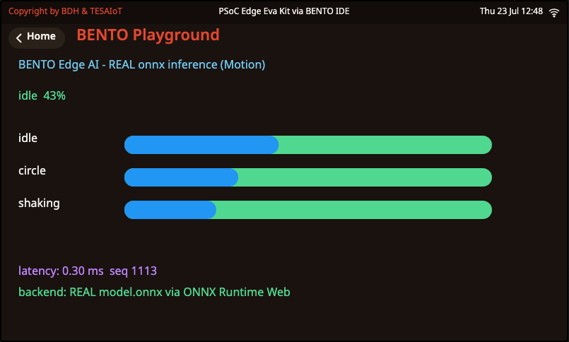

<style>
section { font-size: 24px; padding: 40px 52px; justify-content: flex-start; }
section h1 { font-size: 1.45em; line-height: 1.12; margin: 0 0 .22em; }
section h2 { font-size: 1.12em; margin: .15em 0; }
section h3 { font-size: 1.0em; margin: .12em 0; }
section p, section li { margin: .16em 0; line-height: 1.32; }
section img { max-width: 100%; height: auto; }
section svg { max-height: 250px; }
section table { font-size: .78em; }
section pre { font-size: .70em; line-height: 1.32; background:#0d1117; color:#e6edf3; border:1px solid #30363d; border-radius:8px; padding:12px 16px; box-shadow:0 2px 8px rgba(0,0,0,.25); }
section pre code { white-space: pre-wrap; background:transparent; color:inherit; } section pre .hljs-comment{color:#8b949e;font-style:italic} section pre .hljs-keyword,section pre .hljs-built_in,section pre .hljs-literal{color:#ff7b72} section pre .hljs-string{color:#a5d6ff} section pre .hljs-number{color:#79c0ff} section pre .hljs-title,section pre .hljs-title.function_,section pre .hljs-section{color:#d2a8ff} section pre .hljs-meta{color:#ffa657} section pre .hljs-attr,section pre .hljs-attribute,section pre .hljs-name{color:#7ee787}
section blockquote { margin: .25em 0; font-size: .92em; }
/* two images on a line (parity / 2x2 grids) stay side-by-side and small */
section p > img + img { margin-left: 10px; }
/* scroll-within-slide: dense slides scroll instead of clipping */
section { overflow-y: auto; overflow-x: hidden; }
section::-webkit-scrollbar { width: 11px; }
section::-webkit-scrollbar-thumb { background:#4a90d9; border-radius:6px; }
section::-webkit-scrollbar-track { background:rgba(0,0,0,.06); }
/* image drop-shadow + cover-slide readability (auto) */
section img{filter:drop-shadow(0 3px 12px rgba(0,0,0,.5))}
section.cover *{color:#fff !important}
section.cover h1,section.cover h2,section.cover h3,section.cover p,section.cover li,section.cover strong,section.cover em,section.cover blockquote,section.cover div{text-shadow:0 2px 9px rgba(0,0,0,.92),0 0 3px rgba(0,0,0,.8)}
section.cover div[style*="background:#"],section.cover div[style*="background: #"]{background:rgba(10,14,20,.66) !important;border-color:rgba(120,200,255,.45) !important;max-width:62%}
section.cover blockquote{border-left:4px solid rgba(120,200,255,.6) !important;background:rgba(13,17,23,.55) !important;border-radius:6px;padding:.3em .6em}
section.cover h1,section.cover h2,section.cover h3,section.cover p,section.cover blockquote{max-width:60%}
section.cover div:not(:has(img)){max-width:62%}
section.cover img{filter:none}
</style>

<!-- _class: cover -->
<!-- _backgroundColor: #0d1117 -->

# บทเรียน 5.9 — ลงมือทำ: เทียบสามเป้าหมาย MCU, Web และ PC

## Training IV: quantize → NPU · เอาโมเดลของเราขึ้น Ethos-U55 ด้วย Vela แล้วเทียบสามเป้าหมาย

**โมดูล 5 — ฝึกโมเดลและนำไปใช้หลายเป้าหมาย**

> ต่อจากบทเรียน 5.8 — quantize และ Vela: เอาโมเดลของเราขึ้น Ethos-U55

---

# โครงของไฟล์ s14_tflite_board.py

ทั้งไฟล์อ่านเป็นประโยคเดียว: **"bench int8 บน PC เป็น ground truth → รัน Vela ได้ไฟล์ MCU → เอาเลขมาวางเทียบสามเป้าหมาย → ชี้ทางไปอ่าน latency จริงบนบอร์ด"**

<div style="text-align:center;margin:6px 0">
<svg width="900" height="170" viewBox="0 0 900 170" font-family="DejaVu Sans, sans-serif">
  <defs>
    <marker id="arS14" markerUnits="userSpaceOnUse" markerWidth="12" markerHeight="10" refX="10" refY="4" orient="auto"><path d="M0,0 L10,4 L0,8 Z" fill="#607d8b"/></marker>
  </defs>
  <g font-size="13" text-anchor="middle">
    <rect x="14" y="50" width="180" height="60" rx="10" fill="#cfd8dc" stroke="#607d8b" stroke-width="2"/>
    <text x="104" y="76" font-weight="700" fill="#455a64">load test set</text>
    <text x="104" y="96" font-size="10" fill="#999">split เดียวกับ eval_pc</text>
    <rect x="234" y="50" width="180" height="60" rx="10" fill="#e3f2fd" stroke="#1565c0" stroke-width="2"/>
    <text x="324" y="76" font-weight="700" fill="#1565c0">bench_int8</text>
    <text x="324" y="96" font-size="10" fill="#999">acc + latency (PC)</text>
    <rect x="454" y="50" width="180" height="60" rx="10" fill="#fff3e0" stroke="#ef6c00" stroke-width="2"/>
    <text x="544" y="76" font-weight="700" fill="#e65100">run_vela</text>
    <text x="544" y="96" font-size="10" fill="#999">_vela.tflite (MCU)</text>
    <rect x="674" y="50" width="200" height="60" rx="10" fill="#e8f5e9" stroke="#2e7d32" stroke-width="2"/>
    <text x="774" y="76" font-weight="700" fill="#2e7d32">print_table</text>
    <text x="774" y="96" font-size="10" fill="#999">MCU vs Web vs PC</text>
  </g>
  <line x1="194" y1="80" x2="232" y2="80" stroke="#607d8b" stroke-width="2.4" marker-end="url(#arS14)"/>
  <line x1="414" y1="80" x2="452" y2="80" stroke="#607d8b" stroke-width="2.4" marker-end="url(#arS14)"/>
  <line x1="634" y1="80" x2="672" y2="80" stroke="#607d8b" stroke-width="2.4" marker-end="url(#arS14)"/>
  <text x="450" y="140" font-size="11" fill="#888" text-anchor="middle">ช่อง MCU เติมทีหลังด้วย --mcu-ms จาก edge_ai.latency() บนบอร์ด</text>
</svg>
</div>

> ตัวเลข MCU ไม่ได้อยู่ในสคริปต์เพราะ PC ไม่มี NPU — นี่คือรอยต่อที่พาเราออกจาก Python ไป MicroPython บนบอร์ดจริง

---

# ไล่โค้ด (1) — bench int8 เป็น ground truth

หัวใจข้อแรก: รันไฟล์ int8 บน PC วัด accuracy + latency ตัวเลขนี้คือ ground truth ที่ NPU ต้องได้ตรง

```python
def bench_int8(model_path, X, y, z):
    it = Interpreter(model_path=model_path); it.allocate_tensors()
    inp, out = it.get_input_details()[0], it.get_output_details()[0]
    in_scale, in_zero = inp["quantization"]
    out_scale, out_zero = out["quantization"]
    correct, total_ms = 0, 0.0
    for i in range(len(X)):
        x = (X[i:i+1] - z["mean"]) / z["std"]                 # เติม 1 · normalize
        q = np.clip(np.round(x/in_scale + in_zero), -128, 127).astype(np.int8)  # เติม 2
        it.set_tensor(inp["index"], q)
        t0 = time.perf_counter(); it.invoke()                 # เติม 3 · จับเวลาอนุมาน
        total_ms += (time.perf_counter() - t0) * 1000.0
        o = (it.get_tensor(out["index"])[0].astype(np.float32) - out_zero) * out_scale
        correct += int(o.argmax() == y[i])                    # เติม 4 · นับคลาสถูก
    return correct/len(X), total_ms/len(X)
```

> `in_scale/in_zero` อ่านมาจากตัวโมเดล **ไม่ใช่เดา** — เพราะ PTQ ฝังคู่ scale/zero ไว้ในทุก tensor แล้ว เราแค่หยิบมาใช้ให้ตรง

---

# ไล่โค้ด (2) — run_vela: ขั้นพิเศษของ MCU

หัวใจข้อห้า: เรียก [`quantize_vela.sh`](https://github.com/tesaiot/tesa-qualification-program/blob/main/courses/edge-ai-developer/shared/training/quantize_vela.sh) ให้ Vela คอมไพล์ int8 → ไฟล์ที่บอร์ดรันได้

```python
def run_vela(int8_path):
    try:
        # เติม 5: subprocess.run(["./quantize_vela.sh", int8_path], check=True)
        subprocess.run(["./quantize_vela.sh", int8_path], check=True)
    except (subprocess.CalledProcessError, FileNotFoundError):
        print("ยังไม่มี vela ในเครื่องนี้ (อยู่ใน Docker image ของ บทเรียน 5.3–5.5) — ข้ามไปก่อนได้")
        return None
    base = os.path.splitext(os.path.basename(int8_path))[0]
    out = os.path.join("output", base + "_vela.tflite")
    return out if os.path.exists(out) else None
```

- ห่อด้วย `try/except` เพราะ `vela` อาจไม่ได้ลงในเครื่องนี้ (มันอยู่ใน Docker) — สคริปต์ต้องไม่ตายทั้งตัวเพราะขั้นเดียวขาด
- `check=True` = ถ้า vela คืน exit code ผิด ให้โยน error ขึ้นมา ไม่กลืนเงียบ

> นี่คือ **ขั้นเดียวในทั้งคอร์ส** ที่ MCU ต้องทำต่างจากคนอื่น — จำภาพนี้ไว้ เว็บ/PC/Cortex-A ข้ามขั้นนี้ทั้งหมด

---

# ไล่โค้ด (3) — print_table: เทียบด้วยเลขจริง

หัวใจข้อสุดท้าย: เอา accuracy กับ latency มาวางเทียบสามเป้าหมายในตารางเดียว

```python
def print_table(pc_acc, pc_ms, mcu_ms):
    mcu_lat = "%.2f" % mcu_ms if mcu_ms is not None else "อ่านจากบอร์ด"
    print("PC/Docker  | model_int8.tflite     | %.3f | %.2f ms | ground truth" % (pc_acc, pc_ms))
    print("MCU + NPU  | model_int8_vela.tflite| %.3f | %s ms | Vela + Ethos-U55" % (pc_acc, mcu_lat))
    print("Web        | model_web.tflite      | ~%.3f | (เบราว์เซอร์) | float I/O" % pc_acc)
```

- ตารางใส่ accuracy ของ MCU เป็น `pc_acc` ไว้ก่อน (Vela ไม่แก้คณิต) แล้วยืนยันด้วย verdict จริงบนบอร์ด
- ช่อง latency ของ MCU เว้นไว้ว่า "อ่านจากบอร์ด" จนกว่าจะรันจริงแล้วส่ง `--mcu-ms` เข้ามา

> ตารางนี้แหละคือ **ชัยชนะที่วัดได้** ของชุดบทเรียน — ไม่ใช่แค่ "รันได้" แต่ตอบได้ว่าแต่ละเป้าหมายเร็ว/แม่น/ประหยัดต่างกันแค่ไหน

---

# รอยต่อ Python → MPY

ตัวเลข MCU มาจากไหน? จาก MicroPython บนบอร์ดจริง — พอ wrap โมเดลเสร็จ มันโผล่ใน `edge_ai.models()` แล้วเราอ่าน latency ได้แบบเดียวกับโมเดลอื่น:

```python
import edge_ai, time
for m in edge_ai.models():
    print(m['index'], m['name'])       # โมเดล gesture ของเราโผล่เป็นชื่อใหม่
edge_ai.select(N)                      # N = index ที่เจอ
time.sleep_ms(500)
r = edge_ai.result()
print("บน NPU:", r['label'], r['latency_ms'], "ms")   # <- เลขนี้ไปเติมช่อง MCU
```

- นี่คือ `edge_ai` ตัวเดียวกับที่เราใช้ตั้งแต่ **บทเรียน 1.1–1.3** — วันนี้ต่างแค่โมเดลในทะเบียนเป็นของเราเอง
- `r['latency_ms']` คือเวลาที่ NPU ใช้อนุมานจริง เอาไปเทียบกับ `pc_ms` ในตารางได้เลย

> คอร์สนี้เดินจาก "เรียก `edge_ai` ที่คนอื่นเตรียมไว้" (บทเรียน 1.1–1.3) มาถึง "ใส่โมเดลของเราเข้าไปใน `edge_ai` เอง" (บทเรียน 5.8–5.9) — วงกลมปิดครบตรงนี้

---

# ก่อนลงมือ — ดูปลายทางบนจอ emulator

ก่อนพาโมเดลขึ้นบอร์ดจริง ลองดูหน้าตาที่เราเล็งไว้บน **BENTO Edge AI Emulator** — จอ emulator ที่รันได้จริงในเบราว์เซอร์ ให้เห็น verdict + latency แบบเดียวกับบนบอร์ด โดยยังไม่ต้องเสียบสาย

<div style="text-align:center;margin:8px 0">



</div>

<div style="text-align:center;font-size:.9em;color:#607d8b;margin-top:4px">
จอ emulator ที่รันได้จริง (BENTO Edge AI Emulator) — ใช้ลองไล่ pipeline ก่อนพาโมเดลขึ้นบอร์ด NPU จริง
</div>

> emulator ช่วยให้ทุกคนเห็นภาพเดียวกันได้พร้อมกันโดยไม่ต้องมีบอร์ดครบทุกคน แต่จำไว้ว่า **เลข latency ของ MCU ต้องมาจากบอร์ดจริงเท่านั้น** — emulator ไม่มี NPU ให้จับเวลาแทนได้

---

# ลงมือ (1) — bench + Vela บน PC/Docker

เริ่มจากฝั่งที่ไม่ต้องมีบอร์ดก่อน เปิดเทอร์มินัลใน [`shared/training/`](https://github.com/tesaiot/tesa-qualification-program/blob/main/courses/edge-ai-developer/shared/training):

1. `pip install ai-edge-litert numpy` (หรือเข้า Docker image ของ บทเรียน 5.3–5.5 ที่มีครบ + มี `vela`)
2. รัน `python s14_tflite_board.py` — จะเห็น accuracy + latency ของ int8 บน PC
3. ถ้ามี `vela` สคริปต์จะรัน Vela ต่อให้ ได้ `output/model_int8_vela.tflite`
4. ดูตารางเทียบเป้าหมาย — ช่อง MCU ยังเว้นไว้ "อ่านจากบอร์ด"

> ถ้าเครื่องไม่มี `vela` ก็ไม่เป็นไร รันในเทอร์มินัลของ Docker image บทเรียน 5.3–5.5 ได้ (`vela` ลงไว้ในนั้นแล้ว) — สคริปต์จะไม่ตายเพราะเราห่อ `try/except` ไว้

---

# ลงมือ (2) — wrap + flash ลงบอร์ด

ต่อไปพาโมเดลขึ้นบอร์ดจริง (สาย researcher — ต้องแก้และ build เฟิร์มแวร์เอง):

1. wrap `output/model_int8_vela.tflite` เป็น `AIM_GESTURE_*` (Path A DEEPCRAFT converter ง่ายสุด)
2. ทำ 3 edits: เพิ่ม `gesture` ใน `AI_MODELS` · เพิ่ม `GESTURE_ROW` ใน `s_models[]` · วางไฟล์โมเดล
3. `rm -rf proj_cm55/build; make program EDGE_AI_MODEL=combo` (ถ้าใช้ SDK สาธารณะ ข้อ 2 เปลี่ยนเป็นเรียก `ai_engine_register()` จากโค้ดของเรา เพราะ `ai_engine.c` อยู่ในไลบรารี prebuilt)
4. **hard power-cycle** บอร์ด (ถอดเสียบไฟ) — อย่าเชื่อผลก่อน power-cycle

> ข้อ 4 ไม่ใช่พิธีกรรม — หลัง flash เซนเซอร์/NPU ต้อง init ใหม่จากไฟจริง ไม่งั้นผลที่อ่านได้อาจเป็นของรอบก่อน นี่คือนิสัย embedded ที่คอร์สย้ำตลอด

---

# ลงมือ (3) — อ่าน latency จริง เติมตาราง

บนบอร์ด (BENTO IDE, REPL) รัน MPY สั้นๆ เพื่อดึงเลข MCU:

1. `edge_ai.models()` — ยืนยันว่าโมเดล gesture ของเราโผล่ (นับจำนวนโมเดลเพิ่มขึ้น)
2. `edge_ai.select(N)` เลือกโมเดลเรา แล้วทำท่า idle/circle/shaking
3. อ่าน `edge_ai.result()` — ดู `label` ถูกไหม + จด `latency_ms`
4. กลับไป PC: `python s14_tflite_board.py --mcu-ms <ค่าที่จด>` → ตารางเติมช่อง MCU ครบ

```python
r = edge_ai.result()
print(r['label'], r['conf'], r['latency_ms'])   # เช่น shaking 0.94 3.9
```

> เมื่อ `label` บนบอร์ดตรงกับคลาสจริง และ accuracy ตรงกับ PC — แปลว่า front-end บนบอร์ด feed ถูก parity ครบสามเป้าหมาย นี่คือ MVP ของบทเรียน 5.8–5.9

---

# ลงมือทำ — เติมช่องว่างทั้ง 5 จุด

เปิด [`s14_tflite_board.py`](https://github.com/tesaiot/tesa-qualification-program/blob/main/courses/edge-ai-developer/m05-training/l09-three-targets-lab/practice/s14_tflite_board.py) มี `pass`/placeholder วางไว้ **5 จุด** ตรงหัวใจของ pipeline:

| # | จุด | เติมด้วย | ถ้าลืม |
|---|---|---|---|
| 1 | `bench_int8` | `x = (X[i:i+1] - z["mean"]) / z["std"]` | accuracy เพี้ยน (front-end ผิด) |
| 2 | `bench_int8` | `q = np.clip(np.round(x/in_scale+in_zero),-128,127)...` | โมเดลเห็น input มั่ว |
| 3 | `bench_int8` | จับเวลา `t0=perf_counter(); invoke(); total_ms+=...` | latency = 0 ตลอด |
| 4 | `bench_int8` | `correct += int(o.argmax() == y[i])` | accuracy = 0 เสมอ |
| 5 | `run_vela` | `subprocess.run(["./quantize_vela.sh", int8_path], check=True)` | ไม่มีไฟล์ _vela |

ขั้นตอน: ไล่หา `# เติม:` ทีละจุด แทน placeholder → `python s14_tflite_board.py` → ดูตาราง ถ้า accuracy ดูแปลก กลับไปเช็กช่อง 1/2 ก่อน (front-end คือจุดพังบ่อยสุด)

> ห้าช่องนี้คือสอง verb หลักของชุดบทเรียน: **quantize ให้ถูก** (1-2) และ **วัดให้เป็น** (3-4) บวกขั้นพิเศษของ MCU (5)

---

# แหล่งเรียนรู้เพิ่มเติม

อยากเข้าใจ quantization / NPU / Vela ให้ลึกกว่านี้ ลองตามลิงก์เหล่านี้ต่อ (เปิดดูได้ตามสะดวก):

**วิดีโอ/เอกสารสอน (ของฟรี คุณภาพดี)**

- int8 post-training quantization อธิบายทีละขั้น — TensorFlow (official docs): https://www.tensorflow.org/lite/performance/post_training_quantization
- สัญชาตญาณคณิตของ neural network (พื้นฐาน quantize ต่อยอดจากตรงนี้) — 3Blue1Brown: https://www.youtube.com/@3blue1brown
- Neural network / model compression เล่าเข้าใจง่าย — StatQuest with Josh Starmer: https://www.youtube.com/@statquest

**ภาพ/เอกสารอ้างอิง**

- Quantization (signal processing) — บทความ + ภาพประกอบ quantization error: https://en.wikipedia.org/wiki/Quantization_(signal_processing) (ที่มา: Wikipedia / Wikimedia Commons, CC BY-SA)
- Arm Ethos-U55 microNPU + ethos-u-vela compiler — สเปกและตัวคอมไพเลอร์ที่เราใช้วันนี้: https://developer.arm.com/Processors/Ethos-U55 · https://pypi.org/project/ethos-u-vela/ (ที่มา: Arm Developer และแพ็กเกจ ethos-u-vela ทางการบน PyPI)

> วิดีโอ/ภาพภายนอกเป็นของเจ้าของต้นฉบับ ใช้เพื่อการศึกษา อ้างอิงลิงก์ต้นทาง — เราลิงก์ไปหา ไม่ได้ฝังหรือดัดแปลง

---

# ชัยชนะที่เห็นได้ + MVP ของชุดบทเรียนนี้

<div style="text-align:center;margin:14px 0">
<div style="display:inline-block;background:#e8f5e9;border:2px solid #2e7d32;border-radius:22px;padding:10px 22px;color:#2e7d32;font-weight:700;font-size:1.05em">
ชัยชนะที่เห็นได้ · โมเดลที่เราเทรนเองรันบน NPU จริง โผล่ใน edge_ai.models() พร้อมตารางเทียบ MCU vs Web vs PC ด้วยเลขจริง
</div>
</div>

**MVP ของบทเรียน 5.8–5.9 (เกณฑ์ผ่านของชุดบทเรียน):** คุณทำโมเดลของตัวเองผ่าน [`quantize_vela.sh`](https://github.com/tesaiot/tesa-qualification-program/blob/main/courses/edge-ai-developer/shared/training/quantize_vela.sh) → wrap → รันบนบอร์ดผ่าน `edge_ai` ได้ verdict ที่คลาสถูก แล้ว **เทียบสามเป้าหมาย** (accuracy ตรง · latency ต่างกันอย่างมีเหตุผล)

- ทำจริงบน **บอร์ด** (สาย MCU ต้องมีบอร์ด); ฝั่ง bench int8/Web ทำบน **PC/Docker** ได้
- อธิบายได้ว่าทำไม accuracy สามเป้าหมายตรงกัน แต่ latency ต่าง และทำไม MCU ต้อง Vela

> "เทียบเป้าหมาย" ไม่ใช่แค่กรอกตัวเลข — ต้องตอบได้ว่างานแบบไหนควรอยู่เป้าหมายไหน และแลกอะไรกับอะไร

---

# บันไดช่วยเหลือ — ใบ้ → เริ่มจากโครง → เฉลย → ฉบับเต็ม

ถ้าติด ให้ไต่บันไดนี้ทีละขั้น อย่าเพิ่งกระโดดไปดูเฉลย เพราะของจะเข้าหัวตอนที่คุณพยายามเองก่อน:

- **ใบ้** — คำใบ้อยู่ในคอมเมนต์ `# เติม:` ทั้ง 5 จุดในไฟล์ฝึก + ตารางหน้าที่แล้ว บอกว่าแต่ละช่องเติมอะไร
- **เริ่มจากโครง** — [`s14_tflite_board.py`](https://github.com/tesaiot/tesa-qualification-program/blob/main/courses/edge-ai-developer/m05-training/l09-three-targets-lab/practice/s14_tflite_board.py) มีโครงครบทั้งไฟล์แล้ว เหลือ 5 จุดให้เติม
- **เฉลย** — [`s14_tflite_board.py`](https://github.com/tesaiot/tesa-qualification-program/blob/main/courses/edge-ai-developer/m05-training/l09-three-targets-lab/solution/s14_tflite_board.py) เติมครบพร้อมคอมเมนต์อธิบายทุกช่อง (อ่านให้เข้าใจ ปิดไฟล์ แล้วพิมพ์เอง)
- **ฉบับเต็ม** — [`s14_tflite_board_full.py`](https://github.com/tesaiot/tesa-qualification-program/blob/main/courses/edge-ai-developer/m05-training/l09-three-targets-lab/examples/s14_tflite_board_full.py) ฉบับขัดเรียบร้อย เพิ่ม bench เส้นทาง Web + คอลัมน์ power + `--show-mpy`

> ลองเขียนเองให้สุดก่อนนะ ถ้าติดจริงๆ ค่อยเปิดเฉลยดูทีละช่อง แล้วกลับมาพิมพ์เอง — เดี๋ยวเราค่อย ๆ แกะไปด้วยกัน

---

# เชื่อมโยงรากฐาน — วันนี้เราแตะอะไรไปบ้าง

การพาโมเดลขึ้น NPU รวบยอดหลายชั้นของทั้งคอร์สมาไว้ในชุดบทเรียนเดียว:

**ฝั่ง Edge AI / การ deploy**
- **int8 PTQ** — quantize ด้วย scale/zero ที่โมเดลฝังไว้ (ต่อจาก บทเรียน 5.3–5.5)
- **Vela / custom op** — คอมไพเลอร์แปลกราฟให้ NPU เร่งได้ โดยไม่แก้คณิต
- **สัญญา `AIM_*`** — 4 ฟังก์ชันที่ทำให้ `edge_ai` รันโมเดลอะไรก็ได้ (registry shape-driven)
- **เทียบเป้าหมาย** — latency/accuracy/power คือการตัดสินใจเชิงวิศวกรรมจริง

**ฝั่ง parity / วิธีทำงาน**
- **feature parity** — front-end ต้องตรงทุกเป้าหมาย ไม่งั้น accuracy เพี้ยน (ต่อจาก บทเรียน 5.6–5.7)
- **วัด ไม่เดา** — ground truth บน PC, latency จริงจากบอร์ด, ยอมรับ tolerance
- **Python → MPY** — จากสคริปต์ฝึกบน PC สู่ `edge_ai` บนบอร์ดจริง

> ทั้งหมดนี้ปิดวง Pillar 4: จากข้อมูลดิบ (บทเรียน 5.1–5.2) → เทรน (บทเรียน 5.3–5.5) → เว็บ (บทเรียน 5.6–5.7) → บนชิป (บทเรียน 5.8–5.9) โมเดลของเราเดินครบทุกเป้าหมายแล้ว

---

# ใช้จริงที่ไหน — "โมเดลตัวนี้ควรอยู่ที่ไหน"

การเลือกเป้าหมายไม่ใช่เรื่องวิชาการ มันคือการตัดสินใจที่สินค้าจริงต้องตอบทุกวัน:

<div style="text-align:center;margin:6px 0">
<svg width="880" height="210" viewBox="0 0 880 210" font-family="DejaVu Sans, sans-serif">
  <rect x="12" y="10" width="420" height="92" rx="10" fill="#e3f2fd" stroke="#1565c0" stroke-width="2"/>
  <text x="28" y="34" font-size="13" font-weight="700" fill="#1565c0">เลือก MCU + NPU เมื่อ...</text>
  <text x="28" y="56" font-size="11" fill="#555">ต้องใส่แบตอยู่ได้เป็นเดือน · ตอบทันทีเสมอ</text>
  <text x="28" y="76" font-size="11" fill="#555">ผลิตจำนวนมากที่ต้นทุนต่อชิ้นต่ำ</text>
  <text x="28" y="94" font-size="11" fill="#888">นาฬิกา · แท็ก · เซนเซอร์ไร้สาย</text>
  <rect x="448" y="10" width="420" height="92" rx="10" fill="#e8f5e9" stroke="#2e7d32" stroke-width="2"/>
  <text x="464" y="34" font-size="13" font-weight="700" fill="#2e7d32">เลือก Web เมื่อ...</text>
  <text x="464" y="56" font-size="11" fill="#555">อยากให้ใครก็เปิดลองได้ ไม่ต้องลงแอป</text>
  <text x="464" y="76" font-size="11" fill="#555">เดโม/สอน/prototype ที่ไม่ซีเรียส latency</text>
  <text x="464" y="94" font-size="11" fill="#888">BENTO Emulator · หน้าเดโมในเบราว์เซอร์</text>
  <rect x="12" y="112" width="420" height="90" rx="10" fill="#fff3e0" stroke="#ef6c00" stroke-width="2"/>
  <text x="28" y="136" font-size="13" font-weight="700" fill="#e65100">เลือก Cortex-A เมื่อ...</text>
  <text x="28" y="158" font-size="11" fill="#555">โมเดลใหญ่เกิน MCU · ต้องยืดหยุ่นอัปเดตบ่อย</text>
  <text x="28" y="178" font-size="11" fill="#555">มีไฟเลี้ยงพอ (ไม่ใช้แบต) เช่นเกตเวย์</text>
  <text x="28" y="196" font-size="11" fill="#888">RPi · Jetson · NUC ที่หน้างาน</text>
  <rect x="448" y="112" width="420" height="90" rx="10" fill="#f3e5f5" stroke="#6a1b9a" stroke-width="2"/>
  <text x="464" y="136" font-size="13" font-weight="700" fill="#6a1b9a">ตัวช่วยตัดสินใจ</text>
  <text x="464" y="158" font-size="11" fill="#555">ตารางเทียบของวันนี้ = หลักฐานตัวเลขจริง</text>
  <text x="464" y="178" font-size="11" fill="#555">latency ต้องเท่าไร? power budget เท่าไร?</text>
  <text x="464" y="196" font-size="11" fill="#888">ตอบด้วยการวัด ไม่ใช่ความรู้สึก</text>
</svg>
</div>

> เพราะ `.tflite` ไฟล์เดียวรันได้ทุกที่ เราจึง "เลื่อนการตัดสินใจ" ได้จนมีข้อมูลจริง — เทรนครั้งเดียว แล้ววัดว่าอยู่ที่ไหนดีที่สุด นี่คือพลังของ train once, run everywhere

---

# งานทำเอง + สรุปบทเรียน

**งานทำเอง (ท้ายบทเรียน):**

1. เติม [`s14_tflite_board.py`](https://github.com/tesaiot/tesa-qualification-program/blob/main/courses/edge-ai-developer/m05-training/l09-three-targets-lab/practice/s14_tflite_board.py) ให้ครบ 5 ช่อง รัน bench int8 บน PC ได้ accuracy + latency จริง
2. รัน [`quantize_vela.sh`](https://github.com/tesaiot/tesa-qualification-program/blob/main/courses/edge-ai-developer/shared/training/quantize_vela.sh) (ใน Docker บทเรียน 5.3–5.5) ให้ได้ `output/model_int8_vela.tflite` แล้วจดขนาดไฟล์เทียบกับ int8 เดิม
3. (สาย MCU) wrap + flash + อ่าน `edge_ai.latency()` บนบอร์ด เอามาเติมช่อง MCU ด้วย `--mcu-ms` แล้วอธิบายว่าทำไม NPU เร็วกว่า PC

ใบ้ข้อ 3 — ถ้า accuracy บนบอร์ดไม่ตรง PC อย่าโทษ Vela ก่อน ให้ไล่ front-end (normalize/quantize) ที่ feed บนบอร์ดว่าตรงกับตอนเทรนไหม

**วันนี้เราได้:** เข้าใจว่าทำไม MCU ต้องมี Vela · quantize→Vela→wrap ด้วย `AIM_*` · รันโมเดลเราเองบน NPU ผ่าน `edge_ai` · เทียบสามเป้าหมายด้วยเลขจริง

> ชุดบทเรียนถัดไป (บทเรียน 6.1–6.2) เราเข้าบล็อก **Apps** — เอาโมเดล (ของโรงงานหรือของเราเอง) มาทำเป็นแอปจริงต่อ verdict หนึ่งตัว หนึ่งงาน เจอกันครับ
