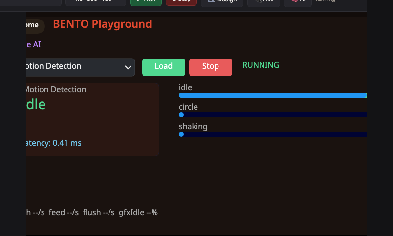

<style>
section { font-size: 24px; padding: 40px 52px; justify-content: flex-start; }
section h1 { font-size: 1.45em; line-height: 1.12; margin: 0 0 .22em; }
section h2 { font-size: 1.12em; margin: .15em 0; }
section h3 { font-size: 1.0em; margin: .12em 0; }
section p, section li { margin: .16em 0; line-height: 1.32; }
section img { max-width: 100%; height: auto; }
section svg { max-height: 250px; }
section table { font-size: .78em; }
section pre { font-size: .70em; line-height: 1.32; background:#0d1117; color:#e6edf3; border:1px solid #30363d; border-radius:8px; padding:12px 16px; box-shadow:0 2px 8px rgba(0,0,0,.25); }
section pre code { white-space: pre-wrap; background:transparent; color:inherit; } section pre .hljs-comment{color:#8b949e;font-style:italic} section pre .hljs-keyword,section pre .hljs-built_in,section pre .hljs-literal{color:#ff7b72} section pre .hljs-string{color:#a5d6ff} section pre .hljs-number{color:#79c0ff} section pre .hljs-title,section pre .hljs-title.function_,section pre .hljs-section{color:#d2a8ff} section pre .hljs-meta{color:#ffa657} section pre .hljs-attr,section pre .hljs-attribute,section pre .hljs-name{color:#7ee787}
section blockquote { margin: .25em 0; font-size: .92em; }
/* two images on a line (parity / 2x2 grids) stay side-by-side and small */
section p > img + img { margin-left: 10px; }
/* scroll-within-slide: dense slides scroll instead of clipping */
section { overflow-y: auto; overflow-x: hidden; }
section::-webkit-scrollbar { width: 11px; }
section::-webkit-scrollbar-thumb { background:#4a90d9; border-radius:6px; }
section::-webkit-scrollbar-track { background:rgba(0,0,0,.06); }
/* image drop-shadow + cover-slide readability (auto) */
section img{filter:drop-shadow(0 3px 12px rgba(0,0,0,.5))}
section.cover *{color:#fff !important}
section.cover h1,section.cover h2,section.cover h3,section.cover p,section.cover li,section.cover strong,section.cover em,section.cover blockquote,section.cover div{text-shadow:0 2px 9px rgba(0,0,0,.92),0 0 3px rgba(0,0,0,.8)}
section.cover div[style*="background:#"],section.cover div[style*="background: #"]{background:rgba(10,14,20,.66) !important;border-color:rgba(120,200,255,.45) !important;max-width:62%}
section.cover blockquote{border-left:4px solid rgba(120,200,255,.6) !important;background:rgba(13,17,23,.55) !important;border-radius:6px;padding:.3em .6em}
section.cover h1,section.cover h2,section.cover h3,section.cover p,section.cover blockquote{max-width:60%}
section.cover div:not(:has(img)){max-width:62%}
section.cover img{filter:none}
</style>

<!-- _class: cover -->
<!-- _backgroundColor: #0d1117 -->

# บทเรียน 7.2 — ลงมือทำ: ส่องสแตกจาก MicroPython

## แกะสแตก Edge AI ใต้ฝากระโปรง · tri-core · ai_engine · IPC model link · TFLite-Micro

**โมดูล 7 — ใต้ฝากระโปรงและการต่อเติม**

> ต่อจากบทเรียน 7.1 — สแตก Edge AI: tri-core, ai_engine, IPC model link และ TFLite-Micro

---

# โครงของสคริปต์ส่องสแตก

ไฟล์ [`s18_under_the_hood.py`](https://github.com/tesaiot/tesa-qualification-program/blob/main/courses/edge-ai-developer/m07-under-the-hood/l02-trace-the-stack-lab/practice/s18_under_the_hood.py) ไม่ได้อนุมานอะไรใหม่ มันเป็น **เครื่องมือส่อง** ที่เรียก API ฝั่งอ่าน แล้ว log ทีละชั้น:

<div style="text-align:center;margin:6px 0">
<svg width="900" height="150" viewBox="0 0 900 150" font-family="DejaVu Sans, sans-serif">
  <defs>
    <marker id="arSk8" markerUnits="userSpaceOnUse" markerWidth="12" markerHeight="10" refX="10" refY="4" orient="auto"><path d="M0,0 L10,4 L0,8 Z" fill="#607d8b"/></marker>
  </defs>
  <rect x="20" y="50" width="200" height="56" rx="10" fill="#e8f5e9" stroke="#2e7d32" stroke-width="2"/>
  <text x="120" y="74" font-size="12" font-weight="700" fill="#2e7d32" text-anchor="middle">0 · transport</text>
  <text x="120" y="94" font-size="11" fill="#666" text-anchor="middle">links()</text>
  <rect x="248" y="50" width="200" height="56" rx="10" fill="#e3f2fd" stroke="#1565c0" stroke-width="2"/>
  <text x="348" y="74" font-size="12" font-weight="700" fill="#1565c0" text-anchor="middle">1 · registry</text>
  <text x="348" y="94" font-size="11" fill="#666" text-anchor="middle">count/models/model</text>
  <rect x="476" y="50" width="200" height="56" rx="10" fill="#fff3e0" stroke="#ef6c00" stroke-width="2"/>
  <text x="576" y="74" font-size="12" font-weight="700" fill="#e65100" text-anchor="middle">2 · control</text>
  <text x="576" y="94" font-size="11" fill="#666" text-anchor="middle">select → active</text>
  <rect x="704" y="50" width="176" height="56" rx="10" fill="#f3e5f5" stroke="#6a1b9a" stroke-width="2"/>
  <text x="792" y="74" font-size="12" font-weight="700" fill="#6a1b9a" text-anchor="middle">3 · result</text>
  <text x="792" y="94" font-size="11" fill="#666" text-anchor="middle">result → latency</text>
  <line x1="220" y1="78" x2="246" y2="78" stroke="#607d8b" stroke-width="2.4" marker-end="url(#arSk8)"/>
  <line x1="448" y1="78" x2="474" y2="78" stroke="#607d8b" stroke-width="2.4" marker-end="url(#arSk8)"/>
  <line x1="676" y1="78" x2="702" y2="78" stroke="#607d8b" stroke-width="2.4" marker-end="url(#arSk8)"/>
  <text x="450" y="30" font-size="12" fill="#455a64" text-anchor="middle">แต่ละชั้น = คำสั่งฝั่งอ่านหนึ่งตัว + log ว่าปลายทางฝั่ง C คือไฟล์ไหน</text>
</svg>
</div>

- โครงเหมือนแอปทุกบทเรียน: import → สร้าง widget ครั้งเดียว → ลูป → `ui.poll`
- แต่ในลูปเราไม่ได้วาดกราฟสวยๆ เราวาด **log สแตก** ให้เห็นว่าค่าที่ได้มาจากชั้นไหน

> อ่านโค้ดแล้วถามตัวเองทุกบรรทัด: "ค่านี้ข้ามคอร์มาจากไหน?" — นั่นคือสกิล Researcher ที่ชุดบทเรียนนี้ฝึก

---

# ลงมือ (1) — รันบน BENTO Emulator

ไม่มีบอร์ดก็ฝึกเรียก API ฝั่งอ่านได้ (Emulator เลียนแบบ API ชุดเดียวกัน แต่ไม่มี IPC จริงในเบราว์เซอร์):

1. เปิด **ide.tesaiot.dev** (BENTO Emulator) พร้อมเปิด [`ai_engine.h`](https://github.com/tesaiot/tesaiot-pse84-devkit-sdk/blob/main/bento-firmware-template-mtb-mpy/lib/edge_ai/include/ai_engine.h) กับ [`ipc_model_link_defs.h`](https://github.com/tesaiot/tesaiot-pse84-devkit-sdk/blob/main/bento-firmware-template-mtb-mpy/bento_libs/claw/common/shared/include/ipc_model_link_defs.h) คู่จอ
2. เปิดไฟล์ [`s18_under_the_hood.py`](https://github.com/tesaiot/tesa-qualification-program/blob/main/courses/edge-ai-developer/m07-under-the-hood/l02-trace-the-stack-lab/practice/s18_under_the_hood.py)
3. เติมช่องว่างทั้ง 5 จุด (`links`/`model`/`active`/`result`/`latency`) แล้วกด **Run**
4. เลือกโมเดล กด **Trace** แล้วอ่าน log สามชั้นที่ไล่ transport → control → result
5. เทียบทุกบรรทัด log กับหัวข้อในเอกสาร — ชี้ให้ได้ว่าค่านี้มาจากฟังก์ชันหรือฟิลด์ใดในสองไฟล์นั้น

> Emulator เหมาะกับการซ้อมที่บ้าน เพราะ API ฝั่งอ่านเหมือนบอร์ดจริง — สิ่งที่ต่างคือเซนเซอร์และผลโมเดลเป็นค่าจำลอง และไม่มี IPC ข้ามคอร์จริง ตัวเลข latency กับการยืนยัน select จึงต้องดูบนบอร์ด

---

# หน้าตา Emulator ที่เราจะรัน

<div style="text-align:center;margin:6px 0">



</div>

**จอ emulator ที่รันได้จริง — BENTO Edge AI Emulator บนเบราว์เซอร์ รันโค้ดชุดเดียวกับบอร์ด**

- หน้านี้คือ `page_edge_ai` ฉบับจำลอง วาด verdict + confidence bars เหมือนบนบอร์ดจริง
- API ฝั่งอ่านและทะเบียนโมเดลเลียนแบบบอร์ด แต่ผลโมเดลกับเซนเซอร์เป็นค่าจำลอง และไม่มี IPC จริง
- เปิดคู่กับ [`ai_engine.h`](https://github.com/tesaiot/tesaiot-pse84-devkit-sdk/blob/main/bento-firmware-template-mtb-mpy/lib/edge_ai/include/ai_engine.h) แล้วชี้ทีละชั้นได้เลยว่า log ไหนโผล่ตรงไหนบนจอ

> ก่อนลงมือ เราดูหน้าตาปลายทางก่อน จะได้รู้ว่า log สามชั้นที่เราจะ trace (transport → control → result) ไปโผล่ตรงไหน

---

# ลงมือ (2) — รันบนบอร์ด BENTO จริง

บนบอร์ดจริงเราส่องของจริง จะได้เห็น `latency` ที่ NPU ใช้จริง:

1. เสียบบอร์ดเข้าคอมด้วยสาย USB
2. เปิด [`s18_under_the_hood.py`](https://github.com/tesaiot/tesa-qualification-program/blob/main/courses/edge-ai-developer/m07-under-the-hood/l02-trace-the-stack-lab/practice/s18_under_the_hood.py) ใน **BENTO IDE** กด **Program to Device**
3. เลือกโมเดล int8 (เช่น Motion) กด Trace แล้วจดค่า `latency()`
4. สลับไปโมเดล float32 (เช่น Push/Siren) กด Trace อีกครั้ง เทียบ `latency()` — NPU vs CPU float
5. ลองกด `active()` ทันทีหลัง select ในใจ: มันตรงกับที่ขอไหม (confirm by observation ทำงาน)

> จุดที่ควรสังเกต: โมเดล int8 บน NPU มักเร็วกว่า float32 บน CPU float kernel อย่างเห็นได้ — นี่คือหลักฐานสดของบทเรียน "int8 → NPU" ที่เราเดินมาทั้งคอร์ส

---

# ไล่โค้ด (1) — transport: links()

**ช่องเติมที่ 1**: ถามว่า `edge_ai` คุยกับ CM55 ผ่านช่องไหน:

```python
# เติม: อ่านว่ามี link backend อะไรบ้าง -> links = edge_ai.links()
links = None
pass
lcd.console(' [0 transport] links() = %s -> IPC model link (deepcraft_task.c)'
            % (links,))
```

- แทน `pass` ด้วย `links = edge_ai.links()` — คืน tuple เช่น `('ipc',)`
- `('ipc',)` แปลว่าปลายทางฝั่ง CM55 คือ `deepcraft_task.c` — สะพานเดียวที่ Python คุยกับ `ai_engine`
- ถ้าลืมเติม: `links` เป็น `None` แล้ว log ชั้น transport ว่างเปล่า

> นี่คือชั้นล่างสุด รู้ก่อนว่า "คุยผ่านอะไร" แล้วค่อยไล่ขึ้นไปว่า "คุยเรื่องอะไร"

---

# ไล่โค้ด (2) — registry: model()

**ช่องเติมที่ 2**: ดึง descriptor ของโมเดลหนึ่งตัวมาส่อง:

```python
def show_descriptor(mi):
    # เติม: pull descriptor ของโมเดล index mi -> desc = edge_ai.model(mi)
    desc = None
    pass
    lcd.console(' [1 registry] model(%d): name=%s sensor=%s labels=%s'
                % (mi, desc['name'], SENSOR[desc['sensor']], desc['labels']))
```

- แทน `pass` ด้วย `desc = edge_ai.model(mi)` — map ไป `Q_MODEL` → `ai_engine_model(i)` บน CM55
- `model(n)` ดึงตัวเดียวเจาะๆ ต่างจาก `models()` ที่ดึงทั้งก้อน — เหมาะเวลาอยากดูโมเดลที่เลือก
- ทุกฟิลด์ (`name`/`sensor`/`labels`) มาจาก ROW macro ใน `ai_engine.c` ไม่ใช่ค่าที่ Python เดา

> เช็กว่า `sensor` เป็นเลข `0/1/2` แล้ว `SENSOR[...]` แปลงเป็น IMU/RADAR/MIC — ตรงกับ `ai_sensor_t` ฝั่ง C เป๊ะ

---

# ไล่โค้ด (3) — control: select + active()

**ช่องเติมที่ 3**: `select()` ให้ไว้แล้ว (ในตัวมัน poll `Q_ACTIVE` เอง) เราเติม `active()` เพื่อ **เห็น** ว่าสลับจริง:

```python
edge_ai.select(sel)          # ให้ไว้แล้ว: ส่ง SELECT(0x90+n) + รอยืนยัน
# เติม: อ่านว่า engine สลับไปโมเดลไหนแล้ว -> cur = edge_ai.active()
cur = -1
pass
active_lb.text("active(): %d" % cur)
lcd.console(' [2 control] active() = %d <- s_current @ai_engine.c' % cur)
```

- แทน `pass` ด้วย `cur = edge_ai.active()` — คืน `s_current` (โมเดลที่ **สลับจริง**)
- ถ้าทุกอย่างปกติ `cur` ต้องเท่ากับ `sel` ที่เพิ่งขอ — นี่คือ confirm-by-observation ที่เห็นกับตา
- อยู่ใน `try` เพราะ `select()` โยน `OSError` ได้ถ้าไม่ยืนยันใน 25×20 ms

> จำ gotcha: `active()` = `s_current` ไม่ใช่ `s_active` เอกสารภายในของเฟิร์มแวร์เตือนว่าอย่าเอา `active()` ไป guard ค่า default — ใช้ `requested()` แทน

---

# ไล่โค้ด (4) — result: result() + latency()

**ช่องเติมที่ 4 และ 5**: หัวใจ MVP วันนี้ อ่าน verdict แล้วดูเวลาอนุมาน:

```python
if running:
    # เติม: pull verdict ล่าสุด -> r = edge_ai.result()
    r = None
    pass
    if r and r['seq'] != last_seq:
        last_seq = r['seq']
        verdict.text(r['label'] or '-')
        conf.text("conf: %.0f %%" % (r['conf'] * 100))
        # เติม: อ่านเวลาอนุมานครั้งล่าสุด -> ms = edge_ai.latency()
        ms = 0.0
        pass
        lat.text("latency: %.2f ms" % ms)
```

- ช่อง 4: `r = edge_ai.result()` — map ไป `Q_RESULT` → `ai_result_t s_res` (publish lock-free)
- ช่อง 5: `ms = edge_ai.latency()` — map ไป `s_res.inference_us / 1000` เวลาที่ NPU ใช้จริง
- เช็ก `seq` ก่อนเสมอ วาด log เฉพาะตอนมี verdict ใหม่ (เหมือนหน้าจอ 30 Hz ทำ)

> `r['seq']` ที่เราเช็กทุกบทเรียน จริงๆ คือ `s_res.seq` ที่ `publish()` เพิ่มขึ้นทุก verdict — วันนี้เรารู้แล้วว่ามันมาจากไหน

---

# ลงมือทำ — เติมช่องว่างทั้ง 5 จุด

เปิด [`s18_under_the_hood.py`](https://github.com/tesaiot/tesa-qualification-program/blob/main/courses/edge-ai-developer/m07-under-the-hood/l02-trace-the-stack-lab/practice/s18_under_the_hood.py) ในไฟล์มี `pass` วางไว้ **5 จุด** ตรงคำสั่งฝั่งอ่านของ `edge_ai`:

| # | จุด | เติมด้วย | map ไป |
|---|---|---|---|
| 1 | transport | `links = edge_ai.links()` | IPC model link (deepcraft_task.c) |
| 2 | registry | `desc = edge_ai.model(mi)` | `Q_MODEL` → `ai_engine_model(i)` |
| 3 | control | `cur = edge_ai.active()` | `Q_ACTIVE` → `s_current` |
| 4 | result | `r = edge_ai.result()` | `Q_RESULT` → `ai_result_t s_res` |
| 5 | result | `ms = edge_ai.latency()` | `s_res.inference_us / 1000` |

ขั้นตอน:

1. ไล่หา `# เติม:` ทีละจุด แล้วแทน `pass` ด้วยคำสั่งตามคำใบ้
2. กด **Run** (Emulator) หรือ **Program to Device** (บอร์ด) เลือกโมเดล กด Trace
3. อ่าน log สามชั้นให้ครบ แล้วเปิด [`ai_engine.h`](https://github.com/tesaiot/tesaiot-pse84-devkit-sdk/blob/main/bento-firmware-template-mtb-mpy/lib/edge_ai/include/ai_engine.h) กับ [`ipc_model_link_defs.h`](https://github.com/tesaiot/tesaiot-pse84-devkit-sdk/blob/main/bento-firmware-template-mtb-mpy/bento_libs/claw/common/shared/include/ipc_model_link_defs.h) ชี้ว่าแต่ละบรรทัดมาจากไหน

> ห้าช่องนี้คือคำสั่งฝั่ง "อ่าน" ทั้งห้าของ `edge_ai` เป๊ะ — เติมครบเมื่อไร คุณ trace ทั้งสแตกได้จากปลาย MicroPython

---

# แหล่งเรียนรู้เพิ่มเติม

อยากเข้าใจ NPU / tri-core / edge AI ให้ลึกกว่าในบทเรียน ลองตามลิงก์เหล่านี้ (เป็น **ลิงก์** ไปดูเอง ไม่ได้ฝังวิดีโอไว้ในสไลด์):

**วิดีโอเพื่อการศึกษา**

- โครงข่ายประสาทเทียมคืออะไร (พื้นฐานของทุกโมเดล) — ช่อง 3Blue1Brown: https://www.youtube.com/@3blue1brown
- Neural Networks อธิบายทีละขั้น — ช่อง StatQuest with Josh Starmer: https://www.youtube.com/@statquest
- ไมโครคอนโทรลเลอร์กับงานฝังตัว — ช่อง Computerphile: https://www.youtube.com/@Computerphile

**เอกสารทางการ (NPU / runtime)**

- Arm Ethos-U55 microNPU — สถาปัตยกรรม NPU ตัวจริงบนบอร์ด: https://www.arm.com/products/silicon-ip-cpu/ethos/ethos-u55
- TensorFlow Lite for Microcontrollers — runtime ที่รัน int8+float32: https://www.tensorflow.org/lite/microcontrollers

**ภาพ / บทความอ้างอิง (สถาปัตยกรรม tri-core · NPU)**

- Arm Cortex-M — พื้นหลังคอร์ CM33/CM55: https://en.wikipedia.org/wiki/ARM_Cortex-M (ที่มา: Wikipedia, CC BY-SA 4.0)
- AI accelerator (NPU) — นิยาม NPU และตัวเร่งอนุมาน: https://en.wikipedia.org/wiki/AI_accelerator (ที่มา: Wikipedia, CC BY-SA 4.0)

> วิดีโอ/ภาพภายนอกเป็นของเจ้าของต้นฉบับ ใช้เพื่อการศึกษา อ้างอิงลิงก์ต้นทาง

---

# ชัยชนะที่เห็นได้ + MVP ของชุดบทเรียนนี้

<div style="text-align:center;margin:14px 0">
<div style="display:inline-block;background:#e8f5e9;border:2px solid #2e7d32;border-radius:22px;padding:10px 22px;color:#2e7d32;font-weight:700;font-size:1.05em">
ชัยชนะที่เห็นได้ของชุดบทเรียนนี้ · เส้นทาง sensor→verdict ที่ traced บนโค้ดจริง log สามชั้นครบ พร้อมชี้ฟังก์ชันหรือฟิลด์ต้นทางได้
</div>
</div>

**MVP ของบทเรียน 7.1–7.2 (เกณฑ์ผ่านของชุดบทเรียน):** ผู้เรียน **อธิบายสแตก** ได้ แล้วชี้ **ฟังก์ชันหรือฟิลด์ใน `ai_engine.h` / `ipc_model_link_defs.h`** ของทั้งสามชั้น (transport / control / result) ได้อย่างน้อยชั้นละหนึ่งจุด

- ทำบน **Emulator** หรือ **บอร์ดจริง** ก็ได้ (โค้ดชุดเดียวกัน)
- อธิบายได้ว่า `active()` (`s_current`) ต่างจากโมเดลที่ "ขอ" (`s_active`) ยังไง และทำไม `publish()` ถึง lock-free

> ชุดบทเรียนนี้ "ผ่าน" ไม่ใช่แค่ "รันได้" — คุณต้องชี้ได้ว่าค่าที่ `result()` คืนมา มีต้นทางเป็นฟิลด์ไหนใน `ai_result_t` และวิ่งผ่าน query plane อันไหน

---

# บันไดช่วยเหลือ — ใบ้ → เริ่มจากโครง → เฉลย → ฉบับเต็ม

ถ้าติด ให้ไต่บันไดนี้ทีละขั้น อย่าเพิ่งกระโดดไปดูเฉลย เพราะสแตกจะเข้าหัวตอนที่คุณไล่มันเองก่อน:

- **ใบ้** — คำใบ้อยู่ในคอมเมนต์ `# เติม:` ทั้ง 5 จุดในไฟล์ฝึก + ตารางหน้าที่แล้ว บอกว่าแต่ละช่องเติมอะไรและ map ไปไหน
- **เริ่มจากโครง** — [`s18_under_the_hood.py`](https://github.com/tesaiot/tesa-qualification-program/blob/main/courses/edge-ai-developer/m07-under-the-hood/l02-trace-the-stack-lab/practice/s18_under_the_hood.py) มีโครงครบทั้งไฟล์แล้ว เหลือแค่ 5 บรรทัดฝั่งอ่านให้เติม
- **เฉลย** — [`s18_under_the_hood.py`](https://github.com/tesaiot/tesa-qualification-program/blob/main/courses/edge-ai-developer/m07-under-the-hood/l02-trace-the-stack-lab/solution/s18_under_the_hood.py) เติมครบพร้อมคอมเมนต์อธิบายทุกชั้น (อ่านให้เข้าใจ ปิดไฟล์ แล้วไล่สแตกเอง)
- **ฉบับเต็ม** — [`s18_under_the_hood_full.py`](https://github.com/tesaiot/tesa-qualification-program/blob/main/courses/edge-ai-developer/m07-under-the-hood/l02-trace-the-stack-lab/examples/s18_under_the_hood_full.py) เพิ่มแผนที่สแตก + result() field map + `on_result` callback + เทียบ latency int8/float32

> ลองไล่เองให้สุดก่อนนะ ถ้าติดจริงๆ ค่อยเปิดเฉลยดูทีละชั้น แล้วกลับมาชี้ไฟล์:บรรทัดเอง — เดี๋ยวเราค่อย ๆ แกะไปด้วยกัน

---

# เชื่อมโยงรากฐาน — วันนี้เราแตะอะไรไปบ้าง

การส่องสแตกครั้งนี้รวบยอดแนวคิดที่เราเดินมาทั้ง 17 ชุดบทเรียน ให้เห็นว่ามันประกอบกันยังไง:

**ฝั่งสถาปัตยกรรม / ระบบ**
- **tri-core** — งาน Edge AI แยกสองคอร์ (CM33_NS Python + CM55 NPU) คุยผ่าน IPC
- **ai_engine + registry** — `s_models[]` ประกอบตอน build จาก ROW macro; `s_active` นำ `s_current`
- **IPC model link** — control plane (สั่ง) กับ query plane (อ่าน/pull); confirm by observation
- **TFLite-Micro/NPU** — runtime จริงพก int8+float32; DEEPCRAFT เป็น wrapper; `.tflite`→Vela→NPU

**ฝั่ง MicroPython / API**
- **read-side API** — `links`/`model`/`active`/`result`/`latency` ทุกตัวเป็น pull
- **result() ↔ ai_result_t** — ทุก key ใน dict map ตรงกับฟิลด์ใน struct ฝั่ง C
- **lock-free publish** — ยอมรับหนึ่งเฟรมเก่าแลกกับความเร็ว NPU

> ทั้งหมดนี้คือ "แผนที่" ที่ทำให้ชุดบทเรียนถัดไป (บทเรียน 7.3–7.4) เราเพิ่มโมเดลของตัวเองได้ — เพราะเรารู้แล้วว่าต้องไปแตะ ROW ตรงไหน Makefile บรรทัดไหน

---

# ทำไม stack literacy สำคัญในโลกจริง

การอ่านสแตกเป็นไม่ใช่ academic — วิศวกร Edge AI จริงต้องทำสามอย่างนี้ที่ต้องเข้าใจใต้ฝากระโปรง:

<div style="text-align:center;margin:6px 0">
<svg width="880" height="180" viewBox="0 0 880 180" font-family="DejaVu Sans, sans-serif">
  <rect x="12" y="12" width="285" height="156" rx="10" fill="#e3f2fd" stroke="#1565c0" stroke-width="2"/>
  <text x="28" y="38" font-size="13" font-weight="700" fill="#1565c0">เพิ่ม/เปลี่ยนโมเดล</text>
  <text x="28" y="60" font-size="11" fill="#555">รู้ว่า ROW + Makefile + Vela</text>
  <text x="28" y="78" font-size="11" fill="#555">อยู่ตรงไหน ถึงเสียบโมเดล</text>
  <text x="28" y="96" font-size="11" fill="#555">ที่เทรนเองลงบอร์ดได้</text>
  <text x="28" y="120" font-size="11" fill="#888">→ บทเรียน 7.3–7.4 ทำจริง</text>
  <rect x="305" y="12" width="285" height="156" rx="10" fill="#fff3e0" stroke="#ef6c00" stroke-width="2"/>
  <text x="321" y="38" font-size="13" font-weight="700" fill="#e65100">debug ตอน pipe ค้าง</text>
  <text x="321" y="60" font-size="11" fill="#555">รู้ว่า control plane ล้นได้</text>
  <text x="321" y="78" font-size="11" fill="#555">active() != s_active ทำไม</text>
  <text x="321" y="96" font-size="11" fill="#555">publish lock-free เสี่ยงอะไร</text>
  <text x="321" y="120" font-size="11" fill="#888">→ กู้ระบบเป็น ไม่เดา</text>
  <rect x="598" y="12" width="270" height="156" rx="10" fill="#e8f5e9" stroke="#2e7d32" stroke-width="2"/>
  <text x="614" y="38" font-size="13" font-weight="700" fill="#2e7d32">optimize latency/แรม</text>
  <text x="614" y="60" font-size="11" fill="#555">int8→NPU vs float→CPU</text>
  <text x="614" y="78" font-size="11" fill="#555">.ml_weights flash wall</text>
  <text x="614" y="96" font-size="11" fill="#555">รู้ trade-off ที่แลกจริง</text>
  <text x="614" y="120" font-size="11" fill="#888">→ ตัดสินใจเชิงวิศวกรรม</text>
</svg>
</div>

> เห็นไหมว่าทุกอย่างที่เราแกะวันนี้ ไม่ใช่ทฤษฎีลอยๆ — มันคือสิ่งที่คุณต้องรู้เพื่อจะ "แก้/ต่อ/จูน" ระบบจริง ไม่ใช่แค่ "เรียกใช้"

---

# งานทำเอง + สรุปบทเรียน

**งานทำเอง (ท้ายบทเรียน):**

1. เติม [`s18_under_the_hood.py`](https://github.com/tesaiot/tesa-qualification-program/blob/main/courses/edge-ai-developer/m07-under-the-hood/l02-trace-the-stack-lab/practice/s18_under_the_hood.py) ให้ครบทั้ง 5 ช่อง กด Trace แล้ว log สามชั้นขึ้นครบ (Emulator หรือบอร์ด)
2. จับคู่อย่างน้อย **3 บรรทัด log** กับฟังก์ชันหรือฟิลด์ใน `ai_engine.h` หรือ `ipc_model_link_defs.h` ของ SDK (เช่น `active()` → `ai_engine_active()` / `MODEL_LINK_Q_ACTIVE`, `result()` → `ai_result_t`)
3. Trace โมเดล int8 หนึ่งตัวกับ float32 หนึ่งตัว เทียบ `latency()` แล้วอธิบายว่าทำไมต่างกัน (ใบ้: NPU vs CPU float kernel)

ใบ้ข้อ 3 — โมเดล int8 (Motion/Cough) วิ่งบน Ethos-U55 NPU ส่วน float32 (Push/Siren) วิ่งบน CPU float kernel เวลาจึงต่างกันแม้อยู่ภาพเดียว

**วันนี้เราได้:** เข้าใจ tri-core และตำแหน่งงาน Edge AI · แกะ `ai_engine`/registry/`s_active` vs `s_current` · เห็น IPC model link สอง plane · รู้ว่า TFLite-Micro คือ runtime จริงที่รัน int8+float32 · trace ทั้งเส้น sensor→dict ด้วย 5 คำสั่งฝั่งอ่าน

> ชุดบทเรียนถัดไป (บทเรียน 7.3–7.4) เราจะ **เพิ่มโมเดลของตัวเอง** ให้โผล่ใน `edge_ai.models()` จริง — สามการแก้ (Makefile / ROW / ไฟล์โมเดล) บนแผนที่ที่เราเพิ่งวาดวันนี้ เจอกันครับ
