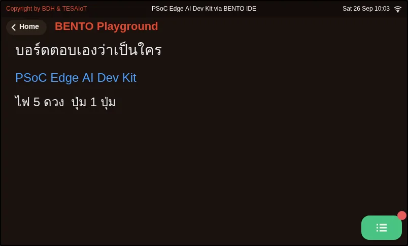

## Objectives

1. Open BENTO IDE and run the example file in the BENTO Emulator until the board name appears on the simulated screen
2. State at least two differences between the Eva Kit and the TESAIoT Dev Kit
3. Explain what the emulator can answer and what must be proven on a real board

## Before you start

- From the previous lesson, which part of a digital rice cooker "decides"?
- Without a board in your hands, how far do you think you can get learning to program one?

All you need for this lesson is a computer that can open Chrome or Edge (this lesson is designed for a computer or tablet screen, not a phone).

## See it work first

Do these steps first, then read the explanation.

1. Open **BENTO IDE** at https://ide.tesaiot.dev/
2. The IDE opens in the **Blocks** view (snapping blocks together instead of typing). Press the **Python** button at the top of the screen to switch to the code view
3. Copy the whole file from [examples/01_board_knows_itself.py](examples/01_board_knows_itself.py) and paste it into the code editor
4. Press the **BENTO Emulator** button on the toolbar. The emulator panel slides out on the right; press **▶ Run** in that panel
5. Look at the simulated screen. You should see the board name in blue, and a line saying how many LEDs and how many buttons it has

If you can see it, congratulations: you have just run a program on a (simulated) microcontroller for the first time.

**If you have a board in your hands**, connect it to your computer with a USB cable, press **Connect** in the top-right corner of the IDE and choose the board's port.
Then on the board's screen, tap the **BENTO Playground** card and leave it open, and press **Program to Device**. The result appears on the real board's screen.
The list of LEDs, one by one, is in the Console drawer, which you open with the green button in the bottom-right corner of the Playground page.

## Concepts

### 1. Two boards that use the same code

Courses in TESA Open Knowledge use two boards built around Infineon's **PSoC™ Edge E84** chip.

| | Eva Kit | TESAIoT Dev Kit |
|---|---|---|
| Technical name | KIT_PSE84_EVAL_EPC2 | SoM KIT_PSE84_AI on a QWA309 base board |
| LEDs that Python can control | 3 | 5 |
| Extra sensors | | Temperature and humidity (SHT40), air pressure (DPS368) and radar |
| Screen | 800 x 480 touchscreen | 800 x 480 touchscreen |

The data in this table comes from the AIoT in Action course, which uses both boards.

The example in this lesson does not remember how many LEDs the board has. It asks `gpio.board_info()`, which returns a bundle of data (a dict) with the board name, the number of LEDs and the list of LEDs.
That is why one piece of code runs on both boards, and in the emulator too.

The PSoC Edge E84 chip has more than one processor core. The BENTO firmware shares the work between the cores: for example, one core runs our MicroPython program
and another looks after the display and the touchscreen. For now, just keep this in mind as the reason some commands have to wait for "the other side" to finish.

### 2. MicroPython

The programs we write are in **MicroPython**, a version of Python made small enough to run on a microcontroller.
There is no compiling: press run and you see the result straight away, which suits beginners. Professional work that has to squeeze out speed or power uses the C language, which has its own separate course.

These boards have BENTO's own modules, which this course uses often: `ui` (drawing on the screen), `lcd` (the Console drawer), `gpio` (LEDs and buttons),
`sensors` (sensors), `wifi` and `mqtt` (networking).

### 3. What the emulator can answer, and what it cannot

The **BENTO Emulator** runs our MicroPython program in the browser and draws a screen the same size as the board's screen. The **HW** button in the emulator panel opens a simulated hardware panel
with LEDs, buttons, a knob and a tilt pad, so we can try programs without a board.

The emulator answers the questions "does the program run to the end, are there any errors, and what does the screen look like" very well.
But it is not a real board. Sensor values are simulated, the WiFi is simulated, and some timing issues and hardware limits can never show up in a browser.
The principle we use throughout the course is **use the emulator to learn concepts, use a real board to prove and measure**.

## Worked example

[examples/01_board_knows_itself.py](examples/01_board_knows_itself.py) is a shortened version of the example
[`examples/s01/10_board_knows_itself.py`](https://github.com/Advance-Innovation-Centre-AIC/embedded-systems-for-aiot-developer/blob/a80bbe88a34bcb9bb8d991f42f9252b77cdab079/examples/s01/10_board_knows_itself.py)
from the AIoT in Action course. Read through it in this order.

- **Move 1: ask the board** `info = gpio.board_info()` asks once and keeps the answer in a variable
- **Move 2: clear the screen** `ui.screen()` wipes what was on the screen, then waits 200 milliseconds for the screen to be ready
- **Move 3: place a label** `ui.Label(text, x=..., y=..., color=..., value=font_size)`, then tap `ui.poll()` so the label appears at once
- **Move 4: write to the drawer** `lcd.print(...)` for details too long for the screen

**Screens from the BENTO Emulator** for this lesson's examples (click a file name to open the code)

<figure><figcaption><a href="examples/01_board_knows_itself.py"><code>01_board_knows_itself.py</code></a></figcaption></figure>

## Practice

At the end of the example file there is a "your turn" task: add a loop that prints the list of buttons from `info["btn_names"]`, in the same way as the loop that prints the list of LEDs.
Before you run it, predict how many buttons the emulator will report, then run it and compare.

## Check your understanding

Answer the questions in [quiz.yaml](quiz.yaml). A score of 80% or more passes.

## Going further

- Press **HW** and see what the simulated hardware panel contains. In the next lesson we will control the LEDs on that panel.
- If you want to know how a real board answers differently from the emulator, open the original file
  [`examples/s01/10_board_knows_itself.py`](https://github.com/Advance-Innovation-Centre-AIC/embedded-systems-for-aiot-developer/blob/a80bbe88a34bcb9bb8d991f42f9252b77cdab079/examples/s01/10_board_knows_itself.py),
  which goes on to ask the board which commands the `machine` module has.

## Reflect

If you had to decide whether to buy a board, what information from this lesson would help you decide, and what would you still need to find out?
