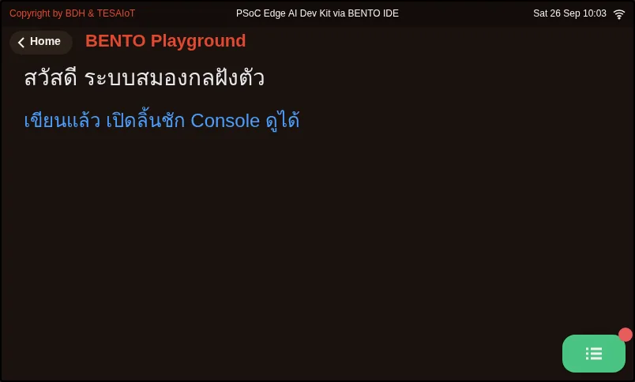
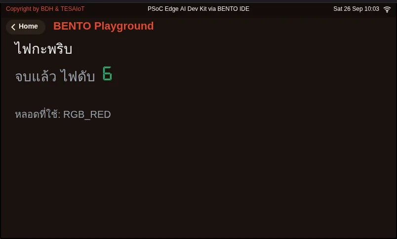

## Objectives

1. Place a text label on the screen with `ui.Label` and print to the Console drawer with `lcd.print`, and have it run without errors
2. Blink an LED with `gpio.led(n).on()` / `off()` and `time.sleep_ms()` for a given number of times
3. Predict a result before running it, and explain why the program should end with `led.off()`

## Before you start

- From the previous lesson, which command makes a label appear on screen as soon as it is created?
- In the emulator, which button opens the simulated hardware panel that has the LEDs?

## See it work first

Before reading the code, **predict** first. Open [examples/02_blink.py](examples/02_blink.py) and read only the top three lines that set `ROUNDS`, `ON_MS` and `OFF_MS`,
then write on paper "how many times will the light blink, and how long does each blink last?"

Then **run** it in the BENTO Emulator (press **HW** to open the simulated hardware panel first, then press **▶ Run**), or on a real board with **Program to Device**,
and compare it with what you predicted.

## Concepts

### 1. One line of text can go to three places

| Command | Where the text goes | Who sees it |
|---|---|---|
| `ui.Label("...")` | On the screen, at the given x, y position | Someone looking at the screen |
| `lcd.print("...")` | The Console drawer on the screen (opened with the green button in the bottom-right corner) | Someone who opens the drawer |
| `print("...")` | The console on the computer side | Someone sitting at the computer |

These are three different places. Many beginners run their program and say "I don't see anything", when the text is actually waiting in a different place.
Run [examples/01_hello_screen.py](examples/01_hello_screen.py) and find the text in all three places.

### 2. One blink is four beats

Turn on, wait, turn off, wait. The waiting time is what sets the rhythm. A microcontroller runs very fast, so without `time.sleep_ms()`
the light would turn on and off too quickly for the eye to catch.

`led.on()` and `led.off()` set the value directly: read one line and you know exactly what the light will do. That is why we choose these two commands first.

### 3. A good program says which state it ends in

If a program ends while the light is on, the light stays on forever with nobody intending it. In real work, such as a warning light in a factory, this can mislead people.
Every example file in this course therefore starts with `led.off()` (start from a known state) and ends with `led.off()` (end at a known state).

## Worked example

[examples/02_blink.py](examples/02_blink.py) is a shortened version of
[`examples/s03/02_led_blink.py`](https://github.com/Advance-Innovation-Centre-AIC/embedded-systems-for-aiot-developer/blob/a80bbe88a34bcb9bb8d991f42f9252b77cdab079/examples/s03/02_led_blink.py)
from the AIoT in Action course.

- **Move 1: pick a light** Ask for the list of LEDs from `gpio.board_info()` and pick the one whose name starts with `RGB_`; use the first one if there is none
- **Move 2: start from a known state** `led.off()`
- **Move 3: place a label and a number** A status label, plus `ui.Seg7` showing a number like a digital clock
- **Move 4: loop the blink** In a `for` loop: turn on, update the label, wait, turn off, count the round, wait
- **Move 5: end at a known state** `led.off()` again

The file [examples/01_hello_screen.py](examples/01_hello_screen.py) is a shortened version of
[`examples/s01/01_first_line.py`](https://github.com/Advance-Innovation-Centre-AIC/embedded-systems-for-aiot-developer/blob/a80bbe88a34bcb9bb8d991f42f9252b77cdab079/examples/s01/01_first_line.py)
and uses the same Move 3.

**Screens from the BENTO Emulator** for this lesson's examples (click a file name to open the code)

<figure><figcaption><a href="examples/01_hello_screen.py"><code>01_hello_screen.py</code></a></figcaption></figure>
<figure><figcaption><a href="examples/02_blink.py"><code>02_blink.py</code></a></figcaption></figure>

## Practice

Open [practice/blink_count.py](practice/blink_count.py). It has 2 blanks to fill in (lines starting with `# fill in:`)

- Blank 1: turn the light on
- Blank 2: add one to the counter, then write the new number to the screen

If you would like to practise without typing, first try arranging the code lines in quiz question 3 into the right order (a Parsons problem), then come back and fill in the real file.

## Solution

Try it yourself for at least 15 minutes first, then open [solution/blink_count.py](solution/blink_count.py) and compare.
The comments in the solution explain "why" you count while the light is off, and why you need `str()` before passing a value to `Seg7`.

## Check your understanding

Answer the questions in [quiz.yaml](quiz.yaml). A score of 80% or more passes.

## Lab

**Modify** Set `ON_MS = 50` and `OFF_MS = 950` in [examples/02_blink.py](examples/02_blink.py). Predict what the light will look like first, then run it for real.

**Make** Write a new program that blinks a short–long code, for example three short blinks, three long blinks, three short blinks,
then take a screenshot (or a short clip if you are using a real board) and keep it as evidence in your portfolio.

## Going further

A blinking light is the "Hello, World" of the embedded world. If you would like to see how a single LED can be dimmed,
look at the example [`examples/s03/03_led_brightness.py`](https://github.com/Advance-Innovation-Centre-AIC/embedded-systems-for-aiot-developer/blob/a80bbe88a34bcb9bb8d991f42f9252b77cdab079/examples/s03/03_led_brightness.py)
in the AIoT in Action course.

## Reflect

Did your prediction differ from what actually happened when you ran it? If it did, why? Does predicting before running change the way you read code?
