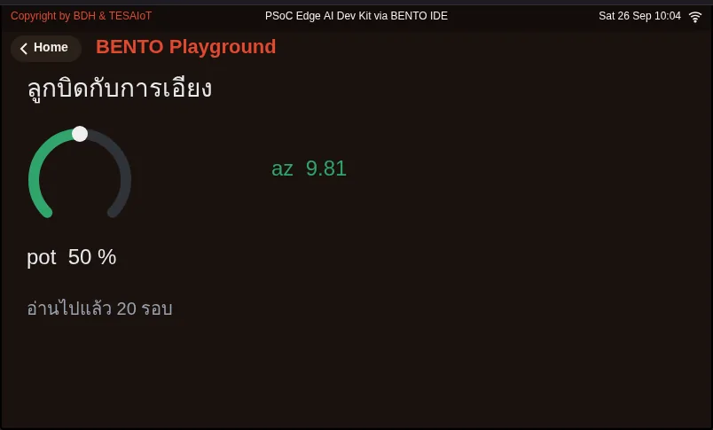

<style>
section { font-size: 24px; padding: 40px 52px; justify-content: flex-start; }
section h1 { font-size: 1.45em; line-height: 1.12; margin: 0 0 .22em; }
section h2 { font-size: 1.12em; margin: .15em 0; }
section h3 { font-size: 1.0em; margin: .12em 0; }
section p, section li { margin: .16em 0; line-height: 1.32; }
section img { max-width: 100%; height: auto; }
section svg { max-height: 250px; }
section table { font-size: .78em; }
section pre { font-size: .70em; line-height: 1.32; background:#0d1117; color:#e6edf3; border:1px solid #30363d; border-radius:8px; padding:12px 16px; box-shadow:0 2px 8px rgba(0,0,0,.25); }
section pre code { white-space: pre-wrap; background:transparent; color:inherit; } section pre .hljs-comment{color:#8b949e;font-style:italic} section pre .hljs-keyword,section pre .hljs-built_in,section pre .hljs-literal{color:#ff7b72} section pre .hljs-string{color:#a5d6ff} section pre .hljs-number{color:#79c0ff} section pre .hljs-title,section pre .hljs-title.function_,section pre .hljs-section{color:#d2a8ff} section pre .hljs-meta{color:#ffa657} section pre .hljs-attr,section pre .hljs-attribute,section pre .hljs-name{color:#7ee787}
section blockquote { margin: .25em 0; font-size: .92em; }
/* two images on a line (parity / 2x2 grids) stay side-by-side and small */
section p > img + img { margin-left: 10px; }
/* scroll-within-slide: dense slides scroll instead of clipping */
section { overflow-y: auto; overflow-x: hidden; }
section::-webkit-scrollbar { width: 11px; }
section::-webkit-scrollbar-thumb { background:#4a90d9; border-radius:6px; }
section::-webkit-scrollbar-track { background:rgba(0,0,0,.06); }
/* image drop-shadow + cover-slide readability (auto) */
section img{filter:drop-shadow(0 3px 12px rgba(0,0,0,.5))}
section.cover *{color:#fff !important}
section.cover h1,section.cover h2,section.cover h3,section.cover p,section.cover li,section.cover strong,section.cover em,section.cover blockquote,section.cover div{text-shadow:0 2px 9px rgba(0,0,0,.92),0 0 3px rgba(0,0,0,.8)}
section.cover div[style*="background:#"],section.cover div[style*="background: #"]{background:rgba(10,14,20,.66) !important;border-color:rgba(120,200,255,.45) !important;max-width:62%}
section.cover blockquote{border-left:4px solid rgba(120,200,255,.6) !important;background:rgba(13,17,23,.55) !important;border-radius:6px;padding:.3em .6em}
section.cover h1,section.cover h2,section.cover h3,section.cover p,section.cover blockquote{max-width:60%}
section.cover div:not(:has(img)){max-width:62%}
section.cover img{filter:none}
</style>

<!-- _class: cover -->
<!-- _backgroundColor: #0d1117 -->

# บทเรียน 2.1 — อ่านเซนเซอร์แล้วดูค่าเปลี่ยน

## ขอค่าลูกบิดและค่าความเร่งจาก sensors.snapshot() แล้วเขียนไฟเตือนเมื่อบอร์ดเอียง

**โมดูล 2 — รับรู้ เชื่อมต่อ แล้วไปต่อ**

หลักสูตร **Explorer: เปิดโลกระบบสมองกลฝังตัว**

---

## เป้าหมาย

1. อ่านค่า `pot` กับ `az` จาก `sensors.snapshot()` แล้วแสดงบนจอให้เปลี่ยนตามมือ
2. อธิบายได้ว่าทำไมต้องถามคีย์ด้วย `in` และดัก `OSError`
3. เติมโปรแกรมไฟเตือนเมื่อบอร์ดเอียงให้ทำงานถูก

---

## ก่อนเริ่ม

- ในบทที่แล้ว ทำไมเราต้องแปลงตัวเลขด้วย `str()` ก่อนส่งให้ `Seg7`
- จากบทแรก เซนเซอร์อยู่ในจังหวะไหนของ "รับรู้ ตัดสินใจ สั่งงาน"

---

## ดูของจริงก่อน

1. เปิด [examples/01_knob_and_tilt.py](examples/01_knob_and_tilt.py) ใน BENTO IDE แล้วรันใน BENTO Emulator
2. กด **HW** เปิดแผงฮาร์ดแวร์จำลอง แล้ว **หมุนลูกบิด POTEN** ดูวงแหวนบนจอกวาดตาม
3. ลาก **แผ่นเอียง** บนแผงเดียวกัน ดูตัวเลข `az` เปลี่ยน และสีเปลี่ยนเป็นส้มเมื่อเอียงมาก

ถ้าใช้บอร์ดจริง หมุนลูกบิดบนบอร์ด และเอียงบอร์ดด้วยมือ ผลจะเหมือนกัน

---

## ภาพจอจาก BENTO Emulator

<figure></figure>

[01_knob_and_tilt.py](examples/01_knob_and_tilt.py)

---

## แนวคิด — ถามครั้งเดียว ได้ทุกเซนเซอร์

`sensors.snapshot()` คืนข้อมูลก้อนเดียว (dict) ที่มีค่าเซนเซอร์หลายตัวซึ่งอ่านมาจากเวลาเดียวกัน

```python
{
    "pot":    {"percent": 42.5, ...},              # ลูกบิดหมุน 0-100
    "bmi270": {"ax": 0.1, "ay": -0.2, "az": 9.8},   # ความเร่ง หน่วย m/s^2
}
```

ลูกบิดหมุนคือตัวต้านทานปรับค่าได้ บอร์ดอ่านแรงดันจากมันด้วย **ADC** แล้วแปลงเป็นเปอร์เซ็นต์

`bmi270` คือชิปวัดความเคลื่อนไหว ตอนวางราบ แรงโน้มถ่วงทำให้ `az` อยู่ราว 9.8 พอเอียง ค่านี้ลดลง

---

## แนวคิด — ถามก่อนหยิบ

คีย์ในก้อนมีเท่าที่บอร์ดมีให้ ไม่ได้มีครบเสมอ

ถ้าเขียน `s["pot"]` ตรง ๆ บนบอร์ดที่ไม่มีลูกบิด โปรแกรมจะหยุดด้วย `KeyError`

วิธีที่ปลอดภัยคือถามก่อนด้วย `if "pot" in s:` แล้วค่อยอ่าน

---

## แนวคิด — บอร์ดจริงอาจยังไม่พร้อม

หลังเปิดเครื่องใหม่ ๆ บอร์ดจริงอาจยังไม่พร้อมตอบเรื่องเซนเซอร์อยู่ครู่หนึ่ง ช่วงนั้น `snapshot()` จะโยน `OSError` ออกมา — ไม่ได้แปลว่าโค้ดผิด เราจึงครอบด้วย `try` / `except OSError` แล้วลองใหม่รอบหน้า

ในอีมูเลเตอร์ บรรทัดนี้แทบไม่เคยโยน `OSError` เลย

> **โปรแกรมที่ผ่านในอีมูเลเตอร์ยังต้องเขียนเผื่อบอร์ดจริงเสมอ**

---

## ตัวอย่างสมบูรณ์

[examples/01_knob_and_tilt.py](examples/01_knob_and_tilt.py) ย่อมาจากตัวอย่างของหลักสูตร AIoT in Action

```python
try:                                # ท่าที่ 3: ขอค่าอย่างปลอดภัย
    s = sensors.snapshot()
except OSError:
    time.sleep_ms(200)
    continue

if "pot" in s:                      # ท่าที่ 4: ถามก่อนหยิบ
    ring.value(int(s["pot"]["percent"]))

if "bmi270" in s and s["bmi270"]["az"] < TILT_THRESHOLD:
    status.color(COL_WARN)          # ท่าที่ 5: เปลี่ยนสีตามความหมาย
```

**ท่าที่ 1** วางของบนจอครั้งเดียวนอกลูป · **ท่าที่ 2** วนถามทุก 200 ms จนครบ 20 วินาที

---

## ฝึกเติม

เปิด [practice/tilt_alarm.py](practice/tilt_alarm.py) — มีช่องให้เติม 4 จุด

- เติม 1 ขอค่าเซนเซอร์ทั้งก้อน
- เติม 2 เงื่อนไขว่ามีคีย์ `bmi270` อยู่ในก้อน
- เติม 3 ไฟติดพร้อมป้าย "เอียง"
- เติม 4 ไฟดับพร้อมป้าย "วางราบ"

ลองเองก่อนอย่างน้อย 15 นาที แล้วเปิด [solution/tilt_alarm.py](solution/tilt_alarm.py) เทียบ

---

## เช็กความเข้าใจ

ตอบคำถามใน [quiz.yaml](quiz.yaml) ถูกตั้งแต่ 80% ขึ้นไปถือว่าผ่าน

1. ถ้า `s = sensors.snapshot()` เราอ่านเปอร์เซ็นต์ของลูกบิดได้ด้วยนิพจน์ใด
2. วางบอร์ดราบบนโต๊ะ ค่า `az` ควรอยู่ราวเท่าไร
3. ทำไมจึงเขียน `if "pot" in s` ก่อนอ่าน `s["pot"]`
4. บนบอร์ดจริง ถ้า `sensors.snapshot()` โยน `OSError` ตอนเพิ่งเปิดเครื่อง ควรทำอย่างไร
5. เรียงบรรทัดของไฟเตือนเมื่อเอียงให้ถูกลำดับ

---

## แล็บ

**สร้างเอง:** แก้ไฟเตือนให้ใช้ลูกบิดตั้งเกณฑ์แทนตัวเลขตายตัว เช่น หมุนลูกบิดไปที่ 50% แปลว่าเกณฑ์เป็นกลาง ๆ

ถ่ายภาพหน้าจอตอนไฟเตือนติด เก็บไว้ใน portfolio พร้อมเขียนหนึ่งบรรทัดว่าเกณฑ์ที่คุณเลือกมาจากไหน

---

## ไปต่อ

ค่าจากเซนเซอร์จริงไม่เคยนิ่งสนิท มีสัญญาณรบกวนปนมาเสมอ หลักสูตร AIoT in Action มีตัวอย่างที่ทำให้ค่านิ่งขึ้นด้วยฟิลเตอร์ เช่น [`06_ema_time_constant.py`](https://github.com/Advance-Innovation-Centre-AIC/embedded-systems-for-aiot-developer/blob/a80bbe88a34bcb9bb8d991f42f9252b77cdab079/examples/s05/06_ema_time_constant.py) และการแปลงค่า ADC เป็นโวลต์ใน [`05_adc_counts_to_volts.py`](https://github.com/Advance-Innovation-Centre-AIC/embedded-systems-for-aiot-developer/blob/a80bbe88a34bcb9bb8d991f42f9252b77cdab079/examples/s05/05_adc_counts_to_volts.py)

บทถัดไป: [บทเรียน 2.2 — ของที่คุยกันได้: MQTT และแดชบอร์ด](../l02-connected-things/README.md)

---

## แหล่งที่มาและเครดิต

"Explorer: เปิดโลกระบบสมองกลฝังตัว" จาก TESA Open Knowledge โดยสมาคมสมองกลฝังตัวไทย
(Thai Embedded Systems Association: TESA) https://github.com/tesaiot/tesa-qualification-program
สัญญาอนุญาต CC BY 4.0

ดัดแปลงจาก AIoT in Action — Embedded Systems for AIoT Developer, © 2026 รศ.วิรุฬห์ ศรีบริรักษ์
วิศวกรรมระบบสมองกลฝังตัว มหาวิทยาลัยบูรพา (BUU) · Advance Innovation Centre (AIC) · BENTO & TESAIoT (CC BY 4.0 / MIT)
