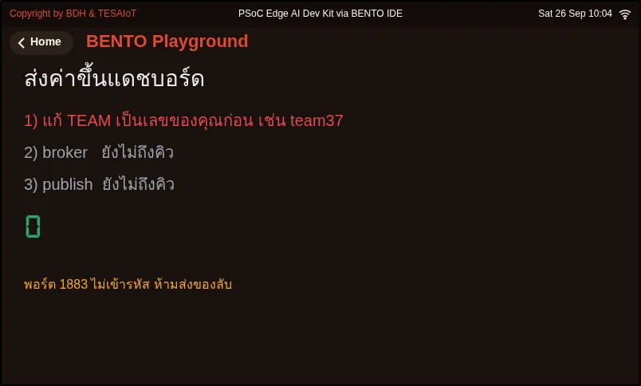

<style>
section { font-size: 24px; padding: 40px 52px; justify-content: flex-start; }
section h1 { font-size: 1.45em; line-height: 1.12; margin: 0 0 .22em; }
section h2 { font-size: 1.12em; margin: .15em 0; }
section h3 { font-size: 1.0em; margin: .12em 0; }
section p, section li { margin: .16em 0; line-height: 1.32; }
section img { max-width: 100%; height: auto; }
section svg { max-height: 250px; }
section table { font-size: .78em; }
section pre { font-size: .70em; line-height: 1.32; background:#0d1117; color:#e6edf3; border:1px solid #30363d; border-radius:8px; padding:12px 16px; box-shadow:0 2px 8px rgba(0,0,0,.25); }
section pre code { white-space: pre-wrap; background:transparent; color:inherit; } section pre .hljs-comment{color:#8b949e;font-style:italic} section pre .hljs-keyword,section pre .hljs-built_in,section pre .hljs-literal{color:#ff7b72} section pre .hljs-string{color:#a5d6ff} section pre .hljs-number{color:#79c0ff} section pre .hljs-title,section pre .hljs-title.function_,section pre .hljs-section{color:#d2a8ff} section pre .hljs-meta{color:#ffa657} section pre .hljs-attr,section pre .hljs-attribute,section pre .hljs-name{color:#7ee787}
section blockquote { margin: .25em 0; font-size: .92em; }
/* two images on a line (parity / 2x2 grids) stay side-by-side and small */
section p > img + img { margin-left: 10px; }
/* scroll-within-slide: dense slides scroll instead of clipping */
section { overflow-y: auto; overflow-x: hidden; }
section::-webkit-scrollbar { width: 11px; }
section::-webkit-scrollbar-thumb { background:#4a90d9; border-radius:6px; }
section::-webkit-scrollbar-track { background:rgba(0,0,0,.06); }
/* image drop-shadow + cover-slide readability (auto) */
section img{filter:drop-shadow(0 3px 12px rgba(0,0,0,.5))}
section.cover *{color:#fff !important}
section.cover h1,section.cover h2,section.cover h3,section.cover p,section.cover li,section.cover strong,section.cover em,section.cover blockquote,section.cover div{text-shadow:0 2px 9px rgba(0,0,0,.92),0 0 3px rgba(0,0,0,.8)}
section.cover div[style*="background:#"],section.cover div[style*="background: #"]{background:rgba(10,14,20,.66) !important;border-color:rgba(120,200,255,.45) !important;max-width:62%}
section.cover blockquote{border-left:4px solid rgba(120,200,255,.6) !important;background:rgba(13,17,23,.55) !important;border-radius:6px;padding:.3em .6em}
section.cover h1,section.cover h2,section.cover h3,section.cover p,section.cover blockquote{max-width:60%}
section.cover div:not(:has(img)){max-width:62%}
section.cover img{filter:none}
</style>

<!-- _class: cover -->
<!-- _backgroundColor: #0d1117 -->

# บทเรียน 2.2 — ของที่คุยกันได้: MQTT และแดชบอร์ด

## ส่งค่าเซนเซอร์ขึ้น broker สาธารณะให้ไปโผล่บนหน้าเว็บอ่านค่า

**โมดูล 2 — รับรู้ เชื่อมต่อ แล้วไปต่อ**

หลักสูตร **Explorer: เปิดโลกระบบสมองกลฝังตัว** · ต่อจากบทเรียน 2.1

---

## เป้าหมาย

1. อธิบายบทบาทของ broker, topic, publish และ subscribe ได้
2. รันตัวอย่างให้ค่าเซนเซอร์ขึ้นหน้าเว็บอ่านค่า หรือบอกได้ว่าติดที่ขั้นไหน
3. ระบุความเสี่ยงของ broker สาธารณะที่ไม่เข้ารหัสได้อย่างน้อย 2 ข้อ

---

## ก่อนเริ่ม

- ในบทที่แล้ว คีย์ไหนของ `sensors.snapshot()` เก็บค่าลูกบิด
- ถ้าอยากให้เพื่อนอีกจังหวัดเห็นค่าลูกบิดบนบอร์ดของเรา ข้อมูลต้องเดินทางผ่านอะไรบ้าง

---

## ดูของจริงก่อน (ตัวอย่างนำทาง)

1. เปิด [examples/01_send_to_dashboard.py](examples/01_send_to_dashboard.py) ใน BENTO IDE
2. แก้บรรทัด `TEAM = "teamXX"` เป็นเลขสองหลักที่คุณเลือกเอง เช่น `"team37"`
3. ถ้าใช้บอร์ดจริง แก้ `WIFI_SSID`/`WIFI_PASS` — ถ้าใช้อีมูเลเตอร์ไม่ต้องแก้
4. เปิดแท็บใหม่ ไปที่หน้าอ่านค่าของ AIoT in Action ต่อท้ายด้วยเลขทีมเดียวกัน
5. กลับมารันโปรแกรม ดูป้ายสามขั้นบนจอเปลี่ยนเป็นสีเขียว แล้วดูหน้าเว็บ ตัวเลข `knob` และ `az` ควรขึ้นและเปลี่ยนทุก 2 วินาที
6. หมุนลูกบิดหรือเอียงบอร์ด แล้วดูเลขบนหน้าเว็บขยับตาม

> ถ้าอีมูเลเตอร์ต่อ broker จริงไม่ได้ มันจะถอยไปใช้ broker จำลองแทน และหน้าเว็บจะไม่เห็นอะไร — ไม่ใช่ความผิดของโค้ด ลองใหม่ภายหลังหรือจากเครือข่ายอื่น

---

## ภาพจอจาก BENTO Emulator

<figure></figure>

[01_send_to_dashboard.py](examples/01_send_to_dashboard.py)

---

## แนวคิด — ไปรษณีย์กลางชื่อ broker

**MQTT** เป็นวิธีส่งข้อความสั้น ๆ ระหว่างอุปกรณ์ หัวใจของมันคือ **broker** ซึ่งเปรียบได้กับไปรษณีย์กลาง

- อุปกรณ์ที่มีข้อมูลจะ **publish** (ส่ง) ข้อความไปที่ broker พร้อมระบุ **topic** (หัวข้อ)
- ใครก็ตามที่อยากรู้เรื่องนั้นจะ **subscribe** (บอกรับ) หัวข้อนั้นไว้กับ broker
- broker ส่งต่อข้อความให้ทุกคนที่บอกรับหัวข้อนั้น ผู้ส่งกับผู้รับไม่ต้องรู้จักกันเลย

```text
  บอร์ด ──publish──►  broker  ──ส่งต่อ──►  หน้าเว็บที่ subscribe ไว้
          bento-aiot/team37/telemetry
```

บอร์ดเป็นผู้ publish หน้าเว็บอ่านค่าเป็นผู้ subscribe หัวข้อ `bento-aiot/team37/#` — เครื่องหมาย `#` แปลว่า "ทุกหัวข้อย่อยที่อยู่ใต้นี้"

---

## แนวคิด — บันไดสามขั้นที่ห้ามสลับ

ข้อมูลจะออกจากบอร์ดได้ต้องผ่านสามขั้นตามลำดับ

1. **WiFi ต้องได้เลข IP ก่อน**
2. จึง **แนะนำตัวกับ broker** ได้
3. แล้วจึง **publish** ได้

ตัวอย่างวาดป้ายสามขั้นบนจอ ขั้นที่ผ่านเป็นสีเขียว ขั้นที่ไม่ผ่านเป็นสีแดงพร้อมเหตุผล

> โปรแกรมที่ดีบอกได้เสมอว่าติดที่ขั้นไหน

---

## แนวคิด — ข้อความหน้าตาอย่างไร และความเสี่ยง

ค่าที่ส่งถูกจัดเป็นข้อความรูปแบบ **JSON** ด้วย `json.dumps()`

```json
{"id": "team37", "n": 5, "knob": 42, "az": 9.79}
```

หน้าเว็บอ่านค่าวาดกล่องหนึ่งกล่องต่อหนึ่งคีย์ จึงไม่ต้องแก้หน้าเว็บเมื่อเราเพิ่มคีย์ใหม่

`broker.hivemq.com` ที่พอร์ต 1883 เปิดให้ทุกคนใช้ฟรีและ **ไม่เข้ารหัส** — ใครก็ subscribe หัวข้อของเราได้ และใครก็ publish ปลอมเข้ามาในหัวข้อเดียวกันได้

> เหมาะกับการเรียนเท่านั้น งานจริงใช้ **MQTTs** (ผ่าน TLS) กับ broker ที่ต้องยืนยันตัวตน

---

## ตัวอย่างสมบูรณ์

[examples/01_send_to_dashboard.py](examples/01_send_to_dashboard.py) ย่อมาจากตัวอย่างของหลักสูตร AIoT in Action

```python
if wifi.connect(WIFI_SSID, WIFI_PASS) and wifi.ip() != "0.0.0.0":
    step1.color(COL_OK)              # ท่าที่ 2: WiFi ได้เลข IP

if mqtt.connect(BROKER, port=1883, client_id=TEAM, keepalive=60):
    step2.color(COL_OK)              # ท่าที่ 3: แนะนำตัวกับ broker

body = json.dumps({"id": TEAM, "n": n, "knob": knob, "az": az})
mqtt.publish(TOPIC, body)            # ท่าที่ 4: publish ทุก 2 วินาที
```

**ท่าที่ 1** ตรวจ `TEAM` — ถ้ายังเป็น `teamXX` โปรแกรมไม่ยอมรัน · **ท่าที่ 5** `mqtt.is_connected()` ตอบว่า "ตอนนี้" ยังต่ออยู่ไหม

---

## เช็กความเข้าใจ

ตอบคำถามใน [quiz.yaml](quiz.yaml) ถูกตั้งแต่ 80% ขึ้นไปถือว่าผ่าน

1. ใน MQTT ใครทำหน้าที่ส่งต่อข้อความจากผู้ส่งไปยังผู้ที่บอกรับหัวข้อนั้น
2. หน้าเว็บ subscribe หัวข้อ `bento-aiot/team37/#` จะได้รับข้อความจากหัวข้อใด
3. เรียงบันไดสามขั้นที่ข้อมูลต้องผ่านก่อนออกจากบอร์ด
4. ป้ายขั้นที่ 1 เป็นสีเขียว แต่ขั้นที่ 2 เป็นสีแดงว่า "ต่อไม่ได้ เน็ตอาจกันพอร์ต 1883" สาเหตุที่เป็นไปได้มากที่สุดคือข้อใด
5. ข้อใดคือความเสี่ยงของการใช้ broker สาธารณะที่พอร์ต 1883 (เลือกได้มากกว่าหนึ่งข้อ)

---

## แล็บ

วาดแผนภาพของคุณเองบนกระดาษ แสดงเส้นทางของข้อความหนึ่งใบจากลูกบิดไปจนถึงตัวเลขบนหน้าเว็บ ให้มีคำว่า broker, topic, publish และ subscribe ครบ

ถ่ายรูปแผนภาพคู่กับภาพหน้าจอหน้าเว็บที่เห็นค่าของคุณ (หรือภาพป้ายบนจอที่บอกว่าติดขั้นไหน) เก็บไว้ใน portfolio

---

## ไปต่อ

- หลักสูตร [AIoT in Action](../../../aiot-micropython/README.md) ต่อยอดเรื่องนี้ไปถึงการรับคำสั่งกลับจากหน้าเว็บ และการส่งข้อมูลแบบเข้ารหัสขึ้น TESAIoT Platform
- อ่านเพิ่มเรื่อง MQTT ได้ที่ https://mqtt.org/

บทถัดไป: [บทเรียน 2.3 — ไปต่อทางไหนดี และแบ่งปันอย่างไรให้ถูก](../l03-where-next/README.md)

---

## แหล่งที่มาและเครดิต

"Explorer: เปิดโลกระบบสมองกลฝังตัว" จาก TESA Open Knowledge โดยสมาคมสมองกลฝังตัวไทย
(Thai Embedded Systems Association: TESA) https://github.com/tesaiot/tesa-qualification-program
สัญญาอนุญาต CC BY 4.0

ดัดแปลงจาก AIoT in Action — Embedded Systems for AIoT Developer, © 2026 รศ.วิรุฬห์ ศรีบริรักษ์
วิศวกรรมระบบสมองกลฝังตัว มหาวิทยาลัยบูรพา (BUU) · Advance Innovation Centre (AIC) · BENTO & TESAIoT (CC BY 4.0 / MIT)
หน้าเว็บอ่านค่าในบทเรียนนี้เป็นของหลักสูตร AIoT in Action เช่นกัน
